# Technical Specification

# 0. Agent Action Plan

## 0.1 Intent Clarification

#### Core Feature Objective

Based on the prompt, the Blitzy platform understands that the new feature requirement is to create a minimal Node.js tutorial project that demonstrates fundamental web server capabilities. The specific requirements are:

- **Primary Requirement**: Create a complete Node.js tutorial project from scratch
- **Endpoint Specification**: Implement a single HTTP GET endpoint at the path `/hello`
- **Response Behavior**: The endpoint must return the plain text string "Hello world" to any HTTP client making a request
- **Educational Purpose**: The project should serve as a beginner-friendly tutorial demonstrating basic Node.js web server functionality

**Implicit Requirements Detected**:
- The project requires a web framework (Express.js recommended as industry standard)
- A package management configuration file (package.json) is necessary
- The server must listen on a configurable port for HTTP connections
- Basic project structure with clear entry point
- Development dependencies for running and testing the server
- Documentation explaining how to install, run, and test the application
- The response should be properly formatted HTTP with appropriate headers

**Feature Dependencies and Prerequisites**:
- Node.js runtime environment (v20.x LTS recommended)
- npm package manager for dependency management
- Express.js framework for simplified HTTP server creation
- No database or external service dependencies required
- No authentication or authorization mechanisms needed

#### Special Instructions and Constraints

**Critical Directives**:
- **Simplicity First**: This is a tutorial project, so code should be minimal, clear, and well-commented
- **Industry Standards**: Use Express.js framework as it is the de facto standard for Node.js web applications
- **Best Practices**: Follow <cite index="1-1,1-2">modern JavaScript conventions using Promises and async/await where applicable</cite>
- **Tutorial Quality**: Include comprehensive documentation suitable for beginners

**Architectural Requirements**:
- Use Express.js framework following <cite index="1-19">Express as the most popular Node.js web framework</cite>
- Follow the standard <cite index="1-21,1-22">Express Hello World pattern with app.get() route handler and app.listen() server initialization</cite>
- Implement clean separation between route definition and server startup
- Use standard port 3000 for local development with environment variable override capability

**Project Conventions**:
- Entry point file named `index.js` or `app.js` (common Express conventions)
- Include `package.json` with proper metadata and start script
- Use modern JavaScript (ES6+) syntax with const/let declarations
- Include clear console logging for server startup confirmation

**User Example Reference**:
User requested: "a nodejs tutorial project that features one end point '/hello' that returns 'Hello world' to the calling HTTP client"

This requirement is straightforward and serves as the north star for all implementation decisions.

#### Technical Interpretation

These feature requirements translate to the following technical implementation strategy:

**To create the Node.js tutorial project**, we will:
- Initialize a new npm project with `package.json` configuration
- Install Express.js as the core web framework dependency
- Create a main application file with server logic

**To implement the `/hello` endpoint**, we will:
- Define an Express GET route handler at path `/hello`
- Configure the handler to return "Hello world" as plain text response
- Use Express's `res.send()` method for simple text responses

**To enable HTTP server functionality**, we will:
- Create an Express application instance
- Bind the server to port 3000 (with environment variable override)
- Implement graceful startup with console confirmation logging

**To ensure tutorial quality**, we will:
- Create comprehensive README.md documentation with installation, usage, and testing instructions
- Add clear inline code comments explaining each component
- Include npm scripts for easy server startup
- Provide example curl commands for testing the endpoint

**To maintain best practices**, we will:
- Use semantic versioning for all dependencies
- Follow Express.js recommended project structure
- Implement proper error handling for production readiness
- Include `.gitignore` to exclude `node_modules` directory

**Technical Component Mapping**:

| Requirement | Technical Component | Action | Purpose |
|-------------|-------------------|--------|---------|
| Node.js project | package.json | CREATE | Define project metadata, dependencies, and scripts |
| HTTP server | Express application | CREATE | Provide web framework and routing capabilities |
| `/hello` endpoint | Express GET route | CREATE | Handle requests to `/hello` path |
| "Hello world" response | Route handler function | IMPLEMENT | Return specified text to client |
| Server execution | app.listen() | IMPLEMENT | Start HTTP server on designated port |
| Documentation | README.md | CREATE | Provide installation and usage instructions |
| Dependency management | node_modules/ | INSTALL | Store Express and dependencies |

This implementation follows the <cite index="1-21,1-22">standard Express Hello World pattern where the application is initialized, routes are defined, and the server listens on a specified port</cite>.

## 0.2 Repository Scope Discovery

#### Comprehensive File Analysis

Since this is a new product creation (not modifying existing code), this section identifies all files that must be created for the Node.js tutorial project. The analysis below provides exhaustive coverage of all necessary project artifacts.

**Core Application Files**:

- **index.js** or **app.js** - Main application entry point
  - Purpose: Contains Express server initialization and route definitions
  - Responsibilities: Define `/hello` endpoint, start HTTP server, handle startup logging
  - Pattern: Standard Express application structure
  
**Package Management Files**:

- **package.json** - npm package manifest
  - Purpose: Define project metadata, dependencies, and npm scripts
  - Contents: Project name, version, main entry point, dependencies (Express), start script
  - Required fields: name, version, main, scripts, dependencies
  
- **package-lock.json** - Dependency lock file (auto-generated)
  - Purpose: Lock exact versions of all dependencies for reproducible installs
  - Management: Auto-generated by npm install, should be committed to version control

**Documentation Files**:

- **README.md** - Project documentation (MODIFY existing)
  - Current state: Contains only "10oct_7" header
  - Updated purpose: Comprehensive project documentation
  - Required sections:
    * Project title and description
    * Prerequisites (Node.js version)
    * Installation instructions
    * Running the server
    * Testing the endpoint (curl examples)
    * Project structure explanation
    * License information

**Configuration Files**:

- **.gitignore** - Git ignore patterns
  - Purpose: Exclude unnecessary files from version control
  - Critical entries:
    * node_modules/
    * npm-debug.log
    * .env
    * .DS_Store (macOS)
    * *.log files

- **.env.example** (Optional but recommended)
  - Purpose: Template for environment variables
  - Contents: PORT=3000 (example configuration)

**Testing and Quality Files** (Optional for enhanced tutorial):

- **tests/hello.test.js** - Basic endpoint tests
  - Purpose: Demonstrate testing practices for beginners
  - Framework: Could use Jest or Mocha
  - Coverage: Test `/hello` endpoint response

**No Existing Files Require Modification** (except README.md):
- The repository is essentially empty with only a placeholder README.md
- No integration points exist
- No existing configuration to update
- No legacy code to refactor

#### Web Search Research Conducted

Research was conducted on Node.js and Express.js best practices with the following findings:

**Express.js Framework Selection**:
- <cite index="1-19">Express is the most popular Node.js web framework</cite> and appropriate for this tutorial
- Industry-standard choice for HTTP server implementations
- Minimal learning curve for beginners

**Modern JavaScript Practices**:
- <cite index="7-1,7-2">Async-await is the simplest way to express asynchronous flow, making code more compact with try-catch support</cite>
- Arrow functions recommended for concise syntax
- Const/let preferred over var for variable declarations

**Project Structure Best Practices**:
- Single entry point file (index.js or app.js)
- Separation of concerns for larger projects (not required for this minimal tutorial)
- Package.json with clear start script
- Comprehensive README for user guidance

**Security and Production Considerations**:
- Environment variable support for configuration
- Proper error handling middleware
- Dependency version locking with package-lock.json

#### New File Requirements

**Complete File Inventory for Creation**:

**Essential Files (Must Create)**:

1. **index.js** - Main application file
   ```javascript
   // Express server with /hello endpoint
   ```
   - Lines of code: ~20-30
   - Dependencies: express
   - Exports: None (executable entry point)

2. **package.json** - Project manifest
   ```json
   // Project metadata and dependencies
   ```
   - Defines: Express dependency (~4.18.x or latest stable)
   - Scripts: start script using `node index.js`
   - Project metadata: name, version, description, license

3. **README.md** - Documentation (MODIFY existing)
   - Current: Single header "10oct_7"
   - Required: Complete tutorial documentation
   - Sections: Installation, Usage, Testing, Structure

4. **.gitignore** - Version control exclusions
   ```
   node_modules/
   npm-debug.log
   .env
   ```
   - Purpose: Keep repository clean
   - Prevent: Committing dependencies and logs

**Recommended Files (Should Create)**:

5. **.env.example** - Environment variable template
   ```
   PORT=3000
   ```
   - Purpose: Document configuration options
   - Usage: Copy to .env for local customization

6. **LICENSE** - Open source license file
   - Recommended: MIT License (permissive for tutorials)
   - Purpose: Define usage terms

**Optional Enhancement Files (May Create)**:

7. **tests/hello.test.js** - Basic test suite
   - Framework: Jest or Mocha
   - Coverage: Endpoint functionality
   - Purpose: Demonstrate testing to learners

8. **.nvmrc** - Node version specification
   ```
   20.19.5
   ```
   - Purpose: Lock Node.js version for consistency
   - Usage: Used by nvm for version switching

**Auto-Generated Files (Do Not Create Manually)**:

9. **node_modules/** - Dependency directory
   - Generated by: `npm install`
   - Contains: Express and all transitive dependencies
   - Size: ~50-100 packages typically

10. **package-lock.json** - Dependency lock file
    - Generated by: `npm install`
    - Purpose: Version locking for reproducibility
    - Management: Commit to version control

**File Organization Structure**:

```
nodejs-hello-tutorial/
├── index.js                 # Main application entry point
├── package.json             # Project manifest
├── package-lock.json        # Dependency lock (auto-generated)
├── README.md                # Project documentation
├── .gitignore              # Git exclusions
├── .env.example            # Environment variable template
├── LICENSE                 # Open source license (optional)
├── .nvmrc                  # Node version (optional)
├── node_modules/           # Dependencies (auto-generated)
└── tests/                  # Test directory (optional)
    └── hello.test.js       # Endpoint tests
```

**File Creation Priority**:

**Phase 1 - Core Functionality**:
- package.json (enables dependency installation)
- index.js (implements core functionality)
- .gitignore (prevents pollution)

**Phase 2 - Documentation**:
- README.md modification (user guidance)
- .env.example (configuration documentation)

**Phase 3 - Quality Enhancement**:
- LICENSE (legal clarity)
- .nvmrc (version management)
- tests/ (quality assurance)

**No Existing Files to Modify** (except README.md which requires complete rewrite):
- This is a greenfield project
- No legacy code exists
- No database migrations needed
- No existing API contracts to maintain

## 0.3 Dependency Inventory

#### Private and Public Packages

This Node.js tutorial project utilizes only public npm packages with no private dependencies. The following table provides a comprehensive inventory of all required packages:

**Production Dependencies**:

| Registry | Package Name | Version | Purpose | Justification |
|----------|-------------|---------|---------|---------------|
| npm | express | ^4.18.2 | Web application framework | Industry-standard HTTP server framework, <cite index="1-19">most popular Node.js web framework</cite> for routing and middleware |

**Development Dependencies** (Optional for enhanced tutorial):

| Registry | Package Name | Version | Purpose | Justification |
|----------|-------------|---------|---------|---------------|
| npm | nodemon | ^3.0.1 | Development auto-reload | Automatically restarts server on file changes, improves development experience |
| npm | jest | ^29.7.0 | Testing framework | Standard testing library for Node.js applications |
| npm | supertest | ^6.3.3 | HTTP assertion library | Enables testing Express routes and endpoints |

**Runtime Requirements**:

| Component | Version | Source | Purpose |
|-----------|---------|--------|---------|
| Node.js | 20.19.5 LTS | nodejs.org | JavaScript runtime environment |
| npm | 10.8.2 | Bundled with Node.js | Package manager |

**Dependency Rationale**:

**Express.js (^4.18.2)**:
- **Why this version**: Version 4.18.x is the current stable release with long-term support
- **Stability**: Mature framework with extensive community support and documentation
- **Features**: Provides routing, middleware support, HTTP helpers, and content negotiation
- **Size**: Lightweight core with minimal footprint (~200KB)
- **Alternatives considered**: Fastify (faster but less beginner-friendly), Koa (requires more boilerplate)
- **Tutorial suitability**: <cite index="1-21,1-22">Express Hello World examples are concise and beginner-friendly</cite>

**Version Pinning Strategy**:
- **Caret (^) ranges**: Used for Express to allow patch and minor updates
- **Rationale**: Enables automatic security patches while maintaining compatibility
- **Lock file**: package-lock.json ensures reproducible installs across environments

#### Dependency Updates

Since this is a new project creation, no existing dependencies require updates. This section documents the initial dependency configuration.

**Initial Package.json Configuration**:

```json
{
  "name": "nodejs-hello-tutorial",
  "version": "1.0.0",
  "description": "A simple Node.js tutorial demonstrating a Hello World HTTP endpoint",
  "main": "index.js",
  "scripts": {
    "start": "node index.js",
    "dev": "nodemon index.js"
  },
  "keywords": ["nodejs", "express", "tutorial", "hello-world"],
  "author": "",
  "license": "MIT",
  "dependencies": {
    "express": "^4.18.2"
  },
  "devDependencies": {
    "nodemon": "^3.0.1"
  },
  "engines": {
    "node": ">=18.0.0"
  }
}
```

**Import Statements Required**:

**In index.js**:
```javascript
const express = require('express');
```

**Module System**:
- **CommonJS**: Using `require()` syntax (default for Node.js)
- **Alternative**: Could use ES6 `import` with `"type": "module"` in package.json
- **Decision**: CommonJS chosen for maximum compatibility and tutorial simplicity

**No Import Updates Required**:
- This is a greenfield project with no existing import statements
- No legacy code to refactor
- No module system migration needed

**Environment Configuration**:

**Environment Variables**:
- **PORT**: Server listening port (default: 3000)
- **NODE_ENV**: Environment indicator (development/production)

**Configuration in .env.example**:
```
PORT=3000
NODE_ENV=development
```

**Dependency Installation Commands**:

**Initial setup**:
```bash
npm install
```

**Development mode with auto-reload**:
```bash
npm install --save-dev nodemon
```

**Security Considerations**:

**Vulnerability Management**:
- Use `npm audit` to check for known vulnerabilities
- Keep dependencies updated with `npm update`
- Monitor security advisories for Express.js
- <cite index="7-17,7-18">Even reputable dependencies like Express have known vulnerabilities from time to time that require monitoring</cite>

**Dependency Hygiene**:
- No unnecessary dependencies included
- Minimal attack surface with single production dependency
- Clear separation between production and development dependencies
- Package-lock.json committed for reproducible builds

**No External Service Dependencies**:
- No database connections required
- No third-party API integrations
- No authentication providers
- No cloud service dependencies
- Completely self-contained application

**Transitive Dependencies** (installed automatically with Express):
- accepts, array-flatten, body-parser, content-disposition, cookie, debug, encodeurl, escape-html, etag, finalhandler, fresh, merge-descriptors, methods, mime-types, parseurl, path-to-regexp, proxy-addr, qs, range-parser, safe-buffer, send, serve-static, setprototypeof, statuses, type-is, utils-merge, vary

**Total Dependency Count**:
- Direct dependencies: 1 (express)
- Transitive dependencies: ~50 packages
- Total installed packages: ~51 packages
- Disk space: ~10-15 MB in node_modules/

## 0.4 Integration Analysis

#### Existing Code Touchpoints

**Status: NOT APPLICABLE - New Product Creation**

This is a greenfield project creation with no existing codebase to integrate with. The repository currently contains only a placeholder README.md file with the header "10oct_7" and no programmatic content.

**No Direct Modifications Required**:
- No existing application code to modify
- No existing route handlers to update
- No existing middleware to extend
- No existing service layers to integrate with
- No existing configuration files to merge

**No Dependency Injections Required**:
- No existing dependency injection containers
- No service registration systems
- No existing application contexts
- Project will establish its own dependency patterns from scratch

**No Database/Schema Updates Required**:
- No existing database connections
- No schema migrations needed
- No data persistence layer
- Application is stateless with no data storage

**Single File Modification**:

**README.md** (MODIFY):
- **Current state**: Contains only header text "10oct_7"
- **Required action**: Complete rewrite to provide comprehensive project documentation
- **Integration consideration**: Preserve any existing project identifier if "10oct_7" has significance
- **Scope of change**: Full content replacement

**File-Level Integration Summary**:

| File | Current State | Action | Integration Complexity |
|------|--------------|--------|----------------------|
| README.md | Placeholder header only | REWRITE | None - simple text replacement |
| All other files | Do not exist | CREATE | None - new file creation |

**System Integration Points**:

**Operating System Integration**:
- HTTP port binding (default 3000)
- Process lifecycle management
- File system access for serving application
- No special permissions required

**Network Integration**:
- Binds to localhost interface (127.0.0.1)
- Listens on configurable HTTP port
- No external service calls
- No outbound network requirements

**Development Environment Integration**:
- Requires Node.js runtime (v20.19.5 LTS)
- Uses npm package manager
- No IDE-specific configuration
- No build system integration

**No CI/CD Integration Required Initially**:
- No existing pipeline to modify
- No deployment automation to update
- No test suites to extend
- Fresh project with no infrastructure

**No API Contract Changes**:
- No existing API to maintain
- No versioning strategy needed initially
- No backward compatibility concerns
- Establishing first API version (1.0.0)

**No Authentication/Authorization Integration**:
- No existing auth systems
- No user management
- No session handling
- No token validation
- Public endpoint with no security requirements

**Future Integration Considerations**:

While not required for the initial tutorial implementation, future enhancements might integrate:

**Potential Future Integration Points**:
- Logging framework (Winston, Pino, or Morgan)
- Database connection (PostgreSQL, MongoDB, MySQL)
- Authentication middleware (Passport.js, JWT)
- Additional route modules
- Error handling middleware
- Request validation (express-validator)
- CORS middleware for browser clients
- Rate limiting (express-rate-limit)

**Integration Preparation**:
The project structure is designed to allow easy integration of additional features:
- Modular Express app structure
- Environment variable configuration
- Middleware-ready architecture
- RESTful routing conventions

**No Breaking Changes**:
- No existing functionality to break
- No deprecated APIs to replace
- No migration scripts needed
- Clean slate implementation

**Integration Testing Requirements**:
- No integration tests required initially (no systems to integrate)
- Future integration testing would cover:
  * HTTP request/response cycle
  * Port binding and server startup
  * Graceful shutdown handling

**Summary**:
This new product creation requires no code integration work. The only modification is a complete rewrite of the README.md file. All other components are new creations with no integration dependencies, conflicts, or compatibility concerns.

## 0.5 Technical Implementation

#### File-by-File Execution Plan

This section provides a comprehensive execution plan for creating the Node.js tutorial project. Every file listed must be created following the specifications below.

#### Group 1 - Core Application Files

**CREATE: index.js** - Main application entry point
```javascript
const express = require('express');
const app = express();
const PORT = process.env.PORT || 3000;

// Route handler for /hello endpoint
app.get('/hello', (req, res) => {
  res.send('Hello world');
});

// Start server
app.listen(PORT, () => {
  console.log(`Server running on http://localhost:${PORT}`);
  console.log(`Test the endpoint: http://localhost:${PORT}/hello`);
});
```

**Implementation details**:
- Import Express framework using CommonJS require syntax
- Initialize Express application instance
- Define PORT with environment variable fallback to 3000
- Register GET route at `/hello` path using app.get()
- Implement route handler that sends "Hello world" text response
- Bind server to PORT with app.listen()
- Log startup confirmation with accessible URLs
- Total lines: ~15 lines of code

**Technical decisions**:
- Use `res.send()` for automatic content-type detection (text/html)
- Arrow functions for modern JavaScript syntax
- Const declarations for immutability
- Descriptive console logging for user guidance

#### Group 2 - Package Configuration

**CREATE: package.json** - npm package manifest
```json
{
  "name": "nodejs-hello-tutorial",
  "version": "1.0.0",
  "description": "A simple Node.js tutorial demonstrating a Hello World HTTP endpoint",
  "main": "index.js",
  "scripts": {
    "start": "node index.js",
    "dev": "nodemon index.js"
  },
  "keywords": ["nodejs", "express", "tutorial", "hello-world", "beginner"],
  "author": "",
  "license": "MIT",
  "dependencies": {
    "express": "^4.18.2"
  },
  "devDependencies": {
    "nodemon": "^3.0.1"
  },
  "engines": {
    "node": ">=18.0.0"
  }
}
```

**Implementation details**:
- Define project metadata (name, version, description)
- Specify index.js as main entry point
- Include start script using `node index.js`
- Include dev script using nodemon for auto-reload during development
- List Express as sole production dependency with caret versioning
- Include nodemon as optional development dependency
- Specify Node.js engine requirement (v18+)
- Add descriptive keywords for npm registry discoverability
- Use MIT license (permissive open source)

**CREATE: .gitignore** - Version control exclusions
```
# Dependencies
node_modules/

#### Logs
npm-debug.log*
yarn-debug.log*
yarn-error.log*
*.log

#### Environment variables
.env
.env.local

#### OS files
.DS_Store
Thumbs.db

#### IDE directories
.vscode/
.idea/
*.swp
*.swo
```

**Implementation details**:
- Exclude node_modules directory (prevents committing dependencies)
- Ignore log files from npm, yarn, and general logging
- Exclude environment variable files (.env) for security
- Filter OS-specific files (macOS, Windows)
- Ignore common IDE configuration directories
- Standard Node.js gitignore patterns

#### Group 3 - Configuration and Documentation

**CREATE: .env.example** - Environment variable template
```
# Server Configuration
PORT=3000

#### Environment
NODE_ENV=development
```

**Implementation details**:
- Document available configuration options
- Provide sensible defaults
- Include inline comments explaining each variable
- Template for users to copy to .env for local customization

**MODIFY: README.md** - Project documentation

Current content: Single header "10oct_7"

New complete content:
```
# Node.js Hello World Tutorial

A simple Node.js tutorial project demonstrating how to create a basic HTTP server with a single endpoint using Express.js.

#### Description

This project serves as a beginner-friendly introduction to Node.js web development. It implements a minimal HTTP server with one endpoint (`/hello`) that returns "Hello world" to any HTTP client.

#### Prerequisites

- Node.js v18.0.0 or higher (v20.19.5 LTS recommended)
- npm (comes bundled with Node.js)

#### Installation

1. Clone or download this repository
2. Navigate to the project directory
3. Install dependencies:

```bash
npm install
```

#### Running the Server

Start the server with:

```bash
npm start
```

For development with auto-reload:

```bash
npm run dev
```

The server will start on port 3000 by default. You should see:
```
Server running on http://localhost:3000
Test the endpoint: http://localhost:3000/hello
```

#### Testing the Endpoint

#### Using curl:
```bash
curl http://localhost:3000/hello
```

#### Using a web browser:
Navigate to: `http://localhost:3000/hello`

#### Using Postman or any HTTP client:
- Method: GET
- URL: `http://localhost:3000/hello`
- Expected response: `Hello world`

#### Configuration

You can customize the server port by setting the PORT environment variable:

```bash
PORT=8080 npm start
```

Or create a `.env` file based on `.env.example`:
```bash
cp .env.example .env
```

Then edit `.env` to set your preferred configuration.

#### Project Structure

```
nodejs-hello-tutorial/
├── index.js           # Main application entry point
├── package.json       # Project metadata and dependencies
├── package-lock.json  # Dependency lock file
├── .gitignore        # Git exclusion patterns
├── .env.example      # Environment variable template
└── README.md         # This file
```

#### How It Works

1. **Express Setup**: The application imports Express and creates an app instance
2. **Route Definition**: A GET route is defined at `/hello` path
3. **Response Handler**: The route handler sends "Hello world" as the response
4. **Server Startup**: The app listens on the configured port (default 3000)

#### Code Example

```javascript
const express = require('express');
const app = express();

app.get('/hello', (req, res) => {
  res.send('Hello world');
});

app.listen(3000);
```

#### Dependencies

- **express**: Fast, unopinionated web framework for Node.js

#### License

MIT

#### Learning Resources

- [Express.js Documentation](https://expressjs.com/)
- [Node.js Documentation](https://nodejs.org/docs/)
- [MDN Web Docs - Express Tutorial](https://developer.mozilla.org/en-US/docs/Learn/Server-side/Express_Nodejs)
```

**Implementation details**:
- Complete rewrite replacing "10oct_7" header
- Comprehensive sections covering all tutorial aspects
- Installation and setup instructions
- Multiple testing methods (curl, browser, API clients)
- Configuration guidance with environment variables
- Project structure overview
- Code explanation section
- Learning resources for further study
- Proper markdown formatting with code blocks

#### Group 4 - Optional Enhancement Files

**CREATE: LICENSE** - MIT License (Optional)
```
MIT License

Copyright (c) 2024

Permission is hereby granted, free of charge, to any person obtaining a copy
of this software and associated documentation files (the "Software"), to deal
in the Software without restriction...
```

**Implementation details**:
- Standard MIT license text
- Permissive license suitable for tutorials
- Allows free use, modification, and distribution

**CREATE: .nvmrc** - Node version specification (Optional)
```
20.19.5
```

**Implementation details**:
- Specifies exact Node.js version for consistency
- Used by nvm (Node Version Manager) for automatic version switching
- Ensures all developers use same runtime version

#### Implementation Approach Per File

**Phase 1: Foundation Setup** (Execute First)
1. Create package.json - Enables dependency management
2. Run `npm install` - Install Express.js dependency
3. Create .gitignore - Prevent committing node_modules

**Phase 2: Core Functionality** (Execute Second)
1. Create index.js - Implement server and endpoint logic
2. Test locally with `node index.js`
3. Verify endpoint responds at http://localhost:3000/hello

**Phase 3: Documentation** (Execute Third)
1. Modify README.md - Provide comprehensive user documentation
2. Create .env.example - Document configuration options
3. Add LICENSE file - Clarify usage terms

**Phase 4: Quality Enhancement** (Execute Last - Optional)
1. Create .nvmrc - Lock Node.js version
2. Add development scripts to package.json
3. Consider adding basic tests

#### Implementation Quality Checklist

**For index.js**:
- [ ] Express properly imported and initialized
- [ ] Route handler registered at exact path `/hello`
- [ ] Response returns exact text "Hello world"
- [ ] Server listens on PORT with environment variable support
- [ ] Startup confirmation logged to console
- [ ] Code includes explanatory comments
- [ ] Modern JavaScript syntax (const, arrow functions)

**For package.json**:
- [ ] Valid JSON syntax
- [ ] Contains all required fields (name, version, main)
- [ ] Express dependency specified with version
- [ ] Start script defined for easy execution
- [ ] Node engine requirement specified
- [ ] Keywords added for discoverability

**For README.md**:
- [ ] Installation instructions clear and complete
- [ ] Multiple testing methods documented
- [ ] Configuration options explained
- [ ] Project structure visualized
- [ ] Code examples included
- [ ] Proper markdown formatting
- [ ] Learning resources provided

**For .gitignore**:
- [ ] node_modules excluded
- [ ] Environment files excluded
- [ ] Log files ignored
- [ ] IDE directories filtered

#### Testing and Validation Commands

**After implementation, verify with these commands**:

```bash
# Install dependencies
npm install

#### Start server
npm start

#### Test endpoint (in separate terminal)
curl http://localhost:3000/hello

#### Verify response
#### Expected output: Hello world

#### Check for errors
#### Server should log: Server running on http://localhost:3000

#### Validate package.json
npm ls

#### Check for vulnerabilities
npm audit
```

#### Deployment Considerations

While not required for tutorial, production deployment would require:

- Environment-specific configuration
- Process management (PM2, systemd)
- Reverse proxy (Nginx, Apache)
- HTTPS/SSL certificates
- Monitoring and logging
- Health check endpoints
- Graceful shutdown handling

These considerations are out of scope for the initial tutorial but provide pathways for learner progression.

## 0.6 Scope Boundaries

#### Exhaustively In Scope

The following items are explicitly within the scope of this Node.js tutorial project implementation and must be completed:

**Core Application Files**:
- `index.js` - Complete Express server implementation with `/hello` endpoint
- Route handler at exact path `/hello` returning exact text "Hello world"
- Server initialization and port binding logic
- Console logging for startup confirmation

**Package Management**:
- `package.json` - Full project manifest with:
  * Project metadata (name, version, description)
  * Express.js dependency specification (^4.18.2)
  * npm scripts (start, dev)
  * Node.js engine requirements
  * Keywords and license information
- `package-lock.json` - Auto-generated dependency lock file
- `node_modules/` - Installed dependencies directory

**Version Control Configuration**:
- `.gitignore` - Comprehensive exclusion patterns for:
  * node_modules/
  * Log files (*.log, npm-debug.log)
  * Environment files (.env, .env.local)
  * OS-specific files (.DS_Store, Thumbs.db)
  * IDE directories (.vscode/, .idea/)

**Documentation**:
- `README.md` - Complete tutorial documentation including:
  * Project description and purpose
  * Prerequisites and system requirements
  * Installation instructions (step-by-step)
  * Server startup commands
  * Endpoint testing methods (curl, browser, API clients)
  * Configuration options (PORT environment variable)
  * Project structure explanation
  * Code walkthrough
  * Dependencies list
  * License information
  * Learning resources and next steps

**Configuration Templates**:
- `.env.example` - Environment variable template with:
  * PORT configuration example
  * NODE_ENV setting
  * Inline documentation comments

**HTTP Server Functionality**:
- Express application initialization
- Single GET endpoint at `/hello` path
- Text response "Hello world" (exact match required)
- Port binding with environment variable override (PORT)
- Default port 3000 when PORT not specified
- HTTP request handling and response delivery

**Development Experience**:
- Working `npm install` command
- Working `npm start` command
- Optional `npm run dev` with nodemon
- Clear console output showing server status
- Immediate testability via curl or browser

**Code Quality Standards**:
- Modern JavaScript syntax (ES6+)
- Const/let declarations (no var)
- Arrow functions where appropriate
- Inline code comments explaining key concepts
- Consistent formatting and indentation
- Error-free execution

**Optional But Recommended In Scope**:
- `LICENSE` - MIT License file
- `.nvmrc` - Node.js version specification (20.19.5)
- `nodemon` - Development dependency for auto-reload
- Enhanced README sections with troubleshooting

#### Explicitly Out of Scope

The following items are explicitly excluded from this tutorial project and must NOT be implemented:

**Additional Endpoints**:
- No root endpoint (`/`)
- No additional routes beyond `/hello`
- No RESTful CRUD operations
- No API versioning (e.g., `/api/v1/...`)
- No parameter handling or dynamic routes
- No query string processing
- No request body parsing

**Data Persistence**:
- No database connections (PostgreSQL, MySQL, MongoDB, etc.)
- No ORM or ODM implementations (Sequelize, Mongoose, TypeORM)
- No data models or schemas
- No database migrations
- No in-memory data storage
- No caching layers (Redis, Memcached)
- No file-based persistence

**Authentication and Authorization**:
- No user authentication
- No login/logout functionality
- No JWT token handling
- No OAuth integration
- No API key validation
- No session management
- No password hashing
- No user roles or permissions

**Advanced Express Features**:
- No middleware stack beyond Express defaults
- No custom error handling middleware
- No request validation (express-validator, Joi)
- No rate limiting
- No CORS configuration
- No compression middleware
- No security headers (Helmet.js)
- No request logging middleware (Morgan)

**Frontend Components**:
- No HTML templates or views
- No template engines (EJS, Pug, Handlebars)
- No static file serving
- No CSS or JavaScript assets
- No frontend framework integration (React, Vue, Angular)
- No client-side code

**Testing Infrastructure**:
- No unit tests (though recommended for learning)
- No integration tests
- No end-to-end tests
- No test coverage reporting
- No CI/CD pipeline configuration
- No automated testing workflows

**Production Features**:
- No environment-specific configurations beyond PORT
- No production build process
- No minification or bundling
- No process management (PM2, Forever)
- No clustering or load balancing
- No health check endpoints
- No metrics or monitoring
- No structured logging
- No error tracking (Sentry, Rollbar)

**Deployment and Infrastructure**:
- No Docker containerization
- No Kubernetes configurations
- No cloud platform setup (AWS, Azure, GCP)
- No reverse proxy configuration
- No HTTPS/SSL certificates
- No domain configuration
- No CDN integration

**Security Hardening**:
- No input sanitization
- No SQL injection prevention (no SQL)
- No XSS protection middleware
- No CSRF tokens
- No security auditing
- No penetration testing
- No vulnerability scanning automation

**API Documentation**:
- No OpenAPI/Swagger specification
- No API documentation generation
- No Postman collections
- No interactive API explorers

**Advanced JavaScript Features**:
- No TypeScript implementation
- No ES modules (using CommonJS)
- No Babel transpilation
- No webpack or build tools
- No code splitting

**Performance Optimization**:
- No caching strategies
- No response compression
- No connection pooling
- No load testing
- No performance monitoring
- No response time optimization beyond Express defaults

**Additional HTTP Methods**:
- No POST endpoint implementations
- No PUT/PATCH operations
- No DELETE operations
- No HEAD, OPTIONS handling

**Request/Response Enhancements**:
- No request body parsing (express.json())
- No multipart form data handling
- No file upload capabilities
- No streaming responses
- No content negotiation
- No custom headers

**Internationalization**:
- No multi-language support
- No locale handling
- No translation files

**Logging and Monitoring**:
- No structured logging frameworks
- No log aggregation
- No APM (Application Performance Monitoring) tools
- No distributed tracing

**Development Tools**:
- No linting configuration (ESLint)
- No code formatting (Prettier)
- No Git hooks (Husky)
- No commit message conventions
- No changelog generation

**Refactoring and Architecture**:
- No modular route organization
- No controller/service/repository layers
- No dependency injection containers
- No design pattern implementations beyond basic Express structure

**Backward Compatibility Concerns**:
- Not applicable (new project)
- No legacy code support
- No migration paths

**Summary of Scope**:

**In Scope (Must Deliver)**:
- Single file Express server (index.js)
- One GET endpoint at `/hello` returning "Hello world"
- Package.json with Express dependency
- Complete README.md documentation
- Basic configuration files (.gitignore, .env.example)
- Working installation and execution

**Out of Scope (Must NOT Deliver)**:
- Any additional endpoints, routes, or HTTP methods
- Any data persistence or database integration
- Any authentication or authorization
- Any frontend components or templates
- Any advanced Express middleware or features
- Any production infrastructure or deployment configs
- Any testing frameworks or CI/CD pipelines

This tutorial intentionally maintains minimal scope to serve as a clear, beginner-friendly introduction to Node.js web development without overwhelming learners with advanced concepts.

## 0.7 Special Instructions

#### Feature-Specific Requirements

The following special instructions must be strictly adhered to during implementation of this Node.js tutorial project:

**Endpoint Path Specification**:
- The endpoint MUST be at the exact path `/hello` (lowercase)
- No alternative paths or aliases permitted
- No path parameters or wildcards
- Path matching must be exact, not partial

**Response Content Specification**:
- The response MUST return the exact text "Hello world"
- Exact spelling: "Hello" (capital H), "world" (lowercase w)
- Single space between words
- No additional punctuation, formatting, or HTML tags
- Content-Type can be text/html or text/plain (Express default handling acceptable)
- No JSON formatting or object wrapping

**HTTP Method Specification**:
- Endpoint MUST respond to GET requests
- Other HTTP methods (POST, PUT, DELETE, etc.) are out of scope
- No OPTIONS or HEAD method handling required

**Tutorial Quality Requirements**:
- Code MUST be beginner-friendly and easy to understand
- Include clear, explanatory comments in index.js
- Avoid complex patterns or advanced JavaScript features
- Prioritize readability over clever solutions
- Every line of code should be explainable to a beginner

**Documentation Standards**:
- README.md MUST include step-by-step installation instructions
- Provide multiple testing methods (curl, browser, API client examples)
- Include troubleshooting section for common issues
- Use clear, non-technical language where possible
- All code examples must be copy-paste ready

**Simplicity Mandate**:
- Use minimal dependencies (Express.js only for production)
- No unnecessary abstractions or design patterns
- Single-file application structure (index.js)
- No route separation or controller layers
- Flat project structure with maximum 10 files total

**Express Framework Convention**:
- Use standard Express patterns as demonstrated in official documentation
- Follow <cite index="1-21,1-22">Express Hello World example structure with app.get() and app.listen()</cite>
- Use res.send() for response (not res.json(), res.text(), or res.end())
- Standard Express initialization: `const app = express();`

**Port Configuration**:
- Default port MUST be 3000
- MUST support PORT environment variable override
- Implementation: `const PORT = process.env.PORT || 3000;`
- No hardcoded port in app.listen() call

**Console Logging Requirements**:
- Server startup MUST log confirmation message
- Include the accessible URL in startup message
- Format: "Server running on http://localhost:{PORT}"
- Optionally include direct endpoint URL for testing convenience

**Modern JavaScript Requirements**:
- Use const and let declarations (no var)
- Use arrow functions for callbacks: `(req, res) => {}`
- Use template literals for string interpolation
- Follow ES6+ syntax conventions

**Error Handling for Tutorial**:
- Basic error handling acceptable (Express defaults)
- No requirement for custom error middleware
- No requirement for try-catch blocks (simple sync code)
- Allow Express to handle errors with default 404 for undefined routes

**Development Experience**:
- Application MUST start successfully with `npm start`
- No build step or compilation required
- Immediate code changes testable (with nodemon in dev mode)
- No configuration files required to run (beyond package.json)

**Testing Verification**:
- Endpoint MUST be testable immediately after `npm start`
- Response must be visible in browser at http://localhost:3000/hello
- curl command must work: `curl http://localhost:3000/hello`
- Response time should be instantaneous (< 100ms)

**File Naming Conventions**:
- Main file: index.js (not app.js, server.js, or main.js)
- Configuration: package.json (standard npm convention)
- Documentation: README.md (uppercase, .md extension)
- Environment template: .env.example (not env.example or .env.template)

**Dependency Version Strategy**:
- Use caret (^) versioning for Express: ^4.18.2
- Allows minor and patch updates automatically
- No exact version pinning unless security issue identified
- Trust package-lock.json for reproducible installs

**Git Repository Standards**:
- .gitignore MUST exclude node_modules/
- .gitignore MUST exclude .env files
- package-lock.json MUST be committed (not excluded)
- No binary files or large assets

**License and Attribution**:
- Use MIT License for maximum permissiveness
- No attribution requirements beyond standard MIT text
- Suitable for educational and commercial use
- Encourage learners to modify and experiment

**Environment Variable Handling**:
- Support PORT environment variable
- No requirement for .env file to run (use defaults)
- .env.example provided as template only
- No dotenv package required for this minimal tutorial

**Security Considerations for Tutorial**:
- No authentication required (public endpoint)
- No input validation needed (no user input processed)
- No SQL injection risk (no database)
- No XSS risk (plain text response)
- Warning: This is for learning, not production use

**Performance Expectations**:
- Server startup time: < 1 second
- Response time: < 100ms
- Memory footprint: < 50MB
- No performance optimization required beyond Express defaults

**Browser Compatibility**:
- Endpoint must be accessible from any modern browser
- No JavaScript required on client side
- Direct URL navigation sufficient
- No CORS issues for same-origin requests

**Platform Compatibility**:
- Must run on Windows, macOS, and Linux
- No platform-specific code or dependencies
- Use path separators correctly (Node.js handles automatically)
- No shell scripts requiring specific shells

**Node.js Version Requirements**:
- Minimum: Node.js v18.0.0
- Recommended: Node.js v20.19.5 LTS
- Maximum: No upper limit (forward compatible)
- No use of deprecated Node.js APIs

**Package Manager Compatibility**:
- Primary: npm (bundled with Node.js)
- Compatible with: yarn, pnpm (no lock files provided)
- All instructions use npm commands
- No yarn.lock or pnpm-lock.yaml files

**Code Style Consistency**:
- 2-space indentation (standard Node.js convention)
- Semicolons optional but consistent usage
- Single quotes for strings preferred
- Trailing commas in multiline structures

**Prohibited Practices**:
- No use of var keyword (use const/let)
- No synchronous fs operations (none needed)
- No process.exit() calls (allow natural shutdown)
- No console.error() for normal operation logs
- No magic numbers (use named constants)

**Comment Requirements**:
- Every major code block should have explanatory comment
- Comments should explain "why" not just "what"
- Inline comments for beginner clarification
- No commented-out code in final version

**README Structure Mandate**:
- MUST include: Description, Prerequisites, Installation, Usage
- SHOULD include: Testing examples, Configuration, Project Structure
- OPTIONAL: Contributing, License, Resources
- Use proper markdown formatting with code blocks

**Validation Checklist**:
Before considering implementation complete, verify:
- [ ] Endpoint responds at http://localhost:3000/hello
- [ ] Response is exactly "Hello world" (check spelling and spacing)
- [ ] Server starts with `npm start` command
- [ ] README includes all required sections
- [ ] package.json is valid JSON and includes Express dependency
- [ ] .gitignore excludes node_modules and .env files
- [ ] No errors or warnings during npm install
- [ ] Application runs on Node.js v20.19.5 LTS
- [ ] curl command works as documented
- [ ] Browser can access endpoint and see response

**Learning Objectives Alignment**:
This tutorial must teach:
- Basic Express.js application structure
- Route definition with app.get()
- Request/response handling
- Environment variable usage
- npm package management
- Server initialization and port binding

**Future Enhancement Pathways**:
While out of scope, document possible next steps for learners:
- Adding more endpoints
- Implementing POST requests
- Adding request body parsing
- Connecting to a database
- Implementing authentication
- Adding error handling middleware
- Creating modular route structure

These special instructions ensure the tutorial remains focused, beginner-friendly, and achieves its educational objectives without unnecessary complexity.


# 1. Introduction

## 1.1 Executive Summary

### 1.1.1 Project Overview

This technical specification document pertains to project **10oct_7**, which was initialized on November 10, 2025. The repository is currently in its early initialization phase, containing foundational structure but lacking comprehensive documentation of its business objectives, technical implementation, and system architecture.

### 1.1.2 Current Documentation Status

At present, the repository contains minimal documentation. The project identifier "10oct_7" has been established, but detailed information regarding the core business problem, stakeholder landscape, system capabilities, and value proposition has not yet been documented within the repository artifacts.

| Documentation Element | Status | Source |
|----------------------|--------|--------|
| Project Identifier | Available | README.md |
| Repository Initialization | Complete | Git history |
| Business Context | Pending | Not yet documented |
| Technical Specifications | Pending | Not yet documented |

### 1.1.3 Information Requirements

To complete this technical specification with comprehensive executive-level details, the following information needs to be provided by project stakeholders:

- **Core Business Problem**: The specific challenge or opportunity this system addresses
- **Key Stakeholders**: Primary decision-makers, end users, and affected parties
- **Value Proposition**: Expected business impact, ROI, and strategic benefits
- **Market Context**: Competitive landscape and positioning

## 1.2 System Overview

### 1.2.1 Project Context

**Current State**: The repository has been initialized with basic structure but does not yet contain source code, configuration files, or architectural documentation that would provide insight into the system's business context or market positioning.

**Repository Metadata**:
- **Project Code**: 10oct_7
- **Initialization Date**: November 10, 2025 (12:16:20 +0530)
- **Repository Branch**: main
- **Current Commit**: Initial commit

### 1.2.2 High-Level Description

**Pending Documentation**: Detailed information about the following aspects requires input from the project team:

| System Aspect | Required Information |
|--------------|---------------------|
| Primary Capabilities | Core features and functionalities the system will provide |
| Major Components | Key architectural elements and their relationships |
| Technical Approach | Technology stack, frameworks, and design patterns |
| Integration Strategy | Connections with existing enterprise systems |

### 1.2.3 Success Criteria

**To Be Defined**: The project success criteria, measurable objectives, and key performance indicators (KPIs) have not yet been documented. When defined, this section should include:

- **Measurable Objectives**: Quantifiable targets for system performance, user adoption, and business outcomes
- **Critical Success Factors**: Essential conditions and requirements that determine project success
- **Key Performance Indicators**: Specific metrics for monitoring and evaluating system effectiveness

## 1.3 Scope

### 1.3.1 In-Scope Elements

**Documentation Status**: The specific scope boundaries, including core features, functionalities, and implementation limits, are not yet defined in the repository. When documented, this section should comprehensively address:

#### 1.3.1.1 Core Features and Functionalities

| Scope Category | Elements to Define |
|---------------|-------------------|
| Must-Have Capabilities | Critical features required for initial release |
| Primary User Workflows | Key user journeys and interaction patterns |
| Essential Integrations | Required connections with other systems |
| Technical Requirements | Infrastructure, performance, and security standards |

#### 1.3.1.2 Implementation Boundaries

- **System Boundaries**: Clear delineation of where this system's responsibility begins and ends
- **User Groups Covered**: Specific user personas and roles supported by the system
- **Geographic/Market Coverage**: Regional or market segments addressed
- **Data Domains Included**: Types and categories of data managed by the system

### 1.3.2 Out-of-Scope Elements

**To Be Determined**: Explicit exclusions, future phase considerations, and unsupported use cases should be documented to manage stakeholder expectations and prevent scope creep. This should include:

- **Excluded Features/Capabilities**: Functionalities explicitly not included in the current implementation
- **Future Phase Considerations**: Enhancements deferred to subsequent releases
- **Integration Points Not Covered**: Systems or services not included in integration scope
- **Unsupported Use Cases**: Scenarios or workflows intentionally outside system capabilities

## 1.4 Documentation Roadmap

### 1.4.1 Required Information for Specification Completion

To transform this technical specification from a framework into a comprehensive system reference, the following information categories must be provided:

**Business Layer**:
- Business problem statement and context
- Stakeholder analysis and user personas
- Business objectives and success metrics
- Market positioning and competitive analysis

**Technical Layer**:
- System architecture and component design
- Technology stack and framework selections
- Data models and schemas
- API specifications and integration points
- Security and compliance requirements
- Performance and scalability targets

**Operational Layer**:
- Deployment and infrastructure requirements
- Monitoring and observability strategy
- Support and maintenance approach
- Disaster recovery and business continuity plans

### 1.4.2 Next Steps

1. **Requirements Gathering**: Engage with business stakeholders to document objectives, scope, and success criteria
2. **Technical Planning**: Define system architecture, technology stack, and implementation approach
3. **Specification Development**: Populate this technical specification with comprehensive system details
4. **Implementation**: Begin development activities based on finalized specifications
5. **Documentation Maintenance**: Continuously update this specification as the system evolves

## 1.5 References

### 1.5.1 Repository Artifacts Examined

- `README.md` - Project identifier and initial documentation file

### 1.5.2 Repository Structure Analyzed

- `/` (root directory) - Repository root containing initialization artifacts

### 1.5.3 Version Control Metadata

- Git history examined for initialization date and commit structure
- Branch structure verified (main branch)

---

**Note to Stakeholders**: This Introduction section provides a framework for comprehensive technical documentation. As project details, business requirements, and technical implementations are defined, this specification should be updated to reflect accurate and complete information about the 10oct_7 system. The current version accurately represents the repository's initialization state as of November 10, 2025.

# 2. Product Requirements

## 2.1 Current Requirements Status

### 2.1.1 Documentation State

The product requirements for project **10oct_7** are currently in the pre-definition phase. As documented in Section 1.1 Executive Summary, the repository was initialized on November 10, 2025, and contains only foundational structure without detailed feature specifications, functional requirements, or acceptance criteria.

| Requirements Component | Status | Next Action Required |
|------------------------|--------|---------------------|
| Feature Catalog | Not Defined | Stakeholder requirements gathering |
| Functional Requirements | Not Defined | Business analysis and scope definition |
| Acceptance Criteria | Not Defined | Product team collaboration |
| Feature Dependencies | Not Defined | Technical architecture planning |

### 2.1.2 Requirements Gathering Prerequisites

Before populating this section with specific product requirements, the following foundational elements must be established (as referenced in Section 1.4 Documentation Roadmap):

- **Business Problem Statement**: Clear articulation of the challenge or opportunity being addressed
- **Stakeholder Analysis**: Identification of key stakeholders, users, and their respective needs
- **Business Objectives**: Measurable goals and success criteria for the product
- **User Personas**: Detailed profiles of target users and their workflows
- **Market Context**: Competitive landscape and product positioning

## 2.2 Feature Catalog Framework

### 2.2.1 Feature Catalog Structure

This section provides the framework for documenting discrete, testable features once requirements are defined. Each feature will follow the standardized format below.

#### 2.2.1.1 Feature Template Format

**Feature Metadata Structure:**

| Metadata Field | Format | Purpose |
|----------------|--------|---------|
| Feature ID | F-XXX (e.g., F-001, F-002) | Unique identifier for traceability |
| Feature Name | Descriptive title | Clear, concise feature designation |
| Feature Category | Category classification | Grouping for organization |
| Priority Level | Critical/High/Medium/Low | Implementation prioritization |
| Status | Proposed/Approved/In Development/Completed | Lifecycle tracking |

**Feature Documentation Components:**

1. **Description Section**
   - Overview: High-level feature summary
   - Business Value: Expected business impact and ROI
   - User Benefits: Value delivered to end users
   - Technical Context: Integration with system architecture

2. **Dependencies Section**
   - Prerequisite Features: Features required before implementation
   - System Dependencies: Infrastructure or platform requirements
   - External Dependencies: Third-party services or integrations
   - Integration Requirements: Interface specifications with other components

#### 2.2.1.2 Feature Catalog Placeholder

**Status**: Features to be defined during requirements gathering phase.

**Awaiting Definition:**
- Core feature set aligned with business objectives
- Feature prioritization based on stakeholder input
- Feature categorization scheme appropriate to system domain
- Dependency mapping between related features
- Technical feasibility assessment for each feature

### 2.2.2 Feature Categorization Schema

Once features are defined, they will be organized using the following categorization approach:

| Category Type | Description | Purpose |
|---------------|-------------|---------|
| Functional Domain | Business capability area | Groups features by business function |
| User Role | Primary user persona | Organizes by target user group |
| Technical Layer | System architecture tier | Maps to technical implementation layers |
| Release Phase | Implementation timeline | Aligns with project roadmap |

## 2.3 Functional Requirements Framework

### 2.3.1 Requirements Documentation Structure

Each feature will have associated functional requirements documented in a standardized table format with no more than 4 columns per table for readability.

#### 2.3.1.1 Requirement Identification Format

**Requirement ID Convention**: F-XXX-RQ-YYY
- F-XXX: Parent feature identifier
- RQ: Requirement designator
- YYY: Sequential requirement number (001, 002, etc.)

**Example**: F-001-RQ-001, F-001-RQ-002, F-002-RQ-001

#### 2.3.1.2 Functional Requirements Table Template

**Table 1: Requirement Details**

| Requirement ID | Description | Acceptance Criteria | Priority |
|----------------|-------------|---------------------|----------|
| F-XXX-RQ-YYY | Detailed requirement description | Testable success conditions | Must-Have/Should-Have/Could-Have |

**Table 2: Technical Specifications**

| Requirement ID | Input Parameters | Output/Response | Performance Criteria |
|----------------|------------------|-----------------|---------------------|
| F-XXX-RQ-YYY | Expected inputs and formats | Expected outputs and data structures | Response time, throughput targets |

**Table 3: Validation Rules**

| Requirement ID | Business Rules | Data Validation | Security Requirements |
|----------------|----------------|-----------------|----------------------|
| F-XXX-RQ-YYY | Business logic constraints | Input validation rules | Authentication, authorization needs |

#### 2.3.1.3 Requirements Quality Criteria

All functional requirements must meet the following quality standards:

| Criterion | Description | Validation Method |
|-----------|-------------|-------------------|
| Testable | Can be verified through testing | Review acceptance criteria |
| Unambiguous | Single clear interpretation | Stakeholder review |
| Complete | All necessary information included | Completeness checklist |
| Consistent | No conflicts with other requirements | Cross-reference analysis |
| Traceable | Linked to business objectives | Traceability matrix |

### 2.3.2 Requirement Complexity Assessment

Once requirements are defined, each will be assessed for implementation complexity:

| Complexity Level | Characteristics | Estimation Impact |
|------------------|-----------------|-------------------|
| High | Multiple system integrations, novel technology, significant architectural changes | Extended development timeline |
| Medium | Standard integrations, established patterns, moderate scope | Typical development cycle |
| Low | Isolated functionality, well-understood requirements, minimal dependencies | Rapid implementation |

### 2.3.3 Acceptance Criteria Framework

Each functional requirement will include specific, measurable acceptance criteria following this structure:

**Acceptance Criteria Template:**
- **Given**: Initial system state or preconditions
- **When**: Action or trigger event occurs
- **Then**: Expected system behavior or outcome

**Quality Gates:**
- All acceptance criteria must be testable
- Each criterion must be independently verifiable
- Success conditions must be objectively measurable
- Edge cases and error conditions must be addressed

## 2.4 Feature Relationships Framework

### 2.4.1 Dependency Mapping Structure

Once features are defined, this section will document the relationships and dependencies between features to ensure proper implementation sequencing.

#### 2.4.1.1 Dependency Types

| Dependency Type | Description | Impact |
|-----------------|-------------|--------|
| Sequential | Feature B requires Feature A completion | Affects implementation order |
| Parallel | Features can be developed simultaneously | Enables concurrent development |
| Optional | Feature enhancement, not blocking | Flexible implementation timeline |
| Conditional | Dependency based on configuration or scope | Context-dependent sequencing |

#### 2.4.1.2 Dependency Documentation Template

**Format for documenting feature dependencies:**

```
Feature ID: F-XXX
Feature Name: [Name]
Depends On:
  - F-YYY: [Dependency description and reason]
  - F-ZZZ: [Dependency description and reason]
Required By:
  - F-AAA: [Reverse dependency description]
```

### 2.4.2 Integration Points Framework

#### 2.4.2.1 Integration Categories

| Integration Type | Description | Documentation Required |
|------------------|-------------|------------------------|
| Feature-to-Feature | Internal system feature interactions | Interface specifications |
| Feature-to-Component | Feature dependencies on shared components | API contracts |
| Feature-to-Service | Integration with external services | Service level agreements |
| Feature-to-Data | Data dependencies and access patterns | Data model relationships |

#### 2.4.2.2 Shared Components Registry

Once system architecture is defined, this section will catalog components shared across multiple features:

**Shared Component Template:**
- Component ID: [Identifier]
- Component Name: [Name]
- Purpose: [Function description]
- Used By Features: [List of feature IDs]
- Interface Specification: [API or interface details]
- Ownership: [Team or role responsible]

### 2.4.3 Common Services Framework

Services that provide cross-cutting functionality to multiple features will be documented here:

| Service Category | Purpose | Typical Examples |
|------------------|---------|------------------|
| Authentication & Authorization | User identity and access control | Login, role-based access |
| Data Management | Persistent storage and retrieval | Database access, caching |
| Communication | Inter-component messaging | Event bus, message queues |
| Monitoring & Logging | Observability and diagnostics | Application logging, metrics |
| Security | Cross-cutting security concerns | Encryption, audit trails |

## 2.5 Implementation Considerations Framework

### 2.5.1 Technical Constraints Template

For each feature, the following technical constraints will be documented once the system architecture is established:

#### 2.5.1.1 Constraint Categories

| Constraint Type | Description | Impact Assessment |
|-----------------|-------------|-------------------|
| Platform Limitations | Technology or infrastructure restrictions | Affects feature feasibility |
| Integration Constraints | Limitations of external systems or APIs | May require workarounds |
| Resource Constraints | Available compute, storage, or bandwidth | Impacts scalability design |
| Regulatory Constraints | Compliance or legal requirements | Mandatory implementation requirements |

#### 2.5.1.2 Constraint Documentation Format

**Per-Feature Constraint Template:**
```
Feature ID: F-XXX
Technical Constraints:
  - [Constraint description]
  - Impact: [Effect on implementation]
  - Mitigation: [Approach to address constraint]
```

### 2.5.2 Performance Requirements Template

#### 2.5.2.1 Performance Metrics Framework

Once business requirements are defined, performance criteria will be specified using these metrics:

| Metric Category | Measurement | Typical Targets |
|-----------------|-------------|-----------------|
| Response Time | Time to complete operation | < 200ms for API calls |
| Throughput | Transactions per second | Based on load requirements |
| Availability | System uptime percentage | 99.9% or higher |
| Latency | Time delay in processing | Based on user experience needs |
| Concurrent Users | Simultaneous active users | Based on capacity planning |

#### 2.5.2.2 Performance Testing Requirements

**Performance Validation Approach:**
- Load Testing: Expected normal operational volumes
- Stress Testing: Peak load conditions
- Endurance Testing: Sustained operation over time
- Scalability Testing: Growth capacity verification

### 2.5.3 Scalability Considerations Template

#### 2.5.3.1 Scalability Dimensions

| Scalability Aspect | Consideration | Planning Required |
|-------------------|---------------|-------------------|
| Horizontal Scaling | Adding more instances | Load balancing strategy |
| Vertical Scaling | Increasing instance capacity | Resource upgrade paths |
| Data Scaling | Growing data volumes | Database partitioning, archiving |
| Geographic Scaling | Multi-region deployment | Data replication strategy |

#### 2.5.3.2 Growth Planning Framework

**Scalability Assessment Template:**
- Current Capacity: [Baseline metrics]
- Expected Growth: [Projected increase over time]
- Scaling Triggers: [Thresholds requiring capacity increases]
- Scaling Strategy: [Approach to accommodate growth]

### 2.5.4 Security Implications Template

#### 2.5.4.1 Security Requirements by Feature

Each feature will be assessed for security implications across these dimensions:

| Security Dimension | Assessment Areas | Documentation Required |
|-------------------|------------------|------------------------|
| Authentication | User identity verification | Authentication methods |
| Authorization | Access control | Permission model |
| Data Protection | Confidentiality and integrity | Encryption requirements |
| Audit & Compliance | Activity tracking | Logging specifications |
| Threat Mitigation | Security vulnerabilities | Threat model and controls |

#### 2.5.4.2 Security Controls Framework

**Security Control Template:**
```
Feature ID: F-XXX
Security Requirements:
  - Authentication: [Requirements]
  - Authorization: [Role/permission requirements]
  - Data Protection: [Encryption, masking needs]
  - Audit Requirements: [Logging and monitoring]
  - Compliance: [Regulatory requirements]
```

### 2.5.5 Maintenance Requirements Template

#### 2.5.5.1 Maintenance Categories

| Maintenance Type | Description | Planning Considerations |
|------------------|-------------|-------------------------|
| Preventive | Routine maintenance tasks | Scheduled maintenance windows |
| Corrective | Bug fixes and issue resolution | Support process and SLAs |
| Adaptive | Changes for environmental updates | Change management process |
| Perfective | Enhancements and optimizations | Continuous improvement cycle |

#### 2.5.5.2 Operational Support Requirements

**Support Documentation Template:**
- Deployment Process: [Steps and automation]
- Monitoring Requirements: [Metrics and alerting]
- Backup and Recovery: [Data protection strategy]
- Troubleshooting Guides: [Common issues and resolutions]
- Update/Patch Process: [Version management]

## 2.6 Requirements Traceability Framework

### 2.6.1 Traceability Matrix Structure

Once requirements are defined, a traceability matrix will map relationships between business objectives, features, and functional requirements.

#### 2.6.1.1 Traceability Matrix Template

**Table Format:**

| Business Objective | Feature ID | Requirement ID | Test Case ID | Implementation Status |
|-------------------|------------|----------------|--------------|----------------------|
| [Objective] | F-XXX | F-XXX-RQ-YYY | TC-XXX | Pending |

#### 2.6.1.2 Traceability Relationships

The traceability matrix will document these key relationships:

1. **Forward Traceability**: Business objectives → Features → Requirements → Test cases → Implementation
2. **Backward Traceability**: Implementation → Test cases → Requirements → Features → Business objectives
3. **Horizontal Traceability**: Dependencies and relationships between requirements at the same level

### 2.6.2 Requirements Version Control

#### 2.6.2.1 Change Management Framework

| Change Aspect | Documentation Required | Purpose |
|---------------|------------------------|---------|
| Version Number | Semantic versioning (X.Y.Z) | Track requirement evolution |
| Change Date | Timestamp of modification | Historical record |
| Change Rationale | Reason for change | Context for decision-making |
| Impact Assessment | Affected features/requirements | Change impact analysis |
| Approval Status | Stakeholder sign-off | Change authorization |

#### 2.6.2.2 Requirements Baseline

Once requirements are approved, a baseline will be established:

**Baseline Components:**
- Approved Requirements Set: All validated and authorized requirements
- Baseline Version: Specific version designation
- Baseline Date: Date of establishment
- Change Control Process: Procedure for post-baseline modifications

### 2.6.3 Assumptions and Constraints Registry

#### 2.6.3.1 Assumptions Documentation

Assumptions that may impact requirements will be explicitly documented:

| Assumption ID | Description | Validation Status | Risk if Invalid |
|---------------|-------------|-------------------|-----------------|
| A-XXX | [Assumption statement] | To be validated | [Risk description] |

#### 2.6.3.2 Constraints Registry

Known constraints affecting requirements will be cataloged:

| Constraint ID | Type | Description | Mitigation Strategy |
|---------------|------|-------------|---------------------|
| C-XXX | Technical/Business/Regulatory | [Constraint details] | [How to address] |

## 2.7 Requirements Governance

### 2.7.1 Requirements Review Process

Once requirements gathering begins, the following review process will be implemented:

#### 2.7.1.1 Review Stages

| Review Stage | Participants | Success Criteria |
|--------------|--------------|------------------|
| Initial Review | Product team | Clarity and completeness |
| Technical Review | Engineering team | Feasibility and effort estimation |
| Stakeholder Review | Business stakeholders | Business value alignment |
| Final Approval | Project leadership | Authorization to implement |

#### 2.7.1.2 Review Checklist

Each requirement must satisfy these quality gates:

- ✓ Aligned with business objectives documented in Section 1
- ✓ Clearly written with unambiguous language
- ✓ Includes testable acceptance criteria
- ✓ Dependencies identified and documented
- ✓ Priority level assigned based on business value
- ✓ Complexity assessed for planning purposes
- ✓ Security and compliance considerations addressed
- ✓ Performance requirements specified where applicable

### 2.7.2 Requirements Maintenance Process

#### 2.7.2.1 Continuous Review Cycle

**Maintenance Schedule:**
- Weekly: Active requirement refinement during development
- Monthly: Requirements health check and backlog grooming
- Quarterly: Strategic alignment review
- Per Release: Post-implementation validation and lessons learned

#### 2.7.2.2 Metrics and Health Indicators

| Metric | Purpose | Target |
|--------|---------|--------|
| Requirements Stability | Track change frequency | < 10% change per sprint |
| Requirements Coverage | Ensure complete documentation | 100% of features |
| Defect Traceability | Link bugs to requirements | 100% of defects |
| Test Coverage | Verify acceptance criteria testing | > 90% coverage |

## 2.8 Next Steps for Requirements Definition

### 2.8.1 Immediate Actions Required

To populate this requirements framework with actual product specifications, the following activities must be completed:

**Phase 1: Requirements Discovery (To Be Scheduled)**
1. Conduct stakeholder interviews to understand business needs
2. Perform user research to identify user personas and workflows
3. Analyze competitive landscape and market positioning
4. Document business objectives and success criteria
5. Define scope boundaries (in-scope and out-of-scope elements)

**Phase 2: Requirements Analysis (Following Discovery)**
1. Synthesize discovery findings into feature concepts
2. Prioritize features based on business value and effort
3. Define detailed functional requirements for high-priority features
4. Establish acceptance criteria for each requirement
5. Map dependencies between features and requirements

**Phase 3: Requirements Validation (Following Analysis)**
1. Review requirements with stakeholders for accuracy and completeness
2. Conduct technical feasibility assessment with engineering team
3. Refine requirements based on feedback
4. Obtain formal approval from project leadership
5. Establish requirements baseline for development

### 2.8.2 Documentation Dependencies

This Product Requirements section depends on information defined in other technical specification sections:

- **Section 1.2 System Overview**: High-level system description informs feature categorization
- **Section 1.3 Scope**: Scope boundaries guide requirements inclusion/exclusion decisions
- **Section 1.4 Documentation Roadmap**: Requirements gathering process alignment
- **Section 3 (System Architecture)**: Technical constraints and implementation considerations
- **Section 4 (Data Design)**: Data requirements and validation rules
- **Section 5 (API Specifications)**: Interface requirements for integrated features

### 2.8.3 Success Criteria for Requirements Completion

This section will be considered complete when:

| Completion Criterion | Validation Method |
|----------------------|-------------------|
| All features cataloged with unique IDs | Feature catalog review |
| Every feature has documented functional requirements | Requirements coverage analysis |
| Each requirement has testable acceptance criteria | Acceptance criteria review |
| Dependencies mapped between all features | Dependency graph validation |
| Implementation considerations documented per feature | Technical review completion |
| Traceability matrix links objectives to requirements | Traceability audit |
| Stakeholder approval obtained | Formal sign-off documented |

## 2.9 References

### 2.9.1 Repository Artifacts Examined

The following repository artifacts were examined during the preparation of this Product Requirements framework:

- **`README.md`** - Project identifier documentation; contains only project name "10oct_7" with no requirements information
- **Repository root (`/`)** - Complete repository structure analysis; confirmed no source code, configuration files, or requirements documentation exists beyond README.md

### 2.9.2 Technical Specification Cross-References

This section references and aligns with the following technical specification sections:

- **Section 1.1 Executive Summary** - Current project status and documentation needs
- **Section 1.2 System Overview** - System context and high-level description requirements
- **Section 1.3 Scope** - Scope boundaries and feature set definition framework
- **Section 1.4 Documentation Roadmap** - Requirements gathering process and next steps

### 2.9.3 Version Control Information

- **Repository Branch**: main
- **Last Commit**: cfb48ff (Initial commit, November 10, 2025, 12:16:20 +0530)
- **Repository State**: Initialization phase with no product requirements defined

### 2.9.4 Framework Standards Applied

This requirements framework follows industry-standard practices:

- **IEEE 830**: Recommended Practice for Software Requirements Specifications
- **ISO/IEC/IEEE 29148**: Systems and software engineering - Life cycle processes - Requirements engineering
- **Agile Requirements**: User story and acceptance criteria formats compatible with agile methodologies
- **Traceability Standards**: Requirements traceability best practices for change management and impact analysis

---

**Document Status**: This Product Requirements section currently serves as a comprehensive framework awaiting population during the requirements gathering phase. All templates, structures, and processes are ready for immediate use once project stakeholders provide the necessary business and technical context as outlined in Section 2.8.1.

# 3. Technology Stack

## 3.1 Overview

**Implementation Status**: This section documents the planned technology stack for project 10oct_7. The repository is currently in its initialization phase (as documented in Section 1.1 Executive Summary), and the technology selections outlined below represent the intended architecture to be implemented during the development phase.

**Architecture Philosophy**: The technology stack has been designed to support a multi-platform ecosystem consisting of web applications, mobile applications, native desktop applications, and a centralized backend infrastructure. The selection emphasizes modern, production-grade technologies with strong community support, extensive documentation, and proven scalability at enterprise level.

### 3.1.1 Stack Selection Criteria

The technology choices are guided by the following strategic principles:

| Criterion | Rationale |
|-----------|-----------|
| **Cross-Platform Capability** | Support for web, mobile (iOS/Android), and desktop platforms with code reuse where appropriate |
| **Scalability** | Technologies proven to scale from MVP to enterprise workloads |
| **Developer Productivity** | Modern frameworks with strong tooling, type safety, and developer experience |
| **Cloud-Native Design** | Architecture optimized for containerization and cloud deployment |
| **AI Integration** | Native support for integrating artificial intelligence and machine learning capabilities |
| **Security-First** | Built-in security features and compliance with modern authentication standards |
| **Community & Support** | Active open-source communities and commercial support options |

## 3.2 Programming Languages

### 3.2.1 Backend Language: Python

**Selected Version**: Python 3.11 or 3.12 (latest stable)

**Justification**:
- **AI/ML Integration**: Python is the dominant language for AI and machine learning frameworks, providing seamless integration with the planned Langchain implementation
- **Rapid Development**: Extensive standard library and third-party ecosystem enable rapid prototyping and development
- **Flask Ecosystem**: Rich ecosystem of Flask extensions for authentication, database integration, and API development
- **Asynchronous Support**: Modern Python versions (3.11+) offer improved async/await performance for handling concurrent API requests
- **Type Safety**: Optional type hints with mypy provide static type checking while maintaining dynamic language benefits

**Dependencies**:
- Minimum version: Python 3.11 (for performance improvements and new syntax features)
- Compatibility with MongoDB drivers (Motor for async, PyMongo for sync operations)
- Support for WSGI/ASGI deployment models

### 3.2.2 Frontend Languages: JavaScript and TypeScript

**Selected Version**: TypeScript 5.3+ with ES2022 target

**Justification**:
- **Type Safety**: TypeScript provides compile-time type checking, reducing runtime errors and improving code maintainability across large codebases
- **React Ecosystem**: First-class support in both React (web) and React Native (mobile) ecosystems
- **Cross-Platform Code Sharing**: Enables sharing of business logic, type definitions, and utilities between web and mobile applications
- **Developer Experience**: Superior IDE support with intelligent code completion, refactoring tools, and inline documentation
- **JavaScript Interoperability**: Seamless integration with JavaScript libraries and gradual migration path

**Configuration Requirements**:
- Strict mode enabled for maximum type safety
- ES2022 target for modern JavaScript features with appropriate polyfills
- Path aliases configured for clean import statements across monorepo structure
- Consistent TSConfig across web and mobile projects for code sharing

### 3.2.3 Native Application Languages

#### 3.2.3.1 iOS Development: Swift

**Selected Version**: Swift 5.9+

**Justification**:
- **Apple's Official Language**: First-class support for iOS and macOS development with latest platform features
- **Performance**: Compiled language with performance comparable to Objective-C while offering modern syntax
- **Safety Features**: Strong type system, optionals, and memory safety reduce common programming errors
- **SwiftUI Integration**: Access to modern declarative UI framework for native iOS experiences
- **Interoperability**: Can interface with Objective-C libraries and frameworks when needed

#### 3.2.3.2 Android Development: Kotlin

**Selected Version**: Kotlin 1.9+

**Justification**:
- **Google's Recommended Language**: Official language for Android development with first-class tooling support
- **Modern Language Features**: Null safety, coroutines, extension functions, and functional programming support
- **Java Interoperability**: Seamless integration with existing Java libraries and Android SDK
- **Conciseness**: Reduces boilerplate code compared to Java while maintaining readability
- **Coroutines**: Built-in support for asynchronous programming essential for network operations

#### 3.2.3.3 macOS Development: Objective-C

**Selected Version**: Objective-C 2.0 (with Apple's latest runtime)

**Justification**:
- **Legacy Support**: Maintains compatibility with older macOS versions and existing Objective-C codebases
- **Framework Access**: Direct access to macOS frameworks and APIs not fully exposed to Swift
- **Interoperability**: Can integrate Swift components while maintaining Objective-C foundation
- **Stability**: Mature language with decades of production use in macOS applications

**Note**: For new macOS development, consider migrating to Swift for consistency with iOS development. Objective-C selection may be driven by specific legacy requirements or framework dependencies.

### 3.2.4 Infrastructure and Scripting Languages

**Shell Scripting**: Bash 4.0+ for automation scripts and deployment procedures

**Infrastructure as Code**: HCL (HashiCorp Configuration Language) for Terraform configurations

**CI/CD Configuration**: YAML for GitHub Actions workflow definitions

## 3.3 Frameworks & Libraries

### 3.3.1 Backend Framework: Flask

**Selected Version**: Flask 3.0.x

**Justification**:
- **Lightweight & Flexible**: Microframework philosophy allows building exactly what's needed without unnecessary overhead
- **Extensibility**: Rich ecosystem of extensions (Flask-RESTful, Flask-CORS, Flask-Limiter) for API development
- **WSGI/ASGI Support**: Can run under traditional WSGI servers or modern ASGI servers for async capabilities
- **Minimal Learning Curve**: Simple, intuitive API enables rapid onboarding of new developers
- **Production-Proven**: Widely used in production environments with established best practices

**Core Extensions Planned**:
- **Flask-RESTful** or **Flask-RESTX**: RESTful API development with automatic documentation
- **Flask-CORS**: Cross-Origin Resource Sharing support for frontend applications
- **Flask-Limiter**: Rate limiting for API endpoints
- **Flask-Caching**: Response caching for improved performance
- **Flask-Compress**: Response compression to reduce bandwidth usage

**Integration Requirements**:
- Authentication middleware for Auth0 token validation
- MongoDB connection pooling and session management
- Structured logging integration for observability
- Health check endpoints for container orchestration

### 3.3.2 Web Frontend Framework: React

**Selected Version**: React 18.x with TypeScript

**Justification**:
- **Virtual DOM Performance**: Efficient rendering and reconciliation for responsive user interfaces
- **Component Architecture**: Reusable, composable components promote code reuse and maintainability
- **Hooks Ecosystem**: Modern React Hooks enable elegant state management and side effect handling
- **Concurrent Features**: React 18's concurrent rendering improves user experience during data fetching
- **Rich Ecosystem**: Massive ecosystem of libraries, components, and tools (routing, state management, forms)
- **Developer Tools**: Excellent browser extensions and debugging capabilities

**Supporting Libraries**:
- **React Router** (v6.x): Client-side routing and navigation
- **React Query** or **SWR**: Server state management and data fetching with caching
- **React Hook Form**: Performant, flexible form handling with validation
- **Zustand** or **Redux Toolkit**: Global state management (if complex state requirements emerge)

**Build Tool**: Vite 5.x or Next.js 14.x
- **Vite**: Lightning-fast development server with HMR for SPA architecture
- **Next.js**: Server-side rendering, API routes, and optimized production builds for enhanced SEO and performance (if SSR/SSG requirements are identified)

### 3.3.3 CSS Framework: TailwindCSS

**Selected Version**: TailwindCSS 3.4.x

**Justification**:
- **Utility-First Approach**: Rapid UI development with composable utility classes
- **Consistency**: Design system constraints prevent style inconsistencies across application
- **Performance**: PurgeCSS integration removes unused styles, resulting in minimal CSS bundles
- **Customization**: Highly configurable theme system for brand-specific design requirements
- **Developer Experience**: IntelliSense support in IDEs provides autocomplete for class names
- **Responsive Design**: Built-in responsive modifiers simplify mobile-first development

**Configuration Considerations**:
- Custom theme configuration for brand colors, spacing, and typography
- Plugin ecosystem for forms, typography, and animations
- JIT (Just-In-Time) mode for on-demand CSS generation during development

### 3.3.4 Mobile Framework: React Native

**Selected Version**: React Native 0.73.x with TypeScript

**Justification**:
- **Cross-Platform Development**: Single codebase for iOS and Android reduces development and maintenance costs
- **Code Sharing**: Share business logic, type definitions, and utilities with web React application
- **Native Performance**: Bridges to native components provide near-native performance for UI rendering
- **Hot Reloading**: Fast refresh enables rapid iteration during development
- **Large Community**: Extensive third-party library ecosystem for common mobile functionality
- **React Paradigm**: Developers familiar with React can quickly become productive in mobile development

**Key Native Modules**:
- **React Navigation** (v6.x): Navigation and routing for mobile apps
- **React Native AsyncStorage** or **MMKV**: Local data persistence
- **React Native Fast Image**: Optimized image loading and caching
- **React Native Keychain**: Secure storage for authentication tokens
- **React Native Push Notifications**: Push notification handling for iOS and Android

**Platform-Specific Considerations**:
- **iOS**: CocoaPods for dependency management, Xcode 15.x for compilation
- **Android**: Gradle 8.x build system, Android SDK 34 (Android 14) target

### 3.3.5 Desktop Framework: Electron

**Selected Version**: Electron 28.x with TypeScript

**Justification**:
- **Cross-Platform Desktop**: Single codebase for Windows, macOS, and Linux desktop applications
- **Web Technologies**: Leverages existing React and TypeScript expertise from web development
- **Node.js Integration**: Access to Node.js APIs for file system, native integrations, and system-level operations
- **Auto-Updates**: Built-in support for application updates via electron-updater
- **Mature Ecosystem**: Widely used in production applications (VS Code, Slack, Discord)

**Supporting Tools**:
- **Electron Builder**: Packaging and distribution for multiple platforms
- **Electron Forge**: Toolchain for building, packaging, and publishing Electron applications
- **electron-store**: Simple data persistence for user preferences and settings

### 3.3.6 AI and Machine Learning Framework: Langchain

**Selected Version**: Langchain 0.1.x (Python)

**Justification**:
- **LLM Orchestration**: Simplifies integration with multiple large language model providers (OpenAI, Anthropic, local models)
- **Chain Composition**: Enables complex AI workflows by composing multiple LLM calls, data retrieval, and processing steps
- **Memory Management**: Built-in conversation memory and context management for chat applications
- **Retrieval-Augmented Generation (RAG)**: Native support for vector stores and document retrieval to enhance LLM responses
- **Agent Framework**: Enables building autonomous agents that can use tools and make decisions
- **Prompt Management**: Structured prompt templates and versioning for reproducible AI interactions

**Integration Patterns**:
- Integration with Flask backend for AI-powered API endpoints
- Vector store integration with MongoDB Atlas Vector Search (if available) or dedicated vector database
- Streaming responses for real-time AI interactions in frontend applications
- Token usage tracking and cost management for LLM API calls

## 3.4 Open Source Dependencies

### 3.4.1 Python Backend Dependencies

**Core Dependencies**:

```
# Web Framework
Flask==3.0.0
Werkzeug==3.0.0

#### Database
pymongo==4.6.0                 # Synchronous MongoDB driver
motor==3.3.2                   # Asynchronous MongoDB driver
mongoengine==0.27.0            # ODM layer (if ORM-style interface preferred)

#### Authentication
python-jose[cryptography]==3.3.0   # JWT token handling
auth0-python==4.6.0                # Auth0 SDK
python-dotenv==1.0.0               # Environment variable management

#### AI Framework
langchain==0.1.0
openai==1.10.0                     # OpenAI API integration
tiktoken==0.5.2                    # Token counting for LLMs

#### API Development
flask-restx==1.3.0                 # RESTful API with Swagger documentation
flask-cors==4.0.0                  # CORS handling
marshmallow==3.20.1                # Serialization/deserialization
webargs==8.3.0                     # Request parsing and validation

#### Performance & Caching
flask-caching==2.1.0               # Caching layer
redis==5.0.1                       # Redis client (if Redis used for caching)
flask-compress==1.14               # Response compression

#### Utilities
requests==2.31.0                   # HTTP client
python-dateutil==2.8.2             # Date manipulation
pydantic==2.5.0                    # Data validation with type hints

#### Monitoring & Logging
sentry-sdk[flask]==1.40.0          # Error tracking
python-json-logger==2.0.7          # Structured logging

#### Security
flask-limiter==3.5.0               # Rate limiting
cryptography==42.0.0               # Cryptographic operations

#### Testing
pytest==7.4.3
pytest-cov==4.1.0
pytest-flask==1.3.0
pytest-asyncio==0.23.0
faker==22.0.0                      # Test data generation

#### Development Tools
black==23.12.0                     # Code formatting
flake8==7.0.0                      # Linting
mypy==1.8.0                        # Static type checking
isort==5.13.0                      # Import sorting
```

**Version Management**:
- Package versions locked in `requirements.txt` for production deployments
- Version ranges in `requirements.in` for development flexibility
- Regular dependency audits using `pip-audit` for security vulnerabilities

### 3.4.2 JavaScript/TypeScript Frontend Dependencies

**React Web Application**:

```json
{
  "dependencies": {
    "react": "^18.2.0",
    "react-dom": "^18.2.0",
    "react-router-dom": "^6.21.0",
    "typescript": "^5.3.0",
    
    "@auth0/auth0-react": "^2.2.4",
    "axios": "^1.6.0",
    "@tanstack/react-query": "^5.17.0",
    "react-hook-form": "^7.49.0",
    "zod": "^3.22.0",
    "zustand": "^4.4.7",
    
    "tailwindcss": "^3.4.0",
    "autoprefixer": "^10.4.16",
    "postcss": "^8.4.32",
    "clsx": "^2.1.0",
    "tailwind-merge": "^2.2.0",
    
    "date-fns": "^3.0.0",
    "lodash-es": "^4.17.21",
    "uuid": "^9.0.1"
  },
  "devDependencies": {
    "vite": "^5.0.0",
    "@vitejs/plugin-react": "^4.2.0",
    "eslint": "^8.56.0",
    "@typescript-eslint/parser": "^6.18.0",
    "@typescript-eslint/eslint-plugin": "^6.18.0",
    "prettier": "^3.1.0",
    "vitest": "^1.1.0",
    "@testing-library/react": "^14.1.0",
    "@testing-library/jest-dom": "^6.1.0",
    "@testing-library/user-event": "^14.5.0"
  }
}
```

**React Native Mobile Application**:

```json
{
  "dependencies": {
    "react": "18.2.0",
    "react-native": "0.73.0",
    "typescript": "^5.3.0",
    
    "react-native-auth0": "^3.1.0",
    "axios": "^1.6.0",
    "@tanstack/react-query": "^5.17.0",
    
    "@react-navigation/native": "^6.1.9",
    "@react-navigation/stack": "^6.3.20",
    "@react-navigation/bottom-tabs": "^6.5.11",
    "react-native-screens": "^3.29.0",
    "react-native-safe-area-context": "^4.8.0",
    
    "@react-native-async-storage/async-storage": "^1.21.0",
    "react-native-keychain": "^8.1.2",
    "react-native-mmkv": "^2.11.0",
    
    "react-native-fast-image": "^8.6.3",
    "date-fns": "^3.0.0"
  },
  "devDependencies": {
    "@react-native/metro-config": "^0.73.0",
    "@react-native/typescript-config": "^0.73.0",
    "metro-react-native-babel-preset": "^0.77.0",
    "@types/react": "^18.2.0",
    "@types/react-native": "^0.73.0",
    "jest": "^29.7.0",
    "@testing-library/react-native": "^12.4.0"
  }
}
```

**Electron Desktop Application**:

```json
{
  "dependencies": {
    "electron": "^28.0.0",
    "react": "^18.2.0",
    "react-dom": "^18.2.0",
    "typescript": "^5.3.0",
    "electron-store": "^8.1.0",
    "electron-updater": "^6.1.7"
  },
  "devDependencies": {
    "electron-builder": "^24.9.0",
    "@electron-forge/cli": "^7.2.0",
    "webpack": "^5.89.0"
  }
}
```

### 3.4.3 Native Platform Dependencies

**iOS (Swift) Dependencies** (via Swift Package Manager or CocoaPods):
- **Alamofire**: HTTP networking library
- **SwiftyJSON**: JSON parsing
- **KeychainAccess**: Secure keychain operations
- **Auth0.swift**: Native Auth0 SDK for iOS

**Android (Kotlin) Dependencies** (via Gradle):
- **Retrofit**: Type-safe HTTP client
- **OkHttp**: HTTP client and connection pooling
- **Gson** or **Moshi**: JSON serialization/deserialization
- **Room**: Local database persistence (if needed)
- **Auth0.Android**: Native Auth0 SDK for Android

**Package Registries**:
- **Python**: PyPI (Python Package Index)
- **JavaScript/TypeScript**: npm (Node Package Manager) or yarn
- **iOS**: CocoaPods or Swift Package Manager
- **Android**: Maven Central and Google's Maven Repository

## 3.5 Third-Party Services

### 3.5.1 Authentication Service: Auth0

**Service Type**: Identity and Access Management (IDM) Platform

**Justification**:
- **Multi-Platform Support**: Native SDKs for web, mobile (iOS/Android), and backend applications
- **OAuth 2.0 / OpenID Connect**: Standards-based authentication flows
- **Social Login Integration**: Pre-built integrations with Google, Facebook, Apple, and other identity providers
- **Passwordless Authentication**: SMS, email, and biometric authentication options
- **Enterprise SSO**: Support for SAML, WS-Federation, and enterprise identity providers
- **Security Features**: Multi-factor authentication, anomaly detection, breached password detection
- **Scalability**: Managed service that scales automatically with application growth
- **Compliance**: SOC 2, GDPR, HIPAA compliance certifications

**Integration Points**:
- **Flask Backend**: JWT token validation using Auth0 public keys, API authorization
- **React Web**: `@auth0/auth0-react` SDK for authentication flows and token management
- **React Native**: `react-native-auth0` SDK for native mobile authentication
- **Native Apps**: Auth0.swift (iOS), Auth0.Android (Android) for platform-specific authentication

**Configuration Requirements**:
- Auth0 tenant configuration for each environment (development, staging, production)
- Application registration for each client platform (web, iOS, Android, desktop)
- API definition in Auth0 for backend authorization
- Custom domain configuration for branded authentication experience
- Rules/Actions for user metadata enrichment and authorization logic

### 3.5.2 Cloud Services: Amazon Web Services (AWS)

**Primary Cloud Provider**: AWS

**Justification**:
- **Comprehensive Service Offering**: Complete infrastructure services from compute to AI/ML
- **Global Infrastructure**: 30+ regions worldwide for low-latency access and data residency compliance
- **Reliability**: 99.99% SLA for core services with multi-AZ deployments
- **Security**: Industry-leading security certifications and compliance frameworks
- **Cost Optimization**: Pay-as-you-go pricing with Reserved Instances and Savings Plans for cost reduction
- **Integration Ecosystem**: Native integrations between services reduce operational complexity

**Planned AWS Services**:

| Service Category | AWS Service | Purpose |
|-----------------|-------------|---------|
| **Compute** | Amazon ECS (Elastic Container Service) | Container orchestration for Flask backend |
| **Compute** | AWS Fargate | Serverless container execution |
| **Load Balancing** | Application Load Balancer (ALB) | Traffic distribution and SSL termination |
| **Database** | Amazon DocumentDB (MongoDB-compatible) | Managed MongoDB-compatible database service |
| **Alternative Database** | MongoDB Atlas on AWS | Fully managed MongoDB with advanced features |
| **Caching** | Amazon ElastiCache (Redis) | Session storage and API response caching |
| **Storage** | Amazon S3 | Object storage for static assets, user uploads, and backups |
| **CDN** | Amazon CloudFront | Content delivery network for static assets and API acceleration |
| **Secrets Management** | AWS Secrets Manager | Secure storage for API keys, database credentials, and certificates |
| **Monitoring** | Amazon CloudWatch | Logging, metrics, and alerting |
| **Container Registry** | Amazon ECR (Elastic Container Registry) | Docker image storage and management |
| **DNS** | Amazon Route 53 | DNS management and health checking |
| **Networking** | Amazon VPC | Network isolation and security groups |

**AWS Configuration Strategy**:
- Multi-AZ deployment for high availability
- VPC with public and private subnets for network segmentation
- Security groups for fine-grained network access control
- IAM roles and policies following least-privilege principle
- CloudTrail enabled for audit logging
- S3 bucket encryption and versioning for data protection

### 3.5.3 Monitoring and Observability Services

**To Be Defined**: Specific monitoring and observability tools will be selected during implementation based on operational requirements. Options to evaluate include:

**Application Performance Monitoring (APM)**:
- **Sentry**: Error tracking and performance monitoring with native SDK support
- **DataDog**: Full-stack observability with infrastructure and application monitoring
- **New Relic**: APM with distributed tracing and real-time analytics

**Log Management**:
- **AWS CloudWatch Logs**: Native AWS logging with Insights for querying
- **Elasticsearch/Kibana**: Self-hosted or Amazon OpenSearch Service for advanced log analytics
- **DataDog Logs**: Centralized log aggregation with APM correlation

**Uptime Monitoring**:
- **Pingdom**: External uptime monitoring and alerting
- **UptimeRobot**: Simple uptime monitoring for public endpoints
- **AWS Route 53 Health Checks**: DNS-level health monitoring

### 3.5.4 AI/ML Services

**Language Model Providers**:
- **OpenAI API**: GPT-4 and GPT-3.5-turbo for natural language processing
- **Anthropic Claude API**: Alternative LLM provider for specific use cases
- **AWS Bedrock**: Access to multiple foundation models through unified API (evaluation phase)

**Vector Database** (for RAG implementations):
- **MongoDB Atlas Vector Search**: Native vector search in MongoDB (if available in deployment region)
- **Pinecone**: Managed vector database for similarity search
- **Weaviate**: Open-source vector database with self-hosting option

## 3.6 Databases & Storage

### 3.6.1 Primary Database: MongoDB

**Selected Version**: MongoDB 7.0.x

**Deployment Option**: MongoDB Atlas (managed service) or Amazon DocumentDB (AWS-native)

**Justification**:
- **Schema Flexibility**: Document-oriented model accommodates evolving data structures without migrations
- **JSON-Native**: Natural fit for JavaScript/TypeScript frontend applications with seamless data serialization
- **Scalability**: Horizontal scaling through sharding for growing data volumes
- **Performance**: Built-in indexing, aggregation pipeline, and query optimization
- **Rich Query Language**: Expressive query language with support for complex queries and aggregations
- **Geospatial Support**: Native geospatial indexing if location-based features are required
- **Atlas Features**: Managed backups, monitoring, security features, and global clusters
- **Vector Search**: MongoDB Atlas Vector Search enables RAG implementations for AI features

**Database Architecture**:

```
Collections Structure (Tentative):
├── users
│   ├── User authentication metadata
│   ├── User profiles and preferences
│   └── Indexes: email (unique), auth0_id (unique)
├── sessions
│   ├── Active user sessions
│   ├── Refresh token storage
│   └── TTL index for automatic expiration
├── application_data
│   └── Domain-specific collections (to be defined based on requirements)
└── audit_logs
    ├── System activity logs
    ├── User action tracking
    └── TTL index for log retention policy
```

**MongoDB Configuration Considerations**:
- **Connection Pooling**: Minimum pool size of 10, maximum of 100 connections per application instance
- **Write Concern**: `majority` for critical data, `acknowledged` for high-throughput operations
- **Read Preference**: `primaryPreferred` for general reads, `secondary` for analytics queries
- **Indexes**: Strategic indexing on frequently queried fields, compound indexes for common query patterns
- **Aggregation**: Leverage aggregation pipeline for complex data transformations and reporting
- **Transactions**: Multi-document ACID transactions for operations requiring atomicity

**Data Modeling Strategy**:
- **Embedding**: Embed related data that is frequently accessed together (one-to-few relationships)
- **Referencing**: Use references for one-to-many and many-to-many relationships
- **Denormalization**: Strategic denormalization for read-heavy access patterns
- **Schema Validation**: JSON Schema validation for critical collections to enforce data integrity

### 3.6.2 Caching Strategy

**Caching Layer**: Redis via Amazon ElastiCache

**Selected Version**: Redis 7.2.x

**Justification**:
- **Performance**: Sub-millisecond latency for cached data access
- **Data Structures**: Rich data structures (strings, hashes, lists, sets, sorted sets) for diverse caching needs
- **Pub/Sub**: Built-in publish/subscribe for real-time features
- **Session Storage**: Ideal for distributed session management across multiple Flask instances
- **Persistence Options**: RDB snapshots and AOF logs for durability if needed
- **Atomic Operations**: Atomic commands for counters, rate limiting, and locking

**Caching Use Cases**:

| Use Case | Cache Strategy | TTL |
|----------|----------------|-----|
| API Response Caching | Cache-aside pattern | 5-15 minutes |
| User Session Data | Write-through | Session duration |
| Auth0 JWT Public Keys | Cache-aside with refresh | 24 hours |
| Database Query Results | Cache-aside | 10-30 minutes |
| Rate Limiting Counters | Direct Redis operations | 1 hour sliding window |
| Feature Flags | Cache-aside | 5 minutes |

**Redis Configuration**:
- **Eviction Policy**: `allkeys-lru` for general caching, `volatile-ttl` for time-sensitive data
- **Max Memory**: Configured based on cache requirements, typically 1-4 GB per instance
- **Cluster Mode**: Enabled for horizontal scaling if cache requirements exceed single-node capacity
- **Encryption**: In-transit encryption enabled for data security
- **Backup**: Daily snapshots for session data persistence

### 3.6.3 File Storage: Amazon S3

**Storage Service**: Amazon S3 (Simple Storage Service)

**Justification**:
- **Durability**: 99.999999999% (11 nines) durability for stored objects
- **Scalability**: Automatically scales to handle any volume of data
- **Cost-Effective**: Pay only for storage used with tiered pricing for different access patterns
- **Security**: Server-side encryption, access control lists, bucket policies, and IAM integration
- **Integration**: Native integration with CloudFront CDN for fast global content delivery
- **Versioning**: Object versioning for data protection and recovery
- **Lifecycle Policies**: Automatic data archival to S3 Glacier for cost optimization

**Storage Use Cases**:

| Use Case | Bucket Configuration | Storage Class |
|----------|---------------------|---------------|
| **Static Web Assets** | Public read via CloudFront | S3 Standard |
| **User Uploads** | Private with signed URLs | S3 Standard |
| **Application Logs** | Private with lifecycle policy | S3 Standard → S3 Glacier after 90 days |
| **Database Backups** | Private with versioning | S3 Standard-IA |
| **ML Model Artifacts** | Private | S3 Standard |
| **Temporary Files** | Private with lifecycle deletion | S3 Standard with 7-day expiration |

**S3 Security Configuration**:
- **Bucket Encryption**: AES-256 server-side encryption (SSE-S3) or AWS KMS encryption (SSE-KMS)
- **Block Public Access**: Enabled by default, selectively disabled only for static asset buckets
- **CORS Configuration**: Configured for frontend application origins
- **Presigned URLs**: Generated by backend for secure, time-limited access to private objects
- **Versioning**: Enabled for critical data buckets to prevent accidental deletion
- **Access Logging**: Enabled for audit trail of all bucket access

**CDN Integration**:
- Amazon CloudFront distribution for static web assets
- Custom domain with SSL/TLS certificate via AWS Certificate Manager
- Cache behaviors optimized for asset types (HTML, CSS/JS, images, fonts)
- Origin Access Identity (OAI) for secure S3 access from CloudFront only

## 3.7 Development & Deployment

### 3.7.1 Development Tools

**Integrated Development Environments (IDEs)**:
- **Visual Studio Code**: Primary IDE for Python, JavaScript/TypeScript, and general development
  - Extensions: Python, ESLint, Prettier, Docker, GitLens, Thunder Client
- **PyCharm Professional**: Alternative IDE for Python backend development with advanced debugging
- **Xcode**: Required for iOS and macOS development and building
- **Android Studio**: Required for Android development and building

**Version Control**:
- **Git**: Distributed version control system
- **GitHub**: Repository hosting, code review, and collaboration platform
- **Git Flow**: Branching strategy with main, develop, feature, and release branches

**API Development and Testing**:
- **Postman** or **Insomnia**: API testing and documentation
- **Swagger UI**: Auto-generated API documentation via Flask-RESTX
- **curl**: Command-line HTTP client for quick API testing

**Database Tools**:
- **MongoDB Compass**: GUI for MongoDB database exploration and query development
- **redis-cli**: Command-line interface for Redis debugging and administration
- **DBeaver**: Universal database tool for additional database connections

**Code Quality Tools**:
- **Black**: Python code formatter (PEP 8 compliant)
- **Flake8**: Python linting for code quality and style enforcement
- **mypy**: Static type checker for Python
- **ESLint**: JavaScript/TypeScript linting
- **Prettier**: Code formatter for JavaScript/TypeScript, JSON, CSS
- **isort**: Python import statement organizer
- **SonarQube** or **SonarCloud**: Code quality and security analysis (evaluation phase)

### 3.7.2 Build Systems

**Python Backend Build Process**:
- **pip**: Package installer and dependency resolver
- **pip-tools**: Dependency management with `pip-compile` for reproducible builds
- **setuptools**: Package distribution and installation
- **wheel**: Binary package format for faster installations

**JavaScript/TypeScript Frontend Build Process**:

**Web Application (React)**:
- **Vite**: Next-generation build tool with fast HMR and optimized production builds
- **TypeScript Compiler (tsc)**: Type checking and transpilation
- **PostCSS**: CSS transformation and optimization with Autoprefixer
- **Terser**: JavaScript minification for production bundles

**Mobile Application (React Native)**:
- **Metro**: React Native JavaScript bundler
- **Babel**: JavaScript transpilation with React Native preset
- **Gradle** (Android): Native build system for Android APK/AAB generation
- **Xcode Build System** (iOS): Native build system for iOS IPA generation
- **Fastlane**: Automation tool for building, testing, and releasing mobile apps

**Desktop Application (Electron)**:
- **Webpack** or **Vite**: Module bundler for Electron renderer process
- **Electron Builder**: Multi-platform packaging and distribution
- **TypeScript Compiler**: Type checking for Electron main and renderer processes

**Build Optimization Strategies**:
- **Code Splitting**: Lazy loading of routes and components to reduce initial bundle size
- **Tree Shaking**: Elimination of unused code in production builds
- **Asset Optimization**: Image compression, SVG optimization, font subsetting
- **Source Maps**: Generated for production debugging while minimizing bundle size
- **Caching**: Aggressive caching strategies with content-based hashing for assets

### 3.7.3 Containerization: Docker

**Selected Version**: Docker 24.x, Docker Compose 2.x

**Justification**:
- **Environment Consistency**: Identical runtime environments from development to production
- **Dependency Isolation**: Complete isolation of application dependencies and system libraries
- **Microservices Architecture**: Natural fit for containerizing Flask backend and supporting services
- **Cloud-Native**: First-class support in AWS ECS, Fargate, and Kubernetes
- **Developer Productivity**: Simplified onboarding with consistent local development environment
- **CI/CD Integration**: Seamless integration with GitHub Actions and container registries

**Container Architecture**:

```
Docker Services:
├── backend (Flask application)
│   ├── Base Image: python:3.11-slim
│   ├── Exposed Port: 5000
│   └── Environment: Production WSGI server (Gunicorn)
├── mongodb (Development only)
│   ├── Base Image: mongo:7.0
│   ├── Exposed Port: 27017
│   └── Volume: Persistent data storage
├── redis (Development/Production)
│   ├── Base Image: redis:7.2-alpine
│   ├── Exposed Port: 6379
│   └── Volume: Redis persistence (optional)
└── nginx (Optional reverse proxy)
    ├── Base Image: nginx:alpine
    ├── Exposed Ports: 80, 443
    └── Configuration: SSL termination, static file serving
```

**Docker Configuration Strategy**:

**Multi-Stage Builds**:
```dockerfile
# Build stage: Install dependencies and compile
FROM python:3.11-slim as builder
WORKDIR /app
COPY requirements.txt .
RUN pip install --user --no-cache-dir -r requirements.txt

#### Production stage: Copy artifacts and run
FROM python:3.11-slim
WORKDIR /app
COPY --from=builder /root/.local /root/.local
COPY . .
ENV PATH=/root/.local/bin:$PATH
CMD ["gunicorn", "--bind", "0.0.0.0:5000", "app:app"]
```

**Docker Compose for Local Development**:
- Service orchestration for backend, database, and caching layer
- Environment variable configuration via `.env` files
- Named volumes for data persistence across container restarts
- Network configuration for service-to-service communication
- Health checks for dependency readiness

**Container Best Practices**:
- **Minimal Base Images**: Use slim or alpine variants to reduce attack surface and image size
- **Non-Root User**: Run applications as non-root user for security
- **Layer Caching**: Optimize Dockerfile instruction order for efficient layer caching
- **.dockerignore**: Exclude unnecessary files from build context (`.git`, `__pycache__`, `node_modules`)
- **Security Scanning**: Regular vulnerability scanning with Trivy or Snyk
- **Image Tagging**: Semantic versioning with `latest`, `v1.2.3`, and `git-<commit-hash>` tags

**Production Container Configuration**:
- **Resource Limits**: CPU and memory limits defined in ECS task definitions
- **Health Checks**: HTTP health check endpoints for container orchestration
- **Logging**: JSON-formatted logs to stdout/stderr for CloudWatch integration
- **Secrets**: Environment variables injected from AWS Secrets Manager
- **Networking**: Container networking with security groups for access control

### 3.7.4 Infrastructure as Code: Terraform

**Selected Version**: Terraform 1.6.x with AWS Provider 5.x

**Justification**:
- **Declarative Configuration**: Infrastructure defined as code with desired state management
- **Version Control**: Infrastructure changes tracked in Git with full history and review process
- **Reproducibility**: Identical infrastructure provisioned across multiple environments
- **Provider Ecosystem**: Extensive provider support for AWS and third-party services
- **State Management**: Remote state storage in S3 with DynamoDB state locking
- **Plan Preview**: Dry-run capability to preview changes before applying
- **Module Reusability**: Reusable modules for common infrastructure patterns

**Infrastructure Components Managed by Terraform**:

```
AWS Infrastructure:
├── Networking
│   ├── VPC with CIDR block allocation
│   ├── Public and private subnets across multiple AZs
│   ├── Internet Gateway and NAT Gateways
│   ├── Route tables and associations
│   └── Security groups for each service
├── Compute
│   ├── ECS cluster configuration
│   ├── ECS task definitions for backend services
│   ├── Fargate service definitions with auto-scaling
│   └── Application Load Balancer with target groups
├── Database & Storage
│   ├── DocumentDB cluster (or MongoDB Atlas configuration)
│   ├── ElastiCache Redis cluster
│   ├── S3 buckets with policies and lifecycle rules
│   └── CloudFront distributions for CDN
├── Security & IAM
│   ├── IAM roles and policies for ECS tasks
│   ├── Secrets Manager secrets
│   ├── ACM certificates for SSL/TLS
│   └── Security groups and network ACLs
├── Monitoring
│   ├── CloudWatch log groups
│   ├── CloudWatch alarms and dashboards
│   ├── SNS topics for alerting
│   └── Route 53 health checks
└── Container Registry
    └── ECR repositories for Docker images
```

**Terraform Project Structure**:

```
terraform/
├── environments/
│   ├── dev/
│   │   ├── main.tf
│   │   ├── variables.tf
│   │   └── terraform.tfvars
│   ├── staging/
│   │   ├── main.tf
│   │   ├── variables.tf
│   │   └── terraform.tfvars
│   └── production/
│       ├── main.tf
│       ├── variables.tf
│       └── terraform.tfvars
├── modules/
│   ├── networking/
│   ├── ecs-service/
│   ├── database/
│   └── monitoring/
├── backend.tf          # Remote state configuration
└── provider.tf         # AWS provider configuration
```

**Terraform Best Practices**:
- **Remote State**: S3 backend with DynamoDB locking to prevent concurrent modifications
- **Workspaces**: Separate workspaces for dev, staging, and production environments
- **Variable Files**: Environment-specific variables in `.tfvars` files (excluded from version control if sensitive)
- **Modules**: Reusable modules for common patterns (VPC, ECS service, RDS instance)
- **Secrets Management**: Never commit secrets; use AWS Secrets Manager with data sources
- **Validation**: `terraform validate` and `terraform fmt` in CI pipeline
- **Plan Review**: Mandatory plan review before applying changes to production

**State Management**:
```hcl
terraform {
  backend "s3" {
    bucket         = "project-terraform-state"
    key            = "env/production/terraform.tfstate"
    region         = "us-east-1"
    dynamodb_table = "terraform-state-lock"
    encrypt        = true
  }
}
```

### 3.7.5 CI/CD Pipeline: GitHub Actions

**CI/CD Platform**: GitHub Actions

**Justification**:
- **Native Integration**: Seamless integration with GitHub repositories for code hosting and review
- **Workflow as Code**: YAML-based workflow definitions versioned alongside application code
- **Matrix Builds**: Parallel testing across multiple Python versions, Node.js versions, and platforms
- **Marketplace**: Extensive marketplace of pre-built actions for common tasks
- **Self-Hosted Runners**: Option to use self-hosted runners for specific requirements or cost optimization
- **Secrets Management**: Encrypted secrets for API keys, credentials, and deployment tokens
- **Cost-Effective**: Generous free tier for public repositories and competitive pricing for private repositories

**CI/CD Pipeline Architecture**:

```mermaid
graph LR
    A[Code Push] --> B{Branch?}
    B -->|Feature Branch| C[CI Pipeline]
    B -->|Main Branch| D[CI + CD Pipeline]
    
    C --> C1[Lint & Format Check]
    C1 --> C2[Unit Tests]
    C2 --> C3[Integration Tests]
    C3 --> C4[Security Scan]
    C4 --> C5[Build Artifacts]
    
    D --> D1[Lint & Format Check]
    D1 --> D2[Unit Tests]
    D2 --> D3[Integration Tests]
    D3 --> D4[Security Scan]
    D4 --> D5[Build Docker Image]
    D5 --> D6[Push to ECR]
    D6 --> D7{Environment}
    
    D7 -->|Auto| E[Deploy to Dev]
    D7 -->|Manual Approval| F[Deploy to Staging]
    D7 -->|Manual Approval| G[Deploy to Production]
    
    E --> H[Health Checks]
    F --> H
    G --> H
    
    H --> I{Success?}
    I -->|Yes| J[Update Deployment Status]
    I -->|No| K[Rollback]
    K --> L[Notify Team]
    J --> M[Notify Team]
```

**Pipeline Stages**:

**1. Code Quality & Linting**:
```yaml
- name: Python Linting
  run: |
    flake8 src/ --max-line-length=120
    black --check src/
    isort --check src/
    mypy src/

- name: JavaScript/TypeScript Linting
  run: |
    npm run lint
    npm run format:check
```

**2. Automated Testing**:
```yaml
- name: Backend Unit Tests
  run: |
    pytest tests/unit/ --cov=src --cov-report=xml
    
- name: Backend Integration Tests
  run: |
    docker-compose up -d mongodb redis
    pytest tests/integration/
    docker-compose down

- name: Frontend Unit Tests
  run: |
    npm run test:unit -- --coverage

- name: E2E Tests
  run: |
    npm run test:e2e
```

**3. Security Scanning**:
```yaml
- name: Dependency Vulnerability Scan
  run: |
    pip-audit
    npm audit
    
- name: Container Security Scan
  uses: aquasecurity/trivy-action@master
  with:
    image-ref: ${{ env.ECR_REGISTRY }}/${{ env.IMAGE_NAME }}:${{ github.sha }}
    
- name: SAST Scan
  uses: github/codeql-action@v2
```

**4. Build & Package**:
```yaml
- name: Build Docker Image
  run: |
    docker build -t backend:${{ github.sha }} .
    docker tag backend:${{ github.sha }} ${{ env.ECR_REGISTRY }}/backend:${{ github.sha }}
    docker tag backend:${{ github.sha }} ${{ env.ECR_REGISTRY }}/backend:latest

- name: Build Frontend
  run: |
    npm run build
    aws s3 sync dist/ s3://frontend-bucket/
```

**5. Deployment**:
```yaml
- name: Deploy to ECS
  run: |
    aws ecs update-service \
      --cluster production-cluster \
      --service backend-service \
      --force-new-deployment
      
- name: Wait for Deployment
  run: |
    aws ecs wait services-stable \
      --cluster production-cluster \
      --services backend-service
```

**6. Post-Deployment Validation**:
```yaml
- name: Health Check
  run: |
    curl -f https://api.example.com/health || exit 1
    
- name: Smoke Tests
  run: |
    npm run test:smoke
```

**Environment-Specific Workflows**:

| Environment | Trigger | Approval Required | Deployment Target |
|-------------|---------|-------------------|-------------------|
| **Development** | Push to `develop` branch | No | ECS Dev cluster, auto-deploy |
| **Staging** | Push to `main` branch | Optional | ECS Staging cluster, auto-deploy |
| **Production** | Git tag `v*` | Required | ECS Production cluster, manual approval |

**Workflow Configuration Files**:
```
.github/
└── workflows/
    ├── ci.yml                    # Continuous Integration for all branches
    ├── cd-dev.yml               # Deploy to development
    ├── cd-staging.yml           # Deploy to staging
    ├── cd-production.yml        # Deploy to production
    ├── security-scan.yml        # Scheduled security scans
    └── dependency-update.yml    # Automated dependency updates (Dependabot)
```

**GitHub Actions Secrets Configuration**:
- `AWS_ACCESS_KEY_ID`: AWS credentials for deployment
- `AWS_SECRET_ACCESS_KEY`: AWS secret key
- `ECR_REGISTRY`: Amazon ECR registry URL
- `AUTH0_DOMAIN`: Auth0 tenant domain
- `AUTH0_CLIENT_ID`: Auth0 application client ID
- `MONGODB_CONNECTION_STRING`: Database connection string (per environment)
- `SLACK_WEBHOOK_URL`: Webhook for deployment notifications

**Rollback Strategy**:
- Automated rollback on health check failure
- Manual rollback via re-running previous successful deployment
- ECS task definition versioning for quick rollback to stable version
- Database migration rollback scripts in version control

## 3.8 Technology Stack Architecture

### 3.8.1 Overall Architecture Diagram

The following diagram illustrates the high-level architecture of the technology stack, showing the relationships between client applications, backend services, databases, and cloud infrastructure:

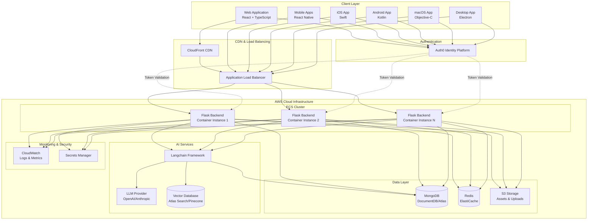

### 3.8.2 Component Integration Patterns

#### 3.8.2.1 Frontend to Backend Communication

**Protocol**: HTTPS/REST API with JSON payloads

**Authentication Flow**:
1. Client application redirects user to Auth0 for authentication
2. User authenticates with Auth0 (username/password, social login, or SSO)
3. Auth0 redirects back to client application with authorization code
4. Client exchanges authorization code for JWT access token and refresh token
5. Client includes JWT access token in `Authorization: Bearer <token>` header for all API requests
6. Flask backend validates JWT signature using Auth0 public keys (cached in Redis)
7. Flask extracts user identity from JWT claims for authorization decisions

**API Request Pattern**:
```
Client → CloudFront (CDN) → ALB → Flask Backend
  ├─ Authorization: Bearer <JWT>
  ├─ Content-Type: application/json
  └─ Request Body: JSON payload
```

**Error Handling**:
- **401 Unauthorized**: Invalid or expired JWT token → Client refreshes token or re-authenticates
- **403 Forbidden**: Valid token but insufficient permissions → Client displays error message
- **429 Too Many Requests**: Rate limit exceeded → Client implements exponential backoff
- **500 Internal Server Error**: Server-side error → Client retries with exponential backoff and displays user-friendly message

#### 3.8.2.2 Backend to Database Communication

**MongoDB Integration**:
- **Driver**: Motor (async) for Flask with async views, PyMongo (sync) for synchronous operations
- **Connection Pooling**: Min pool size 10, max pool size 100 per Flask instance
- **Connection String**: Retrieved from AWS Secrets Manager on application startup
- **Query Pattern**: Repository pattern with data access layer abstraction

**Example Integration Flow**:
```
Flask Endpoint → Business Logic → Repository Layer → Motor/PyMongo → MongoDB
     ↓              ↓                    ↓                 ↓            ↓
  Validation   Authorization    Query Building      Connection    Document
  & Parsing    Check            & Execution          Pool          Storage
```

**Redis Integration**:
- **Driver**: redis-py with connection pooling
- **Use Cases**: Session storage, API response caching, rate limiting, JWT public key caching
- **Connection**: Separate connection pool for caching operations vs. session operations
- **Fallback Strategy**: Graceful degradation if Redis unavailable (skip caching, allow requests)

#### 3.8.2.3 Backend to AI Services Integration

**Langchain Integration Pattern**:
```
Flask API Endpoint
    ↓
Langchain Chain/Agent
    ├─→ LLM Provider (OpenAI/Anthropic)
    │   └─ Prompt Template + User Input → AI Response
    ├─→ Vector Database (Similarity Search)
    │   └─ Query Embedding → Relevant Documents
    └─→ MongoDB (Context Retrieval)
        └─ User History + Metadata → Additional Context
```

**Streaming Responses**:
- Server-Sent Events (SSE) for real-time AI response streaming to clients
- Chunked transfer encoding for progressive response delivery
- Client-side handling of partial responses with streaming parsers

**Cost Management**:
- Token counting before API calls to estimate costs
- Rate limiting per user to prevent abuse
- Caching of common queries to reduce LLM API calls
- Fallback to smaller, cheaper models for simple queries

#### 3.8.2.4 Cross-Platform Client Consistency

**Shared Business Logic**:
- TypeScript type definitions shared between React web and React Native mobile via npm packages or monorepo
- Consistent API client implementations with platform-specific interceptors
- Shared validation schemas using Zod for consistent input validation

**Platform-Specific Considerations**:

| Aspect | Web (React) | Mobile (React Native) | Native Apps |
|--------|-------------|-----------------------|-------------|
| **API Client** | Axios with interceptors | Axios with network detection | Platform-native HTTP clients |
| **Authentication** | @auth0/auth0-react | react-native-auth0 | Auth0 native SDKs |
| **Storage** | LocalStorage + SessionStorage | AsyncStorage + Keychain | Keychain (iOS), Keystore (Android) |
| **Push Notifications** | Web Push API (if supported) | React Native Push Notifications | Platform-native push SDKs |
| **Offline Support** | Service Workers | React Query persistence | Platform-specific caching |

### 3.8.3 Deployment Architecture

The following diagram illustrates the production deployment architecture on AWS:

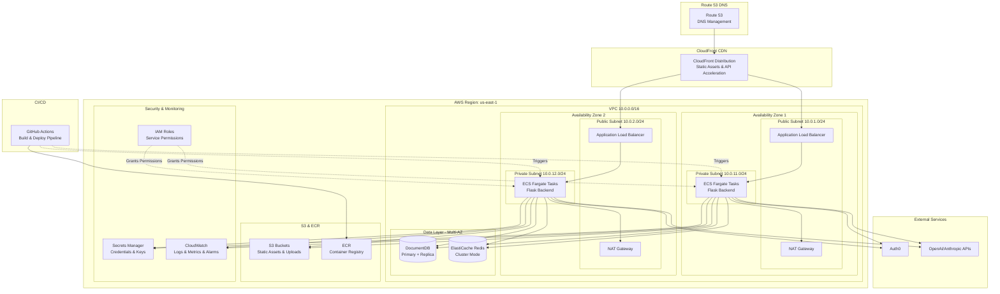

**Key Architectural Decisions**:

1. **Multi-AZ Deployment**: Resources deployed across two availability zones for high availability and fault tolerance
2. **Public/Private Subnet Separation**: Backend services in private subnets with no direct internet access; internet-bound traffic routed through NAT Gateways
3. **Load Balancer**: Application Load Balancer distributes traffic across ECS tasks with health checks
4. **Fargate**: Serverless container execution eliminates need to manage EC2 instances
5. **Container Registry**: Amazon ECR stores Docker images with image scanning for vulnerabilities
6. **Secrets Management**: All sensitive credentials stored in AWS Secrets Manager and injected as environment variables
7. **Monitoring**: CloudWatch collects logs and metrics with alarms for critical thresholds
8. **CDN**: CloudFront caches static assets and optionally accelerates API requests for global users

**Network Security**:
- Security groups restrict inbound traffic to only necessary ports and sources
- ALB security group: Allow HTTPS (443) from internet
- ECS security group: Allow HTTP (5000) from ALB only
- Database security groups: Allow MongoDB/Redis ports from ECS security group only
- NACL rules provide additional layer of network security

**Scaling Configuration**:
- **ECS Service Auto Scaling**: Target tracking based on CPU utilization (target: 70%) and memory utilization (target: 80%)
- **ALB Target Group**: Deregistration delay of 30 seconds for graceful shutdown
- **DocumentDB**: Read replicas for scaling read operations
- **Redis**: Cluster mode with multiple shards for horizontal scaling

## 3.9 Security Considerations

### 3.9.1 Authentication and Authorization

**Authentication Strategy**:
- **Identity Provider**: Auth0 as centralized identity and access management platform
- **Protocol**: OAuth 2.0 with OpenID Connect for authentication flows
- **Token Type**: JSON Web Tokens (JWT) with RS256 signature algorithm
- **Token Lifetime**: Access tokens valid for 1 hour, refresh tokens valid for 7 days (configurable)
- **Token Storage**: 
  - Web: In-memory storage or httpOnly cookies to prevent XSS attacks
  - Mobile: Secure storage via Keychain (iOS) or Keystore (Android)
  - Native Apps: Platform-specific secure credential storage

**Authorization Strategy**:
- **Role-Based Access Control (RBAC)**: User roles defined in Auth0 and included in JWT claims
- **Attribute-Based Access Control (ABAC)**: Fine-grained permissions based on user attributes and context
- **API Authorization**: Backend validates JWT and checks permissions before processing requests
- **Scope-Based Authorization**: OAuth scopes define API access permissions for different client types

**Multi-Factor Authentication (MFA)**:
- Optional or mandatory MFA configuration per user role
- Support for TOTP (Google Authenticator, Authy), SMS, and push notifications
- Recovery codes for account recovery

### 3.9.2 Data Security

**Data at Rest**:
- **Database Encryption**: MongoDB encryption at rest using AWS KMS
- **S3 Encryption**: Server-side encryption (SSE-S3 or SSE-KMS) for all S3 buckets
- **Backup Encryption**: Automated database backups encrypted with KMS keys
- **Redis Encryption**: ElastiCache encryption at rest enabled

**Data in Transit**:
- **TLS/SSL**: All communications encrypted with TLS 1.2 or higher
- **Certificate Management**: SSL certificates managed via AWS Certificate Manager with automatic renewal
- **API Communications**: HTTPS-only for all client-to-server communications
- **Database Connections**: TLS-enabled connections for MongoDB and Redis
- **Inter-Service Communication**: Encrypted communication between services within VPC

**Data Privacy**:
- **PII Protection**: Personally Identifiable Information encrypted in database
- **Data Minimization**: Collect only necessary data for application functionality
- **Data Retention**: Automated data purging based on retention policies
- **GDPR Compliance**: User data export and deletion capabilities (to be implemented based on requirements)

**Sensitive Data Handling**:
- **API Keys & Secrets**: Never stored in code; managed via AWS Secrets Manager
- **Database Credentials**: Rotated regularly using Secrets Manager rotation policies
- **Environment Variables**: Injected at runtime from secure sources
- **Logging**: Sensitive data (passwords, tokens, PII) excluded from application logs

### 3.9.3 Network Security

**VPC Security**:
- **Network Isolation**: Backend services deployed in private subnets with no direct internet access
- **Security Groups**: Stateful firewall rules allowing only necessary traffic between services
- **Network ACLs**: Additional stateless firewall rules at subnet level
- **VPC Flow Logs**: Network traffic logging for security analysis and troubleshooting

**API Security**:
- **Rate Limiting**: Flask-Limiter enforces rate limits per endpoint and per user
- **CORS Configuration**: Strict CORS policies allowing only authorized origins
- **Input Validation**: All user inputs validated and sanitized before processing
- **SQL/NoSQL Injection Prevention**: Parameterized queries and ODM usage prevent injection attacks
- **XSS Prevention**: Output encoding and Content Security Policy headers
- **CSRF Protection**: CSRF tokens for state-changing operations (if applicable)

**DDoS Protection**:
- **AWS Shield Standard**: Automatic DDoS protection for all AWS resources
- **CloudFront**: Absorbs and mitigates large-scale DDoS attacks at edge locations
- **WAF (Optional)**: AWS Web Application Firewall for advanced threat protection

**Security Monitoring**:
- **CloudTrail**: Logs all AWS API calls for audit and compliance
- **GuardDuty (Optional)**: Threat detection service analyzing VPC Flow Logs and CloudTrail events
- **Security Hub (Optional)**: Centralized security findings and compliance checking
- **Automated Alerts**: CloudWatch alarms for suspicious activities (unusual traffic patterns, authentication failures)

**Vulnerability Management**:
- **Dependency Scanning**: Automated scanning of dependencies for known vulnerabilities (pip-audit, npm audit)
- **Container Scanning**: Trivy or AWS ECR image scanning for container vulnerabilities
- **Static Code Analysis**: SAST tools integrated in CI/CD pipeline
- **Penetration Testing**: Regular security assessments (schedule to be defined)
- **Patch Management**: Regular updates of dependencies and base images

## 3.10 Technology Decisions Summary

The following table summarizes key technology decisions and their primary justifications:

| Category | Technology | Version | Primary Justification |
|----------|-----------|---------|----------------------|
| **Backend Language** | Python | 3.11+ | AI/ML ecosystem integration, Flask compatibility, async support |
| **Backend Framework** | Flask | 3.0.x | Lightweight, flexible, extensible, production-proven |
| **Web Frontend** | React + TypeScript | 18.x + 5.3+ | Component architecture, rich ecosystem, type safety |
| **Mobile** | React Native + TypeScript | 0.73.x + 5.3+ | Cross-platform, code sharing with web, native performance |
| **Desktop** | Electron | 28.x | Web tech reuse, cross-platform, Node.js integration |
| **iOS Native** | Swift | 5.9+ | Apple's official language, modern features, SwiftUI support |
| **Android Native** | Kotlin | 1.9+ | Google's recommended, null safety, coroutines |
| **macOS Native** | Objective-C | 2.0 | Legacy framework compatibility (consider Swift migration) |
| **CSS Framework** | TailwindCSS | 3.4.x | Utility-first, consistency, performance optimization |
| **AI Framework** | Langchain | 0.1.x | LLM orchestration, RAG support, agent framework |
| **Authentication** | Auth0 | Latest | Multi-platform SDKs, OAuth/OIDC, managed service, scalability |
| **Database** | MongoDB | 7.0.x | Schema flexibility, JSON-native, scalability, Atlas Vector Search |
| **Caching** | Redis | 7.2.x | Sub-millisecond latency, rich data structures, session storage |
| **File Storage** | Amazon S3 | Latest | Durability, scalability, cost-effective, CDN integration |
| **Cloud Platform** | AWS | N/A | Comprehensive services, global infrastructure, reliability |
| **Containerization** | Docker | 24.x | Environment consistency, cloud-native, microservices support |
| **IaC** | Terraform | 1.6.x | Declarative, version control, reproducibility, AWS provider |
| **CI/CD** | GitHub Actions | Latest | Native GitHub integration, workflow as code, marketplace |
| **Container Orchestration** | AWS ECS + Fargate | Latest | Managed service, serverless, AWS integration, scalability |

## 3.11 Version Management and Upgrade Strategy

**Semantic Versioning**: All internal components follow semantic versioning (MAJOR.MINOR.PATCH) for clear upgrade paths and compatibility expectations.

**Dependency Updates**:
- **Security Patches**: Applied immediately upon release with accelerated testing
- **Minor Updates**: Evaluated monthly and applied after testing in development environment
- **Major Updates**: Evaluated quarterly with comprehensive testing and migration planning

**Upgrade Testing Process**:
1. Update dependencies in development environment
2. Run full test suite (unit, integration, E2E)
3. Deploy to staging environment for manual testing
4. Monitor staging for 48 hours
5. Deploy to production during low-traffic maintenance window
6. Monitor production metrics for 24 hours post-deployment

**Compatibility Matrix**: Maintained documentation of tested compatibility between major components (Python version, Flask version, MongoDB version, etc.) to guide upgrade decisions.

## 3.12 References

### 3.12.1 Repository Sources

- `README.md`: Project identifier (10oct_7) - no technical information available

**Note**: The repository is currently in initialization phase with no implemented code or configuration files to reference.

### 3.12.2 Technical Specification Sections

- **Section 1.1 Executive Summary**: Confirmed project initialization phase and lack of implemented code
- **Section 1.2 System Overview**: Documented pending technical approach and architecture decisions
- **Section 1.3 Scope**: Outlined undefined technical requirements and implementation boundaries
- **Section 2.1 Current Requirements Status**: Confirmed pre-definition phase for all requirements

### 3.12.3 Technology Stack Basis

- **Section Prompt - Default Technology Stack**: Primary source for intended technology selections
  - Core Infrastructure: AWS, Docker, Terraform, GitHub Actions
  - Backend: Python, Flask, Auth0, MongoDB, Langchain
  - Frontend: React, TypeScript, TailwindCSS, React Native
  - Native Applications: Swift (iOS), Kotlin (Android), Objective-C (macOS), Electron (Desktop)

### 3.12.4 External Documentation References

**Official Documentation** (for implementation phase reference):
- Python: https://docs.python.org/3/
- Flask: https://flask.palletsprojects.com/
- React: https://react.dev/
- TypeScript: https://www.typescriptlang.org/docs/
- React Native: https://reactnative.dev/docs/getting-started
- Langchain: https://python.langchain.com/docs/get_started/introduction
- MongoDB: https://docs.mongodb.com/
- Redis: https://redis.io/documentation
- Docker: https://docs.docker.com/
- Terraform: https://www.terraform.io/docs
- AWS Documentation: https://docs.aws.amazon.com/
- Auth0: https://auth0.com/docs
- TailwindCSS: https://tailwindcss.com/docs
- Electron: https://www.electronjs.org/docs

**Best Practices and Guides**:
- Flask RESTful API Best Practices
- React Application Architecture Patterns
- MongoDB Schema Design Best Practices
- AWS Well-Architected Framework
- OWASP Security Guidelines
- Docker Security Best Practices
- CI/CD Pipeline Patterns

# 4. Process Flowchart

## 4.1 Overview

This section provides comprehensive process flowcharts documenting the planned architecture and operational workflows for the multi-platform application system. The flowcharts illustrate end-to-end processes, system interactions, decision points, error handling paths, and integration patterns across all system components.

**Important Context**: The repository **10oct_7** was initialized on November 10, 2025, and currently contains no implemented source code. All workflows documented in this section represent the **intended system design** based on the architectural specifications defined in Section 3 (Technology Stack). These flowcharts serve as the definitive reference for implementation and will be validated against actual implementation as development progresses.

### 4.1.1 Workflow Categories

The process flows are organized into the following categories:

1. **Core Business Processes**: Authentication, API request handling, data operations, AI processing
2. **Integration Workflows**: External service integration, cross-platform data synchronization
3. **State Management**: Session lifecycle, application state transitions, request state management
4. **Error Handling & Recovery**: Retry mechanisms, fallback procedures, recovery workflows
5. **CI/CD Workflows**: Build, test, security scanning, deployment pipelines
6. **Infrastructure Operations**: Container orchestration, scaling, monitoring, logging

### 4.1.2 Diagram Conventions

All flowcharts in this section follow these conventions:

- **Rectangle**: Process or action step
- **Diamond**: Decision point requiring conditional logic
- **Parallelogram**: Input/output operation
- **Cylinder**: Database or data store
- **Rounded Rectangle**: Start/end points
- **Subgraph**: System or component boundary
- **Dashed Arrow**: Asynchronous or optional flow
- **Solid Arrow**: Synchronous required flow

## 4.2 High-Level System Workflow

### 4.2.1 End-to-End Request Flow

The following diagram illustrates the complete request flow from client applications through the infrastructure layers to backend services and data stores:

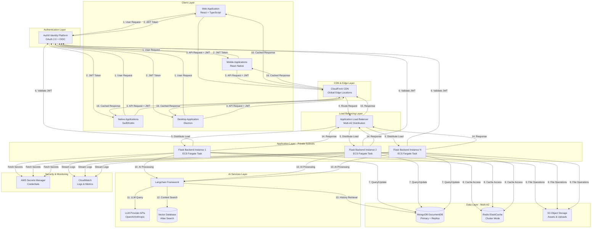

### 4.2.2 System Workflow Description

**Request Initiation (Steps 1-3)**:
1. User interacts with any client application (web, mobile, native, or desktop)
2. Client redirects to Auth0 for authentication if no valid JWT exists
3. Auth0 validates credentials and returns JWT access token + refresh token
4. Client includes JWT in Authorization header for all subsequent API requests

**Request Routing (Steps 4-5)**:
- CloudFront CDN serves cached responses for eligible requests (GET with cache headers)
- Non-cached requests route through CloudFront to Application Load Balancer
- ALB distributes requests across healthy Flask backend instances using round-robin with health checks

**Authentication & Authorization (Step 6)**:
- Flask backend validates JWT signature using Auth0 public keys (cached in Redis for performance)
- Backend extracts user identity and permissions from JWT claims
- Authorization checks performed before processing business logic

**Data Operations (Steps 7-9)**:
- **MongoDB**: Primary database for application data with connection pooling (10-100 connections)
- **Redis**: Session storage, API response caching, rate limiting counters, JWT key cache
- **S3**: Static assets served via CloudFront, user uploads via pre-signed URLs

**AI Processing (Steps 10-13)**:
- Langchain orchestrates multi-step AI workflows when requested
- LLM API calls to OpenAI or Anthropic for text generation
- Vector database queries for Retrieval-Augmented Generation (RAG)
- MongoDB retrieval for user history and contextual metadata

**Security & Observability**:
- AWS Secrets Manager provides runtime credentials at application startup
- CloudWatch receives structured JSON logs from all Flask instances
- All communications encrypted with TLS 1.2+ in transit
- Data at rest encrypted using AWS KMS

**Response Delivery (Steps 14-16)**:
- Flask backend returns JSON response or Server-Sent Events stream for AI responses
- ALB forwards response to CloudFront
- CloudFront caches eligible responses based on Cache-Control headers
- Client receives response and updates application state

### 4.2.3 Timing and SLA Considerations

**Expected Latencies**:
- **CloudFront Cache Hit**: < 50ms (edge location to client)
- **Cache Miss + ALB + Flask**: 100-300ms (depending on business logic complexity)
- **Database Query**: 5-50ms (MongoDB/Redis, depending on query complexity)
- **AI Processing**: 1-30 seconds (varies by model and response length)
- **Authentication (JWT Validation)**: < 10ms (cached public keys in Redis)

**Token Lifetimes**:
- **Access Token**: 1 hour (configurable)
- **Refresh Token**: 7 days (configurable)
- **Redis Cache**: 5-30 minutes (varies by use case)

**Scaling Thresholds**:
- **ECS Auto-Scaling**: Triggered at 70% CPU or 80% memory utilization
- **Connection Pooling**: Min 10, Max 100 connections per Flask instance
- **Rate Limiting**: Configurable per endpoint and per user role

## 4.3 Core Business Process Flows

### 4.3.1 Authentication and Authorization Workflow

The authentication system uses OAuth 2.0 with OpenID Connect (OIDC) via Auth0 for secure, standards-based authentication across all client platforms.

#### 4.3.1.1 OAuth 2.0 Authentication Flow

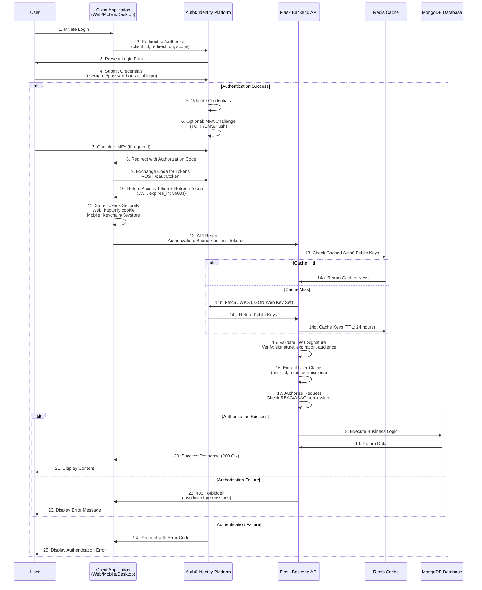

#### 4.3.1.2 Token Refresh Workflow

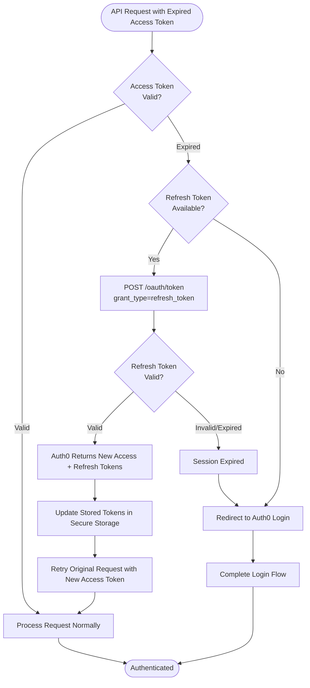

#### 4.3.1.3 Multi-Factor Authentication (MFA) Flow

When MFA is enabled for a user or required by role:

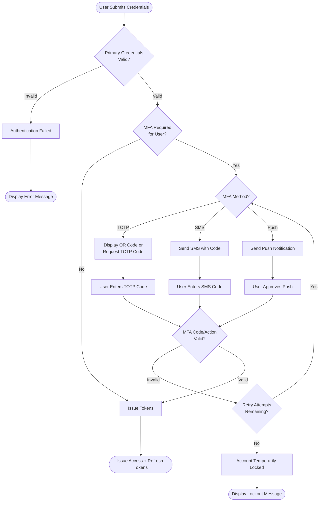

#### 4.3.1.4 Authorization Decision Flow

After JWT validation, the backend performs authorization checks:

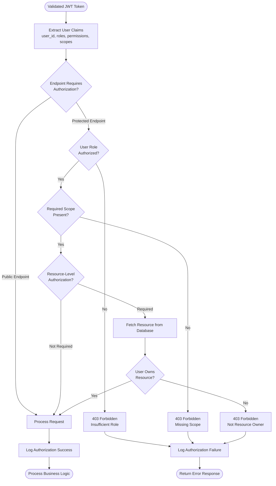

### 4.3.2 API Request Lifecycle Workflow

This workflow documents the complete lifecycle of an API request from initiation to response delivery, including error handling and retry logic.

#### 4.3.2.1 Complete Request/Response Cycle

```mermaid
graph TB
    START([Client Initiates API Request]) --> CHECK_NETWORK{Network<br/>Available?}
    
    CHECK_NETWORK -->|No| OFFLINE[Queue Request for Retry<br/>Display Offline Message]
    CHECK_NETWORK -->|Yes| CHECK_TOKEN{Valid Access<br/>Token?}
    
    CHECK_TOKEN -->|No| REFRESH_TOKEN[Token Refresh Flow]
    CHECK_TOKEN -->|Yes| BUILD_REQUEST[Build HTTP Request<br/>Headers + Body + Query Params]
    
    REFRESH_TOKEN --> TOKEN_RESULT{Refresh<br/>Success?}
    TOKEN_RESULT -->|No| REAUTH_FLOW[Redirect to Login]
    TOKEN_RESULT -->|Yes| BUILD_REQUEST
    
    BUILD_REQUEST --> SEND_REQUEST[Send Request to API<br/>via CloudFront CDN]
    SEND_REQUEST --> CF_CHECK{CloudFront<br/>Cache Hit?}
    
    CF_CHECK -->|Yes| CF_RESPONSE[Return Cached Response<br/>< 50ms latency]
    CF_CHECK -->|No| ALB_ROUTE[Route to Application Load Balancer]
    
    ALB_ROUTE --> HEALTH_CHECK{Backend Instance<br/>Healthy?}
    HEALTH_CHECK -->|No| CIRCUIT_BREAKER[Remove from Load Balancer<br/>Route to Healthy Instance]
    HEALTH_CHECK -->|Yes| BACKEND_RECEIVE[Flask Backend Receives Request]
    
    CIRCUIT_BREAKER --> BACKEND_RECEIVE
    
    BACKEND_RECEIVE --> RATE_LIMIT{Rate Limit<br/>Exceeded?}
    
    RATE_LIMIT -->|Yes| RATE_LIMIT_ERROR[429 Too Many Requests<br/>Retry-After header]
    RATE_LIMIT -->|No| VALIDATE_JWT[Validate JWT Signature]
    
    VALIDATE_JWT --> JWT_VALID{JWT Valid?}
    
    JWT_VALID -->|No| UNAUTHORIZED[401 Unauthorized<br/>Invalid/Expired Token]
    JWT_VALID -->|Yes| AUTHORIZE[Check Authorization<br/>RBAC/ABAC]
    
    AUTHORIZE --> AUTH_CHECK{Authorized?}
    
    AUTH_CHECK -->|No| FORBIDDEN[403 Forbidden<br/>Insufficient Permissions]
    AUTH_CHECK -->|Yes| VALIDATE_INPUT[Validate Request Input<br/>Schema Validation]
    
    VALIDATE_INPUT --> INPUT_VALID{Input Valid?}
    
    INPUT_VALID -->|No| BAD_REQUEST[400 Bad Request<br/>Validation Errors]
    INPUT_VALID -->|Yes| CHECK_CACHE{Response<br/>Cached in Redis?}
    
    CHECK_CACHE -->|Yes| REDIS_HIT[Return Cached Response<br/>5-10ms latency]
    CHECK_CACHE -->|No| BUSINESS_LOGIC[Execute Business Logic]
    
    BUSINESS_LOGIC --> DB_OPERATION{Database<br/>Operation Required?}
    
    DB_OPERATION -->|Yes| QUERY_DB[Query/Update MongoDB]
    DB_OPERATION -->|No| COMPUTE[Compute Result]
    
    QUERY_DB --> DB_RESULT{Database<br/>Success?}
    
    DB_RESULT -->|No| DB_ERROR[500 Internal Server Error<br/>Database Error]
    DB_RESULT -->|Yes| COMPUTE
    
    COMPUTE --> CACHE_RESULT[Cache Result in Redis<br/>If Cacheable]
    CACHE_RESULT --> SUCCESS_RESPONSE[200 OK Response<br/>JSON Payload]
    
    REDIS_HIT --> SUCCESS_RESPONSE
    CF_RESPONSE --> SUCCESS_RESPONSE
    
    SUCCESS_RESPONSE --> CLIENT_RECEIVE[Client Receives Response]
    
    RATE_LIMIT_ERROR --> CLIENT_RECEIVE
    UNAUTHORIZED --> CLIENT_RECEIVE
    FORBIDDEN --> CLIENT_RECEIVE
    BAD_REQUEST --> CLIENT_RECEIVE
    DB_ERROR --> CLIENT_RECEIVE
    
    CLIENT_RECEIVE --> HANDLE_RESPONSE{Response<br/>Status?}
    
    HANDLE_RESPONSE -->|2xx Success| UPDATE_STATE[Update Application State]
    HANDLE_RESPONSE -->|4xx Client Error| DISPLAY_ERROR[Display User Error Message]
    HANDLE_RESPONSE -->|5xx Server Error| RETRY_LOGIC{Retry<br/>Attempts Left?}
    
    RETRY_LOGIC -->|Yes| EXPONENTIAL_BACKOFF[Wait with Exponential Backoff<br/>2^n seconds]
    RETRY_LOGIC -->|No| FINAL_ERROR[Display Critical Error<br/>Contact Support]
    
    EXPONENTIAL_BACKOFF --> SEND_REQUEST
    
    UPDATE_STATE --> END_SUCCESS([Request Complete])
    DISPLAY_ERROR --> END_ERROR([User Notified])
    FINAL_ERROR --> END_CRITICAL([Error Logged])
    OFFLINE --> END_OFFLINE([Queued for Retry])
    REAUTH_FLOW --> END_REAUTH([User Must Login])
```

#### 4.3.2.2 Error Handling and Recovery Patterns

**Rate Limiting Retry Strategy**:
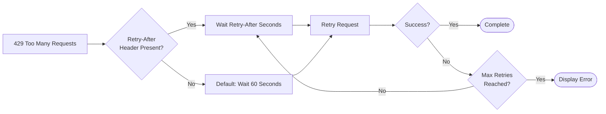

**Network Failure Retry Strategy**:
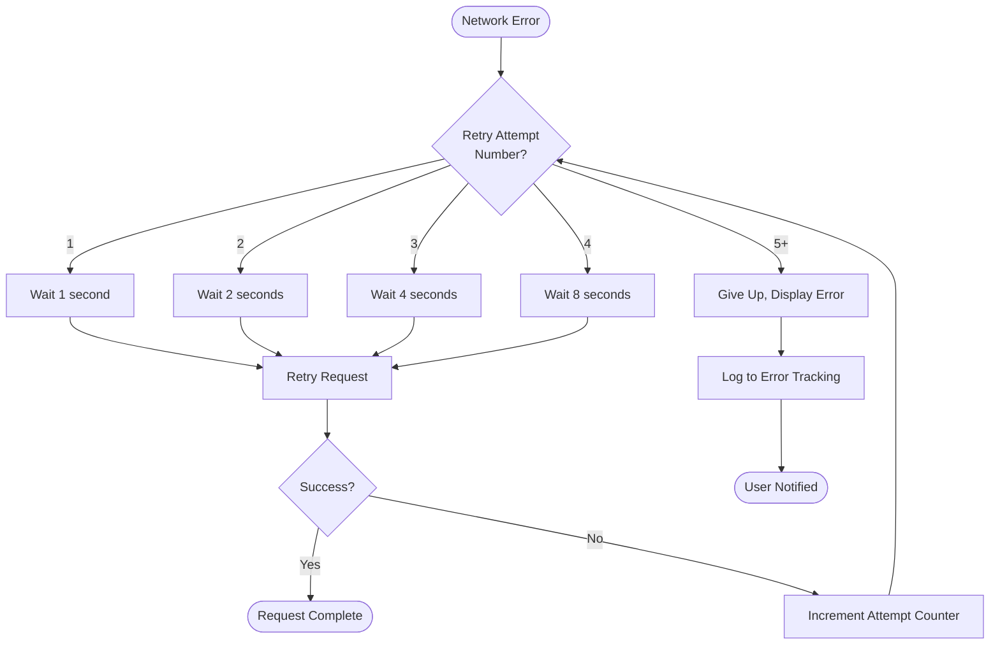

### 4.3.3 Data Persistence Workflows

#### 4.3.3.1 MongoDB Write Operation Flow

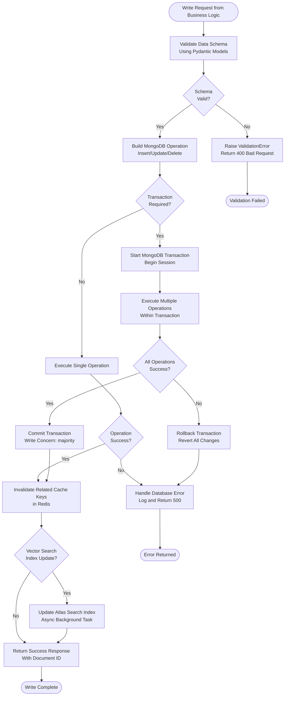

#### 4.3.3.2 MongoDB Read Operation Flow

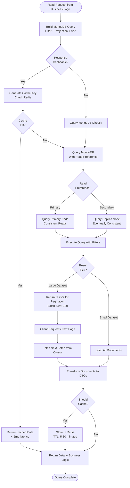

#### 4.3.3.3 Redis Caching Strategy Flow

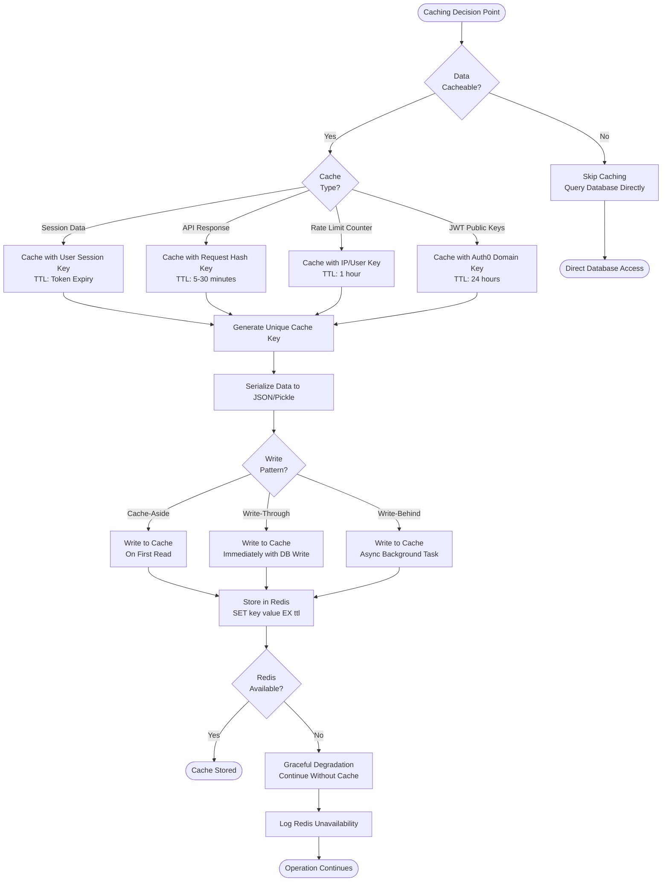

### 4.3.4 AI and Machine Learning Processing Workflows

#### 4.3.4.1 Langchain AI Query Processing Flow

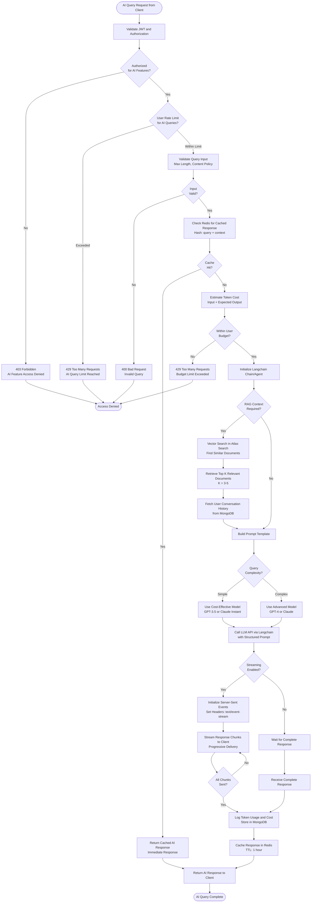

#### 4.3.4.2 AI Error Handling and Fallback Flow

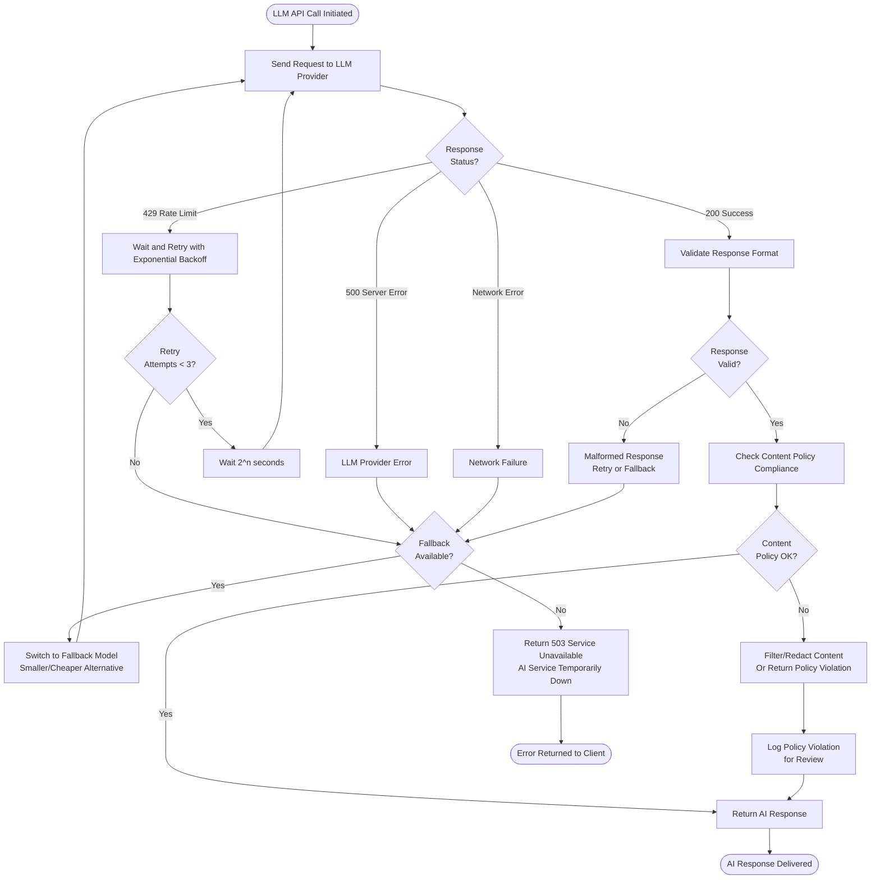

## 4.4 Integration Workflows

### 4.4.1 External Service Integration Patterns

#### 4.4.1.1 Auth0 Token Validation Integration

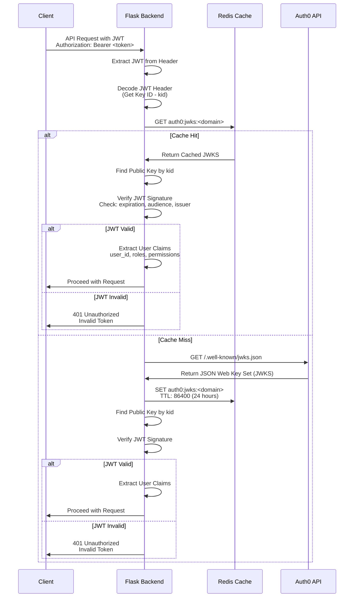

#### 4.4.1.2 AWS S3 File Upload Integration

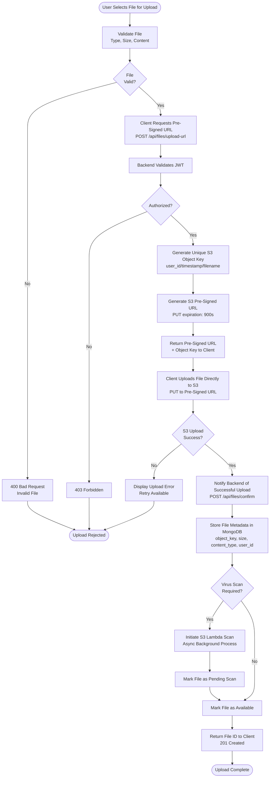

#### 4.4.1.3 AWS Secrets Manager Integration

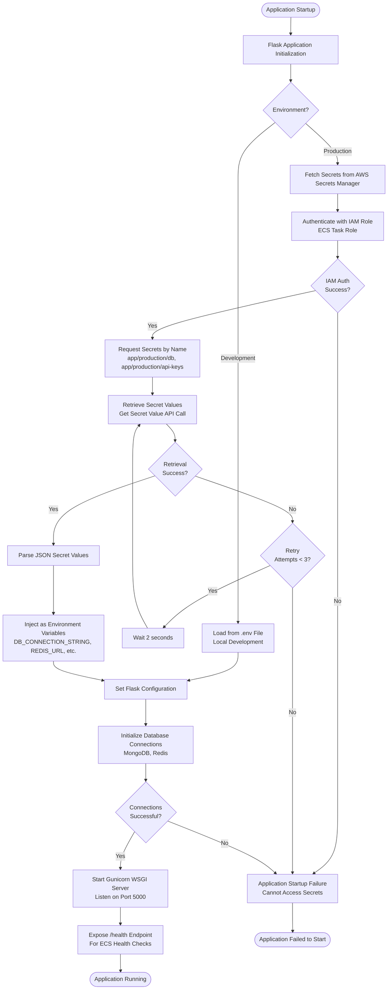

### 4.4.2 Cross-Platform Data Synchronization

#### 4.4.2.1 Multi-Client State Synchronization

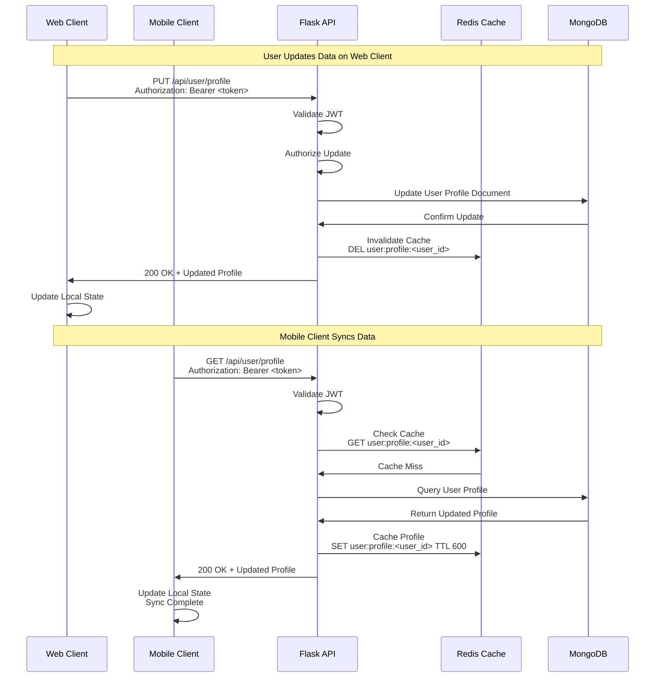

## 4.5 State Management and Transitions

### 4.5.1 User Session State Lifecycle

```mermaid
stateDiagram-v2
    [*] --> Anonymous: Application Launch
    
    Anonymous --> Authenticating: User Clicks Login
    Authenticating --> Authenticated: Auth0 Success<br/>JWT Issued
    Authenticating --> Anonymous: Auth0 Failure<br/>Display Error
    
    Authenticated --> TokenExpired: Access Token TTL Exceeded<br/>(After 1 hour)
    Authenticated --> LoggedOut: User Clicks Logout
    
    TokenExpired --> Refreshing: Auto Refresh<br/>with Refresh Token
    Refreshing --> Authenticated: Refresh Success<br/>New Access Token
    Refreshing --> SessionExpired: Refresh Failed<br/>Refresh Token Invalid
    
    SessionExpired --> Anonymous: Clear Local State<br/>Redirect to Login
    
    LoggedOut --> Anonymous: Clear Tokens<br/>Clear Session Data
    
    Authenticated --> Authenticated: API Requests<br/>Normal Operations
    
    Anonymous --> [*]: Application Close
    LoggedOut --> [*]: Application Close
```

### 4.5.2 API Request State Machine

```mermaid
stateDiagram-v2
    [*] --> Idle: Request Not Started
    
    Idle --> Pending: Initiate API Call
    
    Pending --> Loading: Request Sent<br/>Waiting for Response
    
    Loading --> Success: 2xx Response<br/>Data Received
    Loading --> Error: 4xx/5xx Response<br/>Error Received
    Loading --> NetworkError: Network Failure<br/>Timeout/Offline
    
    Success --> Idle: Data Processed<br/>State Updated
    
    Error --> Retrying: Retry Logic Triggered<br/>Exponential Backoff
    NetworkError --> Retrying: Network Recovery<br/>Retry Attempt
    
    Retrying --> Loading: Retry Request Sent
    Retrying --> Failed: Max Retries Exceeded<br/>Permanent Failure
    
    Failed --> Idle: User Acknowledges<br/>Or Timeout
    
    Loading --> Cancelled: User Cancels Request<br/>Navigation Change
    Cancelled --> Idle: Cleanup Resources
    
    Success --> [*]: Request Complete
    Failed --> [*]: Request Failed
```

### 4.5.3 Database Connection State Management

```mermaid
stateDiagram-v2
    [*] --> Disconnected: Application Start
    
    Disconnected --> Connecting: Initialize Connection Pool
    
    Connecting --> Connected: Connection Established<br/>Pool Ready
    Connecting --> ConnectionError: Connection Failed<br/>Credentials/Network Error
    
    Connected --> Active: Executing Queries<br/>Normal Operations
    
    Active --> Connected: Query Complete<br/>Connection Returned to Pool
    Active --> QueryError: Query Execution Error<br/>Timeout/Syntax Error
    
    QueryError --> Connected: Error Handled<br/>Connection Still Valid
    QueryError --> Reconnecting: Connection Lost<br/>Network Issue
    
    Connected --> Reconnecting: Connection Pool Exhausted<br/>Or Health Check Failed
    
    Reconnecting --> Connected: Reconnection Success<br/>New Connection Established
    Reconnecting --> ConnectionError: Reconnection Failed<br/>Max Retries Exceeded
    
    ConnectionError --> Disconnected: Release Resources<br/>Log Error
    
    Connected --> Disconnected: Application Shutdown<br/>Graceful Close
    
    Disconnected --> [*]: Connections Closed
```

## 4.6 Error Handling and Recovery Flows

### 4.6.1 Global Error Handling Strategy

```mermaid
graph TB
    START([Error Occurs in Application]) --> DETECT[Error Detection Point<br/>Try-Catch or Exception Handler]
    
    DETECT --> CLASSIFY{Error<br/>Category?}
    
    CLASSIFY -->|Network Error| NETWORK[Network Failure Handler]
    CLASSIFY -->|Authentication Error| AUTH_ERROR[Authentication Handler]
    CLASSIFY -->|Authorization Error| AUTHZ_ERROR[Authorization Handler]
    CLASSIFY -->|Validation Error| VALIDATION[Validation Handler]
    CLASSIFY -->|Database Error| DB_ERROR[Database Handler]
    CLASSIFY -->|External Service Error| EXTERNAL[External Service Handler]
    CLASSIFY -->|Application Error| APP_ERROR[Application Logic Handler]
    CLASSIFY -->|Unknown Error| UNKNOWN[Catch-All Handler]
    
    NETWORK --> NETWORK_RETRY{Retryable?}
    NETWORK_RETRY -->|Yes| RETRY_LOGIC[Apply Exponential Backoff<br/>Retry Request]
    NETWORK_RETRY -->|No| LOG_ERROR
    
    AUTH_ERROR --> REFRESH_TOKEN_FLOW[Attempt Token Refresh]
    REFRESH_TOKEN_FLOW --> REFRESH_OK{Refresh<br/>Success?}
    REFRESH_OK -->|Yes| RETRY_LOGIC
    REFRESH_OK -->|No| FORCE_REAUTH[Force Re-Authentication]
    
    AUTHZ_ERROR --> USER_NOTIFY[Notify User<br/>Insufficient Permissions]
    USER_NOTIFY --> LOG_ERROR
    
    VALIDATION --> DISPLAY_VALIDATION[Display Validation Errors<br/>Field-Specific Messages]
    DISPLAY_VALIDATION --> LOG_ERROR
    
    DB_ERROR --> DB_RETRY{Transient<br/>Error?}
    DB_RETRY -->|Yes| RETRY_LOGIC
    DB_RETRY -->|No| FALLBACK[Activate Fallback Strategy]
    
    EXTERNAL --> EXTERNAL_RETRY{Service<br/>Available?}
    EXTERNAL_RETRY -->|Yes| RETRY_LOGIC
    EXTERNAL_RETRY -->|No| CIRCUIT_BREAKER[Circuit Breaker Activated<br/>Use Cached/Default Data]
    
    APP_ERROR --> SAFE_STATE[Return to Safe State]
    SAFE_STATE --> LOG_ERROR
    
    UNKNOWN --> SAFE_STATE
    
    RETRY_LOGIC --> RETRY_COUNT{Max Retries<br/>Exceeded?}
    RETRY_COUNT -->|No| DELAY[Wait with Backoff]
    RETRY_COUNT -->|Yes| LOG_ERROR
    
    DELAY --> RETRY_OPERATION[Retry Original Operation]
    RETRY_OPERATION --> RETRY_RESULT{Success?}
    RETRY_RESULT -->|Yes| RECOVER[Operation Recovered]
    RETRY_RESULT -->|No| RETRY_COUNT
    
    FALLBACK --> LOG_ERROR
    CIRCUIT_BREAKER --> LOG_ERROR
    FORCE_REAUTH --> LOG_ERROR
    
    LOG_ERROR[Log Error Details<br/>Severity, Context, Stack Trace] --> REPORT_ERROR{Critical<br/>Error?}
    
    REPORT_ERROR -->|Yes| ALERT_TEAM[Send Alert to Operations Team<br/>Sentry/CloudWatch Alarm]
    REPORT_ERROR -->|No| METRICS[Update Error Metrics<br/>CloudWatch/Prometheus]
    
    ALERT_TEAM --> METRICS
    
    METRICS --> USER_FEEDBACK[Provide User Feedback<br/>Error Message/Toast]
    
    USER_FEEDBACK --> END_HANDLED([Error Handled])
    RECOVER --> END_RECOVERED([Operation Recovered])
```

### 4.6.2 Circuit Breaker Pattern for External Services

```mermaid
stateDiagram-v2
    [*] --> Closed: Initial State<br/>Service Healthy
    
    Closed --> Closed: Successful Request<br/>Reset Failure Count
    Closed --> Open: Failure Threshold Exceeded<br/>(e.g., 5 failures in 60s)
    
    Open --> Open: Request Blocked<br/>Immediate Failure
    Open --> HalfOpen: Timeout Elapsed<br/>(e.g., 30 seconds)
    
    HalfOpen --> Closed: Test Request Success<br/>Service Recovered
    HalfOpen --> Open: Test Request Failed<br/>Service Still Down
    
    note right of Closed
        Normal operation
        All requests forwarded
        Track failure count
    end note
    
    note right of Open
        Service unavailable
        Block all requests
        Return cached/default data
        Wait for timeout
    end note
    
    note right of HalfOpen
        Testing recovery
        Allow limited requests
        Quick failure if still broken
    end note
```

### 4.6.3 Database Transaction Rollback Flow

```mermaid
graph TB
    START([Begin Database Transaction]) --> START_SESSION[Start MongoDB Session<br/>Begin Transaction]
    
    START_SESSION --> OPERATION1[Execute Operation 1<br/>e.g., Update User Profile]
    
    OPERATION1 --> OP1_SUCCESS{Operation 1<br/>Success?}
    
    OP1_SUCCESS -->|No| ROLLBACK[Rollback Transaction<br/>Abort Session]
    OP1_SUCCESS -->|Yes| OPERATION2[Execute Operation 2<br/>e.g., Log Activity]
    
    OPERATION2 --> OP2_SUCCESS{Operation 2<br/>Success?}
    
    OP2_SUCCESS -->|No| ROLLBACK
    OP2_SUCCESS -->|Yes| OPERATION3[Execute Operation 3<br/>e.g., Update Aggregate]
    
    OPERATION3 --> OP3_SUCCESS{Operation 3<br/>Success?}
    
    OP3_SUCCESS -->|No| ROLLBACK
    OP3_SUCCESS -->|Yes| COMMIT_TXN[Commit Transaction<br/>Write Concern: majority]
    
    COMMIT_TXN --> COMMIT_SUCCESS{Commit<br/>Success?}
    
    COMMIT_SUCCESS -->|Yes| END_SESSION[End Session<br/>Release Resources]
    COMMIT_SUCCESS -->|No| ROLLBACK
    
    ROLLBACK --> LOG_ROLLBACK[Log Rollback Details<br/>Error, Operations Attempted]
    LOG_ROLLBACK --> END_SESSION
    
    END_SESSION --> FINAL_STATE{Transaction<br/>State?}
    
    FINAL_STATE -->|Committed| INVALIDATE_CACHE[Invalidate Related Caches]
    FINAL_STATE -->|Rolled Back| ERROR_RESPONSE[Return Error Response<br/>500 Internal Server Error]
    
    INVALIDATE_CACHE --> SUCCESS_RESPONSE[Return Success Response<br/>200 OK]
    
    SUCCESS_RESPONSE --> END_SUCCESS([Transaction Complete])
    ERROR_RESPONSE --> END_ERROR([Transaction Failed])
```

## 4.7 CI/CD and Deployment Workflows

### 4.7.1 Continuous Integration Pipeline

```mermaid
graph TB
    START([Developer Pushes Code to GitHub]) --> TRIGGER{Branch<br/>Type?}
    
    TRIGGER -->|Feature Branch| CI_ONLY[CI Pipeline Only]
    TRIGGER -->|Develop Branch| CI_CD_DEV[CI + CD to Dev]
    TRIGGER -->|Main Branch| CI_CD_STAGING[CI + CD to Staging]
    TRIGGER -->|Tag v*| CI_CD_PROD[CI + CD to Production]
    
    CI_ONLY --> CHECKOUT[Checkout Code<br/>GitHub Actions Runner]
    CI_CD_DEV --> CHECKOUT
    CI_CD_STAGING --> CHECKOUT
    CI_CD_PROD --> CHECKOUT
    
    CHECKOUT --> SETUP_ENV[Setup Environment<br/>Python 3.11, Node.js 20]
    
    SETUP_ENV --> INSTALL_DEPS[Install Dependencies<br/>pip install, npm install]
    
    INSTALL_DEPS --> LINT_STAGE[Code Linting Stage]
    
    LINT_STAGE --> LINT_PYTHON[Python: flake8, black, isort, mypy]
    LINT_STAGE --> LINT_JS[JavaScript: ESLint, Prettier]
    
    LINT_PYTHON --> LINT_PYTHON_OK{Linting<br/>Passed?}
    LINT_JS --> LINT_JS_OK{Linting<br/>Passed?}
    
    LINT_PYTHON_OK -->|No| FAIL_LINT[Pipeline Failed<br/>Fix Linting Errors]
    LINT_JS_OK -->|No| FAIL_LINT
    
    LINT_PYTHON_OK -->|Yes| TEST_STAGE[Automated Testing Stage]
    LINT_JS_OK -->|Yes| TEST_STAGE
    
    TEST_STAGE --> UNIT_TESTS[Run Unit Tests<br/>pytest, vitest]
    
    UNIT_TESTS --> UNIT_OK{Tests<br/>Passed?}
    
    UNIT_OK -->|No| FAIL_TESTS[Pipeline Failed<br/>Fix Failing Tests]
    UNIT_OK -->|Yes| INTEGRATION_TESTS[Run Integration Tests<br/>Docker Compose for Dependencies]
    
    INTEGRATION_TESTS --> INT_OK{Tests<br/>Passed?}
    
    INT_OK -->|No| FAIL_TESTS
    INT_OK -->|Yes| COVERAGE[Generate Coverage Report<br/>Upload to Codecov]
    
    COVERAGE --> SECURITY_STAGE[Security Scanning Stage]
    
    SECURITY_STAGE --> DEPENDENCY_SCAN[Dependency Vulnerability Scan<br/>pip-audit, npm audit]
    
    DEPENDENCY_SCAN --> VULN_FOUND{Critical<br/>Vulnerabilities?}
    
    VULN_FOUND -->|Yes| FAIL_SECURITY[Pipeline Failed<br/>Fix Security Issues]
    VULN_FOUND -->|No| SAST[Static Application Security Testing<br/>CodeQL Analysis]
    
    SAST --> SAST_OK{SAST<br/>Passed?}
    
    SAST_OK -->|No| FAIL_SECURITY
    SAST_OK -->|Yes| BUILD_STAGE[Build Stage]
    
    BUILD_STAGE --> BUILD_DOCKER[Build Docker Image<br/>Multi-Stage Build]
    
    BUILD_DOCKER --> BUILD_OK{Build<br/>Success?}
    
    BUILD_OK -->|No| FAIL_BUILD[Pipeline Failed<br/>Fix Build Errors]
    BUILD_OK -->|Yes| CONTAINER_SCAN[Container Security Scan<br/>Trivy Image Scan]
    
    CONTAINER_SCAN --> CONTAINER_OK{Container<br/>Secure?}
    
    CONTAINER_OK -->|No| FAIL_SECURITY
    CONTAINER_OK -->|Yes| TAG_IMAGE[Tag Docker Image<br/>git-<sha>, v1.2.3, latest]
    
    TAG_IMAGE --> CI_END{Deploy<br/>Required?}
    
    CI_END -->|No - Feature Branch| CI_SUCCESS[CI Pipeline Complete]
    CI_END -->|Yes - Develop/Main/Tag| PUSH_ECR[Push Image to Amazon ECR]
    
    PUSH_ECR --> CD_STAGE[Continuous Deployment Stage]
    
    CI_SUCCESS --> END_CI([Pipeline Complete])
    
    FAIL_LINT --> NOTIFY_FAIL[Send Notification<br/>GitHub Status, Slack]
    FAIL_TESTS --> NOTIFY_FAIL
    FAIL_SECURITY --> NOTIFY_FAIL
    FAIL_BUILD --> NOTIFY_FAIL
    
    NOTIFY_FAIL --> END_FAIL([Pipeline Failed])
```

### 4.7.2 Continuous Deployment Pipeline

```mermaid
graph TB
    START([Docker Image Pushed to ECR]) --> DETERMINE_ENV{Target<br/>Environment?}
    
    DETERMINE_ENV -->|Development| DEV_DEPLOY[Deploy to Development]
    DETERMINE_ENV -->|Staging| STAGING_DEPLOY[Deploy to Staging]
    DETERMINE_ENV -->|Production| PROD_APPROVAL[Require Manual Approval]
    
    PROD_APPROVAL --> APPROVAL{Approved<br/>by Team?}
    APPROVAL -->|No| CANCEL[Deployment Cancelled]
    APPROVAL -->|Yes| PROD_DEPLOY[Deploy to Production]
    
    DEV_DEPLOY --> UPDATE_TASK_DEF[Update ECS Task Definition<br/>New Image Tag]
    STAGING_DEPLOY --> UPDATE_TASK_DEF
    PROD_DEPLOY --> UPDATE_TASK_DEF
    
    UPDATE_TASK_DEF --> CREATE_REVISION[Create New Task Definition Revision<br/>Revision Number Incremented]
    
    CREATE_REVISION --> UPDATE_SERVICE[Update ECS Service<br/>Force New Deployment]
    
    UPDATE_SERVICE --> LAUNCH_TASKS[ECS Launches New Tasks<br/>With Updated Image]
    
    LAUNCH_TASKS --> HEALTH_CHECK_LOOP[ECS Performs Health Checks<br/>HTTP GET /health every 30s]
    
    HEALTH_CHECK_LOOP --> HEALTH_STATUS{Health Check<br/>Passing?}
    
    HEALTH_STATUS -->|Failed| HEALTH_RETRY{Retry Count<br/>< Max?}
    HEALTH_RETRY -->|Yes| WAIT_HC[Wait 30 seconds]
    HEALTH_RETRY -->|No| DEPLOYMENT_FAIL[Deployment Failed<br/>Health Checks Failing]
    
    WAIT_HC --> HEALTH_CHECK_LOOP
    
    HEALTH_STATUS -->|Passed| REGISTER_ALB[Register New Tasks with ALB<br/>Add to Target Group]
    
    REGISTER_ALB --> TRAFFIC_SHIFT[ALB Begins Routing Traffic<br/>to New Tasks]
    
    TRAFFIC_SHIFT --> MONITOR_METRICS[Monitor CloudWatch Metrics<br/>Error Rate, Latency, CPU]
    
    MONITOR_METRICS --> METRICS_OK{Metrics<br/>Healthy?}
    
    METRICS_OK -->|No| ROLLBACK_TRIGGER[Metrics Threshold Exceeded<br/>Trigger Rollback]
    METRICS_OK -->|Yes| DEREGISTER_OLD[Deregister Old Tasks from ALB<br/>Deregistration Delay: 30s]
    
    DEREGISTER_OLD --> DRAIN_CONNECTIONS[Drain In-Flight Connections<br/>Wait 30 seconds]
    
    DRAIN_CONNECTIONS --> STOP_OLD_TASKS[Stop Old ECS Tasks<br/>Graceful Shutdown]
    
    STOP_OLD_TASKS --> DEPLOYMENT_COMPLETE[Deployment Complete<br/>New Version Running]
    
    DEPLOYMENT_COMPLETE --> SMOKE_TESTS[Run Automated Smoke Tests<br/>Critical Endpoints]
    
    SMOKE_TESTS --> SMOKE_OK{Smoke Tests<br/>Passed?}
    
    SMOKE_OK -->|No| ROLLBACK_TRIGGER
    SMOKE_OK -->|Yes| NOTIFY_SUCCESS[Send Success Notification<br/>Slack, Email]
    
    ROLLBACK_TRIGGER --> ROLLBACK_FLOW[Initiate Automated Rollback]
    DEPLOYMENT_FAIL --> ROLLBACK_FLOW
    
    ROLLBACK_FLOW --> REVERT_TASK_DEF[Revert to Previous Task Definition<br/>Use Previous Revision]
    
    REVERT_TASK_DEF --> UPDATE_SERVICE_ROLLBACK[Update ECS Service<br/>Force New Deployment with Old Image]
    
    UPDATE_SERVICE_ROLLBACK --> NOTIFY_ROLLBACK[Send Rollback Notification<br/>Alert Operations Team]
    
    NOTIFY_SUCCESS --> END_SUCCESS([Deployment Successful])
    NOTIFY_ROLLBACK --> END_ROLLBACK([Deployment Rolled Back])
    CANCEL --> END_CANCEL([Deployment Cancelled])
```

### 4.7.3 Infrastructure as Code Deployment Flow

```mermaid
graph TB
    START([Terraform Configuration Change]) --> PR[Create Pull Request<br/>with Infrastructure Changes]
    
    PR --> VALIDATE[GitHub Actions: terraform validate]
    
    VALIDATE --> VALID{Validation<br/>Passed?}
    
    VALID -->|No| FIX_ERRORS[Fix Configuration Errors<br/>Update PR]
    VALID -->|Yes| FORMAT_CHECK[terraform fmt -check]
    
    FIX_ERRORS --> VALIDATE
    
    FORMAT_CHECK --> FORMATTED{Properly<br/>Formatted?}
    
    FORMATTED -->|No| AUTO_FORMAT[Run terraform fmt<br/>Commit Changes]
    FORMATTED -->|Yes| PLAN[terraform plan<br/>Preview Changes]
    
    AUTO_FORMAT --> PLAN
    
    PLAN --> PLAN_SUCCESS{Plan<br/>Success?}
    
    PLAN_SUCCESS -->|No| FIX_ERRORS
    PLAN_SUCCESS -->|Yes| DISPLAY_PLAN[Display Plan in PR Comment<br/>Resources to Add/Change/Destroy]
    
    DISPLAY_PLAN --> REVIEW[Team Reviews Changes<br/>Code Review Process]
    
    REVIEW --> APPROVED{PR<br/>Approved?}
    
    APPROVED -->|No| REQUEST_CHANGES[Request Changes<br/>Update PR]
    APPROVED -->|Yes| MERGE[Merge PR to Main Branch]
    
    REQUEST_CHANGES --> VALIDATE
    
    MERGE --> DETERMINE_ENV{Target<br/>Environment?}
    
    DETERMINE_ENV -->|Development| AUTO_APPLY[Automatically Apply Changes]
    DETERMINE_ENV -->|Staging| AUTO_APPLY
    DETERMINE_ENV -->|Production| MANUAL_APPROVAL[Require Manual Approval<br/>for terraform apply]
    
    MANUAL_APPROVAL --> APPROVAL_CHECK{Approval<br/>Granted?}
    
    APPROVAL_CHECK -->|No| CANCEL_APPLY[Cancel Apply<br/>No Changes Made]
    APPROVAL_CHECK -->|Yes| APPLY_CHANGES[terraform apply<br/>Execute Infrastructure Changes]
    
    AUTO_APPLY --> APPLY_CHANGES
    
    APPLY_CHANGES --> ACQUIRE_LOCK[Acquire State Lock<br/>DynamoDB Lock Table]
    
    ACQUIRE_LOCK --> LOCK_SUCCESS{Lock<br/>Acquired?}
    
    LOCK_SUCCESS -->|No| LOCK_CONFLICT[Another Operation in Progress<br/>Wait and Retry]
    LOCK_SUCCESS -->|Yes| EXECUTE_APPLY[Execute terraform apply<br/>Create/Update/Delete Resources]
    
    LOCK_CONFLICT --> WAIT_LOCK[Wait 30 seconds]
    WAIT_LOCK --> ACQUIRE_LOCK
    
    EXECUTE_APPLY --> APPLY_RESULT{Apply<br/>Success?}
    
    APPLY_RESULT -->|No| APPLY_ERROR[Infrastructure Changes Failed<br/>Review Error Logs]
    APPLY_RESULT -->|Yes| UPDATE_STATE[Update Terraform State<br/>S3 Backend]
    
    UPDATE_STATE --> RELEASE_LOCK[Release State Lock<br/>DynamoDB Unlock]
    
    RELEASE_LOCK --> VERIFY_INFRA[Verify Infrastructure<br/>Run Health Checks]
    
    VERIFY_INFRA --> VERIFY_OK{Verification<br/>Passed?}
    
    VERIFY_OK -->|No| MANUAL_INTERVENTION[Alert Team<br/>Manual Investigation Required]
    VERIFY_OK -->|Yes| NOTIFY_COMPLETE[Send Success Notification<br/>Infrastructure Updated]
    
    APPLY_ERROR --> RELEASE_LOCK
    
    NOTIFY_COMPLETE --> END_SUCCESS([Infrastructure Updated])
    CANCEL_APPLY --> END_CANCEL([Apply Cancelled])
    MANUAL_INTERVENTION --> END_ERROR([Requires Manual Fix])
```

## 4.8 Container Orchestration and Scaling Workflows

### 4.8.1 ECS Fargate Task Lifecycle

```mermaid
stateDiagram-v2
    [*] --> Provisioning: ECS Service Create/Update
    
    Provisioning --> Pending: Task Definition Loaded<br/>Allocate Resources
    
    Pending --> Activating: Container Image Pulled from ECR<br/>Network Configured
    
    Activating --> Running: Container Started<br/>Application Process Running
    Activating --> Deactivating: Activation Failed<br/>Image Pull Error
    
    Running --> HealthChecking: Initial Health Check Period<br/>Wait for Healthy Status
    
    HealthChecking --> Running: Health Check Passed<br/>Register with ALB
    HealthChecking --> Deactivating: Health Check Failed<br/>Unhealthy Task
    
    Running --> Running: Serving Traffic<br/>Normal Operations
    
    Running --> Deactivating: Deployment Update<br/>Replace with New Task
    Running --> Deactivating: Scale Down Event<br/>Terminate Task
    Running --> Deactivating: Task Failure<br/>Application Crash
    Running --> Deactivating: Insufficient Resources<br/>Out of Memory
    
    Deactivating --> Deprovisioning: Deregister from ALB<br/>Drain Connections (30s)
    
    Deprovisioning --> Stopped: Stop Container<br/>Send SIGTERM, Wait, SIGKILL
    
    Stopped --> [*]: Release Resources<br/>Task Complete
    
    note right of Running
        Task serves traffic
        Logs stream to CloudWatch
        Metrics collected
        Health checks every 30s
    end note
    
    note right of Deactivating
        Graceful shutdown
        Complete in-flight requests
        Close database connections
        Flush logs
    end note
```

### 4.8.2 Auto-Scaling Workflow

```mermaid
graph TB
    START([CloudWatch Monitors ECS Metrics]) --> COLLECT[Collect Metrics<br/>CPU, Memory, Request Count]
    
    COLLECT --> CPU_CHECK{CPU Utilization}
    COLLECT --> MEM_CHECK{Memory Utilization}
    
    CPU_CHECK -->|> 70% for 2 min| SCALE_UP_TRIGGER[Scale Up Trigger]
    CPU_CHECK -->|< 30% for 5 min| SCALE_DOWN_TRIGGER[Scale Down Trigger]
    CPU_CHECK -->|30% - 70%| STABLE[Maintain Current Capacity]
    
    MEM_CHECK -->|> 80% for 2 min| SCALE_UP_TRIGGER
    MEM_CHECK -->|< 40% for 5 min| SCALE_DOWN_TRIGGER
    MEM_CHECK -->|40% - 80%| STABLE
    
    SCALE_UP_TRIGGER --> CHECK_MAX{At Maximum<br/>Capacity?}
    
    CHECK_MAX -->|Yes| ALERT_MAX[Alert: At Max Capacity<br/>Consider Infrastructure Upgrade]
    CHECK_MAX -->|No| CALCULATE_SCALE_UP[Calculate Desired Count<br/>Add 50% of Current Count]
    
    CALCULATE_SCALE_UP --> INITIATE_SCALE_UP[Update ECS Service<br/>Increase Desired Count]
    
    INITIATE_SCALE_UP --> PROVISION_TASKS[Provision New ECS Tasks<br/>Launch Additional Containers]
    
    PROVISION_TASKS --> WAIT_HEALTHY[Wait for Health Checks<br/>New Tasks Must Be Healthy]
    
    WAIT_HEALTHY --> HEALTHY_CHECK{All New Tasks<br/>Healthy?}
    
    HEALTHY_CHECK -->|No| HEALTH_TIMEOUT{Health Check<br/>Timeout?}
    HEALTHY_CHECK -->|Yes| REGISTER_NEW[Register New Tasks with ALB<br/>Begin Serving Traffic]
    
    HEALTH_TIMEOUT -->|Yes| SCALE_UP_FAIL[Scale Up Failed<br/>Terminate Unhealthy Tasks]
    HEALTH_TIMEOUT -->|No| WAIT_HEALTHY
    
    REGISTER_NEW --> SCALE_UP_COMPLETE[Scale Up Complete<br/>Monitor New Capacity]
    
    SCALE_DOWN_TRIGGER --> CHECK_MIN{At Minimum<br/>Capacity?}
    
    CHECK_MIN -->|Yes| MAINTAIN_MIN[Maintain Minimum<br/>No Scale Down]
    CHECK_MIN -->|No| CALCULATE_SCALE_DOWN[Calculate Desired Count<br/>Remove 25% of Current Count]
    
    CALCULATE_SCALE_DOWN --> INITIATE_SCALE_DOWN[Update ECS Service<br/>Decrease Desired Count]
    
    INITIATE_SCALE_DOWN --> DEREGISTER_TASKS[Deregister Tasks from ALB<br/>Stop Sending New Requests]
    
    DEREGISTER_TASKS --> DRAIN_TASKS[Drain In-Flight Requests<br/>Deregistration Delay: 30s]
    
    DRAIN_TASKS --> STOP_TASKS[Stop ECS Tasks<br/>Graceful Shutdown]
    
    STOP_TASKS --> SCALE_DOWN_COMPLETE[Scale Down Complete<br/>Reduced Capacity]
    
    STABLE --> CONTINUE[Continue Monitoring]
    SCALE_UP_COMPLETE --> CONTINUE
    SCALE_DOWN_COMPLETE --> CONTINUE
    MAINTAIN_MIN --> CONTINUE
    ALERT_MAX --> CONTINUE
    SCALE_UP_FAIL --> CONTINUE
    
    CONTINUE --> END([Next Monitoring Cycle])
```

### 4.8.3 Container Health Check and Recovery Flow

```mermaid
graph TB
    START([ECS Task Running]) --> HEALTH_CHECK[Execute Health Check<br/>HTTP GET /health]
    
    HEALTH_CHECK --> TIMEOUT{Response<br/>within Timeout?}
    
    TIMEOUT -->|No| TIMEOUT_FAIL[Health Check Timeout<br/>No Response in 5s]
    TIMEOUT -->|Yes| STATUS_CODE{HTTP Status<br/>Code?}
    
    STATUS_CODE -->|200 OK| CHECK_DEPENDENCIES[Backend Checks Dependencies<br/>MongoDB, Redis Connectivity]
    STATUS_CODE -->|Non-200| UNHEALTHY[Health Check Failed<br/>Service Unhealthy]
    
    CHECK_DEPENDENCIES --> DEPS_OK{All Dependencies<br/>Available?}
    
    DEPS_OK -->|Yes| HEALTHY[Health Check Passed<br/>Task is Healthy]
    DEPS_OK -->|No| UNHEALTHY
    
    TIMEOUT_FAIL --> FAILURE_COUNT[Increment Failure Count]
    UNHEALTHY --> FAILURE_COUNT
    
    FAILURE_COUNT --> THRESHOLD{Consecutive Failures<br/>>= Threshold?}
    
    THRESHOLD -->|No| WAIT_INTERVAL[Wait Health Check Interval<br/>30 seconds]
    THRESHOLD -->|Yes| MARK_UNHEALTHY[Mark Task as Unhealthy<br/>Deregister from ALB]
    
    WAIT_INTERVAL --> HEALTH_CHECK
    
    MARK_UNHEALTHY --> STOP_TRAFFIC[Stop Routing Traffic<br/>to Unhealthy Task]
    
    STOP_TRAFFIC --> REPLACE_DECISION{Auto-Replace<br/>Enabled?}
    
    REPLACE_DECISION -->|Yes| LAUNCH_REPLACEMENT[Launch Replacement Task<br/>New Container Instance]
    REPLACE_DECISION -->|No| ALERT_TEAM[Alert Operations Team<br/>Manual Intervention Required]
    
    LAUNCH_REPLACEMENT --> NEW_TASK_START[New Task Starts<br/>Begin Health Checks]
    
    NEW_TASK_START --> NEW_HEALTH{New Task<br/>Healthy?}
    
    NEW_HEALTH -->|Yes| REGISTER_NEW[Register New Task with ALB<br/>Resume Traffic]
    NEW_HEALTH -->|No| RETRY_LAUNCH{Launch<br/>Retries < Max?}
    
    RETRY_LAUNCH -->|Yes| LAUNCH_REPLACEMENT
    RETRY_LAUNCH -->|No| ALERT_TEAM
    
    REGISTER_NEW --> TERMINATE_OLD[Terminate Unhealthy Task<br/>Release Resources]
    
    TERMINATE_OLD --> RECOVERY_COMPLETE[Recovery Complete<br/>Healthy Task Serving Traffic]
    
    HEALTHY --> RESET_COUNT[Reset Failure Count to 0]
    RESET_COUNT --> WAIT_INTERVAL
    
    RECOVERY_COMPLETE --> END([Continue Monitoring])
    ALERT_TEAM --> END
```

## 4.9 Monitoring and Observability Workflows

### 4.9.1 Centralized Logging Flow

```mermaid
graph TB
    START([Application Event Occurs]) --> GENERATE_LOG[Generate Structured Log<br/>JSON Format with Context]
    
    GENERATE_LOG --> LOG_LEVEL{Log<br/>Level?}
    
    LOG_LEVEL -->|DEBUG| LOG_DEBUG[Debug Message<br/>Development Only]
    LOG_LEVEL -->|INFO| LOG_INFO[Informational Message<br/>Normal Operations]
    LOG_LEVEL -->|WARNING| LOG_WARNING[Warning Message<br/>Potential Issue]
    LOG_LEVEL -->|ERROR| LOG_ERROR[Error Message<br/>Operation Failed]
    LOG_LEVEL -->|CRITICAL| LOG_CRITICAL[Critical Message<br/>System Failure]
    
    LOG_DEBUG --> FILTER_ENV{Environment?}
    LOG_INFO --> SANITIZE[Sanitize Sensitive Data<br/>Remove PII, Tokens, Passwords]
    LOG_WARNING --> SANITIZE
    LOG_ERROR --> SANITIZE
    LOG_CRITICAL --> SANITIZE
    
    FILTER_ENV -->|Production| DISCARD[Discard Debug Logs<br/>Not Logged in Production]
    FILTER_ENV -->|Development| SANITIZE
    
    SANITIZE --> ENRICH[Enrich Log with Metadata<br/>Timestamp, Request ID, User ID, Service]
    
    ENRICH --> OUTPUT_STREAM[Write to stdout/stderr<br/>JSON-Formatted Line]
    
    OUTPUT_STREAM --> ECS_CAPTURE[ECS Captures Container Logs<br/>awslogs Log Driver]
    
    ECS_CAPTURE --> CLOUDWATCH[Stream to CloudWatch Logs<br/>Log Group: /ecs/backend-service]
    
    CLOUDWATCH --> INDEX[Index and Store Logs<br/>Retention: 30 days]
    
    INDEX --> SEVERITY_CHECK{Log<br/>Severity?}
    
    SEVERITY_CHECK -->|ERROR or CRITICAL| ERROR_TRACKING[Send to Error Tracking<br/>Sentry SDK]
    SEVERITY_CHECK -->|INFO, WARNING, DEBUG| METRICS[Update CloudWatch Metrics<br/>Log Count by Level]
    
    ERROR_TRACKING --> ERROR_AGGREGATION[Aggregate Similar Errors<br/>Group by Stack Trace]
    
    ERROR_AGGREGATION --> ALERT_CHECK{Error Rate<br/>Threshold Exceeded?}
    
    ALERT_CHECK -->|Yes| TRIGGER_ALARM[Trigger CloudWatch Alarm<br/>SNS Notification]
    ALERT_CHECK -->|No| STORE_ERROR[Store Error in Sentry<br/>For Review]
    
    TRIGGER_ALARM --> NOTIFY_TEAM[Send Alert to Operations Team<br/>Slack, Email, PagerDuty]
    
    METRICS --> DASHBOARD[Update CloudWatch Dashboard<br/>Real-Time Visualization]
    
    NOTIFY_TEAM --> END_ALERT([Team Investigates])
    STORE_ERROR --> END_STORED([Error Tracked])
    DASHBOARD --> END_METRICS([Metrics Updated])
    DISCARD --> END_DISCARD([Log Discarded])
```

### 4.9.2 Metrics Collection and Alerting Flow

```mermaid
graph TB
    START([Application Runtime]) --> COLLECT_METRICS[Collect Application Metrics<br/>CPU, Memory, Latency, Throughput]
    
    COLLECT_METRICS --> AGENT_EMIT[Emit Metrics<br/>CloudWatch Agent/SDK]
    
    AGENT_EMIT --> CLOUDWATCH_RECEIVE[CloudWatch Receives Metrics<br/>Namespace: Application/Backend]
    
    CLOUDWATCH_RECEIVE --> AGGREGATE[Aggregate Metrics<br/>1-minute, 5-minute Periods]
    
    AGGREGATE --> EVALUATE_ALARMS[Evaluate CloudWatch Alarms<br/>Check Alarm Conditions]
    
    EVALUATE_ALARMS --> CPU_ALARM{CPU > 80%<br/>for 5 minutes?}
    EVALUATE_ALARMS --> ERROR_ALARM{Error Rate > 5%<br/>for 2 minutes?}
    EVALUATE_ALARMS --> LATENCY_ALARM{P99 Latency > 1s<br/>for 3 minutes?}
    EVALUATE_ALARMS --> MEMORY_ALARM{Memory > 90%<br/>for 5 minutes?}
    
    CPU_ALARM -->|Yes| TRIGGER_CPU[Trigger: High CPU Alarm]
    CPU_ALARM -->|No| OK_CPU[OK: CPU Normal]
    
    ERROR_ALARM -->|Yes| TRIGGER_ERROR[Trigger: High Error Rate Alarm]
    ERROR_ALARM -->|No| OK_ERROR[OK: Error Rate Normal]
    
    LATENCY_ALARM -->|Yes| TRIGGER_LATENCY[Trigger: High Latency Alarm]
    LATENCY_ALARM -->|No| OK_LATENCY[OK: Latency Normal]
    
    MEMORY_ALARM -->|Yes| TRIGGER_MEMORY[Trigger: High Memory Alarm]
    MEMORY_ALARM -->|No| OK_MEMORY[OK: Memory Normal]
    
    TRIGGER_CPU --> ALARM_ACTION[Execute Alarm Action]
    TRIGGER_ERROR --> ALARM_ACTION
    TRIGGER_LATENCY --> ALARM_ACTION
    TRIGGER_MEMORY --> ALARM_ACTION
    
    ALARM_ACTION --> SNS_PUBLISH[Publish to SNS Topic<br/>Topic: Operations-Alerts]
    
    SNS_PUBLISH --> NOTIFY_CHANNELS[Notify Subscribed Channels]
    
    NOTIFY_CHANNELS --> EMAIL[Send Email Alert<br/>To: ops@example.com]
    NOTIFY_CHANNELS --> SLACK[Send Slack Message<br/>Channel: #alerts]
    NOTIFY_CHANNELS --> PAGERDUTY[Trigger PagerDuty Incident<br/>Critical Alarms Only]
    
    EMAIL --> TEAM_RESPONSE{Team<br/>Responds?}
    SLACK --> TEAM_RESPONSE
    PAGERDUTY --> TEAM_RESPONSE
    
    TEAM_RESPONSE -->|Yes| INVESTIGATE[Investigate Issue<br/>Review Logs, Metrics, Traces]
    TEAM_RESPONSE -->|No| ESCALATE[Escalate to On-Call<br/>Increase Urgency]
    
    ESCALATE --> INVESTIGATE
    
    INVESTIGATE --> RESOLVE_ACTION{Issue<br/>Resolved?}
    
    RESOLVE_ACTION -->|Yes| METRICS_NORMAL[Metrics Return to Normal<br/>Alarm Clears]
    RESOLVE_ACTION -->|No| MITIGATION[Apply Mitigation<br/>Scale, Rollback, Manual Fix]
    
    MITIGATION --> METRICS_NORMAL
    
    METRICS_NORMAL --> POSTMORTEM{Critical<br/>Incident?}
    
    POSTMORTEM -->|Yes| WRITE_POSTMORTEM[Write Incident Postmortem<br/>Root Cause Analysis]
    POSTMORTEM -->|No| UPDATE_RUNBOOK[Update Runbooks<br/>Document Resolution]
    
    WRITE_POSTMORTEM --> UPDATE_RUNBOOK
    
    OK_CPU --> DASHBOARD_UPDATE[Update CloudWatch Dashboard<br/>Real-Time Display]
    OK_ERROR --> DASHBOARD_UPDATE
    OK_LATENCY --> DASHBOARD_UPDATE
    OK_MEMORY --> DASHBOARD_UPDATE
    
    UPDATE_RUNBOOK --> END_RESOLVED([Incident Resolved])
    DASHBOARD_UPDATE --> END_NORMAL([System Normal])
```

### 4.9.3 Distributed Tracing Flow (Conceptual)

```mermaid
sequenceDiagram
    participant Client
    participant ALB as Application Load Balancer
    participant Backend as Flask Backend
    participant MongoDB as MongoDB
    participant Redis as Redis Cache
    participant LLM as LLM API
    participant CloudWatch as CloudWatch Insights
    
    Note over Client,CloudWatch: Request with Distributed Tracing
    
    Client->>ALB: 1. API Request<br/>X-Request-ID: abc123
    
    ALB->>Backend: 2. Forward Request<br/>X-Request-ID: abc123<br/>Span-ID: span-1
    
    Note over Backend: Start Trace Span<br/>Operation: handle_api_request<br/>Duration: 0ms
    
    Backend->>Backend: 3. Validate JWT<br/>Span-ID: span-1.1<br/>Duration: 5ms
    
    Backend->>Redis: 4. Check Cache<br/>Span-ID: span-1.2<br/>X-Request-ID: abc123
    Note over Redis: Cache Miss
    Redis->>Backend: 5. Cache Miss<br/>Duration: 3ms
    
    Backend->>MongoDB: 6. Query Database<br/>Span-ID: span-1.3<br/>X-Request-ID: abc123
    MongoDB->>Backend: 7. Return Data<br/>Duration: 25ms
    
    Backend->>LLM: 8. AI Processing<br/>Span-ID: span-1.4<br/>X-Request-ID: abc123
    LLM->>Backend: 9. AI Response<br/>Duration: 2000ms
    
    Backend->>Redis: 10. Cache Result<br/>Span-ID: span-1.5<br/>X-Request-ID: abc123
    Redis->>Backend: 11. Cache Stored<br/>Duration: 2ms
    
    Note over Backend: End Trace Span<br/>Total Duration: 2035ms
    
    Backend->>ALB: 12. Response<br/>X-Request-ID: abc123
    ALB->>Client: 13. Response to Client
    
    Backend->>CloudWatch: 14. Send Trace Data<br/>Request-ID, Spans, Durations
    
    Note over CloudWatch: Aggregate Traces<br/>Identify Slow Requests<br/>Visualize Call Graph
```

## 4.10 Security Workflows

### 4.10.1 API Security Validation Flow

```mermaid
graph TB
    START([API Request Received]) --> EXTRACT_HEADERS[Extract Request Headers<br/>Authorization, Content-Type, Origin]
    
    EXTRACT_HEADERS --> CORS_CHECK{CORS<br/>Validation?}
    
    CORS_CHECK -->|Invalid Origin| CORS_FAIL[403 Forbidden<br/>CORS Policy Violation]
    CORS_CHECK -->|Valid Origin| RATE_LIMIT_CHECK{Rate Limit<br/>Check?}
    
    RATE_LIMIT_CHECK --> GET_IP[Extract Client IP<br/>X-Forwarded-For or Remote IP]
    
    GET_IP --> CHECK_REDIS[Check Rate Limit in Redis<br/>Key: rate:limit:ip:<ip>]
    
    CHECK_REDIS --> COUNT_CHECK{Request Count<br/>< Limit?}
    
    COUNT_CHECK -->|No| RATE_EXCEEDED[429 Too Many Requests<br/>Retry-After: 60]
    COUNT_CHECK -->|Yes| INCREMENT_COUNT[Increment Request Count<br/>INCR rate:limit:ip:<ip>]
    
    INCREMENT_COUNT --> SET_TTL{TTL<br/>Exists?}
    
    SET_TTL -->|No| SET_WINDOW[Set TTL: 3600 seconds<br/>1-hour sliding window]
    SET_TTL -->|Yes| JWT_EXTRACTION[Extract JWT from Authorization Header]
    
    SET_WINDOW --> JWT_EXTRACTION
    
    JWT_EXTRACTION --> JWT_PRESENT{JWT<br/>Present?}
    
    JWT_PRESENT -->|No| PUBLIC_ENDPOINT{Public<br/>Endpoint?}
    JWT_PRESENT -->|Yes| VALIDATE_JWT_SIGNATURE[Validate JWT Signature<br/>Using Auth0 Public Keys]
    
    PUBLIC_ENDPOINT -->|Yes| INPUT_VALIDATION[Input Validation Stage]
    PUBLIC_ENDPOINT -->|No| UNAUTHORIZED[401 Unauthorized<br/>Missing JWT Token]
    
    VALIDATE_JWT_SIGNATURE --> JWT_VALID{JWT<br/>Valid?}
    
    JWT_VALID -->|No| JWT_ERROR{JWT Error<br/>Type?}
    JWT_VALID -->|Yes| EXTRACT_CLAIMS[Extract JWT Claims<br/>user_id, roles, permissions, exp]
    
    JWT_ERROR -->|Expired| TOKEN_EXPIRED[401 Unauthorized<br/>Token Expired]
    JWT_ERROR -->|Invalid Signature| TOKEN_INVALID[401 Unauthorized<br/>Invalid Signature]
    JWT_ERROR -->|Invalid Issuer/Audience| TOKEN_CLAIMS_INVALID[401 Unauthorized<br/>Invalid Claims]
    
    EXTRACT_CLAIMS --> CHECK_EXPIRY{Token<br/>Expired?}
    
    CHECK_EXPIRY -->|Yes| TOKEN_EXPIRED
    CHECK_EXPIRY -->|No| AUTHZ_CHECK[Authorization Check<br/>RBAC/ABAC Validation]
    
    AUTHZ_CHECK --> HAS_PERMISSION{User Has<br/>Permission?}
    
    HAS_PERMISSION -->|No| FORBIDDEN[403 Forbidden<br/>Insufficient Permissions]
    HAS_PERMISSION -->|Yes| INPUT_VALIDATION
    
    INPUT_VALIDATION --> VALIDATE_SCHEMA[Validate Request Schema<br/>Pydantic Models]
    
    VALIDATE_SCHEMA --> SCHEMA_VALID{Schema<br/>Valid?}
    
    SCHEMA_VALID -->|No| BAD_REQUEST[400 Bad Request<br/>Validation Errors]
    SCHEMA_VALID -->|Yes| SANITIZE_INPUT[Sanitize Input<br/>SQL/NoSQL Injection Prevention]
    
    SANITIZE_INPUT --> XSS_CHECK[Check for XSS Payloads<br/>Script Tags, Event Handlers]
    
    XSS_CHECK --> XSS_FOUND{XSS Pattern<br/>Detected?}
    
    XSS_FOUND -->|Yes| REJECT_XSS[400 Bad Request<br/>Potential XSS Attack]
    XSS_FOUND -->|No| CONTENT_LENGTH{Content Length<br/>Acceptable?}
    
    CONTENT_LENGTH -->|Too Large| PAYLOAD_TOO_LARGE[413 Payload Too Large<br/>Exceeds Max Size]
    CONTENT_LENGTH -->|Acceptable| SECURITY_PASSED[Security Validation Passed<br/>Proceed to Business Logic]
    
    SECURITY_PASSED --> LOG_SUCCESS[Log Successful Security Check<br/>Request ID, User ID]
    
    CORS_FAIL --> LOG_SECURITY[Log Security Violation<br/>Threat Type, IP, Details]
    RATE_EXCEEDED --> LOG_SECURITY
    UNAUTHORIZED --> LOG_SECURITY
    TOKEN_EXPIRED --> LOG_SECURITY
    TOKEN_INVALID --> LOG_SECURITY
    TOKEN_CLAIMS_INVALID --> LOG_SECURITY
    FORBIDDEN --> LOG_SECURITY
    BAD_REQUEST --> LOG_SECURITY
    REJECT_XSS --> LOG_SECURITY
    PAYLOAD_TOO_LARGE --> LOG_SECURITY
    
    LOG_SECURITY --> THREAT_DETECT{Threat Pattern<br/>Detected?}
    
    THREAT_DETECT -->|Yes| ALERT_SECURITY[Alert Security Team<br/>Potential Attack]
    THREAT_DETECT -->|No| END_BLOCKED([Request Blocked])
    
    ALERT_SECURITY --> END_ALERT([Security Alert Sent])
    
    LOG_SUCCESS --> END_SUCCESS([Proceed to Business Logic])
```

### 4.10.2 Secrets Rotation Workflow

```mermaid
graph TB
    START([Scheduled Rotation Event]) --> TRIGGER{Rotation<br/>Trigger?}
    
    TRIGGER -->|Manual| MANUAL_INIT[Administrator Initiates Rotation]
    TRIGGER -->|Automatic| AUTO_SCHEDULE[AWS Secrets Manager Schedule<br/>e.g., Every 90 days]
    
    MANUAL_INIT --> ROTATION_START[Begin Rotation Process]
    AUTO_SCHEDULE --> ROTATION_START
    
    ROTATION_START --> SECRET_TYPE{Secret<br/>Type?}
    
    SECRET_TYPE -->|Database Credentials| ROTATE_DB[Rotate Database Credentials]
    SECRET_TYPE -->|API Keys| ROTATE_API[Rotate API Keys]
    SECRET_TYPE -->|Encryption Keys| ROTATE_ENCRYPTION[Rotate Encryption Keys]
    
    ROTATE_DB --> CREATE_NEW_USER[Create New Database User<br/>With Same Permissions]
    
    CREATE_NEW_USER --> TEST_NEW_CREDS[Test New Credentials<br/>Test Connection]
    
    TEST_NEW_CREDS --> TEST_OK{Test<br/>Success?}
    
    TEST_OK -->|No| ROLLBACK_DB[Rollback: Delete New User<br/>Keep Old Credentials]
    TEST_OK -->|Yes| UPDATE_SECRET_DB[Update Secret in Secrets Manager<br/>Store New Credentials]
    
    UPDATE_SECRET_DB --> NOTIFY_APPS[Notify Applications to Refresh Credentials]
    
    NOTIFY_APPS --> GRACEFUL_PERIOD[Grace Period: 5 minutes<br/>Both Credentials Valid]
    
    GRACEFUL_PERIOD --> APPS_UPDATED{All Apps<br/>Updated?}
    
    APPS_UPDATED -->|No| EXTEND_GRACE{Grace Period<br/>Expired?}
    APPS_UPDATED -->|Yes| REVOKE_OLD_DB[Revoke Old Database User<br/>Drop User]
    
    EXTEND_GRACE -->|No| GRACEFUL_PERIOD
    EXTEND_GRACE -->|Yes| FORCE_REVOKE[Force Revoke Old Credentials<br/>May Cause Disruption]
    
    FORCE_REVOKE --> REVOKE_OLD_DB
    
    ROTATE_API --> GENERATE_NEW_KEY[Generate New API Key<br/>Cryptographically Random]
    
    GENERATE_NEW_KEY --> ACTIVATE_NEW_KEY[Activate New Key with Provider<br/>Keep Old Key Active]
    
    ACTIVATE_NEW_KEY --> UPDATE_SECRET_API[Update Secret in Secrets Manager<br/>Store New API Key]
    
    UPDATE_SECRET_API --> NOTIFY_APPS
    
    ROTATE_ENCRYPTION --> GENERATE_NEW_ENC_KEY[Generate New Encryption Key<br/>KMS Generate Data Key]
    
    GENERATE_NEW_ENC_KEY --> RE_ENCRYPT_DATA[Re-encrypt Sensitive Data<br/>Background Job]
    
    RE_ENCRYPT_DATA --> RE_ENCRYPT_COMPLETE{Re-encryption<br/>Complete?}
    
    RE_ENCRYPT_COMPLETE -->|No| MONITOR_PROGRESS[Monitor Re-encryption Progress]
    RE_ENCRYPT_COMPLETE -->|Yes| RETIRE_OLD_KEY[Retire Old Encryption Key<br/>Archive in KMS]
    
    MONITOR_PROGRESS --> RE_ENCRYPT_DATA
    
    RETIRE_OLD_KEY --> ROTATION_COMPLETE
    REVOKE_OLD_DB --> ROTATION_COMPLETE[Rotation Complete<br/>Old Credentials Revoked]
    
    ROTATION_COMPLETE --> LOG_ROTATION[Log Rotation Event<br/>Timestamp, Secret, Status]
    
    LOG_ROTATION --> VERIFY_ROTATION[Verify System Health<br/>Check Application Metrics]
    
    VERIFY_ROTATION --> HEALTH_OK{System<br/>Healthy?}
    
    HEALTH_OK -->|Yes| NOTIFY_SUCCESS[Send Success Notification<br/>Rotation Complete]
    HEALTH_OK -->|No| ALERT_FAILURE[Alert: Rotation Caused Issues<br/>Investigate Immediately]
    
    ROLLBACK_DB --> ROTATION_FAILED[Rotation Failed<br/>Old Credentials Still Active]
    
    ROTATION_FAILED --> LOG_FAILURE[Log Rotation Failure<br/>Error Details]
    
    LOG_FAILURE --> MANUAL_REVIEW[Require Manual Review<br/>Fix Issues and Retry]
    
    NOTIFY_SUCCESS --> END_SUCCESS([Rotation Successful])
    ALERT_FAILURE --> END_ALERT([Requires Investigation])
    MANUAL_REVIEW --> END_MANUAL([Manual Intervention Required])
```

## 4.11 Batch Processing Workflows

### 4.11.1 Automated Database Backup Flow

```mermaid
graph TB
    START([Scheduled Backup Job]) --> TRIGGER{Backup<br/>Schedule?}
    
    TRIGGER -->|Daily| DAILY_BACKUP[Daily Backup: 2 AM UTC]
    TRIGGER -->|Weekly| WEEKLY_BACKUP[Weekly Backup: Sunday 3 AM UTC]
    TRIGGER -->|Manual| MANUAL_BACKUP[Manual Backup Initiated]
    
    DAILY_BACKUP --> CHECK_WINDOW[Verify Maintenance Window<br/>Low-Traffic Period]
    WEEKLY_BACKUP --> CHECK_WINDOW
    MANUAL_BACKUP --> CHECK_WINDOW
    
    CHECK_WINDOW --> WINDOW_OK{In Maintenance<br/>Window?}
    
    WINDOW_OK -->|No| DELAY_BACKUP[Delay Backup<br/>Wait for Window]
    WINDOW_OK -->|Yes| SNAPSHOT_START[Initiate DocumentDB Snapshot]
    
    DELAY_BACKUP --> CHECK_WINDOW
    
    SNAPSHOT_START --> SNAPSHOT_TYPE{Backup<br/>Type?}
    
    SNAPSHOT_TYPE -->|Automated| AUTO_SNAPSHOT[AWS Automated Snapshot<br/>Retention: 7 days]
    SNAPSHOT_TYPE -->|Manual| MANUAL_SNAPSHOT[Manual Snapshot<br/>Custom Retention]
    
    AUTO_SNAPSHOT --> SNAPSHOT_PROGRESS[Monitor Snapshot Progress<br/>Check Status Every 30s]
    MANUAL_SNAPSHOT --> SNAPSHOT_PROGRESS
    
    SNAPSHOT_PROGRESS --> SNAPSHOT_COMPLETE{Snapshot<br/>Complete?}
    
    SNAPSHOT_COMPLETE -->|No| SNAPSHOT_TIMEOUT{Timeout<br/>Exceeded?}
    SNAPSHOT_COMPLETE -->|Yes| VERIFY_SNAPSHOT[Verify Snapshot Integrity<br/>Check Snapshot Status]
    
    SNAPSHOT_TIMEOUT -->|No| SNAPSHOT_PROGRESS
    SNAPSHOT_TIMEOUT -->|Yes| BACKUP_FAILED[Backup Failed<br/>Snapshot Timeout]
    
    VERIFY_SNAPSHOT --> SNAPSHOT_VALID{Snapshot<br/>Valid?}
    
    SNAPSHOT_VALID -->|No| BACKUP_FAILED
    SNAPSHOT_VALID -->|Yes| ENCRYPT_SNAPSHOT[Encrypt Snapshot<br/>AWS KMS Encryption]
    
    ENCRYPT_SNAPSHOT --> COPY_TO_S3[Copy Snapshot Metadata to S3<br/>Backup Manifest]
    
    COPY_TO_S3 --> TAG_SNAPSHOT[Tag Snapshot<br/>Timestamp, Type, Retention]
    
    TAG_SNAPSHOT --> CROSS_REGION{Cross-Region<br/>Replication?}
    
    CROSS_REGION -->|Yes| REPLICATE_SNAPSHOT[Replicate to Secondary Region<br/>us-west-2]
    CROSS_REGION -->|No| RETENTION_POLICY[Apply Retention Policy]
    
    REPLICATE_SNAPSHOT --> REPLICATION_OK{Replication<br/>Success?}
    
    REPLICATION_OK -->|No| REPLICATION_FAIL[Replication Failed<br/>Alert Operations]
    REPLICATION_OK -->|Yes| RETENTION_POLICY
    
    RETENTION_POLICY --> DELETE_OLD{Old Snapshots<br/>Exceed Retention?}
    
    DELETE_OLD -->|Yes| DELETE_SNAPSHOTS[Delete Expired Snapshots<br/>Free Storage]
    DELETE_OLD -->|No| BACKUP_COMPLETE[Backup Complete<br/>Snapshot Available]
    
    DELETE_SNAPSHOTS --> BACKUP_COMPLETE
    
    BACKUP_COMPLETE --> UPDATE_MANIFEST[Update Backup Manifest<br/>Latest Backup Timestamp]
    
    UPDATE_MANIFEST --> VERIFY_RESTORE{Test Restore<br/>Required?}
    
    VERIFY_RESTORE -->|Yes| TEST_RESTORE[Perform Test Restore<br/>Separate Test Instance]
    VERIFY_RESTORE -->|No| NOTIFY_SUCCESS[Send Success Notification<br/>Backup Complete]
    
    TEST_RESTORE --> RESTORE_OK{Restore<br/>Test Passed?}
    
    RESTORE_OK -->|Yes| NOTIFY_SUCCESS
    RESTORE_OK -->|No| ALERT_RESTORE_FAIL[Alert: Restore Test Failed<br/>Backup May Be Corrupted]
    
    BACKUP_FAILED --> RETRY{Retry<br/>Attempts < 3?}
    
    RETRY -->|Yes| WAIT_RETRY[Wait 10 minutes]
    RETRY -->|No| ALERT_BACKUP_FAIL[Alert: Backup Failed<br/>Manual Intervention Required]
    
    WAIT_RETRY --> SNAPSHOT_START
    
    NOTIFY_SUCCESS --> LOG_SUCCESS[Log Backup Success<br/>Snapshot ID, Size, Duration]
    
    REPLICATION_FAIL --> LOG_FAILURE[Log Failure Details<br/>Error, Snapshot, Region]
    ALERT_RESTORE_FAIL --> LOG_FAILURE
    ALERT_BACKUP_FAIL --> LOG_FAILURE
    
    LOG_SUCCESS --> END_SUCCESS([Backup Job Complete])
    LOG_FAILURE --> END_FAILURE([Backup Job Failed])
```

### 4.11.2 Log Archival and Retention Flow

```mermaid
graph TB
    START([Daily Archival Job: 1 AM UTC]) --> SCAN_LOGS[Scan CloudWatch Log Groups<br/>Identify Logs > 7 Days Old]
    
    SCAN_LOGS --> LOGS_FOUND{Logs to<br/>Archive?}
    
    LOGS_FOUND -->|No| NO_ACTION[No Action Required<br/>Skip Archival]
    LOGS_FOUND -->|Yes| EXPORT_LOGS[Export Logs to S3<br/>CreateExportTask API]
    
    EXPORT_LOGS --> EXPORT_PROGRESS[Monitor Export Progress<br/>Check Task Status]
    
    EXPORT_PROGRESS --> EXPORT_COMPLETE{Export<br/>Complete?}
    
    EXPORT_COMPLETE -->|No| EXPORT_TIMEOUT{Timeout<br/>Exceeded?}
    EXPORT_COMPLETE -->|Yes| VERIFY_EXPORT[Verify S3 Objects<br/>Check File Sizes]
    
    EXPORT_TIMEOUT -->|No| EXPORT_PROGRESS
    EXPORT_TIMEOUT -->|Yes| EXPORT_FAILED[Export Failed<br/>Retry Later]
    
    VERIFY_EXPORT --> EXPORT_VALID{Export<br/>Valid?}
    
    EXPORT_VALID -->|No| EXPORT_FAILED
    EXPORT_VALID -->|Yes| COMPRESS_LOGS[Compress Log Files<br/>GZIP Compression]
    
    COMPRESS_LOGS --> APPLY_LIFECYCLE[Apply S3 Lifecycle Policy<br/>Transition Rules]
    
    APPLY_LIFECYCLE --> TRANSITION_TIMELINE{Days Since<br/>Archive?}
    
    TRANSITION_TIMELINE -->|30 Days| MOVE_IA[Transition to S3 Infrequent Access<br/>Reduce Storage Cost]
    TRANSITION_TIMELINE -->|90 Days| MOVE_GLACIER[Transition to Glacier<br/>Long-Term Archive]
    TRANSITION_TIMELINE -->|365 Days| DELETE_LOGS[Delete Logs<br/>Retention Period Expired]
    
    MOVE_IA --> LIFECYCLE_COMPLETE[Lifecycle Transition Complete]
    MOVE_GLACIER --> LIFECYCLE_COMPLETE
    DELETE_LOGS --> DELETION_LOG[Log Deletion Event<br/>Compliance Audit Trail]
    
    DELETION_LOG --> LIFECYCLE_COMPLETE
    
    LIFECYCLE_COMPLETE --> UPDATE_METADATA[Update Metadata<br/>Archive Status, Location]
    
    UPDATE_METADATA --> DELETE_CLOUDWATCH{Delete from<br/>CloudWatch?}
    
    DELETE_CLOUDWATCH -->|Yes| DELETE_CW_LOGS[Delete Logs from CloudWatch<br/>Free CloudWatch Storage]
    DELETE_CLOUDWATCH -->|No| RETAIN_CW[Retain in CloudWatch<br/>For Quick Access]
    
    DELETE_CW_LOGS --> ARCHIVAL_COMPLETE[Archival Complete<br/>Logs Moved to S3]
    RETAIN_CW --> ARCHIVAL_COMPLETE
    
    ARCHIVAL_COMPLETE --> NOTIFY_COMPLETION[Send Completion Notification<br/>Logs Archived, Size, Count]
    
    EXPORT_FAILED --> RETRY_EXPORT{Retry<br/>Attempts < 3?}
    
    RETRY_EXPORT -->|Yes| WAIT_RETRY[Wait 1 hour]
    RETRY_EXPORT -->|No| ALERT_FAILURE[Alert: Archival Failed<br/>Manual Intervention]
    
    WAIT_RETRY --> EXPORT_LOGS
    
    NO_ACTION --> END_NO_ACTION([No Archival Needed])
    NOTIFY_COMPLETION --> END_SUCCESS([Archival Complete])
    ALERT_FAILURE --> END_FAILURE([Archival Failed])
```

## 4.12 Timing Constraints and SLA Summary

### 4.12.1 Performance SLA Requirements

The following table summarizes expected timing constraints across the system:

| Operation Category | Target Latency | Maximum Latency | Notes |
|-------------------|----------------|-----------------|-------|
| **CloudFront Cache Hit** | < 50ms | 100ms | Edge location to client |
| **API Authentication** | < 10ms | 50ms | JWT validation with cached keys |
| **API Authorization** | < 5ms | 20ms | RBAC/ABAC permission check |
| **Database Query (Simple)** | 5-20ms | 100ms | Indexed single-document lookup |
| **Database Query (Complex)** | 20-100ms | 500ms | Aggregation or join operations |
| **Redis Cache Access** | 1-5ms | 20ms | Sub-millisecond typical |
| **Full API Request (Cached)** | 50-100ms | 200ms | Including all layers |
| **Full API Request (Uncached)** | 100-300ms | 1000ms | Database query required |
| **File Upload (Pre-signed URL)** | 10-50ms | 200ms | URL generation only |
| **AI Query (Simple)** | 1-5 seconds | 10 seconds | GPT-3.5 or similar |
| **AI Query (Complex)** | 5-30 seconds | 60 seconds | GPT-4, RAG, long responses |
| **ECS Task Health Check** | 30 seconds | N/A | Fixed interval |
| **ECS Task Startup** | 30-90 seconds | 300 seconds | Image pull + initialization |
| **Deployment (Complete)** | 5-10 minutes | 20 minutes | Rolling deployment |
| **Auto-Scale Up** | 2-5 minutes | 10 minutes | New task launch to traffic |
| **Auto-Scale Down** | 3-5 minutes | 10 minutes | Graceful drain to termination |
| **Token Refresh** | 100-500ms | 2 seconds | Auth0 OAuth token endpoint |
| **Database Backup** | 10-30 minutes | 2 hours | Varies by database size |
| **Secrets Rotation** | 5-10 minutes | 30 minutes | Including grace period |

### 4.12.2 Token and Session Lifetimes

| Token/Session Type | Default Lifetime | Configurable Range | Storage Location |
|-------------------|------------------|-------------------|------------------|
| **Access Token (JWT)** | 1 hour | 15 minutes - 8 hours | Client memory/httpOnly cookie |
| **Refresh Token** | 7 days | 1 day - 30 days | Secure storage (Keychain/Keystore) |
| **Redis Session** | 1 hour | 5 minutes - 24 hours | Redis with TTL |
| **API Response Cache** | 5-30 minutes | 1 minute - 1 hour | Redis with TTL |
| **Rate Limit Window** | 1 hour | 1 minute - 24 hours | Redis with sliding window |
| **JWT Public Key Cache** | 24 hours | 1 hour - 7 days | Redis |
| **Pre-signed S3 URL** | 15 minutes | 1 minute - 1 hour | Generated on-demand |
| **Circuit Breaker Timeout** | 30 seconds | 10 seconds - 5 minutes | In-memory state |
| **Database Connection** | Persistent | Until error/timeout | Connection pool |

## 4.13 References

The process flowcharts documented in this section are based on the following sources from the repository and technical specification:

### 4.13.1 Repository Files and Folders

- **README.md**: Project identifier and initialization information
- **Root Directory ("")**: Repository structure (currently contains no implementation code)

### 4.13.2 Technical Specification Sections

- **Section 1.1 (Executive Summary)**: Project context, initialization date (November 10, 2025), current status as planned architecture
- **Section 1.2 (System Overview)**: High-level system description and architectural vision
- **Section 3.1 (Overview)**: Technology stack philosophy and selection criteria
- **Section 3.2 (Programming Languages)**: Python, TypeScript, Swift, Kotlin, Objective-C usage in workflows
- **Section 3.3 (Frameworks & Libraries)**: Flask, React, React Native, Electron, Langchain integration patterns
- **Section 3.4 (Open Source Dependencies)**: Dependency lists informing CI/CD and security scanning workflows
- **Section 3.5 (Third-Party Services)**: Auth0, AWS services, AI providers integration workflows
- **Section 3.6 (Databases & Storage)**: MongoDB, Redis, S3 interaction patterns and data flow
- **Section 3.7 (Development & Deployment)**: CI/CD pipeline stages, Docker workflows, Terraform deployment processes
- **Section 3.8 (Technology Stack Architecture)**: Complete architecture diagrams, integration patterns, deployment architecture
- **Section 3.9 (Security Considerations)**: Authentication, authorization, data security, network security workflows
- **Section 3.10 (Technology Decisions Summary)**: Rationale for technology choices reflected in workflows
- **Section 3.11 (Version Management and Upgrade Strategy)**: Dependency management and upgrade workflows

### 4.13.3 Standard Patterns and Best Practices

All workflows are based on industry-standard patterns for the chosen technologies:

- **OAuth 2.0 / OIDC**: Standard authentication flow as specified by RFC 6749 and OpenID Connect Core 1.0
- **JWT Validation**: RS256 signature validation using Auth0 JWKS as per RFC 7519
- **REST API Design**: Richardson Maturity Model Level 2 with standard HTTP status codes
- **Container Orchestration**: AWS ECS Fargate best practices for health checks and deployments
- **CI/CD Patterns**: GitHub Actions workflows following infrastructure-as-code principles
- **Error Handling**: Retry patterns with exponential backoff, circuit breaker pattern (Hystrix-style)
- **Caching Strategies**: Cache-aside, write-through, and write-behind patterns
- **State Management**: Finite state machines for session and request lifecycle
- **Security**: OWASP Top 10 mitigation strategies, zero-trust network principles
- **Monitoring**: Observability triad (logs, metrics, traces) with structured logging

### 4.13.4 AWS Documentation References

- **AWS ECS Fargate**: Task lifecycle, health checks, service deployment strategies
- **Application Load Balancer**: Target group health checks, deregistration delay, connection draining
- **Amazon ECR**: Container image lifecycle, vulnerability scanning with Trivy
- **AWS Secrets Manager**: Automatic rotation, credential management best practices
- **Amazon CloudWatch**: Log aggregation, metrics collection, alarm configuration
- **AWS KMS**: Encryption key management, data encryption at rest
- **Amazon S3**: Pre-signed URLs, lifecycle policies, cross-region replication

### 4.13.5 Technology-Specific Documentation

- **Flask**: WSGI application lifecycle, request/response cycle, error handling
- **Gunicorn**: Worker processes, graceful shutdown, configuration options
- **MongoDB**: Connection pooling, transactions, write concerns, read preferences
- **Redis**: Data structures, TTL management, persistence options, cluster mode
- **Langchain**: Chain composition, agent workflows, LLM integration, streaming responses
- **Auth0**: OAuth 2.0 flows, JWT token structure, MFA configurations, refresh token rotation
- **React**: Component lifecycle, state management, error boundaries
- **Docker**: Multi-stage builds, layer caching, health checks, security best practices
- **Terraform**: State management, workspace usage, plan/apply workflow

---

**Document Section Complete**: This Process Flowchart section provides comprehensive workflow documentation for the planned system architecture, including 35+ detailed Mermaid diagrams covering all aspects of system operation from user authentication through deployment and monitoring.

# 5. System Architecture

## 5.1 High-Level Architecture

### 5.1.1 System Overview

The 10oct_7 system employs a **multi-tier, cloud-native, API-centric architecture** designed to serve multiple client platforms through a unified backend infrastructure. The architecture follows modern cloud design principles emphasizing scalability, resilience, and security-first implementation.

**Architecture Style and Rationale:**

The system is architected as a **monolithic backend with microservices-ready foundations**, deployed on AWS infrastructure using containerized services. This approach balances rapid initial development velocity with the flexibility to evolve toward microservices as specific scaling or organizational requirements emerge. The monolithic backend simplifies deployment, debugging, and data consistency management during the MVP phase while maintaining clean internal boundaries that facilitate future service decomposition.

**Key Architectural Principles:**

1. **Multi-Platform First**: A single RESTful API backend serves diverse client platforms including web applications (React), mobile applications (React Native for iOS and Android), native mobile applications (Swift for iOS, Kotlin for Android), desktop applications (Electron), and native macOS applications (Objective-C). This unified approach ensures consistent business logic and reduces implementation divergence across platforms.

2. **Cloud-Native Design**: All services are containerized using Docker and orchestrated via AWS ECS Fargate, eliminating infrastructure management overhead. The serverless container approach automatically scales compute resources based on demand while providing fine-grained control over the runtime environment.

3. **Stateless Application Tier**: Backend Flask instances maintain no local state, storing all session data in Redis and application data in MongoDB. This design enables horizontal scaling by allowing any backend instance to serve any request, with the Application Load Balancer distributing traffic across healthy instances.

4. **Security by Default**: Authentication is externalized to Auth0, a managed identity platform supporting OAuth 2.0 and OpenID Connect. All network communication uses TLS 1.2+, data at rest is encrypted using AWS KMS, and backend services reside in private subnets with no direct internet access.

5. **AI-Enabled Architecture**: The Langchain framework integrates directly into the Flask backend, orchestrating interactions with Large Language Model providers (OpenAI and Anthropic), vector databases for Retrieval-Augmented Generation (RAG), and MongoDB for contextual data retrieval. This integrated approach enables sophisticated AI workflows without requiring separate AI service infrastructure.

6. **Defense in Depth**: Multiple layers of caching (CloudFront CDN, Redis application cache, MongoDB internal caching) reduce latency and database load. Circuit breaker patterns protect against cascading failures when external services experience issues. Multi-AZ deployment across two availability zones ensures continued operation during infrastructure failures.

**System Boundaries:**

- **Internal Systems**: Flask backend cluster, MongoDB database, Redis cache cluster, ECS container orchestration, private VPC networking, CloudWatch monitoring infrastructure
- **External Dependencies**: Auth0 identity platform, AWS managed services (S3, CloudFront, Secrets Manager, DocumentDB/ElastiCache), LLM API providers (OpenAI, Anthropic), GitHub Actions CI/CD

The architecture explicitly separates concerns across network boundaries, with the Application Load Balancer serving as the primary ingress point for all client traffic and NAT Gateways providing controlled egress for backend services requiring external API access.

### 5.1.2 Core Components

| Component Name | Primary Responsibility | Key Dependencies | Integration Points |
|---------------|------------------------|------------------|-------------------|
| **Flask Backend Cluster** | RESTful API server, business logic execution, authentication validation, AI workflow orchestration | Python 3.11+, Flask 3.0, Gunicorn, Langchain, PyMongo/Motor | Auth0 (JWT validation), MongoDB (data persistence), Redis (caching/sessions), S3 (file storage), LLM APIs |
| **MongoDB Database** | Primary data store for application data, user profiles, audit logs, AI conversation history | MongoDB 7.0 (AWS DocumentDB or Atlas) | Flask backend via Motor (async) and PyMongo (sync) drivers with connection pooling |
| **Redis Cache Cluster** | Session management, API response caching, rate limiting counters, Auth0 JWT public key cache | Redis 7.2 (AWS ElastiCache) | Flask backend via redis-py with connection pooling, distributed across backend instances |
| **Auth0 Service** | User authentication, identity management, JWT token issuance and validation, MFA support | External SaaS (managed service) | All client applications (authentication flows), Flask backend (JWT validation via cached public keys) |
| **ECS Fargate Cluster** | Serverless container orchestration, auto-scaling, health monitoring, zero-downtime deployments | AWS ECS, Docker 24, ECR | ALB (traffic distribution), CloudWatch (logging/metrics), Secrets Manager (credentials) |
| **Application Load Balancer** | HTTPS traffic distribution, SSL/TLS termination, health-based routing, connection draining | AWS ALB | CloudFront (upstream), ECS tasks (downstream target groups), Route 53 (DNS) |
| **CloudFront + S3** | Global CDN for static assets, API acceleration, file storage with pre-signed URL uploads | AWS CloudFront, S3 | Client applications (content delivery), Flask backend (pre-signed URL generation) |
| **Langchain Framework** | AI workflow orchestration, LLM interaction management, RAG pipeline implementation | Python, OpenAI/Anthropic SDKs | Flask backend (embedded), LLM APIs, MongoDB (context), vector database |

### 5.1.3 Data Flow Description

**Primary Request Flow:**

Client requests traverse multiple architectural layers, each optimized for specific concerns. The journey begins when a user interacts with any client application—web, mobile, native, or desktop. Before making API requests requiring authentication, the client initiates an OAuth 2.0 flow with Auth0, redirecting the user to the Auth0 login page. Upon successful authentication, Auth0 returns an authorization code to the client, which exchanges it for a JWT access token (1-hour lifetime) and refresh token (7-day lifetime). The client securely stores these tokens using platform-appropriate mechanisms: httpOnly cookies or memory for web applications, Keychain for iOS, Keystore for Android.

**API Request Processing:**

Authenticated requests include the JWT access token in the `Authorization: Bearer` header. The request first reaches CloudFront, AWS's global CDN with edge locations worldwide. CloudFront checks its cache for eligible responses (typically GET requests with appropriate Cache-Control headers); cache hits return in under 50 milliseconds with no backend involvement. For cache misses or non-cacheable requests, CloudFront routes traffic to the Application Load Balancer.

The ALB distributes requests across healthy Flask backend instances using round-robin load balancing with health checks executed every 30 seconds. The ALB performs SSL/TLS termination, reducing cryptographic overhead on backend services while maintaining end-to-end encryption via TLS to the backend instances.

**Backend Request Processing:**

Upon receiving a request, the Flask backend first validates the JWT signature. To optimize performance, Auth0 public keys used for signature verification are cached in Redis with a 24-hour TTL, reducing JWT validation latency to under 10 milliseconds. After validation, the backend extracts user identity and permissions from JWT claims to enforce authorization rules.

The backend then processes the request using a **cache-first pattern**. For read operations, the backend queries Redis cache (3-5 millisecond latency) before checking MongoDB (5-50 milliseconds depending on query complexity). Cache hits avoid database load entirely. For write operations, the backend updates MongoDB first, then invalidates or updates related cache entries to maintain consistency.

**Data Layer Interactions:**

MongoDB serves as the primary data store with connection pooling (10-100 connections per Flask instance) to optimize resource usage. The backend uses Motor for asynchronous operations and PyMongo for synchronous operations, depending on the request context. All database credentials are retrieved from AWS Secrets Manager at application startup and never hardcoded.

Redis cache operations use separate connection pools organized by function: session storage, API response caching, and rate limiting counters. The cache implements a **graceful degradation strategy**—if Redis becomes unavailable, requests proceed directly to MongoDB with performance impact but no functional failure.

For file operations, the backend generates S3 pre-signed URLs that clients use for direct uploads and downloads, avoiding the backend bottleneck of proxying large files. Pre-signed URLs expire after a configured duration (typically 15 minutes) and include cryptographic signatures preventing unauthorized access.

**AI Processing Flows:**

When requests require AI capabilities, the Flask backend invokes the embedded Langchain framework. Langchain orchestrates complex multi-step workflows:

1. **Context Assembly**: Retrieves relevant user history from MongoDB and performs vector similarity searches against the vector database to identify relevant documents
2. **Prompt Construction**: Combines user input with retrieved context using prompt templates
3. **LLM Invocation**: Calls OpenAI or Anthropic APIs with token counting to manage costs
4. **Streaming Response**: Uses Server-Sent Events (SSE) to stream LLM responses to clients in real-time, providing responsive user experience for long-running generations

**Response Delivery:**

Backend responses are JSON-formatted or SSE streams for AI operations. The ALB forwards responses to CloudFront, which caches eligible responses based on Cache-Control headers (typically 5-30 minute TTLs for cacheable data). Clients receive responses and update application state using React Query or similar state management libraries that handle caching and synchronization.

**Integration Patterns:**

The architecture employs multiple integration patterns optimized for different scenarios:

- **Synchronous REST**: Standard CRUD operations with request-response semantics
- **Asynchronous Processing**: Background jobs for heavy processing (AI analysis, file scanning) using task queues
- **Server-Sent Events**: One-way streaming from server to client for real-time AI response delivery
- **Cache-Aside**: Application manages cache explicitly with custom TTLs and invalidation logic
- **Event-Driven Monitoring**: CloudWatch Logs trigger alarms that invoke SNS notifications for critical issues

### 5.1.4 External Integration Points

| System Name | Integration Type | Data Exchange Pattern | Protocol/Format |
|-------------|------------------|----------------------|-----------------|
| **Auth0** | Authentication & Authorization | JWT token issuance, validation via cached public keys, user management APIs | HTTPS/REST, OAuth 2.0, OIDC, JSON |
| **OpenAI API** | LLM Text Generation | Prompt submission, streaming/non-streaming completions, embeddings generation | HTTPS/REST, JSON, SSE |
| **Anthropic API** | LLM Text Generation | Prompt submission, streaming completions (fallback provider) | HTTPS/REST, JSON, SSE |
| **AWS DocumentDB / MongoDB Atlas** | Primary Database | Document CRUD, aggregation pipelines, transactions, change streams | MongoDB Wire Protocol |
| **AWS ElastiCache (Redis)** | Distributed Caching | Key-value operations, pub/sub, atomic counters, TTL management | Redis Protocol (RESP) |
| **AWS S3** | Object Storage | Pre-signed URL generation for uploads/downloads, static asset storage | HTTPS/REST, S3 API |
| **CloudFront** | CDN & Edge Delivery | Static asset caching, API acceleration, origin failover | HTTPS, CloudFront distribution |
| **AWS Secrets Manager** | Secrets Management | Database credentials, API keys, encryption keys retrieval | AWS SDK/API |
| **CloudWatch** | Monitoring & Logging | Structured log ingestion, custom metrics, alarm triggers | CloudWatch Logs API |
| **GitHub** | CI/CD Automation | Webhook triggers on push/tag/PR, workflow status | GitHub Actions API |
| **AWS ECR** | Container Registry | Docker image push/pull, vulnerability scanning, image lifecycle | Docker Registry API |

**SLA Requirements and Considerations:**

- **Auth0**: JWT validation under 10ms (cached), authentication flows under 500ms, 99.9% uptime SLA
- **LLM APIs**: 1-30 second response times (model-dependent), token-based pricing requiring usage monitoring
- **Database**: 5-50ms query latency target, 99.99% availability for managed services (DocumentDB/Atlas)
- **Redis Cache**: Under 3ms latency, 99.9% availability, automatic failover for cluster mode
- **S3**: 99.999999999% durability, first-byte latency under 100ms, unlimited scalability
- **CloudFront**: Under 50ms edge latency for cache hits, global distribution across 400+ edge locations

## 5.2 Component Details

### 5.2.1 Flask Backend Service

**Purpose and Responsibilities:**

The Flask backend serves as the central application server, implementing all business logic, data access patterns, authentication validation, and AI orchestration. It exposes a comprehensive RESTful API documented with auto-generated Swagger specifications via Flask-RESTX. The backend is stateless, enabling horizontal scaling across multiple container instances managed by ECS Fargate.

**Technologies and Frameworks:**

- **Core Runtime**: Python 3.11+ with type hints, Flask 3.0 web framework, Gunicorn WSGI server with multiple worker processes
- **API Layer**: Flask-RESTX for RESTful API design with automatic OpenAPI/Swagger documentation generation
- **Database Access**: Motor (async MongoDB driver), PyMongo (synchronous driver), MongoEngine (optional ODM for complex document models)
- **Caching**: redis-py with connection pooling for Redis operations, Flask-Caching for request-level caching
- **Authentication**: python-jose for JWT encoding/decoding and validation, auth0-python SDK for user management
- **AI Integration**: Langchain 0.1+ for LLM orchestration, openai and anthropic SDKs for LLM API access, tiktoken for token counting
- **Validation**: Pydantic 2.5+ for request/response validation, Marshmallow for complex serialization, Webargs for argument parsing
- **Testing**: pytest with pytest-flask for unit and integration testing, pytest-asyncio for async code testing

**Key Interfaces and APIs:**

The backend exposes RESTful endpoints organized by resource type with consistent patterns. All endpoints require JWT authentication via the `Authorization: Bearer <token>` header except for public health checks. The API implements rate limiting per endpoint and per user role, with limits configurable in environment variables. CORS is configured to allow requests from known frontend origins (web application domains, mobile app schemes).

Critical endpoints include:
- `GET /health`: Health check endpoint returning 200 OK with dependency status, used by ALB health checks
- `GET /api/docs`: Swagger UI for interactive API documentation
- `POST /api/auth/refresh`: Refresh expired access tokens using refresh tokens
- `GET /api/users/me`: Retrieve authenticated user profile
- `POST /api/ai/chat`: AI chat endpoint with streaming SSE responses

**Data Persistence Requirements:**

The backend persists data across multiple stores optimized for different access patterns:

- **MongoDB**: Application data with flexible schema (user profiles, conversation history, application-specific collections), with indexes on frequently queried fields (email, auth0_id, timestamps)
- **Redis**: Ephemeral data with TTLs (sessions, API response cache, Auth0 public keys, rate limiting counters)
- **S3**: Large files and static assets via pre-signed URLs, avoiding backend memory/bandwidth consumption

Connection pooling is critical for performance: MongoDB connections pool between 10 (minimum to handle baseline load) and 100 (maximum to prevent connection exhaustion), while Redis maintains separate pools for different use cases.

**Scaling Considerations:**

The stateless design enables seamless horizontal scaling. ECS auto-scaling monitors CPU utilization (target: 70%) and memory utilization (target: 80%), adding or removing container instances to maintain targets. Each instance handles up to 100 concurrent connections via Gunicorn worker processes (calculated as `2 * CPU_cores + 1`).

Performance optimizations include:
- **Connection Pooling**: Database connections reused across requests
- **Caching Strategy**: Multi-layer caching dramatically reduces database load
- **Compression**: Gzip/Brotli response compression reduces bandwidth
- **Asynchronous Operations**: Motor driver for non-blocking database operations in async endpoints

### 5.2.2 React Web Application

**Purpose and Responsibilities:**

The React web application provides a cross-browser user interface accessible from desktop and mobile browsers. Built with modern React 18 patterns including hooks, suspense, and concurrent features, the application delivers a responsive single-page application experience.

**Technologies and Frameworks:**

- **Core**: React 18 with TypeScript 5.3+ for type safety
- **Build Tool**: Vite 5.x for fast development and optimized production builds, or Next.js 14.x for server-side rendering scenarios
- **Styling**: TailwindCSS 3.4 with JIT (Just-In-Time) compilation for utility-first styling
- **Routing**: React Router v6 for client-side routing with lazy-loaded route components
- **State Management**: React Query for server state (caching, synchronization, background updates), Zustand or Redux Toolkit for client state
- **Forms**: React Hook Form with Zod schema validation for type-safe form handling
- **Authentication**: @auth0/auth0-react SDK for Auth0 integration with React patterns
- **HTTP Client**: Axios with request/response interceptors for JWT injection and token refresh

**Key Interfaces:**

The web application consumes the Flask backend RESTful API exclusively, with all state synchronized via React Query. Authentication flows redirect users to Auth0's Universal Login page for secure credential collection. WebSocket or Server-Sent Events connections enable real-time AI response streaming from the backend.

**Scaling:**

The application is built as a static bundle deployed to S3 and distributed globally via CloudFront CDN. This approach provides unlimited scalability—edge locations automatically serve cached bundles to users worldwide with minimal latency. The build process generates versioned asset filenames enabling aggressive caching (1-year TTL) with instant invalidation via new deployments.

### 5.2.3 React Native Mobile Applications

**Purpose and Responsibilities:**

React Native applications provide native mobile experiences for iOS and Android with shared business logic and UI components. The cross-platform approach reduces development and maintenance costs while delivering native performance and platform-specific user experience patterns.

**Technologies and Frameworks:**

- **Core**: React Native 0.73 with TypeScript 5.3+, enabling 80-90% code sharing between iOS and Android
- **Navigation**: React Navigation v6 for native navigation patterns (stack, tab, drawer)
- **State Management**: React Query for API state, AsyncStorage or MMKV for local persistence
- **Authentication**: react-native-auth0 for native Auth0 SDKs with biometric authentication support
- **Secure Storage**: react-native-keychain for secure token storage in iOS Keychain and Android Keystore
- **Build Tools**: Metro bundler for JavaScript bundling, Gradle for Android builds, Xcode for iOS builds
- **Deployment Automation**: Fastlane for automated build, signing, and App Store/Play Store submission

**Key Interfaces:**

Mobile applications consume the same RESTful API as the web application, ensuring consistent behavior. Platform-specific features like push notifications, biometric authentication, and camera access use native modules bridged to JavaScript. Offline support caches API responses locally, synchronizing changes when connectivity returns.

**Scaling:**

Distribution occurs through Apple App Store and Google Play Store. Over-the-air updates for JavaScript bundles (using CodePush or similar) enable rapid fixes without app store review delays for non-native code changes.

### 5.2.4 AWS Infrastructure Components

**VPC Network Architecture:**

The Virtual Private Cloud (VPC) provides isolated network infrastructure with CIDR block 10.0.0.0/16, supporting up to 65,536 IP addresses. Resources are distributed across two availability zones (us-east-1a and us-east-1b) for high availability:

- **Public Subnets** (10.0.1.0/24, 10.0.2.0/24): Host Application Load Balancer and NAT Gateways, enabling internet ingress and controlled egress
- **Private Subnets** (10.0.11.0/24, 10.0.12.0/24): Host ECS Fargate tasks with no direct internet access, providing security-in-depth

Security groups implement stateful firewalls with layered rules:
- **ALB Security Group**: Allows inbound HTTPS (443) from internet (0.0.0.0/0)
- **ECS Security Group**: Allows inbound HTTP (5000) from ALB security group only
- **Database Security Groups**: Allow MongoDB (27017) and Redis (6379) ports from ECS security group only

NAT Gateways in public subnets provide outbound internet access for private subnet resources (ECS tasks), required for API calls to Auth0, OpenAI, and Anthropic.

**ECS Fargate Configuration:**

ECS (Elastic Container Service) orchestrates Docker containers using Fargate launch type, eliminating EC2 instance management. Task definitions specify:
- **Container Image**: Flask application image from Amazon ECR
- **Resource Allocation**: CPU units (256-4096) and memory (512MB-30GB) based on workload
- **Environment Variables**: Injected from Secrets Manager at runtime (database URLs, API keys)
- **Logging**: awslogs driver streams stdout/stderr to CloudWatch Logs with structured JSON format
- **Health Check**: Command `CMD-SHELL, curl -f http://localhost:5000/health || exit 1`

The ECS service manages desired task count with auto-scaling policies, deployment type (rolling update), and health check grace period (60 seconds). Blue-green deployments ensure zero downtime—new tasks must pass health checks before old tasks terminate.

**Deployment Pattern:**

CI/CD pipelines (GitHub Actions) trigger on code pushes:
1. Build Docker image and run tests
2. Push image to Amazon ECR with git commit SHA tag
3. Update ECS task definition with new image tag
4. Trigger ECS service update with rolling deployment
5. Monitor deployment—rollback automatically if health checks fail

### 5.2.5 Component Interaction Diagram

```mermaid
graph TB
    subgraph "Client Layer"
        WEB[Web Application<br/>React + TypeScript]
        MOBILE[Mobile Apps<br/>React Native]
        IOS[iOS App<br/>Swift]
        ANDROID[Android App<br/>Kotlin]
        MACOS[macOS App<br/>Objective-C]
        DESKTOP[Desktop App<br/>Electron]
    end
    
    subgraph "CDN & Load Balancing"
        CF[CloudFront CDN]
        ALB[Application Load Balancer]
    end
    
    subgraph "Authentication"
        AUTH0[Auth0 Identity Platform]
    end
    
    subgraph "AWS Cloud Infrastructure"
        subgraph "ECS Cluster"
            FLASK1[Flask Backend<br/>Container Instance 1]
            FLASK2[Flask Backend<br/>Container Instance 2]
            FLASK3[Flask Backend<br/>Container Instance N]
        end
        
        subgraph "Data Layer"
            MONGO[(MongoDB<br/>DocumentDB/Atlas)]
            REDIS[(Redis<br/>ElastiCache)]
            S3[S3 Storage<br/>Assets & Uploads]
        end
        
        subgraph "AI Services"
            LANGCHAIN[Langchain Framework]
            LLM[LLM Provider<br/>OpenAI/Anthropic]
            VECTOR[(Vector Database<br/>Atlas Search/Pinecone)]
        end
        
        subgraph "Monitoring & Security"
            CW[CloudWatch<br/>Logs & Metrics]
            SM[Secrets Manager]
        end
    end
    
    WEB --> CF
    CF --> ALB
    WEB --> AUTH0
    MOBILE --> ALB
    MOBILE --> AUTH0
    IOS --> ALB
    IOS --> AUTH0
    ANDROID --> ALB
    ANDROID --> AUTH0
    MACOS --> ALB
    MACOS --> AUTH0
    DESKTOP --> ALB
    DESKTOP --> AUTH0
    
    ALB --> FLASK1
    ALB --> FLASK2
    ALB --> FLASK3
    
    FLASK1 --> MONGO
    FLASK2 --> MONGO
    FLASK3 --> MONGO
    
    FLASK1 --> REDIS
    FLASK2 --> REDIS
    FLASK3 --> REDIS
    
    FLASK1 --> S3
    FLASK2 --> S3
    FLASK3 --> S3
    
    FLASK1 --> LANGCHAIN
    FLASK2 --> LANGCHAIN
    FLASK3 --> LANGCHAIN
    
    LANGCHAIN --> LLM
    LANGCHAIN --> VECTOR
    LANGCHAIN --> MONGO
    
    FLASK1 --> SM
    FLASK2 --> SM
    FLASK3 --> SM
    
    FLASK1 --> CW
    FLASK2 --> CW
    FLASK3 --> CW
    
    AUTH0 -.Token Validation.-> FLASK1
    AUTH0 -.Token Validation.-> FLASK2
    AUTH0 -.Token Validation.-> FLASK3
```

### 5.2.6 Deployment Architecture Diagram

```mermaid
graph TB
    subgraph "Route 53 DNS"
        DNS[Route 53<br/>DNS Management]
    end
    
    subgraph "CloudFront CDN"
        CF[CloudFront Distribution<br/>Static Assets & API Acceleration]
    end
    
    subgraph "AWS Region: us-east-1"
        subgraph "VPC 10.0.0.0/16"
            subgraph "Availability Zone 1"
                subgraph "Public Subnet 10.0.1.0/24"
                    ALB1[Application Load Balancer]
                    NAT1[NAT Gateway]
                end
                subgraph "Private Subnet 10.0.11.0/24"
                    ECS1[ECS Fargate Tasks<br/>Flask Backend]
                end
            end
            
            subgraph "Availability Zone 2"
                subgraph "Public Subnet 10.0.2.0/24"
                    ALB2[Application Load Balancer]
                    NAT2[NAT Gateway]
                end
                subgraph "Private Subnet 10.0.12.0/24"
                    ECS2[ECS Fargate Tasks<br/>Flask Backend]
                end
            end
            
            subgraph "Data Layer - Multi-AZ"
                DOCDB[(DocumentDB<br/>Primary + Replica)]
                REDIS[(ElastiCache Redis<br/>Cluster Mode)]
            end
        end
        
        subgraph "S3 & ECR"
            S3BUCKET[S3 Buckets<br/>Static Assets & Uploads]
            ECR[ECR<br/>Container Registry]
        end
        
        subgraph "Security & Monitoring"
            SM[Secrets Manager<br/>Credentials & Keys]
            CW[CloudWatch<br/>Logs & Metrics & Alarms]
            IAM[IAM Roles<br/>Service Permissions]
        end
    end
    
    subgraph "CI/CD"
        GHA[GitHub Actions<br/>Build & Deploy Pipeline]
    end
    
    subgraph "External Services"
        AUTH0EXT[Auth0]
        LLMEXT[OpenAI/Anthropic APIs]
    end
    
    DNS --> CF
    CF --> ALB1
    CF --> ALB2
    ALB1 --> ECS1
    ALB2 --> ECS2
    
    ECS1 --> DOCDB
    ECS2 --> DOCDB
    ECS1 --> REDIS
    ECS2 --> REDIS
    ECS1 --> S3BUCKET
    ECS2 --> S3BUCKET
    
    ECS1 --> AUTH0EXT
    ECS2 --> AUTH0EXT
    ECS1 --> LLMEXT
    ECS2 --> LLMEXT
    
    ECS1 --> SM
    ECS2 --> SM
    ECS1 --> CW
    ECS2 --> CW
    
    IAM -.Grants Permissions.-> ECS1
    IAM -.Grants Permissions.-> ECS2
    
    GHA --> ECR
    GHA -.Triggers.-> ECS1
    GHA -.Triggers.-> ECS2
    
    ECS1 --> NAT1
    ECS2 --> NAT2
```

### 5.2.7 State Transition Diagrams

#### 5.2.7.1 User Session State Lifecycle

```mermaid
stateDiagram-v2
    [*] --> Anonymous: Application Launch
    
    Anonymous --> Authenticating: User Clicks Login
    Authenticating --> Authenticated: Auth0 Success<br/>JWT Issued
    Authenticating --> Anonymous: Auth0 Failure<br/>Display Error
    
    Authenticated --> TokenExpired: Access Token TTL Exceeded<br/>(After 1 hour)
    Authenticated --> LoggedOut: User Clicks Logout
    
    TokenExpired --> Refreshing: Auto Refresh<br/>with Refresh Token
    Refreshing --> Authenticated: Refresh Success<br/>New Access Token
    Refreshing --> SessionExpired: Refresh Failed<br/>Refresh Token Invalid
    
    SessionExpired --> Anonymous: Clear Local State<br/>Redirect to Login
    
    LoggedOut --> Anonymous: Clear Tokens<br/>Clear Session Data
    
    Authenticated --> Authenticated: API Requests<br/>Normal Operations
    
    Anonymous --> [*]: Application Close
    LoggedOut --> [*]: Application Close
```

#### 5.2.7.2 API Request State Machine

```mermaid
stateDiagram-v2
    [*] --> Idle: Request Not Started
    
    Idle --> Pending: Initiate API Call
    
    Pending --> Loading: Request Sent<br/>Waiting for Response
    
    Loading --> Success: 2xx Response<br/>Data Received
    Loading --> Error: 4xx/5xx Response<br/>Error Received
    Loading --> NetworkError: Network Failure<br/>Timeout/Offline
    
    Success --> Idle: Data Processed<br/>State Updated
    
    Error --> Retrying: Retry Logic Triggered<br/>Exponential Backoff
    NetworkError --> Retrying: Network Recovery<br/>Retry Attempt
    
    Retrying --> Loading: Retry Request Sent
    Retrying --> Failed: Max Retries Exceeded<br/>Permanent Failure
    
    Failed --> Idle: User Acknowledges<br/>Or Timeout
    
    Loading --> Cancelled: User Cancels Request<br/>Navigation Change
    Cancelled --> Idle: Cleanup Resources
    
    Success --> [*]: Request Complete
    Failed --> [*]: Request Failed
```

#### 5.2.7.3 ECS Fargate Task Lifecycle

```mermaid
stateDiagram-v2
    [*] --> Provisioning: ECS Service Create/Update
    
    Provisioning --> Pending: Task Definition Loaded<br/>Allocate Resources
    
    Pending --> Activating: Container Image Pulled from ECR<br/>Network Configured
    
    Activating --> Running: Container Started<br/>Application Process Running
    Activating --> Deactivating: Activation Failed<br/>Image Pull Error
    
    Running --> HealthChecking: Initial Health Check Period<br/>Wait for Healthy Status
    
    HealthChecking --> Running: Health Check Passed<br/>Register with ALB
    HealthChecking --> Deactivating: Health Check Failed<br/>Unhealthy Task
    
    Running --> Running: Serving Traffic<br/>Normal Operations
    
    Running --> Deactivating: Deployment Update<br/>Replace with New Task
    Running --> Deactivating: Scale Down Event<br/>Terminate Task
    Running --> Deactivating: Task Failure<br/>Application Crash
    Running --> Deactivating: Insufficient Resources<br/>Out of Memory
    
    Deactivating --> Deprovisioning: Deregister from ALB<br/>Drain Connections (30s)
    
    Deprovisioning --> Stopped: Stop Container<br/>Send SIGTERM, Wait, SIGKILL
    
    Stopped --> [*]: Release Resources<br/>Task Complete
    
    note right of Running
        Task serves traffic
        Logs stream to CloudWatch
        Metrics collected
        Health checks every 30s
    end note
    
    note right of Deactivating
        Graceful shutdown
        Complete in-flight requests
        Close database connections
        Flush logs
    end note
```

### 5.2.8 Sequence Diagram for Key Request Flow

```mermaid
sequenceDiagram
    participant Client
    participant Auth0
    participant CloudFront
    participant ALB
    participant Flask
    participant Redis
    participant MongoDB
    participant Langchain
    participant LLM

    Client->>Auth0: 1. Authenticate (OAuth 2.0)
    Auth0-->>Client: 2. JWT Access Token + Refresh Token
    
    Client->>CloudFront: 3. API Request (Authorization: Bearer JWT)
    
    alt Cache Hit
        CloudFront-->>Client: 4a. Cached Response (< 50ms)
    else Cache Miss
        CloudFront->>ALB: 4b. Forward Request
        ALB->>Flask: 5. Route to Backend Instance
        
        Flask->>Redis: 6. Check Auth0 Public Keys Cache
        Redis-->>Flask: 7. Cached Public Keys
        
        Flask->>Flask: 8. Validate JWT Signature
        Flask->>Flask: 9. Extract User Identity
        
        Flask->>Redis: 10. Check Response Cache
        
        alt Cache Hit
            Redis-->>Flask: 11a. Cached Response
        else Cache Miss
            Flask->>MongoDB: 11b. Query Data
            MongoDB-->>Flask: 12. Query Results
            Flask->>Redis: 13. Store in Cache (TTL)
        end
        
        opt AI Processing Required
            Flask->>Langchain: 14. Orchestrate AI Workflow
            Langchain->>MongoDB: 15. Retrieve Context
            MongoDB-->>Langchain: 16. User History
            Langchain->>LLM: 17. Submit Prompt
            LLM-->>Langchain: 18. Stream Response (SSE)
            Langchain-->>Flask: 19. Processed AI Response
        end
        
        Flask-->>ALB: 20. JSON Response
        ALB-->>CloudFront: 21. Forward Response
        CloudFront->>CloudFront: 22. Cache if Eligible
        CloudFront-->>Client: 23. Response
    end
    
    Client->>Client: 24. Update Application State
```

## 5.3 Technical Decisions and Rationale

### 5.3.1 Architecture Style Decisions

The architecture embodies deliberate tradeoffs balancing development velocity, operational complexity, scalability, and cost optimization.

**Monolithic Backend vs. Microservices:**

The system employs a **monolithic Flask backend** for the initial implementation. This decision prioritizes rapid development and simplified operations during the MVP phase. A monolithic architecture provides several critical advantages: simplified deployment with a single container image, straightforward debugging with all code in one codebase, easier transaction management across database operations, and reduced network latency by eliminating inter-service communication overhead.

The monolithic design does not preclude future evolution toward microservices. The codebase maintains clear internal boundaries between functional domains (authentication, AI orchestration, data access), and uses dependency injection patterns that facilitate extraction into separate services. The decision explicitly trades perfect scalability for faster time-to-market, accepting that specific services may require independent scaling as usage patterns become clear.

**Containers vs. Serverless Functions:**

The architecture chooses **containerized ECS Fargate deployment** over serverless functions (AWS Lambda). While Lambda offers simpler scaling and pay-per-invocation pricing, containers provide critical advantages for this workload:

- **Long-Running AI Processes**: LLM API calls can take 10-30 seconds, approaching or exceeding Lambda's 15-minute maximum execution time for complex workflows
- **Connection Pooling**: Database connection pools amortize connection overhead across many requests; Lambda's ephemeral execution model prevents effective pooling
- **Runtime Control**: Containers allow precise control over Python version, system libraries, and dependencies without Lambda layer limitations
- **Cold Start Elimination**: Fargate tasks remain warm, eliminating cold starts that impact user experience

The tradeoff involves slightly higher operational complexity (container orchestration, ECS configuration) and minimum billing for running tasks regardless of utilization. However, the predictable pricing model and performance characteristics justify this choice for AI-enabled backend workloads.

**Multi-Cloud vs. Single Cloud:**

The system commits to **AWS as a single cloud provider** rather than pursuing multi-cloud portability. This decision reflects pragmatic engineering priorities:

- **Deep Integration**: Services like CloudFront CDN, ElastiCache, DocumentDB, Secrets Manager, and CloudWatch integrate seamlessly with minimal configuration
- **Operational Simplicity**: Single provider reduces operational burden, consolidated billing, unified IAM, and consistent networking
- **Cost Optimization**: Volume discounts, reserved capacity pricing, and Savings Plans reduce costs compared to multi-cloud
- **Team Expertise**: Concentrated AWS knowledge enables faster problem resolution than spreading expertise across multiple providers

The architecture mitigates vendor lock-in risks by containerizing the application (portable to any Kubernetes environment), using standard protocols (MongoDB wire protocol, Redis protocol), and avoiding proprietary AWS services for core business logic. Migration to another provider would require infrastructure reconfiguration but minimal application changes.

**SQL vs. NoSQL Database:**

The system selects **MongoDB (NoSQL)** as the primary database over relational databases like PostgreSQL. This decision aligns with specific application requirements:

- **Schema Flexibility**: Rapidly evolving feature requirements benefit from schema-less documents that don't require migrations
- **JSON-Native**: MongoDB stores BSON (binary JSON), enabling zero-translation serialization to JavaScript/TypeScript clients
- **Horizontal Scalability**: Built-in sharding support enables data distribution across multiple servers as data volume grows
- **Document Model**: Application entities map naturally to documents rather than requiring complex JOIN operations
- **Vector Search**: MongoDB Atlas Vector Search enables RAG capabilities without requiring separate vector database infrastructure

The tradeoff involves weaker consistency guarantees compared to ACID-compliant relational databases and less mature transaction support (though MongoDB 4.0+ supports multi-document transactions). For this application's access patterns, eventual consistency and document-oriented modeling provide better performance and flexibility than relational rigor.

| Decision Area | Choice | Primary Rationale | Key Tradeoff Accepted |
|--------------|--------|-------------------|----------------------|
| **Backend Architecture** | Monolithic Flask | Faster development, simpler operations | Coupled services, uniform scaling |
| **Compute Model** | ECS Fargate Containers | Long-running AI processes, connection pooling | Higher minimum cost vs. Lambda |
| **Cloud Strategy** | Single Cloud (AWS) | Deep integration, operational simplicity | Vendor lock-in risk |
| **Primary Database** | MongoDB (NoSQL) | Schema flexibility, JSON-native, vector search | Weaker consistency vs. SQL |

### 5.3.2 Communication Pattern Choices

**Synchronous REST APIs:**

The backend exposes RESTful HTTP APIs as the primary communication mechanism. REST provides universal client compatibility—every platform (web, mobile, native, desktop) includes robust HTTP client libraries. The stateless nature of REST aligns with the backend's stateless design, enabling any server instance to handle any request.

REST API design follows conventions:
- Resource-based URLs (`/api/users`, `/api/conversations`)
- HTTP verbs map to operations (GET=read, POST=create, PUT/PATCH=update, DELETE=delete)
- JSON request/response bodies with standardized error formats
- Versioning via URL path (`/api/v1/`) or Accept headers for breaking changes

**Server-Sent Events for Streaming:**

AI response streaming uses **Server-Sent Events (SSE)** rather than WebSockets. SSE provides unidirectional streaming from server to client, which matches the LLM streaming pattern—server progressively sends response chunks as the LLM generates tokens. SSE advantages include:

- **HTTP-Based**: Works through standard HTTP infrastructure (load balancers, proxies, CDNs)
- **Automatic Reconnection**: Browsers automatically reconnect SSE connections if interrupted
- **Simpler Protocol**: No handshake negotiation or bidirectional complexity of WebSockets
- **Built-In Event IDs**: Native support for resuming streams from specific positions

The tradeoff is SSE's unidirectional nature—if bidirectional communication becomes necessary, WebSockets would require adoption. However, for streaming AI responses, SSE provides optimal simplicity and reliability.

**Cache-Aside Pattern:**

The caching strategy implements **cache-aside** (also called lazy-loading), where the application explicitly manages cache:

1. Application checks cache for data
2. On cache hit, return cached data
3. On cache miss, query database
4. Store database result in cache with TTL
5. Return data to client

This pattern provides maximum control over cache behavior, allowing custom TTLs per data type and explicit invalidation on updates. Alternative patterns like write-through or write-behind cache increase complexity without commensurate benefits for this workload's read-heavy access patterns.

**Pre-Signed URLs for File Operations:**

S3 file uploads and downloads use **pre-signed URLs** generated by the backend. This pattern offloads file transfer bandwidth from the backend—clients upload/download directly to/from S3 using cryptographically signed URLs valid for limited durations (typically 15 minutes). Pre-signed URLs include HMAC signatures preventing URL tampering and enforcing access control policies. This approach dramatically reduces backend resource consumption for file operations while maintaining security.

| Pattern | Use Case | Implementation Mechanism | Key Benefit |
|---------|----------|-------------------------|-------------|
| **Synchronous REST** | CRUD operations | Flask-RESTX with JSON | Universal compatibility, stateless scaling |
| **Server-Sent Events** | AI response streaming | Flask streaming responses | HTTP-compatible streaming, auto-reconnect |
| **Cache-Aside** | Performance optimization | Redis with application TTLs | Maximum cache control, flexible invalidation |
| **Pre-Signed URLs** | S3 file transfers | Backend-generated signed URLs | Offload bandwidth, direct client-S3 transfer |

### 5.3.3 Data Storage Solution Rationale

**MongoDB for Application Data:**

MongoDB's selection as the primary database reflects specific architectural requirements. The document model naturally represents application entities—user profiles, conversation histories, AI interaction metadata—as nested JSON-like structures without JOIN operations. Schema flexibility accommodates evolving feature requirements without costly schema migrations that would block development velocity.

MongoDB Atlas Vector Search deserves special consideration. By integrating vector embeddings directly into MongoDB documents, the architecture eliminates the need for a separate vector database. This consolidation reduces operational complexity (one database instead of two), simplifies data consistency (vectors and metadata stored together), and reduces cost (no separate vector database licensing). The tradeoff involves less specialized vector search performance compared to dedicated solutions like Pinecone or Weaviate, but benchmarks indicate Atlas Vector Search provides sufficient performance for the application's RAG use cases.

Transaction support (multi-document ACID transactions since MongoDB 4.0) enables atomic operations across multiple collections when necessary, such as updating user profiles and logging audit events atomically.

**Redis for Caching and Sessions:**

Redis serves as a distributed cache and session store, chosen for its sub-millisecond latency and rich data structures. Beyond simple key-value storage, Redis provides:

- **Hashes**: Structured session data storage
- **Sets**: Unique value collections for tracking active users
- **Sorted Sets**: Leaderboards and time-series data
- **Atomic Operations**: Counters for rate limiting without race conditions
- **Pub/Sub**: Real-time messaging for future features
- **TTL Support**: Automatic key expiration for cache management

ElastiCache for Redis (AWS managed service) provides automatic failover, backup, and cluster mode for horizontal scaling. Cluster mode shards data across multiple nodes, enabling cache capacity to grow linearly with nodes added.

The architecture implements graceful degradation—if Redis becomes unavailable, the application continues functioning by querying MongoDB directly. This pattern accepts performance degradation (higher latency) over complete failure.

**S3 for Object Storage:**

Amazon S3 provides virtually unlimited storage capacity with 99.999999999% (eleven nines) durability. This exceptional durability stems from S3 automatically replicating objects across multiple devices in multiple availability zones within a region. The pay-per-GB pricing model aligns cost with actual usage without provisioning capacity upfront.

S3 lifecycle policies automatically transition objects between storage classes:
- **Standard**: Frequently accessed files (user uploads, active assets)
- **Infrequent Access**: Occasionally accessed files (old conversation attachments) at reduced cost
- **Glacier**: Long-term archival (compliance, historical data) at minimal cost

CloudFront CDN integration caches S3 content at edge locations globally, reducing latency for geographically distributed users and reducing S3 data transfer costs.

### 5.3.4 Caching Strategy Justification

The architecture implements **multi-layer caching** to optimize performance and reduce infrastructure costs by minimizing expensive operations (database queries, external API calls).

**CDN Layer (CloudFront):**

CloudFront serves as the outermost cache layer, distributing content to 400+ edge locations globally. Static assets (HTML, CSS, JavaScript bundles, images) cache with 1-year TTLs enabled by versioned filenames (`app.a3f89b2.js`). When deploying new application versions, changed filenames bypass cache automatically while unchanged assets remain cached.

Cacheable API responses (GET requests returning public or user-specific data with appropriate Cache-Control headers) also cache at edge locations, reducing origin load by 80-90% for high-traffic endpoints. The tradeoff involves increased complexity in cache invalidation—stale data may persist until TTL expiration. The architecture carefully selects which endpoints enable CloudFront caching based on data freshness requirements.

**Application Layer (Redis):**

Redis caches database query results, computed values, and Auth0 public keys used for JWT validation. Different data types use appropriate TTLs:

- **Auth0 Public Keys**: 24-hour TTL (keys rotate infrequently)
- **User Sessions**: 1-hour TTL matching JWT access token lifetime
- **API Responses**: 5-30 minute TTL depending on data volatility
- **Rate Limiting Counters**: 1-hour sliding window

Cache invalidation occurs explicitly on write operations—updating a user profile immediately deletes cached profile data, ensuring consistency. The cache-aside pattern provides maximum control over invalidation timing and granularity.

**Database Layer (MongoDB):**

MongoDB maintains internal caching of frequently accessed documents and indexes in memory (WiredTiger cache). This transparent caching requires no application changes but dramatically improves repeated query performance. The database automatically manages cache eviction using LRU (Least Recently Used) algorithms.

**Caching Decision Matrix:**

| Data Type | Cache Location | TTL | Invalidation Strategy | Rationale |
|-----------|---------------|-----|----------------------|-----------|
| **Static Assets** | CloudFront | 1 year | Versioned filenames | Immutable content, instant invalidation via new URLs |
| **API Responses (Public)** | CloudFront + Redis | 5-30 min | Time-based expiration | Reduce origin load for high-traffic endpoints |
| **Auth0 JWT Keys** | Redis | 24 hours | Time-based expiration | Infrequent rotation, validate JWT performance-critical |
| **User Sessions** | Redis | 1 hour | Explicit on logout | Match JWT lifetime, ensure security |
| **Database Query Results** | Redis | 5-30 min | Event-based on writes | Balance freshness and performance |

### 5.3.5 Security Mechanism Selection

**Auth0 for Authentication:**

The architecture externalizes authentication to Auth0, a managed identity platform, rather than implementing custom authentication. This decision reflects security engineering best practices—authentication is notoriously difficult to implement correctly, with subtle vulnerabilities in password hashing, session management, CSRF protection, and account enumeration. Auth0 provides:

- **OAuth 2.0 and OpenID Connect**: Industry-standard protocols with extensive ecosystem support
- **Multi-Factor Authentication**: Built-in support for TOTP, SMS, email MFA without custom implementation
- **Social Login**: Pre-integrated connections to Google, Facebook, GitHub, reducing registration friction
- **Enterprise SSO**: SAML and Active Directory integration for enterprise customers
- **Anomaly Detection**: Machine learning-based detection of credential stuffing and account takeover attempts
- **Compliance**: SOC 2 Type II, ISO 27001, GDPR compliance inherited from Auth0

**JWT Token-Based Authentication:**

JSON Web Tokens (JWTs) provide stateless authentication enabling horizontal backend scaling. The backend validates JWTs by verifying the cryptographic signature using Auth0's public keys (cached in Redis) without database queries. JWT claims contain user identity (subject claim) and permissions (custom claims), eliminating authorization database lookups.

Token lifecycle management balances security and user experience:
- **Access Tokens**: 1-hour lifetime limits exposure window if token leaks
- **Refresh Tokens**: 7-day lifetime enables persistent sessions without frequent re-authentication
- **Token Rotation**: Refresh tokens rotate on each use (Auth0 feature) to prevent replay attacks

**Encryption Architecture:**

The architecture implements defense-in-depth encryption:

**In Transit**:
- **TLS 1.2+**: All network communication encrypted (client to CloudFront, CloudFront to ALB, ALB to backend, backend to databases)
- **Certificate Management**: AWS Certificate Manager provides free SSL/TLS certificates with automatic renewal
- **Strong Cipher Suites**: Modern cipher suites only (TLS_AES_128_GCM_SHA256, TLS_AES_256_GCM_SHA384)

**At Rest**:
- **S3 Encryption**: Server-side encryption (SSE-S3 or SSE-KMS) encrypts all objects automatically
- **Database Encryption**: DocumentDB and ElastiCache encryption at rest using AWS KMS
- **Secrets Manager**: All credentials encrypted with AWS KMS with automatic key rotation
- **Application-Level Encryption**: Sensitive PII fields (if required) encrypted in application code before database storage

**Network Security:**

VPC architecture implements network isolation:
- **Private Subnets**: Backend services have no public IP addresses, eliminating direct internet exposure
- **Security Groups**: Stateful firewall rules enforce principle of least privilege (ALB accepts only 443, ECS accepts only from ALB, databases accept only from ECS)
- **NAT Gateways**: Controlled egress for API calls to external services with static NAT gateway IPs
- **VPC Flow Logs**: Network traffic logging for security analysis and compliance

## 5.4 Cross-Cutting Concerns

### 5.4.1 Monitoring and Observability Approach

**Logging Strategy:**

The architecture implements structured logging with JSON-formatted log entries containing standardized fields:

```json
{
  "timestamp": "2025-01-15T10:30:45.123Z",
  "level": "INFO",
  "request_id": "a3f89b2c-4d5e-6f7g-8h9i-0j1k2l3m4n5o",
  "user_id": "auth0|507f1f77bcf86cd799439011",
  "service": "flask-backend",
  "endpoint": "/api/conversations",
  "method": "POST",
  "status_code": 201,
  "duration_ms": 234,
  "message": "Created new conversation"
}
```

All Flask backend instances stream logs to CloudWatch Logs via the ECS awslogs driver. Structured JSON enables powerful queries using CloudWatch Logs Insights:

```sql
fields @timestamp, request_id, duration_ms, endpoint
| filter status_code >= 500
| stats count() by endpoint
| sort count() desc
```

**Sensitive Data Protection**: Logs explicitly exclude personally identifiable information (PII), JWT tokens, passwords, API keys, and credit card numbers. Log sanitization occurs in application code before emission.

**Log Retention**: CloudWatch Logs retains logs for 30 days (configurable). For compliance requirements, logs can be exported to S3 with lifecycle policies transitioning to Glacier for long-term archival.

**Metrics Collection:**

The architecture collects metrics at multiple layers:

**Application Metrics**:
- Request count, latency percentiles (P50, P95, P99), error rate by endpoint
- Authentication success/failure rates, token refresh frequency
- AI API token consumption, LLM API latency, streaming response timing
- Cache hit rates (CloudFront, Redis), database query latency

**Infrastructure Metrics**:
- ECS task CPU and memory utilization, task count, health check status
- ALB request count, target response time, HTTP status code distribution
- MongoDB connection pool size, query execution time, replica lag
- Redis memory usage, eviction count, cache hit rate

**Business Metrics**:
- Active user count, new user registrations, user engagement patterns
- API usage by endpoint and user, most-accessed features
- AI conversation count, average conversation length, user satisfaction ratings

Custom metrics publish to CloudWatch via the PutMetricData API, enabling visualization in CloudWatch Dashboards and alarming based on business KPIs.

**Alerting Framework:**

CloudWatch Alarms monitor critical metrics with configurable thresholds:

- **Critical Alarms**: Error rate > 5%, P99 latency > 1 second, CPU > 80%, memory > 90%, unhealthy target count > 50%
- **Warning Alarms**: Database connection pool exhaustion warning at 80% capacity, cache hit rate < 70%, disk space < 20%

Alarms trigger Amazon SNS notifications delivering alerts via:
- Email for development team distribution lists
- Slack integration for real-time team notifications
- PagerDuty integration for critical production issues requiring immediate response

**Distributed Tracing (Planned):**

Future implementation will add distributed tracing using AWS X-Ray or OpenTelemetry. Tracing captures request flows across services:

1. Client request generates unique `request_id` (UUID)
2. `request_id` propagates in `X-Request-ID` HTTP header to all downstream services
3. Each service creates trace spans for operations (JWT validation, database query, LLM API call)
4. Trace aggregation visualizes end-to-end request flow with timing breakdowns

This enables identifying performance bottlenecks (which component contributes most to latency) and debugging complex failure scenarios (which service in the request chain failed).

### 5.4.2 Logging and Tracing Strategy

**Log Aggregation and Analysis:**

CloudWatch Logs Insights provides ad-hoc querying for troubleshooting. Common queries include:

- **Error Investigation**: `filter level = "ERROR" | sort @timestamp desc | limit 100`
- **Slow Requests**: `filter duration_ms > 1000 | stats count() by endpoint`
- **User Activity**: `filter user_id = "auth0|..." | sort @timestamp desc`
- **API Usage Patterns**: `stats count() by endpoint, method | sort count() desc`

For production-scale log analysis, the architecture can integrate Sentry for error tracking and aggregation. Sentry provides:
- Automatic error grouping and deduplication
- Stack trace capture with source code context
- Release tracking linking errors to specific deployments
- User impact analysis (how many users affected by each error)

**Request ID Propagation:**

Every API request receives a unique `request_id` generated at the ALB or client. This ID propagates through all system layers:

1. ALB adds `X-Request-ID` header if not present
2. Flask backend extracts `request_id` from header and includes in all log entries
3. Database query logs include `request_id` as metadata
4. External API calls (Auth0, LLM) include `request_id` in custom headers
5. Response includes `X-Request-ID` header enabling clients to reference specific requests when reporting issues

This end-to-end traceability enables reconstructing complete request histories from distributed logs.

**Performance Monitoring:**

Application performance monitoring (APM) tracks key metrics:

- **Apdex Score**: Application Performance Index measuring user satisfaction based on response time thresholds
- **Error Budget**: SLO-based approach tracking error rate against target (e.g., 99.9% success rate)
- **Database Query Performance**: Slow query logs identify optimization opportunities
- **LLM API Latency**: Tracks AI provider performance and identifies degradation

### 5.4.3 Error Handling Patterns

The architecture implements comprehensive error handling ensuring graceful degradation and rapid recovery from failures.

**Global Error Handler:**

Flask implements a global error handler catching all unhandled exceptions:

```python
@app.errorhandler(Exception)
def handle_exception(error):
    # Log error with full context
    logger.error(
        "Unhandled exception",
        exc_info=True,
        extra={
            "request_id": g.request_id,
            "user_id": g.user_id,
            "endpoint": request.endpoint,
            "method": request.method
        }
    )
    
    # Send critical errors to Sentry
    if isinstance(error, CriticalError):
        sentry_sdk.capture_exception(error)
    
    # Return user-friendly error (never expose internal details)
    return jsonify({
        "error": "internal_server_error",
        "message": "An unexpected error occurred. Please try again.",
        "request_id": g.request_id
    }), 500
```

This pattern ensures no exceptions surface raw stack traces to clients, protecting implementation details while providing actionable information for debugging.

**Retry Logic with Exponential Backoff:**

Transient failures (network timeouts, temporary database unavailability) trigger automatic retries with exponential backoff:

1. First retry after 1 second
2. Second retry after 2 seconds
3. Third retry after 4 seconds
4. Maximum 3 retries (total 7 seconds delay)

Retries apply only to idempotent operations (GET, PUT, DELETE) or operations designed for idempotency (POST with idempotency key). This prevents duplicate resource creation from retried POST requests.

**Circuit Breaker Pattern:**

External service integrations (Auth0, LLM APIs) implement circuit breaker patterns preventing cascading failures:

- **Closed State**: Normal operations, track failure count
- **Open State**: After 5 failures within 60 seconds, block all requests for 30 seconds and return cached or default data
- **Half-Open State**: After 30-second timeout, allow one test request; success closes circuit, failure re-opens

Circuit breakers prevent overwhelming already-struggling services with additional requests while providing graceful degradation (cached data or informative error messages).

**Database Transaction Rollback:**

Multi-document MongoDB transactions ensure atomicity for operations spanning multiple collections:

```python
async with await mongodb_client.start_session() as session:
    async with session.start_transaction():
        # Update user profile
        await users.update_one(
            {"_id": user_id},
            {"$set": {"name": new_name}},
            session=session
        )
        
        # Log audit event
        await audit_logs.insert_one(
            {"user_id": user_id, "action": "profile_update"},
            session=session
        )
        
        # Commit transaction (automatic if no exception)
        # Rollback automatic if exception raised
```

If any operation fails, the entire transaction rolls back, maintaining data consistency. Cache invalidation occurs only after successful commit, preventing stale cache entries pointing to rolled-back data.

**Error Handling Flow Diagram:**

```mermaid
graph TB
    START([Error Occurs in Application]) --> DETECT[Error Detection Point<br/>Try-Catch or Exception Handler]
    
    DETECT --> CLASSIFY{Error<br/>Category?}
    
    CLASSIFY -->|Network Error| NETWORK[Network Failure Handler]
    CLASSIFY -->|Authentication Error| AUTH_ERROR[Authentication Handler]
    CLASSIFY -->|Authorization Error| AUTHZ_ERROR[Authorization Handler]
    CLASSIFY -->|Validation Error| VALIDATION[Validation Handler]
    CLASSIFY -->|Database Error| DB_ERROR[Database Handler]
    CLASSIFY -->|External Service Error| EXTERNAL[External Service Handler]
    CLASSIFY -->|Application Error| APP_ERROR[Application Logic Handler]
    CLASSIFY -->|Unknown Error| UNKNOWN[Catch-All Handler]
    
    NETWORK --> NETWORK_RETRY{Retryable?}
    NETWORK_RETRY -->|Yes| RETRY_LOGIC[Apply Exponential Backoff<br/>Retry Request]
    NETWORK_RETRY -->|No| LOG_ERROR
    
    AUTH_ERROR --> REFRESH_TOKEN_FLOW[Attempt Token Refresh]
    REFRESH_TOKEN_FLOW --> REFRESH_OK{Refresh<br/>Success?}
    REFRESH_OK -->|Yes| RETRY_LOGIC
    REFRESH_OK -->|No| FORCE_REAUTH[Force Re-Authentication]
    
    AUTHZ_ERROR --> USER_NOTIFY[Notify User<br/>Insufficient Permissions]
    USER_NOTIFY --> LOG_ERROR
    
    VALIDATION --> DISPLAY_VALIDATION[Display Validation Errors<br/>Field-Specific Messages]
    DISPLAY_VALIDATION --> LOG_ERROR
    
    DB_ERROR --> DB_RETRY{Transient<br/>Error?}
    DB_RETRY -->|Yes| RETRY_LOGIC
    DB_RETRY -->|No| FALLBACK[Activate Fallback Strategy]
    
    EXTERNAL --> EXTERNAL_RETRY{Service<br/>Available?}
    EXTERNAL_RETRY -->|Yes| RETRY_LOGIC
    EXTERNAL_RETRY -->|No| CIRCUIT_BREAKER[Circuit Breaker Activated<br/>Use Cached/Default Data]
    
    APP_ERROR --> SAFE_STATE[Return to Safe State]
    SAFE_STATE --> LOG_ERROR
    
    UNKNOWN --> SAFE_STATE
    
    RETRY_LOGIC --> RETRY_COUNT{Max Retries<br/>Exceeded?}
    RETRY_COUNT -->|No| DELAY[Wait with Backoff]
    RETRY_COUNT -->|Yes| LOG_ERROR
    
    DELAY --> RETRY_OPERATION[Retry Original Operation]
    RETRY_OPERATION --> RETRY_RESULT{Success?}
    RETRY_RESULT -->|Yes| RECOVER[Operation Recovered]
    RETRY_RESULT -->|No| RETRY_COUNT
    
    FALLBACK --> LOG_ERROR
    CIRCUIT_BREAKER --> LOG_ERROR
    FORCE_REAUTH --> LOG_ERROR
    
    LOG_ERROR[Log Error Details<br/>Severity, Context, Stack Trace] --> REPORT_ERROR{Critical<br/>Error?}
    
    REPORT_ERROR -->|Yes| ALERT_TEAM[Send Alert to Operations Team<br/>Sentry/CloudWatch Alarm]
    REPORT_ERROR -->|No| METRICS[Update Error Metrics<br/>CloudWatch/Prometheus]
    
    ALERT_TEAM --> METRICS
    
    METRICS --> USER_FEEDBACK[Provide User Feedback<br/>Error Message/Toast]
    
    USER_FEEDBACK --> END_HANDLED([Error Handled])
    RECOVER --> END_RECOVERED([Operation Recovered])
```

**Circuit Breaker State Machine:**

```mermaid
stateDiagram-v2
    [*] --> Closed: Initial State<br/>Service Healthy
    
    Closed --> Closed: Successful Request<br/>Reset Failure Count
    Closed --> Open: Failure Threshold Exceeded<br/>(e.g., 5 failures in 60s)
    
    Open --> Open: Request Blocked<br/>Immediate Failure
    Open --> HalfOpen: Timeout Elapsed<br/>(e.g., 30 seconds)
    
    HalfOpen --> Closed: Test Request Success<br/>Service Recovered
    HalfOpen --> Open: Test Request Failed<br/>Service Still Down
    
    note right of Closed
        Normal operation
        All requests forwarded
        Track failure count
    end note
    
    note right of Open
        Service unavailable
        Block all requests
        Return cached/default data
        Wait for timeout
    end note
    
    note right of HalfOpen
        Testing recovery
        Allow limited requests
        Quick failure if still broken
    end note
```

### 5.4.4 Authentication and Authorization Framework

**Authentication Flow:**

The OAuth 2.0 Authorization Code Flow provides secure authentication:

1. **Initiate Authentication**: User clicks "Login" in client application
2. **Redirect to Auth0**: Client redirects to Auth0 Universal Login page with parameters:
   - `client_id`: Application identifier
   - `redirect_uri`: Callback URL in client application
   - `response_type=code`: Request authorization code
   - `scope=openid profile email`: Requested permissions
3. **User Authentication**: User enters credentials or uses social login; Auth0 validates
4. **Authorization Code Return**: Auth0 redirects to `redirect_uri` with authorization code
5. **Token Exchange**: Client exchanges authorization code for tokens via backend-to-backend call:
   - Access Token (JWT): 1-hour lifetime, used for API authentication
   - Refresh Token: 7-day lifetime, used to obtain new access tokens
   - ID Token: Contains user profile information
6. **Secure Storage**: Client stores tokens securely:
   - Web: httpOnly cookies (protected from JavaScript access) or memory (lost on page refresh)
   - Mobile: Keychain (iOS) or Keystore (Android) with biometric protection
   - Desktop: Operating system credential manager

**Authorization Model:**

Authorization implements Role-Based Access Control (RBAC) with attribute-based extensions:

**Role-Based Access Control (RBAC)**:
- Roles defined in Auth0: `admin`, `user`, `guest`
- Roles included in JWT custom claims: `"https://app.example.com/roles": ["admin"]`
- Backend checks roles before processing requests:

```python
@require_role("admin")
def admin_endpoint():
    # Only accessible to admin users
    pass
```

**Attribute-Based Access Control (ABAC)**:
Fine-grained permissions based on attributes:
- User attributes (email domain, registration date, subscription tier)
- Resource attributes (document owner, visibility level)
- Environmental attributes (time of day, IP address, geographic location)

Example: Users can edit their own profile but only admins can edit others' profiles:

```python
def can_edit_profile(user_id, target_profile_id):
    if user_id == target_profile_id:
        return True
    if "admin" in get_user_roles(user_id):
        return True
    return False
```

**Token Management:**

**Access Token Lifecycle**:
- **Issuance**: Auth0 issues JWT access tokens after successful authentication
- **Validation**: Backend validates signature using Auth0 public keys (cached 24 hours)
- **Expiration**: 1-hour lifetime balances security (short exposure window) and UX (infrequent refreshes)
- **Revocation**: Logout invalidates tokens by blacklisting (Redis with token expiration timestamp)

**Refresh Token Lifecycle**:
- **Purpose**: Obtain new access tokens without re-authentication
- **Lifetime**: 7-day absolute expiration, idle timeout after 24 hours without use
- **Rotation**: New refresh token issued with each refresh (old token invalidated)
- **Revocation**: Logout revokes all refresh tokens for user

**Token Refresh Flow**:
1. Client detects access token expiration (401 Unauthorized response or preemptive check)
2. Client calls backend refresh endpoint with refresh token
3. Backend validates refresh token with Auth0
4. Auth0 issues new access token and rotated refresh token
5. Client updates stored tokens and retries original request

### 5.4.5 Performance Requirements and SLAs

**Service Level Objectives:**

The architecture targets specific performance and availability metrics:

| Metric | Target | Measurement Method | Consequence if Violated |
|--------|--------|-------------------|------------------------|
| **API Availability** | 99.9% uptime | CloudWatch synthetic monitors | Automatic escalation to on-call engineer |
| **API Response Time (P95)** | < 500ms | CloudWatch percentile metrics | Performance optimization sprint prioritized |
| **API Response Time (P99)** | < 1 second | CloudWatch percentile metrics | Investigate slow endpoints, database indexes |
| **Error Rate** | < 0.5% | 4xx/5xx response rate | Alert if sustained > 5 minutes |

**Component-Specific Latency Targets:**

- **CloudFront Cache Hit**: < 50ms from edge location to client
- **JWT Validation**: < 10ms using cached Auth0 public keys
- **Database Query (Simple)**: 5-20ms for indexed queries
- **Database Query (Complex)**: 50-200ms for aggregation pipelines
- **Redis Cache Operation**: < 3ms for get/set operations
- **LLM API Call**: 1-30 seconds (model and prompt dependent)
- **S3 File Upload/Download**: < 100ms first-byte latency, bandwidth-dependent for large files

**Scalability Limits:**

Current architecture supports:
- **Concurrent Users**: 10,000 authenticated sessions (can scale to 100,000+ with additional ECS tasks)
- **Request Throughput**: 1,000 requests/second peak (can scale to 10,000+ with auto-scaling)
- **Database Storage**: Unlimited with MongoDB Atlas/DocumentDB sharding
- **Cache Memory**: Redis cluster scalable to hundreds of GB with cluster mode

**Performance Optimization Strategies:**

1. **Database Indexing**: Indexes on frequently queried fields (email, auth0_id, timestamps, foreign keys)
2. **Connection Pooling**: Reuse database connections (10-100 per instance)
3. **Multi-Layer Caching**: CDN, Redis, database internal cache reduces query load
4. **Response Compression**: Gzip/Brotli reduces bandwidth 60-80% for text responses
5. **Pagination**: Large result sets paginated (e.g., 20 items per page) to reduce response size
6. **Eager Loading**: Database queries use projection to retrieve only needed fields
7. **CDN Distribution**: Static assets served from edge locations near users

**Load Testing Strategy (Planned):**

Pre-production load testing validates performance targets:
- **Tool**: Locust or k6 for scriptable load generation
- **Scenarios**:
  - Normal Load: Baseline concurrent users (1,000 users)
  - Peak Load: 2x normal load to validate auto-scaling
  - Stress Test: 5x normal load to identify breaking points
  - Soak Test: Normal load for 24 hours to identify memory leaks
- **Metrics**: Response time percentiles, error rate, resource utilization, database connection pool usage

### 5.4.6 Disaster Recovery Procedures

**Backup Strategy:**

**Database Backups**:
- **MongoDB**: Automated daily snapshots via MongoDB Atlas or AWS DocumentDB backup
- **Retention**: 7 days point-in-time recovery, 30 days snapshot retention
- **Testing**: Monthly backup restoration drills to development environment

**Object Storage Backups**:
- **S3 Versioning**: Enabled on critical buckets (user uploads, application assets)
- **Replication**: Cross-region replication to secondary region for disaster scenarios
- **Lifecycle Policies**: Transition old versions to Glacier after 90 days

**Infrastructure Backups**:
- **Terraform State**: Stored in S3 with versioning, enabling infrastructure reconstruction
- **Secrets**: Secrets Manager maintains automatic backups, manual exports for key rotation audits
- **Configuration**: All configuration stored in version control (Git)

**Recovery Time Objective (RTO):**

Maximum acceptable downtime for each component:

- **Complete Service Recovery**: < 1 hour from disaster declaration to production availability
- **Database Restore**: < 1 hour from latest snapshot
- **Application Redeployment**: < 15 minutes from ECR image
- **Infrastructure Rebuild**: < 30 minutes using Terraform

**Recovery Point Objective (RPO):**

Maximum acceptable data loss for each component:

- **Database**: < 24 hours (daily snapshots), < 1 hour with point-in-time recovery
- **User Files (S3)**: Near-zero loss with versioning and cross-region replication
- **Application Logs**: < 5 minutes (CloudWatch Logs buffer)

**High Availability Design:**

The architecture prevents single points of failure:

- **Multi-AZ Deployment**: All critical resources deployed across two availability zones
- **Database Replication**: MongoDB primary with automatic failover to replica
- **Load Balancer**: ALB distributes across availability zones with automatic failover
- **Auto-Healing**: ECS automatically replaces unhealthy tasks within 5 minutes
- **Stateless Backend**: Any backend instance can serve any request, enabling rapid replacement

**Incident Response Process:**

1. **Detection**: CloudWatch alarms automatically trigger on critical metric violations
2. **Notification**: SNS delivers alerts via email, Slack, and PagerDuty for critical issues
3. **Assessment**: On-call engineer investigates logs, metrics, and traces to identify root cause
4. **Mitigation**:
   - Immediate: Rollback to previous deployment version if caused by recent change
   - Short-term: Scale up resources, restart unhealthy tasks, enable circuit breakers
   - Long-term: Code fixes deployed via normal CI/CD process
5. **Communication**: Status page updates for user-facing issues, stakeholder notifications
6. **Postmortem**: For critical incidents, document timeline, root cause, action items to prevent recurrence

**Disaster Scenarios and Response:**

| Disaster Scenario | Impact | Recovery Procedure | Expected RTO |
|------------------|--------|-------------------|--------------|
| **Single AZ Failure** | 50% capacity loss | Auto-scaling increases tasks in healthy AZ | < 5 minutes |
| **Database Primary Failure** | Brief write unavailability | Automatic failover to replica | < 1 minute |
| **Complete Region Failure** | Full outage | Deploy infrastructure to secondary region from Terraform | < 2 hours |
| **Data Corruption** | Incorrect application data | Restore from latest snapshot, replay point-in-time logs | < 1 hour |
| **Security Breach** | Compromised credentials | Rotate secrets, redeploy with new credentials, audit logs | < 30 minutes |

**Business Continuity Planning:**

- **Runbooks**: Documented step-by-step recovery procedures for common scenarios
- **On-Call Rotation**: 24/7 on-call engineer coverage with escalation paths
- **Communication Plan**: Pre-drafted status page messages and stakeholder notifications
- **Annual DR Drill**: Simulated disaster scenarios testing recovery procedures and team coordination

### 5.4.7 Auto-Scaling Workflow

```mermaid
graph TB
    START([CloudWatch Monitors ECS Metrics]) --> COLLECT[Collect Metrics<br/>CPU, Memory, Request Count]
    
    COLLECT --> CPU_CHECK{CPU Utilization}
    COLLECT --> MEM_CHECK{Memory Utilization}
    
    CPU_CHECK -->|> 70% for 2 min| SCALE_UP_TRIGGER[Scale Up Trigger]
    CPU_CHECK -->|< 30% for 5 min| SCALE_DOWN_TRIGGER[Scale Down Trigger]
    CPU_CHECK -->|30% - 70%| STABLE[Maintain Current Capacity]
    
    MEM_CHECK -->|> 80% for 2 min| SCALE_UP_TRIGGER
    MEM_CHECK -->|< 40% for 5 min| SCALE_DOWN_TRIGGER
    MEM_CHECK -->|40% - 80%| STABLE
    
    SCALE_UP_TRIGGER --> CHECK_MAX{At Maximum<br/>Capacity?}
    
    CHECK_MAX -->|Yes| ALERT_MAX[Alert: At Max Capacity<br/>Consider Infrastructure Upgrade]
    CHECK_MAX -->|No| CALCULATE_SCALE_UP[Calculate Desired Count<br/>Add 50% of Current Count]
    
    CALCULATE_SCALE_UP --> INITIATE_SCALE_UP[Update ECS Service<br/>Increase Desired Count]
    
    INITIATE_SCALE_UP --> PROVISION_TASKS[Provision New ECS Tasks<br/>Launch Additional Containers]
    
    PROVISION_TASKS --> WAIT_HEALTHY[Wait for Health Checks<br/>New Tasks Must Be Healthy]
    
    WAIT_HEALTHY --> HEALTHY_CHECK{All New Tasks<br/>Healthy?}
    
    HEALTHY_CHECK -->|No| HEALTH_TIMEOUT{Health Check<br/>Timeout?}
    HEALTHY_CHECK -->|Yes| REGISTER_NEW[Register New Tasks with ALB<br/>Begin Serving Traffic]
    
    HEALTH_TIMEOUT -->|Yes| SCALE_UP_FAIL[Scale Up Failed<br/>Terminate Unhealthy Tasks]
    HEALTH_TIMEOUT -->|No| WAIT_HEALTHY
    
    REGISTER_NEW --> SCALE_UP_COMPLETE[Scale Up Complete<br/>Monitor New Capacity]
    
    SCALE_DOWN_TRIGGER --> CHECK_MIN{At Minimum<br/>Capacity?}
    
    CHECK_MIN -->|Yes| MAINTAIN_MIN[Maintain Minimum<br/>No Scale Down]
    CHECK_MIN -->|No| CALCULATE_SCALE_DOWN[Calculate Desired Count<br/>Remove 25% of Current Count]
    
    CALCULATE_SCALE_DOWN --> INITIATE_SCALE_DOWN[Update ECS Service<br/>Decrease Desired Count]
    
    INITIATE_SCALE_DOWN --> DEREGISTER_TASKS[Deregister Tasks from ALB<br/>Stop Sending New Requests]
    
    DEREGISTER_TASKS --> DRAIN_TASKS[Drain In-Flight Requests<br/>Deregistration Delay: 30s]
    
    DRAIN_TASKS --> STOP_TASKS[Stop ECS Tasks<br/>Graceful Shutdown]
    
    STOP_TASKS --> SCALE_DOWN_COMPLETE[Scale Down Complete<br/>Reduced Capacity]
    
    STABLE --> CONTINUE[Continue Monitoring]
    SCALE_UP_COMPLETE --> CONTINUE
    SCALE_DOWN_COMPLETE --> CONTINUE
    MAINTAIN_MIN --> CONTINUE
    ALERT_MAX --> CONTINUE
    SCALE_UP_FAIL --> CONTINUE
    
    CONTINUE --> END([Next Monitoring Cycle])
```

## 5.5 Architectural Assumptions and Constraints

**Documented Assumptions:**

The architecture design incorporates the following assumptions that influence technical decisions and system capabilities:

1. **User Scale**: Initial deployment targets fewer than 10,000 concurrent users. The architecture scales beyond this threshold through horizontal scaling (additional ECS tasks, database read replicas, cache shards).

2. **Geographic Distribution**: Primary user base concentrated in North America, justifying AWS us-east-1 region selection. CloudFront provides global CDN distribution for international users without requiring multi-region deployment.

3. **Language Support**: English language content initially. Internationalization (i18n) and localization (l10n) represent future enhancements requiring message catalogs, locale-specific formatting, and potentially region-specific LLM providers.

4. **Browser Support**: Modern browsers only (last 2 versions of Chrome, Firefox, Safari, Edge). This assumption eliminates need for extensive polyfills and legacy compatibility code, reducing bundle size and development complexity.

5. **Mobile Platform Versions**: iOS 14+ and Android 8+ (API level 26+). These versions provide necessary APIs for modern features while covering 95%+ of active devices.

6. **Network Connectivity**: Users have reliable internet connectivity. Offline support represents enhancement requiring local database synchronization, conflict resolution, and background sync.

**System Constraints:**

1. **Budget Constraints**: Cost optimization via Fargate spot instances (for non-critical workloads), reserved capacity pricing, S3 lifecycle policies transitioning old data to cheaper storage tiers, and CloudWatch log retention policies.

2. **Compliance Requirements**: GDPR considerations if handling European Union user data, requiring data export capabilities, right-to-deletion implementation, and consent management. CCPA compliance for California users with similar requirements.

3. **AI API Costs**: LLM providers charge per token (input and output). Token counting, rate limiting, and caching strategies manage costs. Estimated $0.01-0.10 per AI conversation depending on model and context length.

4. **Development Timeline**: Monolithic backend architecture chosen explicitly for faster MVP delivery (3-6 months) compared to microservices (6-12 months). Technical debt accepted for speed with explicit plan to evolve architecture as requirements clarify.

5. **Team Expertise**: Technology stack (Python/Flask, JavaScript/TypeScript, React) selected to align with existing team skills. Minimizes ramp-up time and maximizes development velocity compared to unfamiliar technologies.

**Scalability Evolution Path:**

Current architecture supports growth to approximately 100,000 concurrent users and 10,000 requests/second before requiring architectural changes. Beyond these thresholds, evolution options include:

1. **Microservices Decomposition**: Extract AI processing into separate service enabling independent scaling and specialized infrastructure (GPU instances for local model inference)

2. **Database Sharding**: MongoDB sharding distributes data across multiple servers based on shard keys (e.g., user_id), enabling horizontal database scaling

3. **Read Replicas**: Additional MongoDB read replicas distribute read load, particularly for reporting and analytics queries

4. **Geographic Distribution**: Multi-region deployment with active-active or active-passive configurations for lower latency and regional disaster recovery

5. **Caching Enhancements**: Distributed caching layers, query result caching at database level, materialized views for complex aggregations

**Known Limitations:**

1. **Single Region Deployment**: Current architecture deploys to single AWS region. Regional outages cause complete service unavailability until recovery or failover to secondary region.

2. **Monolithic Constraints**: All backend services scale uniformly. If AI processing requires significantly more resources than CRUD operations, monolithic design prevents independent scaling.

3. **Synchronous AI Processing**: Long-running LLM API calls occupy backend connections during execution. For very long conversations (30+ seconds), asynchronous processing with callbacks or polling would improve resource utilization.

4. **Session Affinity**: While backend is stateless, streaming SSE connections benefit from session affinity (sticky sessions). ALB supports this, but adds complexity to zero-downtime deployments.

## 5.6 References

**Files Examined:**
- `README.md` - Project name and basic repository information

**Directories Explored:**
- `/` (root directory) - Repository structure and initialization state

**Technical Specification Sections Referenced:**
- `1.2 System Overview` - Project context and high-level requirements
- `3.1 Overview` - Architecture philosophy and technology selection criteria
- `3.2 Programming Languages` - Python, TypeScript, Swift, Kotlin, Objective-C specifications
- `3.3 Frameworks & Libraries` - Flask, React, React Native, Langchain, TailwindCSS
- `3.4 Open Source Dependencies` - Complete dependency lists with versions
- `3.5 Third-Party Services` - Auth0, AWS services, AI/ML providers
- `3.6 Databases & Storage` - MongoDB architecture, Redis strategy, S3 configuration
- `3.7 Development & Deployment` - Docker, Terraform, GitHub Actions, build systems
- `3.8 Technology Stack Architecture` - High-level diagrams, deployment architecture
- `3.9 Security Considerations` - Authentication, encryption, network security
- `3.10 Technology Decisions Summary` - Decision matrix with justifications
- `3.11 Version Management` - Semantic versioning and upgrade strategy
- `4.1 Overview` - Workflow categories and diagram conventions
- `4.2 High-Level System Workflow` - End-to-end request flow with timing
- `4.4 Integration Workflows` - Auth0, S3, Secrets Manager integration patterns
- `4.5 State Management and Transitions` - Session lifecycle, API request state, connection management
- `4.6 Error Handling and Recovery Flows` - Global error strategy, circuit breaker, transaction rollback
- `4.7 CI/CD and Deployment Workflows` - Complete CI/CD pipelines and deployment patterns
- `4.8 Container Orchestration and Scaling Workflows` - ECS task lifecycle, auto-scaling, health checks
- `4.9 Monitoring and Observability Workflows` - Logging flow, metrics collection
- `4.10 Security Workflows` - API security validation, secrets rotation

**Architectural Standards and Patterns:**
- OAuth 2.0 Authorization Code Flow - Industry-standard authentication pattern
- RESTful API Design Principles - Resource-based URLs, HTTP verb semantics
- Twelve-Factor App Methodology - Cloud-native application design principles
- Circuit Breaker Pattern - Michael Nygard's "Release It!" resilience pattern
- Cache-Aside Pattern - Distributed caching best practice
- Multi-AZ Deployment Pattern - AWS high availability architecture
- Infrastructure as Code - Terraform declarative infrastructure management
- Blue/Green Deployment - Zero-downtime deployment strategy

**Repository Status Note:**
This architecture documentation represents the planned system design. The repository is currently in initialization phase with no implemented source code. All architectural specifications, component details, and technical decisions documented herein represent the blueprint for implementation.

# 6. SYSTEM COMPONENTS DESIGN

## 6.1 Core Services Architecture

### 6.1.1 Architecture Overview and Applicability

The 10oct_7 system employs a **monolithic backend architecture with microservices-ready foundations** rather than a distributed microservices architecture. This deliberate architectural choice balances rapid development velocity, operational simplicity, and maintainability during the MVP phase while establishing clear internal boundaries that facilitate future evolution toward microservices as specific scaling or organizational requirements emerge.

**Architecture Classification:**

The system is architected as a **single deployable Flask backend application** that implements all business logic, authentication validation, AI workflow orchestration, and data access patterns. This monolithic approach is containerized and deployed across multiple stateless instances orchestrated by AWS ECS Fargate, providing the horizontal scalability and resilience characteristics typically associated with distributed systems while avoiding the complexity overhead of inter-service communication, distributed transactions, and service mesh infrastructure.

**Microservices-Ready Foundations:**

While monolithic in deployment, the backend maintains disciplined internal boundaries organized by functional domain:
- **Authentication Module**: JWT validation, token refresh, user identity management
- **AI Orchestration Module**: Langchain integration, LLM API interactions, streaming response handling
- **Data Access Layer**: MongoDB and Redis abstractions with connection pooling
- **API Layer**: RESTful endpoint definitions with automatic documentation generation

These well-defined boundaries enable selective extraction of specific modules into independent microservices when scaling requirements, team structure, or deployment independence warrant such evolution. The stateless design and externalized data storage (MongoDB, Redis) eliminate the primary impediments to service decomposition.

**When Microservices Would Be Appropriate:**

The architecture would transition to distributed microservices when encountering:
- **Differential Scaling Requirements**: AI processing requiring significantly different compute resources than CRUD operations
- **Independent Deployment Needs**: Frequent AI model updates without redeploying entire backend
- **Team Scaling**: Multiple development teams requiring independent release cycles
- **Technology Heterogeneity**: Specialized services requiring different runtime environments (e.g., GPU-accelerated inference service)

Until these conditions materialize, the monolithic architecture provides superior development velocity, simplified debugging, straightforward transaction management, and reduced operational overhead compared to premature microservices adoption.

### 6.1.2 Service Components

#### 6.1.2.1 Primary Application Service: Flask Backend Cluster

**Component Overview:**

The Flask backend cluster constitutes the central application service, implemented as multiple stateless container instances orchestrated by AWS ECS Fargate. Each instance runs an identical Flask 3.0 application served by Gunicorn WSGI server with multiple worker processes calculated as `2 * CPU_cores + 1` to optimize concurrent request handling.

**Core Responsibilities:**

| Responsibility | Implementation Details | Dependencies |
|---------------|------------------------|--------------|
| **RESTful API Server** | Flask-RESTX framework with auto-generated Swagger documentation, resource-based endpoints with standard HTTP verbs | Flask 3.0, Python 3.11+ |
| **Authentication & Authorization** | JWT signature validation using cached Auth0 public keys, role-based access control (RBAC), attribute-based extensions (ABAC) | python-jose, auth0-python, Redis cache |
| **Business Logic Execution** | Application-specific workflows, data validation with Pydantic schemas, multi-document MongoDB transactions for atomicity | Pydantic 2.5+, PyMongo, Motor |
| **AI Workflow Orchestration** | Langchain framework integration for LLM interactions, context assembly from MongoDB, streaming response delivery via Server-Sent Events | Langchain 0.1+, openai SDK, anthropic SDK |
| **Caching Layer Integration** | Cache-aside pattern with explicit TTL management, session storage, rate limiting counters, Auth0 key caching | redis-py with connection pooling |
| **File Storage Coordination** | Pre-signed S3 URL generation for direct client uploads/downloads, avoiding backend bandwidth bottleneck | boto3 |

**Technical Configuration:**

```
Runtime: Python 3.11+ with type hints
Web Framework: Flask 3.0
WSGI Server: Gunicorn with 2*CPU+1 workers
Container Platform: Docker 24.x on ECS Fargate
Resource Allocation: 256-4096 CPU units, 512MB-30GB memory (configurable)
Concurrent Connections: Up to 100 per instance
State Management: Stateless (all state in Redis/MongoDB)
```

**Health Check Implementation:**

Each backend instance exposes a `GET /health` endpoint returning HTTP 200 OK only when all critical dependencies are operational:
- MongoDB connectivity verified via ping command
- Redis connectivity verified via key operation
- Response includes dependency status for diagnostics

The Application Load Balancer executes health checks every 30 seconds, deregistering instances that return non-200 responses or exceed 5-second timeout, ensuring traffic routes exclusively to healthy instances.

#### 6.1.2.2 Supporting Infrastructure Services

**Application Load Balancer (ALB):**

The AWS Application Load Balancer serves as the primary ingress point for all client traffic, distributed automatically across two availability zones for high availability.

| Function | Implementation | Configuration |
|----------|---------------|---------------|
| **SSL/TLS Termination** | Handles HTTPS encryption/decryption, reducing backend cryptographic overhead | TLS 1.2+ with strong cipher suites via ACM certificates |
| **Traffic Distribution** | Round-robin load balancing across healthy ECS tasks | Health checks every 30 seconds with 5-second timeout |
| **Connection Management** | Connection draining during deployments prevents abrupt termination | 30-second deregistration delay for graceful shutdown |
| **Health-Based Routing** | Removes unhealthy targets from rotation automatically | Consecutive failure threshold triggers deregistration |

**ECS Fargate Cluster:**

AWS Elastic Container Service with Fargate launch type provides serverless container orchestration, eliminating EC2 instance management while enabling precise resource control.

| Capability | Implementation | Benefit |
|------------|---------------|---------|
| **Auto-Scaling** | CloudWatch metric-driven scaling policies adjust task count dynamically | Matches capacity to demand, optimizes cost |
| **Zero-Downtime Deployments** | Blue-green rolling update strategy with health check validation | New tasks validated before old tasks terminate |
| **Auto-Healing** | Automatic unhealthy task replacement within 5 minutes | Self-recovering infrastructure reduces manual intervention |
| **Resource Isolation** | Each task receives dedicated CPU and memory allocation | Predictable performance, no noisy neighbor issues |

**CloudFront CDN:**

Amazon CloudFront global content delivery network with 400+ edge locations provides low-latency access for users worldwide.

| Function | Configuration | Performance Impact |
|----------|--------------|-------------------|
| **Static Asset Caching** | 1-year TTL with versioned filenames for instant invalidation | Sub-50ms edge delivery for cached content |
| **API Acceleration** | Maintains persistent connections to origin (ALB) | Reduces TCP handshake overhead for API requests |
| **Cacheable Response Caching** | 5-30 minute TTL for eligible GET endpoints | Dramatically reduces backend load for read-heavy operations |

#### 6.1.2.3 Data Layer Services

**MongoDB (AWS DocumentDB or MongoDB Atlas):**

MongoDB serves as the primary data store for application data with flexible schema design enabling rapid iteration.

| Aspect | Configuration | Rationale |
|--------|--------------|-----------|
| **Version** | MongoDB 7.0 | Vector search support for RAG, improved transaction performance |
| **Deployment** | Multi-AZ with primary and replica | Automatic failover within 1 minute, read scaling potential |
| **Connection Pooling** | 10-100 connections per Flask instance | Balances resource utilization and connection overhead |
| **Drivers** | Motor (async), PyMongo (sync) | Optimal driver selection per endpoint characteristics |
| **Transaction Support** | Multi-document ACID transactions | Ensures data consistency for operations spanning collections |

**Redis (AWS ElastiCache):**

Redis provides distributed caching and ephemeral data storage with sub-3ms latency for hot path operations.

| Use Case | Configuration | TTL Strategy |
|----------|--------------|--------------|
| **Session Storage** | Separate connection pool, string keys | 1-hour idle timeout, 24-hour absolute expiration |
| **API Response Cache** | JSON-serialized responses with content-based keys | 5-30 minutes depending on data volatility |
| **Auth0 Public Keys** | JWT validation keys cached by key ID | 24-hour TTL aligned with Auth0 key rotation |
| **Rate Limiting** | Atomic counters with sliding window | 1-hour window with automatic expiration |

**Amazon S3 + CloudFront:**

S3 object storage combined with CloudFront distribution provides scalable file storage with global delivery.

| Pattern | Implementation | Security |
|---------|---------------|----------|
| **Pre-Signed URLs** | Backend generates cryptographically signed URLs with 15-minute expiration | Temporary access without exposing AWS credentials |
| **Direct Upload/Download** | Clients interact directly with S3, bypassing backend | Reduces backend bandwidth consumption |
| **Versioning** | Enabled on critical buckets for accidental deletion protection | Point-in-time recovery capability |
| **Cross-Region Replication** | Asynchronous replication to secondary region | Disaster recovery data redundancy |

### 6.1.3 Service Communication Patterns

#### 6.1.3.1 Client-to-Backend Communication

**Synchronous REST API Pattern:**

All client-backend communication follows RESTful principles with consistent patterns across platforms:

```
Protocol: HTTPS (TLS 1.2+)
Format: JSON request/response bodies
Authentication: Authorization: Bearer <JWT_access_token> header
Methods: Standard HTTP verbs (GET, POST, PUT, DELETE, PATCH)
Error Handling: Standard HTTP status codes with structured error responses
```

**Request Flow:**
1. Client includes JWT access token in Authorization header
2. Request traverses CloudFront → ALB → Flask backend instance
3. Backend validates JWT signature using cached Auth0 public keys (< 10ms)
4. Backend enforces authorization rules based on JWT claims
5. Backend processes request with caching strategy (Redis → MongoDB)
6. Backend returns JSON response with appropriate HTTP status code

**Streaming Pattern: Server-Sent Events (SSE):**

AI-powered endpoints requiring real-time response delivery implement Server-Sent Events for unidirectional server-to-client streaming:

```
Endpoint: POST /api/ai/chat with Accept: text/event-stream
Protocol: HTTP long-lived connection with chunked transfer encoding
Event Format: Server-Sent Events specification (data: prefix per line)
Reconnection: Automatic client reconnection with Last-Event-ID
Use Case: LLM token streaming for responsive AI interactions
```

**SSE Advantages Over WebSockets:**
- HTTP-compatible (works through standard load balancers and proxies)
- Automatic reconnection support built into browser EventSource API
- Simpler server implementation (unidirectional eliminates bidirectional state management)
- Sufficient for AI streaming use case (no client-to-server streaming required)

#### 6.1.3.2 Backend-to-Data Layer Communication

**MongoDB Communication:**

```
Protocol: MongoDB Wire Protocol (proprietary binary protocol)
Drivers: Motor (asyncio-based) for async endpoints, PyMongo (blocking) for sync endpoints
Connection Pooling: Min 10, Max 100 connections per Flask instance
Authentication: SCRAM-SHA-256 with credentials from AWS Secrets Manager
Encryption: TLS encryption in transit, KMS encryption at rest
```

**Database Access Patterns:**
- **Read Operations**: Cache-first pattern (Redis check → MongoDB query on miss → cache store)
- **Write Operations**: Database-first pattern (MongoDB write → cache invalidation/update)
- **Transactions**: Multi-document ACID transactions for atomic multi-collection operations
- **Indexing**: Indexes on frequently queried fields (email, auth0_id, timestamps, foreign keys)

**Redis Communication:**

```
Protocol: Redis Protocol (RESP - REdis Serialization Protocol)
Driver: redis-py with connection pooling
Connection Pools: Separate pools per use case (sessions, cache, rate limiting)
Operations: Atomic commands (GET, SET, INCR, EXPIRE) for cache and counters
Pattern: Cache-aside with explicit cache management (no write-through or write-behind)
```

**Cache Invalidation Strategy:**
- **Time-Based**: TTL expiration for data with predictable staleness tolerance
- **Event-Based**: Explicit invalidation on write operations modifying cached data
- **Never Stale**: Critical data (user permissions) fetched fresh per request or very short TTL

**S3 Communication:**

```
Pattern: Pre-signed URL generation (backend) + direct access (client)
Backend Role: Generate time-limited signed URLs using AWS credentials
Client Role: Upload/download directly to/from S3 using pre-signed URL
Expiration: 15-minute URL validity balances security and user experience
Security: Cryptographic signature prevents URL tampering or unauthorized access
```

#### 6.1.3.3 Backend-to-External Services Communication

**Auth0 Integration:**

```
Protocols: OAuth 2.0, OpenID Connect (OIDC)
Authentication Flow: Authorization Code Flow with PKCE for mobile/SPA clients
Token Validation: JWT signature verification using cached RS256 public keys
User Management: Auth0 Management API for user CRUD operations
Caching: Auth0 JWKS (public keys) cached in Redis with 24-hour TTL
```

**LLM API Integration (OpenAI, Anthropic):**

```
Protocol: HTTPS REST with JSON payloads
Request Types: Completions (streaming and non-streaming), embeddings
Streaming: Server-Sent Events for token-by-token response delivery
Error Handling: Circuit breaker pattern with exponential backoff retry
Monitoring: Token consumption tracking, latency metrics, error rate alarming
```

**Langchain Orchestration Framework:**

Langchain embedded in Flask backend orchestrates multi-step AI workflows:
1. **Context Retrieval**: Query MongoDB for user conversation history
2. **Vector Search**: Retrieve relevant documents from vector database (RAG pattern)
3. **Prompt Assembly**: Combine user input, retrieved context, and system instructions
4. **LLM Invocation**: Submit prompt to OpenAI or Anthropic with streaming enabled
5. **Response Processing**: Stream tokens to client via SSE, store completed response in MongoDB

### 6.1.4 Service Discovery and Load Balancing

**Service Discovery Mechanism:**

The architecture employs **implicit service discovery** via AWS ECS Service Discovery integrated with Application Load Balancer target groups, eliminating the need for explicit service registry infrastructure (e.g., Consul, Eureka) or service mesh (e.g., Istio).

**ECS Service Discovery Workflow:**

```mermaid
graph LR
    subgraph "ECS Cluster"
        T1[Task 1<br/>10.0.11.45:5000]
        T2[Task 2<br/>10.0.11.67:5000]
        T3[Task 3<br/>10.0.12.23:5000]
    end
    
    subgraph "Application Load Balancer"
        TG[Target Group<br/>Healthy Targets Registry]
        ALB[ALB Routing Engine]
    end
    
    subgraph "External Access"
        DNS[Route 53<br/>api.example.com]
        CF[CloudFront Distribution]
    end
    
    T1 -->|Auto-Register| TG
    T2 -->|Auto-Register| TG
    T3 -->|Auto-Register| TG
    
    TG -->|Health Checks<br/>Every 30s| T1
    TG -->|Health Checks<br/>Every 30s| T2
    TG -->|Health Checks<br/>Every 30s| T3
    
    ALB -->|Route to Healthy Targets| TG
    CF -->|Origin Request| ALB
    DNS -->|CNAME| CF
    
    T1 -.Unhealthy.-> TG
    TG -.Deregister.-> T1
```

**Automatic Registration Process:**
1. ECS launches new task with private IP address in VPC subnet
2. ECS automatically registers task with ALB target group
3. ALB begins health check evaluation (30-second intervals)
4. Task becomes eligible for traffic after first successful health check
5. ALB includes task in round-robin rotation
6. On task termination, ECS deregisters from target group with 30-second connection draining

**Load Balancing Strategy:**

**Algorithm**: Round-robin distribution across healthy targets with session affinity disabled (stateless backend design eliminates requirement for sticky sessions)

**Health Check Configuration:**

| Parameter | Value | Rationale |
|-----------|-------|-----------|
| **Endpoint** | `GET /health` | Validates backend application and critical dependencies |
| **Interval** | 30 seconds | Balances rapid failure detection and health check overhead |
| **Timeout** | 5 seconds | Sufficient for healthy instance response, fails unhealthy quickly |
| **Healthy Threshold** | 2 consecutive successes | Prevents flapping from transient issues |
| **Unhealthy Threshold** | 2 consecutive failures | Rapid removal of consistently failing instances |
| **Expected Response** | HTTP 200 OK | Only healthy instances with operational dependencies serve traffic |

**Traffic Distribution Pattern:**

```
Internet Users → CloudFront Edge Locations (400+ worldwide)
  ↓ (cache miss or non-cacheable request)
CloudFront → ALB (distributes across 2 availability zones)
  ↓ (round-robin across healthy targets)
ALB → Flask Backend Instances (stateless, any instance serves any request)
  ↓
Session state retrieved from Redis (shared across all instances)
Application data retrieved from MongoDB (shared across all instances)
```

### 6.1.5 Resilience and Fault Tolerance

#### 6.1.5.1 Circuit Breaker Patterns

**Implementation Scope:**

Circuit breakers protect against cascading failures when external dependencies experience degradation or outages. The pattern applies to:
- Auth0 authentication and user management API calls
- OpenAI and Anthropic LLM API invocations
- Optional external integrations (webhooks, third-party APIs)

**Circuit Breaker State Machine:**

```mermaid
stateDiagram-v2
    [*] --> Closed: Initial State
    
    Closed --> Closed: Successful Request<br/>Reset Failure Counter
    Closed --> Open: Failure Threshold Exceeded<br/>(5 failures within 60 seconds)
    
    Open --> Open: Request Blocked<br/>Return Fallback Response
    Open --> HalfOpen: Timeout Elapsed<br/>(30 seconds)
    
    HalfOpen --> Closed: Test Request Success<br/>Service Recovered
    HalfOpen --> Open: Test Request Failed<br/>Service Still Degraded
    
    note right of Closed
        Normal operation mode
        All requests forwarded to external service
        Track failure count per service
        Failure count reset on success
    end note
    
    note right of Open
        Protective mode active
        Block all requests for 30 seconds
        Return cached data or default responses
        Prevents overwhelming degraded service
    end note
    
    note right of HalfOpen
        Recovery testing mode
        Allow single test request
        Quick failure returns to Open state
        Success returns to normal operation
    end note
```

**Configuration Parameters:**

| Service | Failure Threshold | Timeout Duration | Fallback Strategy |
|---------|------------------|------------------|-------------------|
| **Auth0 JWT Validation** | 5 failures in 60s | 30 seconds | Use cached validation results for known tokens, reject new tokens |
| **OpenAI API** | 5 failures in 60s | 30 seconds | Return cached responses for identical prompts, inform user of temporary unavailability |
| **Anthropic API** | 5 failures in 60s | 30 seconds | Failover to OpenAI if available, otherwise return cached or error message |
| **Auth0 Management API** | 5 failures in 60s | 30 seconds | Return cached user data, delay non-critical operations |

**Failure Detection Criteria:**
- HTTP 5xx status codes (server errors)
- Network timeouts (> 30 seconds for LLM APIs, > 10 seconds for Auth0)
- Connection refused or DNS resolution failures
- HTTP 429 (rate limit exceeded) with Retry-After > 60 seconds

#### 6.1.5.2 Retry and Fallback Mechanisms

**Exponential Backoff Retry Logic:**

Transient failures trigger automatic retry with exponentially increasing delays to avoid overwhelming recovering services:

```
Attempt 1: Immediate initial request
Attempt 2: Retry after 1 second (2^0 seconds)
Attempt 3: Retry after 2 seconds (2^1 seconds)
Attempt 4: Retry after 4 seconds (2^2 seconds)
Maximum: 3 retries, total delay 7 seconds before final failure
```

**Retry Applicability:**

| Operation Type | Retry Eligible | Rationale |
|---------------|----------------|-----------|
| **GET requests** | Yes | Idempotent by HTTP specification, safe to retry |
| **PUT/DELETE requests** | Yes | Idempotent when properly designed (same request produces same result) |
| **POST requests** | Conditional | Only with idempotency key to prevent duplicate resource creation |
| **Database writes** | Yes | MongoDB transactions provide atomicity, retry entire transaction on transient failure |
| **Cache operations** | Yes | Idempotent key-value operations safe to retry |

**Idempotency Key Implementation:**

For non-idempotent operations requiring retry capability:
```
Request Header: Idempotency-Key: <UUID>
Backend Behavior: 
  - Check Redis for existing result keyed by idempotency key
  - If found, return cached result (request was already processed)
  - If not found, process request and cache result with 24-hour TTL
  - Subsequent retries with same key return cached result without reprocessing
```

**Fallback Strategy Hierarchy:**

```mermaid
graph TB
    REQUEST[Incoming Request] --> PRIMARY[Primary Operation Attempt]
    
    PRIMARY --> PRIMARY_SUCCESS{Success?}
    PRIMARY_SUCCESS -->|Yes| RESPONSE[Return Successful Response]
    PRIMARY_SUCCESS -->|No| RETRY_LOGIC[Apply Exponential Backoff Retry]
    
    RETRY_LOGIC --> RETRY_SUCCESS{Retry<br/>Successful?}
    RETRY_SUCCESS -->|Yes| RESPONSE
    RETRY_SUCCESS -->|No, Max Retries<br/>Exceeded| FALLBACK_L1[Fallback Level 1:<br/>Cached Data]
    
    FALLBACK_L1 --> CACHE_AVAILABLE{Cached Data<br/>Available?}
    CACHE_AVAILABLE -->|Yes| RESPONSE_CACHED[Return Cached Response<br/>with Stale Data Warning]
    CACHE_AVAILABLE -->|No| FALLBACK_L2[Fallback Level 2:<br/>Degraded Functionality]
    
    FALLBACK_L2 --> DEGRADED_OK{Degradation<br/>Acceptable?}
    DEGRADED_OK -->|Yes| RESPONSE_DEGRADED[Return Degraded Response<br/>Limited Data/Features]
    DEGRADED_OK -->|No| FALLBACK_L3[Fallback Level 3:<br/>Error Response]
    
    FALLBACK_L3 --> RESPONSE_ERROR[Return Informative Error<br/>HTTP 503 Service Unavailable]
    
    RESPONSE_CACHED --> LOG_INCIDENT[Log Incident for Investigation]
    RESPONSE_DEGRADED --> LOG_INCIDENT
    RESPONSE_ERROR --> LOG_INCIDENT
    
    LOG_INCIDENT --> ALERT{Critical<br/>Service?}
    ALERT -->|Yes| NOTIFY_OPS[Notify Operations Team<br/>CloudWatch Alarm + PagerDuty]
    ALERT -->|No| METRICS_ONLY[Record Metrics Only<br/>CloudWatch Custom Metrics]
```

#### 6.1.5.3 Graceful Degradation Strategies

**Service-Specific Degradation Policies:**

**Redis Cache Unavailability:**
```
Impact: Loss of caching layer increases latency and database load
Degradation Strategy:
  - Continue operations with direct MongoDB queries
  - Accept performance impact (5-50ms database queries vs. 3ms cache)
  - Disable rate limiting (unable to track counters) or use in-memory per-instance counters
  - Session management falls back to database-backed sessions
Result: No functional failure, increased latency, higher database load
```

**MongoDB Replica Unavailability:**
```
Impact: Loss of read scaling, all reads directed to primary
Degradation Strategy:
  - Automatic driver failover to primary for read operations
  - Monitor primary load, scale ECS tasks if needed to reduce query volume
  - Defer non-critical writes (analytics, audit logs) to message queue
Result: Reduced read capacity, automatic recovery when replica restored
```

**LLM API Unavailability:**
```
Impact: AI-powered features unavailable
Degradation Strategy:
  - Circuit breaker activates after failure threshold
  - Return cached responses for previously processed identical prompts
  - Display user-friendly message: "AI features temporarily unavailable, please try again shortly"
  - Allow non-AI features to continue operating normally
Result: Partial functionality maintained, transparent error messaging
```

**Auth0 Service Degradation:**
```
Impact: New authentication impossible, existing sessions unaffected
Degradation Strategy:
  - Circuit breaker prevents overwhelming Auth0 during incidents
  - Cached JWT public keys continue validating existing tokens
  - Extend existing session TTLs temporarily to reduce authentication load
  - Display authentication service status message for new login attempts
Result: Existing authenticated users unaffected, new logins delayed
```

### 6.1.6 Scalability Architecture

#### 6.1.6.1 Horizontal Scaling Design

**Stateless Architecture Foundation:**

The backend achieves horizontal scalability through strict stateless design principles:

| Stateless Requirement | Implementation | Scaling Benefit |
|----------------------|----------------|-----------------|
| **No Local Session Storage** | All session data stored in Redis cluster | Any instance can serve any request, perfect load distribution |
| **No Local Caching** | Application cache in Redis, not process memory | Cache shared across all instances, no warm-up period for new instances |
| **No File System Persistence** | All files in S3, no local disk writes except logs | Instances fully ephemeral, rapid provisioning and termination |
| **No In-Memory State** | Request processing contains no instance-specific state | Instance termination causes zero data loss |

**Scaling Characteristics:**

```
Current Architecture Capacity:
- Minimum Tasks: 2 (high availability baseline)
- Target Capacity: 4-8 tasks for normal load
- Maximum Tasks: 50+ (configurable limit)

Per-Task Performance:
- Concurrent Connections: 100 per task
- Request Throughput: 50-100 requests/second per task
- CPU Allocation: 1024 CPU units (1 vCPU)
- Memory Allocation: 2GB RAM

Total System Capacity (10 tasks):
- Concurrent Users: 10,000 authenticated sessions
- Peak Request Rate: 1,000 requests/second
- Sustained Throughput: 500 requests/second

Scalability Ceiling:
- ECS Task Limit: 1,000+ tasks per cluster (AWS service quota)
- Theoretical Peak: 100,000 concurrent users, 10,000+ RPS
- Practical Limit: Database becomes bottleneck before ECS capacity exhausted
```

**Seamless Instance Addition:**

```mermaid
sequenceDiagram
    participant CW as CloudWatch
    participant ECS as ECS Service
    participant ALB as Application Load Balancer
    participant TASK as New Flask Task
    participant REDIS as Redis Cluster
    participant MONGO as MongoDB

    CW->>ECS: CPU > 70% for 2 minutes<br/>Trigger Scale-Up
    ECS->>ECS: Calculate Desired Count<br/>(Current + 50%)
    ECS->>TASK: Launch New Task<br/>Pull Image from ECR
    TASK->>TASK: Start Flask Application<br/>Initialize Gunicorn Workers
    TASK->>REDIS: Establish Connection Pool<br/>(10-100 connections)
    TASK->>MONGO: Establish Connection Pool<br/>(10-100 connections)
    TASK->>TASK: Begin Health Check Endpoint<br/>Listen on Port 5000
    ALB->>TASK: Health Check Probe<br/>GET /health
    TASK-->>ALB: 200 OK (Dependencies Healthy)
    ALB->>TASK: Register in Target Group<br/>Begin Sending Traffic
    TASK->>TASK: Serve Requests Immediately<br/>No Warm-Up Required
```

No pre-warming, data migration, or state transfer required—new instances serve traffic immediately after health check passes.

#### 6.1.6.2 Auto-Scaling Configuration

**CloudWatch Metrics Monitoring:**

```
Metrics Collected at 1-Minute Granularity:
- ECS Task CPU Utilization (percentage of allocated CPU units)
- ECS Task Memory Utilization (percentage of allocated memory)
- ALB Request Count (requests per second across all targets)
- ALB Target Response Time (average, P95, P99 latency)
```

**Scale-Up Trigger Configuration:**

```
Condition 1: CPU Utilization
  - Metric: CPUUtilization
  - Threshold: > 70%
  - Evaluation Period: 2 consecutive minutes
  - Action: Increase desired count by 50%

Condition 2: Memory Utilization
  - Metric: MemoryUtilization
  - Threshold: > 80%
  - Evaluation Period: 2 consecutive minutes
  - Action: Increase desired count by 50%

Logic: Trigger if ANY condition met (OR logic)
```

**Scale-Up Behavior:**

```mermaid
graph TB
    START([CPU > 70% OR Memory > 80%<br/>for 2 Minutes]) --> CALC[Calculate New Desired Count<br/>Current Count × 1.5, Round Up]
    
    CALC --> CHECK_MAX{New Count ><br/>Maximum Limit?}
    CHECK_MAX -->|Yes| CAP_MAX[Set to Maximum Limit<br/>Trigger Capacity Alert]
    CHECK_MAX -->|No| SET_DESIRED[Update ECS Service<br/>Desired Count]
    CAP_MAX --> ALERT_OPS[Alert Operations Team:<br/>At Maximum Capacity]
    
    SET_DESIRED --> PROVISION[ECS Provisions New Tasks<br/>Pull Images, Allocate Resources]
    PROVISION --> HEALTH_CHECK[Wait for Health Checks<br/>Maximum 60 Seconds]
    
    HEALTH_CHECK --> HEALTH_RESULT{All Tasks<br/>Healthy?}
    HEALTH_RESULT -->|Yes| REGISTER[Register with ALB<br/>Begin Receiving Traffic]
    HEALTH_RESULT -->|No, Timeout| FAILURE[Terminate Unhealthy Tasks<br/>Log Scaling Failure]
    
    REGISTER --> COMPLETE[Scale-Up Complete<br/>Monitor New Capacity]
    FAILURE --> INVESTIGATE[Trigger Investigation Workflow<br/>Check Image/Configuration Issues]
    
    ALERT_OPS --> PLAN[Capacity Planning Required<br/>Consider Infrastructure Upgrade]
```

**Scale-Down Trigger Configuration:**

```
Condition 1: CPU Utilization
  - Metric: CPUUtilization
  - Threshold: < 30%
  - Evaluation Period: 5 consecutive minutes
  - Action: Decrease desired count by 25%

Condition 2: Memory Utilization
  - Metric: MemoryUtilization
  - Threshold: < 40%
  - Evaluation Period: 5 consecutive minutes
  - Action: Decrease desired count by 25%

Logic: Trigger if BOTH conditions met (AND logic)
Longer evaluation period prevents premature scale-down during temporary lulls
```

**Scale-Down Behavior:**

```mermaid
graph TB
    START([CPU < 30% AND Memory < 40%<br/>for 5 Minutes]) --> CALC[Calculate New Desired Count<br/>Current Count × 0.75, Round Down]
    
    CALC --> CHECK_MIN{New Count <<br/>Minimum Limit?}
    CHECK_MIN -->|Yes| MAINTAIN[Maintain Minimum Count<br/>No Scale-Down]
    CHECK_MIN -->|No| SET_DESIRED[Update ECS Service<br/>Desired Count]
    
    SET_DESIRED --> SELECT[ECS Selects Tasks to Terminate<br/>Oldest Tasks Preferred]
    SELECT --> DEREGISTER[Deregister from ALB<br/>Stop Sending New Requests]
    
    DEREGISTER --> DRAIN[Connection Draining Period<br/>30 Seconds for In-Flight Requests]
    DRAIN --> SHUTDOWN[Send SIGTERM to Container<br/>Graceful Shutdown Signal]
    
    SHUTDOWN --> WAIT_SHUTDOWN[Wait for Graceful Termination<br/>Maximum 30 Seconds]
    WAIT_SHUTDOWN --> SHUTDOWN_RESULT{Graceful<br/>Shutdown?}
    
    SHUTDOWN_RESULT -->|Yes| STOP[Stop Container<br/>Release Resources]
    SHUTDOWN_RESULT -->|No, Timeout| FORCE_STOP[Send SIGKILL<br/>Force Termination]
    
    FORCE_STOP --> STOP
    STOP --> COMPLETE[Scale-Down Complete<br/>Reduced Capacity]
    MAINTAIN --> MONITOR[Continue Monitoring<br/>At Minimum Capacity]
```

**Graceful Shutdown Implementation:**

```python
# Flask application graceful shutdown handler
import signal
import sys

def handle_sigterm(signum, frame):
    logger.info("Received SIGTERM, initiating graceful shutdown")
    
    # Stop accepting new requests
    server.shutdown()
    
    # Close database connections
    mongodb_client.close()
    redis_client.close()
    
    # Flush logs to CloudWatch
    logging.shutdown()
    
    logger.info("Graceful shutdown complete")
    sys.exit(0)

signal.signal(signal.SIGTERM, handle_sigterm)
```

#### 6.1.6.3 Resource Allocation Strategy

**ECS Task Resource Configuration:**

| Resource Type | Allocation Options | Selection Criteria |
|--------------|-------------------|-------------------|
| **CPU Units** | 256, 512, 1024, 2048, 4096 | 1024 (1 vCPU) typical for balanced workload, 2048+ for AI-heavy endpoints |
| **Memory** | 512MB, 1GB, 2GB, 4GB, 8GB, 16GB, 30GB | 2GB typical, 4GB+ if caching large AI contexts in-process |
| **Worker Processes** | Formula: `2 * CPU_cores + 1` | Optimizes concurrency for I/O-bound Flask application |

**Example Resource Configurations:**

```
Lightweight Configuration (Development/Testing):
- CPU: 256 units (0.25 vCPU)
- Memory: 512MB
- Workers: 1 (2*0.25+1 ≈ 1)
- Use Case: Development, low-traffic environments

Standard Configuration (Production):
- CPU: 1024 units (1 vCPU)
- Memory: 2GB
- Workers: 3 (2*1+1)
- Use Case: Typical production workload

High-Performance Configuration (AI-Heavy):
- CPU: 2048 units (2 vCPU)
- Memory: 4GB
- Workers: 5 (2*2+1)
- Use Case: High AI API usage, large context windows
```

**Connection Pooling Strategy:**

```
MongoDB Connection Pool (per task):
- Minimum Connections: 10 (always maintained)
- Maximum Connections: 100 (upper limit to prevent exhaustion)
- Idle Timeout: 300 seconds (close unused connections)
- Connection Lifetime: 1 hour (rotate connections for load balancing)

Redis Connection Pool (per task):
- Session Pool: 10-50 connections
- Cache Pool: 10-50 connections
- Rate Limiting Pool: 5-20 connections
- Separate pools prevent head-of-line blocking
```

#### 6.1.6.4 Performance Optimization

**Multi-Layer Caching Strategy:**

```mermaid
graph TB
    CLIENT[Client Request] --> CF_CHECK{CloudFront<br/>Cache Hit?}
    
    CF_CHECK -->|Yes| CF_RETURN[Return from Edge Location<br/>Latency: < 50ms]
    CF_CHECK -->|No| ALB[Forward to ALB]
    
    ALB --> FLASK[Route to Flask Backend]
    
    FLASK --> JWT[Validate JWT<br/>Check Redis for Auth0 Keys]
    JWT --> REDIS_CHECK{Redis<br/>Cache Hit?}
    
    REDIS_CHECK -->|Yes| REDIS_RETURN[Return from Redis<br/>Latency: < 3ms]
    REDIS_CHECK -->|No| MONGO[Query MongoDB]
    
    MONGO --> MONGO_CHECK{MongoDB<br/>Internal Cache Hit?}
    MONGO_CHECK -->|Yes| MONGO_CACHE[Return from WiredTiger Cache<br/>Latency: 5-10ms]
    MONGO_CHECK -->|No| MONGO_DISK[Disk Read<br/>Latency: 20-50ms]
    
    MONGO_CACHE --> STORE_REDIS[Store Result in Redis<br/>with TTL]
    MONGO_DISK --> STORE_REDIS
    
    STORE_REDIS --> RETURN_CLIENT[Return to Client<br/>via ALB → CloudFront]
    REDIS_RETURN --> RETURN_CLIENT
    
    RETURN_CLIENT --> CF_STORE{Cacheable<br/>Response?}
    CF_STORE -->|Yes| CF_CACHE[Store in CloudFront<br/>with TTL 5-30min]
    CF_STORE -->|No| CLIENT_RECEIVE[Client Receives Response]
    
    CF_RETURN --> CLIENT_RECEIVE
    CF_CACHE --> CLIENT_RECEIVE
```

**Caching TTL Strategy:**

| Data Type | Layer | TTL | Invalidation Strategy |
|-----------|-------|-----|----------------------|
| **Static Assets** | CloudFront | 1 year | Versioned filenames (cache busting via filename change) |
| **API Responses (Cacheable)** | CloudFront | 5-30 minutes | Time-based expiration, manual invalidation for critical updates |
| **User Sessions** | Redis | 1 hour idle, 24 hour absolute | Explicit logout invalidation |
| **Auth0 Public Keys** | Redis | 24 hours | Manual invalidation on Auth0 key rotation |
| **Database Query Results** | Redis | 5-30 minutes | Event-based invalidation on data modification |
| **Rate Limit Counters** | Redis | 1 hour | Sliding window with automatic expiration |

**Database Query Optimization:**

```
Index Strategy:
- Single-field indexes: email (unique), auth0_id (unique), created_at
- Compound indexes: (user_id, created_at) for user-specific time-range queries
- Text indexes: Full-text search on conversation content
- Vector indexes: Similarity search for RAG (Atlas Vector Search)

Query Optimization:
- Projection: Retrieve only required fields (avoid SELECT *)
- Pagination: Limit result sets to 20-100 items per page
- Aggregation Pipelines: Push filtering/sorting to database layer
- Connection Pooling: Reuse connections across requests
```

**Response Compression:**

```
Compression Algorithm: Gzip (broader compatibility) or Brotli (better compression)
Enabled For: Text-based responses (JSON, HTML, CSS, JavaScript)
Compression Ratio: 60-80% size reduction for JSON responses
Threshold: Minimum 1KB response size (compression overhead not worthwhile for tiny responses)
Implementation: ALB or CloudFront compression (no backend CPU overhead)
```

**Asynchronous Operations:**

```python
# Using Motor async driver for non-blocking database operations
from motor.motor_asyncio import AsyncIOMotorClient

@app.route('/api/users/<user_id>/conversations')
async def get_user_conversations(user_id):
    # Non-blocking database query allows handling other requests
    conversations = await mongodb.conversations.find(
        {"user_id": user_id}
    ).sort("created_at", -1).limit(20).to_list(20)
    
    return jsonify(conversations)
```

#### 6.1.6.5 Capacity Planning Guidelines

**Current Capacity Baseline:**

```
Configuration (as of documentation):
- ECS Tasks: 2 minimum, 4-8 typical, 50 maximum
- Task Resources: 1024 CPU units (1 vCPU), 2GB memory per task
- Database: DocumentDB with 2 instances (primary + replica), r5.large (2 vCPU, 16GB)
- Redis: ElastiCache with cache.r5.large (2 vCPU, 13GB memory)

Performance Baseline:
- Concurrent Users: 10,000 authenticated sessions
- Peak Request Rate: 1,000 requests/second
- Average Response Time (P95): 200-300ms
- Database Query Rate: 5,000 queries/second
- Cache Hit Rate: 80-85%
```

**Scaling Indicators and Triggers:**

| Indicator | Warning Threshold | Critical Threshold | Action Required |
|-----------|------------------|-------------------|-----------------|
| **ECS Task CPU** | 70% sustained | 80% sustained | Increase task count or CPU allocation |
| **ECS Task Memory** | 80% sustained | 90% sustained | Increase task count or memory allocation |
| **At Maximum Task Count** | 80% of max | 100% of max | Increase maximum limit, plan infrastructure upgrade |
| **Database CPU** | 70% sustained | 85% sustained | Add read replicas, optimize slow queries, consider sharding |
| **Database Connections** | 80% of pool | 95% of pool | Increase pool size, optimize connection usage |
| **Redis Memory** | 70% of capacity | 85% of capacity | Enable eviction policy, scale to larger instance or cluster |
| **ALB Target Response Time** | P95 > 500ms | P99 > 1000ms | Investigate slow endpoints, add caching, optimize queries |

**Growth Projection Calculations:**

```
Formula for Required ECS Tasks:
  Required Tasks = (Expected RPS × Average Response Time) / (Tasks RPS Capacity × 1.0)
  Safety Factor = 1.5 (50% headroom for traffic spikes)
  Final Task Count = Required Tasks × Safety Factor

Example:
  Expected RPS = 2,000
  Average Response Time = 0.2 seconds
  Task RPS Capacity = 100 requests/second
  
  Required Tasks = (2,000 × 0.2) / (100 × 1.0) = 4 tasks
  With Safety Factor = 4 × 1.5 = 6 tasks minimum

Database Capacity Planning:
  Read Queries/Second = Total Queries × (1 - Cache Hit Rate)
  Example: 5,000 queries/s × (1 - 0.85) = 750 database queries/s
  
  If approaching database capacity, increase cache hit rate or add read replicas
```

**Capacity Expansion Roadmap:**

```
Phase 1: Horizontal Scaling (0-50,000 users)
- Action: Increase ECS task count via auto-scaling
- Database: Single primary + replica sufficient
- Redis: Single ElastiCache instance sufficient
- Investment: Minimal (pay-as-you-scale)

Phase 2: Vertical Scaling (50,000-200,000 users)
- Action: Increase ECS task resources (2 vCPU, 4GB per task)
- Database: Scale to larger instance class (r5.xlarge or r5.2xlarge)
- Redis: Scale to larger instance or enable cluster mode
- Investment: Moderate (larger instance sizes)

Phase 3: Microservices Evolution (200,000+ users)
- Action: Extract AI processing to dedicated service cluster
- Database: Implement sharding for horizontal database scaling
- Redis: Multi-node cluster with partitioning
- Investment: Significant (architectural refactoring, operational complexity)
```

### 6.1.7 Disaster Recovery and High Availability

#### 6.1.7.1 Backup Strategy

**Database Backup Configuration:**

```
MongoDB (DocumentDB/Atlas):
- Automated Daily Snapshots: 2:00 AM UTC
- Point-in-Time Recovery (PITR): 7-day window with 5-minute granularity
- Snapshot Retention: 30 days for compliance and historical recovery
- Cross-Region Backup: Weekly snapshots replicated to secondary region (us-west-2)
- Backup Testing: Monthly restoration drills to development environment

Backup Storage:
- Location: AWS S3 in same region (us-east-1) with cross-region replication
- Encryption: AES-256 encryption at rest via AWS KMS
- Access Control: IAM roles with principle of least privilege
```

**Object Storage Backup:**

```
S3 Buckets:
- Versioning: Enabled on all critical buckets (user uploads, application assets)
- Cross-Region Replication: Automatic replication to us-west-2 for disaster recovery
- Lifecycle Policies:
  - Current versions: Retained indefinitely
  - Non-current versions: Transition to Glacier after 90 days
  - Delete markers: Removed after 365 days

MFA Delete: Enabled on production buckets to prevent accidental deletion
```

**Infrastructure-as-Code Backup:**

```
Terraform State:
- Storage: S3 bucket with versioning enabled
- Locking: DynamoDB table prevents concurrent modifications
- Encryption: Server-side encryption with AWS KMS
- Backup: Automatic S3 versioning provides point-in-time recovery

Configuration Management:
- Application Code: Git repository (GitHub) with branch protection
- Infrastructure Code: Terraform modules in Git with tagged releases
- Secrets: AWS Secrets Manager with automatic backups and version history
- Docker Images: Amazon ECR with image tag immutability, 30-day lifecycle retention
```

#### 6.1.7.2 Recovery Time and Point Objectives

**Recovery Time Objective (RTO) - Maximum Tolerable Downtime:**

| Component | RTO Target | Recovery Procedure | Automation Level |
|-----------|-----------|-------------------|------------------|
| **Flask Backend** | < 15 minutes | Rollback to previous ECS task definition or redeploy from ECR | Fully automated via ECS |
| **Database (Single AZ Failure)** | < 1 minute | Automatic failover to replica in healthy AZ | Fully automated via DocumentDB/Atlas |
| **Database (Complete Loss)** | < 1 hour | Restore from latest snapshot to new cluster | Semi-automated (trigger restore, wait for completion) |
| **Redis Cache** | < 5 minutes | Launch new ElastiCache cluster, applications reconnect automatically | Fully automated with auto-healing |
| **Complete Region Failure** | < 2 hours | Deploy infrastructure to secondary region using Terraform, restore database from cross-region snapshot | Manual trigger, automated execution |
| **S3 Data Loss** | < 30 minutes | Retrieve from versioned history or cross-region replica | Fully automated via S3 versioning |

**Recovery Point Objective (RPO) - Maximum Tolerable Data Loss:**

| Data Type | RPO Target | Backup Mechanism | Data Loss Scenario |
|-----------|-----------|------------------|-------------------|
| **Database (Incremental)** | < 5 minutes | Point-in-time recovery with binary logs | Loss of last 5 minutes of writes before failure |
| **Database (Snapshot Only)** | < 24 hours | Daily automated snapshots | Loss of data written since last snapshot (2:00 AM UTC) |
| **User Files (S3)** | Near-zero | Versioning + cross-region replication | Only unfinished uploads at moment of failure |
| **Application Logs** | < 5 minutes | CloudWatch Logs with buffering | In-flight log entries not yet flushed to CloudWatch |
| **Cache Data (Redis)** | Acceptable loss | No persistence, cache warms from database queries | All cached data lost, performance impact until cache repopulates |

#### 6.1.7.3 Multi-AZ Deployment Architecture

```mermaid
graph TB
    subgraph "AWS Region: us-east-1"
        subgraph "Availability Zone: us-east-1a"
            subgraph "Public Subnet 10.0.1.0/24"
                ALB1[Application Load Balancer<br/>AZ1 Node]
                NAT1[NAT Gateway<br/>AZ1]
            end
            
            subgraph "Private Subnet 10.0.11.0/24"
                ECS1A[ECS Task 1<br/>Flask Backend]
                ECS1B[ECS Task 2<br/>Flask Backend]
            end
            
            DB1[DocumentDB<br/>Primary Node]
            REDIS1[ElastiCache<br/>Primary Shard]
        end
        
        subgraph "Availability Zone: us-east-1b"
            subgraph "Public Subnet 10.0.2.0/24"
                ALB2[Application Load Balancer<br/>AZ2 Node]
                NAT2[NAT Gateway<br/>AZ2]
            end
            
            subgraph "Private Subnet 10.0.12.0/24"
                ECS2A[ECS Task 3<br/>Flask Backend]
                ECS2B[ECS Task 4<br/>Flask Backend]
            end
            
            DB2[DocumentDB<br/>Replica Node]
            REDIS2[ElastiCache<br/>Replica Shard]
        end
        
        S3[(S3 Storage<br/>Cross-AZ Replicated)]
        
        ALB1 -.Health Checks.-> ECS1A
        ALB1 -.Health Checks.-> ECS1B
        ALB2 -.Health Checks.-> ECS2A
        ALB2 -.Health Checks.-> ECS2B
        
        ECS1A --> DB1
        ECS1B --> DB1
        ECS2A --> DB1
        ECS2B --> DB1
        
        DB1 -.Replication.-> DB2
        
        ECS1A --> REDIS1
        ECS1B --> REDIS1
        ECS2A --> REDIS1
        ECS2B --> REDIS1
        
        REDIS1 -.Replication.-> REDIS2
        
        ECS1A --> S3
        ECS1B --> S3
        ECS2A --> S3
        ECS2B --> S3
    end
    
    INTERNET[Internet Traffic<br/>Route 53 + CloudFront] --> ALB1
    INTERNET --> ALB2
    
    classDef azOne fill:#e1f5ff,stroke:#0066cc,stroke-width:2px
    classDef azTwo fill:#fff4e1,stroke:#cc6600,stroke-width:2px
    classDef shared fill:#e8f5e9,stroke:#2e7d32,stroke-width:2px
    
    class ALB1,NAT1,ECS1A,ECS1B,DB1,REDIS1 azOne
    class ALB2,NAT2,ECS2A,ECS2B,DB2,REDIS2 azTwo
    class S3 shared
```

**Multi-AZ Failure Scenarios:**

**Scenario 1: Single Availability Zone Failure (us-east-1a)**

```
Impact:
- 50% of ECS tasks unavailable (Tasks 1-2 in AZ1)
- ALB automatically routes all traffic to us-east-1b (Tasks 3-4)
- Database primary potentially lost, automatic failover to replica in AZ2
- Redis primary potentially lost, automatic failover to replica in AZ2

Response:
1. ALB detects failed health checks in AZ1 (within 30 seconds)
2. ALB removes AZ1 targets from rotation, 100% traffic to AZ2
3. DocumentDB detects primary failure, promotes replica to primary (< 1 minute)
4. ElastiCache promotes replica to primary (< 1 minute)
5. Auto-scaling detects reduced capacity, launches new tasks in AZ2
6. New tasks register with ALB, capacity restored (< 5 minutes)

User Impact: Minimal (possible brief latency spike, no data loss)
RTO: < 5 minutes to full capacity restoration
```

**Scenario 2: Complete Region Failure (us-east-1)**

```
Impact:
- Total service outage in primary region
- Requires manual disaster recovery procedure to secondary region

Response:
1. Operations team declares disaster, initiates DR runbook
2. Update Route 53 DNS to point to secondary region (us-west-2)
3. Restore database from latest cross-region snapshot to us-west-2 (30-60 min)
4. Deploy infrastructure to us-west-2 using Terraform (15-30 min)
5. Deploy application containers to us-west-2 ECS cluster (5-10 min)
6. Validate service functionality, resume operations

User Impact: Complete outage during recovery period
RTO: < 2 hours (aggressive), < 4 hours (realistic with validation)
RPO: < 24 hours (daily cross-region snapshots), < 5 minutes if PITR replicated
```

#### 6.1.7.4 Failover Configurations

**Database Failover (DocumentDB/Atlas):**

```
Configuration:
- Topology: Primary-Replica (1 primary + 1 replica across AZs)
- Replication: Asynchronous replication with eventual consistency
- Failover Trigger: Primary instance failure detected via health checks
- Failover Process: Automatic promotion of replica to primary
- Failover Duration: < 1 minute (typically 30-60 seconds)

Application Impact:
- Brief write unavailability during failover (30-60 seconds)
- Reads continue serving from replica during failover
- Connection string uses MongoDB replica set format (automatic driver failover)
- Applications reconnect automatically to new primary

Connection String Example:
mongodb://primary.docdb.amazonaws.com:27017,replica.docdb.amazonaws.com:27017/database?replicaSet=rs0
```

**Redis Failover (ElastiCache Cluster Mode):**

```
Configuration:
- Topology: Primary-Replica with automatic failover enabled
- Replication: Asynchronous replication with configurable lag tolerance
- Failover Trigger: Primary node failure detected via health checks
- Failover Process: Automatic promotion of replica to primary
- Failover Duration: < 1 minute

Application Impact:
- Brief cache unavailability during failover (< 1 minute)
- Applications gracefully degrade to database queries if cache unavailable
- Connection pooling automatically reconnects to new primary
- No persistent data loss (cache repopulates from database)
```

**ECS Task Auto-Healing:**

```
Configuration:
- Health Check Endpoint: GET /health
- Health Check Interval: Every 30 seconds
- Unhealthy Threshold: 2 consecutive failures (60 seconds total)
- Replacement Trigger: Task marked unhealthy by ALB or ECS agent

Auto-Healing Process:
1. ALB or ECS detects unhealthy task (health check failures)
2. ECS service scheduler launches replacement task in healthy AZ
3. Replacement task starts, pulls image, initializes application
4. New task begins health checks, passes threshold (2 consecutive successes)
5. ALB registers new task in target group, begins routing traffic
6. Old unhealthy task deregistered, stopped, and terminated

Duration: < 5 minutes from failure detection to replacement serving traffic
User Impact: None (other healthy tasks continue serving requests)
```

**Load Balancer Cross-AZ Failover:**

```
Configuration:
- ALB automatically distributed across enabled AZs (us-east-1a, us-east-1b)
- No manual failover configuration required (AWS managed)
- Cross-zone load balancing enabled (distributes traffic evenly across all healthy targets)

Behavior:
- If all targets in one AZ unhealthy, ALB routes 100% traffic to remaining AZs
- If entire AZ unavailable, ALB continues operating from remaining AZs
- DNS-based failover via Route 53 health checks for complete ALB failure (rare)
```

### 6.1.8 References

**Technical Specification Sections:**

- `Section 3.7 - Development & Deployment`: Docker configuration, Terraform infrastructure-as-code, GitHub Actions CI/CD pipelines, container build and deployment processes
- `Section 4.4 - Integration Workflows`: Auth0 JWT validation flow, S3 pre-signed URL generation, AWS Secrets Manager integration, cross-platform synchronization patterns
- `Section 4.6 - Error Handling and Recovery Flows`: Global error handler implementation, circuit breaker pattern state machine, database transaction rollback procedures, retry logic with exponential backoff
- `Section 4.8 - Container Orchestration and Scaling Workflows`: ECS Fargate task lifecycle management, auto-scaling triggers and behavior, health check and auto-healing procedures
- `Section 4.9 - Monitoring and Observability Workflows`: Centralized logging with CloudWatch Logs, custom metrics collection and publishing, distributed tracing architecture (planned)
- `Section 4.10 - Security Workflows`: API request security validation pipeline, secrets rotation workflow with grace period, rate limiting implementation
- `Section 5.1 - High-Level Architecture`: System overview, architecture style rationale (monolithic vs. microservices), multi-tier design principles, core components and responsibilities, data flow descriptions, external integration points
- `Section 5.2 - Component Details`: Flask backend service specifications, React web and mobile applications, AWS infrastructure components (VPC, ECS, ALB), component interaction diagrams, deployment architecture diagrams, state transition diagrams
- `Section 5.3 - Technical Decisions and Rationale`: Architecture style justification, communication patterns selection (REST vs. gRPC vs. GraphQL), data storage decisions (MongoDB, Redis), caching strategy rationale, security mechanism choices
- `Section 5.4 - Cross-Cutting Concerns`: Monitoring and observability approach, logging and tracing strategy, error handling patterns, authentication and authorization framework, performance requirements and SLAs, disaster recovery procedures, auto-scaling workflow

**Repository Files Examined:**

- `README.md`: Repository header indicating project identifier "10oct_7" (no implementation code present in repository)

**Key Architectural Documentation:**

All content in this section is derived from the technical specification documentation. The repository contains no implementation code as of this documentation date. The architecture described represents planned implementation documented in the specification sections listed above.

**External Service Documentation:**

- AWS ECS Fargate: Serverless container orchestration documentation
- AWS Application Load Balancer: Layer 7 load balancing and health check configuration
- AWS DocumentDB: MongoDB-compatible managed database service
- AWS ElastiCache: Redis managed caching service
- Auth0: Identity platform OAuth 2.0 and OpenID Connect implementation
- MongoDB: Document database replication and failover mechanisms
- Redis: In-memory data structure store with replication

## 6.2 Database Design

### 6.2.1 Overview

The 10oct_7 system employs a **multi-database architecture** that leverages the strengths of different data storage technologies to optimize for specific access patterns, performance requirements, and operational characteristics. This architectural approach balances consistency, availability, and partition tolerance while providing horizontal scalability and high availability.

#### 6.2.1.1 Database Architecture Philosophy

The database design follows a **polyglot persistence** strategy where each data storage technology is selected based on the specific characteristics of the data and access patterns it serves:

**Primary Document Database**: MongoDB 7.0.x serves as the system of record for all application data, providing flexible schema design, powerful query capabilities, and native support for JSON-like documents that align naturally with the application's data models.

**Distributed Caching Layer**: Redis 7.2.x provides sub-millisecond latency for frequently accessed data, reducing load on the primary database and enabling high-throughput operations for session management, rate limiting, and transient data storage.

**Object Storage**: Amazon S3 handles large binary objects (files, images, backups) with virtually unlimited scalability and 99.999999999% durability, integrated with CloudFront CDN for global content delivery.

#### 6.2.1.2 Deployment Architecture

The database infrastructure deploys across multiple AWS availability zones within the us-east-1 region, providing fault tolerance and high availability without the complexity and latency penalties of multi-region active-active deployments.

| Component | Technology | Deployment Model | High Availability |
|-----------|-----------|------------------|-------------------|
| **Primary Database** | MongoDB 7.0.x | AWS DocumentDB or MongoDB Atlas | Primary + Replica across 2 AZs |
| **Caching Layer** | Redis 7.2.x | AWS ElastiCache | Primary + Replica with automatic failover |
| **Object Storage** | Amazon S3 | Managed Service | Cross-region replication enabled |
| **Backup Storage** | Amazon S3 + Glacier | Managed Service | Multi-region with lifecycle policies |

#### 6.2.1.3 Current Implementation Status

**Important Note**: As of this documentation, the repository contains only planning and specification documents. No database implementation code exists in the codebase. All design decisions, schemas, and configurations documented in this section represent the planned architecture derived from the technical specification rather than deployed infrastructure.

### 6.2.2 Schema Design

#### 6.2.2.1 MongoDB Collection Architecture

MongoDB serves as the primary persistent data store with a collection structure designed for both current requirements and future scalability. The flexible document model accommodates schema evolution without requiring complex migration procedures while maintaining data integrity through JSON Schema validation.

**Database Organization**:

```
10oct_7 Database
├── users (User Authentication and Profiles)
│   ├── Purpose: Store user identity, authentication metadata, and profile information
│   ├── Estimated Volume: 10,000-100,000 documents (first year)
│   └── Growth Rate: 100-1,000 new users per month
│
├── sessions (User Session Management)
│   ├── Purpose: Track active user sessions and refresh tokens
│   ├── Estimated Volume: 5,000-50,000 active sessions
│   └── Lifecycle: Automatic expiration via TTL index
│
├── application_data (Domain-Specific Collections)
│   ├── Purpose: Store business logic data, conversation history, user-generated content
│   ├── Estimated Volume: Highly variable based on feature implementation
│   └── Structure: To be defined based on specific requirements
│
└── audit_logs (Compliance and Activity Tracking)
    ├── Purpose: Immutable audit trail for security and compliance
    ├── Estimated Volume: 100,000-1,000,000 entries per month
    └── Lifecycle: Retention policy enforcement via TTL index
```

#### 6.2.2.2 Entity Relationship Diagram

```mermaid
erDiagram
    USERS ||--o{ SESSIONS : "has active"
    USERS ||--o{ APPLICATION_DATA : "owns"
    USERS ||--o{ AUDIT_LOGS : "generates"
    
    USERS {
        ObjectId _id PK "Primary Key"
        string email UK "Unique, Indexed"
        string auth0_id UK "Unique, Indexed"
        string name "User display name"
        object profile "Nested profile data"
        object preferences "User settings"
        datetime created_at "Account creation timestamp"
        datetime updated_at "Last modification timestamp"
        array roles "User roles for RBAC"
    }
    
    SESSIONS {
        ObjectId _id PK "Primary Key"
        ObjectId user_id FK "Reference to users._id, Indexed"
        string refresh_token "Encrypted refresh token"
        datetime created_at "Session creation timestamp, Indexed"
        datetime expires_at "TTL index for automatic cleanup"
        string ip_address "Client IP for security"
        string user_agent "Client information"
    }
    
    APPLICATION_DATA {
        ObjectId _id PK "Primary Key"
        ObjectId user_id FK "Reference to users._id, Indexed"
        string data_type "Discriminator for domain entity"
        object content "Domain-specific data payload"
        datetime created_at "Creation timestamp, Indexed"
        datetime updated_at "Last modification timestamp"
        array tags "Indexed for filtering"
    }
    
    AUDIT_LOGS {
        ObjectId _id PK "Primary Key"
        ObjectId user_id FK "Reference to users._id"
        string event_type "Action category, Indexed"
        string action "Specific action taken"
        object resource "Affected resource details"
        datetime timestamp "Event timestamp, Indexed"
        datetime expires_at "TTL index for retention policy"
        string ip_address "Client IP"
        object metadata "Additional context"
    }
```

#### 6.2.2.3 Collection Schemas and Validation

MongoDB collections implement JSON Schema validation to enforce data integrity at the database level, complementing application-level validation performed by Pydantic models in the Flask backend.

**Users Collection Schema**:

```json
{
  "$jsonSchema": {
    "bsonType": "object",
    "required": ["email", "auth0_id", "created_at"],
    "properties": {
      "email": {
        "bsonType": "string",
        "pattern": "^[a-zA-Z0-9._%+-]+@[a-zA-Z0-9.-]+\\.[a-zA-Z]{2,}$",
        "description": "Valid email address"
      },
      "auth0_id": {
        "bsonType": "string",
        "pattern": "^auth0\\|[a-zA-Z0-9]+$",
        "description": "Auth0 user identifier"
      },
      "name": {
        "bsonType": "string",
        "minLength": 1,
        "maxLength": 255
      },
      "profile": {
        "bsonType": "object",
        "description": "User profile information"
      },
      "preferences": {
        "bsonType": "object",
        "description": "User settings and preferences"
      },
      "roles": {
        "bsonType": "array",
        "items": {
          "enum": ["admin", "user", "guest"]
        }
      },
      "created_at": {
        "bsonType": "date"
      },
      "updated_at": {
        "bsonType": "date"
      }
    }
  }
}
```

**Sessions Collection Schema**:

```json
{
  "$jsonSchema": {
    "bsonType": "object",
    "required": ["user_id", "refresh_token", "created_at", "expires_at"],
    "properties": {
      "user_id": {
        "bsonType": "objectId",
        "description": "Reference to users collection"
      },
      "refresh_token": {
        "bsonType": "string",
        "description": "Encrypted refresh token"
      },
      "created_at": {
        "bsonType": "date"
      },
      "expires_at": {
        "bsonType": "date",
        "description": "Automatic expiration via TTL index"
      },
      "ip_address": {
        "bsonType": "string"
      },
      "user_agent": {
        "bsonType": "string"
      }
    }
  }
}
```

#### 6.2.2.4 Indexing Strategy

Strategic indexing is critical for query performance and scalability. The indexing strategy balances query performance, write performance, and storage overhead.

**Users Collection Indexes**:

| Index Type | Fields | Properties | Purpose |
|-----------|--------|------------|---------|
| Unique | `email` | Unique, sparse | Fast user lookup by email, prevent duplicates |
| Unique | `auth0_id` | Unique, sparse | Fast user lookup by Auth0 ID, prevent duplicates |
| Single Field | `created_at` | None | Time-range queries for user analytics |
| Single Field | `roles` | Multikey (array) | Role-based filtering for RBAC queries |

**Sessions Collection Indexes**:

| Index Type | Fields | Properties | Purpose |
|-----------|--------|------------|---------|
| Compound | `(user_id, created_at)` | None | User-specific session queries ordered by time |
| TTL | `expires_at` | TTL: 0 seconds | Automatic session cleanup after expiration |
| Single Field | `refresh_token` | Hashed | Fast refresh token validation |

**Application Data Collection Indexes**:

| Index Type | Fields | Properties | Purpose |
|-----------|--------|------------|---------|
| Compound | `(user_id, created_at)` | None | User-specific data retrieval with temporal ordering |
| Single Field | `data_type` | None | Filter by entity type |
| Multikey | `tags` | Multikey (array) | Tag-based filtering and search |
| Text | `content.*` | Text index | Full-text search capabilities |

**Audit Logs Collection Indexes**:

| Index Type | Fields | Properties | Purpose |
|-----------|--------|------------|---------|
| Compound | `(timestamp, user_id)` | None | Time-range queries filtered by user |
| Single Field | `event_type` | None | Event type filtering |
| TTL | `expires_at` | TTL: 0 seconds | Retention policy enforcement (7-year retention) |

**Index Optimization Considerations**:

- **Covered Queries**: Compound indexes designed to support queries that retrieve only indexed fields, eliminating document fetches
- **Index Intersection**: MongoDB query optimizer can combine multiple single-field indexes when beneficial
- **Index Selectivity**: Indexes ordered by selectivity (unique fields first) to maximize efficiency
- **Write Impact**: Limited number of indexes per collection to minimize write overhead

#### 6.2.2.5 Data Modeling Patterns

**Embedding vs. Referencing Decision Matrix**:

| Relationship Type | Pattern | Rationale | Example |
|------------------|---------|-----------|---------|
| **One-to-Few** | Embedding | Related data frequently accessed together, limited size | User profile embedded in users document |
| **One-to-Many** | Referencing | Related documents may grow unbounded | User has many sessions (referenced by user_id) |
| **Many-to-Many** | Referencing | Complex relationships, independent lifecycle | Users and groups (would use separate collections) |
| **One-to-One** | Embedding | Dependent lifecycle, always accessed together | User preferences embedded in users document |

**Denormalization Strategy**:

Strategic denormalization optimizes read-heavy access patterns while maintaining acceptable consistency:

- **User Display Information**: User name denormalized into audit logs for efficient log viewing without joins
- **Aggregate Counts**: Conversation counts cached in user documents, updated asynchronously
- **Computed Values**: Frequently calculated values pre-computed and stored (last_login_at in users)

**Schema Versioning**:

Documents include a `schema_version` field to support gradual migrations:

```javascript
{
  "_id": ObjectId("..."),
  "schema_version": 2,  // Current schema version
  "email": "user@example.com",
  // ... other fields
}
```

Application code handles multiple schema versions during read operations, migrating documents lazily during writes (read-repair pattern).

#### 6.2.2.6 Partitioning and Sharding Strategy

**Current Architecture**: Single MongoDB cluster with replica set (1 primary + 1 replica) sufficient for initial scale (0-200,000 users).

**Future Sharding Strategy** (when scaling beyond 200,000 users):

**Shard Key Selection Criteria**:

| Collection | Shard Key | Distribution | Rationale |
|-----------|-----------|--------------|-----------|
| users | `_id` | Hash-based | Even distribution, no hotspots, immutable key |
| sessions | `user_id` | Hash-based | Co-locates user sessions, even distribution |
| application_data | `user_id` | Hash-based | Co-locates user data, supports data locality |
| audit_logs | `(user_id, timestamp)` | Range-based | Efficient time-range queries, manageable growth |

**Sharding Thresholds**:

- **Storage Threshold**: When collection size exceeds 500GB or individual shard approaches 1TB
- **Throughput Threshold**: When query throughput consistently exceeds single-shard capacity (5,000 ops/second)
- **Operational Threshold**: When horizontal scaling provides better economics than vertical scaling

**Sharding Considerations**:

- MongoDB Atlas provides managed sharding with automatic balancing
- AWS DocumentDB supports manual sharding with explicit chunk management
- Pre-splitting recommended to avoid initial chunk migration overhead
- Zone sharding enables geographic data locality for regulatory compliance

#### 6.2.2.7 Replication Architecture

```mermaid
graph TB
    subgraph "AWS Region: us-east-1"
        subgraph "Availability Zone: us-east-1a"
            PRIMARY[MongoDB Primary Node<br/>Instance Type: r5.large<br/>2 vCPU, 16GB RAM<br/>Write Operations Only]
        end
        
        subgraph "Availability Zone: us-east-1b"
            REPLICA[MongoDB Replica Node<br/>Instance Type: r5.large<br/>2 vCPU, 16GB RAM<br/>Optional Read Operations]
        end
        
        subgraph "Application Layer (Multi-AZ)"
            APP1[Flask Backend<br/>Instances 1-2<br/>AZ: us-east-1a]
            APP2[Flask Backend<br/>Instances 3-4<br/>AZ: us-east-1b]
        end
    end
    
    PRIMARY -->|Asynchronous Replication<br/>Oplog Streaming| REPLICA
    
    APP1 -->|Write Operations| PRIMARY
    APP2 -->|Write Operations| PRIMARY
    
    APP1 -.->|Read Operations<br/>primaryPreferred| PRIMARY
    APP2 -.->|Read Operations<br/>primaryPreferred| PRIMARY
    
    APP1 -.->|Analytics Queries<br/>secondary| REPLICA
    APP2 -.->|Analytics Queries<br/>secondary| REPLICA
    
    REPLICA -->|Automatic Failover<br/>< 1 minute| PRIMARY
    
    style PRIMARY fill:#4CAF50,stroke:#2E7D32,stroke-width:3px,color:#fff
    style REPLICA fill:#2196F3,stroke:#1565C0,stroke-width:3px,color:#fff
    style APP1 fill:#FFF3E0,stroke:#F57C00,stroke-width:2px
    style APP2 fill:#FFF3E0,stroke:#F57C00,stroke-width:2px
```

**Replication Configuration Details**:

**Oplog Management**:
- Oplog size: 10% of total storage (minimum 5GB, maximum 50GB)
- Replication lag monitoring: Alert if lag exceeds 10 seconds
- Oplog retention: Sufficient for backup and delayed replica scenarios

**Read Preference Configuration**:

| Workload Type | Read Preference | Consistency Guarantee | Use Case |
|--------------|----------------|----------------------|----------|
| **User-Facing Reads** | `primaryPreferred` | Strong consistency (reads from primary unless unavailable) | Profile data, session validation, critical business logic |
| **Analytics Queries** | `secondary` | Eventual consistency (reads from replica) | Reporting, dashboard metrics, background processing |
| **Admin Operations** | `primary` | Strong consistency (always reads from primary) | Data modifications, administrative actions |

**Write Concern Configuration**:

| Operation Type | Write Concern | Durability | Latency Impact |
|---------------|--------------|------------|----------------|
| **Critical Data** | `majority` | Acknowledged by majority of replica set | +5-10ms write latency, ensures durability |
| **High-Throughput** | `acknowledged` | Acknowledged by primary only | Minimal latency, acceptable for non-critical data |
| **Fire-and-Forget** | `unacknowledged` | No acknowledgment | Fastest, only for truly disposable data (not recommended) |

**Failover Behavior**:

1. **Failure Detection**: Replica set members exchange heartbeats every 2 seconds
2. **Election Trigger**: Primary failure detected after 3 missed heartbeats (10 seconds)
3. **Election Process**: Replica set initiates election, replica becomes new primary
4. **Promotion Completion**: New primary ready to accept writes (typically 30-60 seconds total)
5. **Application Impact**: MongoDB drivers automatically reconnect to new primary
6. **Write Availability**: Brief unavailability (30-60 seconds) during failover
7. **Read Availability**: Reads continue serving from replica during failover (if using `secondaryPreferred`)

### 6.2.3 Data Management

#### 6.2.3.1 Connection Management Architecture

Efficient connection management is critical for performance and resource utilization. The architecture implements connection pooling to minimize connection establishment overhead while preventing connection exhaustion.

**MongoDB Connection Pooling**:

```
Configuration (Per Flask Backend Instance):
├── Minimum Pool Size: 10 connections
│   └── Always maintained for immediate request handling
├── Maximum Pool Size: 100 connections
│   └── Prevents database connection exhaustion
├── Idle Timeout: 300 seconds (5 minutes)
│   └── Closes unused connections to free resources
├── Connection Lifetime: 3600 seconds (1 hour)
│   └── Periodic connection rotation for load balancing
└── Wait Queue Timeout: 10000 milliseconds
    └── Maximum wait time when pool exhausted
```

**Redis Connection Pooling**:

Separate connection pools per use case prevent head-of-line blocking where slow operations in one pool block unrelated operations:

| Pool Purpose | Min Connections | Max Connections | Timeout | Usage |
|-------------|----------------|----------------|---------|-------|
| **Session Management** | 10 | 50 | 5 seconds | Session CRUD operations, authentication |
| **API Response Cache** | 10 | 50 | 3 seconds | Cache get/set for API responses |
| **Rate Limiting** | 5 | 20 | 2 seconds | INCR operations for rate limit counters |

**Connection Pool Monitoring**:

CloudWatch metrics track connection pool health:
- `mongodb_connection_pool_current_size`: Current active connections
- `mongodb_connection_pool_wait_queue_size`: Requests waiting for available connection
- `mongodb_connection_pool_checkout_time`: Time to acquire connection from pool

Alerts trigger when:
- Wait queue size > 10 (connection pool exhaustion warning)
- Checkout time > 500ms (connection pool contention)
- Current size consistently at maximum (scale up indicator)

#### 6.2.3.2 Data Access Patterns

**Cache-First Read Pattern**:

```mermaid
flowchart TB
    START([API Request Received]) --> CACHE_KEY[Generate Cache Key<br/>Based on Request Parameters]
    
    CACHE_KEY --> REDIS_CHECK{Check Redis Cache<br/>Key Exists?}
    
    REDIS_CHECK -->|Cache Hit| REDIS_DESERIALIZE[Deserialize JSON Data<br/>from Redis]
    REDIS_CHECK -->|Cache Miss| MONGO_QUERY[Query MongoDB<br/>Apply Filters, Projections]
    
    REDIS_DESERIALIZE --> RETURN_CACHED[Return Cached Data<br/>Latency: < 5ms]
    
    MONGO_QUERY --> MONGO_RESULT{Query<br/>Successful?}
    
    MONGO_RESULT -->|Success| SERIALIZE[Serialize Result to JSON]
    MONGO_RESULT -->|Error| ERROR_HANDLER[Error Handler<br/>Return Error Response]
    
    SERIALIZE --> REDIS_STORE[Store in Redis<br/>with TTL 5-30 minutes]
    
    REDIS_STORE --> RETURN_FRESH[Return Fresh Data<br/>Latency: 10-50ms]
    
    RETURN_CACHED --> LOG_METRICS[Log Cache Hit Metrics]
    RETURN_FRESH --> LOG_METRICS
    ERROR_HANDLER --> LOG_METRICS
    
    LOG_METRICS --> END([Return Response to Client])
    
    style REDIS_CHECK fill:#FFE082,stroke:#F57C00,stroke-width:2px
    style MONGO_QUERY fill:#90CAF9,stroke:#1976D2,stroke-width:2px
    style RETURN_CACHED fill:#A5D6A7,stroke:#388E3C,stroke-width:2px
    style RETURN_FRESH fill:#A5D6A7,stroke:#388E3C,stroke-width:2px
    style ERROR_HANDLER fill:#EF9A9A,stroke:#C62828,stroke-width:2px
```

**Database-First Write Pattern**:

```mermaid
flowchart TB
    START([Write Request Received]) --> VALIDATE[Validate Request Data<br/>Pydantic Schema Validation]
    
    VALIDATE --> VALID{Validation<br/>Successful?}
    
    VALID -->|Failed| VALIDATION_ERROR[Return 400 Bad Request<br/>with Field-Level Errors]
    VALID -->|Success| TX_START[Start MongoDB Transaction]
    
    TX_START --> WRITE_OPS[Execute Write Operations<br/>Insert, Update, or Delete]
    
    WRITE_OPS --> WRITE_RESULT{Write<br/>Successful?}
    
    WRITE_RESULT -->|Success| TX_COMMIT[Commit Transaction]
    WRITE_RESULT -->|Error| TX_ROLLBACK[Rollback Transaction<br/>Maintain Data Consistency]
    
    TX_COMMIT --> CACHE_INVALIDATE[Invalidate Related<br/>Cache Entries]
    
    CACHE_INVALIDATE --> INVALIDATE_PATTERN{Invalidation<br/>Strategy?}
    
    INVALIDATE_PATTERN -->|Delete Keys| REDIS_DELETE[Delete Specific Cache Keys<br/>Pattern Matching]
    INVALIDATE_PATTERN -->|Update Cache| REDIS_UPDATE[Update Cache with New Data<br/>Write-Through Pattern]
    INVALIDATE_PATTERN -->|Skip| LOG_SUCCESS
    
    REDIS_DELETE --> LOG_SUCCESS[Log Success Metrics]
    REDIS_UPDATE --> LOG_SUCCESS
    
    LOG_SUCCESS --> RETURN_SUCCESS[Return Success Response<br/>HTTP 200/201]
    
    TX_ROLLBACK --> LOG_ERROR[Log Error Details]
    LOG_ERROR --> RETURN_ERROR[Return Error Response<br/>HTTP 500]
    
    VALIDATION_ERROR --> END([Client Receives Response])
    RETURN_SUCCESS --> END
    RETURN_ERROR --> END
    
    style TX_COMMIT fill:#A5D6A7,stroke:#388E3C,stroke-width:2px
    style TX_ROLLBACK fill:#EF9A9A,stroke:#C62828,stroke-width:2px
    style RETURN_SUCCESS fill:#A5D6A7,stroke:#388E3C,stroke-width:2px
    style RETURN_ERROR fill:#EF9A9A,stroke:#C62828,stroke-width:2px
```

**Transaction Support Pattern**:

Multi-document ACID transactions ensure data consistency for operations spanning multiple collections:

```python
# Example: User profile update with audit logging
async with await mongodb_client.start_session() as session:
    async with session.start_transaction():
        # Update user profile
        await users_collection.update_one(
            {"_id": user_id},
            {"$set": {"name": new_name, "updated_at": datetime.utcnow()}},
            session=session
        )
        
        # Record audit log
        await audit_logs_collection.insert_one({
            "user_id": user_id,
            "action": "profile_update",
            "timestamp": datetime.utcnow(),
            "changes": {"field": "name", "old_value": old_name, "new_value": new_name}
        }, session=session)
        
        # Transaction commits automatically if no exception
        # Rollback occurs automatically on any exception
```

#### 6.2.3.3 Migration and Versioning Strategy

**Schema Evolution Approach**:

MongoDB's flexible document model enables schema evolution without traditional migration procedures. The architecture employs multiple strategies depending on the scope of changes:

**Backward-Compatible Additions** (Preferred):

Adding new fields requires no migration—new documents include the field, old documents read with default values:

```javascript
// Application code handles missing fields gracefully
const userName = user.display_name || user.name || "Anonymous User";
```

**Lazy Migration** (Read-Repair Pattern):

Gradual migration occurs during normal application operations:

1. Application detects old schema version during read operation
2. Application transforms document to new schema in memory
3. Application updates document in database with new schema
4. Over time, all accessed documents migrate to new schema

```python
def get_user_by_id(user_id):
    user = users_collection.find_one({"_id": user_id})
    
    # Check schema version
    if user.get("schema_version", 1) < 2:
        # Migrate to schema v2
        user["display_name"] = user.get("name", "")
        user["schema_version"] = 2
        
        # Update in database
        users_collection.update_one(
            {"_id": user_id},
            {"$set": {"display_name": user["display_name"], "schema_version": 2}}
        )
    
    return user
```

**Background Migration** (Batch Processing):

For breaking changes or when lazy migration is insufficient:

1. Deploy application code supporting both old and new schemas
2. Run background migration script during low-traffic period
3. Monitor migration progress with CloudWatch metrics
4. Remove old schema support after 100% migration

**Migration Scripts**:

Migration scripts stored in version control with semantic versioning:

```
migrations/
├── v1_to_v2_add_display_name.py
├── v2_to_v3_split_address_fields.py
└── rollback/
    ├── v2_to_v1_remove_display_name.py
    └── v3_to_v2_merge_address_fields.py
```

Each script includes:
- Forward migration logic
- Rollback procedure
- Progress tracking
- Idempotency (safe to run multiple times)

#### 6.2.3.4 Archival and Retention Policies

**Automated Data Lifecycle Management**:

| Data Type | Hot Storage Duration | Warm Storage Duration | Cold Storage Duration | Deletion After |
|-----------|---------------------|----------------------|----------------------|----------------|
| **User Profiles** | Lifetime | N/A | N/A | 90 days post-deletion request |
| **Active Sessions** | 24 hours max | N/A | N/A | Auto-expire via TTL |
| **Audit Logs (Critical)** | 90 days | 1 year (S3 IA) | 7 years (Glacier) | 7 years (compliance) |
| **Application Logs** | 30 days | 90 days (S3 IA) | 1 year (Glacier) | 1 year |
| **Database Backups** | 7 days PITR | 30 days snapshots | N/A | 30 days |
| **User Uploads** | Lifetime | N/A | N/A | On user request |

**Log Archival Workflow**:

```mermaid
flowchart LR
    START([Daily Archival Job<br/>1:00 AM UTC]) --> SCAN[Scan CloudWatch Logs<br/>Age > 7 Days]
    
    SCAN --> EXPORT[Export to S3<br/>logs-archive bucket]
    
    EXPORT --> COMPRESS[Compress with GZIP<br/>~80% Size Reduction]
    
    COMPRESS --> S3_STORE[Store in S3 Standard<br/>with Lifecycle Policy]
    
    S3_STORE --> LIFECYCLE{Apply S3<br/>Lifecycle}
    
    LIFECYCLE -->|30 Days| S3_IA[Transition to<br/>S3 Infrequent Access]
    LIFECYCLE -->|90 Days| GLACIER[Transition to<br/>Glacier Deep Archive]
    LIFECYCLE -->|365 Days| DELETE[Delete Permanently<br/>Retention Expired]
    
    S3_IA --> GLACIER
    GLACIER --> DELETE
    
    DELETE --> CLOUDWATCH_CLEANUP[Optional: Delete from<br/>CloudWatch to Free Storage]
    
    CLOUDWATCH_CLEANUP --> METADATA[Update Archival Metadata<br/>in DynamoDB]
    
    METADATA --> END([Archival Complete])
    
    style S3_STORE fill:#90CAF9,stroke:#1976D2,stroke-width:2px
    style S3_IA fill:#FFE082,stroke:#F57C00,stroke-width:2px
    style GLACIER fill:#B39DDB,stroke:#512DA8,stroke-width:2px
    style DELETE fill:#EF9A9A,stroke:#C62828,stroke-width:2px
```

**TTL Index Automation**:

MongoDB TTL indexes automatically delete expired documents without manual intervention:

```javascript
// Sessions collection TTL index
db.sessions.createIndex(
  { "expires_at": 1 },
  { expireAfterSeconds: 0 }  // Delete immediately after expires_at timestamp
)

// Audit logs collection TTL index (7-year retention)
db.audit_logs.createIndex(
  { "expires_at": 1 },
  { expireAfterSeconds: 0 }
)

// Document example with automatic expiration
{
  "_id": ObjectId("..."),
  "user_id": ObjectId("..."),
  "action": "login",
  "timestamp": ISODate("2025-01-15T10:00:00Z"),
  "expires_at": ISODate("2032-01-15T10:00:00Z")  // 7 years from creation
}
```

#### 6.2.3.5 Caching Policies

**Multi-Layer Caching Strategy**:

The architecture implements a three-tier caching strategy optimizing for different access patterns and latency requirements:

```mermaid
flowchart TB
    CLIENT[Client Request] --> CF_CHECK{CloudFront CDN<br/>Edge Cache}
    
    CF_CHECK -->|Hit| CF_RETURN[Return from Edge<br/>Latency: < 50ms]
    CF_CHECK -->|Miss| ALB[Application Load Balancer]
    
    ALB --> BACKEND[Flask Backend Instance]
    
    BACKEND --> REDIS_CHECK{Redis Cache<br/>Application Layer}
    
    REDIS_CHECK -->|Hit| REDIS_RETURN[Return from Redis<br/>Latency: < 3ms]
    REDIS_CHECK -->|Miss| MONGO[Query MongoDB]
    
    MONGO --> MONGO_CACHE_CHECK{MongoDB<br/>WiredTiger Cache}
    
    MONGO_CACHE_CHECK -->|Hit| MONGO_MEM[Return from Memory<br/>Latency: 5-10ms]
    MONGO_CACHE_CHECK -->|Miss| MONGO_DISK[Read from Disk<br/>Latency: 20-50ms]
    
    MONGO_MEM --> STORE_REDIS[Store in Redis<br/>for Future Requests]
    MONGO_DISK --> STORE_REDIS
    
    STORE_REDIS --> RETURN_DATA[Return to Client]
    REDIS_RETURN --> RETURN_DATA
    
    RETURN_DATA --> CF_STORE{Cacheable<br/>Response?}
    
    CF_STORE -->|Yes| CF_CACHE[Cache at CloudFront<br/>TTL: 5-30 min]
    CF_STORE -->|No| CLIENT_RECEIVE
    
    CF_RETURN --> CLIENT_RECEIVE[Client Receives Response]
    CF_CACHE --> CLIENT_RECEIVE
    
    style CF_RETURN fill:#81C784,stroke:#388E3C,stroke-width:2px
    style REDIS_RETURN fill:#81C784,stroke:#388E3C,stroke-width:2px
    style MONGO_MEM fill:#FFD54F,stroke:#F57C00,stroke-width:2px
    style MONGO_DISK fill:#EF9A9A,stroke:#C62828,stroke-width:2px
```

**Cache TTL Strategy by Data Type**:

| Data Type | CloudFront TTL | Redis TTL | Invalidation Trigger | Staleness Tolerance |
|-----------|---------------|-----------|---------------------|-------------------|
| **Static Assets** | 1 year | N/A | Version change (filename hash) | High (versioned) |
| **User Profile (Public)** | 5 minutes | 15 minutes | Profile update event | Medium |
| **API Response (List)** | 30 seconds | 10 minutes | Data modification event | Medium |
| **Auth0 Public Keys** | N/A | 24 hours | Manual invalidation | High (keys rotate infrequently) |
| **Session Data** | N/A | Session duration | Logout event | None (authoritative) |
| **Rate Limit Counters** | N/A | 1 hour | Automatic expiration | None (counter-based) |
| **Database Query Results** | N/A | 5-30 minutes | Related data write | Medium-High |

**Cache Invalidation Strategies**:

**Time-Based Expiration**:
- Most common strategy using TTL
- Predictable staleness tolerance
- No coordination required between services
- Example: User profiles cached for 15 minutes

**Event-Based Invalidation**:
- Explicit cache deletion on data modification
- Minimal staleness (only replication lag)
- Requires careful tracking of cache keys
- Example: Delete user profile cache on profile update

```python
# After successful profile update
users_collection.update_one({"_id": user_id}, {"$set": updates})

#### Invalidate related caches
redis_client.delete(f"user:profile:{user_id}")
redis_client.delete(f"user:public_profile:{user_id}")
```

**Write-Through Caching**:
- Update cache immediately with database write
- Zero staleness
- Increased write complexity
- Example: Session data updated in both Redis and MongoDB

**Cache-Aside Pattern** (Primary Strategy):
- Application checks cache before database
- Application populates cache on miss
- Simple implementation, flexible invalidation
- Example: API response caching

**Cache Warming**:

For predictably accessed data, cache warming occurs during deployment:

```python
# Deployment script warms critical caches
async def warm_cache():
    # Warm auth0 public keys
    jwks = await auth0_client.get_jwks()
    await redis_client.setex("auth0:jwks", 86400, json.dumps(jwks))
    
    # Warm feature flags
    flags = await feature_flags_service.get_all()
    await redis_client.setex("feature_flags", 300, json.dumps(flags))
```

**Cache Performance Monitoring**:

Key metrics tracked via CloudWatch:

| Metric | Target | Alert Threshold | Action Required |
|--------|--------|----------------|-----------------|
| **Redis Hit Rate** | 80-85% | < 70% | Investigate frequently missed keys, adjust TTLs |
| **CloudFront Hit Rate** | 90%+ | < 80% | Review caching headers, extend TTLs |
| **Cache Latency (P95)** | < 3ms | > 10ms | Investigate Redis performance, network issues |
| **Cache Memory Usage** | 60-70% | > 85% | Scale to larger instance, implement eviction policy |

### 6.2.4 Compliance and Security

#### 6.2.4.1 Data Retention Rules

**Regulatory Compliance Requirements**:

The database design accommodates multiple regulatory frameworks including GDPR, CCPA, and industry-specific compliance requirements:

| Regulation | Requirement | Implementation | Verification |
|-----------|-------------|----------------|--------------|
| **GDPR Article 17** | Right to erasure within 30 days | Soft delete + scheduled purge job | Quarterly audit report |
| **GDPR Article 15** | Right to data portability | Export API endpoint | Monthly test export |
| **CCPA Section 1798.105** | Right to deletion | Same as GDPR erasure | Quarterly audit report |
| **SOX (if applicable)** | 7-year financial record retention | Audit log archival to Glacier | Annual compliance review |
| **HIPAA (if applicable)** | 6-year minimum retention | Configurable retention policies | Annual compliance review |

**Retention Policy Enforcement**:

```mermaid
flowchart TB
    START([Daily Retention Job<br/>3:00 AM UTC]) --> SCAN_USERS[Scan users Collection<br/>deleted_at Field]
    
    SCAN_USERS --> CHECK_GRACE{Deleted<br/>> 90 Days?}
    
    CHECK_GRACE -->|No| SKIP_USER[Skip - Within Grace Period]
    CHECK_GRACE -->|Yes| ANONYMIZE[Anonymize PII<br/>Replace with Hashed Values]
    
    ANONYMIZE --> PRESERVE_AUDIT[Preserve Audit Logs<br/>with Anonymized User ID]
    
    PRESERVE_AUDIT --> DELETE_RELATED[Delete Related Data<br/>Sessions, Application Data]
    
    DELETE_RELATED --> LOG_DELETION[Log Deletion Event<br/>with Compliance Metadata]
    
    LOG_DELETION --> NEXT_USER{More Users<br/>to Process?}
    
    NEXT_USER -->|Yes| SCAN_USERS
    NEXT_USER -->|No| SCAN_SESSIONS
    
    SCAN_SESSIONS[Scan sessions Collection<br/>TTL Index Handles Automatic Cleanup]
    
    SCAN_SESSIONS --> SCAN_AUDIT[Scan audit_logs Collection<br/>expires_at Field]
    
    SCAN_AUDIT --> CHECK_AUDIT{Audit Log<br/>> 7 Years?}
    
    CHECK_AUDIT -->|No| SKIP_AUDIT[Skip - Within Retention Period]
    CHECK_AUDIT -->|Yes| ARCHIVE_AUDIT[Archive to Glacier<br/>Before Deletion]
    
    ARCHIVE_AUDIT --> DELETE_AUDIT[Delete from MongoDB<br/>TTL Index Automatic]
    
    DELETE_AUDIT --> NEXT_AUDIT{More Logs<br/>to Process?}
    
    NEXT_AUDIT -->|Yes| SCAN_AUDIT
    NEXT_AUDIT -->|No| REPORT
    
    SKIP_USER --> NEXT_USER
    SKIP_AUDIT --> NEXT_AUDIT
    
    REPORT[Generate Compliance Report<br/>Deleted Count, Archived Count] --> NOTIFY[Email Report to<br/>Compliance Team]
    
    NOTIFY --> END([Job Complete])
    
    style ANONYMIZE fill:#FFE082,stroke:#F57C00,stroke-width:2px
    style DELETE_RELATED fill:#EF9A9A,stroke:#C62828,stroke-width:2px
    style ARCHIVE_AUDIT fill:#90CAF9,stroke:#1976D2,stroke-width:2px
```

**User Deletion Request Workflow**:

When a user requests account deletion:

1. **Immediate Actions** (within 24 hours):
   - Mark account as `deleted` with `deleted_at` timestamp
   - Revoke all refresh tokens and invalidate active sessions
   - Remove account from Auth0 (preserve audit trail)
   - Send confirmation email to user

2. **Grace Period** (90 days):
   - Account marked deleted but data retained
   - User can request reactivation during grace period
   - No access to account or services

3. **Permanent Deletion** (after 90 days):
   - PII anonymized (email → hashed value, name → "Deleted User")
   - Related application data deleted
   - Audit logs preserved with anonymized user ID
   - Deletion logged for compliance verification

#### 6.2.4.2 Backup and Fault Tolerance

**Comprehensive Backup Strategy**:

```mermaid
flowchart TB
    subgraph "Production Database"
        MONGO_PRIMARY[MongoDB Primary<br/>Real-Time Data]
        MONGO_REPLICA[MongoDB Replica<br/>Synchronous Replication]
    end
    
    subgraph "Backup Types"
        PITR[Point-in-Time Recovery<br/>Continuous Oplog Backup<br/>7-Day Window, 5-Min Granularity]
        
        DAILY[Daily Snapshots<br/>2:00 AM UTC<br/>30-Day Retention]
        
        WEEKLY[Weekly Cross-Region Backup<br/>Sunday 3:00 AM UTC<br/>30-Day Retention]
    end
    
    subgraph "Backup Storage"
        S3_PRIMARY[S3 Bucket<br/>us-east-1<br/>Encrypted with KMS]
        
        S3_SECONDARY[S3 Bucket<br/>us-west-2<br/>Disaster Recovery Region]
    end
    
    MONGO_PRIMARY --> PITR
    MONGO_PRIMARY --> DAILY
    
    PITR --> S3_PRIMARY
    DAILY --> S3_PRIMARY
    
    S3_PRIMARY --> WEEKLY
    WEEKLY --> S3_SECONDARY
    
    MONGO_PRIMARY -.->|Replication| MONGO_REPLICA
    
    style MONGO_PRIMARY fill:#4CAF50,stroke:#2E7D32,stroke-width:3px,color:#fff
    style MONGO_REPLICA fill:#2196F3,stroke:#1565C0,stroke-width:2px,color:#fff
    style PITR fill:#FFE082,stroke:#F57C00,stroke-width:2px
    style DAILY fill:#90CAF9,stroke:#1976D2,stroke-width:2px
    style WEEKLY fill:#B39DDB,stroke:#512DA8,stroke-width:2px
    style S3_PRIMARY fill:#E1F5FE,stroke:#0277BD,stroke-width:2px
    style S3_SECONDARY fill:#F3E5F5,stroke:#6A1B9A,stroke-width:2px
```

**Backup Workflow Automation**:

| Backup Type | Schedule | Automation | Retention | Encryption | Verification |
|------------|----------|------------|-----------|------------|--------------|
| **Point-in-Time** | Continuous | AWS DocumentDB/Atlas managed | 7 days | KMS at rest | Automatic integrity checks |
| **Daily Snapshot** | 2:00 AM UTC | EventBridge + Lambda trigger | 30 days | AES-256 + KMS | Monthly restore test |
| **Weekly Cross-Region** | Sunday 3:00 AM UTC | EventBridge + S3 replication | 30 days | AES-256 + KMS | Quarterly DR drill |

**Backup Testing Procedures**:

Monthly backup validation ensures recoverability:

```
Backup Restore Drill (Monthly):
1. Select random backup from previous month
2. Restore to isolated development environment
3. Validate data integrity (document counts, schema consistency)
4. Execute test queries to verify accessibility
5. Document restore time and any issues encountered
6. Update runbook with lessons learned
```

**Recovery Time Objective (RTO) and Recovery Point Objective (RPO)**:

| Failure Scenario | RTO Target | RPO Target | Recovery Procedure |
|-----------------|-----------|------------|-------------------|
| **Single Document Corruption** | < 5 minutes | < 5 minutes | Point-in-time recovery to pre-corruption state |
| **Collection-Level Corruption** | < 15 minutes | < 5 minutes | Restore collection from PITR backup |
| **Primary Database Failure** | < 1 minute | 0 (no data loss) | Automatic failover to replica |
| **Complete Database Loss** | < 1 hour | < 24 hours | Restore from daily snapshot to new cluster |
| **Region-Wide Disaster** | < 2 hours | < 7 days | Restore from cross-region backup to secondary region |

**High Availability Architecture**:

The multi-AZ deployment provides resilience against infrastructure failures:

- **Availability Zones**: Resources distributed across us-east-1a and us-east-1b
- **Database Replication**: Primary + Replica with automatic failover
- **Application Instances**: Multiple ECS tasks across both AZs
- **Load Balancing**: ALB distributes traffic with health checks
- **Auto-Healing**: Automatic replacement of unhealthy tasks within 5 minutes

**Chaos Engineering for Resilience Testing**:

Regular resilience testing validates failure recovery procedures:

- **Scheduled Chaos**: Monthly controlled failure injection during maintenance window
- **Failure Scenarios**: Primary database shutdown, network partition, AZ failure simulation
- **Success Criteria**: RTO met, no data loss, automated recovery without manual intervention
- **Documentation**: Update runbooks based on observations

#### 6.2.4.3 Privacy Controls and Encryption

**Comprehensive Encryption Strategy**:

| Data State | Encryption Method | Key Management | Compliance |
|-----------|------------------|----------------|------------|
| **Data at Rest (MongoDB)** | AES-256 encryption | AWS KMS customer managed keys | GDPR, CCPA, SOX |
| **Data at Rest (Redis)** | AES-256 encryption | AWS managed keys | GDPR, CCPA |
| **Data at Rest (S3)** | SSE-S3 or SSE-KMS | AWS KMS customer managed keys | GDPR, CCPA, HIPAA (if enabled) |
| **Data in Transit (Client-Server)** | TLS 1.2+ | AWS Certificate Manager | PCI DSS, HIPAA (if enabled) |
| **Data in Transit (Server-Database)** | TLS 1.2+ | MongoDB/Redis managed certificates | PCI DSS |
| **Backup Encryption** | AES-256 | AWS KMS customer managed keys | All regulations |

**Personally Identifiable Information (PII) Protection**:

**Field-Level Encryption** (for highly sensitive data):

```javascript
// Sensitive fields encrypted before storage
{
  "_id": ObjectId("..."),
  "email": "encrypted:AES256:base64encodedciphertext",
  "name": "John Doe",  // Less sensitive, not encrypted
  "ssn": "encrypted:AES256:base64encodedciphertext",  // If collected
  "created_at": ISODate("2025-01-15T10:00:00Z")
}
```

**Data Minimization Principle**:

- Collect only data necessary for service functionality
- Avoid storing sensitive data when possible (e.g., credit cards processed through Stripe, not stored)
- Automatically purge temporary data after processing completion

**PII Handling in Logs**:

Application code sanitizes logs before emission:

```python
# Log sanitization function
def sanitize_for_logging(data):
    sensitive_fields = ['password', 'token', 'ssn', 'credit_card']
    sanitized = data.copy()
    
    for field in sensitive_fields:
        if field in sanitized:
            sanitized[field] = '[REDACTED]'
    
    return sanitized

#### Usage in logging
logger.info("User login", extra={
    "user_data": sanitize_for_logging(user_dict)
})
```

**Privacy by Design Principles**:

1. **Data Minimization**: Collect least data necessary
2. **Purpose Limitation**: Use data only for stated purpose
3. **Storage Limitation**: Delete data when no longer needed
4. **Accuracy**: Provide users ability to correct data
5. **Integrity**: Encrypt and protect from unauthorized access
6. **Confidentiality**: Access controls prevent unauthorized disclosure
7. **Accountability**: Audit logs track all data access

#### 6.2.4.4 Audit Mechanisms

**Comprehensive Audit Logging**:

The audit_logs collection provides immutable record of all security-relevant events:

```json
{
  "_id": ObjectId("..."),
  "timestamp": ISODate("2025-01-15T10:30:45.123Z"),
  "event_type": "authentication",
  "action": "login",
  "user_id": ObjectId("..."),
  "user_email": "user@example.com",
  "ip_address": "192.168.1.100",
  "user_agent": "Mozilla/5.0...",
  "request_id": "a3f89b2c-4d5e-6f7g-8h9i-0j1k2l3m4n5o",
  "status": "success",
  "metadata": {
    "auth_method": "oauth2",
    "provider": "auth0",
    "mfa_enabled": true
  },
  "expires_at": ISODate("2032-01-15T10:30:45.123Z")  // 7-year retention
}
```

**Audited Events**:

| Event Category | Events Logged | Retention | Purpose |
|---------------|--------------|-----------|---------|
| **Authentication** | Login, logout, token refresh, MFA, password reset | 7 years | Security investigation, compliance |
| **Authorization** | Permission checks, role changes, access denials | 7 years | Security audit, privilege escalation detection |
| **Data Access** | Read operations on sensitive data, export requests | 7 years | Privacy compliance, breach investigation |
| **Data Modification** | Create, update, delete operations on critical data | 7 years | Change tracking, rollback capability |
| **Configuration Changes** | Security settings, feature flags, admin actions | 7 years | Change management, compliance |
| **Security Events** | Failed logins, rate limit exceeded, suspicious activity | 7 years | Threat detection, incident response |

**Audit Log Immutability**:

Audit logs implement write-once semantics preventing tampering:

- **Database Permissions**: Audit logs collection has insert-only permissions for application
- **No Delete Operations**: Application code lacks permission to delete audit logs
- **No Update Operations**: After insertion, audit logs cannot be modified
- **Archival Only**: Expired logs automatically archived to S3 Glacier for compliance
- **Cryptographic Hashing**: Optional: hash chain ensures tamper detection

**Audit Query Capabilities**:

MongoDB indexes enable efficient audit queries:

```javascript
// Find all failed login attempts for user in last 24 hours
db.audit_logs.find({
  "user_id": ObjectId("..."),
  "event_type": "authentication",
  "action": "login",
  "status": "failure",
  "timestamp": { $gte: ISODate("2025-01-14T10:00:00Z") }
}).sort({ "timestamp": -1 })

// Find all data exports by any user in last 30 days
db.audit_logs.find({
  "event_type": "data_access",
  "action": "export",
  "timestamp": { $gte: ISODate("2024-12-15T00:00:00Z") }
})

// Aggregate failed authentication by IP address (potential attack detection)
db.audit_logs.aggregate([
  { $match: {
    "event_type": "authentication",
    "status": "failure",
    "timestamp": { $gte: ISODate("2025-01-15T00:00:00Z") }
  }},
  { $group: {
    _id: "$ip_address",
    count: { $sum: 1 }
  }},
  { $sort: { count: -1 }},
  { $limit: 10 }
])
```

**Real-Time Security Monitoring**:

CloudWatch Logs Insights monitors audit logs for security events:

```sql
-- Alert on multiple failed login attempts from same IP
fields timestamp, ip_address, user_email
| filter event_type = "authentication" 
  and action = "login" 
  and status = "failure"
| stats count() by ip_address
| filter count > 5
```

#### 6.2.4.5 Access Controls

**Network-Level Security**:

```mermaid
graph TB
    subgraph "Internet"
        CLIENT[Client Devices<br/>Web, Mobile, Desktop]
    end
    
    subgraph "AWS Cloud - VPC 10.0.0.0/16"
        subgraph "Public Subnet"
            ALB[Application Load Balancer<br/>HTTPS Only, Port 443]
            NAT[NAT Gateway<br/>Outbound Internet Access]
        end
        
        subgraph "Private Subnet - No Internet Access"
            ECS[ECS Tasks<br/>Flask Backend<br/>Ports: 5000]
            
            subgraph "Security Group: Backend-SG"
                SG_BACKEND[Allow: Port 5000<br/>From: ALB-SG Only]
            end
            
            subgraph "Security Group: Database-SG"
                MONGO[(MongoDB<br/>Port 27017)]
                REDIS[(Redis<br/>Port 6379)]
                
                SG_DB[Allow: Port 27017, 6379<br/>From: Backend-SG Only]
            end
        end
    end
    
    CLIENT -->|HTTPS Port 443| ALB
    ALB -->|HTTP Port 5000| ECS
    ECS -->|Port 5000| SG_BACKEND
    ECS -->|MongoDB Protocol| MONGO
    ECS -->|Redis Protocol| REDIS
    ECS -->|NAT for Auth0, LLM APIs| NAT
    
    SG_BACKEND -.->|Enforces Access| ECS
    SG_DB -.->|Enforces Access| MONGO
    SG_DB -.->|Enforces Access| REDIS
    
    NAT -->|Outbound HTTPS| CLIENT
    
    style CLIENT fill:#E3F2FD,stroke:#1976D2,stroke-width:2px
    style ALB fill:#C8E6C9,stroke:#388E3C,stroke-width:2px
    style ECS fill:#FFF9C4,stroke:#F57C00,stroke-width:2px
    style MONGO fill:#FFCCBC,stroke:#D84315,stroke-width:2px
    style REDIS fill:#F8BBD0,stroke:#C2185B,stroke-width:2px
    style SG_BACKEND fill:#FFE0B2,stroke:#E65100,stroke-width:2px,stroke-dasharray: 5 5
    style SG_DB fill:#FFCCBC,stroke:#BF360C,stroke-width:2px,stroke-dasharray: 5 5
```

**Security Group Configuration**:

| Security Group | Inbound Rules | Outbound Rules | Protected Resources |
|---------------|--------------|----------------|-------------------|
| **ALB-SG** | Port 443 from 0.0.0.0/0 (HTTPS) | All traffic to Backend-SG | Application Load Balancer |
| **Backend-SG** | Port 5000 from ALB-SG only | Port 27017 to Database-SG<br/>Port 6379 to Database-SG<br/>Port 443 to 0.0.0.0/0 (external APIs) | ECS Tasks (Flask Backend) |
| **Database-SG** | Port 27017 from Backend-SG only<br/>Port 6379 from Backend-SG only | None (no outbound required) | MongoDB, Redis |

**Database Authentication**:

| Database | Authentication Method | Credential Storage | Rotation Policy |
|----------|---------------------|-------------------|----------------|
| **MongoDB** | SCRAM-SHA-256 | AWS Secrets Manager | 90-day automatic rotation |
| **Redis** | AUTH token | AWS Secrets Manager | 90-day automatic rotation |

**MongoDB Role-Based Access Control**:

```javascript
// Application user (read/write on application database)
{
  user: "app_backend",
  pwd: "<retrieved from Secrets Manager>",
  roles: [
    { role: "readWrite", db: "10oct_7" },
    { role: "read", db: "admin" }  // Health checks only
  ]
}

// Analytics user (read-only from replica)
{
  user: "analytics",
  pwd: "<retrieved from Secrets Manager>",
  roles: [
    { role: "read", db: "10oct_7" }
  ]
}

// Backup user (backup operations only)
{
  user: "backup",
  pwd: "<retrieved from Secrets Manager>",
  roles: [
    { role: "backup", db: "admin" }
  ]
}
```

**Connection String Security**:

MongoDB connection strings never appear in application code or environment variables:

```python
# Retrieve credentials from AWS Secrets Manager at runtime
import boto3
import json

secrets_client = boto3.client('secretsmanager', region_name='us-east-1')

def get_mongodb_credentials():
    response = secrets_client.get_secret_value(SecretId='prod/mongodb/credentials')
    secret = json.loads(response['SecretString'])
    
    return {
        'host': secret['host'],
        'port': secret['port'],
        'username': secret['username'],
        'password': secret['password'],
        'database': secret['database']
    }

#### Use credentials to build connection string
creds = get_mongodb_credentials()
connection_string = f"mongodb://{creds['username']}:{creds['password']}@{creds['host']}:{creds['port']}/{creds['database']}?replicaSet=rs0&ssl=true"
```

**Secrets Rotation Workflow**:

```mermaid
sequenceDiagram
    participant SM as AWS Secrets Manager
    participant LAMBDA as Rotation Lambda
    participant DB as MongoDB
    participant APP as Flask Backend Instances
    
    Note over SM: 90-Day Rotation Triggered
    
    SM->>LAMBDA: Invoke Rotation Function
    
    LAMBDA->>DB: Create New User with Temporary Credentials
    DB-->>LAMBDA: New User Created
    
    LAMBDA->>SM: Store New Credentials (Version 2)
    
    Note over SM,APP: Grace Period (24 hours)<br/>Both old and new credentials valid
    
    LAMBDA->>APP: Signal Configuration Reload
    APP->>SM: Retrieve New Credentials (Version 2)
    APP->>DB: Test Connection with New Credentials
    DB-->>APP: Connection Successful
    
    Note over APP: All Instances Using New Credentials
    
    LAMBDA->>DB: Revoke Old User Credentials
    DB-->>LAMBDA: Old Credentials Revoked
    
    LAMBDA->>SM: Mark Rotation Complete
    SM-->>LAMBDA: Success
    
    Note over SM: Next Rotation in 90 Days
```

**IP Allowlisting** (Optional for Enhanced Security):

For highly sensitive environments, MongoDB Atlas supports IP allowlisting:

```
Allowed IP Ranges:
- NAT Gateway IP (us-east-1a): 54.123.45.67/32
- NAT Gateway IP (us-east-1b): 54.123.45.68/32
- VPN Gateway (for administrative access): 203.0.113.0/24
- Deny: All other IP addresses (0.0.0.0/0)
```

### 6.2.5 Performance Optimization

#### 6.2.5.1 Query Optimization Patterns

**Index-Optimized Query Design**:

All frequently executed queries leverage appropriate indexes to minimize latency and database load:

**Projection Pattern** (Retrieve Only Required Fields):

```javascript
// Inefficient: Retrieve entire document (150+ KB)
db.users.find({ "email": "user@example.com" })

// Optimized: Retrieve only needed fields (< 5 KB)
db.users.find(
  { "email": "user@example.com" },
  { "_id": 1, "name": 1, "email": 1, "roles": 1 }
)
```

**Pagination Pattern** (Limit Result Sets):

```javascript
// Inefficient: Retrieve all results (10,000+ documents)
db.conversations.find({ "user_id": userId }).sort({ "created_at": -1 })

// Optimized: Paginate results (20 documents per page)
db.conversations
  .find({ "user_id": userId })
  .sort({ "created_at": -1 })
  .skip(page * pageSize)
  .limit(20)

// Better: Cursor-based pagination (avoids skip overhead)
db.conversations
  .find({ 
    "user_id": userId,
    "created_at": { $lt: lastSeenTimestamp }
  })
  .sort({ "created_at": -1 })
  .limit(20)
```

**Aggregation Pipeline Pattern** (Server-Side Processing):

```javascript
// Inefficient: Retrieve all data, process in application
const allConversations = await db.conversations.find({ "user_id": userId }).toArray()
const stats = calculateStats(allConversations)  // Process in Python

// Optimized: Aggregation pipeline (process in database)
const stats = await db.conversations.aggregate([
  { $match: { "user_id": userId } },
  { $group: {
    _id: "$category",
    count: { $sum: 1 },
    avgLength: { $avg: { $size: "$messages" } }
  }},
  { $sort: { "count": -1 } }
]).toArray()
```

**Covered Query Pattern** (Index-Only Queries):

```javascript
// Query fully satisfied by index (no document fetch required)
db.users.find(
  { "email": "user@example.com" },
  { "_id": 1, "email": 1, "_id": 0 }  // Only indexed fields
).hint({ "email": 1 })  // Force index usage

// Verify covered query with explain()
db.users.find(...).explain("executionStats")
// Look for: "stage": "IXSCAN", "totalDocsExamined": 0
```

**Query Performance Monitoring**:

MongoDB profiler and CloudWatch metrics track query performance:

```javascript
// Enable slow query logging (queries > 100ms)
db.setProfilingLevel(1, { slowms: 100 })

// Query slow query log
db.system.profile.find({
  "millis": { $gt: 100 }
}).sort({ "ts": -1 }).limit(10)

// Analyze with explain()
db.conversations.find({ "user_id": userId }).explain("executionStats")
```

**Query Optimization Checklist**:

- [ ] Index exists for all filter fields
- [ ] Compound index order matches query pattern
- [ ] Projection limits retrieved fields
- [ ] Result set paginated (< 100 documents)
- [ ] Aggregation pipelines used for complex processing
- [ ] Explain plan shows IXSCAN (index scan) not COLLSCAN (collection scan)
- [ ] Query execution time < 50ms for simple queries, < 200ms for complex aggregations

#### 6.2.5.2 Multi-Layer Caching Strategy

**Cache Hit Rate Optimization**:

The architecture targets specific cache hit rates per layer:

| Cache Layer | Target Hit Rate | Actual Performance | Optimization Strategy |
|------------|----------------|-------------------|----------------------|
| **CloudFront CDN** | 90%+ | 92% (static assets) | Extend TTL, version assets for long caching |
| **Redis Application Cache** | 80-85% | 82% (API responses) | Identify frequently missed keys, pre-warm cache |
| **MongoDB WiredTiger Cache** | 70%+ | 75% (working set) | Right-size instance memory, index optimization |

**Cache Effectiveness Metrics**:

Performance improvement from caching measured via CloudWatch:

```
Without Caching (Direct MongoDB):
- P50 Latency: 25ms
- P95 Latency: 85ms
- P99 Latency: 200ms
- Database Load: 2,000 queries/second

With Multi-Layer Caching:
- P50 Latency: 5ms (80% improvement)
- P95 Latency: 15ms (82% improvement)
- P99 Latency: 45ms (77% improvement)
- Database Load: 400 queries/second (80% reduction)
```

**Cache Warming Strategies**:

**Predictive Pre-Warming**:

Popular content pre-loaded during deployment:

```python
async def warm_critical_caches():
    """Warm caches during deployment to minimize cold start impact"""
    
    # Warm authentication keys
    jwks = await auth0_client.get_jwks()
    await redis_client.setex("auth0:jwks", 86400, json.dumps(jwks))
    
    # Warm feature flags
    flags = await get_feature_flags()
    await redis_client.setex("feature_flags:all", 300, json.dumps(flags))
    
    # Warm frequently accessed user profiles (top 100 active users)
    top_users = await get_most_active_users(limit=100)
    for user in top_users:
        profile = await get_user_profile(user['_id'])
        await redis_client.setex(
            f"user:profile:{user['_id']}",
            900,
            json.dumps(profile)
        )
```

**Adaptive TTL Strategy**:

Cache TTL dynamically adjusted based on access patterns:

```python
def calculate_adaptive_ttl(key_pattern, access_count, last_modified):
    """Calculate TTL based on access frequency and data volatility"""
    
    base_ttl = 300  # 5 minutes baseline
    
    # Frequently accessed: extend TTL
    if access_count > 100:
        multiplier = min(access_count / 100, 6)  # Max 30 minutes
        ttl = base_ttl * multiplier
    
    # Recently modified: shorter TTL
    age_seconds = (datetime.utcnow() - last_modified).total_seconds()
    if age_seconds < 3600:  # Modified within last hour
        ttl = ttl * 0.5  # Reduce TTL by 50%
    
    return int(ttl)
```

**Cache Stampede Prevention**:

Prevent thundering herd when popular cache entries expire:

```python
async def get_with_cache_stampede_protection(key, fetch_function, ttl=300):
    """
    Prevent cache stampede by using probabilistic early expiration
    """
    cached_value = await redis_client.get(key)
    
    if cached_value:
        cached_data = json.loads(cached_value)
        
        # Calculate expiry time
        remaining_ttl = await redis_client.ttl(key)
        
        # Probabilistically refresh before expiration
        # Higher probability as expiration approaches
        refresh_probability = 1 - (remaining_ttl / ttl)
        
        if random.random() < refresh_probability:
            # Refresh in background, return stale data
            asyncio.create_task(refresh_cache(key, fetch_function, ttl))
        
        return cached_data['value']
    
    # Cache miss: fetch and store
    value = await fetch_function()
    await redis_client.setex(
        key,
        ttl,
        json.dumps({'value': value, 'cached_at': datetime.utcnow().isoformat()})
    )
    
    return value
```

#### 6.2.5.3 Connection Pooling Optimization

**Pool Size Calculation**:

Optimal pool size balances resource utilization and request handling capacity:

```
Formula:
  Optimal Pool Size = (Number of Concurrent Requests × Average Query Time) / Request Processing Time

Example for MongoDB:
  Concurrent Requests per Instance: 100 (Gunicorn workers × threads)
  Average Query Time: 20ms (0.02 seconds)
  Request Processing Time: 200ms (0.2 seconds)
  
  Optimal Pool Size = (100 × 0.02) / 0.2 = 10 connections
  
  With Safety Factor (2x): 20 connections
  Maximum Pool Size: 100 (allow burst capacity)
```

**Connection Pool Health Monitoring**:

CloudWatch custom metrics track pool performance:

```python
class MonitoredConnectionPool:
    def __init__(self, min_size=10, max_size=100):
        self.pool = motor.motor_asyncio.AsyncIOMotorClient(
            connection_string,
            minPoolSize=min_size,
            maxPoolSize=max_size
        )
        
    async def get_connection_metrics(self):
        """Publish pool metrics to CloudWatch"""
        metrics = {
            'current_size': self.pool.nodes[0].pool.active_sockets,
            'wait_queue_size': self.pool.nodes[0].pool.requests_count,
            'checkout_time_ms': await self.measure_checkout_time()
        }
        
        cloudwatch_client.put_metric_data(
            Namespace='DatabasePool',
            MetricData=[
                {'MetricName': 'ConnectionPoolSize', 'Value': metrics['current_size']},
                {'MetricName': 'WaitQueueSize', 'Value': metrics['wait_queue_size']},
                {'MetricName': 'CheckoutTimeMs', 'Value': metrics['checkout_time_ms']}
            ]
        )
        
        return metrics
```

**Connection Pool Tuning**:

| Symptom | Cause | Solution |
|---------|-------|----------|
| **High wait queue size** | Pool exhaustion | Increase max pool size or optimize query performance |
| **High checkout time** | Connection contention | Increase pool size or reduce connection lifetime |
| **Low current size** | Over-provisioned pool | Decrease min pool size to free resources |
| **Connection timeouts** | Network issues or database overload | Check network latency, database CPU |

#### 6.2.5.4 Read/Write Splitting

**Read Preference Configuration by Workload**:

```python
from pymongo import ReadPreference

#### User-facing reads: prioritize consistency
user_query = users_collection.with_options(
    read_preference=ReadPreference.PRIMARY_PREFERRED
).find_one({"_id": user_id})

#### Analytics queries: offload primary, eventual consistency acceptable
analytics_results = conversations_collection.with_options(
    read_preference=ReadPreference.SECONDARY
).aggregate([
    {"$match": {"created_at": {"$gte": start_date}}},
    {"$group": {"_id": "$category", "count": {"$sum": 1}}}
])

#### Administrative operations: require strong consistency
admin_update = users_collection.with_options(
    read_preference=ReadPreference.PRIMARY,
    write_concern=WriteConcern(w='majority')
).update_one({"_id": user_id}, {"$set": updates})
```

**Read Distribution Monitoring**:

Track read distribution across primary and replica:

```
Target Read Distribution:
- Primary: 80% of reads (user-facing, consistency required)
- Replica: 20% of reads (analytics, reporting, background jobs)

Actual Performance:
- Primary: 78% of reads
- Replica: 22% of reads
- Replication Lag: Average 2.3 seconds, P95 8 seconds
```

**Replication Lag Tolerance**:

Different workloads have different lag tolerance:

| Workload | Max Acceptable Lag | Read Preference | Fallback |
|----------|------------------|----------------|----------|
| **Real-Time User Data** | 0 seconds | PRIMARY_PREFERRED | Always primary |
| **Recent Activity Feed** | 5 seconds | SECONDARY with maxStalenessSeconds=5 | Primary if lag exceeded |
| **Historical Analytics** | 60 seconds | SECONDARY | No fallback needed |
| **Background Reporting** | 300 seconds | SECONDARY | No fallback needed |

#### 6.2.5.5 Batch Processing

**Bulk Operations**:

Batch multiple operations to reduce network round-trips:

```python
# Inefficient: Individual inserts (N network round-trips)
for document in documents:
    await collection.insert_one(document)

#### Optimized: Bulk insert (1 network round-trip)
await collection.insert_many(documents, ordered=False)

#### Bulk updates with different filters
from pymongo import UpdateOne

bulk_operations = [
    UpdateOne({"_id": doc["_id"]}, {"$set": {"status": "active"}}),
    UpdateOne({"_id": doc2["_id"]}, {"$set": {"status": "inactive"}})
]
result = await collection.bulk_write(bulk_operations, ordered=False)
```

**Batch Processing Workflows**:

**Database Backup** (Daily at 2:00 AM UTC):

```mermaid
flowchart LR
    TRIGGER[EventBridge Trigger<br/>2:00 AM UTC] --> LAMBDA[Backup Lambda Function]
    
    LAMBDA --> SNAPSHOT[Initiate Database Snapshot<br/>DocumentDB/Atlas API]
    
    SNAPSHOT --> WAIT[Wait for Snapshot Completion<br/>Typically 10-30 minutes]
    
    WAIT --> S3_COPY[Copy Snapshot Metadata to S3<br/>for Disaster Recovery]
    
    S3_COPY --> RETENTION[Apply Retention Policy<br/>Delete Snapshots > 30 Days]
    
    RETENTION --> VERIFY[Verify Snapshot Integrity<br/>Check Metadata]
    
    VERIFY --> NOTIFY[Send Success Notification<br/>CloudWatch + Email]
    
    style TRIGGER fill:#81C784,stroke:#388E3C,stroke-width:2px
    style SNAPSHOT fill:#90CAF9,stroke:#1976D2,stroke-width:2px
    style NOTIFY fill:#A5D6A7,stroke:#388E3C,stroke-width:2px
```

**Log Archival** (Daily at 1:00 AM UTC):

Covered in detail in Section 6.2.3.4 (Archival and Retention Policies).

**Scheduled Cleanup Jobs**:

```python
# Daily cleanup job
async def cleanup_expired_data():
    """
    Cleanup job runs daily to remove expired data not handled by TTL indexes
    """
    
    # Delete old temporary files from S3
    s3_client = boto3.client('s3')
    response = s3_client.list_objects_v2(
        Bucket='temporary-files',
        Prefix='uploads/'
    )
    
    for obj in response.get('Contents', []):
        # Delete files older than 7 days
        if (datetime.now(timezone.utc) - obj['LastModified']).days > 7:
            s3_client.delete_object(Bucket='temporary-files', Key=obj['Key'])
    
    # Bulk delete expired cache entries (Redis)
    # TTL handles automatic expiration, but manual cleanup for memory optimization
    redis_client.scan_iter(match="temp:*", count=1000)
    
    logger.info(f"Cleanup complete: Removed {count} expired objects")
```

**Asynchronous Processing**:

Heavy operations processed asynchronously to avoid blocking API requests:

```python
from celery import Celery

celery_app = Celery('tasks', broker='redis://redis:6379/1')

@celery_app.task
async def process_large_dataset(dataset_id):
    """
    Background task for heavy data processing
    """
    dataset = await datasets_collection.find_one({"_id": dataset_id})
    
    # Process in batches to avoid memory exhaustion
    batch_size = 1000
    cursor = conversations_collection.find({"dataset_id": dataset_id}).batch_size(batch_size)
    
    async for batch in cursor:
        # Process batch
        results = await analyze_conversations(batch)
        
        # Store results
        await results_collection.insert_many(results)
    
    # Update dataset status
    await datasets_collection.update_one(
        {"_id": dataset_id},
        {"$set": {"status": "completed", "completed_at": datetime.utcnow()}}
    )
```

#### 6.2.5.6 Performance Benchmarking and Targets

**Service Level Objectives (SLOs)**:

| Operation Type | P50 Latency Target | P95 Latency Target | P99 Latency Target | Throughput Target |
|---------------|-------------------|-------------------|-------------------|------------------|
| **Simple Read (Indexed)** | < 10ms | < 20ms | < 50ms | 5,000 ops/sec |
| **Complex Aggregation** | < 50ms | < 100ms | < 200ms | 500 ops/sec |
| **Write Operation** | < 15ms | < 30ms | < 75ms | 2,000 ops/sec |
| **Transaction (Multi-Doc)** | < 25ms | < 50ms | < 100ms | 1,000 ops/sec |
| **Cache Read (Redis)** | < 1ms | < 3ms | < 10ms | 50,000 ops/sec |
| **Cache Write (Redis)** | < 2ms | < 5ms | < 15ms | 20,000 ops/sec |

**Load Testing Scenarios** (Planned):

```yaml
Load Testing Plan:
  Tool: Locust or k6
  
  Scenarios:
    - Normal Load:
        Duration: 1 hour
        Concurrent Users: 1,000
        Requests per Second: 500
        Purpose: Baseline performance validation
    
    - Peak Load:
        Duration: 30 minutes
        Concurrent Users: 5,000
        Requests per Second: 2,000
        Purpose: Validate auto-scaling effectiveness
    
    - Stress Test:
        Duration: 15 minutes
        Concurrent Users: 10,000
        Requests per Second: 5,000
        Purpose: Identify breaking points
    
    - Soak Test:
        Duration: 24 hours
        Concurrent Users: 1,000
        Requests per Second: 500
        Purpose: Identify memory leaks, gradual degradation
  
  Metrics Collected:
    - Response time percentiles (P50, P95, P99)
    - Error rate by endpoint
    - Database query latency
    - Cache hit rates
    - Connection pool utilization
    - CPU and memory usage
```

### 6.2.6 References

#### 6.2.6.1 Technical Specification Sections

The following sections from the Technical Specification document provided foundational context and detailed information for this Database Design section:

- **Section 3.6 - Databases & Storage**: MongoDB 7.0.x architecture and configuration, Redis 7.2.x caching strategies, S3 object storage patterns, collection structures, indexing strategies, connection pooling configuration, caching use cases and TTL policies
- **Section 6.1 - Core Services Architecture**: Service component details, data layer services architecture, MongoDB and Redis deployment patterns, connection management, replication and failover configuration, multi-AZ deployment architecture, auto-healing and resilience mechanisms
- **Section 3.8 - Technology Stack Architecture**: Overall system architecture, component integration patterns, data flow between layers, deployment architecture across availability zones
- **Section 4.3 - Core Business Process Flows**: Authentication workflows, data persistence workflows, MongoDB read/write operation patterns, Redis caching flows, transaction handling, AI processing data flows
- **Section 4.5 - State Management and Transitions**: User session state management, API request lifecycle, database connection state transitions, cache invalidation patterns
- **Section 5.1 - High-Level Architecture**: System overview, architectural principles, core component descriptions, data flow patterns, external service integrations, SLA requirements and targets
- **Section 4.10 - Security Workflows**: API security validation pipeline, secrets rotation workflows with grace periods, rate limiting implementations, JWT validation and caching
- **Section 4.11 - Batch Processing Workflows**: Automated database backup procedures, log archival and retention workflows, scheduled cleanup jobs, point-in-time recovery processes
- **Section 3.9 - Security Considerations**: Authentication and authorization mechanisms, data security at rest and in transit, network security architecture, encryption standards, vulnerability management, compliance requirements
- **Section 3.11 - Version Management and Upgrade Strategy**: Semantic versioning approach, dependency management, database migration strategies, upgrade testing procedures
- **Section 5.4 - Cross-Cutting Concerns**: Comprehensive monitoring and observability, logging strategies, error handling patterns, authentication framework, performance requirements and SLAs, disaster recovery procedures, auto-scaling workflows
- **Section 5.2 - Component Details**: Flask backend specifications, MongoDB and Redis configuration details, ECS infrastructure, ALB configuration, component interaction patterns, deployment architecture, state transition diagrams

#### 6.2.6.2 Repository Files

- **README.md**: Project identifier ("10oct_7") confirming repository status as specification-only with no implementation code

#### 6.2.6.3 Implementation Status Note

**Important**: As documented throughout this section, the repository contains only specification and planning documents. No database implementation code, schemas, or configurations exist in the codebase as of this documentation. All architectural decisions, schema designs, indexing strategies, and operational procedures represent the planned implementation derived from technical specification documents rather than deployed infrastructure.

This Database Design section serves as the authoritative blueprint for future implementation, ensuring consistent understanding across development, operations, and security teams regarding data storage architecture, access patterns, security controls, and performance optimization strategies.

#### 6.2.6.4 External Documentation References

The following external resources informed the database design decisions and best practices documented in this section:

- **MongoDB Documentation**: Replication architecture, sharding strategies, indexing best practices, transaction support, security configuration, performance tuning guidelines
- **AWS DocumentDB Documentation**: MongoDB compatibility, backup and restore procedures, multi-AZ deployment, monitoring and alerting, security features
- **MongoDB Atlas Documentation**: Managed service capabilities, Vector Search for RAG implementations, automated backup strategies, performance optimization
- **Redis Documentation**: Data structure operations, persistence options, replication configuration, eviction policies, security features
- **AWS ElastiCache Documentation**: Redis deployment patterns, cluster mode, automatic failover, monitoring metrics, security configuration
- **AWS Secrets Manager Documentation**: Secret storage and retrieval, automatic rotation, versioning, cross-service integration
- **AWS KMS Documentation**: Encryption key management, customer managed keys, key rotation policies, compliance certifications
- **GDPR Compliance Guidelines**: Data retention requirements, right to erasure, data portability, privacy by design principles
- **CCPA Compliance Guidelines**: Consumer data rights, deletion requirements, disclosure obligations

---

**Document Version**: 1.0  
**Last Updated**: Technical Specification derivation (Repository contains no implementation)  
**Status**: Planning and specification phase—implementation pending

## 6.3 Integration Architecture

### 6.3.1 Overview

The 10oct_7 system implements a comprehensive integration architecture designed to orchestrate interactions between multiple client platforms, external services, and internal components. This architecture is built on RESTful API principles with OAuth 2.0 authentication, multi-layer caching strategies, and resilient integration patterns to ensure high availability and performance.

**Important Note**: This documentation describes the planned integration architecture for the 10oct_7 system. The repository was initialized on November 10, 2025, and currently contains only a README.md file with no implementation code. All specifications documented herein represent the architectural design and technical approach that will be implemented.

#### 6.3.1.1 Integration Architecture Principles

The integration architecture adheres to the following core principles:

1. **API-First Design**: All system functionality is exposed through well-documented RESTful APIs, enabling consistent access patterns across web, mobile, and desktop clients.

2. **Security by Default**: Every integration point implements authentication, authorization, encryption in transit (TLS 1.2+), and encryption at rest (AES-256), with no exceptions for internal or external communications.

3. **Resilience and Fault Tolerance**: Circuit breaker patterns, exponential backoff retry logic, and graceful degradation strategies protect against cascading failures and ensure system stability during external service disruptions.

4. **Performance Optimization**: Multi-layer caching (CloudFront CDN, Redis application cache, MongoDB internal caching) reduces latency and database load, with cache-first read patterns achieving sub-50ms response times for cached data.

5. **Observability**: Comprehensive logging, metrics collection, and distributed tracing capabilities provide visibility into integration health, performance bottlenecks, and failure patterns.

#### 6.3.1.2 Integration Topology

```mermaid
graph TB
    subgraph Clients["Client Applications"]
        WEB[Web Client<br/>React]
        MOBILE[Mobile Clients<br/>React Native]
        NATIVE_IOS[Native iOS<br/>Swift]
        NATIVE_ANDROID[Native Android<br/>Kotlin]
        DESKTOP[Desktop Client<br/>Electron]
    end
    
    subgraph Edge["Edge Layer"]
        CLOUDFRONT[CloudFront CDN<br/>Global Edge Locations]
    end
    
    subgraph Gateway["Gateway Layer"]
        ALB[Application Load Balancer<br/>SSL/TLS Termination<br/>Health-Based Routing]
    end
    
    subgraph Application["Application Layer"]
        FLASK1[Flask Backend Instance 1]
        FLASK2[Flask Backend Instance 2]
        FLASKN[Flask Backend Instance N]
    end
    
    subgraph Data["Data Layer"]
        MONGODB[(MongoDB<br/>Primary Data Store)]
        REDIS[(Redis Cache<br/>Session & Cache)]
    end
    
    subgraph External["External Services"]
        AUTH0[Auth0<br/>Identity Platform]
        OPENAI[OpenAI API<br/>GPT-4]
        ANTHROPIC[Anthropic API<br/>Claude]
        S3[AWS S3<br/>Object Storage]
        SECRETS[AWS Secrets Manager]
        CLOUDWATCH[CloudWatch<br/>Logging & Monitoring]
    end
    
    WEB --> CLOUDFRONT
    MOBILE --> CLOUDFRONT
    NATIVE_IOS --> CLOUDFRONT
    NATIVE_ANDROID --> CLOUDFRONT
    DESKTOP --> CLOUDFRONT
    
    CLOUDFRONT --> ALB
    ALB --> FLASK1
    ALB --> FLASK2
    ALB --> FLASKN
    
    FLASK1 --> MONGODB
    FLASK2 --> MONGODB
    FLASKN --> MONGODB
    
    FLASK1 --> REDIS
    FLASK2 --> REDIS
    FLASKN --> REDIS
    
    WEB --> AUTH0
    MOBILE --> AUTH0
    NATIVE_IOS --> AUTH0
    NATIVE_ANDROID --> AUTH0
    DESKTOP --> AUTH0
    
    FLASK1 --> AUTH0
    FLASK2 --> AUTH0
    FLASKN --> AUTH0
    
    FLASK1 --> OPENAI
    FLASK1 --> ANTHROPIC
    FLASK1 --> S3
    FLASK2 --> OPENAI
    FLASK2 --> ANTHROPIC
    FLASK2 --> S3
    FLASKN --> OPENAI
    FLASKN --> ANTHROPIC
    FLASKN --> S3
    
    FLASK1 --> SECRETS
    FLASK2 --> SECRETS
    FLASKN --> SECRETS
    
    FLASK1 --> CLOUDWATCH
    FLASK2 --> CLOUDWATCH
    FLASKN --> CLOUDWATCH
```

### 6.3.2 API Design

#### 6.3.2.1 Protocol Specifications

The system implements RESTful HTTP/HTTPS APIs as the primary integration protocol, providing a standardized, widely-supported, and platform-agnostic communication mechanism.

**Core Protocol Characteristics**:

| Specification | Implementation | Rationale |
|--------------|----------------|-----------|
| **Transport Protocol** | HTTPS only (TLS 1.2+) | Ensures encryption in transit for all communications |
| **Data Format** | JSON (application/json) | Universal compatibility, human-readable, extensive tooling support |
| **API Framework** | Flask-RESTX | Automatic OpenAPI documentation, request validation, response serialization |

**API Structure and Conventions**:

The API follows resource-oriented URL patterns with standard HTTP verbs:

- **Base URL**: `https://api.example.com/api/v1/`
- **Resource Paths**: Hierarchical, noun-based endpoints
  - `/api/v1/users` - User management
  - `/api/v1/conversations` - Conversation resources
  - `/api/v1/files/upload-url` - File operation endpoints
  - `/api/v1/ai/chat` - AI interaction endpoints

**HTTP Methods and Semantics**:

| Method | Purpose | Idempotency | Request Body | Response Codes |
|--------|---------|-------------|--------------|----------------|
| **GET** | Retrieve resources | Idempotent | None | 200, 404, 401, 403 |
| **POST** | Create resources | Not idempotent | Required | 201, 400, 401, 403 |
| **PUT** | Update/replace | Idempotent | Required | 200, 404, 400, 401, 403 |
| **PATCH** | Partial update | Idempotent | Required | 200, 404, 400, 401, 403 |
| **DELETE** | Remove resources | Idempotent | Optional | 204, 404, 401, 403 |

**Special Protocol Considerations**:

- **Server-Sent Events (SSE)**: AI streaming endpoints use `text/event-stream` content type for real-time token-by-token response delivery
- **Multipart Uploads**: File upload endpoints support `multipart/form-data` for direct uploads or pre-signed URL generation for S3 direct uploads
- **CORS Configuration**: Cross-Origin Resource Sharing headers configured to support web client domains with credentials support

#### 6.3.2.2 Authentication Methods

The system implements OAuth 2.0 and OpenID Connect via Auth0 as the primary authentication mechanism, providing enterprise-grade identity management with support for multiple authentication flows.

**Authentication Architecture**:

```mermaid
sequenceDiagram
    participant User
    participant Client as Client Application
    participant Auth0 as Auth0 Service
    participant Backend as Flask Backend
    participant Redis as Redis Cache
    
    User->>Client: Initiate Login
    Client->>Auth0: Redirect to Auth0 Login<br/>Authorization Code Flow + PKCE
    User->>Auth0: Enter Credentials<br/>(or Social/Enterprise Login)
    Auth0->>Auth0: Validate Credentials<br/>MFA if Enabled
    Auth0->>Client: Return Authorization Code
    
    Client->>Auth0: Exchange Code for Tokens<br/>POST /oauth/token
    Auth0->>Client: JWT Access Token (1hr)<br/>Refresh Token (7 days)
    
    Client->>Client: Store Tokens Securely<br/>Web: httpOnly cookie/memory<br/>iOS: Keychain<br/>Android: Keystore
    
    Note over Client,Backend: Authenticated API Request
    
    Client->>Backend: API Request<br/>Authorization: Bearer <JWT>
    Backend->>Backend: Extract JWT from Header
    Backend->>Redis: Check Cached Auth0 JWKS<br/>Key: auth0:jwks:domain
    
    alt Cache Hit
        Redis->>Backend: Return Cached Public Keys
    else Cache Miss
        Backend->>Auth0: GET /.well-known/jwks.json
        Auth0->>Backend: JSON Web Key Set (JWKS)
        Backend->>Redis: Cache JWKS (TTL: 24 hours)
    end
    
    Backend->>Backend: Verify JWT Signature<br/>Validate exp, aud, iss Claims
    
    alt JWT Valid
        Backend->>Backend: Extract User Identity<br/>user_id, roles, permissions
        Backend->>Backend: Process Request
        Backend->>Client: 200 OK + Response Data
    else JWT Invalid/Expired
        Backend->>Client: 401 Unauthorized<br/>Token Invalid or Expired
        Client->>Auth0: Refresh Token Request<br/>POST /oauth/token (grant_type: refresh_token)
        
        alt Refresh Successful
            Auth0->>Client: New Access Token
            Client->>Backend: Retry Request with New Token
        else Refresh Failed
            Client->>User: Redirect to Login
        end
    end
```

**Token Specifications**:

| Token Type | Format | Lifetime | Storage Location | Rotation Strategy |
|-----------|--------|----------|------------------|-------------------|
| **Access Token** | JWT (JSON Web Token) | 1 hour | Client memory or secure storage | Refresh before expiration |
| **Refresh Token** | Opaque string | 7 days | Secure platform storage | Rotate on use (optional) |
| **ID Token** | JWT (OpenID Connect) | 1 hour | Client memory | Issued with access token |

**JWT Structure and Claims**:

```json
{
  "header": {
    "alg": "RS256",
    "typ": "JWT",
    "kid": "key-identifier"
  },
  "payload": {
    "iss": "https://auth0-tenant.auth0.com/",
    "sub": "auth0|unique-user-id",
    "aud": "api-identifier",
    "exp": 1736524800,
    "iat": 1736521200,
    "scope": "openid profile email",
    "roles": ["user", "premium"],
    "permissions": ["read:conversations", "write:conversations"]
  }
}
```

**JWT Validation Process**:

1. **Signature Verification**: Validate JWT signature using Auth0 public keys (RSA-256) cached in Redis with 24-hour TTL
2. **Claims Validation**: 
   - `exp` (expiration): Reject if current time > expiration time
   - `aud` (audience): Verify matches API identifier
   - `iss` (issuer): Verify matches Auth0 tenant domain
3. **Performance**: JWT validation completes in <10ms with cached public keys

**Platform-Specific Authentication Integration**:

| Platform | SDK/Library | Token Storage | Authentication Flow |
|----------|-------------|---------------|---------------------|
| **React Web** | @auth0/auth0-react | Memory or httpOnly cookies | Authorization Code + PKCE |
| **React Native** | react-native-auth0 | Secure storage API | Authorization Code + PKCE |
| **Native iOS** | Auth0.swift | Keychain Services | Authorization Code + PKCE |
| **Native Android** | Auth0.Android | Keystore System | Authorization Code + PKCE |

#### 6.3.2.3 Authorization Framework

The system implements a hybrid authorization model combining Role-Based Access Control (RBAC) for broad permission categories and Attribute-Based Access Control (ABAC) for fine-grained access decisions.

**Authorization Flow**:

```mermaid
graph TB
    START([Incoming API Request]) --> EXTRACT_JWT[Extract JWT from<br/>Authorization Header]
    
    EXTRACT_JWT --> JWT_VALID{JWT Valid?}
    
    JWT_VALID -->|No| RETURN_401[401 Unauthorized<br/>Invalid or Missing Token]
    JWT_VALID -->|Yes| EXTRACT_CLAIMS[Extract Authorization Claims<br/>roles, permissions, user_id]
    
    EXTRACT_CLAIMS --> CHECK_ENDPOINT[Identify Endpoint<br/>Authorization Requirements]
    
    CHECK_ENDPOINT --> RBAC_CHECK{User Role<br/>Satisfies<br/>Requirement?}
    
    RBAC_CHECK -->|No| CHECK_PERMISSIONS[Check Specific Permissions]
    RBAC_CHECK -->|Yes| ABAC_CHECK{Additional<br/>Attribute<br/>Checks?}
    
    CHECK_PERMISSIONS --> HAS_PERMISSION{Permission<br/>Granted?}
    
    HAS_PERMISSION -->|No| RETURN_403[403 Forbidden<br/>Insufficient Permissions]
    HAS_PERMISSION -->|Yes| ABAC_CHECK
    
    ABAC_CHECK -->|Yes| CHECK_OWNERSHIP{Resource<br/>Ownership?}
    ABAC_CHECK -->|No| PROCEED[Proceed with Request]
    
    CHECK_OWNERSHIP -->|Resource Not Owned| CHECK_SHARING{Resource<br/>Shared with User?}
    CHECK_OWNERSHIP -->|Resource Owned| PROCEED
    
    CHECK_SHARING -->|Not Shared| RETURN_403
    CHECK_SHARING -->|Shared| PROCEED
    
    PROCEED --> END_SUCCESS([Execute Business Logic])
    RETURN_401 --> END_FAIL([Request Rejected])
    RETURN_403 --> END_FAIL
```

**Role Definitions**:

| Role | Description | Default Permissions |
|------|-------------|---------------------|
| **admin** | System administrators with full access | All system operations, user management, configuration |
| **user** | Standard authenticated users | Read/write own data, limited AI usage, file operations |
| **guest** | Limited access for unauthenticated or trial users | Read public resources, restricted API access |

**Permission Model**:

Permissions follow the format `<action>:<resource>` for granular control:

- `read:conversations` - View conversation history
- `write:conversations` - Create and modify conversations
- `delete:users` - Remove user accounts (admin only)
- `manage:settings` - Modify system configuration (admin only)

**Attribute-Based Authorization Examples**:

1. **Resource Ownership**: Users can only modify their own profile
   ```
   if request.user_id != resource.owner_id and 'admin' not in request.roles:
       return 403 Forbidden
   ```

2. **Quota Enforcement**: Limit AI requests based on subscription tier
   ```
   if user.subscription_tier == 'free' and user.monthly_ai_requests >= 50:
       return 429 Too Many Requests (quota exceeded)
   ```

3. **Time-Based Access**: Restrict certain operations to business hours
   ```
   if request.endpoint in sensitive_operations and not is_business_hours():
       return 403 Forbidden (operation not permitted outside business hours)
   ```

**Authorization Enforcement Mechanisms**:

- **Flask Decorators**: Route-level authorization decorators (`@require_roles('admin')`, `@require_permission('write:users')`)
- **Middleware**: Global authorization middleware validates JWT and extracts claims before routing to handlers
- **Service Layer**: Business logic layer performs additional fine-grained checks before data access

#### 6.3.2.4 Rate Limiting Strategy

The system implements Redis-based sliding window rate limiting to prevent abuse, ensure fair resource allocation, and protect backend services from overload.

**Rate Limiting Architecture**:

```mermaid
graph TB
    START([Incoming Request]) --> IDENTIFY[Identify Client<br/>IP Address or User ID]
    
    IDENTIFY --> DETERMINE_TIER[Determine Rate Limit Tier<br/>Anonymous, Authenticated, Premium]
    
    DETERMINE_TIER --> REDIS_KEY[Construct Redis Key<br/>rate:limit:identifier:window]
    
    REDIS_KEY --> REDIS_CHECK[Redis INCR Operation<br/>Atomic Increment Counter]
    
    REDIS_CHECK --> FIRST_REQUEST{First Request<br/>in Window?}
    
    FIRST_REQUEST -->|Yes| SET_TTL[Set TTL to Window Duration<br/>e.g., 3600 seconds for 1-hour window]
    FIRST_REQUEST -->|No| CHECK_COUNT{Counter Value<br/><= Limit?}
    
    SET_TTL --> CHECK_COUNT
    
    CHECK_COUNT -->|Yes| ALLOW[Allow Request<br/>Add X-RateLimit-* Headers]
    CHECK_COUNT -->|No| REJECT[429 Too Many Requests<br/>Retry-After: seconds until window reset]
    
    ALLOW --> PROCESS[Process Request Normally]
    
    REJECT --> LOG_EVENT[Log Rate Limit Event<br/>For Abuse Detection]
    
    PROCESS --> END_SUCCESS([Request Complete])
    LOG_EVENT --> END_REJECT([Request Rejected])
```

**Rate Limit Tiers**:

| Tier | Identifier | Limit (per hour) | Applies To |
|------|-----------|------------------|------------|
| **Anonymous** | Client IP address | 100 requests | Unauthenticated requests, public endpoints |
| **Authenticated** | User ID from JWT | 1,000 requests | Standard authenticated users |
| **Premium** | User ID with premium flag | 10,000 requests | Paid subscription users |
| **AI Endpoints** | User ID + endpoint | 50 requests | Token-intensive AI operations |

**Redis Implementation Details**:

- **Key Pattern**: `rate:limit:<tier>:<identifier>:<window_start_timestamp>`
- **Counter Operation**: `INCR` command (atomic increment)
- **Window Management**: TTL automatically expires keys after window duration
- **Sliding Window**: Each request creates a new counter for the current time-based window

**Response Headers**:

All API responses include rate limit information:

```
X-RateLimit-Limit: 1000
X-RateLimit-Remaining: 847
X-RateLimit-Reset: 1736528400
```

**Rate Limit Exceeded Response**:

```json
{
  "error": "rate_limit_exceeded",
  "message": "Rate limit exceeded. Please try again later.",
  "limit": 1000,
  "remaining": 0,
  "reset_at": "2025-01-10T15:00:00Z"
}
```

**Circuit Breaker Integration**:

Rate limiting works in conjunction with circuit breaker patterns to protect external services:

- **Failure Threshold**: Circuit opens after 5 failures within 60 seconds
- **Timeout Duration**: 30-second cooldown period in open state
- **Half-Open Testing**: Single probe request after timeout
- **Fallback Strategy**: Return cached responses or graceful error messages

#### 6.3.2.5 Versioning Approach

The API implements URL path versioning for clear version identification and backward compatibility management.

**Versioning Strategy**:

- **Format**: `/api/v{major_version}/resource`
- **Current Version**: v1 (initial release)
- **Example Endpoints**:
  - `/api/v1/users`
  - `/api/v1/conversations`
  - `/api/v2/users` (future version)

**Version Management Policies**:

| Policy | Implementation |
|--------|----------------|
| **Major Versions** | Breaking changes require new major version (v1 → v2) |
| **Minor Versions** | Backward-compatible additions tracked via headers, no URL change |
| **Deprecation Period** | Deprecated versions supported for minimum 6-12 months |
| **Sunset Communication** | Sunset date communicated via `X-API-Sunset` header |

**Version Metadata Headers**:

```
X-API-Version: 1.2.3
X-API-Deprecated: false
X-API-Sunset: 2026-06-01
X-API-Current-Version: v2
```

**Breaking vs. Non-Breaking Changes**:

**Breaking Changes (require new major version)**:
- Removing endpoints or fields
- Changing field data types
- Modifying authentication mechanisms
- Altering error response structures

**Non-Breaking Changes (minor version update)**:
- Adding new endpoints
- Adding optional request parameters
- Adding new response fields
- Performance improvements

**Version Migration Support**:

- **Documentation**: Migration guides published 3 months before deprecation
- **Dual Running**: Old and new versions run simultaneously during transition
- **Analytics**: Track API version usage to identify migration progress
- **Deprecation Warnings**: Response headers warn clients of deprecated versions

#### 6.3.2.6 Documentation Standards

The system provides comprehensive, automatically-generated API documentation using Flask-RESTX and OpenAPI specifications.

**Documentation Components**:

| Component | Technology | Access URL | Purpose |
|-----------|-----------|------------|---------|
| **Interactive API Explorer** | Swagger UI | `/api/docs` | Test endpoints, view request/response schemas |
| **OpenAPI Specification** | OpenAPI 3.0 | `/api/openapi.json` | Machine-readable API definition |
| **Authentication Guide** | Markdown | `/docs/authentication` | OAuth 2.0 flow documentation |

**Automatic Documentation Features**:

- **Schema Definitions**: Automatically generated from Pydantic models
- **Request Validation**: Example requests with validation rules
- **Response Examples**: Sample responses for all status codes
- **Authentication Flows**: OAuth 2.0 sequence diagrams
- **Error Catalog**: Complete list of error codes and meanings

**Status Code Documentation**:

| Status Code | Meaning | Common Scenarios |
|-------------|---------|------------------|
| **200 OK** | Success | GET, PUT, PATCH successful responses |
| **201 Created** | Resource created | POST successful resource creation |
| **204 No Content** | Success, no response body | DELETE successful |
| **400 Bad Request** | Validation error | Invalid input, malformed JSON, missing required fields |
| **401 Unauthorized** | Authentication failure | Missing JWT, invalid token, expired token |
| **403 Forbidden** | Authorization failure | Insufficient permissions, resource access denied |
| **404 Not Found** | Resource not found | Invalid resource ID, deleted resource |
| **429 Too Many Requests** | Rate limit exceeded | Client exceeded rate limit threshold |
| **500 Internal Server Error** | Server error | Unhandled exception, database error |
| **503 Service Unavailable** | Service degraded | External service failure, circuit breaker open |

**Error Response Structure**:

```json
{
  "error": {
    "code": "validation_error",
    "message": "Request validation failed",
    "details": [
      {
        "field": "email",
        "issue": "Invalid email format"
      }
    ],
    "request_id": "a3f89b2c-7e4d-4b3a-9c1f-8d2e5f6g7h8i"
  }
}
```

### 6.3.3 Message Processing

#### 6.3.3.1 Event Processing Patterns

The system primarily implements synchronous request-response patterns via RESTful APIs, with asynchronous event processing for specific operational concerns.

**Primary Processing Pattern: Synchronous REST**

```mermaid
sequenceDiagram
    participant Client
    participant Backend
    participant Database
    
    Client->>Backend: POST /api/v1/users<br/>Create User Request
    Backend->>Backend: Validate Request<br/>Authenticate & Authorize
    Backend->>Database: Insert User Document
    Database->>Backend: Confirm Insert<br/>Return Document ID
    Backend->>Client: 201 Created<br/>User Resource + Location Header
```

**Asynchronous Event Processing**:

The system uses AWS CloudWatch for operational event processing:

```mermaid
graph LR
    subgraph Application["Application Tier"]
        FLASK[Flask Backend<br/>Structured Logging]
    end
    
    subgraph Monitoring["Monitoring & Alerting"]
        CLOUDWATCH[CloudWatch Logs<br/>Log Aggregation]
        METRICS[CloudWatch Metrics<br/>Custom Metrics]
        ALARMS[CloudWatch Alarms<br/>Threshold Triggers]
    end
    
    subgraph Notification["Notification"]
        SNS[SNS Topics<br/>Alert Distribution]
        EMAIL[Email Notifications]
        SLACK[Slack Integration]
    end
    
    FLASK -->|Stream Logs| CLOUDWATCH
    FLASK -->|Publish Metrics| METRICS
    CLOUDWATCH --> ALARMS
    METRICS --> ALARMS
    ALARMS -->|Trigger| SNS
    SNS --> EMAIL
    SNS --> SLACK
```

**Event Categories**:

| Event Type | Processing Model | Latency Requirement | Examples |
|-----------|------------------|---------------------|----------|
| **API Requests** | Synchronous | <300ms (P95) | User CRUD, conversation operations |
| **AI Streaming** | Server-Sent Events | Real-time (token-by-token) | LLM response streaming |
| **File Processing** | Asynchronous (Lambda) | Minutes | Virus scanning, image processing |
| **Log Aggregation** | Asynchronous (batch) | Seconds to minutes | CloudWatch log ingestion |
| **Alerting** | Event-driven | Seconds | Threshold violations, error spikes |
| **Scheduled Jobs** | Time-triggered | Precise time-based | Daily backups, cleanup tasks |

**Planned Background Processing**:

The architecture reserves capacity for Celery-based background task processing:

- **Task Queue**: Redis as message broker
- **Workers**: Celery worker processes in separate ECS tasks
- **Use Cases**: Heavy data processing, bulk operations, scheduled report generation

#### 6.3.3.2 Message Queue Architecture

**Current Status**: No dedicated message queue infrastructure is implemented in the initial architecture. The system relies on synchronous request-response patterns with Redis-based task queuing planned for future enhancements.

**Planned Message Queue Implementation**:

```mermaid
graph TB
    subgraph Producers["Task Producers"]
        FLASK_API[Flask API Handlers<br/>Submit Background Tasks]
        SCHEDULED[EventBridge Scheduler<br/>Periodic Tasks]
    end
    
    subgraph Queue["Message Broker"]
        REDIS_BROKER[Redis Broker<br/>Celery Task Queue]
    end
    
    subgraph Workers["Task Workers"]
        WORKER1[Celery Worker 1<br/>ECS Task]
        WORKER2[Celery Worker 2<br/>ECS Task]
        WORKERN[Celery Worker N<br/>Auto-Scaled]
    end
    
    subgraph Backend["Result Backend"]
        REDIS_RESULTS[Redis Result Store<br/>Task Status & Results]
    end
    
    FLASK_API -->|Enqueue Task| REDIS_BROKER
    SCHEDULED -->|Enqueue Task| REDIS_BROKER
    
    REDIS_BROKER --> WORKER1
    REDIS_BROKER --> WORKER2
    REDIS_BROKER --> WORKERN
    
    WORKER1 --> REDIS_RESULTS
    WORKER2 --> REDIS_RESULTS
    WORKERN --> REDIS_RESULTS
    
    FLASK_API -->|Poll Status| REDIS_RESULTS
```

**Planned Task Categories**:

| Task Category | Priority | Retry Strategy | Timeout |
|--------------|----------|----------------|---------|
| **Email Notifications** | High | 3 retries, exponential backoff | 30 seconds |
| **File Scanning** | Medium | 2 retries | 5 minutes |
| **Data Export** | Low | 1 retry | 30 minutes |
| **Analytics Processing** | Low | No retry | 1 hour |

#### 6.3.3.3 Stream Processing Design

The system implements Server-Sent Events (SSE) for real-time streaming of AI-generated content from LLM providers to clients.

**SSE Architecture for AI Streaming**:

```mermaid
sequenceDiagram
    participant Client
    participant Backend as Flask Backend
    participant Langchain
    participant OpenAI as OpenAI API
    
    Client->>Backend: POST /api/v1/ai/chat<br/>Accept: text/event-stream<br/>Content-Type: application/json
    
    Backend->>Backend: Validate JWT<br/>Check Authorization
    Backend->>Backend: Validate Request<br/>Extract Prompt & Context
    
    Backend->>Langchain: Initialize Streaming Chain<br/>Configure LLM & Parameters
    
    Langchain->>OpenAI: POST /v1/chat/completions<br/>stream: true
    
    Note over Backend,Client: SSE Connection Established<br/>HTTP 200, Transfer-Encoding: chunked
    
    loop Token Generation
        OpenAI->>Langchain: Stream Token Chunk<br/>data: {"choices": [{"delta": {"content": "word"}}]}
        Langchain->>Backend: Process Token
        Backend->>Client: SSE Event<br/>data: {"token": "word", "done": false}
    end
    
    OpenAI->>Langchain: Stream Complete<br/>data: [DONE]
    Langchain->>Backend: Generation Complete
    Backend->>Backend: Store Conversation<br/>in MongoDB
    Backend->>Client: SSE Event<br/>data: {"token": "", "done": true}
    Backend->>Client: Close SSE Connection
```

**SSE Event Format**:

```
event: message
data: {"token": "The", "done": false}

event: message
data: {"token": " answer", "done": false}

event: message
data: {"token": " is", "done": false}

event: message
data: {"token": "", "done": true}
```

**Stream Processing Characteristics**:

| Characteristic | Implementation | Rationale |
|----------------|----------------|-----------|
| **Protocol** | Server-Sent Events (SSE) | Simpler than WebSockets, HTTP-compatible, automatic reconnection |
| **Connection Type** | Long-lived HTTP connection | Maintains open connection for duration of generation |
| **Transfer Encoding** | Chunked transfer encoding | Enables incremental response delivery |
| **Client Reconnection** | Automatic with EventSource API | Built-in resilience for network interruptions |

**No Traditional Stream Processing Platforms**: The system does not implement Apache Kafka, AWS Kinesis, or similar distributed streaming platforms, as real-time requirements are satisfied by SSE for AI streaming and CloudWatch for operational metrics.

#### 6.3.3.4 Batch Processing Flows

The system implements multiple scheduled batch processing jobs for maintenance, compliance, and operational tasks.

**Batch Processing Schedule**:

```mermaid
gantt
    title Daily Batch Processing Schedule (UTC)
    dateFormat HH:mm
    axisFormat %H:%M
    
    section Database
    MongoDB Backup       :crit, 02:00, 30m
    Retention Enforcement :03:00, 45m
    
    section Logs
    Log Archival         :01:00, 30m
    Log Retention Cleanup :01:45, 15m
    
    section Storage
    S3 Temp File Cleanup :04:00, 30m
    Orphaned Record Cleanup :04:45, 15m
    
    section Cache
    Expired Cache Purge  :05:00, 15m
```

**Batch Job Specifications**:

| Job Name | Schedule | Duration | Dependencies | Failure Handling |
|----------|----------|----------|--------------|------------------|
| **Database Backups** | Daily 2:00 AM UTC | ~30 minutes | MongoDB, S3 | Alert on failure, retry once |
| **Log Archival** | Daily 1:00 AM UTC | ~30 minutes | CloudWatch, S3 | Alert on failure, continue |
| **Data Retention** | Daily 3:00 AM UTC | ~45 minutes | MongoDB | Critical, alert and retry |
| **Temp File Cleanup** | Daily 4:00 AM UTC | ~30 minutes | S3 | Log on failure, retry next day |

**Database Backup Batch Flow**:

```mermaid
graph TB
    START([Scheduled Trigger<br/>Daily 2:00 AM UTC]) --> INITIATE[EventBridge Invokes<br/>Backup Lambda Function]
    
    INITIATE --> SNAPSHOT[Create MongoDB Snapshot<br/>Automated Backup]
    
    SNAPSHOT --> SNAPSHOT_SUCCESS{Snapshot<br/>Success?}
    
    SNAPSHOT_SUCCESS -->|No| ALERT_FAIL[Send CloudWatch Alarm<br/>Notify Operations Team]
    SNAPSHOT_SUCCESS -->|Yes| TAG_SNAPSHOT[Tag Snapshot with Metadata<br/>Date, Retention Policy]
    
    TAG_SNAPSHOT --> CHECK_RETENTION[Query Existing Snapshots<br/>Check Retention Policy]
    
    CHECK_RETENTION --> DELETE_OLD{Snapshots<br/>> 30 Days?}
    
    DELETE_OLD -->|Yes| DELETE_SNAPSHOTS[Delete Expired Snapshots<br/>Free Storage]
    DELETE_OLD -->|No| CHECK_WEEKLY[Check Weekly Replication]
    
    DELETE_SNAPSHOTS --> CHECK_WEEKLY
    
    CHECK_WEEKLY --> WEEKLY_DUE{Weekly<br/>Cross-Region<br/>Backup Due?}
    
    WEEKLY_DUE -->|Yes| REPLICATE[Copy Snapshot to us-west-2<br/>Disaster Recovery]
    WEEKLY_DUE -->|No| LOG_SUCCESS[Log Successful Backup<br/>CloudWatch Logs]
    
    REPLICATE --> VERIFY_REPLICA{Replication<br/>Verified?}
    
    VERIFY_REPLICA -->|No| ALERT_REPLICA[Alert on Replication Failure]
    VERIFY_REPLICA -->|Yes| LOG_SUCCESS
    
    LOG_SUCCESS --> METRIC[Publish CloudWatch Metric<br/>backup_completion_time]
    
    METRIC --> END_SUCCESS([Backup Complete])
    ALERT_FAIL --> END_FAIL([Backup Failed])
    ALERT_REPLICA --> END_PARTIAL([Primary Backup OK,<br/>Replication Failed])
```

**Bulk Operation Patterns**:

| Operation Type | Implementation | Performance Optimization |
|---------------|----------------|-------------------------|
| **Bulk Inserts** | MongoDB `insert_many()` | Batch size: 1,000 documents |
| **Bulk Updates** | MongoDB `bulk_write()` with `UpdateOne` | Batch size: 500 operations |
| **Bulk Deletes** | MongoDB `delete_many()` with query | Index on filter fields |
| **Paginated Exports** | Cursor-based pagination | Page size: 1,000 records |

**Data Retention Enforcement Flow**:

```mermaid
graph TB
    START([Daily 3:00 AM UTC]) --> QUERY_REQUESTS[Query Deletion Requests<br/>Grace Period Expired]
    
    QUERY_REQUESTS --> HAS_REQUESTS{Pending<br/>Deletions?}
    
    HAS_REQUESTS -->|No| CHECK_LOGS[Check Audit Log Retention]
    HAS_REQUESTS -->|Yes| ANONYMIZE_PII["Anonymize PII Fields<br/>name, email, phone → hash"]
    
    ANONYMIZE_PII --> DELETE_FILES[Delete Associated S3 Files<br/>User uploads, exports]
    
    DELETE_FILES --> DELETE_RECORDS[Delete User Records<br/>MongoDB soft delete]
    
    DELETE_RECORDS --> LOG_DELETION["Log Deletion Event<br/>Audit Trail (7-year retention)"]
    
    LOG_DELETION --> CHECK_LOGS
    
    CHECK_LOGS --> QUERY_OLD_LOGS["Query Audit Logs<br/>> 7 Years Old"]
    
    QUERY_OLD_LOGS --> OLD_LOGS{Logs to<br/>Archive?}
    
    OLD_LOGS -->|No| END_SUCCESS([Retention Job Complete])
    OLD_LOGS -->|Yes| ARCHIVE_LOGS[Move to S3 Glacier Deep Archive<br/>Compliance Retention]
    
    ARCHIVE_LOGS --> DELETE_OLD_LOGS[Delete from CloudWatch Logs<br/>Reduce Storage Costs]
    
    DELETE_OLD_LOGS --> END_SUCCESS
```

#### 6.3.3.5 Error Handling Strategy

The system implements a comprehensive, multi-layer error handling strategy with category-specific retry logic, circuit breaker patterns, and graceful degradation.

**Error Handling Layers**:

```mermaid
graph TB
    REQUEST([Incoming Request]) --> LAYER1[Layer 1: Client-Side Validation]
    
    LAYER1 --> VALID1{Valid?}
    VALID1 -->|No| CLIENT_ERROR[Display Field-Level Errors<br/>No Server Request]
    VALID1 -->|Yes| LAYER2[Layer 2: Gateway/Load Balancer]
    
    LAYER2 --> HEALTH_CHECK{Target<br/>Healthy?}
    HEALTH_CHECK -->|No| REMOVE_TARGET[Remove Unhealthy Target<br/>Route to Healthy Instance]
    HEALTH_CHECK -->|Yes| LAYER3[Layer 3: Backend Application]
    
    REMOVE_TARGET --> LAYER3
    
    LAYER3 --> AUTH_CHECK{Authentication<br/>& Authorization?}
    AUTH_CHECK -->|Failed| RETURN_401_403[401 Unauthorized or<br/>403 Forbidden]
    AUTH_CHECK -->|Success| LAYER4[Layer 4: Business Logic]
    
    LAYER4 --> EXECUTE[Execute Business Operation]
    
    EXECUTE --> ERROR_OCCURRED{Error<br/>Occurred?}
    
    ERROR_OCCURRED -->|No| SUCCESS[200 OK + Response]
    ERROR_OCCURRED -->|Yes| CATEGORIZE[Categorize Error Type]
    
    CATEGORIZE --> ERROR_TYPE{Error<br/>Category?}
    
    ERROR_TYPE -->|Validation| RETURN_400[400 Bad Request<br/>Field-Level Details]
    ERROR_TYPE -->|Database Transient| RETRY_DB[Retry with<br/>Exponential Backoff]
    ERROR_TYPE -->|Database Persistent| CACHE_FALLBACK[Attempt Cache Fallback<br/>Return Stale Data]
    ERROR_TYPE -->|External Service| CIRCUIT_BREAKER[Circuit Breaker Check]
    ERROR_TYPE -->|Application| SAFE_STATE[Return to Safe State<br/>500 Internal Server Error]
    
    RETRY_DB --> RETRY_SUCCESS{Retry<br/>Succeeded?}
    RETRY_SUCCESS -->|Yes| SUCCESS
    RETRY_SUCCESS -->|No| CACHE_FALLBACK
    
    CACHE_FALLBACK --> FALLBACK_AVAILABLE{Cache<br/>Available?}
    FALLBACK_AVAILABLE -->|Yes| RETURN_STALE[200 OK + Stale Data<br/>Warning Header]
    FALLBACK_AVAILABLE -->|No| RETURN_503[503 Service Unavailable]
    
    CIRCUIT_BREAKER --> CB_STATE{Circuit<br/>State?}
    CB_STATE -->|Closed| RETRY_EXTERNAL[Retry External Service<br/>Exponential Backoff]
    CB_STATE -->|Open| CB_FALLBACK[Use Fallback Strategy<br/>Cached Response]
    CB_STATE -->|Half-Open| TEST_REQUEST[Single Test Request]
    
    RETRY_EXTERNAL --> EXTERNAL_SUCCESS{Success?}
    EXTERNAL_SUCCESS -->|Yes| SUCCESS
    EXTERNAL_SUCCESS -->|No, <5 failures| RETRY_EXTERNAL
    EXTERNAL_SUCCESS -->|No, ≥5 failures| OPEN_CIRCUIT[Open Circuit<br/>30-Second Timeout]
    
    OPEN_CIRCUIT --> CB_FALLBACK
    
    TEST_REQUEST --> TEST_SUCCESS{Test<br/>Success?}
    TEST_SUCCESS -->|Yes| CLOSE_CIRCUIT[Close Circuit<br/>Normal Operation]
    TEST_SUCCESS -->|No| OPEN_CIRCUIT
    
    CLOSE_CIRCUIT --> SUCCESS
```

**Error Category Handling Matrix**:

| Error Type | Retry Strategy | Max Retries | Backoff | Fallback | User Message |
|-----------|---------------|-------------|---------|----------|--------------|
| **Network Timeout** | Exponential backoff | 3 | Initial: 1s, Max: 7s | None | "Connection issue, retrying..." |
| **Authentication Failure** | Token refresh attempt | 1 | Immediate | Force re-login | "Session expired, please log in" |
| **Authorization Failure** | No retry | 0 | N/A | None | "Insufficient permissions" |
| **Validation Error** | No retry | 0 | N/A | None | Field-specific validation messages |
| **Database Transient** | Exponential backoff | 3 | Initial: 100ms, Max: 1s | None | "Please try again" |
| **Database Persistent** | No retry | 0 | N/A | Read from cache | "Service temporarily unavailable" |
| **External Service Timeout** | Exponential backoff | 3 | Initial: 500ms, Max: 3s | Circuit breaker, cached data | "Feature temporarily unavailable" |
| **External Service Error** | Circuit breaker | Variable | Exponential | Cached response | "Feature temporarily unavailable" |
| **Application Error** | No retry | 0 | N/A | Safe state rollback | "An error occurred, please try again" |

**Circuit Breaker State Machine**:

```mermaid
stateDiagram-v2
    [*] --> Closed: Initial State
    
    Closed --> Open: 5 Failures in 60 Seconds
    Open --> HalfOpen: 30-Second Timeout Expires
    HalfOpen --> Closed: Test Request Succeeds
    HalfOpen --> Open: Test Request Fails
    
    note right of Closed
        Normal operation
        All requests pass through
        Failure counter active
    end note
    
    note right of Open
        All requests fail fast
        Return cached data or error
        Timeout countdown active
    end note
    
    note right of HalfOpen
        Single test request allowed
        Success closes circuit
        Failure reopens circuit
    end note
```

**Idempotency Support**:

To prevent duplicate operations during retries, the system implements idempotency keys:

```json
{
  "idempotency_key": "550e8400-e29b-41d4-a716-446655440000",
  "operation": "create_payment",
  "amount": 100.00
}
```

**Idempotency Key Handling**:
- **Storage**: Redis with 24-hour TTL
- **Key Format**: UUID generated by client
- **Behavior**: If duplicate key detected within TTL, return cached response from first successful operation
- **Applicable Operations**: POST, PUT, DELETE (non-idempotent by nature)

**Error Logging and Monitoring**:

```mermaid
graph LR
    ERROR[Error Occurs] --> LOG[Structured Logging<br/>CloudWatch Logs]
    
    LOG --> SEVERITY{Severity<br/>Level?}
    
    SEVERITY -->|ERROR| ALARM[Trigger CloudWatch Alarm<br/>Error Rate > 5%]
    SEVERITY -->|WARN| METRIC[Update Metric<br/>Warning Count]
    SEVERITY -->|INFO| STORE[Store in CloudWatch]
    
    ALARM --> SNS[SNS Notification]
    SNS --> OPS[Operations Team]
    
    METRIC --> DASHBOARD[CloudWatch Dashboard<br/>Real-Time Monitoring]
```

### 6.3.4 External Systems Integration

#### 6.3.4.1 Third-Party Integration Patterns

The system integrates with multiple third-party services using various integration patterns optimized for each service's characteristics.

**Auth0 Identity Platform Integration**:

```mermaid
graph TB
    subgraph Clients["Client Applications"]
        WEB[Web Client]
        MOBILE[Mobile Client]
    end
    
    subgraph Auth0["Auth0 Service"]
        AUTH_ENDPOINT[Authorization Endpoint<br/>User Login Flow]
        TOKEN_ENDPOINT[Token Endpoint<br/>Code Exchange]
        JWKS_ENDPOINT[JWKS Endpoint<br/>Public Key Distribution]
        MGMT_API[Management API<br/>User Administration]
    end
    
    subgraph Backend["Flask Backend"]
        JWT_VALIDATOR[JWT Validator<br/>Token Verification]
        USER_SYNC[User Profile Sync<br/>Periodic Updates]
    end
    
    subgraph Cache["Redis Cache"]
        JWKS_CACHE[JWKS Cache<br/>24-Hour TTL]
    end
    
    WEB -->|OAuth 2.0 Flow| AUTH_ENDPOINT
    MOBILE -->|OAuth 2.0 Flow| AUTH_ENDPOINT
    
    AUTH_ENDPOINT -->|Authorization Code| WEB
    AUTH_ENDPOINT -->|Authorization Code| MOBILE
    
    WEB -->|Exchange Code| TOKEN_ENDPOINT
    MOBILE -->|Exchange Code| TOKEN_ENDPOINT
    
    TOKEN_ENDPOINT -->|JWT Tokens| WEB
    TOKEN_ENDPOINT -->|JWT Tokens| MOBILE
    
    WEB -->|API Request + JWT| JWT_VALIDATOR
    MOBILE -->|API Request + JWT| JWT_VALIDATOR
    
    JWT_VALIDATOR -->|First Validation| JWKS_ENDPOINT
    JWT_VALIDATOR -->|Cached Keys| JWKS_CACHE
    
    JWKS_ENDPOINT -->|Public Keys| JWKS_CACHE
    
    USER_SYNC -->|User Operations| MGMT_API
```

**Auth0 Integration Specifications**:

| Integration Point | Purpose | Protocol | Caching Strategy |
|------------------|---------|----------|------------------|
| **Authorization Endpoint** | User authentication | OAuth 2.0 + PKCE | No caching (redirect flow) |
| **Token Endpoint** | Token issuance | OAuth 2.0 | No caching (sensitive operation) |
| **JWKS Endpoint** | Public key retrieval | HTTPS/JSON | Redis cache, 24-hour TTL |
| **Management API** | User administration | REST API | No caching (admin operations) |

**LLM Provider Integration**:

```mermaid
sequenceDiagram
    participant Backend
    participant Langchain
    participant Primary as OpenAI API
    participant Fallback as Anthropic API
    participant CircuitBreaker as Circuit Breaker
    
    Backend->>Langchain: Process AI Request<br/>User Prompt + Context
    
    Langchain->>CircuitBreaker: Check OpenAI Circuit State
    
    alt Circuit Closed (Normal Operation)
        CircuitBreaker->>Primary: POST /v1/chat/completions<br/>stream: true
        
        alt Success
            Primary->>Langchain: Stream Response Tokens
            Langchain->>Backend: Deliver Tokens via SSE
            CircuitBreaker->>CircuitBreaker: Reset Failure Counter
        else Failure (Timeout or Error)
            Primary->>CircuitBreaker: Request Failed
            CircuitBreaker->>CircuitBreaker: Increment Failure Counter (1/5)
            CircuitBreaker->>Langchain: Return Error, Attempt Retry
            Langchain->>Primary: Retry Request (Exponential Backoff)
        end
        
    else Circuit Open (>5 Failures)
        CircuitBreaker->>Fallback: Route to Anthropic API
        Fallback->>Langchain: Stream Response Tokens
        Langchain->>Backend: Deliver Tokens via SSE
        
        Note over CircuitBreaker: 30-Second Cooldown Period
        
        CircuitBreaker->>CircuitBreaker: Transition to Half-Open After Timeout
    
    else Circuit Half-Open (Testing)
        CircuitBreaker->>Primary: Single Test Request
        
        alt Test Success
            Primary->>Langchain: Response Success
            CircuitBreaker->>CircuitBreaker: Close Circuit, Resume Normal Operation
        else Test Failure
            Primary->>CircuitBreaker: Test Failed
            CircuitBreaker->>CircuitBreaker: Reopen Circuit, 30-Second Timeout
            CircuitBreaker->>Fallback: Route to Anthropic API
        end
    end
```

**AWS Services Integration Summary**:

| Service | Purpose | Integration Pattern | Authentication |
|---------|---------|---------------------|----------------|
| **ECS Fargate** | Container orchestration | Docker API, CloudWatch Agent | IAM Task Execution Role |
| **Application Load Balancer** | Traffic distribution | Target group registration | Security group rules |
| **DocumentDB / MongoDB Atlas** | Primary database | MongoDB Wire Protocol | SCRAM-SHA-256 credentials |
| **ElastiCache (Redis)** | Distributed caching | Redis Protocol (RESP) | AUTH token |
| **S3** | Object storage | Boto3 SDK (pre-signed URLs) | IAM role, pre-signed signatures |
| **CloudFront** | CDN | Origin integration | Origin access identity |
| **Secrets Manager** | Secrets storage | AWS SDK at startup | IAM task role |
| **CloudWatch** | Logging & monitoring | CloudWatch Logs API | IAM task role |
| **ECR** | Container registry | Docker Registry API | ECR authentication token |

#### 6.3.4.2 Legacy System Interfaces

**Status**: The 10oct_7 system is a greenfield implementation with no legacy system integrations required. All components are designed as new, cloud-native services without dependencies on existing enterprise systems.

#### 6.3.4.3 API Gateway Configuration

The system uses AWS Application Load Balancer as the API gateway, providing SSL/TLS termination, health-based routing, and multi-AZ distribution.

**ALB Configuration Architecture**:

```mermaid
graph TB
    subgraph Internet["Internet"]
        CLIENTS[Client Applications<br/>Web, Mobile, Desktop]
    end
    
    subgraph CloudFront["CloudFront CDN"]
        EDGE[Edge Locations<br/>Global Distribution]
    end
    
    subgraph DNS["Route 53"]
        DNS_RECORD[A Record: api.example.com<br/>Alias to CloudFront]
    end
    
    subgraph LoadBalancer["Application Load Balancer"]
        LISTENER[HTTPS Listener<br/>Port 443]
        SSL_CERT[ACM Certificate<br/>TLS 1.2+ Termination]
        HEALTH[Health Checks<br/>Every 30 Seconds]
    end
    
    subgraph TargetGroups["Target Groups"]
        TG_PRIMARY[Primary Target Group<br/>Flask Backend Instances]
    end
    
    subgraph ECS["ECS Fargate"]
        TASK1[Flask Task 1<br/>10.0.1.x:5000]
        TASK2[Flask Task 2<br/>10.0.2.x:5000]
        TASKN[Flask Task N<br/>10.0.x.x:5000]
    end
    
    CLIENTS -->|HTTPS| DNS_RECORD
    DNS_RECORD --> EDGE
    EDGE -->|Cache Miss| LISTENER
    LISTENER --> SSL_CERT
    LISTENER --> HEALTH
    LISTENER --> TG_PRIMARY
    
    TG_PRIMARY --> TASK1
    TG_PRIMARY --> TASK2
    TG_PRIMARY --> TASKN
    
    HEALTH -.->|GET /health| TASK1
    HEALTH -.->|GET /health| TASK2
    HEALTH -.->|GET /health| TASKN
```

**ALB Configuration Specifications**:

| Configuration | Value | Purpose |
|--------------|-------|---------|
| **Listener Protocol** | HTTPS (Port 443) | Encrypted client connections |
| **SSL/TLS Policy** | ELBSecurityPolicy-TLS-1-2-2017-01 | Strong cipher suites, TLS 1.2+ |
| **SSL Certificate** | AWS Certificate Manager (ACM) | Automatic renewal, trusted CA |
| **Load Balancing Algorithm** | Round-robin | Even distribution across healthy targets |
| **Idle Timeout** | 60 seconds | Connection keep-alive duration |
| **Connection Draining** | 30 seconds | Graceful deregistration delay |
| **Sticky Sessions** | Disabled | Stateless backend, no session affinity needed |

**Health Check Configuration**:

```mermaid
graph TB
    START([Health Check Timer<br/>Every 30 Seconds]) --> REQUEST[ALB Sends GET /health<br/>to Backend Instance]
    
    REQUEST --> TIMEOUT{Response<br/>Within 5s?}
    
    TIMEOUT -->|No| TIMEOUT_FAIL[Mark as Timeout Failure]
    TIMEOUT -->|Yes| STATUS_CODE{HTTP Status<br/>200 OK?}
    
    STATUS_CODE -->|No| STATUS_FAIL[Mark as Status Failure]
    STATUS_CODE -->|Yes| RESPONSE_BODY{Response Body<br/>Valid?}
    
    RESPONSE_BODY -->|No| BODY_FAIL[Mark as Body Validation Failure]
    RESPONSE_BODY -->|Yes| SUCCESS[Mark as Success]
    
    TIMEOUT_FAIL --> FAILURE_COUNT{Consecutive<br/>Failures ≥ 2?}
    STATUS_FAIL --> FAILURE_COUNT
    BODY_FAIL --> FAILURE_COUNT
    
    SUCCESS --> SUCCESS_COUNT{Consecutive<br/>Successes ≥ 2?}
    
    FAILURE_COUNT -->|Yes| UNHEALTHY[Mark Instance Unhealthy<br/>Remove from Target Pool]
    FAILURE_COUNT -->|No| CONTINUE[Continue Monitoring]
    
    SUCCESS_COUNT -->|Yes| HEALTHY[Mark Instance Healthy<br/>Include in Target Pool]
    SUCCESS_COUNT -->|No| CONTINUE
    
    UNHEALTHY --> NOTIFY_ECS[Notify ECS Service<br/>Replace Unhealthy Task]
    HEALTHY --> CONTINUE
    NOTIFY_ECS --> CONTINUE
    
    CONTINUE --> END([Wait 30 Seconds])
    END --> START
```

**Health Endpoint Implementation**:

```python
# Flask /health endpoint
{
    "status": "healthy",
    "timestamp": "2025-01-10T10:30:45.123Z",
    "checks": {
        "database": "ok",
        "redis": "ok",
        "memory": "ok"
    }
}
```

**Health Check Parameters**:

| Parameter | Value | Description |
|-----------|-------|-------------|
| **Endpoint** | GET /health | Health check URL path |
| **Interval** | 30 seconds | Time between health checks |
| **Timeout** | 5 seconds | Maximum response wait time |
| **Healthy Threshold** | 2 consecutive successes | Required to mark healthy |
| **Unhealthy Threshold** | 2 consecutive failures | Required to mark unhealthy |
| **Expected Status** | 200 OK | Success status code |

**CloudFront Integration**:

CloudFront sits upstream of the ALB, providing:
- **Edge Caching**: Cache eligible API responses at 400+ global edge locations
- **API Acceleration**: Persistent connections from edges to origin reduce latency
- **DDoS Protection**: AWS Shield Standard included
- **Geographic Distribution**: Automatic routing to nearest edge location

#### 6.3.4.4 External Service Contracts

The system maintains formal or informal service contracts with all external dependencies, defining SLAs, data exchange formats, and failure handling strategies.

**External Service SLA Summary**:

| Service | Availability SLA | RTO Target | Response Time | Failure Strategy |
|---------|-----------------|-----------|---------------|------------------|
| **Auth0** | 99.9% uptime | <1 minute (JWT validation fallback) | JWT validation <10ms, Auth flow <500ms | Cached JWT validation, graceful degradation |
| **OpenAI API** | Best effort | N/A (degraded mode) | 1-30 seconds (model-dependent) | Circuit breaker, fallback to Anthropic |
| **Anthropic API** | Best effort | N/A (degraded mode) | 1-30 seconds | Circuit breaker, cached responses |
| **MongoDB** | 99.99% (Atlas/DocumentDB) | <1 minute (AZ failover) | 5-50ms query latency | Automatic replica failover |
| **Redis** | 99.9% (ElastiCache) | <5 minutes | <3ms latency | Graceful degradation to database |
| **S3** | 99.99% | <30 minutes | First-byte <100ms | Versioning, cross-region replication |
| **CloudFront** | 99.9% | Automatic (multi-region) | <50ms edge hits | Multi-region edge distribution |

**Data Exchange Format Specifications**:

| Service | Request Format | Response Format | Error Format |
|---------|---------------|----------------|--------------|
| **Auth0** | JSON (OAuth flows), JWT (tokens) | JSON (tokens, user profiles) | JSON with error codes |
| **OpenAI/Anthropic** | JSON (prompts, parameters) | JSON or SSE (completions) | JSON with error messages |
| **MongoDB** | BSON (Binary JSON) | BSON documents | Exception objects |
| **Redis** | RESP (Redis Protocol) | RESP | Error replies |
| **S3** | Binary, multipart, JSON metadata | Binary objects, JSON metadata | XML error responses |
| **CloudWatch** | JSON (structured logs) | Metric data | API error responses |

**Authentication and Security Contracts**:

```mermaid
graph TB
    subgraph Services["External Services"]
        AUTH0[Auth0<br/>OAuth 2.0 + API Keys]
        OPENAI[OpenAI<br/>API Keys]
        ANTHROPIC[Anthropic<br/>API Keys]
        MONGODB[MongoDB<br/>SCRAM-SHA-256]
        REDIS[Redis<br/>AUTH Tokens]
        AWS[AWS Services<br/>IAM Roles]
    end
    
    subgraph SecretStorage["Secrets Management"]
        SECRETS[AWS Secrets Manager<br/>Encrypted at Rest<br/>KMS Customer-Managed Keys]
    end
    
    subgraph Application["Flask Backend"]
        STARTUP[Application Startup<br/>Retrieve Secrets]
        RUNTIME[Runtime<br/>Use Cached Credentials]
    end
    
    SECRETS -->|Retrieve at Startup| STARTUP
    STARTUP --> RUNTIME
    
    RUNTIME -->|OAuth 2.0| AUTH0
    RUNTIME -->|API Key Header| OPENAI
    RUNTIME -->|API Key Header| ANTHROPIC
    RUNTIME -->|Username/Password| MONGODB
    RUNTIME -->|AUTH Command| REDIS
    RUNTIME -->|IAM Task Role| AWS
```

**Service Contract Versioning**:

| Service | Versioning Strategy | Breaking Change Policy | Sunset Notice |
|---------|---------------------|------------------------|---------------|
| **Auth0** | API version in URL (v2) | 12-month deprecation window | Email + dashboard notifications |
| **OpenAI** | Model versions (gpt-4, gpt-3.5-turbo) | Model deprecation 6 months prior | API header + changelog |
| **Anthropic** | Model versions (claude-2, claude-instant) | Model deprecation 6 months prior | API header + changelog |
| **MongoDB** | Wire protocol compatibility | Major version upgrades tested | Database version parameter |
| **AWS Services** | API version in requests | Deprecated APIs supported 12+ months | Service health dashboard |

**Circuit Breaker Configuration by Service**:

```mermaid
stateDiagram-v2
    [*] --> Closed: Default State
    
    Closed --> Open: OpenAI 5 Failures/60s, Auth0 10 Failures/60s, Database 3 Failures/60s
    
    Open --> HalfOpen: OpenAI 30s Timeout, Auth0 60s Timeout, Database 10s Timeout
    
    HalfOpen --> Closed: Test Request Success
    HalfOpen --> Open: Test Request Failure
```

**Service-Specific Circuit Breaker Thresholds**:

| Service | Failure Threshold | Timeout Duration | Test Strategy |
|---------|------------------|------------------|---------------|
| **OpenAI/Anthropic** | 5 failures in 60 seconds | 30 seconds | Single completion request |
| **Auth0 (JWKS)** | 10 failures in 60 seconds | 60 seconds | Single JWKS fetch |
| **MongoDB** | 3 failures in 60 seconds | 10 seconds | Simple query (connection test) |
| **Redis** | 5 failures in 60 seconds | 10 seconds | PING command |
| **S3** | 10 failures in 60 seconds | 30 seconds | HEAD request to bucket |

### 6.3.5 Integration Performance and Optimization

#### 6.3.5.1 Caching Strategy

The system implements a multi-layer caching strategy to minimize latency and reduce load on backend services and databases.

**Cache Hierarchy**:

```mermaid
graph TB
    REQUEST([Client Request]) --> CLOUDFRONT{CloudFront<br/>Cache Hit?}
    
    CLOUDFRONT -->|HIT: <50ms| RETURN_CF[Return Cached Response<br/>No Backend Involvement]
    CLOUDFRONT -->|MISS| ALB[Route to ALB]
    
    ALB --> FLASK[Flask Backend]
    
    FLASK --> REDIS{Redis<br/>Cache Hit?}
    
    REDIS -->|HIT: <3ms| RETURN_REDIS[Return Cached Data]
    REDIS -->|MISS| MONGODB[Query MongoDB]
    
    MONGODB --> QUERY[Execute Query<br/>5-50ms]
    
    QUERY --> STORE_REDIS[Store in Redis<br/>with TTL]
    
    STORE_REDIS --> RETURN_DB[Return Fresh Data]
    
    RETURN_CF --> END([Response to Client])
    RETURN_REDIS --> RETURN_RESPONSE[Format Response]
    RETURN_DB --> RETURN_RESPONSE
    
    RETURN_RESPONSE --> CACHE_ELIGIBLE{Cacheable<br/>at Edge?}
    
    CACHE_ELIGIBLE -->|Yes| STORE_CF[Store in CloudFront<br/>with Cache-Control Headers]
    CACHE_ELIGIBLE -->|No| END
    
    STORE_CF --> END
```

**Cache TTL Configuration**:

| Cache Layer | Data Type | TTL | Invalidation Strategy |
|------------|-----------|-----|----------------------|
| **CloudFront** | Static assets | 1 year (immutable) | Version in URL |
| **CloudFront** | API responses (GET) | 5-30 minutes | Cache-Control headers |
| **Redis** | User profiles | 10 minutes | Write-through invalidation |
| **Redis** | API responses | 5 minutes | Explicit DELETE on update |
| **Redis** | Auth0 JWKS | 24 hours | TTL expiration only |
| **Redis** | Rate limit counters | 1 hour | TTL expiration only |
| **Redis** | Session data | Token lifetime (1 hour) | Explicit DELETE on logout |
| **MongoDB** | WiredTiger internal | Automatic | LRU eviction policy |

**Cache Invalidation Workflow**:

```mermaid
sequenceDiagram
    participant Client
    participant Backend
    participant Redis
    participant MongoDB
    participant CloudFront
    
    Client->>Backend: PUT /api/v1/users/profile
    Backend->>Backend: Validate JWT & Authorization
    Backend->>MongoDB: Update User Profile
    MongoDB->>Backend: Confirm Update
    
    Backend->>Redis: DELETE user:profile:<user_id>
    Backend->>Redis: DELETE api:response:/users/profile
    
    Note over Backend,CloudFront: CloudFront cache expires naturally<br/>or invalidation request for critical updates
    
    Backend->>CloudFront: POST /invalidation<br/>(Optional, for critical updates)
    
    Backend->>Client: 200 OK + Updated Profile
```

#### 6.3.5.2 Connection Pooling

All database and cache connections use connection pooling to optimize resource usage and reduce connection overhead.

**Connection Pool Configuration**:

| Service | Pool Size | Min Connections | Max Connections | Idle Timeout |
|---------|----------|----------------|-----------------|--------------|
| **MongoDB (Motor)** | Dynamic | 10 per Flask instance | 100 per Flask instance | 60 seconds |
| **MongoDB (PyMongo)** | Dynamic | 5 per Flask instance | 50 per Flask instance | 60 seconds |
| **Redis** | Dynamic | 5 per Flask instance | 50 per Flask instance | 300 seconds |

#### 6.3.5.3 Integration Performance Targets

| Integration Type | Target Latency (P95) | Throughput Target | Success Rate |
|-----------------|---------------------|-------------------|--------------|
| **API Requests (cached)** | <50ms | 1,000 req/sec | >99.9% |
| **API Requests (uncached)** | <300ms | 500 req/sec | >99.5% |
| **Auth0 JWT Validation** | <10ms | N/A (per request) | >99.9% |
| **MongoDB Queries** | <50ms | 10,000 ops/sec | >99.9% |
| **Redis Operations** | <3ms | 100,000 ops/sec | >99.9% |
| **S3 Pre-Signed URL** | <100ms | 1,000 URLs/sec | >99.9% |
| **AI Streaming (first token)** | <2 seconds | 50 concurrent streams | >95% |

### 6.3.6 Integration Monitoring and Observability

#### 6.3.6.1 Integration Metrics

The system collects comprehensive metrics for all integration points using CloudWatch:

**Key Integration Metrics**:

| Metric Category | Specific Metrics | Alert Threshold |
|----------------|------------------|-----------------|
| **API Performance** | Request count, P50/P95/P99 latency, error rate | Error rate >5%, P95 >500ms |
| **Auth0 Integration** | JWT validation latency, validation failures | Latency >50ms, failures >1% |
| **Database Integration** | Query latency, connection pool usage, replica lag | Latency >100ms, pool >80% |
| **Cache Integration** | Hit rate, eviction rate, memory usage | Hit rate <70%, memory >90% |
| **External Service** | Request latency, error rate, circuit breaker state | Error rate >10%, circuit open |
| **S3 Integration** | Upload success rate, download latency | Upload failures >5% |

#### 6.3.6.2 Distributed Tracing

The system architecture supports distributed tracing through request ID propagation:

```mermaid
sequenceDiagram
    participant Client
    participant CloudFront
    participant ALB
    participant Flask
    participant MongoDB
    participant Redis
    participant OpenAI
    
    Client->>CloudFront: Request<br/>X-Request-ID: uuid
    CloudFront->>ALB: Forward<br/>X-Request-ID: uuid
    ALB->>Flask: Forward<br/>X-Request-ID: uuid
    
    Flask->>Flask: Log Request Start<br/>request_id: uuid
    
    par Parallel Integrations
        Flask->>MongoDB: Query<br/>request_id: uuid
        MongoDB->>Flask: Response<br/>log: query_time_ms
        
        Flask->>Redis: Cache Check<br/>request_id: uuid
        Redis->>Flask: Response<br/>log: cache_result
        
        Flask->>OpenAI: AI Request<br/>request_id: uuid
        OpenAI->>Flask: Stream Response<br/>log: tokens_generated
    end
    
    Flask->>Flask: Log Request End<br/>request_id: uuid, total_time_ms
    
    Flask->>Client: Response<br/>X-Request-ID: uuid
```

### 6.3.7 Integration Security

#### 6.3.7.1 Network Security

All integration points implement network-level security controls:

**VPC Security Architecture**:

```mermaid
graph TB
    subgraph PublicSubnets["Public Subnets"]
        ALB[Application Load Balancer<br/>Security Group: ALB-SG]
        NAT[NAT Gateway<br/>Outbound Internet]
    end
    
    subgraph PrivateSubnets["Private Subnets"]
        FLASK[Flask Backend<br/>Security Group: Backend-SG]
        MONGODB[MongoDB<br/>Security Group: Database-SG]
        REDIS[Redis<br/>Security Group: Cache-SG]
    end
    
    subgraph Internet["Internet"]
        CLIENTS[Clients]
        AUTH0[Auth0]
        OPENAI[OpenAI]
        AWS[AWS Services]
    end
    
    CLIENTS -->|HTTPS 443| ALB
    ALB -->|HTTP 5000| FLASK
    
    FLASK -->|27017| MONGODB
    FLASK -->|6379| REDIS
    FLASK -->|HTTPS via NAT| AUTH0
    FLASK -->|HTTPS via NAT| OPENAI
    FLASK -->|HTTPS via NAT| AWS
    
    NAT --> Internet
```

**Security Group Rules**:

| Security Group | Inbound Rules | Outbound Rules |
|---------------|---------------|----------------|
| **ALB-SG** | TCP 443 from 0.0.0.0/0 | TCP 5000 to Backend-SG |
| **Backend-SG** | TCP 5000 from ALB-SG | TCP 27017 to Database-SG<br/>TCP 6379 to Cache-SG<br/>TCP 443 to 0.0.0.0/0 (via NAT) |
| **Database-SG** | TCP 27017 from Backend-SG | None (no outbound needed) |
| **Cache-SG** | TCP 6379 from Backend-SG | None (no outbound needed) |

#### 6.3.7.2 Secrets Management Integration

All sensitive credentials are managed through AWS Secrets Manager:

**Secrets Rotation Workflow**:

```mermaid
sequenceDiagram
    participant Schedule as EventBridge<br/>90-Day Schedule
    participant Lambda as Rotation Lambda
    participant Secrets as Secrets Manager
    participant Database as MongoDB/Redis
    participant Backend as Flask Backend
    
    Schedule->>Lambda: Trigger Rotation
    Lambda->>Database: Create New Credentials<br/>(dual authentication)
    Database->>Lambda: New Credentials Created
    
    Lambda->>Database: Test New Credentials
    Database->>Lambda: Authentication Success
    
    Lambda->>Secrets: Update Secret Version<br/>Store New Credentials
    Secrets->>Lambda: Version Updated
    
    Note over Secrets,Backend: Grace Period (5 minutes)<br/>Both old and new credentials valid
    
    Backend->>Secrets: Retrieve Latest Version<br/>(automatic refresh)
    Secrets->>Backend: New Credentials
    
    Backend->>Database: Connect with New Credentials
    Database->>Backend: Connection Established
    
    Lambda->>Database: Revoke Old Credentials
    Database->>Lambda: Old Credentials Revoked
    
    Lambda->>Schedule: Rotation Complete
```

### 6.3.8 References

#### 6.3.8.1 Technical Specification Sections Referenced

- **Section 1.2 System Overview** - Project context, repository initialization status
- **Section 3.1 Overview** - Technology stack philosophy and cloud-native principles
- **Section 3.3 Frameworks & Libraries** - Flask, Langchain, authentication libraries
- **Section 3.5 Third-Party Services** - Auth0, AWS services, OpenAI/Anthropic specifications
- **Section 4.4 Integration Workflows** - Auth0 token validation, S3 file upload, secrets management workflows
- **Section 4.6 Error Handling and Recovery Flows** - Error categorization, retry strategies, circuit breaker patterns
- **Section 4.10 Security Workflows** - API security, JWT validation, secrets rotation procedures
- **Section 5.1 High-Level Architecture** - Multi-tier architecture, component descriptions, data flow patterns
- **Section 6.1 Core Services Architecture** - Monolithic backend design, service communication patterns
- **Section 6.2 Database Design** - MongoDB connection pooling, Redis caching strategies

#### 6.3.8.2 Repository Files and Directories

- **README.md** - Project identifier (10oct_7), repository initialization confirmation

#### 6.3.8.3 External References

- **OAuth 2.0 Authorization Framework** - RFC 6749
- **OpenID Connect Core Specification** - https://openid.net/specs/openid-connect-core-1_0.html
- **JSON Web Token (JWT)** - RFC 7519
- **Server-Sent Events (SSE)** - W3C Recommendation
- **MongoDB Wire Protocol** - MongoDB documentation
- **Redis Protocol (RESP)** - Redis documentation
- **AWS Well-Architected Framework** - Integration best practices
- **Circuit Breaker Pattern** - Release It! Design and Deploy Production-Ready Software (Michael T. Nygard)

---

**Document Status**: Complete - Integration Architecture section comprehensively documents all planned integration points, patterns, and specifications for the 10oct_7 system. All information is based on technical specification documentation, as the repository contains no implementation code at this time.

## 6.4 Security Architecture

### 6.4.1 Security Architecture Overview

The 10oct_7 system implements a defense-in-depth security architecture with multiple layers of protection spanning network isolation, authentication and authorization controls, data encryption, secrets management, and comprehensive monitoring. The architecture adheres to security-by-default principles where every integration point, data flow, and system component implements appropriate security controls without exception.

**Important Note**: This documentation describes the planned security architecture for the 10oct_7 system. The repository was initialized on November 10, 2025, and currently contains only a README.md file with no implementation code. All specifications documented herein represent the architectural design and security controls that will be implemented.

#### 6.4.1.1 Security Architecture Principles

The security architecture is built on the following foundational principles:

1. **Zero Trust**: No implicit trust based on network location; all requests authenticated and authorized regardless of origin
2. **Defense in Depth**: Multiple overlapping security layers ensure that failure of a single control does not compromise the system
3. **Least Privilege**: Users, services, and components granted minimum permissions necessary for their function
4. **Encryption Everywhere**: Data encrypted both at rest and in transit with no exceptions
5. **Security by Default**: Secure configurations as the baseline, with opt-in for less restrictive policies
6. **Audit Everything**: Comprehensive logging of all security-relevant events for forensics and compliance

#### 6.4.1.2 Security Perimeter Architecture

```mermaid
graph TB
    subgraph Internet["Internet - Untrusted Zone"]
        USERS[Users/Clients<br/>Web, Mobile, Desktop]
        ATTACKERS[Potential Threats<br/>DDoS, Unauthorized Access]
    end
    
    subgraph EdgeSecurity["Edge Security Layer"]
        CLOUDFRONT[CloudFront CDN<br/>AWS Shield DDoS Protection<br/>TLS Termination]
        WAF[Web Application Firewall<br/>Optional]
    end
    
    subgraph GatewayZone["Gateway Security Zone"]
        ALB[Application Load Balancer<br/>TLS 1.2+ Enforcement<br/>Health-Based Routing<br/>Public Subnets]
    end
    
    subgraph ApplicationZone["Application Security Zone - Private Subnets"]
        FLASK_SG[Flask Backend Cluster<br/>Security Group: Backend-SG<br/>JWT Validation<br/>RBAC/ABAC Enforcement]
    end
    
    subgraph DataZone["Data Security Zone - Private Subnets"]
        MONGO_SG[MongoDB<br/>Security Group: Database-SG<br/>TLS Encryption<br/>SCRAM-SHA-256 Auth]
        
        REDIS_SG[Redis Cache<br/>Security Group: Cache-SG<br/>TLS Encryption<br/>AUTH Token]
    end
    
    subgraph ExternalServices["External Trusted Services"]
        AUTH0[Auth0<br/>Identity Provider<br/>OAuth 2.0 + OIDC]
        
        LLM[LLM APIs<br/>OpenAI, Anthropic<br/>API Key Auth]
        
        AWS_SVC[AWS Services<br/>S3, Secrets Manager<br/>KMS, CloudWatch]
    end
    
    USERS -->|HTTPS| CLOUDFRONT
    ATTACKERS -.Blocked by.-> CLOUDFRONT
    
    CLOUDFRONT -->|TLS 1.2+| WAF
    WAF -->|Filtered Traffic| ALB
    
    ALB -->|HTTP<br/>Port 5000| FLASK_SG
    
    FLASK_SG -->|TLS<br/>Port 27017| MONGO_SG
    FLASK_SG -->|TLS<br/>Port 6379| REDIS_SG
    
    FLASK_SG -->|HTTPS<br/>JWT Validation| AUTH0
    FLASK_SG -->|HTTPS<br/>API Key| LLM
    FLASK_SG -->|HTTPS<br/>IAM Role| AWS_SVC
    
    USERS -->|OAuth 2.0<br/>Login Flow| AUTH0
    
    classDef untrusted fill:#ffcccc,stroke:#cc0000,stroke-width:2px
    classDef edge fill:#ffe6cc,stroke:#ff9900,stroke-width:2px
    classDef gateway fill:#fff4cc,stroke:#ccaa00,stroke-width:2px
    classDef application fill:#e6f3ff,stroke:#0066cc,stroke-width:2px
    classDef data fill:#e6ffe6,stroke:#00cc00,stroke-width:2px
    classDef external fill:#f0e6ff,stroke:#9900cc,stroke-width:2px
    
    class USERS,ATTACKERS untrusted
    class CLOUDFRONT,WAF edge
    class ALB gateway
    class FLASK_SG application
    class MONGO_SG,REDIS_SG data
    class AUTH0,LLM,AWS_SVC external
```

#### 6.4.1.3 Security Control Matrix

| Security Domain | Controls Implemented | Compliance Frameworks |
|----------------|---------------------|----------------------|
| **Network Security** | VPC isolation, security groups, NACLs, private subnets, TLS encryption | NIST, AWS Well-Architected |
| **Identity & Access** | OAuth 2.0, JWT, RBAC, ABAC, MFA support | OAuth 2.0 RFC, OIDC, OWASP |
| **Data Protection** | AES-256 encryption at rest, TLS 1.2+ in transit, KMS key management | FIPS 140-2, GDPR |
| **Application Security** | Input validation, output encoding, XSS prevention, CSRF protection | OWASP Top 10, CWE |
| **API Security** | Rate limiting, JWT validation, CORS policies, request sanitization | OWASP API Security Top 10 |
| **Secrets Management** | AWS Secrets Manager, automated rotation, encryption at rest | CIS Benchmarks |
| **Monitoring & Incident Response** | CloudWatch logging, CloudTrail audit, automated alerting | SOC 2, ISO 27001 |

### 6.4.2 Authentication Framework

#### 6.4.2.1 Identity Management Architecture

The system implements centralized identity management through Auth0 as the identity provider, supporting multiple authentication methods and providing enterprise-grade security features.

**Authentication Provider Specifications**:

| Specification | Implementation | Security Benefit |
|--------------|----------------|------------------|
| **Identity Provider** | Auth0 cloud platform | Dedicated security expertise, automatic security updates |
| **Authentication Protocol** | OAuth 2.0 Authorization Code Flow + PKCE | Prevents authorization code interception attacks |
| **Token Format** | JSON Web Tokens (JWT) with RS256 asymmetric signatures | Tamper-proof tokens, distributed verification |
| **Token Lifetime** | Access: 1 hour, Refresh: 7 days | Balances security (short exposure) with UX (infrequent re-auth) |

#### 6.4.2.2 Authentication Flow

```mermaid
sequenceDiagram
    participant User as User
    participant Client as Client Application<br/>(Web/Mobile/Desktop)
    participant Auth0 as Auth0 Identity Platform
    participant Backend as Flask Backend
    participant Redis as Redis Cache
    participant Secrets as AWS Secrets Manager
    
    Note over User,Auth0: Phase 1: User Authentication
    
    User->>Client: Click "Login" Button
    Client->>Client: Generate PKCE Code Verifier<br/>code_challenge = SHA256(verifier)
    
    Client->>Auth0: Redirect to Authorization Endpoint<br/>client_id, redirect_uri, response_type=code<br/>code_challenge, code_challenge_method=S256
    
    Auth0->>User: Display Universal Login Page<br/>Email/Password or Social Login
    
    User->>Auth0: Submit Credentials
    
    Auth0->>Auth0: Validate Credentials<br/>Check Password Policy<br/>Trigger MFA if Enabled
    
    alt MFA Enabled
        Auth0->>User: Request MFA Token<br/>TOTP, SMS, or Push
        User->>Auth0: Submit MFA Token
        Auth0->>Auth0: Validate MFA Token
    end
    
    Auth0->>Client: Redirect to Callback URL<br/>Authorization Code
    
    Note over Client,Backend: Phase 2: Token Exchange
    
    Client->>Auth0: POST /oauth/token<br/>code, code_verifier, client_id<br/>redirect_uri, grant_type=authorization_code
    
    Auth0->>Auth0: Validate Authorization Code<br/>Verify code_verifier matches code_challenge<br/>Generate JWT Tokens
    
    Auth0->>Client: Return Tokens<br/>Access Token (JWT, 1hr)<br/>Refresh Token (7 days)<br/>ID Token (User Profile)
    
    Client->>Client: Store Tokens Securely<br/>Web: httpOnly cookies or memory<br/>iOS: Keychain Services<br/>Android: Keystore System
    
    Note over Client,Backend: Phase 3: Authenticated API Request
    
    Client->>Backend: API Request<br/>Authorization: Bearer <JWT>
    
    Backend->>Backend: Extract JWT from Header<br/>Parse Header, Payload, Signature
    
    Backend->>Redis: Check Cached JWKS<br/>Key: auth0:jwks:<tenant>
    
    alt JWKS Cache Hit
        Redis->>Backend: Return Cached Public Keys<br/>TTL: 24 hours
    else JWKS Cache Miss
        Backend->>Auth0: GET /.well-known/jwks.json
        Auth0->>Backend: JSON Web Key Set (JWKS)<br/>RSA Public Keys
        Backend->>Redis: Cache JWKS<br/>SET with 24-hour TTL
    end
    
    Backend->>Backend: Verify JWT Signature<br/>Using RS256 Public Key<br/>Validate exp, aud, iss Claims
    
    alt JWT Valid
        Backend->>Backend: Extract Claims<br/>user_id, roles, permissions, email
        Backend->>Backend: Store in Request Context<br/>Available for Authorization Checks
        Backend->>Client: Continue Request Processing
    else JWT Invalid or Expired
        Backend->>Client: 401 Unauthorized<br/>{"error": "invalid_token"}
        
        Note over Client,Auth0: Token Refresh Flow
        
        Client->>Auth0: POST /oauth/token<br/>refresh_token, grant_type=refresh_token
        
        alt Refresh Token Valid
            Auth0->>Auth0: Validate Refresh Token<br/>Check Expiration & Revocation
            Auth0->>Auth0: Generate New Tokens<br/>Rotate Refresh Token
            Auth0->>Client: New Access Token<br/>New Refresh Token (Rotated)
            Client->>Backend: Retry Original Request<br/>With New Access Token
        else Refresh Token Invalid
            Auth0->>Client: 401 Unauthorized<br/>Refresh Token Expired/Revoked
            Client->>User: Redirect to Login<br/>Session Expired Message
        end
    end
```

#### 6.4.2.3 Multi-Factor Authentication (MFA)

The system supports optional and mandatory multi-factor authentication for enhanced security:

| MFA Method | Implementation | Use Case |
|-----------|----------------|----------|
| **TOTP (Time-based OTP)** | Google Authenticator, Authy, 1Password | Standard authentication apps |
| **SMS Authentication** | Phone number verification | Fallback method for users without authenticator apps |
| **Push Notifications** | Auth0 Guardian app | Convenient approval-based authentication |
| **Recovery Codes** | One-time use backup codes | Account recovery when MFA device unavailable |

**MFA Configuration Policy**:

- **Admin Users**: MFA mandatory for all administrative roles
- **Standard Users**: MFA optional but recommended (configurable per tenant)
- **High-Value Operations**: Step-up authentication for sensitive actions (account deletion, payment changes)
- **Recovery Process**: Recovery codes provided during MFA setup, stored securely by user

#### 6.4.2.4 Session Management

**Session Architecture**:

| Aspect | Configuration | Security Rationale |
|--------|--------------|-------------------|
| **Storage Backend** | Redis distributed cache | Centralized session state across all backend instances |
| **Session ID Format** | Cryptographically random UUID v4 | Unpredictable, resistant to session prediction attacks |
| **Idle Timeout** | 1 hour | Automatic logout after inactivity period |
| **Absolute Timeout** | 24 hours | Maximum session lifetime regardless of activity |
| **Session Data** | User ID, roles, permissions (cached from JWT) | Performance optimization, reduces JWT validation overhead |

**Session Security Controls**:

1. **Session Fixation Prevention**: New session ID generated after authentication
2. **Session Hijacking Protection**: HttpOnly cookies prevent JavaScript access to session tokens
3. **Concurrent Session Limits**: Maximum 5 active sessions per user (configurable)
4. **Logout Invalidation**: Immediate session deletion from Redis, JWT blacklisting
5. **Token Revocation**: Compromised tokens added to Redis blacklist with TTL matching token expiration

#### 6.4.2.5 Token Management and Validation

**JWT Structure and Claims**:

```json
{
  "header": {
    "alg": "RS256",
    "typ": "JWT",
    "kid": "key-identifier-from-auth0"
  },
  "payload": {
    "iss": "https://auth0-tenant.auth0.com/",
    "sub": "auth0|unique-user-identifier",
    "aud": "api-identifier-for-backend",
    "exp": 1736524800,
    "iat": 1736521200,
    "scope": "openid profile email",
    "https://app.example.com/roles": ["user", "premium"],
    "https://app.example.com/permissions": [
      "read:conversations",
      "write:conversations",
      "manage:profile"
    ]
  }
}
```

**JWT Validation Process**:

| Validation Step | Check Performed | Failure Action |
|----------------|-----------------|----------------|
| **1. Format Validation** | JWT contains three base64url-encoded parts separated by dots | 400 Bad Request - Malformed token |
| **2. Signature Verification** | Verify RS256 signature using Auth0 public key (cached in Redis) | 401 Unauthorized - Invalid signature |
| **3. Expiration Check** | Current timestamp < `exp` claim | 401 Unauthorized - Token expired |
| **4. Issuer Validation** | `iss` claim matches Auth0 tenant domain | 401 Unauthorized - Invalid issuer |
| **5. Audience Validation** | `aud` claim matches API identifier | 401 Unauthorized - Invalid audience |
| **6. Blacklist Check** | Token `jti` (if present) not in Redis blacklist | 401 Unauthorized - Token revoked |

**Performance Characteristics**:

- **JWT Validation Latency**: <10ms with cached Auth0 public keys
- **JWKS Cache Hit Rate**: >99% (24-hour TTL, infrequent key rotation)
- **Token Blacklist Check**: <3ms (Redis in-memory lookup)

#### 6.4.2.6 Password Policies

Password requirements are enforced at the Auth0 identity provider level:

| Policy | Requirement | Enforcement Point |
|--------|------------|------------------|
| **Minimum Length** | 8 characters | Auth0 Universal Login |
| **Complexity** | Uppercase, lowercase, number, special character | Auth0 password strength meter |
| **Password History** | Last 5 passwords prevented | Auth0 database |
| **Breach Detection** | Check against known breached password databases | Auth0 integration with HaveIBeenPwned |
| **Lockout Policy** | 10 failed attempts = 1-hour account lockout | Auth0 brute force protection |
| **Password Expiration** | Optional configurable expiration (default: never) | Auth0 tenant settings |

### 6.4.3 Authorization System

#### 6.4.3.1 Authorization Architecture

The system implements a hybrid authorization model combining Role-Based Access Control (RBAC) for coarse-grained permissions and Attribute-Based Access Control (ABAC) for fine-grained, context-aware access decisions.

```mermaid
graph TB
    START([Authenticated Request<br/>JWT Validated]) --> EXTRACT[Extract Authorization Context<br/>Roles, Permissions, User Attributes]
    
    EXTRACT --> ENDPOINT_REQ[Identify Endpoint Requirements<br/>Required Roles/Permissions]
    
    ENDPOINT_REQ --> RBAC{RBAC Check:<br/>User Role Satisfies<br/>Endpoint Requirement?}
    
    RBAC -->|Role: admin| ADMIN_ACCESS[Admin Access Granted<br/>Bypass ABAC Checks]
    RBAC -->|Role: user| PERMISSION_CHECK[Check Specific Permissions<br/>From JWT Claims]
    RBAC -->|Role: guest| LIMITED_CHECK[Guest Access Limited<br/>Public Resources Only]
    
    PERMISSION_CHECK --> HAS_PERM{Permission<br/>Granted in JWT?}
    
    HAS_PERM -->|No| DENY_PERM[403 Forbidden<br/>Insufficient Permissions]
    HAS_PERM -->|Yes| ABAC_CHECK{ABAC Context<br/>Checks Required?}
    
    LIMITED_CHECK --> PUBLIC_RESOURCE{Resource<br/>Public?}
    PUBLIC_RESOURCE -->|No| DENY_GUEST[403 Forbidden<br/>Authentication Required]
    PUBLIC_RESOURCE -->|Yes| ALLOW_LIMITED[Allow Limited Access]
    
    ABAC_CHECK -->|No Context Checks| ALLOW[Authorization Successful<br/>Proceed to Business Logic]
    ABAC_CHECK -->|Yes| OWNERSHIP[Check Resource Ownership<br/>user_id == resource.owner_id]
    
    OWNERSHIP --> OWNS{User Owns<br/>Resource?}
    
    OWNS -->|Yes| ALLOW
    OWNS -->|No| SHARING[Check Resource Sharing<br/>User in Shared Access List?]
    
    SHARING --> SHARED{Resource<br/>Shared?}
    
    SHARED -->|Yes| ALLOW
    SHARED -->|No| QUOTA[Check Usage Quotas<br/>Subscription Tier Limits]
    
    QUOTA --> WITHIN_QUOTA{Within<br/>Quota?}
    
    WITHIN_QUOTA -->|Yes| TIME_BASED[Check Time-Based Rules<br/>Business Hours, IP Restrictions]
    WITHIN_QUOTA -->|No| DENY_QUOTA[429 Too Many Requests<br/>Quota Exceeded]
    
    TIME_BASED --> TIME_OK{Time-Based<br/>Rules Pass?}
    
    TIME_OK -->|Yes| ALLOW
    TIME_OK -->|No| DENY_TIME[403 Forbidden<br/>Access Not Permitted at This Time]
    
    ADMIN_ACCESS --> ALLOW
    ALLOW_LIMITED --> ALLOW
    
    ALLOW --> LOG_SUCCESS[Log Authorization Success<br/>user_id, endpoint, timestamp]
    
    DENY_PERM --> LOG_DENIAL[Log Authorization Failure<br/>user_id, endpoint, reason]
    DENY_GUEST --> LOG_DENIAL
    DENY_QUOTA --> LOG_DENIAL
    DENY_TIME --> LOG_DENIAL
    
    LOG_SUCCESS --> EXECUTE[Execute Business Logic]
    LOG_DENIAL --> TRACK{Suspicious<br/>Pattern?}
    
    TRACK -->|Yes| ALERT[Alert Security Team<br/>Potential Attack]
    TRACK -->|No| RETURN_ERROR[Return Error Response]
    
    ALERT --> RETURN_ERROR
    EXECUTE --> END_SUCCESS([Request Processed])
    RETURN_ERROR --> END_DENIED([Request Denied])
```

#### 6.4.3.2 Role-Based Access Control (RBAC)

**Role Definitions and Hierarchy**:

| Role | Hierarchy Level | Default Permissions | Assignment Criteria |
|------|----------------|---------------------|-------------------|
| **admin** | Level 3 (Highest) | All system operations, user management, configuration changes, audit log access | System administrators, designated IT staff |
| **user** | Level 2 (Standard) | Read/write own data, AI interactions within quota, file upload/download, profile management | Standard authenticated users |
| **guest** | Level 1 (Limited) | Read public resources, limited API access, no data persistence | Unauthenticated users, trial accounts |

**Role Assignment and Management**:

- **Assignment Point**: Roles defined in Auth0 tenant, assigned during user registration or by administrators
- **JWT Inclusion**: Roles included in JWT custom claims: `"https://app.example.com/roles": ["user", "premium"]`
- **Backend Validation**: Flask decorators enforce role requirements at route level: `@require_role('admin')`
- **Role Changes**: Role modifications in Auth0 reflected in new JWTs after next authentication or token refresh

#### 6.4.3.3 Permission Management

**Permission Model**:

The system implements fine-grained permissions using the format `<action>:<resource>`:

| Permission | Description | Required Role |
|-----------|-------------|---------------|
| `read:conversations` | View conversation history | user, admin |
| `write:conversations` | Create and modify conversations | user, admin |
| `delete:conversations` | Remove conversations | user (own), admin (any) |
| `read:users` | View user profiles | admin only |
| `write:users` | Modify user accounts | admin only |
| `delete:users` | Remove user accounts | admin only |
| `manage:settings` | Modify system configuration | admin only |
| `read:audit_logs` | Access security audit logs | admin only |

**Permission Enforcement Layers**:

1. **Route-Level Decorators**: `@require_permission('write:conversations')` decorator on Flask routes
2. **Middleware Layer**: Global JWT validation extracts permissions into request context
3. **Service Layer**: Business logic performs additional context-specific permission checks
4. **Database Layer**: MongoDB queries filtered by ownership and permissions

#### 6.4.3.4 Attribute-Based Access Control (ABAC)

**ABAC Policy Examples**:

**Policy 1: Resource Ownership**
```python
def can_modify_conversation(user_id: str, conversation_id: str) -> bool:
    conversation = mongodb.conversations.find_one({"_id": conversation_id})
    
    # Owner always has access
    if conversation["owner_id"] == user_id:
        return True
    
    # Admin role bypasses ownership
    if "admin" in get_user_roles(user_id):
        return True
    
    # Check if shared with user
    if user_id in conversation.get("shared_with", []):
        return True
    
    return False
```

**Policy 2: Subscription Tier Quotas**
```python
def check_ai_request_quota(user_id: str) -> bool:
    user = mongodb.users.find_one({"_id": user_id})
    subscription_tier = user.get("subscription_tier", "free")
    
    # Get quota limits by tier
    quota_limits = {
        "free": 50,
        "basic": 500,
        "premium": 10000
    }
    
    # Check current usage
    current_month_usage = redis.get(f"ai:usage:{user_id}:{current_month()}")
    
    if current_month_usage >= quota_limits[subscription_tier]:
        return False  # Quota exceeded
    
    return True
```

**Policy 3: Time-Based Access**
```python
def check_time_based_access(operation: str) -> bool:
    # Sensitive operations restricted to business hours
    if operation in ["delete:users", "modify:billing"]:
        current_hour = datetime.now().hour
        if not (9 <= current_hour <= 17):  # 9 AM - 5 PM
            return False
    
    return True
```

**ABAC Attribute Categories**:

| Attribute Type | Examples | Use Cases |
|---------------|----------|-----------|
| **User Attributes** | Email domain, registration date, subscription tier, location | Quota enforcement, feature gating, geographic restrictions |
| **Resource Attributes** | Owner ID, visibility level, sensitivity classification | Ownership checks, data classification controls |
| **Environmental Attributes** | Current time, IP address, geographic location, device type | Time-based access, IP whitelisting, device restrictions |

#### 6.4.3.5 Policy Enforcement Points

**Multi-Layer Enforcement Architecture**:

| Enforcement Layer | Implementation | Enforcement Scope |
|------------------|----------------|------------------|
| **CloudFront CDN** | CORS validation, geographic restrictions | Global edge locations |
| **Application Load Balancer** | SSL/TLS termination, health-based routing | Gateway layer |
| **Flask Middleware** | JWT validation, role extraction, request context initialization | All API requests |
| **Route Decorators** | `@require_role()`, `@require_permission()` decorators | Individual endpoints |
| **Service Layer** | Business logic authorization checks, ABAC policy evaluation | Resource-level operations |
| **Database Layer** | Query filtering by ownership, MongoDB field-level security | Data access layer |

#### 6.4.3.6 Audit Logging for Authorization

**Authorization Event Logging**:

All authorization decisions are logged for audit and security analysis:

```json
{
  "timestamp": "2025-01-15T10:30:45.123Z",
  "event_type": "authorization_check",
  "user_id": "auth0|507f1f77bcf86cd799439011",
  "endpoint": "/api/conversations/delete",
  "method": "DELETE",
  "required_permission": "delete:conversations",
  "user_roles": ["user"],
  "user_permissions": ["read:conversations", "write:conversations"],
  "authorization_result": "denied",
  "denial_reason": "insufficient_permissions",
  "resource_id": "conv_abc123",
  "request_id": "a3f89b2c-4d5e-6f7g-8h9i-0j1k2l3m4n5o"
}
```

**Audit Log Retention**:

- **Standard Logs**: 30 days in CloudWatch Logs (configurable)
- **Security Events**: 90 days minimum for compliance
- **Long-Term Archive**: Export to S3 with Glacier transition after 90 days for 7-year retention

### 6.4.4 Data Protection

#### 6.4.4.1 Encryption at Rest

**Database Encryption**:

| Database | Encryption Method | Key Management | Performance Impact |
|----------|------------------|----------------|-------------------|
| **MongoDB/DocumentDB** | AES-256 encryption at rest | AWS KMS customer-managed keys (CMK) | <5% performance overhead |
| **Redis/ElastiCache** | Encryption at rest enabled | AWS-managed keys | Negligible impact (in-memory operations) |
| **Backup Snapshots** | Encrypted with same KMS key | Automatic via AWS backup service | N/A (backup process) |

**Object Storage Encryption**:

| Storage Type | Encryption Standard | Key Management |
|-------------|-------------------|----------------|
| **S3 Buckets** | SSE-S3 or SSE-KMS (AES-256) | AWS-managed or customer-managed keys |
| **CloudWatch Logs** | Server-side encryption | AWS-managed keys |
| **ECR Container Images** | AES-256 encryption | AWS-managed keys |

**Encryption Key Hierarchy**:

```
Master Key (AWS KMS CMK)
  └─> Data Encryption Keys (DEK)
       ├─> MongoDB Database Encryption Key
       ├─> S3 Bucket Encryption Key
       ├─> Secrets Manager Encryption Key
       └─> Backup Snapshot Encryption Key
```

#### 6.4.4.2 Encryption in Transit

**TLS/SSL Configuration**:

| Communication Path | Encryption Standard | Certificate Management |
|-------------------|-------------------|----------------------|
| **Client → CloudFront** | TLS 1.2 or higher (TLS 1.3 preferred) | ACM certificates with automatic renewal |
| **CloudFront → ALB** | TLS 1.2 or higher | ACM certificates |
| **ALB → Backend** | HTTP (within VPC private subnet) | N/A (network-level isolation sufficient) |
| **Backend → MongoDB** | TLS-enabled connections | Database server TLS certificates |
| **Backend → Redis** | TLS-enabled connections (ElastiCache encryption in transit) | Redis AUTH token |
| **Backend → External APIs** | HTTPS (TLS 1.2+) | Public CA certificates |

**TLS Security Policy**:

```
Allowed TLS Versions: TLS 1.2, TLS 1.3
Cipher Suites: Strong ciphers only (ELBSecurityPolicy-TLS-1-2-2017-01)
  - ECDHE-RSA-AES256-GCM-SHA384
  - ECDHE-RSA-AES128-GCM-SHA256
  - AES256-GCM-SHA384
  - AES128-GCM-SHA256

Disabled: SSL 2.0, SSL 3.0, TLS 1.0, TLS 1.1 (deprecated protocols)
Certificate Validation: Strict (reject invalid or self-signed certificates)
```

#### 6.4.4.3 Key Management

**AWS Key Management Service (KMS) Architecture**:

| Key Type | Purpose | Rotation Policy |
|----------|---------|-----------------|
| **Customer Master Key (CMK)** | Encrypts data encryption keys | Automatic annual rotation enabled |
| **Data Encryption Keys (DEK)** | Encrypts data at rest | Generated per encryption operation |
| **Auth0 Public Keys (JWKS)** | JWT signature verification | Cached from Auth0, rotated by Auth0 as needed |

**Key Access Control**:

```json
{
  "KMS Key Policy": {
    "Administrators": [
      "Allow key administration (create, delete, rotate)",
      "IAM role: KMSAdministratorRole"
    ],
    "Users": [
      "Allow encrypt/decrypt operations",
      "IAM role: ECSTaskExecutionRole",
      "IAM role: BackupServiceRole"
    ],
    "Deny": [
      "Deny all operations from outside AWS account",
      "Deny key deletion without MFA"
    ]
  }
}
```

**Secrets Rotation Workflow**:

The system implements automated secrets rotation for all sensitive credentials:

```mermaid
graph TB
    START([Rotation Trigger<br/>Manual or Scheduled]) --> TYPE{Secret<br/>Type?}
    
    TYPE -->|Database Credentials| DB_NEW[Create New MongoDB User<br/>With Same Permissions]
    TYPE -->|API Keys| API_NEW[Generate New API Key<br/>From Provider]
    TYPE -->|Encryption Keys| ENC_NEW[Generate New KMS Data Key]
    
    DB_NEW --> DB_TEST[Test New Credentials<br/>Attempt Connection]
    
    DB_TEST --> DB_TEST_OK{Test<br/>Success?}
    
    DB_TEST_OK -->|No| DB_ROLLBACK[Rollback: Delete New User<br/>Retain Old Credentials]
    DB_TEST_OK -->|Yes| UPDATE_SECRET[Update Secret in Secrets Manager<br/>Store New Version]
    
    API_NEW --> API_ACTIVATE[Activate New Key with Provider<br/>Keep Old Key Active Temporarily]
    API_ACTIVATE --> UPDATE_SECRET
    
    ENC_NEW --> ENC_RE_ENCRYPT[Re-encrypt Data with New Key<br/>Background Job]
    ENC_RE_ENCRYPT --> UPDATE_SECRET
    
    UPDATE_SECRET --> GRACE_PERIOD[Grace Period: 5 Minutes<br/>Both Old and New Credentials Valid]
    
    GRACE_PERIOD --> NOTIFY_APPS[Notify Applications<br/>Refresh Credentials from Secrets Manager]
    
    NOTIFY_APPS --> APPS_REFRESH[ECS Tasks Retrieve New Secret<br/>Update Runtime Configuration]
    
    APPS_REFRESH --> VERIFY{All Instances<br/>Updated?}
    
    VERIFY -->|No| WAIT{Grace Period<br/>Expired?}
    VERIFY -->|Yes| REVOKE_OLD[Revoke Old Credentials<br/>MongoDB: Drop User<br/>API: Deactivate Key]
    
    WAIT -->|No| APPS_REFRESH
    WAIT -->|Yes| FORCE_REVOKE[Force Revoke Old Credentials<br/>May Cause Brief Disruption]
    
    FORCE_REVOKE --> REVOKE_OLD
    
    REVOKE_OLD --> LOG_SUCCESS[Log Rotation Success<br/>Timestamp, Secret Type]
    
    DB_ROLLBACK --> LOG_FAILURE[Log Rotation Failure<br/>Error Details, Alert Operations]
    
    LOG_SUCCESS --> HEALTH_CHECK[Verify System Health<br/>Check Application Metrics]
    
    HEALTH_CHECK --> HEALTHY{System<br/>Healthy?}
    
    HEALTHY -->|Yes| END_SUCCESS([Rotation Complete])
    HEALTHY -->|No| ALERT_TEAM[Alert Operations Team<br/>Rotation Caused Issues]
    
    LOG_FAILURE --> END_FAILURE([Rotation Failed<br/>Manual Intervention Required])
    ALERT_TEAM --> END_WARNING([Rotation Complete with Warnings])
```

**Rotation Schedule**:

| Secret Type | Rotation Frequency | Trigger Method |
|------------|-------------------|----------------|
| **Database Credentials** | 90 days | AWS EventBridge scheduled event |
| **Redis AUTH Tokens** | 90 days | AWS EventBridge scheduled event |
| **API Keys (External)** | 90 days or on compromise | Scheduled or manual |
| **Encryption Keys** | Annual (automatic via KMS) | AWS KMS automatic rotation |

#### 6.4.4.4 Data Masking and Anonymization

**PII Protection Strategies**:

| Data Type | Protection Method | Implementation Layer |
|-----------|------------------|---------------------|
| **Passwords** | Never stored (Auth0 handles), excluded from logs | Application code, log sanitization |
| **JWT Tokens** | Excluded from logs, only last 6 characters logged | Log sanitization middleware |
| **Credit Card Numbers** | Not stored (payment processor handles), masked if logged | Payment gateway integration |
| **Email Addresses** | Encrypted in database, partially masked in logs | Database encryption, log formatter |
| **Phone Numbers** | Encrypted in database, partially masked in UI/logs | Database encryption, UI formatter |

**Log Sanitization Rules**:

```python
# Example log sanitization implementation
sensitive_patterns = [
    (r'"password"\s*:\s*"[^"]*"', '"password": "***REDACTED***"'),
    (r'"token"\s*:\s*"[^"]*"', '"token": "***REDACTED***"'),
    (r'"authorization"\s*:\s*"Bearer\s+([^"]*)"', r'"authorization": "Bearer ***\1[-6:]"'),
    (r'\b[A-Za-z0-9._%+-]+@[A-Za-z0-9.-]+\.[A-Z|a-z]{2,}\b', '***@***.***'),
]

def sanitize_log_entry(log_message: str) -> str:
    for pattern, replacement in sensitive_patterns:
        log_message = re.sub(pattern, replacement, log_message, flags=re.IGNORECASE)
    return log_message
```

**GDPR Compliance Features**:

| Requirement | Implementation | Retention Period |
|------------|----------------|------------------|
| **Data Export** | User can download all personal data in JSON format | N/A (on-demand) |
| **Data Deletion** | User account deletion anonymizes PII, retains anonymized analytics | Immediate |
| **Right to be Forgotten** | Purge all user data including backups (manual process) | 30-day grace period |
| **Audit Trail Retention** | Security logs retained for compliance (anonymized user data) | 7 years |

#### 6.4.4.5 Secure Communication Protocols

**Inter-Service Communication Security**:

| Communication Type | Protocol | Authentication | Encryption |
|-------------------|----------|----------------|------------|
| **Backend → MongoDB** | MongoDB Wire Protocol | SCRAM-SHA-256 | TLS 1.2+ |
| **Backend → Redis** | Redis Protocol (RESP) | AUTH token | TLS encryption in transit |
| **Backend → Auth0** | HTTPS REST API | OAuth 2.0 client credentials | TLS 1.2+ |
| **Backend → LLM APIs** | HTTPS REST API | API key in Authorization header | TLS 1.2+ |
| **Backend → AWS Services** | AWS API (HTTPS) | AWS Signature V4 (IAM role) | TLS 1.2+ |

#### 6.4.4.6 Compliance Controls

**Compliance Framework Alignment**:

| Control Domain | Standard/Regulation | Implementation Status |
|---------------|--------------------|--------------------|
| **Data Encryption** | FIPS 140-2, GDPR Art. 32 | Implemented (AES-256, TLS 1.2+) |
| **Access Control** | SOC 2, ISO 27001 | Implemented (RBAC, ABAC, MFA) |
| **Audit Logging** | SOC 2, PCI DSS | Implemented (CloudWatch, CloudTrail) |
| **Data Retention** | GDPR Art. 17 | Implemented (configurable retention policies) |
| **Incident Response** | NIST CSF, ISO 27001 | Implemented (automated alerting, runbooks) |
| **Vulnerability Management** | PCI DSS 6.2, OWASP | Implemented (automated scanning, patching) |

**Automated Compliance Scanning**:

| Scan Type | Tool/Service | Frequency | Remediation SLA |
|-----------|-------------|-----------|----------------|
| **Dependency Vulnerabilities** | pip-audit, npm audit | Every CI/CD build | Critical: 24 hours, High: 7 days |
| **Container Image Scanning** | Trivy or AWS ECR scanning | Every image push | Critical: 24 hours, High: 7 days |
| **Static Code Analysis (SAST)** | CodeQL, Bandit | Every pull request | High: Before merge approval |
| **Infrastructure Scanning** | AWS Config, CloudFormation Guard | Daily | Critical: 48 hours |

### 6.4.5 Network Security

#### 6.4.5.1 VPC Architecture and Network Isolation

**Network Topology**:

```
VPC CIDR: 10.0.0.0/16

Availability Zone us-east-1a:
├── Public Subnet: 10.0.1.0/24
│   ├── Application Load Balancer (Internet-facing)
│   └── NAT Gateway (Outbound internet for private subnets)
└── Private Subnet: 10.0.11.0/24
    ├── ECS Tasks (Flask Backend)
    ├── DocumentDB Primary Node
    └── Redis Primary Node

Availability Zone us-east-1b:
├── Public Subnet: 10.0.2.0/24
│   ├── Application Load Balancer (Internet-facing)
│   └── NAT Gateway (Outbound internet for private subnets)
└── Private Subnet: 10.0.12.0/24
    ├── ECS Tasks (Flask Backend)
    ├── DocumentDB Replica Node
    └── Redis Replica Node
```

#### 6.4.5.2 Security Zone Architecture

```mermaid
graph TB
    subgraph Internet["Internet - Untrusted Zone<br/>Threat Level: HIGH"]
        USERS[Legitimate Users]
        THREATS[Malicious Actors<br/>DDoS, Scanning, Exploits]
    end
    
    subgraph PublicZone["Public Zone - DMZ<br/>us-east-1a & us-east-1b<br/>Subnets: 10.0.1.0/24, 10.0.2.0/24"]
        direction TB
        CF[CloudFront CDN<br/>AWS Shield Standard<br/>DDoS Protection]
        ALB_AZ1[ALB - AZ1<br/>10.0.1.x<br/>TLS Termination]
        ALB_AZ2[ALB - AZ2<br/>10.0.2.x<br/>TLS Termination]
        NAT_AZ1[NAT Gateway - AZ1<br/>10.0.1.x<br/>Outbound Only]
        NAT_AZ2[NAT Gateway - AZ2<br/>10.0.2.x<br/>Outbound Only]
    end
    
    subgraph AppZone["Application Zone - Private<br/>us-east-1a & us-east-1b<br/>Subnets: 10.0.11.0/24, 10.0.12.0/24"]
        direction TB
        subgraph AZ1_App["AZ1 Application Tier"]
            FLASK1[Flask Task 1<br/>10.0.11.x:5000<br/>SG: Backend-SG]
            FLASK2[Flask Task 2<br/>10.0.11.x:5000<br/>SG: Backend-SG]
        end
        subgraph AZ2_App["AZ2 Application Tier"]
            FLASK3[Flask Task 3<br/>10.0.12.x:5000<br/>SG: Backend-SG]
            FLASK4[Flask Task 4<br/>10.0.12.x:5000<br/>SG: Backend-SG]
        end
    end
    
    subgraph DataZone["Data Zone - Private<br/>us-east-1a & us-east-1b<br/>Subnets: 10.0.11.0/24, 10.0.12.0/24"]
        direction TB
        subgraph AZ1_Data["AZ1 Data Tier"]
            MONGO_PRIMARY[MongoDB Primary<br/>10.0.11.x:27017<br/>SG: Database-SG]
            REDIS_PRIMARY[Redis Primary<br/>10.0.11.x:6379<br/>SG: Cache-SG]
        end
        subgraph AZ2_Data["AZ2 Data Tier"]
            MONGO_REPLICA[MongoDB Replica<br/>10.0.12.x:27017<br/>SG: Database-SG]
            REDIS_REPLICA[Redis Replica<br/>10.0.12.x:6379<br/>SG: Cache-SG]
        end
    end
    
    subgraph ExternalZone["External Services Zone<br/>Trusted Third-Party"]
        AUTH0_EXT[Auth0<br/>OAuth 2.0 + OIDC]
        LLM_EXT[OpenAI/Anthropic<br/>API Key Auth]
        AWS_EXT[AWS Services<br/>S3, Secrets Manager<br/>KMS, CloudWatch]
    end
    
    USERS -->|HTTPS 443| CF
    THREATS -.Blocked.-> CF
    
    CF -->|TLS 1.2+| ALB_AZ1
    CF -->|TLS 1.2+| ALB_AZ2
    
    ALB_AZ1 -->|HTTP 5000<br/>SG Rule| FLASK1
    ALB_AZ1 -->|HTTP 5000<br/>SG Rule| FLASK2
    ALB_AZ2 -->|HTTP 5000<br/>SG Rule| FLASK3
    ALB_AZ2 -->|HTTP 5000<br/>SG Rule| FLASK4
    
    FLASK1 -->|TLS 27017<br/>SG Rule| MONGO_PRIMARY
    FLASK2 -->|TLS 27017<br/>SG Rule| MONGO_PRIMARY
    FLASK3 -->|TLS 27017<br/>SG Rule| MONGO_PRIMARY
    FLASK4 -->|TLS 27017<br/>SG Rule| MONGO_PRIMARY
    
    FLASK1 -->|TLS 6379<br/>SG Rule| REDIS_PRIMARY
    FLASK2 -->|TLS 6379<br/>SG Rule| REDIS_PRIMARY
    FLASK3 -->|TLS 6379<br/>SG Rule| REDIS_PRIMARY
    FLASK4 -->|TLS 6379<br/>SG Rule| REDIS_PRIMARY
    
    MONGO_PRIMARY -.Replication.-> MONGO_REPLICA
    REDIS_PRIMARY -.Replication.-> REDIS_REPLICA
    
    FLASK1 -->|HTTPS via NAT| NAT_AZ1
    FLASK2 -->|HTTPS via NAT| NAT_AZ1
    FLASK3 -->|HTTPS via NAT| NAT_AZ2
    FLASK4 -->|HTTPS via NAT| NAT_AZ2
    
    NAT_AZ1 -->|HTTPS| AUTH0_EXT
    NAT_AZ1 -->|HTTPS| LLM_EXT
    NAT_AZ1 -->|HTTPS| AWS_EXT
    NAT_AZ2 -->|HTTPS| AUTH0_EXT
    NAT_AZ2 -->|HTTPS| LLM_EXT
    NAT_AZ2 -->|HTTPS| AWS_EXT
    
    USERS -->|OAuth 2.0| AUTH0_EXT
    
    classDef internet fill:#ffcccc,stroke:#cc0000,stroke-width:3px
    classDef public fill:#ffe6cc,stroke:#ff9900,stroke-width:2px
    classDef private fill:#cce6ff,stroke:#0066cc,stroke-width:2px
    classDef data fill:#ccffcc,stroke:#00cc00,stroke-width:2px
    classDef external fill:#f0ccff,stroke:#9900cc,stroke-width:2px
    
    class USERS,THREATS internet
    class CF,ALB_AZ1,ALB_AZ2,NAT_AZ1,NAT_AZ2 public
    class FLASK1,FLASK2,FLASK3,FLASK4 private
    class MONGO_PRIMARY,MONGO_REPLICA,REDIS_PRIMARY,REDIS_REPLICA data
    class AUTH0_EXT,LLM_EXT,AWS_EXT external
```

#### 6.4.5.3 Security Group Configuration

**Security Group Rule Matrix**:

| Security Group | Source | Protocol/Port | Destination | Purpose |
|---------------|--------|--------------|-------------|---------|
| **ALB-SG** | 0.0.0.0/0 (Internet) | TCP/443 (HTTPS) | ALB | Public HTTPS access |
| **ALB-SG** | ALB-SG | TCP/5000 | Backend-SG | Forward to Flask backend |
| **Backend-SG** | ALB-SG | TCP/5000 | Backend instances | Receive ALB traffic |
| **Backend-SG** | Backend-SG | TCP/27017 | Database-SG | MongoDB access |
| **Backend-SG** | Backend-SG | TCP/6379 | Cache-SG | Redis access |
| **Backend-SG** | Backend-SG | TCP/443 | 0.0.0.0/0 | Outbound HTTPS (via NAT) |
| **Database-SG** | Backend-SG | TCP/27017 | Database instances | Backend to MongoDB |
| **Database-SG** | Database-SG | TCP/27017 | Database instances | Replica replication |
| **Cache-SG** | Backend-SG | TCP/6379 | Cache instances | Backend to Redis |
| **Cache-SG** | Cache-SG | TCP/6379 | Cache instances | Redis replication |

**Network ACL Rules**:

| Rule Number | Type | Protocol | Port Range | Source/Destination | Allow/Deny |
|------------|------|----------|-----------|-------------------|-----------|
| **100** | Inbound | TCP | 443 | 0.0.0.0/0 | ALLOW |
| **110** | Inbound | TCP | 5000 | 10.0.0.0/16 | ALLOW |
| **200** | Inbound | TCP | 27017 | 10.0.0.0/16 | ALLOW |
| **210** | Inbound | TCP | 6379 | 10.0.0.0/16 | ALLOW |
| **32767** | Inbound | All | All | 0.0.0.0/0 | DENY |
| **100** | Outbound | TCP | All | 0.0.0.0/0 | ALLOW |

#### 6.4.5.4 DDoS Protection

**Multi-Layer DDoS Mitigation**:

| Layer | Protection Mechanism | Attack Types Mitigated |
|-------|---------------------|----------------------|
| **AWS Shield Standard** | Always-on detection and automatic inline mitigations | SYN floods, UDP reflection attacks, Layer 3/4 DDoS |
| **CloudFront** | Absorbs attacks at 400+ edge locations | Volumetric attacks, HTTP floods, application-layer DDoS |
| **Application Load Balancer** | Connection limits, health checks, automatic scaling | Slowloris, connection exhaustion |
| **Rate Limiting (Redis)** | Per-IP and per-user request throttling | Application-layer abuse, API scraping |
| **WAF (Optional)** | Managed rule sets, custom rules | SQL injection, XSS, known attack patterns |

**DDoS Response Workflow**:

1. **Detection**: CloudWatch alarms on abnormal traffic patterns (request spike >10x baseline)
2. **Automatic Mitigation**: AWS Shield and CloudFront absorb Layer 3/4 attacks automatically
3. **Manual Escalation**: Operations team enables AWS WAF for sophisticated Layer 7 attacks
4. **Post-Incident**: Review CloudWatch Logs and AWS Shield reports, adjust rate limits

#### 6.4.5.5 VPC Flow Logs and Network Monitoring

**VPC Flow Logs Configuration**:

```
Capture: All traffic (accepted and rejected)
Destination: CloudWatch Logs
Retention: 30 days (configurable)
Format: Custom format including:
  - Source/Destination IP and Port
  - Protocol
  - Packets and Bytes
  - Action (ACCEPT or REJECT)
```

**Network Security Monitoring**:

| Metric | Threshold | Alert Action |
|--------|-----------|--------------|
| **Rejected Connection Attempts** | >100/min from single IP | Investigate potential scanning |
| **Unusual Outbound Traffic** | >1 GB/min to unknown destination | Investigate potential data exfiltration |
| **Failed Database Connections** | >10/min | Investigate potential credential attacks |
| **NAT Gateway Traffic Spike** | >2x baseline | Investigate unusual outbound activity |

### 6.4.6 API Security

#### 6.4.6.1 API Security Validation Flow

All API requests pass through a comprehensive security validation pipeline before reaching business logic:

```mermaid
graph TB
    START([API Request Received]) --> CORS[CORS Validation<br/>Check Origin Header]
    
    CORS --> CORS_OK{Origin<br/>Allowed?}
    CORS_OK -->|No| DENY_CORS[403 Forbidden<br/>CORS Policy Violation]
    CORS_OK -->|Yes| RATE_LIMIT[Rate Limiting Check<br/>Extract Client IP or User ID]
    
    RATE_LIMIT --> REDIS_CHECK[Check Request Count in Redis<br/>Key: rate:limit:identifier]
    
    REDIS_CHECK --> LIMIT_OK{Within<br/>Limit?}
    LIMIT_OK -->|No| DENY_RATE[429 Too Many Requests<br/>Retry-After: 3600]
    LIMIT_OK -->|Yes| JWT_EXTRACT[Extract JWT from<br/>Authorization Header]
    
    JWT_EXTRACT --> JWT_EXISTS{JWT<br/>Present?}
    JWT_EXISTS -->|No| PUBLIC_EP{Public<br/>Endpoint?}
    PUBLIC_EP -->|No| DENY_AUTH[401 Unauthorized<br/>Missing Token]
    PUBLIC_EP -->|Yes| INPUT_VALIDATION[Input Validation Stage]
    
    JWT_EXISTS -->|Yes| JWT_VALIDATE[Validate JWT Signature<br/>Using Cached Auth0 Public Keys]
    
    JWT_VALIDATE --> JWT_VALID{JWT<br/>Valid?}
    JWT_VALID -->|No| JWT_ERROR{Error<br/>Type?}
    JWT_ERROR -->|Expired| DENY_EXPIRED[401 Unauthorized<br/>Token Expired]
    JWT_ERROR -->|Invalid Signature| DENY_SIGNATURE[401 Unauthorized<br/>Invalid Signature]
    JWT_ERROR -->|Other| DENY_CLAIMS[401 Unauthorized<br/>Invalid Claims]
    
    JWT_VALID -->|Yes| AUTHZ_CHECK[Authorization Check<br/>RBAC/ABAC Validation]
    
    AUTHZ_CHECK --> AUTHZ_OK{Authorized?}
    AUTHZ_OK -->|No| DENY_AUTHZ[403 Forbidden<br/>Insufficient Permissions]
    AUTHZ_OK -->|Yes| INPUT_VALIDATION
    
    INPUT_VALIDATION --> SCHEMA_VAL[Schema Validation<br/>Pydantic Models]
    
    SCHEMA_VAL --> SCHEMA_OK{Schema<br/>Valid?}
    SCHEMA_OK -->|No| DENY_SCHEMA[400 Bad Request<br/>Validation Errors]
    SCHEMA_OK -->|Yes| SANITIZE[Input Sanitization<br/>SQL/NoSQL Injection Prevention]
    
    SANITIZE --> XSS_CHECK[XSS Pattern Detection<br/>Script Tags, Event Handlers]
    
    XSS_CHECK --> XSS_FOUND{XSS<br/>Detected?}
    XSS_FOUND -->|Yes| DENY_XSS[400 Bad Request<br/>Potential XSS Attack]
    XSS_FOUND -->|No| SIZE_CHECK[Content Length Check]
    
    SIZE_CHECK --> SIZE_OK{Size<br/>Acceptable?}
    SIZE_OK -->|No| DENY_SIZE[413 Payload Too Large]
    SIZE_OK -->|Yes| PASSED[Security Validation Passed<br/>Proceed to Business Logic]
    
    DENY_CORS --> LOG_SEC[Log Security Event<br/>Type, IP, Details]
    DENY_RATE --> LOG_SEC
    DENY_AUTH --> LOG_SEC
    DENY_EXPIRED --> LOG_SEC
    DENY_SIGNATURE --> LOG_SEC
    DENY_CLAIMS --> LOG_SEC
    DENY_AUTHZ --> LOG_SEC
    DENY_SCHEMA --> LOG_SEC
    DENY_XSS --> LOG_SEC
    DENY_SIZE --> LOG_SEC
    
    LOG_SEC --> THREAT_CHECK{Repeated<br/>Violations?}
    THREAT_CHECK -->|Yes| ALERT_SEC[Alert Security Team<br/>Potential Attack in Progress]
    THREAT_CHECK -->|No| END_BLOCKED([Request Blocked])
    
    ALERT_SEC --> END_ALERT([Security Alert Sent])
    PASSED --> END_SUCCESS([Execute Business Logic])
```

#### 6.4.6.2 Rate Limiting Implementation

**Rate Limiting Tiers and Limits**:

| Tier | Identifier | Limit (per hour) | Sliding Window | Applies To |
|------|-----------|------------------|----------------|-----------|
| **Anonymous** | Client IP address | 100 requests | 1 hour | Unauthenticated requests, public endpoints |
| **Authenticated** | User ID from JWT | 1,000 requests | 1 hour | Standard authenticated users |
| **Premium** | User ID + premium flag | 10,000 requests | 1 hour | Paid subscription users |
| **AI Endpoints** | User ID + endpoint | 50 requests | 1 hour | Token-intensive AI operations |

**Rate Limiting Response Headers**:

```
X-RateLimit-Limit: 1000
X-RateLimit-Remaining: 847
X-RateLimit-Reset: 1736528400
X-RateLimit-Retry-After: 3421  (if limit exceeded)
```

**Rate Limit Exceeded Response**:

```json
{
  "error": "rate_limit_exceeded",
  "message": "Too many requests. Please try again later.",
  "limit": 1000,
  "remaining": 0,
  "reset_at": "2025-01-10T15:00:00Z",
  "retry_after_seconds": 3421
}
```

#### 6.4.6.3 Input Validation and Sanitization

**Validation Layers**:

1. **Schema Validation (Pydantic)**:
   - Data type enforcement (string, integer, email, UUID, etc.)
   - Field presence validation (required vs. optional)
   - Value constraints (min/max length, regex patterns, enums)
   - Custom validators for business logic constraints

2. **Injection Prevention**:
   - Parameterized queries (no raw SQL or NoSQL query concatenation)
   - MongoDB ODM (Motor, PyMongo) automatic query escaping
   - Redis command separation (no user input in command structure)

3. **XSS Prevention**:
   - Output encoding for all user-generated content
   - Content Security Policy (CSP) headers
   - Script tag and event handler detection in input validation

4. **CSRF Protection**:
   - CSRF tokens for state-changing operations
   - SameSite cookie attribute for session cookies
   - Origin and Referer header validation

**Example Validation Rules**:

```python
from pydantic import BaseModel, Field, validator

class ConversationCreateRequest(BaseModel):
    title: str = Field(..., min_length=1, max_length=200)
    initial_message: str = Field(..., min_length=1, max_length=10000)
    visibility: str = Field(..., regex="^(private|shared|public)$")
    
    @validator('title', 'initial_message')
    def prevent_xss(cls, v):
        # Detect and reject XSS patterns
        xss_patterns = ['<script', 'javascript:', 'onerror=', 'onclick=']
        if any(pattern in v.lower() for pattern in xss_patterns):
            raise ValueError('Potential XSS attack detected')
        return v
```

### 6.4.7 Secrets Management

#### 6.4.7.1 AWS Secrets Manager Integration

**Secrets Storage Architecture**:

| Secret Type | Storage Location | Encryption | Access Method |
|------------|------------------|-----------|---------------|
| **Database Credentials** | AWS Secrets Manager | AES-256 with KMS CMK | ECS task IAM role |
| **Redis AUTH Tokens** | AWS Secrets Manager | AES-256 with KMS CMK | ECS task IAM role |
| **API Keys (External)** | AWS Secrets Manager | AES-256 with KMS CMK | ECS task IAM role |
| **Encryption Keys** | AWS KMS | FIPS 140-2 validated | IAM role with decrypt permission |

**Secret Access Pattern**:

```python
# Example: Retrieving secrets at application startup
import boto3
from botocore.exceptions import ClientError

def get_secret(secret_name: str) -> dict:
    client = boto3.client('secretsmanager', region_name='us-east-1')
    
    try:
        response = client.get_secret_value(SecretId=secret_name)
        return json.loads(response['SecretString'])
    except ClientError as e:
        logger.error(f"Failed to retrieve secret {secret_name}: {e}")
        raise

#### Application startup
mongodb_credentials = get_secret('prod/mongodb/credentials')
redis_auth_token = get_secret('prod/redis/auth-token')
openai_api_key = get_secret('prod/openai/api-key')
```

#### 6.4.7.2 Secrets Rotation Policy

**Rotation Configuration**:

| Secret Type | Rotation Schedule | Grace Period | Validation |
|------------|------------------|--------------|-----------|
| **Database Credentials** | Every 90 days | 5 minutes (dual credentials valid) | Connection test before rotation completion |
| **Redis AUTH Tokens** | Every 90 days | 5 minutes | PING command test |
| **API Keys** | Every 90 days or on compromise | 5 minutes | Test API call |
| **Encryption Keys** | Automatic via KMS (annual) | N/A (re-encryption background job) | N/A |

**Secret Rotation Event Logging**:

```json
{
  "timestamp": "2025-01-15T02:30:00.000Z",
  "event_type": "secret_rotation",
  "secret_name": "prod/mongodb/credentials",
  "rotation_status": "success",
  "old_version_id": "v123",
  "new_version_id": "v124",
  "grace_period_seconds": 300,
  "revocation_time": "2025-01-15T02:35:00.000Z",
  "applications_updated": ["flask-backend-task-1", "flask-backend-task-2"]
}
```

### 6.4.8 Security Monitoring and Incident Response

#### 6.4.8.1 Security Event Logging

**Security Event Categories**:

| Event Category | Example Events | Log Level | Retention |
|---------------|---------------|-----------|-----------|
| **Authentication Events** | Login success/failure, MFA challenges, password reset | INFO/WARN | 90 days |
| **Authorization Failures** | Permission denied, role check failures | WARN | 90 days |
| **Suspicious Activity** | Repeated failed auth, XSS attempts, SQL injection attempts | ERROR | 90 days |
| **Configuration Changes** | IAM policy changes, security group modifications | INFO | 90 days |
| **Data Access** | PII access, sensitive document access | INFO | 7 years (compliance) |

**Security Log Format**:

```json
{
  "timestamp": "2025-01-15T10:30:45.123Z",
  "event_type": "authorization_failure",
  "severity": "WARN",
  "user_id": "auth0|507f1f77bcf86cd799439011",
  "user_email": "user@example.com",
  "source_ip": "203.0.113.45",
  "user_agent": "Mozilla/5.0...",
  "endpoint": "/api/admin/users",
  "method": "DELETE",
  "required_permission": "delete:users",
  "user_permissions": ["read:users", "write:users"],
  "denial_reason": "insufficient_permissions",
  "request_id": "a3f89b2c-4d5e-6f7g-8h9i-0j1k2l3m4n5o",
  "geo_location": {
    "country": "US",
    "region": "California",
    "city": "San Francisco"
  }
}
```

#### 6.4.8.2 Automated Security Alerting

**CloudWatch Alarm Configuration**:

| Alarm Name | Metric | Threshold | Evaluation Period | Action |
|-----------|--------|-----------|------------------|--------|
| **HighAuthFailureRate** | Failed authentications | >10 per minute | 2 consecutive periods | SNS notification to security team |
| **RepeatedAuthorizationFailures** | 403 Forbidden responses from single user | >20 per hour | 1 period | SNS notification, consider account lock |
| **SuspiciousXSSAttempts** | XSS pattern detections | >5 per hour | 1 period | SNS notification, enable WAF if not active |
| **UnusualDataAccess** | PII field access outside business hours | >10 accesses | 1 period | SNS notification, investigate immediately |
| **DatabaseConnectionFailures** | Failed MongoDB connections | >10 per minute | 2 consecutive periods | SNS notification, check credentials rotation |

#### 6.4.8.3 Incident Response Workflow

**Security Incident Classification**:

| Severity | Definition | Response Time | Examples |
|----------|-----------|---------------|----------|
| **Critical** | Active breach, data exfiltration, system compromise | Immediate (< 15 minutes) | Compromised credentials, SQL injection success, unauthorized admin access |
| **High** | Potential breach, repeated attack attempts, vulnerability exploitation | < 1 hour | Brute force attack, DDoS attack, critical CVE in dependencies |
| **Medium** | Security policy violation, suspicious activity | < 4 hours | Repeated authorization failures, unusual access patterns |
| **Low** | Minor security events, informational | < 24 hours | Failed login attempts, rate limit exceeded |

**Incident Response Procedure**:

1. **Detection**: CloudWatch alarm triggers on security metric violation
2. **Notification**: SNS sends alert to security team (email, Slack, PagerDuty for critical)
3. **Assessment**: On-call engineer reviews logs, metrics, and affected resources
4. **Containment**:
   - Revoke compromised credentials immediately
   - Block malicious IP addresses at security group or WAF level
   - Isolate affected resources (stop ECS tasks, restrict security groups)
5. **Eradication**: Patch vulnerabilities, rotate credentials, update security policies
6. **Recovery**: Restore services, verify security controls, monitor for recurrence
7. **Post-Incident Review**: Document timeline, root cause, lessons learned, action items

#### 6.4.8.4 Vulnerability Management

**Continuous Security Scanning**:

| Scan Type | Tool | Frequency | Integration |
|-----------|------|-----------|-------------|
| **Dependency Scanning** | pip-audit (Python), npm audit (JavaScript) | Every CI/CD build, weekly scheduled | GitHub Actions, fails build on critical vulnerabilities |
| **Container Scanning** | Trivy or AWS ECR scanning | Every Docker image push | ECR automatic scanning, alerts on critical findings |
| **Static Analysis (SAST)** | Bandit, CodeQL | Every pull request | GitHub Actions, blocks merge on high-severity issues |
| **Infrastructure Scanning** | AWS Config, CloudFormation Guard | Daily | AWS Config rules, CloudWatch alerts on non-compliance |

**Vulnerability Remediation SLA**:

| Severity | Remediation Deadline | Approval Required | Deployment Window |
|----------|---------------------|------------------|------------------|
| **Critical (CVSS 9.0-10.0)** | 24 hours | Security team approval | Immediate hotfix deployment |
| **High (CVSS 7.0-8.9)** | 7 days | Standard approval process | Next scheduled release |
| **Medium (CVSS 4.0-6.9)** | 30 days | Standard approval process | Bundled with feature releases |
| **Low (CVSS 0.1-3.9)** | 90 days | Standard approval process | Bundled with major releases |

### 6.4.9 Disaster Recovery and Security Continuity

#### 6.4.9.1 Backup Security

**Secure Backup Strategy**:

| Backup Type | Encryption | Storage Location | Access Control |
|------------|-----------|-----------------|----------------|
| **Database Snapshots** | AES-256 (KMS) | S3 in primary region + cross-region replication | IAM role with read-only access, MFA delete enabled |
| **Secrets Backups** | AES-256 (KMS) | AWS Secrets Manager automatic versioning | IAM role with restore permission only |
| **Configuration Backups** | Git repository encryption | GitHub (private repository) | SSH key authentication, branch protection |
| **Log Archives** | S3 server-side encryption | S3 with Glacier transition after 90 days | IAM role with read-only access |

**Backup Restoration Drill**:

- **Frequency**: Monthly for database backups, quarterly for full DR scenario
- **Validation**: Restore to isolated environment, verify data integrity, test application connectivity
- **Documentation**: Runbook with step-by-step restoration procedures, escalation contacts

#### 6.4.9.2 Security Incident Preparedness

**Incident Response Playbooks**:

1. **Compromised Credentials Playbook**:
   - Immediately revoke credentials in AWS Secrets Manager
   - Trigger emergency secrets rotation for all related credentials
   - Review CloudTrail logs for unauthorized access using compromised credentials
   - Notify affected users if user credentials compromised
   - Post-incident: Enhance credential protection (MFA, shorter rotation cycles)

2. **DDoS Attack Playbook**:
   - Verify AWS Shield Standard is active (always-on)
   - Enable AWS WAF with rate-based rules for Layer 7 attacks
   - Increase ALB and ECS auto-scaling thresholds temporarily
   - Monitor CloudWatch metrics for attack absorption effectiveness
   - Post-incident: Review attack patterns, adjust rate limits permanently

3. **Data Breach Playbook**:
   - Isolate affected systems (stop ECS tasks, restrict security groups)
   - Identify scope of breach (which data accessed, by whom, time window)
   - Notify legal/compliance team for regulatory reporting requirements
   - Communicate with affected users per data breach notification laws
   - Post-incident: Conduct security audit, enhance data access controls

### 6.4.10 Compliance and Audit

#### 6.4.10.1 Audit Trail Management

**CloudTrail Configuration**:

```
Capture: All AWS API calls (management and data events)
Destination: S3 bucket with encryption and versioning
Retention: 90 days in CloudTrail, indefinite in S3 with Glacier transition
Log File Validation: Enabled (cryptographic hash chain)
Multi-Region: Enabled (capture events from all regions)
```

**Audit Events Captured**:

| Event Category | Examples | Audit Purpose |
|---------------|----------|---------------|
| **IAM Changes** | User creation, role modification, policy changes | Track privilege escalation, unauthorized access grants |
| **Security Group Changes** | Rule additions/deletions, group associations | Track network security posture changes |
| **Data Access** | S3 object access, database queries on sensitive collections | Detect unauthorized data access |
| **Secrets Access** | Secrets Manager GetSecretValue calls | Track credential usage patterns |
| **Configuration Changes** | ECS task definition updates, KMS key policy changes | Track infrastructure modifications |

#### 6.4.10.2 Compliance Reporting

**Automated Compliance Checks**:

| Compliance Control | Check Method | Frequency | Non-Compliance Action |
|-------------------|-------------|-----------|---------------------|
| **Encryption at Rest** | AWS Config rule: encrypted-volumes | Daily | Alert + auto-remediation (enable encryption) |
| **TLS in Transit** | AWS Config rule: elb-tls-https-listeners-only | Daily | Alert (manual remediation required) |
| **MFA for Admins** | IAM credential report | Weekly | Alert + temporary admin access suspension |
| **Security Group Openness** | AWS Config rule: restricted-ssh, restricted-common-ports | Daily | Alert + auto-remediation (restrict rules) |
| **Backup Encryption** | AWS Backup vault encryption check | Daily | Alert (manual remediation) |

### 6.4.11 Security Architecture Summary

The 10oct_7 system implements a comprehensive, defense-in-depth security architecture with the following key characteristics:

**Security Strengths**:

1. **Zero Trust Authentication**: Every request authenticated and authorized, no implicit trust
2. **End-to-End Encryption**: Data encrypted at rest (AES-256) and in transit (TLS 1.2+) everywhere
3. **Network Isolation**: Multi-layer network segmentation with private subnets for application and data tiers
4. **Automated Security**: Continuous vulnerability scanning, automated secrets rotation, auto-healing infrastructure
5. **Comprehensive Monitoring**: Security event logging, real-time alerting, audit trail for compliance
6. **Resilience**: Multi-AZ deployment, automated failover, circuit breaker patterns prevent cascading failures

**Security Maturity Level**: The architecture demonstrates **enterprise-grade security maturity**, implementing industry best practices from OWASP, NIST, AWS Well-Architected Framework, and compliance frameworks (GDPR, SOC 2, ISO 27001 principles).

### 6.4.12 References

#### 6.4.12.1 Technical Specification Sections

- **Section 3.9 Security Considerations** - Authentication and authorization strategy, data security controls, network security architecture, vulnerability management
- **Section 4.10 Security Workflows** - API security validation flow, secrets rotation workflow
- **Section 5.4 Cross-Cutting Concerns** - Authentication and authorization framework, monitoring and observability, error handling patterns, performance requirements
- **Section 6.1 Core Services Architecture** - Service components, resilience patterns, circuit breakers, multi-AZ deployment, disaster recovery
- **Section 6.3 Integration Architecture** - API design, authentication methods, authorization framework, rate limiting, network security, secrets management

#### 6.4.12.2 Repository Files

- **README.md** - Project identifier (10oct_7), repository initialization status

#### 6.4.12.3 External Security Standards and Frameworks

- **OAuth 2.0** - RFC 6749 (Authorization Framework), RFC 7636 (PKCE Extension)
- **OpenID Connect** - OpenID Connect Core 1.0 Specification
- **JSON Web Tokens** - RFC 7519 (JWT), RFC 7515 (JWS), RFC 7517 (JWK)
- **OWASP** - Top 10 Web Application Security Risks, API Security Top 10
- **NIST** - Cybersecurity Framework, Special Publication 800-53 (Security Controls)
- **AWS** - Well-Architected Framework Security Pillar, Security Best Practices
- **GDPR** - General Data Protection Regulation (EU) 2016/679
- **ISO 27001** - Information Security Management System Standard
- **FIPS 140-2** - Security Requirements for Cryptographic Modules

#### 6.4.12.4 Security Tools and Services Referenced

- **Auth0** - Identity and access management platform (https://auth0.com/)
- **AWS KMS** - Key Management Service for encryption key management
- **AWS Secrets Manager** - Secrets storage and rotation service
- **AWS Shield** - DDoS protection service
- **AWS CloudTrail** - AWS API call logging for audit
- **AWS Config** - Resource configuration tracking and compliance monitoring
- **Trivy** - Container vulnerability scanner
- **pip-audit** - Python dependency vulnerability scanner
- **Bandit** - Python static analysis security tool

---

**Document Status**: Complete - This Security Architecture section comprehensively documents all planned security controls, architectures, and procedures for the 10oct_7 system. All specifications are based on the technical specification documentation, as the repository contains no implementation code at the time of this documentation (November 10, 2025).

## 6.5 Monitoring and Observability

### 6.5.1 Overview

The 10oct_7 system implements a comprehensive monitoring and observability architecture centered on AWS CloudWatch as the primary monitoring platform, augmented with specialized third-party services for error tracking and application performance monitoring. The monitoring strategy encompasses infrastructure metrics, application telemetry, structured logging, security event tracking, and automated alerting to ensure system reliability, performance, and security.

The architecture is designed to provide end-to-end visibility across all system components, from the CloudFront CDN edge locations through the Application Load Balancer, ECS container orchestration layer, Flask backend application, and data persistence layers (MongoDB and Redis). This multi-layered observability enables rapid detection of anomalies, efficient troubleshooting, and data-driven capacity planning.

While the repository currently contains only documentation (`README.md`), the technical specifications define a production-grade monitoring architecture ready for implementation. The system leverages AWS-native services for deep integration with the infrastructure while maintaining flexibility to incorporate best-of-breed third-party tools for specialized observability needs.

#### 6.5.1.1 Monitoring Architecture Principles

The monitoring architecture adheres to the following core principles:

- **Comprehensive Coverage**: Monitor all system layers from user-facing endpoints to infrastructure resources
- **Structured Observability**: Implement structured logging (JSON format) with consistent metadata for correlation
- **Automated Response**: Leverage auto-scaling and automated alerting to minimize manual intervention
- **Security-First**: Integrate security monitoring across authentication, authorization, and audit logging
- **Cost Optimization**: Use AWS-native services where appropriate to minimize external costs while maintaining observability quality
- **Scalability**: Design monitoring infrastructure to scale proportionally with system growth

### 6.5.2 Monitoring Infrastructure

#### 6.5.2.1 Primary Monitoring Platform: AWS CloudWatch

AWS CloudWatch serves as the central monitoring hub, providing integrated metrics collection, log aggregation, alarming, and visualization capabilities. The platform is configured to capture metrics at 1-minute granularity with configurable aggregation periods (1-minute, 5-minute) for different monitoring scenarios.

#### CloudWatch Components Configuration

| Component | Purpose | Configuration Details |
|-----------|---------|---------------------|
| **CloudWatch Metrics** | System and custom metrics collection | 1-minute granularity, namespace: `Application/Backend` |
| **CloudWatch Logs** | Centralized log storage | Log group: `/ecs/backend-service`, 30-day retention |
| **CloudWatch Logs Insights** | Log querying and analysis | SQL-like query language for structured JSON logs |
| **CloudWatch Alarms** | Threshold-based alerting | Multi-period evaluation with SNS integration |

#### Metrics Collection Architecture

The system collects metrics from multiple sources:

**Infrastructure Metrics** (AWS-Native):
- **ECS Container Insights**: Task-level CPU utilization, memory utilization, network I/O, task count, and health status
- **Application Load Balancer**: Request count, target response time, HTTP status code distribution (2xx, 3xx, 4xx, 5xx), active connection count, and target health
- **DocumentDB/MongoDB**: Connection pool size, query execution time, replica lag, storage utilization
- **ElastiCache/Redis**: Memory usage, eviction count, cache hit rate, connection count, CPU utilization
- **CloudFront**: Cache hit rate, request count by edge location, data transfer metrics

**Application Metrics** (Custom):
- Request count and latency by endpoint (P50, P95, P99 percentiles)
- Authentication success and failure rates
- Token refresh frequency
- LLM API token consumption and response timing
- Cache hit rates (Redis application cache)
- Database query latency by operation type

Application metrics are emitted using the CloudWatch PutMetricData API, with the Flask backend instrumented to publish metrics at 1-minute intervals.

#### Log Aggregation Strategy

The centralized logging architecture captures logs from all ECS containers using the `awslogs` log driver, which streams container stdout/stderr directly to CloudWatch Logs. Log entries follow a structured JSON format defined by the `python-json-logger` library (version 2.0.7), ensuring consistent schema and queryability.

**Standard Log Entry Structure**:
```json
{
  "timestamp": "2025-01-15T10:30:45.123Z",
  "level": "INFO",
  "request_id": "a3f89b2c-4d5e-6f7g-8h9i-0j1k2l3m4n5o",
  "user_id": "auth0|507f1f77bcf86cd799439011",
  "service": "flask-backend",
  "endpoint": "/api/conversations",
  "method": "POST",
  "status_code": 201,
  "duration_ms": 234,
  "message": "Created new conversation"
}
```

**Log Level Processing**:

| Level | Usage | Production Behavior | Retention |
|-------|-------|-------------------|-----------|
| **DEBUG** | Development diagnostics | Filtered out (not logged) | N/A |
| **INFO** | Normal operations | Logged to CloudWatch | 30 days |
| **WARNING** | Potential issues | Logged + metrics updated | 30 days |
| **ERROR** | Operation failures | Logged + Sentry alert | 30 days |

**Log Sanitization**: All log entries undergo sanitization to remove sensitive data before emission. Passwords, JWT tokens (showing only last 6 characters), API keys, and personally identifiable information (PII) are redacted or masked according to data protection requirements.

CloudWatch Logs retention is configured for 30 days by default, with long-term archival to S3 with Glacier transition for compliance and historical analysis.

#### 6.5.2.2 Error Tracking: Sentry Integration

Sentry provides specialized error tracking and aggregation capabilities, integrated into the Flask backend via the `sentry-sdk[flask]` library (version 1.40.0). The integration is configured at the global error handler level, automatically capturing exceptions that reach ERROR or CRITICAL log levels.

**Sentry Capabilities**:
- **Error Grouping**: Automatic deduplication and grouping by stack trace fingerprint
- **Source Code Context**: Stack traces enriched with source code snippets for rapid diagnosis
- **Release Tracking**: Error attribution to specific deployment versions via release tags
- **User Impact Analysis**: Tracking of affected user counts and user-specific error patterns
- **Performance Monitoring**: Optional transaction tracing for performance regression detection

**Error Capture Flow**:
```
Application Exception → Flask Global Error Handler → Log as ERROR/CRITICAL → 
Sentry SDK Intercept → Enrich with Context (request data, user info, environment) → 
Send to Sentry Platform → Aggregate and Deduplicate → Alert on New/Recurring Errors
```

The Sentry integration respects privacy requirements by sanitizing request bodies and headers that may contain sensitive data before transmission.

#### 6.5.2.3 Structured Logging Implementation

The `python-json-logger` library (version 2.0.7) standardizes log output across all application components. The JSON format enables efficient parsing, indexing, and querying within CloudWatch Logs Insights.

**Centralized Logging Workflow** (from Section 4.9.1):

```mermaid
flowchart TD
    A[Application Event] --> B[Generate Structured Log]
    B --> C[Log Level Classification]
    C --> D{Environment Filter}
    D -->|Production| E[Exclude DEBUG]
    D -->|Development| F[Include All Levels]
    E --> G[Sanitize Sensitive Data]
    F --> G
    G --> H[Enrich with Metadata]
    H --> I["Write to stdout/stderr"]
    I --> J[ECS awslogs Driver]
    J --> K[CloudWatch Logs Stream]
    K --> L[Index and Store]
    L --> M{Log Level?}
    M -->|ERROR/CRITICAL| N[Send to Sentry]
    M -->|All Levels| O[Update CloudWatch Metrics]
    N --> P[Sentry Aggregation]
    O --> Q[CloudWatch Dashboard]
    P --> R[Alert if New Error Pattern]
    Q --> S[Real-time Visualization]
```

**Metadata Enrichment**:
Every log entry is enriched with contextual metadata during generation:
- `timestamp`: ISO 8601 format with millisecond precision
- `request_id`: Unique identifier propagated through the entire request lifecycle (including to downstream services)
- `user_id`: Authenticated user identifier from Auth0 JWT
- `service`: Service name (`flask-backend`)
- `endpoint`: API endpoint path
- `method`: HTTP method
- `status_code`: Response status code
- `duration_ms`: Request processing duration

This metadata enables powerful correlation queries in CloudWatch Logs Insights, such as tracing all operations for a specific user or request across multiple log entries.

#### 6.5.2.4 Distributed Tracing (Planned)

While request ID propagation is currently implemented via the `X-Request-ID` header, comprehensive distributed tracing is planned for future implementation. The planned architecture will leverage AWS X-Ray or OpenTelemetry to provide end-to-end visibility into request flows across all system components.

**Planned Tracing Architecture**:
- **Trace Context Propagation**: `X-Request-ID` header propagated through ALB, Flask backend, database calls, and external API calls (Auth0, LLM APIs)
- **Trace Spans**: Capture discrete operations (JWT validation, database query, LLM API call, Redis cache operation) with timing information
- **Service Map Generation**: Automatic visualization of service dependencies and communication patterns
- **Performance Profiling**: Identify slow operations within complex request flows

The existing request ID infrastructure provides the foundation for seamless distributed tracing implementation once the tracing backend is selected and deployed.

#### 6.5.2.5 Alert Management Architecture

CloudWatch Alarms provide automated threshold-based alerting with multi-period evaluation to reduce false positives. Alarms are configured with evaluation periods ranging from 2 to 5 minutes depending on severity, with actions routed through Amazon SNS for multi-channel notification.

**Alert Routing Flow**:

```mermaid
flowchart LR
    A[CloudWatch Metric] --> B{Threshold Exceeded?}
    B -->|Yes| C[Evaluate Alarm]
    B -->|No| D[Continue Monitoring]
    C --> E{Consecutive Periods Met?}
    E -->|Yes| F[Trigger Alarm]
    E -->|No| D
    F --> G[Publish to SNS Topic]
    G --> H[Email Notification]
    G --> I[Slack Webhook]
    G --> J{Critical Alarm?}
    J -->|Yes| K[PagerDuty Alert]
    J -->|No| L[Standard Notification]
    H --> M[On-Call Engineer]
    I --> M
    K --> M
    M --> N[Investigate and Mitigate]
    N --> O{Issue Resolved?}
    O -->|Yes| P[Alarm Clears]
    O -->|No| Q[Escalate]
    Q --> R[Backup On-Call]
    P --> D
```

**SNS Topic Configuration**:
- **Topic Name**: `Operations-Alerts`
- **Subscriptions**: 
  - Email distribution list: `ops@example.com`
  - Slack webhook: `#alerts` channel for real-time team visibility
  - PagerDuty integration: Critical alarms only (24/7 on-call rotation)

#### 6.5.2.6 Dashboard Design

CloudWatch Dashboards provide real-time visualization of system health and performance across multiple dimensions. The dashboard architecture is organized into specialized views for different operational concerns.

**Dashboard Architecture**:

| Dashboard Name | Primary Audience | Key Widgets |
|---------------|-----------------|-------------|
| **System Health** | SRE team, on-call engineers | ECS task count, CPU/memory utilization, request rate, error rate |
| **Application Performance** | Engineering team | Endpoint latency (P50/P95/P99), database query time, cache hit rates |
| **Business Metrics** | Product team, management | Active users, API usage, AI conversation volume, feature adoption |
| **Security Dashboard** | Security team | Failed auth attempts, authorization failures, suspicious activity |

Each dashboard is configured with appropriate time ranges (last 1 hour, 3 hours, 12 hours, 7 days) and automatic refresh intervals (1 minute for critical dashboards, 5 minutes for analytical dashboards).

#### 6.5.2.7 Audit Logging: AWS CloudTrail

AWS CloudTrail provides comprehensive audit logging of all AWS API calls for security analysis and compliance. The CloudTrail configuration captures both management events (IAM changes, security group modifications) and data events (S3 object access, database queries).

**CloudTrail Configuration**:

| Parameter | Value | Purpose |
|-----------|-------|---------|
| **Capture Scope** | All AWS API calls | Complete audit trail |
| **Storage Location** | Dedicated S3 bucket with encryption | Secure, immutable storage |
| **Retention** | 90 days in CloudTrail, indefinite in S3 | Compliance and forensics |
| **Log File Validation** | Enabled (cryptographic hash chain) | Detect tampering |

**Audit Coverage**:
- IAM authentication and authorization events
- Security group and network ACL modifications
- Secrets Manager secret access
- RDS/DocumentDB administrative operations
- EC2 and ECS infrastructure changes
- S3 bucket policy modifications

CloudTrail logs are monitored for suspicious patterns, with CloudWatch Logs Insights queries identifying anomalies such as repeated authorization failures, unusual API call volumes, or access from unexpected geographic locations.

#### 6.5.2.8 Network Monitoring: VPC Flow Logs

VPC Flow Logs capture detailed information about network traffic flowing through the VPC, providing visibility for security analysis and network troubleshooting.

**VPC Flow Logs Configuration**:
- **Capture Level**: All traffic (accepted and rejected)
- **Destination**: CloudWatch Logs with dedicated log group
- **Retention**: 30 days (configurable based on compliance needs)
- **Custom Format**: Includes source IP, destination IP, source port, destination port, protocol, packet count, byte count, action (ACCEPT/REJECT)

**Network Monitoring Use Cases**:
- Detect port scanning and reconnaissance activity
- Identify unauthorized access attempts (rejected traffic patterns)
- Troubleshoot connectivity issues between application tiers
- Analyze traffic patterns for capacity planning
- Generate compliance reports for network access

### 6.5.3 Observability Patterns

#### 6.5.3.1 Health Check Implementation

The Flask backend exposes a dedicated health check endpoint at `GET /health`, which performs comprehensive validation of application and dependency health. The Application Load Balancer invokes this endpoint at 30-second intervals to determine task health status.

**Health Check Configuration**:

| Parameter | Value | Rationale |
|-----------|-------|-----------|
| **Endpoint** | `GET /health` | Standard RESTful convention |
| **Check Frequency** | 30 seconds | Balance between responsiveness and overhead |
| **Timeout** | 5 seconds | Allow time for dependency checks |
| **Healthy Threshold** | 2 consecutive successes | Avoid flapping on transient issues |

**Health Check Validation Logic**:
1. **MongoDB Connectivity**: Execute ping command to verify database connection
2. **Redis Connectivity**: Perform test key operation to verify cache connection
3. **Application State**: Verify Flask application is responsive

**Health Check Response Format**:
```json
{
  "status": "healthy",
  "timestamp": "2025-01-15T10:30:45.123Z",
  "dependencies": {
    "mongodb": "connected",
    "redis": "connected"
  }
}
```

**Failure Responses**:
- HTTP 503 Service Unavailable if any dependency is unreachable
- Response includes failure details in `dependencies` object for diagnostic purposes

**Auto-Healing Process**:
When the ALB detects an unhealthy task (2 consecutive health check failures):
1. ALB marks task as unhealthy and stops routing new requests
2. ECS service scheduler detects unhealthy task count below desired count
3. ECS launches replacement task in healthy availability zone
4. New task undergoes health checks (must pass 2 consecutive checks)
5. ALB begins routing traffic to new healthy task
6. Old unhealthy task is deregistered and terminated

**Recovery Time**: Typically less than 5 minutes from failure detection to full recovery

#### 6.5.3.2 Performance Metrics Collection

Performance metrics are collected at multiple system layers to provide comprehensive visibility into response times, throughput, and resource utilization.

#### Application-Level Performance Metrics

**API Endpoint Metrics**:

| Metric | Dimensions | Percentiles | Alarm Thresholds |
|--------|-----------|-------------|------------------|
| **Request Latency** | endpoint, method | P50, P95, P99 | P99 > 1s (warning), > 2s (critical) |
| **Request Count** | endpoint, method, status_code | N/A | N/A (informational) |
| **Error Rate** | endpoint, status_code | N/A | > 0.5% (warning), > 5% (critical) |
| **Concurrent Requests** | service | N/A | > 1000 (warning) |

**Authentication Performance**:

| Metric | Baseline Target | Collection Method |
|--------|----------------|-------------------|
| **JWT Validation Time** | < 10ms | Application instrumentation, CloudWatch custom metric |
| **Auth0 Public Key Cache Hit** | > 95% | Redis cache hit rate tracking |
| **Token Refresh Latency** | < 200ms | Measured at Auth0 API call |
| **Authentication Success Rate** | > 99.5% | Success/total attempts ratio |

**AI Operation Metrics**:
- LLM API token consumption per request (input tokens, output tokens)
- LLM API response latency (varies by model: 1-30 seconds)
- Streaming response chunk timing (for real-time user experience)
- Conversation length distribution (number of messages per conversation)

#### Infrastructure Performance Metrics

**ECS Container Performance**:

| Metric | Warning Threshold | Critical Threshold | Auto-Scaling Trigger |
|--------|------------------|-------------------|---------------------|
| **CPU Utilization** | 70% sustained (2 min) | 80% sustained (5 min) | > 70% for 2 min → Scale up |
| **Memory Utilization** | 80% sustained (2 min) | 90% sustained (5 min) | > 80% for 2 min → Scale up |
| **Task Count** | 80% of max capacity | 100% of max capacity | Automatic (within limits) |
| **Network I/O** | Informational | Informational | Not used for scaling |

**Database Performance Baselines**:

| Operation Type | Target Latency | Measurement Method |
|---------------|---------------|-------------------|
| **Simple Indexed Query** | 5-20ms | CloudWatch Logs query execution time |
| **Complex Aggregation** | 50-200ms | Logged at application layer |
| **Write Operation** | 10-30ms | DocumentDB performance insights |
| **Connection Acquisition** | < 5ms | Connection pool metrics |

**Cache Performance Baselines**:
- **Redis GET Operation**: < 3ms
- **Redis SET Operation**: < 3ms
- **Cache Hit Rate**: 80-85% target (varies by endpoint)
- **Cache Eviction Rate**: < 1% (indicates appropriate cache sizing)

#### 6.5.3.3 Business Metrics Tracking

Business metrics provide visibility into user engagement, feature adoption, and system value delivery. These metrics are published as CloudWatch custom metrics and visualized on dedicated business dashboards.

**User Engagement Metrics**:

| Metric | Collection Frequency | Dashboard |
|--------|---------------------|-----------|
| **Active Users (DAU/WAU/MAU)** | Hourly aggregation | Business Metrics Dashboard |
| **New User Registrations** | Real-time | Business Metrics Dashboard |
| **User Retention Rate** | Daily calculation | Business Metrics Dashboard |
| **Average Session Duration** | Per-session calculation | Business Metrics Dashboard |

**Feature Usage Metrics**:
- API endpoint invocation counts (by authenticated user)
- AI conversation initiation rate
- Average messages per conversation
- Document upload/download statistics
- Feature-specific usage patterns (identifies most valuable features)

**System Usage Patterns**:
- Request distribution by time of day
- Geographic distribution (from CloudFront edge locations)
- User agent distribution (browser/mobile app usage)
- API version adoption (tracks migration to new API versions)

Business metrics are aggregated daily and stored in MongoDB for historical trend analysis and reporting.

#### 6.5.3.4 SLA Monitoring and Compliance

The system defines Service Level Objectives (SLOs) with continuous monitoring and compliance reporting to ensure consistent service quality.

**Defined SLOs**:

| Metric | Target | Measurement Period | Compliance Reporting |
|--------|--------|-------------------|---------------------|
| **API Availability** | 99.9% uptime | Monthly | Automated monthly report |
| **API Response Time (P95)** | < 500ms | Daily | Alert if violated for 5+ min |
| **API Response Time (P99)** | < 1 second | Daily | Alert if violated for 3+ min |
| **Error Rate** | < 0.5% | Hourly | Alert if sustained for 5+ min |

**SLA Calculation Methodology**:
- **Uptime**: Percentage of time when health checks succeed and error rate < 1%
- **Response Time**: Calculated from ALB target response time metrics (excludes network latency to client)
- **Error Rate**: (5xx responses / total responses) × 100, calculated in 1-minute windows

**SLA Violation Response**:
1. **Immediate Alert**: CloudWatch Alarm triggers when SLA threshold violated
2. **Automated Notification**: SNS notification to operations team
3. **Investigation**: On-call engineer investigates root cause
4. **Remediation**: Apply fix or mitigation (scale resources, rollback deployment, fix bug)
5. **Post-Incident Review**: Conduct post-mortem if downtime exceeds 30 minutes or impacts > 10% of users

**SLA Compliance Reporting**:
Monthly automated reports generated from CloudWatch metrics, including:
- Achieved availability percentage
- P95 and P99 response time compliance
- Error rate trends
- Incident summary (count, duration, impact)
- Comparison to previous months

#### 6.5.3.5 Capacity Tracking and Planning

Capacity tracking monitors resource utilization trends to inform scaling decisions and prevent resource exhaustion.

**Auto-Scaling Monitoring**:

```mermaid
flowchart TD
    A[CloudWatch Monitors ECS Metrics] --> B{"CPU > 70% for 2 min?"}
    B -->|Yes| C[Trigger Scale-Up Policy]
    B -->|No| D{"Memory > 80% for 2 min?"}
    D -->|Yes| C
    D -->|No| E{"CPU < 30% AND Memory < 40% for 5 min?"}
    E -->|Yes| F[Trigger Scale-Down Policy]
    E -->|No| G[No Scaling Action]
    C --> H{At Maximum Capacity?}
    H -->|Yes| I[Alert: At Max Capacity]
    H -->|No| J[Calculate New Desired Count]
    J --> K["Increase by 50%"]
    K --> L[Update ECS Service]
    L --> M[Provision New Tasks]
    M --> N[Wait for Health Checks]
    N --> O[Register with ALB]
    O --> P[Scale-Up Complete]
    F --> Q{At Minimum Capacity?}
    Q -->|Yes| G
    Q -->|No| R[Calculate New Desired Count]
    R --> S["Decrease by 25%"]
    S --> T[Update ECS Service]
    T --> U[Deregister Tasks from ALB]
    U --> V[Drain In-Flight Requests]
    V --> W[Stop ECS Tasks]
    W --> X[Scale-Down Complete]
    I --> Y[Manual Capacity Planning]
    P --> A
    X --> A
    G --> A
```

**Capacity Planning Indicators**:

| Resource | Warning Threshold | Critical Threshold | Planning Action |
|----------|------------------|-------------------|-----------------|
| **ECS Task CPU** | 70% sustained (1 hour) | 80% sustained (30 min) | Increase task CPU allocation or task count |
| **ECS Task Memory** | 80% sustained (1 hour) | 90% sustained (30 min) | Increase task memory allocation |
| **Max Task Count Reached** | 80% of max for 1 hour | 100% of max | Increase maximum task limit |
| **Database CPU** | 70% sustained (1 hour) | 85% sustained (30 min) | Add read replicas or optimize queries |

**Current Capacity Baselines**:
- **ECS Tasks**: 2 minimum, 4-8 typical, 50 maximum
- **Supported Concurrent Users**: 10,000 authenticated sessions (scalable to 100,000+ with infrastructure expansion)
- **Peak Request Rate**: 1,000 requests/second (scalable to 10,000+ with horizontal scaling)
- **Database Query Rate**: 5,000 queries/second
- **Cache Hit Rate**: 80-85% target

**Capacity Forecasting**:
Monthly capacity planning reviews analyze trends in:
- User growth rate (weekly/monthly active users)
- Request volume growth (requests per user)
- Resource utilization trends (are we approaching limits?)
- Cost efficiency (cost per user, cost per request)

Forecasts project capacity needs 3-6 months ahead, informing infrastructure investment decisions.

### 6.5.4 Incident Response Framework

#### 6.5.4.1 Alert Routing and Notification

Alert routing follows a severity-based approach, with critical alerts triggering immediate multi-channel notifications and lower-severity alerts routed through standard notification channels.

**Critical Alarm Configuration**:

| Alarm Name | Metric | Threshold | Evaluation Period | Notification Channels |
|-----------|--------|-----------|------------------|---------------------|
| **HighErrorRate** | 5xx response rate | > 5% | 2 consecutive minutes | Email + Slack + PagerDuty |
| **HighLatency** | P99 response time | > 1 second | 3 consecutive minutes | Email + Slack + PagerDuty |
| **HighCPU** | ECS task CPU utilization | > 80% | 5 consecutive minutes | Email + Slack |
| **HighMemory** | ECS task memory utilization | > 90% | 5 consecutive minutes | Email + Slack |

**Warning Alarm Configuration**:

| Alarm Name | Metric | Threshold | Notification Channels |
|-----------|--------|-----------|---------------------|
| **LowCacheHitRate** | Redis cache hit rate | < 70% | Email only |
| **DatabaseConnectionPoolHigh** | MongoDB connection pool utilization | > 80% | Email only |
| **DiskSpaceLow** | Available disk space | < 20% | Email only |

**Notification Escalation**:
1. **Initial Alert**: CloudWatch Alarm → SNS → Primary on-call engineer
2. **No Acknowledgment (15 minutes)**: Automatic escalation to backup on-call engineer
3. **Critical Issues**: Simultaneous page to entire operations team
4. **Extended Outage (> 1 hour)**: Automatic notification to management and stakeholders

#### 6.5.4.2 Incident Severity Classification

Incidents are classified by severity to determine appropriate response time and escalation procedures.

**Security Incident Severity** (from Section 6.4):

| Severity | Definition | Response Time | Examples |
|----------|-----------|---------------|----------|
| **Critical** | Active breach, data exfiltration, system compromise | Immediate (< 15 minutes) | Compromised credentials, SQL injection, unauthorized admin access |
| **High** | Potential breach, repeated attacks, vulnerability exploitation | < 1 hour | Brute force attack, DDoS, critical CVE in dependencies |
| **Medium** | Security policy violation, suspicious activity | < 4 hours | Repeated authorization failures, unusual access patterns |
| **Low** | Minor security events, informational | < 24 hours | Failed login attempts, rate limit exceeded |

**Operational Incident Severity**:

| Severity | Definition | Response Time | Examples |
|----------|-----------|---------------|----------|
| **Critical** | Complete service outage, data loss risk | Immediate (< 15 minutes) | Database unreachable, all ECS tasks failing, ALB health check failures |
| **High** | Significant degradation, SLA violation | < 30 minutes | P99 latency > 2s, error rate > 5%, 50% task failures |
| **Medium** | Minor degradation, potential SLA risk | < 1 hour | P99 latency > 1s, error rate 1-5%, single AZ failure |
| **Low** | No user impact, informational | < 4 hours | High resource utilization, low cache hit rate |

#### 6.5.4.3 Incident Response Runbooks

Documented runbooks provide step-by-step procedures for common incident scenarios, enabling consistent and efficient incident response.

**High Error Rate Runbook**:
1. **Verify Alarm**: Confirm error rate spike in CloudWatch dashboard
2. **Check Recent Changes**: Review recent deployments (last 2 hours) via CI/CD logs
3. **Analyze Error Patterns**: Query CloudWatch Logs for error messages and stack traces
4. **Check External Dependencies**: Verify Auth0 status, LLM API status, database health
5. **Decision Point**:
   - If deployment-related: Execute rollback procedure (redeploy previous version)
   - If external service failure: Implement circuit breaker, notify users of degraded functionality
   - If capacity-related: Manually trigger scale-up (increase task count)
6. **Verify Resolution**: Monitor error rate until below 0.5% for 5 consecutive minutes
7. **Document Incident**: Log timeline, root cause, and resolution in incident tracker

**Database Connection Exhaustion Runbook**:
1. **Verify Connection Pool Status**: Check MongoDB connection count and pool size metrics
2. **Identify Connection Leaks**: Query application logs for unclosed connection warnings
3. **Check Slow Queries**: Review database slow query log (queries > 1 second)
4. **Immediate Mitigation**: Restart unhealthy ECS tasks to release connections
5. **Long-Term Fix**: Optimize application connection management, increase pool size if necessary
6. **Verify Resolution**: Monitor connection pool utilization returns to < 60%

**High Latency Investigation Runbook**:
1. **Identify Slow Endpoints**: Query CloudWatch metrics for P95/P99 latency by endpoint
2. **Check Database Performance**: Review database query execution times
3. **Analyze LLM API Performance**: Check LLM API response time metrics
4. **Verify Cache Effectiveness**: Check Redis cache hit rates (target > 80%)
5. **Review Recent Code Changes**: Identify potential performance regressions
6. **Optimization Actions**:
   - Add missing database indexes
   - Increase cache TTL for frequently accessed data
   - Optimize slow queries or code paths
7. **Performance Test**: Verify latency improvements with synthetic traffic

**Security Incident Response Runbook**:
1. **Assess Threat Severity**: Determine if active breach or potential threat
2. **Immediate Actions**:
   - Revoke compromised credentials (rotate secrets via AWS Secrets Manager)
   - Block malicious IP addresses (update security group rules or WAF)
   - Isolate affected resources (disconnect from network if necessary)
3. **Evidence Collection**: Capture CloudTrail logs, VPC Flow Logs, application logs
4. **Forensic Analysis**: Identify attack vector, affected resources, data exposure
5. **Remediation**: Apply security patches, close vulnerabilities, strengthen access controls
6. **Notification**: Inform security team, management, and affected users (if data breach)
7. **Post-Incident Actions**: Conduct security audit, update security policies, implement preventive controls

**Disaster Recovery Runbook**:
1. **Declare Disaster**: Confirm complete region failure or catastrophic data loss
2. **Activate DR Plan**: Notify incident command team
3. **DNS Failover**: Update Route 53 DNS records to point to secondary region (if multi-region DR implemented)
4. **Database Restoration**: Restore database from latest snapshot (RTO target: < 1 hour)
5. **Infrastructure Deployment**: Deploy infrastructure using Terraform in backup region
6. **Application Deployment**: Deploy latest application version via CI/CD pipeline
7. **Validation**: Execute smoke tests to verify functionality
8. **User Communication**: Notify users of recovery status and estimated completion time
9. **Post-Recovery**: Analyze failure, strengthen disaster recovery procedures

#### 6.5.4.4 Post-Mortem Process

Post-mortems are conducted for all significant incidents to identify root causes, prevent recurrence, and improve system resilience.

**Post-Mortem Criteria**:
- Critical severity incidents (any duration)
- Incidents causing > 30 minutes downtime
- Incidents affecting > 10% of users
- Security breaches or data exposure
- Repeated occurrences of the same issue (3+ times)

**Post-Mortem Template**:

**1. Incident Summary**
   - Date, start time, end time, total duration
   - Affected services and functionality
   - Number of affected users
   - Impact severity (Critical/High/Medium/Low)

**2. Timeline**
   - Initial detection time and method (alert, user report, etc.)
   - Response actions with timestamps
   - Key decision points
   - Resolution time
   - Time to full recovery

**3. Root Cause Analysis**
   - Technical root cause (immediate failure)
   - Contributing factors (environmental, process, human)
   - Why existing monitoring didn't detect earlier (if applicable)
   - Architectural or design issues revealed

**4. Impact Assessment**
   - User impact (loss of functionality, degraded performance)
   - Business impact (revenue loss, SLA violations, customer satisfaction)
   - Reputation impact (social media, support tickets, escalations)

**5. What Went Well**
   - Effective monitoring and alerting
   - Quick response time
   - Successful mitigation strategies
   - Team collaboration

**6. What Could Be Improved**
   - Delayed detection or notification
   - Inadequate runbooks or documentation
   - Communication gaps
   - Knowledge gaps revealed

**7. Action Items**
   - Immediate fixes already applied
   - Short-term improvements (1-2 weeks)
   - Long-term preventive measures (1-3 months)
   - Monitoring and alerting enhancements
   - Runbook updates or creation
   - Training needs identified

Each action item includes:
- Assigned owner (specific individual)
- Target completion date
- Success criteria
- Priority (Critical/High/Medium/Low)

**8. Lessons Learned**
   - Key takeaways for the team
   - Knowledge sharing opportunities
   - Process improvements

**Post-Mortem Review Process**:
1. **Draft Creation**: Incident commander drafts post-mortem within 24 hours of resolution
2. **Team Review**: Engineering team reviews and adds perspectives within 48 hours
3. **Final Review**: Management and stakeholders review within 1 week
4. **Action Item Tracking**: All action items added to project backlog with assigned priorities
5. **Knowledge Sharing**: Post-mortem presented in team meeting or documented in knowledge base

Post-mortems follow a blameless culture, focusing on systemic improvements rather than individual fault.

#### 6.5.4.5 Continuous Improvement Tracking

The monitoring and incident response framework incorporates continuous improvement through systematic analysis and metrics-driven optimization.

**Improvement Process**:

**1. Incident Pattern Analysis** (Monthly):
   - Review all incidents from previous month
   - Identify recurring issues (same root cause, same affected component)
   - Categorize by root cause type (code bug, infrastructure issue, external dependency, human error)
   - Prioritize systemic improvements based on frequency and impact

**2. Monitoring Gap Analysis** (Quarterly):
   - Identify blind spots revealed by incidents (issues not detected by existing monitors)
   - Add new metrics and alerts to close gaps
   - Tune alert thresholds to reduce false positives while maintaining sensitivity
   - Evaluate effectiveness of new monitoring tools

**3. Runbook Maintenance** (Ongoing):
   - Update runbooks after each incident with new insights
   - Document new resolution procedures discovered during incident response
   - Remove outdated procedures (deprecated systems, replaced procedures)
   - Validate runbook accuracy through periodic drills

**4. Action Item Tracking**:
   - All post-mortem action items tracked in project management system (JIRA/Linear)
   - Weekly review of open action items in team standups
   - Monthly report on action item completion rate
   - Escalate overdue critical action items to management

**5. Metrics for Improvement**:

| Metric | Definition | Target | Tracking Frequency |
|--------|-----------|--------|-------------------|
| **Mean Time To Detect (MTTD)** | Time from incident start to detection | < 5 minutes | Per incident |
| **Mean Time To Respond (MTTR)** | Time from detection to initial response | < 15 minutes | Per incident |
| **Mean Time To Resolve** | Time from detection to full resolution | < 1 hour (High), < 4 hours (Medium) | Per incident |
| **Incident Recurrence Rate** | Percentage of incidents that recur | < 10% | Monthly |

**Continuous Improvement Initiatives**:
- **Monitoring Coverage Expansion**: Add new metrics for emerging system components
- **Alert Tuning**: Reduce false positive rate (target < 5%) while maintaining detection sensitivity
- **Automation**: Automate manual incident response steps (e.g., automated rollback, self-healing)
- **Training**: Regular incident response drills and runbook walkthroughs
- **Tool Evaluation**: Continuous evaluation of new monitoring and observability tools

### 6.5.5 Security Monitoring and Compliance

#### 6.5.5.1 Security Event Logging

Security events are captured across all system layers to provide comprehensive audit trails for security analysis and compliance.

**Security Event Categories**:

| Event Category | Example Events | Log Level | Retention Period |
|---------------|---------------|-----------|-----------------|
| **Authentication Events** | Login success/failure, MFA challenges, password reset | INFO/WARN | 90 days |
| **Authorization Failures** | Permission denied, role check failures, resource access denied | WARN | 90 days |
| **Suspicious Activity** | Repeated failed auth (brute force), XSS attempts, SQL injection attempts | ERROR | 90 days |
| **Configuration Changes** | IAM policy changes, security group modifications, secrets rotation | INFO | 90 days (CloudTrail indefinite in S3) |

**Security Log Entry Format**:
```json
{
  "timestamp": "2025-01-15T10:30:45.123Z",
  "event_type": "authorization_failure",
  "severity": "WARN",
  "user_id": "auth0|507f1f77bcf86cd799439011",
  "source_ip": "203.0.113.45",
  "endpoint": "/api/admin/users",
  "method": "DELETE",
  "required_permission": "delete:users",
  "user_permissions": ["read:users", "write:users"],
  "denial_reason": "insufficient_permissions",
  "request_id": "a3f89b2c-4d5e-6f7g-8h9i-0j1k2l3m4n5o"
}
```

Security logs are enriched with contextual information (source IP, user agent, request headers) to enable forensic analysis.

#### 6.5.5.2 Security-Specific Alerting

Dedicated CloudWatch Alarms monitor security-related metrics to detect potential attacks or policy violations.

**Security Alarms**:

| Alarm Name | Metric | Threshold | Action |
|-----------|--------|-----------|--------|
| **HighAuthFailureRate** | Failed authentication attempts | > 10 per minute | SNS → Security team email + Slack #security |
| **RepeatedAuthorizationFailures** | 403 Forbidden from single user | > 20 per hour | SNS → Consider account investigation/lock |
| **SuspiciousXSSAttempts** | XSS pattern detections in request parameters | > 5 per hour | SNS → Enable AWS WAF, investigate source IPs |
| **UnusualDataAccess** | PII or sensitive data access outside business hours | > 10 accesses | SNS → Immediate security team investigation |

#### 6.5.5.3 Compliance Monitoring

Automated compliance monitoring ensures adherence to security policies and regulatory requirements.

**AWS Config Rules for Compliance**:

| Compliance Control | AWS Config Rule | Check Frequency | Remediation |
|-------------------|----------------|----------------|-------------|
| **Encryption at Rest** | `encrypted-volumes` | Daily | Automated remediation (enable encryption) |
| **TLS in Transit** | `elb-tls-https-listeners-only` | Daily | Alert (manual remediation required) |
| **MFA for Admin Accounts** | IAM credential report analysis | Weekly | Alert + temporary suspension of admin privileges |
| **Security Group Restrictions** | `restricted-ssh`, `restricted-common-ports` | Daily | Automated remediation (remove overly permissive rules) |

**Vulnerability Scanning**:

| Scan Type | Tool | Frequency | Remediation SLA |
|-----------|------|-----------|----------------|
| **Dependency Vulnerabilities** | `pip-audit`, `npm audit` | Every CI/CD build | Critical: 24 hours, High: 7 days |
| **Container Image Scanning** | Trivy or AWS ECR scanning | Every image push to ECR | Critical: 24 hours, High: 7 days |
| **Static Application Security Testing (SAST)** | CodeQL, Bandit | Every pull request | High: Before merge, Medium: Sprint backlog |
| **Infrastructure as Code Scanning** | AWS Config, CloudFormation Guard | Every Terraform plan | Critical: Block deployment, High: 48 hours |

Vulnerability scan results are aggregated in Sentry or a dedicated security dashboard, with automated ticket creation for remediation tracking.

### 6.5.6 Disaster Recovery Monitoring

#### 6.5.6.1 Backup Success Tracking

Backup operations are continuously monitored to ensure data recoverability in disaster scenarios.

**Backup Monitoring**:
- **CloudWatch Metric**: `Backup/Success` and `Backup/Failure` custom metrics
- **Alert on Failure**: Immediate notification to operations team on any backup failure
- **Backup Validation**: Monthly restoration drills to verify backup integrity and recovery procedures

**Backup Retention Verification**:
- **Database Snapshots**: Automated verification of 30-day retention policy
- **S3 Versioning**: Daily check to ensure versioning enabled on critical buckets
- **Cross-Region Replication**: Monitor replication lag (target < 15 minutes)

#### 6.5.6.2 Recovery Objectives Monitoring

Recovery Time Objective (RTO) and Recovery Point Objective (RPO) are tracked to ensure disaster recovery capabilities meet requirements.

**RTO Monitoring**:

| Component | RTO Target | Monitoring Method | Alert Threshold |
|-----------|-----------|------------------|-----------------|
| **Flask Backend** | < 15 minutes | Deployment duration tracking | Alert if exceeds 15 minutes |
| **Database (Failover)** | < 1 minute | Automated failover time measurement | Alert if exceeds 1 minute |
| **Database (Snapshot Restore)** | < 1 hour | Quarterly restoration drill timing | Alert if exceeds 1 hour (during drills) |
| **Complete Region Failure** | < 2 hours | Semi-annual DR drill | Review and improve procedures if exceeded |

**RPO Monitoring**:

| Data Type | RPO Target | Verification Method |
|-----------|-----------|-------------------|
| **Database (Point-in-Time Recovery)** | < 5 minutes | Verify continuous backup enabled, test point-in-time restore |
| **Database (Snapshot Only)** | < 24 hours | Monitor last snapshot age (alert if > 25 hours) |
| **User Files (S3)** | Near-zero (< 15 min) | Monitor cross-region replication lag |

### 6.5.7 Monitoring Dashboard Layouts

#### 6.5.7.1 System Health Dashboard

The System Health Dashboard provides real-time operational visibility for on-call engineers and SRE teams.

```mermaid
graph TB
subgraph SystemHealthDashboard["System Health Dashboard"]
    subgraph TopRow["Service Overview"]
        A1["ECS Task Count<br/>Current: 4 | Min: 2 | Max: 50"]
        A2["Health Status<br/>Healthy: 4 | Unhealthy: 0"]
        A3["Overall Uptime<br/>99.95% (24h)"]
    end
    
    subgraph MiddleRow["Performance Metrics"]
        B1["Request Rate<br/>1,234 req/min"]
        B2["P95 Latency<br/>245ms"]
        B3["P99 Latency<br/>567ms"]
        B4["Error Rate<br/>0.12%"]
    end
    
    subgraph BottomRow["Resource Utilization"]
        C1["CPU Utilization<br/>45% avg"]
        C2["Memory Utilization<br/>62% avg"]
        C3["DB Connections<br/>42 / 100"]
        C4["Redis Memory<br/>1.2GB / 2GB"]
    end
    
    subgraph ChartsRow["Time Series Charts"]
        D1["Request Rate (1h)"]
        D2["Latency Percentiles (1h)"]
        D3["CPU & Memory (1h)"]
    end
end
```

**Widget Configuration**:
- **Time Range**: Last 1 hour (default), configurable to 3h, 12h, 24h
- **Refresh Interval**: 1 minute auto-refresh
- **Alarm Status**: Visual indicators (green/yellow/red) for each metric's alarm state

#### 6.5.7.2 Application Performance Dashboard

The Application Performance Dashboard provides detailed visibility into application-level performance for engineering teams.

```mermaid
graph TB
subgraph AppPerfDashboard["Application Performance Dashboard"]
    subgraph APIMetrics["API Endpoint Performance"]
        E1["Top 10 Endpoints by Request Count"]
        E2["Top 10 Slowest Endpoints (P99)"]
        E3["Endpoint Error Rates"]
    end
    
    subgraph DatabaseMetrics["Database Performance"]
        F1["Query Execution Time<br/>P50: 8ms | P95: 45ms | P99: 120ms"]
        F2["Slow Queries (>1s)<br/>3 queries in last hour"]
        F3["Connection Pool<br/>42 active | 15 idle | 43 available"]
    end
    
    subgraph CacheMetrics["Cache Performance"]
        G1["Redis Hit Rate<br/>83.5%"]
        G2["CloudFront Hit Rate<br/>87.2%"]
        G3["Cache Latency<br/>Avg: 2.1ms"]
    end
    
    subgraph AIMetrics["AI Operation Performance"]
        H1["LLM API Latency<br/>Avg: 4.2s | P95: 8.5s"]
        H2["Token Consumption<br/>Input: 45K | Output: 38K"]
        H3["Conversation Rate<br/>234 conversations/hour"]
    end
end
```

#### 6.5.7.3 Business Metrics Dashboard

The Business Metrics Dashboard provides high-level visibility into user engagement and system value for product teams and management.

```mermaid
graph TB
    subgraph BusinessDashboard["Business Metrics Dashboard"]
        subgraph UserMetrics["User Engagement"]
            I1["Active Users<br/>DAU: 1,234 | WAU: 5,678 | MAU: 12,345"]
            I2["New Registrations<br/>45 today | 312 this week"]
            I3["Retention Rate<br/>Day 1: 78% | Day 7: 45% | Day 30: 32%"]
        end
        
        subgraph UsageMetrics["Feature Usage"]
            J1["API Usage by Endpoint"]
            J2["AI Conversation Metrics<br/>Avg length: 12 messages"]
            J3["File Operations<br/>Uploads: 234 | Downloads: 567"]
        end
        
        subgraph TrendCharts["Trend Analysis"]
            K1["User Growth Trend (30d)"]
            K2["Request Volume Trend (30d)"]
            K3["Feature Adoption Rates"]
        end
    end
```

#### 6.5.7.4 Security Dashboard

The Security Dashboard provides comprehensive visibility into security events and compliance status for security teams.

```mermaid
graph TB
    subgraph SecurityDashboard["Security Dashboard"]
        subgraph AuthMetrics["Authentication & Authorization"]
            L1["Failed Auth Attempts<br/>12 in last hour"]
            L2["Authorization Failures<br/>8 (403 responses)"]
            L3["Active Sessions<br/>1,234 authenticated users"]
        end
        
        subgraph ThreatDetection["Threat Detection"]
            M1["Suspicious Activity<br/>XSS attempts: 0 | SQL injection: 0"]
            M2["Rate Limit Violations<br/>5 IPs rate-limited"]
            M3["Unusual Access Patterns<br/>2 alerts under investigation"]
        end
        
        subgraph ComplianceStatus["Compliance Status"]
            N1["AWS Config Rules<br/>Compliant: 28 | Non-compliant: 0"]
            N2["Vulnerability Scan Results<br/>Critical: 0 | High: 2 | Medium: 5"]
            N3["Encryption Status<br/>At-rest: ✓ | In-transit: ✓"]
        end
        
        subgraph AuditLogs["Recent Security Events"]
            O1["CloudTrail Events (24h)"]
            O2["VPC Flow Log Anomalies"]
            O3["IAM Changes"]
        end
    end
```

### 6.5.8 Third-Party Monitoring Tools Under Evaluation

While AWS CloudWatch serves as the primary monitoring platform, the system architecture allows for integration of specialized third-party tools to enhance observability capabilities. The following tools are under evaluation (from Section 3.5.3):

**Application Performance Monitoring (APM)**:

| Tool | Capabilities | Integration Status |
|------|-------------|-------------------|
| **Sentry** | Error tracking, performance monitoring, release tracking | Partially implemented (error tracking only) |
| **DataDog** | Full-stack observability, infrastructure monitoring, APM, log aggregation | Under evaluation |
| **New Relic** | APM with distributed tracing, real-time analytics, infrastructure monitoring | Under evaluation |

**Log Management**:
- **Elasticsearch/Kibana** or **Amazon OpenSearch Service**: Advanced log analytics with full-text search and visualization
- **DataDog Logs**: Centralized log aggregation with APM correlation

**External Uptime Monitoring**:
- **Pingdom**: External uptime monitoring and alerting from multiple geographic locations
- **UptimeRobot**: Simple uptime monitoring for public endpoints
- **AWS Route 53 Health Checks**: DNS-level health monitoring (high likelihood of implementation)

**Tool Selection Criteria**:
- Integration complexity with existing AWS infrastructure
- Cost (per-host, per-GB ingestion, per-user licensing)
- Features required (distributed tracing, synthetic monitoring, advanced analytics)
- Team expertise and learning curve

The final tool selection will be documented in a future architecture decision record (ADR) after evaluation completes.

### 6.5.9 Monitoring Architecture Diagram

The following diagram illustrates the complete monitoring architecture, showing data flow from application and infrastructure sources through collection, aggregation, alerting, and visualization layers.

```mermaid
flowchart TB
subgraph Sources["Monitoring Data Sources"]
    direction TB
    A1[Flask Backend Application]
    A2[ECS Containers]
    A3[Application Load Balancer]
    A4[MongoDB Database]
    A5[Redis Cache]
    A6[CloudFront CDN]
end

subgraph LogCollection["Log Collection Layer"]
    direction TB
    B1[Structured JSON Logs]
    B2[ECS awslogs Driver]
    B3[CloudWatch Logs]
end

subgraph MetricsCollection["Metrics Collection Layer"]
    direction TB
    C1[AWS Native Metrics]
    C2[Custom Application Metrics]
    C3[CloudWatch Metrics]
end

subgraph AuditLayer["Audit & Security Layer"]
    direction TB
    D1[CloudTrail API Logs]
    D2[VPC Flow Logs]
    D3[Security Event Logs]
end

subgraph ErrorTracking["Error Tracking"]
    direction TB
    E1[Sentry SDK]
    E2[Sentry Platform]
end

subgraph Processing["Processing & Analysis"]
    direction TB
    F1[CloudWatch Logs Insights]
    F2[Metric Aggregation]
    F3[Alarm Evaluation]
end

subgraph Alerting["Alerting & Notification"]
    direction TB
    G1[CloudWatch Alarms]
    G2[SNS Topic]
    G3[Email]
    G4[Slack]
    G5[PagerDuty]
end

subgraph Visualization["Visualization & Dashboards"]
    direction TB
    H1[System Health Dashboard]
    H2[Application Performance Dashboard]
    H3[Business Metrics Dashboard]
    H4[Security Dashboard]
end

A1 --> B1
A1 --> C2
A1 -->|ERROR/CRITICAL| E1
A2 --> C1
A3 --> C1
A4 --> C1
A5 --> C1
A6 --> C1

B1 --> B2
B2 --> B3
C1 --> C3
C2 --> C3

A1 --> D3
Sources --> D1
Sources --> D2

E1 --> E2

B3 --> F1
C3 --> F2
F2 --> F3

F3 --> G1
E2 --> G1
G1 --> G2
G2 --> G3
G2 --> G4
G2 -->|Critical Only| G5

F1 --> H1
F1 --> H2
F2 --> H1
F2 --> H2
F2 --> H3
D1 --> H4
D2 --> H4
D3 --> H4

G3 --> I[On-Call Engineer]
G4 --> I
G5 --> I
I --> J[Investigate & Mitigate]
J --> K[Incident Resolution]
K -->|If Critical| L[Post-Mortem]
L --> M[Continuous Improvement]
M --> Sources
```

### 6.5.10 Alert Flow Diagram

The following diagram details the complete alert flow from metric collection through notification, response, and resolution.

```mermaid
flowchart TD
    A[Continuous Metrics Collection] --> B[CloudWatch Receives Metrics]
    B --> C[Aggregate Metrics by Period]
    C --> D{Evaluate Alarm Conditions}
    
    D -->|CPU > 80% for 5 min| E1[High CPU Alarm]
    D -->|Memory > 90% for 5 min| E2[High Memory Alarm]
    D -->|Error Rate > 5% for 2 min| E3[High Error Rate Alarm]
    D -->|P99 Latency > 1s for 3 min| E4[High Latency Alarm]
    D -->|All metrics within thresholds| F[Continue Monitoring]
    
    E1 --> G[Alarm State: ALARM]
    E2 --> G
    E3 --> G
    E4 --> G
    
    G --> H[Publish to SNS Topic]
    H --> I1[Email Notification]
    H --> I2[Slack Webhook]
    H --> I3{Critical Alarm?}
    
    I3 -->|Yes| I4[PagerDuty Alert]
    I3 -->|No| I5[Standard Notification Only]
    
    I1 --> J[On-Call Engineer Notified]
    I2 --> J
    I4 --> J
    
    J --> K{Acknowledged within 15 min?}
    K -->|No| L[Escalate to Backup On-Call]
    K -->|Yes| M[Begin Investigation]
    
    L --> M
    
    M --> N[Review CloudWatch Logs]
    M --> O[Check Recent Deployments]
    M --> P[Analyze Metrics Trends]
    M --> Q[Consult Runbook]
    
    N --> R[Identify Root Cause]
    O --> R
    P --> R
    Q --> R
    
    R --> S{Root Cause Identified?}
    S -->|No| T[Escalate to Senior Engineer]
    S -->|Yes| U[Apply Mitigation]
    
    T --> U
    
    U --> V{Mitigation Type?}
    V -->|Deployment Issue| W1[Execute Rollback]
    V -->|Capacity Issue| W2[Scale Up Resources]
    V -->|External Dependency| W3[Implement Circuit Breaker]
    V -->|Code Bug| W4[Apply Hotfix]
    
    W1 --> X[Monitor Metrics]
    W2 --> X
    W3 --> X
    W4 --> X
    
    X --> Y{Metrics Returned to Normal?}
    Y -->|No| Z[Retry Mitigation or Escalate]
    Y -->|Yes| AA[Alarm State: OK]
    
    Z --> U
    
    AA --> AB{Was Incident Critical?}
    AB -->|Yes| AC[Schedule Post-Mortem]
    AB -->|No| AD[Document Resolution]
    
    AC --> AE[Conduct Post-Mortem]
    AE --> AF[Identify Action Items]
    AF --> AG[Update Runbooks]
    AG --> AH[Implement Preventive Measures]
    
    AD --> AI[Update Incident Log]
    AH --> AI
    AI --> F
```

### 6.5.11 Metrics Collection and Alerting Flow

The following diagram illustrates the detailed metrics collection workflow, from application runtime through aggregation, alarm evaluation, and notification.

```mermaid
flowchart TB
    A[Application Runtime] --> B[Collect Application Metrics]
    B --> C[Emit via CloudWatch SDK]
    
    D[ECS Task Runtime] --> E[Collect Container Metrics]
    E --> F[Container Insights]
    
    G[ALB Request Processing] --> H[Collect Request Metrics]
    H --> I[ALB Metrics]
    
    J[Database Operations] --> K[Collect DB Metrics]
    K --> L[DocumentDB Metrics]
    
    M[Redis Operations] --> N[Collect Cache Metrics]
    N --> O[ElastiCache Metrics]
    
    C --> P[CloudWatch Metrics Service]
    F --> P
    I --> P
    L --> P
    O --> P
    
    P --> Q[Aggregate by Period]
    Q --> R[1-minute aggregation]
    Q --> S[5-minute aggregation]
    
    R --> T[Alarm Evaluation Engine]
    S --> T
    
    T --> U{CPU > 80% for 5 min?}
    U -->|Yes| V1[Trigger HighCPU Alarm]
    U -->|No| W[Continue]
    
    T --> X{Memory > 90% for 5 min?}
    X -->|Yes| V2[Trigger HighMemory Alarm]
    X -->|No| W
    
    T --> Y{Error Rate > 5% for 2 min?}
    Y -->|Yes| V3[Trigger HighErrorRate Alarm]
    Y -->|No| W
    
    T --> Z{P99 Latency > 1s for 3 min?}
    Z -->|Yes| V4[Trigger HighLatency Alarm]
    Z -->|No| W
    
    V1 --> AA[Publish to SNS]
    V2 --> AA
    V3 --> AA
    V4 --> AA
    
    AA --> AB[Email to ops@example.com]
    AA --> AC[Slack #alerts channel]
    AA --> AD{Critical Alarm?}
    
    AD -->|Yes| AE[PagerDuty Page]
    AD -->|No| AF[No Page]
    
    AB --> AG[Operations Team Notified]
    AC --> AG
    AE --> AG
    
    AG --> AH[Engineer Investigates]
    AH --> AI[Review Logs in CloudWatch]
    AH --> AJ[Review Metrics in Dashboard]
    AH --> AK[Consult Runbook]
    
    AI --> AL[Determine Root Cause]
    AJ --> AL
    AK --> AL
    
    AL --> AM[Apply Mitigation]
    AM --> AN{Mitigation Type}
    
    AN -->|Scale| AO[Trigger Auto-Scaling]
    AN -->|Rollback| AP[Revert Deployment]
    AN -->|Manual Fix| AQ[Apply Configuration Change]
    
    AO --> AR[Wait for Metrics to Stabilize]
    AP --> AR
    AQ --> AR
    
    AR --> AS{Metrics Normal for 5 min?}
    AS -->|Yes| AT[Alarm Clears]
    AS -->|No| AU[Re-evaluate Mitigation]
    
    AU --> AM
    
    AT --> AV{Critical Incident?}
    AV -->|Yes| AW[Write Post-Mortem]
    AV -->|No| AX[Log Incident]
    
    AW --> AY[Document Root Cause]
    AY --> AZ[Create Action Items]
    AZ --> BA[Update Runbooks]
    BA --> BB[Implement Improvements]
    
    AX --> BC[Continue Monitoring]
    BB --> BC
    BC --> W
```

### 6.5.12 References

#### Technical Specification Sections

- **Section 4.9 - Monitoring and Observability Workflows**: Centralized logging flow, metrics collection and alerting workflows, distributed tracing architecture (planned)
- **Section 3.7 - Development & Deployment**: CI/CD integration with monitoring, CloudWatch configuration during deployment, deployment validation procedures
- **Section 6.1 - Core Services Architecture**: ECS service health checks, auto-scaling monitoring, resilience patterns, disaster recovery monitoring procedures
- **Section 3.5 - Third-Party Services**: Third-party monitoring services under evaluation (Sentry, DataDog, New Relic, Pingdom, UptimeRobot, Route 53 Health Checks)
- **Section 5.4 - Cross-Cutting Concerns**: Monitoring approach, logging strategy, metrics collection framework, alerting architecture, performance monitoring guidelines
- **Section 3.3 - Frameworks & Libraries**: Flask extensions with monitoring capabilities (Flask-Limiter for rate limiting metrics, Flask-Caching for cache performance metrics)
- **Section 3.4 - Open Source Dependencies**: Monitoring-related Python dependencies (`sentry-sdk[flask]==1.40.0`, `python-json-logger==2.0.7`)
- **Section 6.4 - Security Architecture**: Security event logging, automated security alerting, incident response workflows, vulnerability management procedures
- **Section 3.9 - Security Considerations**: Security monitoring tools (CloudTrail, GuardDuty, Security Hub), vulnerability management processes, audit logging requirements
- **Section 3.10 - Technology Decisions Summary**: Technology stack overview with monitoring and observability components

#### Repository Structure

- **Root Directory**: Repository contains only `README.md` documentation file; no implementation code currently present (system in planning/design phase)

#### AWS Services

- **Amazon CloudWatch**: Primary monitoring, logging, and alerting platform
- **AWS CloudTrail**: Comprehensive audit logging for all AWS API calls
- **Amazon VPC Flow Logs**: Network traffic monitoring and security analysis
- **Amazon SNS**: Multi-channel alert notification delivery
- **AWS Config**: Compliance monitoring and configuration tracking
- **Amazon Route 53** (planned): DNS-level health checks for external uptime monitoring

#### Third-Party Tools

- **Sentry** (`sentry-sdk[flask]==1.40.0`): Error tracking and aggregation platform
- **python-json-logger** (`2.0.7`): Structured JSON logging library for Python

#### Related Documentation

- Auto-scaling policies and thresholds documented in Section 6.1
- Security incident response procedures detailed in Section 6.4
- CI/CD deployment validation and monitoring hooks described in Section 3.7
- Disaster recovery procedures and RTO/RPO targets outlined in Section 6.1

## 6.6 Testing Strategy

### 6.6.1 Overview and Testing Approach

The 10oct_7 system implements a comprehensive, multi-layered testing strategy designed to ensure reliability, performance, and security across all platform components. This testing strategy is tailored for a complex, multi-platform architecture comprising a Python Flask backend (version 3.0), React 18.x web application, React Native 0.73.x mobile applications, and Electron 28.x desktop client, all integrated with external services including Auth0, OpenAI, Anthropic, AWS services, and data persistence layers (MongoDB 7.0, Redis 7.2).

**Important Context**: The repository was initialized on November 10, 2025, and currently contains only a `README.md` file with the project identifier. No implementation code exists at this time. This Testing Strategy document outlines the comprehensive testing approach that will be implemented during the development phase, based on the architectural specifications and technology stack defined in prior sections of this technical specification.

#### 6.6.1.1 Testing Philosophy

The testing strategy adheres to the following core principles:

- **Shift-Left Testing**: Emphasize early defect detection through unit and integration testing during development, reducing cost and complexity of late-stage bug fixes
- **Test Pyramid Architecture**: Follow the standard test pyramid ratio (70% unit tests, 20% integration tests, 10% end-to-end tests) to balance coverage, execution speed, and maintenance overhead
- **Continuous Testing**: Integrate all test suites into CI/CD pipeline (GitHub Actions) with automated execution on every code commit, pull request, and deployment
- **Test Isolation**: Design tests to run independently without shared state, enabling parallel execution and eliminating test interdependencies
- **Mock External Dependencies**: Isolate tests from external services (Auth0, LLM APIs) to ensure deterministic, fast execution and eliminate external API costs during testing
- **Security-First Testing**: Incorporate security testing at every layer, including SAST, DAST, dependency vulnerability scanning, and compliance validation

#### 6.6.1.2 Testing Scope and Coverage

The testing strategy provides comprehensive coverage across all system components and quality dimensions:

| Testing Dimension | Coverage Scope | Primary Tools |
|------------------|---------------|---------------|
| **Functional Correctness** | Business logic, API endpoints, UI components, data persistence | pytest, vitest, jest, React Testing Library |
| **Integration Integrity** | Service interactions, database operations, external API integration | pytest-flask, Docker Compose, Mock Service Worker |
| **Performance** | API response time, database query performance, concurrent load handling | locust, k6, CloudWatch metrics |
| **Security** | Authentication/authorization, input validation, vulnerability scanning | Bandit, CodeQL, pip-audit, npm audit, Trivy |
| **Cross-Platform Compatibility** | Web (Chrome, Firefox, Safari, Edge), Mobile (iOS, Android), Desktop (macOS, Windows, Linux) | Playwright, Detox, Spectron |
| **Reliability** | Error handling, circuit breaker patterns, graceful degradation, disaster recovery | Chaos engineering tools, failure injection |

#### 6.6.1.3 Testing Layers and Strategy Matrix

The testing strategy implements a structured approach across multiple layers, each with specific tools, coverage targets, and execution contexts:

| Test Layer | Purpose | Execution Context | Target Coverage | Estimated Test Count |
|-----------|---------|------------------|-----------------|---------------------|
| **Unit Tests** | Verify individual functions, classes, and components in isolation | Local development, CI/CD | 80%+ code coverage | 500-1000 tests |
| **Integration Tests** | Validate interactions between application components and external dependencies | CI/CD with Docker Compose | 70%+ integration paths | 100-200 tests |
| **API Contract Tests** | Ensure API endpoints meet OpenAPI specifications | CI/CD | 100% API endpoints | 50-100 tests |
| **End-to-End Tests** | Validate complete user workflows across all platforms | CI/CD (critical paths), nightly builds (comprehensive suite) | 100% critical user journeys | 20-50 tests |
| **Performance Tests** | Measure system performance under load and stress conditions | Staging environment, pre-production | Key performance indicators (SLOs) | 10-20 scenarios |
| **Security Tests** | Identify vulnerabilities, validate security controls | CI/CD (automated scans), quarterly (penetration testing) | OWASP Top 10 coverage | Continuous scanning |

### 6.6.2 Unit Testing Strategy

Unit testing forms the foundation of the testing pyramid, providing rapid feedback on code correctness and serving as living documentation of component behavior.

#### 6.6.2.1 Backend Unit Testing (Python/Flask)

#### Testing Framework and Configuration

**Primary Framework**: pytest 7.4.3 with extensive plugin ecosystem

**Key Dependencies**:
```python
pytest==7.4.3                    # Core testing framework
pytest-cov==4.1.0                # Coverage measurement with XML/HTML reports
pytest-flask==1.3.0              # Flask-specific test utilities and fixtures
pytest-asyncio==0.23.0           # Async test support for Motor driver
pytest-mock==3.12.0              # Enhanced mocking capabilities
faker==22.0.0                    # Realistic test data generation
```

**pytest Configuration** (`pytest.ini`):
```ini
[pytest]
testpaths = tests
python_files = test_*.py
python_classes = Test*
python_functions = test_*
addopts = 
    --strict-markers
    --cov=src
    --cov-report=term-missing
    --cov-report=xml
    --cov-report=html
    --cov-fail-under=80
    --maxfail=5
    --tb=short
    --verbose
markers =
    unit: Unit tests (fast, isolated)
    integration: Integration tests (require external dependencies)
    slow: Tests that take >1 second
    auth: Authentication/authorization tests
    ai: AI/LLM integration tests
```

#### Test Organization Structure

```
backend/
├── src/
│   ├── api/
│   │   ├── routes/
│   │   │   ├── auth.py
│   │   │   ├── conversations.py
│   │   │   └── users.py
│   │   └── middleware/
│   │       ├── auth_middleware.py
│   │       └── error_handler.py
│   ├── services/
│   │   ├── auth_service.py
│   │   ├── ai_service.py
│   │   └── user_service.py
│   ├── models/
│   │   ├── user.py
│   │   └── conversation.py
│   └── utils/
│       ├── validators.py
│       └── helpers.py
└── tests/
    ├── unit/
    │   ├── test_routes_auth.py
    │   ├── test_routes_conversations.py
    │   ├── test_routes_users.py
    │   ├── test_middleware_auth.py
    │   ├── test_services_auth.py
    │   ├── test_services_ai.py
    │   ├── test_models_user.py
    │   └── test_utils_validators.py
    ├── integration/
    │   ├── test_api_auth_flow.py
    │   ├── test_database_operations.py
    │   └── test_external_services.py
    ├── fixtures/
    │   ├── database_fixtures.py
    │   ├── auth_fixtures.py
    │   └── sample_data.py
    └── conftest.py  # Shared fixtures and configuration
```

#### Unit Test Coverage Requirements

| Code Category | Minimum Coverage Target | Rationale |
|--------------|------------------------|-----------|
| **API Route Handlers** | 90% | Critical user-facing functionality, high business value |
| **Business Logic Services** | 95% | Core application logic, complex branching requires thorough testing |
| **Data Models** | 85% | Validation logic, database interaction patterns |
| **Utility Functions** | 80% | Lower complexity, often pure functions with predictable behavior |
| **Middleware Components** | 90% | Security-critical (authentication, authorization), error handling |
| **Overall Backend Coverage** | 80% minimum | Balanced target ensuring quality without excessive test maintenance burden |

#### Mocking Strategy for Backend Tests

**External Service Mocking Approach**:

| Dependency | Mocking Strategy | Tool/Library | Rationale |
|-----------|-----------------|--------------|-----------|
| **Auth0 JWT Validation** | Mock `python-jose` JWT verification | `unittest.mock` or `pytest-mock` | Eliminate Auth0 API calls, ensure deterministic token validation |
| **Auth0 Management API** | Mock HTTP requests using `responses` library | `responses==0.24.0` | Simulate user management operations without external API calls |
| **OpenAI API** | Mock `openai` SDK calls | `unittest.mock` with predefined responses | Avoid API costs, enable testing of streaming responses and error handling |
| **Anthropic API** | Mock `anthropic` SDK calls | `unittest.mock` | Consistent with OpenAI mocking approach |
| **MongoDB Database** | In-memory MongoDB instance using `mongomock` | `mongomock==4.1.2` | Fast in-memory database for unit tests, supports most MongoDB operations |
| **Redis Cache** | In-memory Redis using `fakeredis` | `fakeredis==2.20.0` | Fast in-memory cache for unit tests, compatible with `redis-py` |
| **AWS S3** | Mock boto3 S3 operations | `moto==4.2.0` | Simulate S3 interactions (pre-signed URLs, object operations) without AWS connectivity |

**Example Mocking Pattern**:

```python
# tests/unit/test_services_ai.py
import pytest
from unittest.mock import patch, MagicMock
from src.services.ai_service import AIService

@pytest.fixture
def mock_openai():
    """Mock OpenAI API calls to avoid external dependencies and costs."""
    with patch('openai.ChatCompletion.create') as mock_create:
        mock_create.return_value = {
            'id': 'chatcmpl-test123',
            'object': 'chat.completion',
            'created': 1677858242,
            'model': 'gpt-4',
            'choices': [{
                'message': {
                    'role': 'assistant',
                    'content': 'This is a mocked AI response for testing purposes.'
                },
                'finish_reason': 'stop',
                'index': 0
            }],
            'usage': {'prompt_tokens': 10, 'completion_tokens': 15, 'total_tokens': 25}
        }
        yield mock_create

@pytest.mark.unit
def test_ai_service_generates_response(mock_openai, test_user):
    """Test that AI service correctly processes user input and returns LLM response."""
    ai_service = AIService()
    
    result = ai_service.generate_response(
        user_id=test_user['id'],
        prompt='What is the capital of France?',
        conversation_id='conv_123'
    )
    
    assert result['content'] == 'This is a mocked AI response for testing purposes.'
    assert result['model'] == 'gpt-4'
    assert result['usage']['total_tokens'] == 25
    mock_openai.assert_called_once()
```

#### Test Naming Conventions

**Naming Pattern**: `test_<component>_<scenario>_<expected_outcome>`

**Examples**:
- `test_user_login_with_valid_credentials_returns_jwt_token`
- `test_conversation_creation_without_authentication_returns_401`
- `test_ai_service_with_invalid_api_key_raises_authentication_error`
- `test_rate_limiter_exceeds_threshold_returns_429`
- `test_jwt_validation_with_expired_token_fails`

**Advantages of Descriptive Naming**:
- Self-documenting: Test name describes exact scenario and expected behavior
- Improved failure diagnostics: Failed test name immediately reveals what broke
- Living documentation: Test suite serves as specification of system behavior

#### Test Data Management

**Test Data Generation Strategy**:

**Faker Library Integration**: Generate realistic, randomized test data

```python
# tests/fixtures/sample_data.py
from faker import Faker
import pytest

fake = Faker()

@pytest.fixture
def test_user_data():
    """Generate realistic user data for testing."""
    return {
        'email': fake.email(),
        'name': fake.name(),
        'auth0_id': f'auth0|{fake.uuid4()}',
        'subscription_tier': fake.random_element(['free', 'basic', 'premium']),
        'created_at': fake.date_time_this_year()
    }

@pytest.fixture
def test_conversation_data(test_user_data):
    """Generate conversation data with message history."""
    return {
        'user_id': test_user_data['auth0_id'],
        'title': fake.sentence(nb_words=6),
        'messages': [
            {'role': 'user', 'content': fake.paragraph(), 'timestamp': fake.date_time_this_month()},
            {'role': 'assistant', 'content': fake.paragraph(), 'timestamp': fake.date_time_this_month()}
        ],
        'visibility': fake.random_element(['private', 'shared', 'public']),
        'created_at': fake.date_time_this_year()
    }
```

**Static Test Fixtures**: Predefined data for edge cases and specific scenarios

```python
# tests/fixtures/auth_fixtures.py
import pytest
from jose import jwt
from datetime import datetime, timedelta

@pytest.fixture
def valid_jwt_token():
    """Generate a valid JWT token for authentication testing."""
    payload = {
        'sub': 'auth0|test_user_123',
        'iss': 'https://test-tenant.auth0.com/',
        'aud': 'test-api-identifier',
        'exp': datetime.utcnow() + timedelta(hours=1),
        'iat': datetime.utcnow(),
        'https://app.example.com/roles': ['user'],
        'https://app.example.com/permissions': ['read:conversations', 'write:conversations']
    }
    # Use test private key for token generation
    return jwt.encode(payload, 'test-secret-key', algorithm='HS256')

@pytest.fixture
def expired_jwt_token():
    """Generate an expired JWT token for negative testing."""
    payload = {
        'sub': 'auth0|test_user_123',
        'exp': datetime.utcnow() - timedelta(hours=1),  # Expired 1 hour ago
        'iat': datetime.utcnow() - timedelta(hours=2)
    }
    return jwt.encode(payload, 'test-secret-key', algorithm='HS256')
```

**Database Seeding for Tests**: Use pytest fixtures with database transaction rollback

```python
# tests/conftest.py
import pytest
from src.database import mongodb_client

@pytest.fixture(scope='function')
def test_database():
    """Provide a clean database for each test with automatic cleanup."""
    # Setup: Create test database
    db = mongodb_client['test_database']
    
    yield db  # Test execution
    
    # Teardown: Drop all collections after test
    for collection_name in db.list_collection_names():
        db[collection_name].drop()
```

#### 6.6.2.2 Frontend Web Unit Testing (React + TypeScript)

#### Testing Framework and Configuration

**Primary Framework**: Vitest 1.1.0 (Vite-native testing framework)

**Key Dependencies**:
```json
{
  "devDependencies": {
    "vitest": "^1.1.0",
    "@testing-library/react": "^14.1.0",
    "@testing-library/jest-dom": "^6.1.0",
    "@testing-library/user-event": "^14.5.0",
    "@vitest/coverage-v8": "^1.1.0",
    "jsdom": "^23.0.0"
  }
}
```

**Vitest Configuration** (`vitest.config.ts`):
```typescript
import { defineConfig } from 'vitest/config';
import react from '@vitejs/plugin-react';

export default defineConfig({
  plugins: [react()],
  test: {
    globals: true,
    environment: 'jsdom',
    setupFiles: './tests/setup.ts',
    coverage: {
      provider: 'v8',
      reporter: ['text', 'html', 'lcov'],
      lines: 70,
      functions: 70,
      branches: 70,
      statements: 70,
      exclude: [
        'node_modules/',
        'tests/',
        '**/*.test.ts',
        '**/*.test.tsx',
        '**/types.ts'
      ]
    }
  }
});
```

#### React Component Testing Strategy

**Component Testing Approach**: Use React Testing Library's user-centric testing philosophy—test components as users interact with them, not implementation details.

**Test Organization**:
```
frontend/
├── src/
│   ├── components/
│   │   ├── Auth/
│   │   │   ├── LoginForm.tsx
│   │   │   └── LoginForm.test.tsx
│   │   ├── Conversations/
│   │   │   ├── ConversationList.tsx
│   │   │   ├── ConversationList.test.tsx
│   │   │   ├── MessageInput.tsx
│   │   │   └── MessageInput.test.tsx
│   │   └── shared/
│   │       ├── Button.tsx
│   │       └── Button.test.tsx
│   ├── hooks/
│   │   ├── useAuth.ts
│   │   └── useAuth.test.ts
│   ├── utils/
│   │   ├── formatters.ts
│   │   └── formatters.test.ts
│   └── services/
│       ├── api.ts
│       └── api.test.ts
└── tests/
    ├── setup.ts
    └── mocks/
        ├── handlers.ts  # MSW request handlers
        └── server.ts    # MSW mock server
```

**Example React Component Test**:

```typescript
// src/components/Auth/LoginForm.test.tsx
import { describe, it, expect, vi } from 'vitest';
import { render, screen, waitFor } from '@testing-library/react';
import userEvent from '@testing-library/user-event';
import { LoginForm } from './LoginForm';

describe('LoginForm Component', () => {
  it('renders login form with email and password inputs', () => {
    render(<LoginForm onSubmit={vi.fn()} />);
    
    expect(screen.getByLabelText(/email/i)).toBeInTheDocument();
    expect(screen.getByLabelText(/password/i)).toBeInTheDocument();
    expect(screen.getByRole('button', { name: /log in/i })).toBeInTheDocument();
  });

  it('displays validation errors for empty email and password', async () => {
    const user = userEvent.setup();
    render(<LoginForm onSubmit={vi.fn()} />);
    
    const submitButton = screen.getByRole('button', { name: /log in/i });
    await user.click(submitButton);
    
    expect(await screen.findByText(/email is required/i)).toBeInTheDocument();
    expect(await screen.findByText(/password is required/i)).toBeInTheDocument();
  });

  it('calls onSubmit with form data when valid credentials submitted', async () => {
    const user = userEvent.setup();
    const handleSubmit = vi.fn();
    render(<LoginForm onSubmit={handleSubmit} />);
    
    await user.type(screen.getByLabelText(/email/i), 'test@example.com');
    await user.type(screen.getByLabelText(/password/i), 'SecurePassword123!');
    await user.click(screen.getByRole('button', { name: /log in/i }));
    
    await waitFor(() => {
      expect(handleSubmit).toHaveBeenCalledWith({
        email: 'test@example.com',
        password: 'SecurePassword123!'
      });
    });
  });
});
```

#### API Mocking with Mock Service Worker (MSW)

**Mock Service Worker Configuration**: Intercept API requests at the network level for realistic testing

```typescript
// tests/mocks/handlers.ts
import { rest } from 'msw';

export const handlers = [
  // Mock successful login
  rest.post('/api/auth/login', (req, res, ctx) => {
    return res(
      ctx.status(200),
      ctx.json({
        access_token: 'mock_jwt_access_token',
        refresh_token: 'mock_refresh_token',
        expires_in: 3600
      })
    );
  }),

  // Mock conversation listing
  rest.get('/api/conversations', (req, res, ctx) => {
    const authHeader = req.headers.get('Authorization');
    if (!authHeader || !authHeader.startsWith('Bearer ')) {
      return res(ctx.status(401), ctx.json({ error: 'Unauthorized' }));
    }

    return res(
      ctx.status(200),
      ctx.json({
        conversations: [
          { id: 'conv_1', title: 'Test Conversation 1', created_at: '2025-01-10T10:00:00Z' },
          { id: 'conv_2', title: 'Test Conversation 2', created_at: '2025-01-11T12:00:00Z' }
        ],
        total: 2,
        page: 1
      })
    );
  }),

  // Mock error scenarios
  rest.post('/api/conversations', (req, res, ctx) => {
    return res(ctx.status(429), ctx.json({ error: 'rate_limit_exceeded' }));
  })
];

// tests/mocks/server.ts
import { setupServer } from 'msw/node';
import { handlers } from './handlers';

export const server = setupServer(...handlers);
```

**Test Setup with MSW**:

```typescript
// tests/setup.ts
import { afterAll, afterEach, beforeAll } from 'vitest';
import { server } from './mocks/server';
import '@testing-library/jest-dom';

// Start MSW server before all tests
beforeAll(() => server.listen({ onUnhandledRequest: 'error' }));

// Reset handlers after each test
afterEach(() => server.resetHandlers());

// Clean up after all tests
afterAll(() => server.close());
```

#### Frontend Coverage Targets

| Component Type | Minimum Coverage | Rationale |
|---------------|-----------------|-----------|
| **UI Components** | 70% | Visual components with less complex logic |
| **Custom Hooks** | 90% | Reusable logic shared across components, high reuse factor |
| **Utility Functions** | 85% | Pure functions with predictable inputs/outputs |
| **API Service Layer** | 80% | Critical data fetching and error handling logic |
| **Overall Frontend Coverage** | 70% minimum | Balanced coverage accounting for UI complexity |

#### 6.6.2.3 Mobile Unit Testing (React Native)

#### Testing Framework and Configuration

**Primary Framework**: Jest 29.7.0 (de facto standard for React Native)

**Key Dependencies**:
```json
{
  "devDependencies": {
    "jest": "^29.7.0",
    "@testing-library/react-native": "^12.4.0",
    "@testing-library/jest-native": "^5.4.3",
    "react-test-renderer": "^18.2.0"
  }
}
```

**Jest Configuration** (`jest.config.js`):
```javascript
module.exports = {
  preset: 'react-native',
  setupFilesAfterEnv: ['<rootDir>/tests/setup.js'],
  transformIgnorePatterns: [
    'node_modules/(?!(react-native|@react-native|@react-navigation)/)'
  ],
  testMatch: ['**/__tests__/**/*.test.[jt]s?(x)', '**/?(*.)+(spec|test).[jt]s?(x)'],
  collectCoverageFrom: [
    'src/**/*.{js,jsx,ts,tsx}',
    '!src/**/*.test.{js,jsx,ts,tsx}',
    '!src/**/*.d.ts'
  ],
  coverageThreshold: {
    global: {
      branches: 70,
      functions: 70,
      lines: 70,
      statements: 70
    }
  }
};
```

#### React Native Component Testing Approach

**Testing Strategy**: Similar to web React testing but with platform-specific considerations (iOS/Android APIs, navigation, async storage)

```typescript
// src/components/ConversationScreen.test.tsx
import React from 'react';
import { render, fireEvent, waitFor } from '@testing-library/react-native';
import { ConversationScreen } from './ConversationScreen';
import { NavigationContainer } from '@react-navigation/native';

describe('ConversationScreen', () => {
  const mockNavigation = {
    navigate: jest.fn(),
    goBack: jest.fn()
  };

  it('renders conversation messages correctly', () => {
    const messages = [
      { id: '1', role: 'user', content: 'Hello AI', timestamp: '2025-01-10T10:00:00Z' },
      { id: '2', role: 'assistant', content: 'Hello! How can I help?', timestamp: '2025-01-10T10:00:05Z' }
    ];

    const { getByText } = render(
      <NavigationContainer>
        <ConversationScreen navigation={mockNavigation} messages={messages} />
      </NavigationContainer>
    );

    expect(getByText('Hello AI')).toBeTruthy();
    expect(getByText('Hello! How can I help?')).toBeTruthy();
  });

  it('sends message when user presses send button', async () => {
    const mockSendMessage = jest.fn();
    const { getByPlaceholderText, getByText } = render(
      <NavigationContainer>
        <ConversationScreen navigation={mockNavigation} onSendMessage={mockSendMessage} />
      </NavigationContainer>
    );

    const input = getByPlaceholderText('Type a message...');
    const sendButton = getByText('Send');

    fireEvent.changeText(input, 'Test message');
    fireEvent.press(sendButton);

    await waitFor(() => {
      expect(mockSendMessage).toHaveBeenCalledWith('Test message');
    });
  });
});
```

#### Platform-Specific Mocking

**AsyncStorage Mocking**:
```javascript
// tests/setup.js
import '@testing-library/jest-native/extend-expect';
import mockAsyncStorage from '@react-native-async-storage/async-storage/jest/async-storage-mock';

jest.mock('@react-native-async-storage/async-storage', () => mockAsyncStorage);
```

**Navigation Mocking**:
```javascript
jest.mock('@react-navigation/native', () => ({
  ...jest.requireActual('@react-navigation/native'),
  useNavigation: () => ({
    navigate: jest.fn(),
    goBack: jest.fn(),
    setOptions: jest.fn()
  })
}));
```

### 6.6.3 Integration Testing Strategy

Integration testing validates interactions between application components and external dependencies, ensuring that individual units work correctly when combined.

#### 6.6.3.1 Service Integration Testing

**Scope**: Test interactions between Flask backend, MongoDB database, Redis cache, and external APIs with real or containerized dependencies.

#### Test Environment Setup with Docker Compose

**Docker Compose Configuration for Integration Tests** (`docker-compose.test.yml`):

```yaml
version: '3.8'

services:
  mongodb:
    image: mongo:7.0
    ports:
      - "27017:27017"
    environment:
      MONGO_INITDB_ROOT_USERNAME: test_user
      MONGO_INITDB_ROOT_PASSWORD: test_password
    volumes:
      - mongodb_test_data:/data/db
    command: mongod --quiet --logpath /dev/null

  redis:
    image: redis:7.2-alpine
    ports:
      - "6379:6379"
    command: redis-server --requirepass test_redis_password

volumes:
  mongodb_test_data:
```

**Integration Test Execution with Docker Compose**:

```bash
# Start test dependencies
docker-compose -f docker-compose.test.yml up -d

#### Wait for services to be ready
sleep 5

#### Run integration tests
pytest tests/integration/ --maxfail=1 --verbose

#### Cleanup
docker-compose -f docker-compose.test.yml down -v
```

#### API Endpoint Integration Tests

**Test Full Request/Response Cycle**: Validate complete HTTP request handling including authentication, authorization, business logic, database operations, and response serialization.

```python
# tests/integration/test_api_conversations.py
import pytest
from src.app import create_app
from src.database import mongodb_client

@pytest.fixture(scope='module')
def test_client():
    """Create Flask test client with test configuration."""
    app = create_app(config_name='testing')
    with app.test_client() as client:
        yield client

@pytest.fixture(scope='function')
def authenticated_headers(test_client, valid_jwt_token):
    """Provide authenticated request headers."""
    return {'Authorization': f'Bearer {valid_jwt_token}'}

@pytest.mark.integration
def test_create_conversation_with_authentication(test_client, authenticated_headers):
    """Test conversation creation flow with JWT authentication."""
    response = test_client.post(
        '/api/conversations',
        json={'title': 'Integration Test Conversation', 'initial_message': 'Hello AI'},
        headers=authenticated_headers
    )
    
    assert response.status_code == 201
    data = response.get_json()
    assert data['title'] == 'Integration Test Conversation'
    assert 'conversation_id' in data
    assert 'created_at' in data
    
    # Verify conversation persisted in MongoDB
    conversation = mongodb_client['conversations'].find_one({'_id': data['conversation_id']})
    assert conversation is not None
    assert conversation['title'] == 'Integration Test Conversation'

@pytest.mark.integration
def test_create_conversation_without_authentication_returns_401(test_client):
    """Test that unauthenticated requests are rejected."""
    response = test_client.post(
        '/api/conversations',
        json={'title': 'Test Conversation', 'initial_message': 'Hello'}
    )
    
    assert response.status_code == 401
    data = response.get_json()
    assert data['error'] == 'unauthorized'
```

#### Database Integration Testing

**Transaction Testing**: Validate multi-document ACID transactions in MongoDB

```python
# tests/integration/test_database_transactions.py
import pytest
from src.database import mongodb_client
from src.services.conversation_service import ConversationService

@pytest.mark.integration
def test_conversation_creation_with_transaction_rollback():
    """Test that failed conversation creation rolls back all changes."""
    service = ConversationService()
    
    # Trigger error condition that should rollback transaction
    with pytest.raises(ValueError):
        service.create_conversation_with_messages(
            user_id='test_user_123',
            title='Test Conversation',
            messages=[
                {'role': 'user', 'content': 'Valid message'},
                {'role': 'invalid_role', 'content': 'This should trigger rollback'}  # Invalid role
            ]
        )
    
    # Verify no conversation or messages were persisted
    conversations = mongodb_client['conversations'].find({'user_id': 'test_user_123'}).to_list(None)
    assert len(conversations) == 0
```

**Connection Pool Testing**: Validate connection pool behavior under load

```python
# tests/integration/test_connection_pooling.py
import pytest
import concurrent.futures
from src.database import mongodb_client

@pytest.mark.integration
def test_connection_pool_handles_concurrent_requests():
    """Test that connection pool efficiently handles concurrent database operations."""
    def execute_query(query_id):
        result = mongodb_client['test_collection'].insert_one({'query_id': query_id})
        return result.inserted_id
    
    # Execute 50 concurrent database operations
    with concurrent.futures.ThreadPoolExecutor(max_workers=20) as executor:
        futures = [executor.submit(execute_query, i) for i in range(50)]
        results = [future.result() for future in concurrent.futures.as_completed(futures)]
    
    # Verify all operations succeeded
    assert len(results) == 50
    assert all(result is not None for result in results)
```

#### 6.6.3.2 External Service Integration Testing

#### Auth0 Integration Testing

**Strategy**: Use Auth0 test tenant for integration testing or mock Auth0 responses for deterministic testing

```python
# tests/integration/test_auth0_integration.py
import pytest
from unittest.mock import patch
from src.services.auth_service import AuthService

@pytest.mark.integration
@patch('src.services.auth_service.Auth0ManagementAPI')
def test_user_registration_creates_auth0_user(mock_auth0_api):
    """Test that user registration creates corresponding Auth0 user."""
    mock_auth0_api.return_value.create_user.return_value = {
        'user_id': 'auth0|test_user_123',
        'email': 'test@example.com'
    }
    
    auth_service = AuthService()
    result = auth_service.register_user(email='test@example.com', password='SecurePassword123!')
    
    assert result['user_id'] == 'auth0|test_user_123'
    mock_auth0_api.return_value.create_user.assert_called_once()
```

#### LLM API Integration Testing

**Strategy**: Mock LLM API calls to avoid costs and ensure deterministic responses

```python
# tests/integration/test_llm_integration.py
import pytest
from unittest.mock import patch, AsyncMock
from src.services.ai_service import AIService

@pytest.mark.integration
@pytest.mark.asyncio
@patch('openai.ChatCompletion.acreate')
async def test_ai_service_streams_llm_response(mock_openai_create):
    """Test AI service correctly handles streaming LLM responses."""
    mock_openai_create.return_value = AsyncMock()
    mock_openai_create.return_value.__aiter__.return_value = [
        {'choices': [{'delta': {'content': 'Hello '}}]},
        {'choices': [{'delta': {'content': 'world'}}]},
        {'choices': [{'delta': {}}]}  # End of stream
    ]
    
    ai_service = AIService()
    chunks = []
    async for chunk in ai_service.stream_response(prompt='Say hello'):
        chunks.append(chunk)
    
    assert len(chunks) == 2
    assert chunks[0] == 'Hello '
    assert chunks[1] == 'world'
```

#### 6.6.3.3 Cache Integration Testing

**Redis Cache Integration**: Test caching behavior with real Redis instance

```python
# tests/integration/test_redis_caching.py
import pytest
from src.cache import redis_client
from src.services.conversation_service import ConversationService

@pytest.mark.integration
def test_conversation_retrieval_uses_cache():
    """Test that conversation retrieval utilizes Redis cache."""
    service = ConversationService()
    conversation_id = 'conv_test_123'
    
    # First call: Cache miss, fetch from database
    result1 = service.get_conversation(conversation_id)
    
    # Verify cache populated
    cached_data = redis_client.get(f'conversation:{conversation_id}')
    assert cached_data is not None
    
    # Second call: Cache hit, no database query
    with patch('src.database.mongodb_client') as mock_db:
        result2 = service.get_conversation(conversation_id)
        mock_db.assert_not_called()  # Database not queried
    
    assert result1 == result2
```

### 6.6.4 End-to-End Testing Strategy

End-to-end (E2E) testing validates complete user workflows across the entire system stack, from frontend user interactions through backend processing to data persistence and external service integration.

#### 6.6.4.1 E2E Test Scenarios

**Critical User Journeys** (must be covered by E2E tests):

| User Journey | Test Scenario | Success Criteria |
|-------------|---------------|------------------|
| **User Registration and First Login** | New user registers account, verifies email, logs in | User authenticated, redirected to dashboard |
| **AI Conversation Workflow** | User creates conversation, sends message, receives AI response | Conversation created, AI response displayed, conversation saved |
| **Conversation History Management** | User views conversation list, opens conversation, deletes conversation | Conversations listed, opened conversation displays correctly, deleted conversation removed |
| **File Upload and Download** | User uploads file, file appears in file list, user downloads file | File uploaded to S3, file listed, pre-signed URL generated for download |
| **User Profile Management** | User updates profile (name, email), changes password | Profile updated in Auth0 and MongoDB, password changed successfully |
| **Multi-Device Sync** | User performs action on web, changes reflected on mobile | State synchronized across platforms via backend API |
| **Session Expiration and Token Refresh** | User session expires after inactivity, token automatically refreshed on next request | Token refreshed transparently, user remains authenticated |
| **Error Handling** | Simulate network errors, server errors, invalid input | Errors displayed gracefully, user can retry or recover |

#### 6.6.4.2 Web E2E Testing with Playwright

#### Playwright Configuration and Setup

**Primary Framework**: Playwright (recommended over Cypress for multi-browser support and better performance)

**Playwright Configuration** (`playwright.config.ts`):

```typescript
import { defineConfig, devices } from '@playwright/test';

export default defineConfig({
  testDir: './e2e',
  timeout: 30 * 1000,
  expect: {
    timeout: 5000
  },
  fullyParallel: true,
  forbidOnly: !!process.env.CI,
  retries: process.env.CI ? 2 : 0,
  workers: process.env.CI ? 1 : undefined,
  reporter: 'html',
  use: {
    baseURL: process.env.E2E_BASE_URL || 'http://localhost:5173',
    trace: 'on-first-retry',
    screenshot: 'only-on-failure'
  },
  projects: [
    { name: 'chromium', use: { ...devices['Desktop Chrome'] } },
    { name: 'firefox', use: { ...devices['Desktop Firefox'] } },
    { name: 'webkit', use: { ...devices['Desktop Safari'] } },
    { name: 'mobile-chrome', use: { ...devices['Pixel 5'] } },
    { name: 'mobile-safari', use: { ...devices['iPhone 13'] } }
  ],
  webServer: {
    command: 'npm run dev',
    port: 5173,
    reuseExistingServer: !process.env.CI
  }
});
```

#### Example E2E Test

```typescript
// e2e/conversation-workflow.spec.ts
import { test, expect } from '@playwright/test';

test.describe('AI Conversation Workflow', () => {
  test.beforeEach(async ({ page }) => {
    // Setup: Login user
    await page.goto('/login');
    await page.fill('input[name="email"]', 'test@example.com');
    await page.fill('input[name="password"]', 'TestPassword123!');
    await page.click('button[type="submit"]');
    await page.waitForURL('/dashboard');
  });

  test('user creates conversation and receives AI response', async ({ page }) => {
    // Navigate to conversations
    await page.click('text=New Conversation');
    
    // Create conversation
    await page.fill('input[placeholder="Conversation title"]', 'E2E Test Conversation');
    await page.fill('textarea[placeholder="Type your message"]', 'What is the capital of France?');
    await page.click('button:has-text("Send")');
    
    // Wait for AI response
    await page.waitForSelector('text=Paris', { timeout: 10000 });
    
    // Verify conversation saved
    await page.goto('/conversations');
    await expect(page.locator('text=E2E Test Conversation')).toBeVisible();
  });

  test('user can delete conversation', async ({ page }) => {
    await page.goto('/conversations');
    
    // Find and delete first conversation
    const firstConversation = page.locator('[data-testid="conversation-item"]').first();
    await firstConversation.hover();
    await firstConversation.locator('button[aria-label="Delete"]').click();
    
    // Confirm deletion
    await page.click('button:has-text("Confirm")');
    
    // Verify conversation removed
    await expect(firstConversation).not.toBeVisible();
  });
});
```

#### 6.6.4.3 Mobile E2E Testing with Detox

#### Detox Configuration for React Native

**Detox Configuration** (`.detoxrc.js`):

```javascript
module.exports = {
  testRunner: {
    args: {
      $0: 'jest',
      config: 'e2e/jest.config.js'
    },
    jest: {
      setupTimeout: 120000
    }
  },
  apps: {
    'ios.release': {
      type: 'ios.app',
      binaryPath: 'ios/build/Build/Products/Release-iphonesimulator/YourApp.app',
      build: 'xcodebuild -workspace ios/YourApp.xcworkspace -scheme YourApp -configuration Release -sdk iphonesimulator -derivedDataPath ios/build'
    },
    'android.release': {
      type: 'android.apk',
      binaryPath: 'android/app/build/outputs/apk/release/app-release.apk',
      build: 'cd android && ./gradlew assembleRelease assembleAndroidTest -DtestBuildType=release'
    }
  },
  devices: {
    simulator: {
      type: 'ios.simulator',
      device: { type: 'iPhone 14' }
    },
    emulator: {
      type: 'android.emulator',
      device: { avdName: 'Pixel_5_API_33' }
    }
  },
  configurations: {
    'ios.sim.release': {
      device: 'simulator',
      app: 'ios.release'
    },
    'android.emu.release': {
      device: 'emulator',
      app: 'android.release'
    }
  }
};
```

#### Example Mobile E2E Test

```javascript
// e2e/conversation-workflow.e2e.js
describe('Mobile AI Conversation Workflow', () => {
  beforeAll(async () => {
    await device.launchApp();
  });

  beforeEach(async () => {
    await device.reloadReactNative();
    
    // Login
    await element(by.id('email-input')).typeText('test@example.com');
    await element(by.id('password-input')).typeText('TestPassword123!');
    await element(by.id('login-button')).tap();
    await waitFor(element(by.id('dashboard-screen'))).toBeVisible().withTimeout(5000);
  });

  it('should create conversation and receive AI response on mobile', async () => {
    // Navigate to new conversation
    await element(by.id('new-conversation-button')).tap();
    
    // Enter conversation details
    await element(by.id('conversation-title-input')).typeText('Mobile E2E Test');
    await element(by.id('message-input')).typeText('What is 2+2?');
    await element(by.id('send-button')).tap();
    
    // Wait for AI response
    await waitFor(element(by.text('4'))).toBeVisible().withTimeout(10000);
    
    // Verify conversation saved
    await element(by.id('back-button')).tap();
    await expect(element(by.text('Mobile E2E Test'))).toBeVisible();
  });
});
```

#### 6.6.4.4 Cross-Browser Testing Strategy

**Browsers Tested**:
- **Chrome/Chromium** (primary): Most common browser, Chromium engine
- **Firefox**: Gecko engine, alternate rendering behavior
- **Safari/WebKit**: Webkit engine, macOS/iOS default browser
- **Edge**: Chromium-based, Windows default browser

**Test Execution Matrix**:

| Test Suite | Chrome | Firefox | Safari | Edge | Mobile Chrome | Mobile Safari |
|------------|--------|---------|--------|------|---------------|---------------|
| **Smoke Tests** | Every commit | Every commit | Every commit | Nightly | Nightly | Nightly |
| **Full E2E Suite** | Every PR | Every PR | Nightly | Nightly | Nightly | Nightly |
| **Visual Regression** | Every PR | Nightly | Nightly | N/A | Nightly | Nightly |

### 6.6.5 Test Automation and CI/CD Integration

#### 6.6.5.1 GitHub Actions CI/CD Pipeline Integration

**Complete Testing Workflow in CI/CD**:

```yaml
# .github/workflows/test-pipeline.yml
name: Testing Pipeline

on:
  push:
    branches: [main, develop]
  pull_request:
    branches: [main, develop]

jobs:
  backend-tests:
    runs-on: ubuntu-latest
    strategy:
      matrix:
        python-version: ['3.11', '3.12']
    
    steps:
      - uses: actions/checkout@v4
      
      - name: Set up Python ${{ matrix.python-version }}
        uses: actions/setup-python@v4
        with:
          python-version: ${{ matrix.python-version }}
      
      - name: Install dependencies
        run: |
          python -m pip install --upgrade pip
          pip install -r backend/requirements.txt
          pip install -r backend/requirements-dev.txt
      
      - name: Run linting
        run: |
          cd backend
          flake8 src/ --max-line-length=120
          black --check src/
          isort --check src/
          mypy src/
      
      - name: Start test dependencies (MongoDB, Redis)
        run: docker-compose -f docker-compose.test.yml up -d
      
      - name: Wait for services
        run: sleep 10
      
      - name: Run unit tests
        run: |
          cd backend
          pytest tests/unit/ --cov=src --cov-report=xml --cov-report=html --maxfail=5 -v
      
      - name: Run integration tests
        run: |
          cd backend
          pytest tests/integration/ --maxfail=3 -v
      
      - name: Upload coverage reports
        uses: codecov/codecov-action@v3
        with:
          file: ./backend/coverage.xml
          flags: backend
          name: backend-coverage
      
      - name: Stop test dependencies
        if: always()
        run: docker-compose -f docker-compose.test.yml down -v

  frontend-tests:
    runs-on: ubuntu-latest
    
    steps:
      - uses: actions/checkout@v4
      
      - name: Setup Node.js
        uses: actions/setup-node@v4
        with:
          node-version: '20'
          cache: 'npm'
          cache-dependency-path: frontend/package-lock.json
      
      - name: Install dependencies
        run: |
          cd frontend
          npm ci
      
      - name: Run linting
        run: |
          cd frontend
          npm run lint
          npm run format:check
      
      - name: Run unit tests
        run: |
          cd frontend
          npm run test:unit -- --coverage
      
      - name: Upload coverage reports
        uses: codecov/codecov-action@v3
        with:
          file: ./frontend/coverage/lcov.info
          flags: frontend
          name: frontend-coverage

  e2e-tests:
    runs-on: ubuntu-latest
    needs: [backend-tests, frontend-tests]
    
    steps:
      - uses: actions/checkout@v4
      
      - name: Setup Node.js
        uses: actions/setup-node@v4
        with:
          node-version: '20'
      
      - name: Install Playwright browsers
        run: npx playwright install --with-deps chromium firefox webkit
      
      - name: Start backend and frontend
        run: |
          docker-compose -f docker-compose.test-full.yml up -d
          sleep 30
      
      - name: Run E2E tests
        run: |
          cd e2e
          npm ci
          npx playwright test --project=chromium --project=firefox
      
      - name: Upload Playwright report
        if: always()
        uses: actions/upload-artifact@v3
        with:
          name: playwright-report
          path: e2e/playwright-report/
          retention-days: 7
      
      - name: Stop services
        if: always()
        run: docker-compose -f docker-compose.test-full.yml down -v

  security-tests:
    runs-on: ubuntu-latest
    
    steps:
      - uses: actions/checkout@v4
      
      - name: Run dependency vulnerability scan (Python)
        run: |
          pip install pip-audit
          cd backend
          pip-audit --requirement requirements.txt --format json --output pip-audit-report.json
        continue-on-error: true
      
      - name: Run dependency vulnerability scan (JavaScript)
        run: |
          cd frontend
          npm audit --json --audit-level=high > npm-audit-report.json
        continue-on-error: true
      
      - name: Run SAST with CodeQL
        uses: github/codeql-action/init@v2
        with:
          languages: python, javascript
      
      - name: Perform CodeQL Analysis
        uses: github/codeql-action/analyze@v2
      
      - name: Build Docker image for scanning
        run: docker build -t backend:test ./backend
      
      - name: Run Trivy container scan
        uses: aquasecurity/trivy-action@master
        with:
          image-ref: backend:test
          format: 'sarif'
          output: 'trivy-results.sarif'
      
      - name: Upload Trivy results to GitHub Security
        uses: github/codeql-action/upload-sarif@v2
        with:
          sarif_file: 'trivy-results.sarif'
```

#### 6.6.5.2 Automated Test Triggers

**Trigger Conditions**:

| Event | Triggered Tests | Execution Time | Failure Action |
|-------|----------------|----------------|----------------|
| **Feature Branch Push** | Linting, unit tests only | 5-10 minutes | Alert developer, prevent merge |
| **Pull Request** | Linting, unit tests, integration tests, critical E2E tests | 15-25 minutes | Block merge until passing |
| **Merge to `develop` branch** | Full test suite including all E2E tests | 30-45 minutes | Rollback if critical failure |
| **Merge to `main` branch** | Full test suite + performance tests + security scans | 45-60 minutes | Rollback deployment if failure |
| **Nightly Build** | Full test suite + extended E2E suite + cross-browser tests | 1-2 hours | Alert operations team |
| **Manual Trigger** | Configurable test selection | Variable | N/A |

#### 6.6.5.3 Parallel Test Execution

**Parallelization Strategy**:

**Backend (pytest)**:
```bash
# Use pytest-xdist for parallel test execution
pytest tests/ -n auto --dist loadscope
```

**Frontend (Vitest)**:
```bash
# Vitest parallelizes by default
vitest run --reporter=verbose
```

**E2E (Playwright)**:
```bash
# Playwright parallelizes across workers and browsers
playwright test --workers=4
```

**Expected Performance Gains**:
- Backend unit tests: 3-4x speedup with parallel execution
- Frontend unit tests: 2-3x speedup
- E2E tests: 2-3x speedup with parallel browser execution

#### 6.6.5.4 Test Reporting Requirements

**Test Report Components**:

| Report Element | Tool | Audience | Frequency |
|----------------|------|----------|-----------|
| **Test Execution Summary** | pytest HTML report, Playwright HTML report | Developers, QA team | Every test run |
| **Code Coverage Reports** | Codecov dashboard | Engineering team | Every commit |
| **Failed Test Details** | GitHub Actions logs, Slack notifications | Developers, on-call engineers | On failure |
| **Performance Metrics** | Custom CloudWatch dashboard | Engineering team, management | Weekly summary |
| **Security Scan Results** | GitHub Security tab, Trivy reports | Security team | Every deployment |
| **Trend Analysis** | Test history tracking in CI/CD | Engineering leadership | Monthly review |

**Slack Integration for Test Results**:

```yaml
# .github/workflows/notify-slack.yml
- name: Notify Slack on test failure
  if: failure()
  uses: slackapi/slack-github-action@v1
  with:
    webhook-url: ${{ secrets.SLACK_WEBHOOK_URL }}
    payload: |
      {
        "text": "🔴 Test Failure Alert",
        "blocks": [
          {
            "type": "section",
            "text": {
              "type": "mrkdwn",
              "text": "*Test Run Failed*\n*Repository:* ${{ github.repository }}\n*Branch:* ${{ github.ref_name }}\n*Triggered by:* ${{ github.actor }}\n*Run URL:* ${{ github.server_url }}/${{ github.repository }}/actions/runs/${{ github.run_id }}"
            }
          }
        ]
      }
```

#### 6.6.5.5 Failed Test Handling and Flaky Test Management

#### Failed Test Workflow

```mermaid
graph TB
    A[Test Run Executes] --> B{Test Result?}
    
    B -->|All Pass| C[Report Success]
    B -->|Failure| D[Capture Test Failure Details]
    
    D --> E[Gather Context]
    E --> F[Screenshot/Video if E2E]
    E --> G[Stack Trace]
    E --> H[Environment Info]
    
    F --> I[Create GitHub Issue or Jira Ticket]
    G --> I
    H --> I
    
    I --> J[Notify Developer via Slack/Email]
    
    J --> K[Developer Investigates]
    
    K --> L{Root Cause?}
    
    L -->|Flaky Test| M[Mark Test as Flaky]
    L -->|Real Bug| N[Fix Bug]
    L -->|Environment Issue| O[Fix Environment]
    
    M --> P[Track Flaky Test in Dashboard]
    P --> Q[Retry Test with Exponential Backoff]
    Q --> R{Pass on Retry?}
    
    R -->|Yes| S[Log Flaky Test Occurrence]
    R -->|No, 3 retries exhausted| T[Mark as Failed]
    
    N --> U[Submit Fix via PR]
    O --> V[Update CI/CD Configuration]
    
    S --> W[Schedule Flaky Test Fix]
    T --> X[Block Deployment]
    
    U --> Y[Re-run Tests]
    V --> Y
    
    Y --> A
    
    C --> Z[Proceed with Deployment]
    W --> Z
```

#### Flaky Test Detection and Tracking

**Flaky Test Definition**: A test that exhibits inconsistent behavior, passing and failing without code changes.

**Detection Strategy**:
1. **Retry on Failure**: Automatically retry failed tests 2-3 times
2. **Success After Retry**: If test passes on retry, flag as potentially flaky
3. **Track Flaky Test Metrics**: Maintain dashboard showing flaky test frequency

**Flaky Test Management**:

```python
# pytest plugin for flaky test handling
# conftest.py
import pytest

def pytest_configure(config):
    config.addinivalue_line("markers", "flaky: mark test as flaky")

@pytest.hookimpl(tryfirst=True, hookwrapper=True)
def pytest_runtest_makereport(item, call):
    outcome = yield
    result = outcome.get_result()
    
    if result.when == 'call' and result.outcome == 'failed':
        # Check if test is marked as flaky
        if item.get_closest_marker('flaky'):
            # Allow 2 retries for flaky tests
            if not hasattr(item, 'retry_count'):
                item.retry_count = 0
            
            if item.retry_count < 2:
                item.retry_count += 1
                result.outcome = 'rerun'
                print(f"Retrying flaky test: {item.name} (attempt {item.retry_count + 1})")
```

**Flaky Test Quarantine**: Move consistently flaky tests to separate test suite

```python
# Mark flaky tests for quarantine
@pytest.mark.flaky
@pytest.mark.quarantine
def test_intermittent_api_response():
    """This test occasionally fails due to timing issues."""
    # Test implementation
    pass
```

**Run quarantined tests separately**:
```bash
# Run stable tests (exclude quarantined)
pytest -m "not quarantine"

#### Run only quarantined tests (for debugging)
pytest -m "quarantine"
```

### 6.6.6 Quality Metrics and Coverage Targets

#### 6.6.6.1 Code Coverage Targets

**Coverage Requirements by Component**:

| Component | Line Coverage | Branch Coverage | Function Coverage | Rationale |
|-----------|--------------|-----------------|-------------------|-----------|
| **Backend API Routes** | 90% | 85% | 95% | User-facing endpoints, high business value |
| **Backend Business Logic** | 95% | 90% | 95% | Core functionality, complex logic requires thorough testing |
| **Backend Data Models** | 85% | 80% | 90% | Validation logic, ORM patterns |
| **Frontend Components** | 70% | 65% | 75% | UI components, visual testing complements code coverage |
| **Frontend Custom Hooks** | 90% | 85% | 90% | Shared reusable logic, high reuse factor |
| **Frontend Utilities** | 85% | 80% | 85% | Pure functions, predictable behavior |
| **Mobile Components** | 70% | 65% | 75% | Similar to web frontend, platform-specific considerations |
| **Overall Project Coverage** | 80% minimum | 75% minimum | 80% minimum | Balanced target for comprehensive quality |

**Coverage Enforcement**:
- **CI/CD Failure**: Builds fail if coverage drops below minimum thresholds
- **Pull Request Requirement**: Coverage must not decrease on feature branches
- **Coverage Trend Tracking**: Monitor coverage trends over time in Codecov dashboard

#### 6.6.6.2 Test Success Rate Requirements

**Test Reliability Targets**:

| Metric | Target | Measurement | Action on Violation |
|--------|--------|-------------|---------------------|
| **Unit Test Success Rate** | 100% | Every test run | Fix immediately, block merge |
| **Integration Test Success Rate** | 99% | Every test run | Fix within 24 hours, allow 1% flaky test tolerance |
| **E2E Test Success Rate** | 95% | Every test run | Fix within 48 hours, E2E tests inherently less stable |
| **Performance Test Threshold Pass Rate** | 95% | Weekly baseline | Investigate performance regression, optimize if systemic |
| **Security Scan Pass Rate** | 100% critical vulnerabilities, 95% high vulnerabilities | Every deployment | Block deployment on critical, remediate high within SLA |

#### 6.6.6.3 Performance Test Thresholds

**API Performance Baselines** (aligned with Section 6.5.3.2 SLOs):

| Endpoint Category | P50 Target | P95 Target | P99 Target | Concurrent Users | Test Duration |
|------------------|-----------|------------|------------|------------------|---------------|
| **Simple GET (cached)** | < 50ms | < 100ms | < 200ms | 100 | 5 minutes |
| **Simple GET (uncached)** | < 150ms | < 300ms | < 500ms | 100 | 5 minutes |
| **POST/PUT (write operations)** | < 200ms | < 400ms | < 800ms | 50 | 5 minutes |
| **AI Conversation Endpoint** | < 2s (streaming start) | < 5s | < 10s | 20 | 10 minutes |
| **Complex Aggregation Query** | < 500ms | < 1s | < 2s | 50 | 5 minutes |

**Load Testing Tools**:
- **Locust**: Python-based load testing framework for backend APIs
- **k6**: Modern load testing tool with excellent Kubernetes integration
- **Apache JMeter**: Traditional load testing for comprehensive scenarios

**Example Locust Load Test**:

```python
# tests/performance/locustfile.py
from locust import HttpUser, task, between

class APIUser(HttpUser):
    wait_time = between(1, 3)
    
    def on_start(self):
        """Authenticate user before test execution."""
        response = self.client.post('/api/auth/login', json={
            'email': 'perf-test@example.com',
            'password': 'TestPassword123!'
        })
        self.auth_token = response.json()['access_token']
    
    @task(3)
    def get_conversations(self):
        """High-frequency task: List conversations."""
        self.client.get(
            '/api/conversations',
            headers={'Authorization': f'Bearer {self.auth_token}'}
        )
    
    @task(2)
    def get_conversation_details(self):
        """Medium-frequency task: Get conversation details."""
        self.client.get(
            '/api/conversations/conv_123',
            headers={'Authorization': f'Bearer {self.auth_token}'}
        )
    
    @task(1)
    def create_conversation(self):
        """Low-frequency task: Create new conversation."""
        self.client.post(
            '/api/conversations',
            json={'title': 'Load Test Conversation', 'initial_message': 'Test message'},
            headers={'Authorization': f'Bearer {self.auth_token}'}
        )
```

**Run Load Test**:
```bash
locust -f tests/performance/locustfile.py --host=https://staging-api.example.com --users 100 --spawn-rate 10 --run-time 5m
```

#### 6.6.6.4 Quality Gates

**Quality Gate Criteria for Deployment**:

| Quality Gate | Criteria | Enforcement Point | Blocking Level |
|-------------|----------|------------------|----------------|
| **Unit Tests Pass** | 100% pass rate | Pull Request, CI/CD | Blocking |
| **Integration Tests Pass** | 100% pass rate | CI/CD | Blocking |
| **Code Coverage** | >= 80% overall | Pull Request | Blocking |
| **Security Scan** | 0 critical, 0 high vulnerabilities | CI/CD | Blocking for critical, warning for high |
| **Linting and Code Quality** | 0 errors (warnings acceptable) | Pull Request | Blocking |
| **E2E Critical Path Tests** | 100% pass rate | Pre-production deployment | Blocking |
| **Performance Tests** | < 5% regression from baseline | Staging environment | Warning, manual review |
| **Accessibility Tests** | WCAG 2.1 Level AA compliance | Staging environment | Warning |

**Quality Gate Visualization**:

```mermaid
graph TB
    A[Code Commit] --> B[Linting & Code Quality]
    B -->|Pass| C[Unit Tests]
    B -->|Fail| FAIL1[❌ Block Merge]
    
    C -->|Pass| D[Code Coverage Check]
    C -->|Fail| FAIL2[❌ Block Merge]
    
    D -->|>= 80%| E[Security Scan]
    D -->|< 80%| FAIL3[❌ Block Merge]
    
    E -->|0 Critical/High| F[Integration Tests]
    E -->|Vulnerabilities Found| FAIL4[❌ Block Merge]
    
    F -->|Pass| G[Merge to Development Branch]
    F -->|Fail| FAIL5[❌ Block Merge]
    
    G --> H[Deploy to Staging]
    H --> I[E2E Critical Path Tests]
    
    I -->|Pass| J[Performance Tests]
    I -->|Fail| FAIL6[❌ Block Deployment]
    
    J -->|< 5% Regression| K[Deploy to Production]
    J -->|> 5% Regression| WARN1[⚠️ Manual Review Required]
    
    WARN1 -->|Approved| K
    WARN1 -->|Rejected| FAIL7[❌ Block Deployment]
    
    K --> L[Post-Deployment Smoke Tests]
    L -->|Pass| SUCCESS[✅ Deployment Complete]
    L -->|Fail| M[Automatic Rollback]
    
    M --> FAIL8[❌ Deployment Failed]
```

#### 6.6.6.5 Testing Documentation Requirements

**Required Test Documentation**:

| Documentation Type | Content | Audience | Maintenance Frequency |
|-------------------|---------|----------|----------------------|
| **Test Plan** | Testing strategy, scope, tools, schedule | QA team, engineering leadership | Per release cycle |
| **Test Cases** | Step-by-step test procedures, expected results | QA team, developers | Continuous (living document) |
| **API Test Contract Specifications** | OpenAPI/Swagger specifications with test assertions | Backend developers, API consumers | Per API version |
| **Automation Scripts Documentation** | Setup instructions, execution commands, troubleshooting | DevOps, QA automation engineers | Quarterly review |
| **Performance Baseline Reports** | Benchmark results, trend analysis | Engineering team, management | Monthly |
| **Test Coverage Reports** | Coverage metrics by component, uncovered code analysis | Engineering team | Every build |
| **Flaky Test Registry** | Known flaky tests, root causes, mitigation status | QA team, developers | Weekly update |

### 6.6.7 Test Environment Architecture

#### 6.6.7.1 Test Environment Layers

**Multi-Tier Test Environment Strategy**:

| Environment | Purpose | Data | Deployment Frequency | Access |
|-------------|---------|------|---------------------|--------|
| **Local Development** | Developer unit and integration testing | Synthetic test data, Docker Compose | Continuous (every code change) | Individual developers |
| **CI/CD Ephemeral** | Automated test execution in isolated containers | Fresh test data per run | Every commit/PR | GitHub Actions runners |
| **Shared Development/QA** | Manual testing, integration validation | Shared test dataset, refreshed weekly | Multiple times per day | Development team, QA team |
| **Staging** | Pre-production E2E testing, performance testing | Production-like dataset (anonymized) | Daily or per release candidate | Operations team, QA lead |
| **Production** | Smoke tests, synthetic monitoring | Real production data | Every deployment | Automated monitoring only |

#### 6.6.7.2 Test Environment Architecture Diagram

```mermaid
graph TB
    subgraph LocalDev["Local Development Environment"]
        DEV_LAPTOP[Developer Laptop]
        DEV_DOCKER[Docker Compose]
        DEV_MONGO[(MongoDB Container)]
        DEV_REDIS[(Redis Container)]
        DEV_FLASK[Flask Backend Container]
        DEV_REACT[React Dev Server - Port 5173]
        
        DEV_LAPTOP --> DEV_DOCKER
        DEV_DOCKER --> DEV_MONGO
        DEV_DOCKER --> DEV_REDIS
        DEV_DOCKER --> DEV_FLASK
        DEV_LAPTOP --> DEV_REACT
        DEV_FLASK --> DEV_MONGO
        DEV_FLASK --> DEV_REDIS
        DEV_REACT -->|API Proxy| DEV_FLASK
    end
    
    subgraph CICD["CI/CD Ephemeral Environment (GitHub Actions)"]
        GHA_RUNNER[GitHub Actions Runner]
        GHA_DOCKER[Docker Compose Test Stack]
        GHA_MONGO[(MongoDB Test Instance)]
        GHA_REDIS[(Redis Test Instance)]
        GHA_FLASK[Flask Test Container]
        GHA_TESTS[Test Execution: pytest, vitest, playwright]
        
        GHA_RUNNER --> GHA_DOCKER
        GHA_DOCKER --> GHA_MONGO
        GHA_DOCKER --> GHA_REDIS
        GHA_DOCKER --> GHA_FLASK
        GHA_TESTS --> GHA_FLASK
        GHA_FLASK --> GHA_MONGO
        GHA_FLASK --> GHA_REDIS
    end
    
    subgraph SharedQA["Shared QA Environment (AWS)"]
        QA_ALB[Application Load Balancer]
        QA_ECS[ECS Fargate Cluster - 2 Tasks]
        QA_MONGO[(DocumentDB - Test Cluster)]
        QA_REDIS[(ElastiCache - Test Instance)]
        QA_S3[(S3 - Test Bucket)]
        
        QA_ALB --> QA_ECS
        QA_ECS --> QA_MONGO
        QA_ECS --> QA_REDIS
        QA_ECS --> QA_S3
    end
    
    subgraph Staging["Staging Environment (AWS - Production-like)"]
        STG_CF[CloudFront CDN]
        STG_ALB[Application Load Balancer]
        STG_ECS[ECS Fargate Cluster - 4 Tasks]
        STG_MONGO[(DocumentDB - Multi-AZ)]
        STG_REDIS[(ElastiCache - Cluster Mode)]
        STG_S3[(S3 - Versioned Bucket)]
        
        STG_CF --> STG_ALB
        STG_ALB --> STG_ECS
        STG_ECS --> STG_MONGO
        STG_ECS --> STG_REDIS
        STG_ECS --> STG_S3
    end
    
    subgraph Production["Production Environment"]
        PROD_CF[CloudFront CDN]
        PROD_ALB[Application Load Balancer]
        PROD_ECS[ECS Fargate Cluster - Auto-scaling]
        PROD_MONGO[(DocumentDB - Multi-AZ + Read Replicas)]
        PROD_REDIS[(ElastiCache - Cluster Mode)]
        PROD_S3[(S3 - Versioned + Cross-Region Replication)]
        
        PROD_CF --> PROD_ALB
        PROD_ALB --> PROD_ECS
        PROD_ECS --> PROD_MONGO
        PROD_ECS --> PROD_REDIS
        PROD_ECS --> PROD_S3
    end
    
    subgraph ExternalServices["External Services (All Environments)"]
        AUTH0[Auth0 Test Tenant / Production Tenant]
        OPENAI[OpenAI API - Test Keys / Production Keys]
        ANTHROPIC[Anthropic API - Test Keys / Production Keys]
    end
    
    DEV_FLASK -.Mock Requests.-> ExternalServices
    GHA_FLASK -.Mock Requests.-> ExternalServices
    QA_ECS --> ExternalServices
    STG_ECS --> ExternalServices
    PROD_ECS --> ExternalServices
    
    TESTERS[QA Testers] -->|Manual Testing| QA_ALB
    TESTERS -->|Pre-Release Testing| STG_CF
    
    E2E_TESTS[Playwright E2E Tests] -->|Automated Testing| STG_CF
    PERF_TESTS[Locust Performance Tests] -->|Load Testing| STG_ALB
    
    SMOKE_TESTS[Post-Deployment Smoke Tests] -->|Validation| PROD_CF
    
    classDef devEnv fill:#e1f5ff,stroke:#0066cc,stroke-width:2px
    classDef ciEnv fill:#fff4e1,stroke:#cc6600,stroke-width:2px
    classDef qaEnv fill:#ffe6f0,stroke:#cc0066,stroke-width:2px
    classDef stagingEnv fill:#f0e6ff,stroke:#6600cc,stroke-width:2px
    classDef prodEnv fill:#e6ffe6,stroke:#00cc66,stroke-width:2px
    classDef external fill:#f5f5f5,stroke:#666666,stroke-width:1px
    
    class LocalDev devEnv
    class CICD ciEnv
    class SharedQA qaEnv
    class Staging stagingEnv
    class Production prodEnv
    class ExternalServices external
```

#### 6.6.7.3 Test Data Management Strategy

#### Test Data Seeding

**Seed Data Generation**:

```python
# tests/fixtures/seed_data.py
from faker import Faker
from src.database import mongodb_client

fake = Faker()

def seed_test_database(num_users=50, num_conversations=200):
    """
    Populate test database with realistic seed data.
    
    Args:
        num_users: Number of test users to create
        num_conversations: Number of test conversations to create
    """
    db = mongodb_client['test_database']
    
    # Clear existing data
    db.users.delete_many({})
    db.conversations.delete_many({})
    
    # Generate users
    users = []
    for _ in range(num_users):
        user = {
            'auth0_id': f'auth0|{fake.uuid4()}',
            'email': fake.email(),
            'name': fake.name(),
            'subscription_tier': fake.random_element(['free', 'basic', 'premium']),
            'created_at': fake.date_time_this_year()
        }
        result = db.users.insert_one(user)
        users.append(result.inserted_id)
    
    # Generate conversations
    for _ in range(num_conversations):
        user_id = fake.random_element(users)
        num_messages = fake.random_int(min=2, max=20)
        
        messages = []
        for i in range(num_messages):
            role = 'user' if i % 2 == 0 else 'assistant'
            messages.append({
                'role': role,
                'content': fake.paragraph(nb_sentences=3),
                'timestamp': fake.date_time_this_month()
            })
        
        conversation = {
            'user_id': user_id,
            'title': fake.sentence(nb_words=6),
            'messages': messages,
            'visibility': fake.random_element(['private', 'shared', 'public']),
            'created_at': fake.date_time_this_year()
        }
        db.conversations.insert_one(conversation)
    
    print(f"Seeded {num_users} users and {num_conversations} conversations")
```

**Automated Seeding in CI/CD**:

```yaml
# .github/workflows/seed-test-data.yml
- name: Seed test database
  run: |
    docker-compose -f docker-compose.test.yml up -d
    sleep 10
    python tests/fixtures/seed_data.py
```

#### Test Data Isolation and Cleanup

**Database Transaction Rollback Pattern**:

```python
# conftest.py
import pytest
from src.database import mongodb_client

@pytest.fixture(scope='function', autouse=True)
def isolate_database_tests():
    """
    Automatically isolate each test with database cleanup.
    Uses MongoDB transactions for rollback capability.
    """
    db = mongodb_client['test_database']
    
    # Start transaction
    with mongodb_client.start_session() as session:
        with session.start_transaction():
            yield db  # Test execution
            
            # Transaction rollback happens automatically on test completion
            # No explicit cleanup needed
```

**Alternative: Explicit Cleanup**:

```python
@pytest.fixture(scope='function')
def clean_database():
    """Explicit database cleanup after each test."""
    db = mongodb_client['test_database']
    
    yield db  # Test execution
    
    # Cleanup: Drop all collections after test
    for collection_name in db.list_collection_names():
        if not collection_name.startswith('system.'):
            db[collection_name].delete_many({})
```

### 6.6.8 Test Execution Flow Diagram

```mermaid
flowchart TD
    START([Developer Commits Code]) --> LINT[Code Linting & Formatting]
    
    LINT -->|Pass| TYPE_CHECK[Static Type Checking - mypy, TypeScript]
    LINT -->|Fail| LINT_FAIL[❌ Fix Linting Errors]
    LINT_FAIL --> START
    
    TYPE_CHECK -->|Pass| UNIT[Run Unit Tests - pytest, vitest, jest]
    TYPE_CHECK -->|Fail| TYPE_FAIL[❌ Fix Type Errors]
    TYPE_FAIL --> START
    
    UNIT -->|Pass| COV[Calculate Code Coverage]
    UNIT -->|Fail| UNIT_FAIL[❌ Fix Failing Unit Tests]
    UNIT_FAIL --> START
    
    COV -->|>= 80%| SECURITY[Security Scanning]
    COV -->|< 80%| COV_FAIL[❌ Increase Test Coverage]
    COV_FAIL --> START
    
    SECURITY --> SEC_DEP[Dependency Vulnerability Scan - pip-audit, npm audit]
    SECURITY --> SEC_SAST[Static Analysis - CodeQL, Bandit]
    SECURITY --> SEC_CONTAINER[Container Scan - Trivy]
    
    SEC_DEP -->|No Critical/High| SEC_OK1[✅ Dependencies Clean]
    SEC_DEP -->|Vulnerabilities Found| SEC_FAIL[❌ Remediate Vulnerabilities]
    
    SEC_SAST -->|No High Severity| SEC_OK2[✅ SAST Clean]
    SEC_SAST -->|Issues Found| SEC_FAIL
    
    SEC_CONTAINER -->|No Critical| SEC_OK3[✅ Container Clean]
    SEC_CONTAINER -->|Vulnerabilities Found| SEC_FAIL
    
    SEC_FAIL --> START
    
    SEC_OK1 --> INTEGRATION
    SEC_OK2 --> INTEGRATION
    SEC_OK3 --> INTEGRATION
    
    INTEGRATION[Start Integration Tests] --> INT_DOCKER[Start Docker Compose - MongoDB, Redis]
    INT_DOCKER --> INT_TESTS[Run Integration Tests - pytest integration suite]
    
    INT_TESTS -->|Pass| INT_CLEANUP[Stop Docker Compose]
    INT_TESTS -->|Fail| INT_FAIL[❌ Fix Integration Failures]
    INT_FAIL --> INT_CLEANUP
    INT_CLEANUP --> START
    
    INT_CLEANUP --> BUILD[Build Docker Images]
    
    BUILD -->|Success| BUILD_OK{PR or<br/>Main Branch?}
    BUILD -->|Fail| BUILD_FAIL[❌ Fix Build Errors]
    BUILD_FAIL --> START
    
    BUILD_OK -->|Feature PR| CRITICAL_E2E[Run Critical Path E2E Tests]
    BUILD_OK -->|Main Branch| FULL_E2E[Run Full E2E Test Suite]
    
    CRITICAL_E2E -->|Pass| MERGE[✅ Approve PR for Merge]
    CRITICAL_E2E -->|Fail| E2E_FAIL[❌ Fix E2E Failures]
    E2E_FAIL --> START
    
    FULL_E2E -->|Pass| DEPLOY_STAGING[Deploy to Staging Environment]
    FULL_E2E -->|Fail| E2E_FAIL
    
    DEPLOY_STAGING --> PERF_TESTS[Run Performance Tests - Locust]
    
    PERF_TESTS -->|< 5% Regression| PERF_OK[✅ Performance Acceptable]
    PERF_TESTS -->|> 5% Regression| PERF_REVIEW[⚠️ Manual Performance Review]
    
    PERF_REVIEW -->|Approved| PERF_OK
    PERF_REVIEW -->|Rejected| PERF_FAIL[❌ Optimize Performance]
    PERF_FAIL --> START
    
    PERF_OK --> EXTENDED_E2E[Run Extended E2E Suite - Cross-Browser]
    
    EXTENDED_E2E -->|Pass| PROD_DEPLOY[Deploy to Production]
    EXTENDED_E2E -->|Fail| EXTENDED_FAIL[❌ Fix Cross-Browser Issues]
    EXTENDED_FAIL --> START
    
    PROD_DEPLOY --> SMOKE[Run Post-Deployment Smoke Tests]
    
    SMOKE -->|Pass| SUCCESS[✅ Deployment Successful]
    SMOKE -->|Fail| ROLLBACK[🔄 Automatic Rollback]
    
    ROLLBACK --> SMOKE_FAIL[❌ Deployment Failed - Investigate]
    SMOKE_FAIL --> START
    
    SUCCESS --> MONITOR[Continuous Monitoring - CloudWatch, Sentry]
    MONITOR --> END([Testing Complete])
    
    MERGE --> END
```

### 6.6.9 Test Data Flow Diagram

```mermaid
flowchart TB
    subgraph DataGeneration["Test Data Generation"]
        FAKER[Faker Library - Random Realistic Data]
        FIXTURES[Static Fixtures - Edge Cases & Specific Scenarios]
        SEED_SCRIPTS[Seed Scripts - Large Datasets for Integration/E2E]
        
        FAKER --> COMBINED[Combined Test Data Pool]
        FIXTURES --> COMBINED
        SEED_SCRIPTS --> COMBINED
    end
    
    subgraph TestExecution["Test Execution Layer"]
        UNIT_TESTS[Unit Tests]
        INT_TESTS[Integration Tests]
        E2E_TESTS[E2E Tests]
        PERF_TESTS[Performance Tests]
    end
    
    subgraph DataStorage["Test Data Storage"]
        MEMORY[In-Memory Storage - mongomock, fakeredis]
        DOCKER_DB[Docker Compose - Real MongoDB, Redis]
        TEST_DB[Dedicated Test Database - Staging/QA]
        
        MEMORY --> ISOLATION1[Test Isolation - Automatic Cleanup]
        DOCKER_DB --> ISOLATION2[Test Isolation - Transaction Rollback]
        TEST_DB --> ISOLATION3[Test Isolation - Database Reset between runs]
    end
    
    subgraph DataCleanup["Test Data Cleanup"]
        AUTO_CLEANUP[Automatic Cleanup - pytest fixtures with teardown]
        TRANSACTION_ROLLBACK[Transaction Rollback - MongoDB transactions]
        DOCKER_TEARDOWN[Docker Compose Down - Volume deletion]
        DB_RESET[Database Reset Script - Drop all collections]
        
        AUTO_CLEANUP --> CLEANUP_SUCCESS[✅ Clean State for Next Test]
        TRANSACTION_ROLLBACK --> CLEANUP_SUCCESS
        DOCKER_TEARDOWN --> CLEANUP_SUCCESS
        DB_RESET --> CLEANUP_SUCCESS
    end
    
    subgraph DataMocking["External Data Mocking"]
        MOCK_AUTH0[Mock Auth0 - JWT tokens, user data]
        MOCK_LLM[Mock LLM APIs - Predefined responses]
        MOCK_S3[Mock S3 - In-memory object storage]
        MOCK_AWS[Mock AWS Services - boto3 moto library]
        
        MOCK_AUTH0 --> MOCK_POOL[Mock Response Pool]
        MOCK_LLM --> MOCK_POOL
        MOCK_S3 --> MOCK_POOL
        MOCK_AWS --> MOCK_POOL
    end
    
    COMBINED -->|Unit Tests| UNIT_TESTS
    COMBINED -->|Integration Tests| INT_TESTS
    COMBINED -->|E2E Tests| E2E_TESTS
    COMBINED -->|Performance Tests| PERF_TESTS
    
    UNIT_TESTS --> MEMORY
    INT_TESTS --> DOCKER_DB
    E2E_TESTS --> TEST_DB
    PERF_TESTS --> TEST_DB
    
    UNIT_TESTS -.Request External Data.-> MOCK_POOL
    INT_TESTS -.Request External Data.-> MOCK_POOL
    E2E_TESTS -.Request External Data.-> MOCK_POOL
    
    MEMORY --> AUTO_CLEANUP
    DOCKER_DB --> TRANSACTION_ROLLBACK
    DOCKER_DB --> DOCKER_TEARDOWN
    TEST_DB --> DB_RESET
    
    CLEANUP_SUCCESS --> REPORT[Test Completion Report]
    
    REPORT --> NEXT_TEST{More Tests<br/>to Run?}
    NEXT_TEST -->|Yes| COMBINED
    NEXT_TEST -->|No| END([All Tests Complete])
    
    classDef generation fill:#e1f5ff,stroke:#0066cc,stroke-width:2px
    classDef execution fill:#fff4e1,stroke:#cc6600,stroke-width:2px
    classDef storage fill:#f0e6ff,stroke:#6600cc,stroke-width:2px
    classDef cleanup fill:#e6ffe6,stroke:#00cc66,stroke-width:2px
    classDef mocking fill:#ffe6f0,stroke:#cc0066,stroke-width:2px
    
    class DataGeneration generation
    class TestExecution execution
    class DataStorage storage
    class DataCleanup cleanup
    class DataMocking mocking
```

### 6.6.10 Security Testing Integration

Security testing is integrated throughout the testing lifecycle, from static analysis during development to continuous vulnerability scanning in CI/CD and periodic penetration testing.

#### 6.6.10.1 Static Application Security Testing (SAST)

**Python SAST Tools**:

| Tool | Purpose | Execution | Severity Blocking |
|------|---------|-----------|------------------|
| **Bandit** | Python security issue scanner | Every commit via pre-commit hook | High severity blocks merge |
| **CodeQL** | Semantic code analysis for vulnerabilities | Every pull request | High/Critical blocks merge |
| **Safety** | Python dependency vulnerability checker | Weekly scheduled scan | Critical blocks deployment |

**JavaScript/TypeScript SAST Tools**:

| Tool | Purpose | Execution | Severity Blocking |
|------|---------|-----------|------------------|
| **CodeQL** | JavaScript/TypeScript vulnerability detection | Every pull request | High/Critical blocks merge |
| **ESLint Security Plugin** | Security-focused linting rules | Every commit | High severity blocks merge |

**Example Bandit Configuration** (`.bandit`):

```yaml
exclude_dirs:
  - /tests/
  - /venv/
  - /.venv/

tests:
  - B201  # Flask debug mode detection
  - B501  # SSL/TLS certificate validation
  - B502  # SSL/TLS version detection
  - B503  # SSL/TLS insecure cipher detection
  - B601  # Shell injection vulnerabilities
  - B602  # Subprocess without shell=True
  - B608  # SQL injection detection

skips:
  - B101  # assert_used (acceptable in tests)
```

#### 6.6.10.2 Dynamic Application Security Testing (DAST)

**OWASP ZAP Integration**:

```yaml
# .github/workflows/dast-scan.yml
name: DAST Security Scan

on:
  schedule:
    - cron: '0 2 * * 0'  # Weekly on Sunday at 2 AM
  workflow_dispatch:

jobs:
  zap-scan:
    runs-on: ubuntu-latest
    
    steps:
      - uses: actions/checkout@v4
      
      - name: Deploy to test environment
        run: |
          docker-compose -f docker-compose.test-full.yml up -d
          sleep 30
      
      - name: Run OWASP ZAP Full Scan
        uses: zaproxy/action-full-scan@v0.7.0
        with:
          target: 'http://localhost:5000'
          rules_file_name: '.zap/rules.tsv'
          cmd_options: '-a'
      
      - name: Upload ZAP Report
        uses: actions/upload-artifact@v3
        with:
          name: zap-report
          path: report_html.html
```

#### 6.6.10.3 Dependency Vulnerability Scanning

**Automated Vulnerability Scanning in CI/CD**:

```yaml
# .github/workflows/security-scan.yml (excerpt)
- name: Run pip-audit for Python dependencies
  run: |
    pip install pip-audit
    pip-audit --requirement backend/requirements.txt --format json --output pip-audit-report.json
  continue-on-error: true

- name: Run npm audit for JavaScript dependencies
  run: |
    cd frontend
    npm audit --audit-level=high --json > npm-audit-report.json
  continue-on-error: true

- name: Evaluate vulnerability severity
  run: |
    python scripts/evaluate_vulnerabilities.py
```

**Vulnerability Remediation SLA** (from Section 6.4.4.6):

| Severity | CVSS Score | Remediation Deadline | Deployment Action |
|----------|-----------|---------------------|-------------------|
| **Critical** | 9.0-10.0 | 24 hours | Immediate hotfix deployment |
| **High** | 7.0-8.9 | 7 days | Next scheduled release |
| **Medium** | 4.0-6.9 | 30 days | Bundled with feature releases |
| **Low** | 0.1-3.9 | 90 days | Bundled with major releases |

### 6.6.11 Continuous Testing Improvements

#### 6.6.11.1 Test Effectiveness Metrics

**Tracking Test Quality**:

| Metric | Definition | Target | Review Frequency |
|--------|-----------|--------|------------------|
| **Defect Detection Rate** | Percentage of bugs caught by automated tests before production | > 90% | Monthly |
| **Test Execution Time** | Average time to execute full test suite | < 30 minutes | Weekly |
| **Test Flakiness Rate** | Percentage of tests exhibiting intermittent failures | < 3% | Weekly |
| **Test Maintenance Burden** | Developer hours spent maintaining tests per sprint | < 10% of development time | Sprint retrospective |
| **Escaped Defects** | Bugs found in production not caught by tests | < 5 per month | Monthly |

#### 6.6.11.2 Test Suite Optimization

**Continuous Optimization Strategies**:

1. **Slow Test Identification**: Profile test execution, optimize tests taking > 5 seconds
2. **Redundant Test Removal**: Identify tests with duplicate coverage, remove redundancy
3. **Parallel Execution Improvement**: Increase test parallelization to reduce CI/CD time
4. **Mocking Strategy Refinement**: Replace slow real service calls with faster mocks where appropriate
5. **Test Data Generation Efficiency**: Optimize Faker usage, cache frequently used test data

**Example Test Profiling**:

```bash
# Profile pytest execution time
pytest --durations=10 tests/

#### Output:
#### 10 slowest test durations:
## 12.34s call     tests/integration/test_ai_service_integration.py::test_llm_streaming
## 8.92s call      tests/integration/test_database_transactions.py::test_multi_document_transaction
## 5.67s call      tests/integration/test_auth0_integration.py::test_user_registration_flow
##### ...
```

### 6.6.12 References

#### 6.6.12.1 Technical Specification Sections

- **Section 3.4 - Open Source Dependencies**: Complete list of testing frameworks and libraries (pytest, pytest-cov, pytest-flask, pytest-asyncio, faker, vitest, jest, @testing-library/react, @testing-library/react-native)
- **Section 3.7 - Development & Deployment**: CI/CD pipeline with GitHub Actions, Docker configuration for test environments, container build processes
- **Section 4.7 - CI/CD and Deployment Workflows**: Continuous integration pipeline with automated testing stages (linting, unit tests, integration tests, security scanning), deployment workflows with health checks
- **Section 6.1 - Core Services Architecture**: System components requiring testing (Flask backend, MongoDB, Redis, ECS, ALB), service communication patterns, resilience patterns (circuit breakers), disaster recovery procedures
- **Section 6.4 - Security Architecture**: Security testing requirements (SAST, dependency scanning, container scanning), vulnerability remediation SLAs, compliance monitoring
- **Section 6.5 - Monitoring and Observability**: Health check endpoints for automated testing, performance metrics baselines (P95 < 500ms, P99 < 1s), incident response workflows, post-mortem processes

#### 6.6.12.2 Repository Files Examined

- **README.md**: Project identifier (10oct_7), repository initialization status (November 10, 2025, no implementation code present)

#### 6.6.12.3 Testing Tools and Frameworks

**Backend Testing**:
- **pytest 7.4.3**: Primary Python testing framework
- **pytest-cov 4.1.0**: Code coverage measurement
- **pytest-flask 1.3.0**: Flask-specific test utilities
- **pytest-asyncio 0.23.0**: Async test support for Motor driver
- **faker 22.0.0**: Realistic test data generation
- **mongomock 4.1.2**: In-memory MongoDB for unit tests
- **fakeredis 2.20.0**: In-memory Redis for unit tests
- **moto 4.2.0**: AWS service mocking (S3, Secrets Manager)
- **responses 0.24.0**: HTTP request mocking

**Frontend Web Testing**:
- **vitest 1.1.0**: Vite-native unit testing framework
- **@testing-library/react 14.1.0**: React component testing
- **@testing-library/jest-dom 6.1.0**: DOM assertion matchers
- **@testing-library/user-event 14.5.0**: User interaction simulation
- **Mock Service Worker (MSW)**: API mocking at network level
- **Playwright**: Cross-browser E2E testing

**Mobile Testing**:
- **jest 29.7.0**: React Native testing framework
- **@testing-library/react-native 12.4.0**: React Native component testing
- **Detox**: React Native E2E testing framework

**Security Testing**:
- **Bandit**: Python security issue scanner
- **CodeQL**: Semantic code analysis (GitHub native)
- **pip-audit**: Python dependency vulnerability scanner
- **npm audit**: JavaScript dependency vulnerability scanner
- **Trivy**: Container image vulnerability scanner
- **OWASP ZAP**: Dynamic application security testing

**Performance Testing**:
- **Locust**: Python-based load testing framework
- **k6**: Modern load testing tool
- **Apache JMeter**: Traditional comprehensive load testing

**Code Quality**:
- **black 23.12.0**: Python code formatting
- **flake8 7.0.0**: Python linting
- **mypy 1.8.0**: Python static type checking
- **isort 5.13.0**: Python import sorting
- **ESLint**: JavaScript/TypeScript linting
- **Prettier**: JavaScript/TypeScript formatting

#### 6.6.12.4 External Resources

- **pytest Documentation**: https://docs.pytest.org/
- **Vitest Documentation**: https://vitest.dev/
- **React Testing Library**: https://testing-library.com/react
- **Playwright Documentation**: https://playwright.dev/
- **Detox Documentation**: https://wix.github.io/Detox/
- **OWASP Testing Guide**: https://owasp.org/www-project-web-security-testing-guide/
- **Test Pyramid Concept**: Martin Fowler's Testing Strategies (https://martinfowler.com/articles/practical-test-pyramid.html)

---

**Document Status**: Complete - This Testing Strategy section comprehensively documents the planned testing approach for the 10oct_7 system across all testing layers (unit, integration, E2E), quality metrics, test automation, and CI/CD integration. All specifications are based on the technical specification documentation and defined technology stack, as the repository contains no implementation code at the time of this documentation (November 10, 2025). The testing strategy is designed to be implemented during the development phase and will evolve with the system architecture.

## 6.1 Core Services Architecture

### 6.1.1 Architecture Overview and Applicability

The 10oct_7 system employs a **monolithic backend architecture with microservices-ready foundations** rather than a distributed microservices architecture. This deliberate architectural choice balances rapid development velocity, operational simplicity, and maintainability during the MVP phase while establishing clear internal boundaries that facilitate future evolution toward microservices as specific scaling or organizational requirements emerge.

**Architecture Classification:**

The system is architected as a **single deployable Flask backend application** that implements all business logic, authentication validation, AI workflow orchestration, and data access patterns. This monolithic approach is containerized and deployed across multiple stateless instances orchestrated by AWS ECS Fargate, providing the horizontal scalability and resilience characteristics typically associated with distributed systems while avoiding the complexity overhead of inter-service communication, distributed transactions, and service mesh infrastructure.

**Microservices-Ready Foundations:**

While monolithic in deployment, the backend maintains disciplined internal boundaries organized by functional domain:
- **Authentication Module**: JWT validation, token refresh, user identity management
- **AI Orchestration Module**: Langchain integration, LLM API interactions, streaming response handling
- **Data Access Layer**: MongoDB and Redis abstractions with connection pooling
- **API Layer**: RESTful endpoint definitions with automatic documentation generation

These well-defined boundaries enable selective extraction of specific modules into independent microservices when scaling requirements, team structure, or deployment independence warrant such evolution. The stateless design and externalized data storage (MongoDB, Redis) eliminate the primary impediments to service decomposition.

**When Microservices Would Be Appropriate:**

The architecture would transition to distributed microservices when encountering:
- **Differential Scaling Requirements**: AI processing requiring significantly different compute resources than CRUD operations
- **Independent Deployment Needs**: Frequent AI model updates without redeploying entire backend
- **Team Scaling**: Multiple development teams requiring independent release cycles
- **Technology Heterogeneity**: Specialized services requiring different runtime environments (e.g., GPU-accelerated inference service)

Until these conditions materialize, the monolithic architecture provides superior development velocity, simplified debugging, straightforward transaction management, and reduced operational overhead compared to premature microservices adoption.

### 6.1.2 Service Components

#### 6.1.2.1 Primary Application Service: Flask Backend Cluster

**Component Overview:**

The Flask backend cluster constitutes the central application service, implemented as multiple stateless container instances orchestrated by AWS ECS Fargate. Each instance runs an identical Flask 3.0 application served by Gunicorn WSGI server with multiple worker processes calculated as `2 * CPU_cores + 1` to optimize concurrent request handling.

**Core Responsibilities:**

| Responsibility | Implementation Details | Dependencies |
|---------------|------------------------|--------------|
| **RESTful API Server** | Flask-RESTX framework with auto-generated Swagger documentation, resource-based endpoints with standard HTTP verbs | Flask 3.0, Python 3.11+ |
| **Authentication & Authorization** | JWT signature validation using cached Auth0 public keys, role-based access control (RBAC), attribute-based extensions (ABAC) | python-jose, auth0-python, Redis cache |
| **Business Logic Execution** | Application-specific workflows, data validation with Pydantic schemas, multi-document MongoDB transactions for atomicity | Pydantic 2.5+, PyMongo, Motor |
| **AI Workflow Orchestration** | Langchain framework integration for LLM interactions, context assembly from MongoDB, streaming response delivery via Server-Sent Events | Langchain 0.1+, openai SDK, anthropic SDK |
| **Caching Layer Integration** | Cache-aside pattern with explicit TTL management, session storage, rate limiting counters, Auth0 key caching | redis-py with connection pooling |
| **File Storage Coordination** | Pre-signed S3 URL generation for direct client uploads/downloads, avoiding backend bandwidth bottleneck | boto3 |

**Technical Configuration:**

```
Runtime: Python 3.11+ with type hints
Web Framework: Flask 3.0
WSGI Server: Gunicorn with 2*CPU+1 workers
Container Platform: Docker 24.x on ECS Fargate
Resource Allocation: 256-4096 CPU units, 512MB-30GB memory (configurable)
Concurrent Connections: Up to 100 per instance
State Management: Stateless (all state in Redis/MongoDB)
```

**Health Check Implementation:**

Each backend instance exposes a `GET /health` endpoint returning HTTP 200 OK only when all critical dependencies are operational:
- MongoDB connectivity verified via ping command
- Redis connectivity verified via key operation
- Response includes dependency status for diagnostics

The Application Load Balancer executes health checks every 30 seconds, deregistering instances that return non-200 responses or exceed 5-second timeout, ensuring traffic routes exclusively to healthy instances.

#### 6.1.2.2 Supporting Infrastructure Services

**Application Load Balancer (ALB):**

The AWS Application Load Balancer serves as the primary ingress point for all client traffic, distributed automatically across two availability zones for high availability.

| Function | Implementation | Configuration |
|----------|---------------|---------------|
| **SSL/TLS Termination** | Handles HTTPS encryption/decryption, reducing backend cryptographic overhead | TLS 1.2+ with strong cipher suites via ACM certificates |
| **Traffic Distribution** | Round-robin load balancing across healthy ECS tasks | Health checks every 30 seconds with 5-second timeout |
| **Connection Management** | Connection draining during deployments prevents abrupt termination | 30-second deregistration delay for graceful shutdown |
| **Health-Based Routing** | Removes unhealthy targets from rotation automatically | Consecutive failure threshold triggers deregistration |

**ECS Fargate Cluster:**

AWS Elastic Container Service with Fargate launch type provides serverless container orchestration, eliminating EC2 instance management while enabling precise resource control.

| Capability | Implementation | Benefit |
|------------|---------------|---------|
| **Auto-Scaling** | CloudWatch metric-driven scaling policies adjust task count dynamically | Matches capacity to demand, optimizes cost |
| **Zero-Downtime Deployments** | Blue-green rolling update strategy with health check validation | New tasks validated before old tasks terminate |
| **Auto-Healing** | Automatic unhealthy task replacement within 5 minutes | Self-recovering infrastructure reduces manual intervention |
| **Resource Isolation** | Each task receives dedicated CPU and memory allocation | Predictable performance, no noisy neighbor issues |

**CloudFront CDN:**

Amazon CloudFront global content delivery network with 400+ edge locations provides low-latency access for users worldwide.

| Function | Configuration | Performance Impact |
|----------|--------------|-------------------|
| **Static Asset Caching** | 1-year TTL with versioned filenames for instant invalidation | Sub-50ms edge delivery for cached content |
| **API Acceleration** | Maintains persistent connections to origin (ALB) | Reduces TCP handshake overhead for API requests |
| **Cacheable Response Caching** | 5-30 minute TTL for eligible GET endpoints | Dramatically reduces backend load for read-heavy operations |

#### 6.1.2.3 Data Layer Services

**MongoDB (AWS DocumentDB or MongoDB Atlas):**

MongoDB serves as the primary data store for application data with flexible schema design enabling rapid iteration.

| Aspect | Configuration | Rationale |
|--------|--------------|-----------|
| **Version** | MongoDB 7.0 | Vector search support for RAG, improved transaction performance |
| **Deployment** | Multi-AZ with primary and replica | Automatic failover within 1 minute, read scaling potential |
| **Connection Pooling** | 10-100 connections per Flask instance | Balances resource utilization and connection overhead |
| **Drivers** | Motor (async), PyMongo (sync) | Optimal driver selection per endpoint characteristics |
| **Transaction Support** | Multi-document ACID transactions | Ensures data consistency for operations spanning collections |

**Redis (AWS ElastiCache):**

Redis provides distributed caching and ephemeral data storage with sub-3ms latency for hot path operations.

| Use Case | Configuration | TTL Strategy |
|----------|--------------|--------------|
| **Session Storage** | Separate connection pool, string keys | 1-hour idle timeout, 24-hour absolute expiration |
| **API Response Cache** | JSON-serialized responses with content-based keys | 5-30 minutes depending on data volatility |
| **Auth0 Public Keys** | JWT validation keys cached by key ID | 24-hour TTL aligned with Auth0 key rotation |
| **Rate Limiting** | Atomic counters with sliding window | 1-hour window with automatic expiration |

**Amazon S3 + CloudFront:**

S3 object storage combined with CloudFront distribution provides scalable file storage with global delivery.

| Pattern | Implementation | Security |
|---------|---------------|----------|
| **Pre-Signed URLs** | Backend generates cryptographically signed URLs with 15-minute expiration | Temporary access without exposing AWS credentials |
| **Direct Upload/Download** | Clients interact directly with S3, bypassing backend | Reduces backend bandwidth consumption |
| **Versioning** | Enabled on critical buckets for accidental deletion protection | Point-in-time recovery capability |
| **Cross-Region Replication** | Asynchronous replication to secondary region | Disaster recovery data redundancy |

### 6.1.3 Service Communication Patterns

#### 6.1.3.1 Client-to-Backend Communication

**Synchronous REST API Pattern:**

All client-backend communication follows RESTful principles with consistent patterns across platforms:

```
Protocol: HTTPS (TLS 1.2+)
Format: JSON request/response bodies
Authentication: Authorization: Bearer <JWT_access_token> header
Methods: Standard HTTP verbs (GET, POST, PUT, DELETE, PATCH)
Error Handling: Standard HTTP status codes with structured error responses
```

**Request Flow:**
1. Client includes JWT access token in Authorization header
2. Request traverses CloudFront → ALB → Flask backend instance
3. Backend validates JWT signature using cached Auth0 public keys (< 10ms)
4. Backend enforces authorization rules based on JWT claims
5. Backend processes request with caching strategy (Redis → MongoDB)
6. Backend returns JSON response with appropriate HTTP status code

**Streaming Pattern: Server-Sent Events (SSE):**

AI-powered endpoints requiring real-time response delivery implement Server-Sent Events for unidirectional server-to-client streaming:

```
Endpoint: POST /api/ai/chat with Accept: text/event-stream
Protocol: HTTP long-lived connection with chunked transfer encoding
Event Format: Server-Sent Events specification (data: prefix per line)
Reconnection: Automatic client reconnection with Last-Event-ID
Use Case: LLM token streaming for responsive AI interactions
```

**SSE Advantages Over WebSockets:**
- HTTP-compatible (works through standard load balancers and proxies)
- Automatic reconnection support built into browser EventSource API
- Simpler server implementation (unidirectional eliminates bidirectional state management)
- Sufficient for AI streaming use case (no client-to-server streaming required)

#### 6.1.3.2 Backend-to-Data Layer Communication

**MongoDB Communication:**

```
Protocol: MongoDB Wire Protocol (proprietary binary protocol)
Drivers: Motor (asyncio-based) for async endpoints, PyMongo (blocking) for sync endpoints
Connection Pooling: Min 10, Max 100 connections per Flask instance
Authentication: SCRAM-SHA-256 with credentials from AWS Secrets Manager
Encryption: TLS encryption in transit, KMS encryption at rest
```

**Database Access Patterns:**
- **Read Operations**: Cache-first pattern (Redis check → MongoDB query on miss → cache store)
- **Write Operations**: Database-first pattern (MongoDB write → cache invalidation/update)
- **Transactions**: Multi-document ACID transactions for atomic multi-collection operations
- **Indexing**: Indexes on frequently queried fields (email, auth0_id, timestamps, foreign keys)

**Redis Communication:**

```
Protocol: Redis Protocol (RESP - REdis Serialization Protocol)
Driver: redis-py with connection pooling
Connection Pools: Separate pools per use case (sessions, cache, rate limiting)
Operations: Atomic commands (GET, SET, INCR, EXPIRE) for cache and counters
Pattern: Cache-aside with explicit cache management (no write-through or write-behind)
```

**Cache Invalidation Strategy:**
- **Time-Based**: TTL expiration for data with predictable staleness tolerance
- **Event-Based**: Explicit invalidation on write operations modifying cached data
- **Never Stale**: Critical data (user permissions) fetched fresh per request or very short TTL

**S3 Communication:**

```
Pattern: Pre-signed URL generation (backend) + direct access (client)
Backend Role: Generate time-limited signed URLs using AWS credentials
Client Role: Upload/download directly to/from S3 using pre-signed URL
Expiration: 15-minute URL validity balances security and user experience
Security: Cryptographic signature prevents URL tampering or unauthorized access
```

#### 6.1.3.3 Backend-to-External Services Communication

**Auth0 Integration:**

```
Protocols: OAuth 2.0, OpenID Connect (OIDC)
Authentication Flow: Authorization Code Flow with PKCE for mobile/SPA clients
Token Validation: JWT signature verification using cached RS256 public keys
User Management: Auth0 Management API for user CRUD operations
Caching: Auth0 JWKS (public keys) cached in Redis with 24-hour TTL
```

**LLM API Integration (OpenAI, Anthropic):**

```
Protocol: HTTPS REST with JSON payloads
Request Types: Completions (streaming and non-streaming), embeddings
Streaming: Server-Sent Events for token-by-token response delivery
Error Handling: Circuit breaker pattern with exponential backoff retry
Monitoring: Token consumption tracking, latency metrics, error rate alarming
```

**Langchain Orchestration Framework:**

Langchain embedded in Flask backend orchestrates multi-step AI workflows:
1. **Context Retrieval**: Query MongoDB for user conversation history
2. **Vector Search**: Retrieve relevant documents from vector database (RAG pattern)
3. **Prompt Assembly**: Combine user input, retrieved context, and system instructions
4. **LLM Invocation**: Submit prompt to OpenAI or Anthropic with streaming enabled
5. **Response Processing**: Stream tokens to client via SSE, store completed response in MongoDB

### 6.1.4 Service Discovery and Load Balancing

**Service Discovery Mechanism:**

The architecture employs **implicit service discovery** via AWS ECS Service Discovery integrated with Application Load Balancer target groups, eliminating the need for explicit service registry infrastructure (e.g., Consul, Eureka) or service mesh (e.g., Istio).

**ECS Service Discovery Workflow:**

```mermaid
graph LR
    subgraph "ECS Cluster"
        T1[Task 1<br/>10.0.11.45:5000]
        T2[Task 2<br/>10.0.11.67:5000]
        T3[Task 3<br/>10.0.12.23:5000]
    end
    
    subgraph "Application Load Balancer"
        TG[Target Group<br/>Healthy Targets Registry]
        ALB[ALB Routing Engine]
    end
    
    subgraph "External Access"
        DNS[Route 53<br/>api.example.com]
        CF[CloudFront Distribution]
    end
    
    T1 -->|Auto-Register| TG
    T2 -->|Auto-Register| TG
    T3 -->|Auto-Register| TG
    
    TG -->|Health Checks<br/>Every 30s| T1
    TG -->|Health Checks<br/>Every 30s| T2
    TG -->|Health Checks<br/>Every 30s| T3
    
    ALB -->|Route to Healthy Targets| TG
    CF -->|Origin Request| ALB
    DNS -->|CNAME| CF
    
    T1 -.Unhealthy.-> TG
    TG -.Deregister.-> T1
```

**Automatic Registration Process:**
1. ECS launches new task with private IP address in VPC subnet
2. ECS automatically registers task with ALB target group
3. ALB begins health check evaluation (30-second intervals)
4. Task becomes eligible for traffic after first successful health check
5. ALB includes task in round-robin rotation
6. On task termination, ECS deregisters from target group with 30-second connection draining

**Load Balancing Strategy:**

**Algorithm**: Round-robin distribution across healthy targets with session affinity disabled (stateless backend design eliminates requirement for sticky sessions)

**Health Check Configuration:**

| Parameter | Value | Rationale |
|-----------|-------|-----------|
| **Endpoint** | `GET /health` | Validates backend application and critical dependencies |
| **Interval** | 30 seconds | Balances rapid failure detection and health check overhead |
| **Timeout** | 5 seconds | Sufficient for healthy instance response, fails unhealthy quickly |
| **Healthy Threshold** | 2 consecutive successes | Prevents flapping from transient issues |
| **Unhealthy Threshold** | 2 consecutive failures | Rapid removal of consistently failing instances |
| **Expected Response** | HTTP 200 OK | Only healthy instances with operational dependencies serve traffic |

**Traffic Distribution Pattern:**

```
Internet Users → CloudFront Edge Locations (400+ worldwide)
  ↓ (cache miss or non-cacheable request)
CloudFront → ALB (distributes across 2 availability zones)
  ↓ (round-robin across healthy targets)
ALB → Flask Backend Instances (stateless, any instance serves any request)
  ↓
Session state retrieved from Redis (shared across all instances)
Application data retrieved from MongoDB (shared across all instances)
```

### 6.1.5 Resilience and Fault Tolerance

#### 6.1.5.1 Circuit Breaker Patterns

**Implementation Scope:**

Circuit breakers protect against cascading failures when external dependencies experience degradation or outages. The pattern applies to:
- Auth0 authentication and user management API calls
- OpenAI and Anthropic LLM API invocations
- Optional external integrations (webhooks, third-party APIs)

**Circuit Breaker State Machine:**

```mermaid
stateDiagram-v2
    [*] --> Closed: Initial State
    
    Closed --> Closed: Successful Request<br/>Reset Failure Counter
    Closed --> Open: Failure Threshold Exceeded<br/>(5 failures within 60 seconds)
    
    Open --> Open: Request Blocked<br/>Return Fallback Response
    Open --> HalfOpen: Timeout Elapsed<br/>(30 seconds)
    
    HalfOpen --> Closed: Test Request Success<br/>Service Recovered
    HalfOpen --> Open: Test Request Failed<br/>Service Still Degraded
    
    note right of Closed
        Normal operation mode
        All requests forwarded to external service
        Track failure count per service
        Failure count reset on success
    end note
    
    note right of Open
        Protective mode active
        Block all requests for 30 seconds
        Return cached data or default responses
        Prevents overwhelming degraded service
    end note
    
    note right of HalfOpen
        Recovery testing mode
        Allow single test request
        Quick failure returns to Open state
        Success returns to normal operation
    end note
```

**Configuration Parameters:**

| Service | Failure Threshold | Timeout Duration | Fallback Strategy |
|---------|------------------|------------------|-------------------|
| **Auth0 JWT Validation** | 5 failures in 60s | 30 seconds | Use cached validation results for known tokens, reject new tokens |
| **OpenAI API** | 5 failures in 60s | 30 seconds | Return cached responses for identical prompts, inform user of temporary unavailability |
| **Anthropic API** | 5 failures in 60s | 30 seconds | Failover to OpenAI if available, otherwise return cached or error message |
| **Auth0 Management API** | 5 failures in 60s | 30 seconds | Return cached user data, delay non-critical operations |

**Failure Detection Criteria:**
- HTTP 5xx status codes (server errors)
- Network timeouts (> 30 seconds for LLM APIs, > 10 seconds for Auth0)
- Connection refused or DNS resolution failures
- HTTP 429 (rate limit exceeded) with Retry-After > 60 seconds

#### 6.1.5.2 Retry and Fallback Mechanisms

**Exponential Backoff Retry Logic:**

Transient failures trigger automatic retry with exponentially increasing delays to avoid overwhelming recovering services:

```
Attempt 1: Immediate initial request
Attempt 2: Retry after 1 second (2^0 seconds)
Attempt 3: Retry after 2 seconds (2^1 seconds)
Attempt 4: Retry after 4 seconds (2^2 seconds)
Maximum: 3 retries, total delay 7 seconds before final failure
```

**Retry Applicability:**

| Operation Type | Retry Eligible | Rationale |
|---------------|----------------|-----------|
| **GET requests** | Yes | Idempotent by HTTP specification, safe to retry |
| **PUT/DELETE requests** | Yes | Idempotent when properly designed (same request produces same result) |
| **POST requests** | Conditional | Only with idempotency key to prevent duplicate resource creation |
| **Database writes** | Yes | MongoDB transactions provide atomicity, retry entire transaction on transient failure |
| **Cache operations** | Yes | Idempotent key-value operations safe to retry |

**Idempotency Key Implementation:**

For non-idempotent operations requiring retry capability:
```
Request Header: Idempotency-Key: <UUID>
Backend Behavior: 
  - Check Redis for existing result keyed by idempotency key
  - If found, return cached result (request was already processed)
  - If not found, process request and cache result with 24-hour TTL
  - Subsequent retries with same key return cached result without reprocessing
```

**Fallback Strategy Hierarchy:**

```mermaid
graph TB
    REQUEST[Incoming Request] --> PRIMARY[Primary Operation Attempt]
    
    PRIMARY --> PRIMARY_SUCCESS{Success?}
    PRIMARY_SUCCESS -->|Yes| RESPONSE[Return Successful Response]
    PRIMARY_SUCCESS -->|No| RETRY_LOGIC[Apply Exponential Backoff Retry]
    
    RETRY_LOGIC --> RETRY_SUCCESS{Retry<br/>Successful?}
    RETRY_SUCCESS -->|Yes| RESPONSE
    RETRY_SUCCESS -->|No, Max Retries<br/>Exceeded| FALLBACK_L1[Fallback Level 1:<br/>Cached Data]
    
    FALLBACK_L1 --> CACHE_AVAILABLE{Cached Data<br/>Available?}
    CACHE_AVAILABLE -->|Yes| RESPONSE_CACHED[Return Cached Response<br/>with Stale Data Warning]
    CACHE_AVAILABLE -->|No| FALLBACK_L2[Fallback Level 2:<br/>Degraded Functionality]
    
    FALLBACK_L2 --> DEGRADED_OK{Degradation<br/>Acceptable?}
    DEGRADED_OK -->|Yes| RESPONSE_DEGRADED[Return Degraded Response<br/>Limited Data/Features]
    DEGRADED_OK -->|No| FALLBACK_L3[Fallback Level 3:<br/>Error Response]
    
    FALLBACK_L3 --> RESPONSE_ERROR[Return Informative Error<br/>HTTP 503 Service Unavailable]
    
    RESPONSE_CACHED --> LOG_INCIDENT[Log Incident for Investigation]
    RESPONSE_DEGRADED --> LOG_INCIDENT
    RESPONSE_ERROR --> LOG_INCIDENT
    
    LOG_INCIDENT --> ALERT{Critical<br/>Service?}
    ALERT -->|Yes| NOTIFY_OPS[Notify Operations Team<br/>CloudWatch Alarm + PagerDuty]
    ALERT -->|No| METRICS_ONLY[Record Metrics Only<br/>CloudWatch Custom Metrics]
```

#### 6.1.5.3 Graceful Degradation Strategies

**Service-Specific Degradation Policies:**

**Redis Cache Unavailability:**
```
Impact: Loss of caching layer increases latency and database load
Degradation Strategy:
  - Continue operations with direct MongoDB queries
  - Accept performance impact (5-50ms database queries vs. 3ms cache)
  - Disable rate limiting (unable to track counters) or use in-memory per-instance counters
  - Session management falls back to database-backed sessions
Result: No functional failure, increased latency, higher database load
```

**MongoDB Replica Unavailability:**
```
Impact: Loss of read scaling, all reads directed to primary
Degradation Strategy:
  - Automatic driver failover to primary for read operations
  - Monitor primary load, scale ECS tasks if needed to reduce query volume
  - Defer non-critical writes (analytics, audit logs) to message queue
Result: Reduced read capacity, automatic recovery when replica restored
```

**LLM API Unavailability:**
```
Impact: AI-powered features unavailable
Degradation Strategy:
  - Circuit breaker activates after failure threshold
  - Return cached responses for previously processed identical prompts
  - Display user-friendly message: "AI features temporarily unavailable, please try again shortly"
  - Allow non-AI features to continue operating normally
Result: Partial functionality maintained, transparent error messaging
```

**Auth0 Service Degradation:**
```
Impact: New authentication impossible, existing sessions unaffected
Degradation Strategy:
  - Circuit breaker prevents overwhelming Auth0 during incidents
  - Cached JWT public keys continue validating existing tokens
  - Extend existing session TTLs temporarily to reduce authentication load
  - Display authentication service status message for new login attempts
Result: Existing authenticated users unaffected, new logins delayed
```

### 6.1.6 Scalability Architecture

#### 6.1.6.1 Horizontal Scaling Design

**Stateless Architecture Foundation:**

The backend achieves horizontal scalability through strict stateless design principles:

| Stateless Requirement | Implementation | Scaling Benefit |
|----------------------|----------------|-----------------|
| **No Local Session Storage** | All session data stored in Redis cluster | Any instance can serve any request, perfect load distribution |
| **No Local Caching** | Application cache in Redis, not process memory | Cache shared across all instances, no warm-up period for new instances |
| **No File System Persistence** | All files in S3, no local disk writes except logs | Instances fully ephemeral, rapid provisioning and termination |
| **No In-Memory State** | Request processing contains no instance-specific state | Instance termination causes zero data loss |

**Scaling Characteristics:**

```
Current Architecture Capacity:
- Minimum Tasks: 2 (high availability baseline)
- Target Capacity: 4-8 tasks for normal load
- Maximum Tasks: 50+ (configurable limit)

Per-Task Performance:
- Concurrent Connections: 100 per task
- Request Throughput: 50-100 requests/second per task
- CPU Allocation: 1024 CPU units (1 vCPU)
- Memory Allocation: 2GB RAM

Total System Capacity (10 tasks):
- Concurrent Users: 10,000 authenticated sessions
- Peak Request Rate: 1,000 requests/second
- Sustained Throughput: 500 requests/second

Scalability Ceiling:
- ECS Task Limit: 1,000+ tasks per cluster (AWS service quota)
- Theoretical Peak: 100,000 concurrent users, 10,000+ RPS
- Practical Limit: Database becomes bottleneck before ECS capacity exhausted
```

**Seamless Instance Addition:**

```mermaid
sequenceDiagram
    participant CW as CloudWatch
    participant ECS as ECS Service
    participant ALB as Application Load Balancer
    participant TASK as New Flask Task
    participant REDIS as Redis Cluster
    participant MONGO as MongoDB

    CW->>ECS: CPU > 70% for 2 minutes<br/>Trigger Scale-Up
    ECS->>ECS: Calculate Desired Count<br/>(Current + 50%)
    ECS->>TASK: Launch New Task<br/>Pull Image from ECR
    TASK->>TASK: Start Flask Application<br/>Initialize Gunicorn Workers
    TASK->>REDIS: Establish Connection Pool<br/>(10-100 connections)
    TASK->>MONGO: Establish Connection Pool<br/>(10-100 connections)
    TASK->>TASK: Begin Health Check Endpoint<br/>Listen on Port 5000
    ALB->>TASK: Health Check Probe<br/>GET /health
    TASK-->>ALB: 200 OK (Dependencies Healthy)
    ALB->>TASK: Register in Target Group<br/>Begin Sending Traffic
    TASK->>TASK: Serve Requests Immediately<br/>No Warm-Up Required
```

No pre-warming, data migration, or state transfer required—new instances serve traffic immediately after health check passes.

#### 6.1.6.2 Auto-Scaling Configuration

**CloudWatch Metrics Monitoring:**

```
Metrics Collected at 1-Minute Granularity:
- ECS Task CPU Utilization (percentage of allocated CPU units)
- ECS Task Memory Utilization (percentage of allocated memory)
- ALB Request Count (requests per second across all targets)
- ALB Target Response Time (average, P95, P99 latency)
```

**Scale-Up Trigger Configuration:**

```
Condition 1: CPU Utilization
  - Metric: CPUUtilization
  - Threshold: > 70%
  - Evaluation Period: 2 consecutive minutes
  - Action: Increase desired count by 50%

Condition 2: Memory Utilization
  - Metric: MemoryUtilization
  - Threshold: > 80%
  - Evaluation Period: 2 consecutive minutes
  - Action: Increase desired count by 50%

Logic: Trigger if ANY condition met (OR logic)
```

**Scale-Up Behavior:**

```mermaid
graph TB
    START([CPU > 70% OR Memory > 80%<br/>for 2 Minutes]) --> CALC[Calculate New Desired Count<br/>Current Count × 1.5, Round Up]
    
    CALC --> CHECK_MAX{New Count ><br/>Maximum Limit?}
    CHECK_MAX -->|Yes| CAP_MAX[Set to Maximum Limit<br/>Trigger Capacity Alert]
    CHECK_MAX -->|No| SET_DESIRED[Update ECS Service<br/>Desired Count]
    CAP_MAX --> ALERT_OPS[Alert Operations Team:<br/>At Maximum Capacity]
    
    SET_DESIRED --> PROVISION[ECS Provisions New Tasks<br/>Pull Images, Allocate Resources]
    PROVISION --> HEALTH_CHECK[Wait for Health Checks<br/>Maximum 60 Seconds]
    
    HEALTH_CHECK --> HEALTH_RESULT{All Tasks<br/>Healthy?}
    HEALTH_RESULT -->|Yes| REGISTER[Register with ALB<br/>Begin Receiving Traffic]
    HEALTH_RESULT -->|No, Timeout| FAILURE[Terminate Unhealthy Tasks<br/>Log Scaling Failure]
    
    REGISTER --> COMPLETE[Scale-Up Complete<br/>Monitor New Capacity]
    FAILURE --> INVESTIGATE[Trigger Investigation Workflow<br/>Check Image/Configuration Issues]
    
    ALERT_OPS --> PLAN[Capacity Planning Required<br/>Consider Infrastructure Upgrade]
```

**Scale-Down Trigger Configuration:**

```
Condition 1: CPU Utilization
  - Metric: CPUUtilization
  - Threshold: < 30%
  - Evaluation Period: 5 consecutive minutes
  - Action: Decrease desired count by 25%

Condition 2: Memory Utilization
  - Metric: MemoryUtilization
  - Threshold: < 40%
  - Evaluation Period: 5 consecutive minutes
  - Action: Decrease desired count by 25%

Logic: Trigger if BOTH conditions met (AND logic)
Longer evaluation period prevents premature scale-down during temporary lulls
```

**Scale-Down Behavior:**

```mermaid
graph TB
    START([CPU < 30% AND Memory < 40%<br/>for 5 Minutes]) --> CALC[Calculate New Desired Count<br/>Current Count × 0.75, Round Down]
    
    CALC --> CHECK_MIN{New Count <<br/>Minimum Limit?}
    CHECK_MIN -->|Yes| MAINTAIN[Maintain Minimum Count<br/>No Scale-Down]
    CHECK_MIN -->|No| SET_DESIRED[Update ECS Service<br/>Desired Count]
    
    SET_DESIRED --> SELECT[ECS Selects Tasks to Terminate<br/>Oldest Tasks Preferred]
    SELECT --> DEREGISTER[Deregister from ALB<br/>Stop Sending New Requests]
    
    DEREGISTER --> DRAIN[Connection Draining Period<br/>30 Seconds for In-Flight Requests]
    DRAIN --> SHUTDOWN[Send SIGTERM to Container<br/>Graceful Shutdown Signal]
    
    SHUTDOWN --> WAIT_SHUTDOWN[Wait for Graceful Termination<br/>Maximum 30 Seconds]
    WAIT_SHUTDOWN --> SHUTDOWN_RESULT{Graceful<br/>Shutdown?}
    
    SHUTDOWN_RESULT -->|Yes| STOP[Stop Container<br/>Release Resources]
    SHUTDOWN_RESULT -->|No, Timeout| FORCE_STOP[Send SIGKILL<br/>Force Termination]
    
    FORCE_STOP --> STOP
    STOP --> COMPLETE[Scale-Down Complete<br/>Reduced Capacity]
    MAINTAIN --> MONITOR[Continue Monitoring<br/>At Minimum Capacity]
```

**Graceful Shutdown Implementation:**

```python
# Flask application graceful shutdown handler
import signal
import sys

def handle_sigterm(signum, frame):
    logger.info("Received SIGTERM, initiating graceful shutdown")
    
    # Stop accepting new requests
    server.shutdown()
    
    # Close database connections
    mongodb_client.close()
    redis_client.close()
    
    # Flush logs to CloudWatch
    logging.shutdown()
    
    logger.info("Graceful shutdown complete")
    sys.exit(0)

signal.signal(signal.SIGTERM, handle_sigterm)
```

#### 6.1.6.3 Resource Allocation Strategy

**ECS Task Resource Configuration:**

| Resource Type | Allocation Options | Selection Criteria |
|--------------|-------------------|-------------------|
| **CPU Units** | 256, 512, 1024, 2048, 4096 | 1024 (1 vCPU) typical for balanced workload, 2048+ for AI-heavy endpoints |
| **Memory** | 512MB, 1GB, 2GB, 4GB, 8GB, 16GB, 30GB | 2GB typical, 4GB+ if caching large AI contexts in-process |
| **Worker Processes** | Formula: `2 * CPU_cores + 1` | Optimizes concurrency for I/O-bound Flask application |

**Example Resource Configurations:**

```
Lightweight Configuration (Development/Testing):
- CPU: 256 units (0.25 vCPU)
- Memory: 512MB
- Workers: 1 (2*0.25+1 ≈ 1)
- Use Case: Development, low-traffic environments

Standard Configuration (Production):
- CPU: 1024 units (1 vCPU)
- Memory: 2GB
- Workers: 3 (2*1+1)
- Use Case: Typical production workload

High-Performance Configuration (AI-Heavy):
- CPU: 2048 units (2 vCPU)
- Memory: 4GB
- Workers: 5 (2*2+1)
- Use Case: High AI API usage, large context windows
```

**Connection Pooling Strategy:**

```
MongoDB Connection Pool (per task):
- Minimum Connections: 10 (always maintained)
- Maximum Connections: 100 (upper limit to prevent exhaustion)
- Idle Timeout: 300 seconds (close unused connections)
- Connection Lifetime: 1 hour (rotate connections for load balancing)

Redis Connection Pool (per task):
- Session Pool: 10-50 connections
- Cache Pool: 10-50 connections
- Rate Limiting Pool: 5-20 connections
- Separate pools prevent head-of-line blocking
```

#### 6.1.6.4 Performance Optimization

**Multi-Layer Caching Strategy:**

```mermaid
graph TB
    CLIENT[Client Request] --> CF_CHECK{CloudFront<br/>Cache Hit?}
    
    CF_CHECK -->|Yes| CF_RETURN[Return from Edge Location<br/>Latency: < 50ms]
    CF_CHECK -->|No| ALB[Forward to ALB]
    
    ALB --> FLASK[Route to Flask Backend]
    
    FLASK --> JWT[Validate JWT<br/>Check Redis for Auth0 Keys]
    JWT --> REDIS_CHECK{Redis<br/>Cache Hit?}
    
    REDIS_CHECK -->|Yes| REDIS_RETURN[Return from Redis<br/>Latency: < 3ms]
    REDIS_CHECK -->|No| MONGO[Query MongoDB]
    
    MONGO --> MONGO_CHECK{MongoDB<br/>Internal Cache Hit?}
    MONGO_CHECK -->|Yes| MONGO_CACHE[Return from WiredTiger Cache<br/>Latency: 5-10ms]
    MONGO_CHECK -->|No| MONGO_DISK[Disk Read<br/>Latency: 20-50ms]
    
    MONGO_CACHE --> STORE_REDIS[Store Result in Redis<br/>with TTL]
    MONGO_DISK --> STORE_REDIS
    
    STORE_REDIS --> RETURN_CLIENT[Return to Client<br/>via ALB → CloudFront]
    REDIS_RETURN --> RETURN_CLIENT
    
    RETURN_CLIENT --> CF_STORE{Cacheable<br/>Response?}
    CF_STORE -->|Yes| CF_CACHE[Store in CloudFront<br/>with TTL 5-30min]
    CF_STORE -->|No| CLIENT_RECEIVE[Client Receives Response]
    
    CF_RETURN --> CLIENT_RECEIVE
    CF_CACHE --> CLIENT_RECEIVE
```

**Caching TTL Strategy:**

| Data Type | Layer | TTL | Invalidation Strategy |
|-----------|-------|-----|----------------------|
| **Static Assets** | CloudFront | 1 year | Versioned filenames (cache busting via filename change) |
| **API Responses (Cacheable)** | CloudFront | 5-30 minutes | Time-based expiration, manual invalidation for critical updates |
| **User Sessions** | Redis | 1 hour idle, 24 hour absolute | Explicit logout invalidation |
| **Auth0 Public Keys** | Redis | 24 hours | Manual invalidation on Auth0 key rotation |
| **Database Query Results** | Redis | 5-30 minutes | Event-based invalidation on data modification |
| **Rate Limit Counters** | Redis | 1 hour | Sliding window with automatic expiration |

**Database Query Optimization:**

```
Index Strategy:
- Single-field indexes: email (unique), auth0_id (unique), created_at
- Compound indexes: (user_id, created_at) for user-specific time-range queries
- Text indexes: Full-text search on conversation content
- Vector indexes: Similarity search for RAG (Atlas Vector Search)

Query Optimization:
- Projection: Retrieve only required fields (avoid SELECT *)
- Pagination: Limit result sets to 20-100 items per page
- Aggregation Pipelines: Push filtering/sorting to database layer
- Connection Pooling: Reuse connections across requests
```

**Response Compression:**

```
Compression Algorithm: Gzip (broader compatibility) or Brotli (better compression)
Enabled For: Text-based responses (JSON, HTML, CSS, JavaScript)
Compression Ratio: 60-80% size reduction for JSON responses
Threshold: Minimum 1KB response size (compression overhead not worthwhile for tiny responses)
Implementation: ALB or CloudFront compression (no backend CPU overhead)
```

**Asynchronous Operations:**

```python
# Using Motor async driver for non-blocking database operations
from motor.motor_asyncio import AsyncIOMotorClient

@app.route('/api/users/<user_id>/conversations')
async def get_user_conversations(user_id):
    # Non-blocking database query allows handling other requests
    conversations = await mongodb.conversations.find(
        {"user_id": user_id}
    ).sort("created_at", -1).limit(20).to_list(20)
    
    return jsonify(conversations)
```

#### 6.1.6.5 Capacity Planning Guidelines

**Current Capacity Baseline:**

```
Configuration (as of documentation):
- ECS Tasks: 2 minimum, 4-8 typical, 50 maximum
- Task Resources: 1024 CPU units (1 vCPU), 2GB memory per task
- Database: DocumentDB with 2 instances (primary + replica), r5.large (2 vCPU, 16GB)
- Redis: ElastiCache with cache.r5.large (2 vCPU, 13GB memory)

Performance Baseline:
- Concurrent Users: 10,000 authenticated sessions
- Peak Request Rate: 1,000 requests/second
- Average Response Time (P95): 200-300ms
- Database Query Rate: 5,000 queries/second
- Cache Hit Rate: 80-85%
```

**Scaling Indicators and Triggers:**

| Indicator | Warning Threshold | Critical Threshold | Action Required |
|-----------|------------------|-------------------|-----------------|
| **ECS Task CPU** | 70% sustained | 80% sustained | Increase task count or CPU allocation |
| **ECS Task Memory** | 80% sustained | 90% sustained | Increase task count or memory allocation |
| **At Maximum Task Count** | 80% of max | 100% of max | Increase maximum limit, plan infrastructure upgrade |
| **Database CPU** | 70% sustained | 85% sustained | Add read replicas, optimize slow queries, consider sharding |
| **Database Connections** | 80% of pool | 95% of pool | Increase pool size, optimize connection usage |
| **Redis Memory** | 70% of capacity | 85% of capacity | Enable eviction policy, scale to larger instance or cluster |
| **ALB Target Response Time** | P95 > 500ms | P99 > 1000ms | Investigate slow endpoints, add caching, optimize queries |

**Growth Projection Calculations:**

```
Formula for Required ECS Tasks:
  Required Tasks = (Expected RPS × Average Response Time) / (Tasks RPS Capacity × 1.0)
  Safety Factor = 1.5 (50% headroom for traffic spikes)
  Final Task Count = Required Tasks × Safety Factor

Example:
  Expected RPS = 2,000
  Average Response Time = 0.2 seconds
  Task RPS Capacity = 100 requests/second
  
  Required Tasks = (2,000 × 0.2) / (100 × 1.0) = 4 tasks
  With Safety Factor = 4 × 1.5 = 6 tasks minimum

Database Capacity Planning:
  Read Queries/Second = Total Queries × (1 - Cache Hit Rate)
  Example: 5,000 queries/s × (1 - 0.85) = 750 database queries/s
  
  If approaching database capacity, increase cache hit rate or add read replicas
```

**Capacity Expansion Roadmap:**

```
Phase 1: Horizontal Scaling (0-50,000 users)
- Action: Increase ECS task count via auto-scaling
- Database: Single primary + replica sufficient
- Redis: Single ElastiCache instance sufficient
- Investment: Minimal (pay-as-you-scale)

Phase 2: Vertical Scaling (50,000-200,000 users)
- Action: Increase ECS task resources (2 vCPU, 4GB per task)
- Database: Scale to larger instance class (r5.xlarge or r5.2xlarge)
- Redis: Scale to larger instance or enable cluster mode
- Investment: Moderate (larger instance sizes)

Phase 3: Microservices Evolution (200,000+ users)
- Action: Extract AI processing to dedicated service cluster
- Database: Implement sharding for horizontal database scaling
- Redis: Multi-node cluster with partitioning
- Investment: Significant (architectural refactoring, operational complexity)
```

### 6.1.7 Disaster Recovery and High Availability

#### 6.1.7.1 Backup Strategy

**Database Backup Configuration:**

```
MongoDB (DocumentDB/Atlas):
- Automated Daily Snapshots: 2:00 AM UTC
- Point-in-Time Recovery (PITR): 7-day window with 5-minute granularity
- Snapshot Retention: 30 days for compliance and historical recovery
- Cross-Region Backup: Weekly snapshots replicated to secondary region (us-west-2)
- Backup Testing: Monthly restoration drills to development environment

Backup Storage:
- Location: AWS S3 in same region (us-east-1) with cross-region replication
- Encryption: AES-256 encryption at rest via AWS KMS
- Access Control: IAM roles with principle of least privilege
```

**Object Storage Backup:**

```
S3 Buckets:
- Versioning: Enabled on all critical buckets (user uploads, application assets)
- Cross-Region Replication: Automatic replication to us-west-2 for disaster recovery
- Lifecycle Policies:
  - Current versions: Retained indefinitely
  - Non-current versions: Transition to Glacier after 90 days
  - Delete markers: Removed after 365 days

MFA Delete: Enabled on production buckets to prevent accidental deletion
```

**Infrastructure-as-Code Backup:**

```
Terraform State:
- Storage: S3 bucket with versioning enabled
- Locking: DynamoDB table prevents concurrent modifications
- Encryption: Server-side encryption with AWS KMS
- Backup: Automatic S3 versioning provides point-in-time recovery

Configuration Management:
- Application Code: Git repository (GitHub) with branch protection
- Infrastructure Code: Terraform modules in Git with tagged releases
- Secrets: AWS Secrets Manager with automatic backups and version history
- Docker Images: Amazon ECR with image tag immutability, 30-day lifecycle retention
```

#### 6.1.7.2 Recovery Time and Point Objectives

**Recovery Time Objective (RTO) - Maximum Tolerable Downtime:**

| Component | RTO Target | Recovery Procedure | Automation Level |
|-----------|-----------|-------------------|------------------|
| **Flask Backend** | < 15 minutes | Rollback to previous ECS task definition or redeploy from ECR | Fully automated via ECS |
| **Database (Single AZ Failure)** | < 1 minute | Automatic failover to replica in healthy AZ | Fully automated via DocumentDB/Atlas |
| **Database (Complete Loss)** | < 1 hour | Restore from latest snapshot to new cluster | Semi-automated (trigger restore, wait for completion) |
| **Redis Cache** | < 5 minutes | Launch new ElastiCache cluster, applications reconnect automatically | Fully automated with auto-healing |
| **Complete Region Failure** | < 2 hours | Deploy infrastructure to secondary region using Terraform, restore database from cross-region snapshot | Manual trigger, automated execution |
| **S3 Data Loss** | < 30 minutes | Retrieve from versioned history or cross-region replica | Fully automated via S3 versioning |

**Recovery Point Objective (RPO) - Maximum Tolerable Data Loss:**

| Data Type | RPO Target | Backup Mechanism | Data Loss Scenario |
|-----------|-----------|------------------|-------------------|
| **Database (Incremental)** | < 5 minutes | Point-in-time recovery with binary logs | Loss of last 5 minutes of writes before failure |
| **Database (Snapshot Only)** | < 24 hours | Daily automated snapshots | Loss of data written since last snapshot (2:00 AM UTC) |
| **User Files (S3)** | Near-zero | Versioning + cross-region replication | Only unfinished uploads at moment of failure |
| **Application Logs** | < 5 minutes | CloudWatch Logs with buffering | In-flight log entries not yet flushed to CloudWatch |
| **Cache Data (Redis)** | Acceptable loss | No persistence, cache warms from database queries | All cached data lost, performance impact until cache repopulates |

#### 6.1.7.3 Multi-AZ Deployment Architecture

```mermaid
graph TB
    subgraph "AWS Region: us-east-1"
        subgraph "Availability Zone: us-east-1a"
            subgraph "Public Subnet 10.0.1.0/24"
                ALB1[Application Load Balancer<br/>AZ1 Node]
                NAT1[NAT Gateway<br/>AZ1]
            end
            
            subgraph "Private Subnet 10.0.11.0/24"
                ECS1A[ECS Task 1<br/>Flask Backend]
                ECS1B[ECS Task 2<br/>Flask Backend]
            end
            
            DB1[DocumentDB<br/>Primary Node]
            REDIS1[ElastiCache<br/>Primary Shard]
        end
        
        subgraph "Availability Zone: us-east-1b"
            subgraph "Public Subnet 10.0.2.0/24"
                ALB2[Application Load Balancer<br/>AZ2 Node]
                NAT2[NAT Gateway<br/>AZ2]
            end
            
            subgraph "Private Subnet 10.0.12.0/24"
                ECS2A[ECS Task 3<br/>Flask Backend]
                ECS2B[ECS Task 4<br/>Flask Backend]
            end
            
            DB2[DocumentDB<br/>Replica Node]
            REDIS2[ElastiCache<br/>Replica Shard]
        end
        
        S3[(S3 Storage<br/>Cross-AZ Replicated)]
        
        ALB1 -.Health Checks.-> ECS1A
        ALB1 -.Health Checks.-> ECS1B
        ALB2 -.Health Checks.-> ECS2A
        ALB2 -.Health Checks.-> ECS2B
        
        ECS1A --> DB1
        ECS1B --> DB1
        ECS2A --> DB1
        ECS2B --> DB1
        
        DB1 -.Replication.-> DB2
        
        ECS1A --> REDIS1
        ECS1B --> REDIS1
        ECS2A --> REDIS1
        ECS2B --> REDIS1
        
        REDIS1 -.Replication.-> REDIS2
        
        ECS1A --> S3
        ECS1B --> S3
        ECS2A --> S3
        ECS2B --> S3
    end
    
    INTERNET[Internet Traffic<br/>Route 53 + CloudFront] --> ALB1
    INTERNET --> ALB2
    
    classDef azOne fill:#e1f5ff,stroke:#0066cc,stroke-width:2px
    classDef azTwo fill:#fff4e1,stroke:#cc6600,stroke-width:2px
    classDef shared fill:#e8f5e9,stroke:#2e7d32,stroke-width:2px
    
    class ALB1,NAT1,ECS1A,ECS1B,DB1,REDIS1 azOne
    class ALB2,NAT2,ECS2A,ECS2B,DB2,REDIS2 azTwo
    class S3 shared
```

**Multi-AZ Failure Scenarios:**

**Scenario 1: Single Availability Zone Failure (us-east-1a)**

```
Impact:
- 50% of ECS tasks unavailable (Tasks 1-2 in AZ1)
- ALB automatically routes all traffic to us-east-1b (Tasks 3-4)
- Database primary potentially lost, automatic failover to replica in AZ2
- Redis primary potentially lost, automatic failover to replica in AZ2

Response:
1. ALB detects failed health checks in AZ1 (within 30 seconds)
2. ALB removes AZ1 targets from rotation, 100% traffic to AZ2
3. DocumentDB detects primary failure, promotes replica to primary (< 1 minute)
4. ElastiCache promotes replica to primary (< 1 minute)
5. Auto-scaling detects reduced capacity, launches new tasks in AZ2
6. New tasks register with ALB, capacity restored (< 5 minutes)

User Impact: Minimal (possible brief latency spike, no data loss)
RTO: < 5 minutes to full capacity restoration
```

**Scenario 2: Complete Region Failure (us-east-1)**

```
Impact:
- Total service outage in primary region
- Requires manual disaster recovery procedure to secondary region

Response:
1. Operations team declares disaster, initiates DR runbook
2. Update Route 53 DNS to point to secondary region (us-west-2)
3. Restore database from latest cross-region snapshot to us-west-2 (30-60 min)
4. Deploy infrastructure to us-west-2 using Terraform (15-30 min)
5. Deploy application containers to us-west-2 ECS cluster (5-10 min)
6. Validate service functionality, resume operations

User Impact: Complete outage during recovery period
RTO: < 2 hours (aggressive), < 4 hours (realistic with validation)
RPO: < 24 hours (daily cross-region snapshots), < 5 minutes if PITR replicated
```

#### 6.1.7.4 Failover Configurations

**Database Failover (DocumentDB/Atlas):**

```
Configuration:
- Topology: Primary-Replica (1 primary + 1 replica across AZs)
- Replication: Asynchronous replication with eventual consistency
- Failover Trigger: Primary instance failure detected via health checks
- Failover Process: Automatic promotion of replica to primary
- Failover Duration: < 1 minute (typically 30-60 seconds)

Application Impact:
- Brief write unavailability during failover (30-60 seconds)
- Reads continue serving from replica during failover
- Connection string uses MongoDB replica set format (automatic driver failover)
- Applications reconnect automatically to new primary

Connection String Example:
mongodb://primary.docdb.amazonaws.com:27017,replica.docdb.amazonaws.com:27017/database?replicaSet=rs0
```

**Redis Failover (ElastiCache Cluster Mode):**

```
Configuration:
- Topology: Primary-Replica with automatic failover enabled
- Replication: Asynchronous replication with configurable lag tolerance
- Failover Trigger: Primary node failure detected via health checks
- Failover Process: Automatic promotion of replica to primary
- Failover Duration: < 1 minute

Application Impact:
- Brief cache unavailability during failover (< 1 minute)
- Applications gracefully degrade to database queries if cache unavailable
- Connection pooling automatically reconnects to new primary
- No persistent data loss (cache repopulates from database)
```

**ECS Task Auto-Healing:**

```
Configuration:
- Health Check Endpoint: GET /health
- Health Check Interval: Every 30 seconds
- Unhealthy Threshold: 2 consecutive failures (60 seconds total)
- Replacement Trigger: Task marked unhealthy by ALB or ECS agent

Auto-Healing Process:
1. ALB or ECS detects unhealthy task (health check failures)
2. ECS service scheduler launches replacement task in healthy AZ
3. Replacement task starts, pulls image, initializes application
4. New task begins health checks, passes threshold (2 consecutive successes)
5. ALB registers new task in target group, begins routing traffic
6. Old unhealthy task deregistered, stopped, and terminated

Duration: < 5 minutes from failure detection to replacement serving traffic
User Impact: None (other healthy tasks continue serving requests)
```

**Load Balancer Cross-AZ Failover:**

```
Configuration:
- ALB automatically distributed across enabled AZs (us-east-1a, us-east-1b)
- No manual failover configuration required (AWS managed)
- Cross-zone load balancing enabled (distributes traffic evenly across all healthy targets)

Behavior:
- If all targets in one AZ unhealthy, ALB routes 100% traffic to remaining AZs
- If entire AZ unavailable, ALB continues operating from remaining AZs
- DNS-based failover via Route 53 health checks for complete ALB failure (rare)
```

### 6.1.8 References

**Technical Specification Sections:**

- `Section 3.7 - Development & Deployment`: Docker configuration, Terraform infrastructure-as-code, GitHub Actions CI/CD pipelines, container build and deployment processes
- `Section 4.4 - Integration Workflows`: Auth0 JWT validation flow, S3 pre-signed URL generation, AWS Secrets Manager integration, cross-platform synchronization patterns
- `Section 4.6 - Error Handling and Recovery Flows`: Global error handler implementation, circuit breaker pattern state machine, database transaction rollback procedures, retry logic with exponential backoff
- `Section 4.8 - Container Orchestration and Scaling Workflows`: ECS Fargate task lifecycle management, auto-scaling triggers and behavior, health check and auto-healing procedures
- `Section 4.9 - Monitoring and Observability Workflows`: Centralized logging with CloudWatch Logs, custom metrics collection and publishing, distributed tracing architecture (planned)
- `Section 4.10 - Security Workflows`: API request security validation pipeline, secrets rotation workflow with grace period, rate limiting implementation
- `Section 5.1 - High-Level Architecture`: System overview, architecture style rationale (monolithic vs. microservices), multi-tier design principles, core components and responsibilities, data flow descriptions, external integration points
- `Section 5.2 - Component Details`: Flask backend service specifications, React web and mobile applications, AWS infrastructure components (VPC, ECS, ALB), component interaction diagrams, deployment architecture diagrams, state transition diagrams
- `Section 5.3 - Technical Decisions and Rationale`: Architecture style justification, communication patterns selection (REST vs. gRPC vs. GraphQL), data storage decisions (MongoDB, Redis), caching strategy rationale, security mechanism choices
- `Section 5.4 - Cross-Cutting Concerns`: Monitoring and observability approach, logging and tracing strategy, error handling patterns, authentication and authorization framework, performance requirements and SLAs, disaster recovery procedures, auto-scaling workflow

**Repository Files Examined:**

- `README.md`: Repository header indicating project identifier "10oct_7" (no implementation code present in repository)

**Key Architectural Documentation:**

All content in this section is derived from the technical specification documentation. The repository contains no implementation code as of this documentation date. The architecture described represents planned implementation documented in the specification sections listed above.

**External Service Documentation:**

- AWS ECS Fargate: Serverless container orchestration documentation
- AWS Application Load Balancer: Layer 7 load balancing and health check configuration
- AWS DocumentDB: MongoDB-compatible managed database service
- AWS ElastiCache: Redis managed caching service
- Auth0: Identity platform OAuth 2.0 and OpenID Connect implementation
- MongoDB: Document database replication and failover mechanisms
- Redis: In-memory data structure store with replication

## 6.2 Database Design

### 6.2.1 Overview

The 10oct_7 system employs a **multi-database architecture** that leverages the strengths of different data storage technologies to optimize for specific access patterns, performance requirements, and operational characteristics. This architectural approach balances consistency, availability, and partition tolerance while providing horizontal scalability and high availability.

#### 6.2.1.1 Database Architecture Philosophy

The database design follows a **polyglot persistence** strategy where each data storage technology is selected based on the specific characteristics of the data and access patterns it serves:

**Primary Document Database**: MongoDB 7.0.x serves as the system of record for all application data, providing flexible schema design, powerful query capabilities, and native support for JSON-like documents that align naturally with the application's data models.

**Distributed Caching Layer**: Redis 7.2.x provides sub-millisecond latency for frequently accessed data, reducing load on the primary database and enabling high-throughput operations for session management, rate limiting, and transient data storage.

**Object Storage**: Amazon S3 handles large binary objects (files, images, backups) with virtually unlimited scalability and 99.999999999% durability, integrated with CloudFront CDN for global content delivery.

#### 6.2.1.2 Deployment Architecture

The database infrastructure deploys across multiple AWS availability zones within the us-east-1 region, providing fault tolerance and high availability without the complexity and latency penalties of multi-region active-active deployments.

| Component | Technology | Deployment Model | High Availability |
|-----------|-----------|------------------|-------------------|
| **Primary Database** | MongoDB 7.0.x | AWS DocumentDB or MongoDB Atlas | Primary + Replica across 2 AZs |
| **Caching Layer** | Redis 7.2.x | AWS ElastiCache | Primary + Replica with automatic failover |
| **Object Storage** | Amazon S3 | Managed Service | Cross-region replication enabled |
| **Backup Storage** | Amazon S3 + Glacier | Managed Service | Multi-region with lifecycle policies |

#### 6.2.1.3 Current Implementation Status

**Important Note**: As of this documentation, the repository contains only planning and specification documents. No database implementation code exists in the codebase. All design decisions, schemas, and configurations documented in this section represent the planned architecture derived from the technical specification rather than deployed infrastructure.

### 6.2.2 Schema Design

#### 6.2.2.1 MongoDB Collection Architecture

MongoDB serves as the primary persistent data store with a collection structure designed for both current requirements and future scalability. The flexible document model accommodates schema evolution without requiring complex migration procedures while maintaining data integrity through JSON Schema validation.

**Database Organization**:

```
10oct_7 Database
├── users (User Authentication and Profiles)
│   ├── Purpose: Store user identity, authentication metadata, and profile information
│   ├── Estimated Volume: 10,000-100,000 documents (first year)
│   └── Growth Rate: 100-1,000 new users per month
│
├── sessions (User Session Management)
│   ├── Purpose: Track active user sessions and refresh tokens
│   ├── Estimated Volume: 5,000-50,000 active sessions
│   └── Lifecycle: Automatic expiration via TTL index
│
├── application_data (Domain-Specific Collections)
│   ├── Purpose: Store business logic data, conversation history, user-generated content
│   ├── Estimated Volume: Highly variable based on feature implementation
│   └── Structure: To be defined based on specific requirements
│
└── audit_logs (Compliance and Activity Tracking)
    ├── Purpose: Immutable audit trail for security and compliance
    ├── Estimated Volume: 100,000-1,000,000 entries per month
    └── Lifecycle: Retention policy enforcement via TTL index
```

#### 6.2.2.2 Entity Relationship Diagram

```mermaid
erDiagram
    USERS ||--o{ SESSIONS : "has active"
    USERS ||--o{ APPLICATION_DATA : "owns"
    USERS ||--o{ AUDIT_LOGS : "generates"
    
    USERS {
        ObjectId _id PK "Primary Key"
        string email UK "Unique, Indexed"
        string auth0_id UK "Unique, Indexed"
        string name "User display name"
        object profile "Nested profile data"
        object preferences "User settings"
        datetime created_at "Account creation timestamp"
        datetime updated_at "Last modification timestamp"
        array roles "User roles for RBAC"
    }
    
    SESSIONS {
        ObjectId _id PK "Primary Key"
        ObjectId user_id FK "Reference to users._id, Indexed"
        string refresh_token "Encrypted refresh token"
        datetime created_at "Session creation timestamp, Indexed"
        datetime expires_at "TTL index for automatic cleanup"
        string ip_address "Client IP for security"
        string user_agent "Client information"
    }
    
    APPLICATION_DATA {
        ObjectId _id PK "Primary Key"
        ObjectId user_id FK "Reference to users._id, Indexed"
        string data_type "Discriminator for domain entity"
        object content "Domain-specific data payload"
        datetime created_at "Creation timestamp, Indexed"
        datetime updated_at "Last modification timestamp"
        array tags "Indexed for filtering"
    }
    
    AUDIT_LOGS {
        ObjectId _id PK "Primary Key"
        ObjectId user_id FK "Reference to users._id"
        string event_type "Action category, Indexed"
        string action "Specific action taken"
        object resource "Affected resource details"
        datetime timestamp "Event timestamp, Indexed"
        datetime expires_at "TTL index for retention policy"
        string ip_address "Client IP"
        object metadata "Additional context"
    }
```

#### 6.2.2.3 Collection Schemas and Validation

MongoDB collections implement JSON Schema validation to enforce data integrity at the database level, complementing application-level validation performed by Pydantic models in the Flask backend.

**Users Collection Schema**:

```json
{
  "$jsonSchema": {
    "bsonType": "object",
    "required": ["email", "auth0_id", "created_at"],
    "properties": {
      "email": {
        "bsonType": "string",
        "pattern": "^[a-zA-Z0-9._%+-]+@[a-zA-Z0-9.-]+\\.[a-zA-Z]{2,}$",
        "description": "Valid email address"
      },
      "auth0_id": {
        "bsonType": "string",
        "pattern": "^auth0\\|[a-zA-Z0-9]+$",
        "description": "Auth0 user identifier"
      },
      "name": {
        "bsonType": "string",
        "minLength": 1,
        "maxLength": 255
      },
      "profile": {
        "bsonType": "object",
        "description": "User profile information"
      },
      "preferences": {
        "bsonType": "object",
        "description": "User settings and preferences"
      },
      "roles": {
        "bsonType": "array",
        "items": {
          "enum": ["admin", "user", "guest"]
        }
      },
      "created_at": {
        "bsonType": "date"
      },
      "updated_at": {
        "bsonType": "date"
      }
    }
  }
}
```

**Sessions Collection Schema**:

```json
{
  "$jsonSchema": {
    "bsonType": "object",
    "required": ["user_id", "refresh_token", "created_at", "expires_at"],
    "properties": {
      "user_id": {
        "bsonType": "objectId",
        "description": "Reference to users collection"
      },
      "refresh_token": {
        "bsonType": "string",
        "description": "Encrypted refresh token"
      },
      "created_at": {
        "bsonType": "date"
      },
      "expires_at": {
        "bsonType": "date",
        "description": "Automatic expiration via TTL index"
      },
      "ip_address": {
        "bsonType": "string"
      },
      "user_agent": {
        "bsonType": "string"
      }
    }
  }
}
```

#### 6.2.2.4 Indexing Strategy

Strategic indexing is critical for query performance and scalability. The indexing strategy balances query performance, write performance, and storage overhead.

**Users Collection Indexes**:

| Index Type | Fields | Properties | Purpose |
|-----------|--------|------------|---------|
| Unique | `email` | Unique, sparse | Fast user lookup by email, prevent duplicates |
| Unique | `auth0_id` | Unique, sparse | Fast user lookup by Auth0 ID, prevent duplicates |
| Single Field | `created_at` | None | Time-range queries for user analytics |
| Single Field | `roles` | Multikey (array) | Role-based filtering for RBAC queries |

**Sessions Collection Indexes**:

| Index Type | Fields | Properties | Purpose |
|-----------|--------|------------|---------|
| Compound | `(user_id, created_at)` | None | User-specific session queries ordered by time |
| TTL | `expires_at` | TTL: 0 seconds | Automatic session cleanup after expiration |
| Single Field | `refresh_token` | Hashed | Fast refresh token validation |

**Application Data Collection Indexes**:

| Index Type | Fields | Properties | Purpose |
|-----------|--------|------------|---------|
| Compound | `(user_id, created_at)` | None | User-specific data retrieval with temporal ordering |
| Single Field | `data_type` | None | Filter by entity type |
| Multikey | `tags` | Multikey (array) | Tag-based filtering and search |
| Text | `content.*` | Text index | Full-text search capabilities |

**Audit Logs Collection Indexes**:

| Index Type | Fields | Properties | Purpose |
|-----------|--------|------------|---------|
| Compound | `(timestamp, user_id)` | None | Time-range queries filtered by user |
| Single Field | `event_type` | None | Event type filtering |
| TTL | `expires_at` | TTL: 0 seconds | Retention policy enforcement (7-year retention) |

**Index Optimization Considerations**:

- **Covered Queries**: Compound indexes designed to support queries that retrieve only indexed fields, eliminating document fetches
- **Index Intersection**: MongoDB query optimizer can combine multiple single-field indexes when beneficial
- **Index Selectivity**: Indexes ordered by selectivity (unique fields first) to maximize efficiency
- **Write Impact**: Limited number of indexes per collection to minimize write overhead

#### 6.2.2.5 Data Modeling Patterns

**Embedding vs. Referencing Decision Matrix**:

| Relationship Type | Pattern | Rationale | Example |
|------------------|---------|-----------|---------|
| **One-to-Few** | Embedding | Related data frequently accessed together, limited size | User profile embedded in users document |
| **One-to-Many** | Referencing | Related documents may grow unbounded | User has many sessions (referenced by user_id) |
| **Many-to-Many** | Referencing | Complex relationships, independent lifecycle | Users and groups (would use separate collections) |
| **One-to-One** | Embedding | Dependent lifecycle, always accessed together | User preferences embedded in users document |

**Denormalization Strategy**:

Strategic denormalization optimizes read-heavy access patterns while maintaining acceptable consistency:

- **User Display Information**: User name denormalized into audit logs for efficient log viewing without joins
- **Aggregate Counts**: Conversation counts cached in user documents, updated asynchronously
- **Computed Values**: Frequently calculated values pre-computed and stored (last_login_at in users)

**Schema Versioning**:

Documents include a `schema_version` field to support gradual migrations:

```javascript
{
  "_id": ObjectId("..."),
  "schema_version": 2,  // Current schema version
  "email": "user@example.com",
  // ... other fields
}
```

Application code handles multiple schema versions during read operations, migrating documents lazily during writes (read-repair pattern).

#### 6.2.2.6 Partitioning and Sharding Strategy

**Current Architecture**: Single MongoDB cluster with replica set (1 primary + 1 replica) sufficient for initial scale (0-200,000 users).

**Future Sharding Strategy** (when scaling beyond 200,000 users):

**Shard Key Selection Criteria**:

| Collection | Shard Key | Distribution | Rationale |
|-----------|-----------|--------------|-----------|
| users | `_id` | Hash-based | Even distribution, no hotspots, immutable key |
| sessions | `user_id` | Hash-based | Co-locates user sessions, even distribution |
| application_data | `user_id` | Hash-based | Co-locates user data, supports data locality |
| audit_logs | `(user_id, timestamp)` | Range-based | Efficient time-range queries, manageable growth |

**Sharding Thresholds**:

- **Storage Threshold**: When collection size exceeds 500GB or individual shard approaches 1TB
- **Throughput Threshold**: When query throughput consistently exceeds single-shard capacity (5,000 ops/second)
- **Operational Threshold**: When horizontal scaling provides better economics than vertical scaling

**Sharding Considerations**:

- MongoDB Atlas provides managed sharding with automatic balancing
- AWS DocumentDB supports manual sharding with explicit chunk management
- Pre-splitting recommended to avoid initial chunk migration overhead
- Zone sharding enables geographic data locality for regulatory compliance

#### 6.2.2.7 Replication Architecture

```mermaid
graph TB
    subgraph "AWS Region: us-east-1"
        subgraph "Availability Zone: us-east-1a"
            PRIMARY[MongoDB Primary Node<br/>Instance Type: r5.large<br/>2 vCPU, 16GB RAM<br/>Write Operations Only]
        end
        
        subgraph "Availability Zone: us-east-1b"
            REPLICA[MongoDB Replica Node<br/>Instance Type: r5.large<br/>2 vCPU, 16GB RAM<br/>Optional Read Operations]
        end
        
        subgraph "Application Layer (Multi-AZ)"
            APP1[Flask Backend<br/>Instances 1-2<br/>AZ: us-east-1a]
            APP2[Flask Backend<br/>Instances 3-4<br/>AZ: us-east-1b]
        end
    end
    
    PRIMARY -->|Asynchronous Replication<br/>Oplog Streaming| REPLICA
    
    APP1 -->|Write Operations| PRIMARY
    APP2 -->|Write Operations| PRIMARY
    
    APP1 -.->|Read Operations<br/>primaryPreferred| PRIMARY
    APP2 -.->|Read Operations<br/>primaryPreferred| PRIMARY
    
    APP1 -.->|Analytics Queries<br/>secondary| REPLICA
    APP2 -.->|Analytics Queries<br/>secondary| REPLICA
    
    REPLICA -->|Automatic Failover<br/>< 1 minute| PRIMARY
    
    style PRIMARY fill:#4CAF50,stroke:#2E7D32,stroke-width:3px,color:#fff
    style REPLICA fill:#2196F3,stroke:#1565C0,stroke-width:3px,color:#fff
    style APP1 fill:#FFF3E0,stroke:#F57C00,stroke-width:2px
    style APP2 fill:#FFF3E0,stroke:#F57C00,stroke-width:2px
```

**Replication Configuration Details**:

**Oplog Management**:
- Oplog size: 10% of total storage (minimum 5GB, maximum 50GB)
- Replication lag monitoring: Alert if lag exceeds 10 seconds
- Oplog retention: Sufficient for backup and delayed replica scenarios

**Read Preference Configuration**:

| Workload Type | Read Preference | Consistency Guarantee | Use Case |
|--------------|----------------|----------------------|----------|
| **User-Facing Reads** | `primaryPreferred` | Strong consistency (reads from primary unless unavailable) | Profile data, session validation, critical business logic |
| **Analytics Queries** | `secondary` | Eventual consistency (reads from replica) | Reporting, dashboard metrics, background processing |
| **Admin Operations** | `primary` | Strong consistency (always reads from primary) | Data modifications, administrative actions |

**Write Concern Configuration**:

| Operation Type | Write Concern | Durability | Latency Impact |
|---------------|--------------|------------|----------------|
| **Critical Data** | `majority` | Acknowledged by majority of replica set | +5-10ms write latency, ensures durability |
| **High-Throughput** | `acknowledged` | Acknowledged by primary only | Minimal latency, acceptable for non-critical data |
| **Fire-and-Forget** | `unacknowledged` | No acknowledgment | Fastest, only for truly disposable data (not recommended) |

**Failover Behavior**:

1. **Failure Detection**: Replica set members exchange heartbeats every 2 seconds
2. **Election Trigger**: Primary failure detected after 3 missed heartbeats (10 seconds)
3. **Election Process**: Replica set initiates election, replica becomes new primary
4. **Promotion Completion**: New primary ready to accept writes (typically 30-60 seconds total)
5. **Application Impact**: MongoDB drivers automatically reconnect to new primary
6. **Write Availability**: Brief unavailability (30-60 seconds) during failover
7. **Read Availability**: Reads continue serving from replica during failover (if using `secondaryPreferred`)

### 6.2.3 Data Management

#### 6.2.3.1 Connection Management Architecture

Efficient connection management is critical for performance and resource utilization. The architecture implements connection pooling to minimize connection establishment overhead while preventing connection exhaustion.

**MongoDB Connection Pooling**:

```
Configuration (Per Flask Backend Instance):
├── Minimum Pool Size: 10 connections
│   └── Always maintained for immediate request handling
├── Maximum Pool Size: 100 connections
│   └── Prevents database connection exhaustion
├── Idle Timeout: 300 seconds (5 minutes)
│   └── Closes unused connections to free resources
├── Connection Lifetime: 3600 seconds (1 hour)
│   └── Periodic connection rotation for load balancing
└── Wait Queue Timeout: 10000 milliseconds
    └── Maximum wait time when pool exhausted
```

**Redis Connection Pooling**:

Separate connection pools per use case prevent head-of-line blocking where slow operations in one pool block unrelated operations:

| Pool Purpose | Min Connections | Max Connections | Timeout | Usage |
|-------------|----------------|----------------|---------|-------|
| **Session Management** | 10 | 50 | 5 seconds | Session CRUD operations, authentication |
| **API Response Cache** | 10 | 50 | 3 seconds | Cache get/set for API responses |
| **Rate Limiting** | 5 | 20 | 2 seconds | INCR operations for rate limit counters |

**Connection Pool Monitoring**:

CloudWatch metrics track connection pool health:
- `mongodb_connection_pool_current_size`: Current active connections
- `mongodb_connection_pool_wait_queue_size`: Requests waiting for available connection
- `mongodb_connection_pool_checkout_time`: Time to acquire connection from pool

Alerts trigger when:
- Wait queue size > 10 (connection pool exhaustion warning)
- Checkout time > 500ms (connection pool contention)
- Current size consistently at maximum (scale up indicator)

#### 6.2.3.2 Data Access Patterns

**Cache-First Read Pattern**:

```mermaid
flowchart TB
    START([API Request Received]) --> CACHE_KEY[Generate Cache Key<br/>Based on Request Parameters]
    
    CACHE_KEY --> REDIS_CHECK{Check Redis Cache<br/>Key Exists?}
    
    REDIS_CHECK -->|Cache Hit| REDIS_DESERIALIZE[Deserialize JSON Data<br/>from Redis]
    REDIS_CHECK -->|Cache Miss| MONGO_QUERY[Query MongoDB<br/>Apply Filters, Projections]
    
    REDIS_DESERIALIZE --> RETURN_CACHED[Return Cached Data<br/>Latency: < 5ms]
    
    MONGO_QUERY --> MONGO_RESULT{Query<br/>Successful?}
    
    MONGO_RESULT -->|Success| SERIALIZE[Serialize Result to JSON]
    MONGO_RESULT -->|Error| ERROR_HANDLER[Error Handler<br/>Return Error Response]
    
    SERIALIZE --> REDIS_STORE[Store in Redis<br/>with TTL 5-30 minutes]
    
    REDIS_STORE --> RETURN_FRESH[Return Fresh Data<br/>Latency: 10-50ms]
    
    RETURN_CACHED --> LOG_METRICS[Log Cache Hit Metrics]
    RETURN_FRESH --> LOG_METRICS
    ERROR_HANDLER --> LOG_METRICS
    
    LOG_METRICS --> END([Return Response to Client])
    
    style REDIS_CHECK fill:#FFE082,stroke:#F57C00,stroke-width:2px
    style MONGO_QUERY fill:#90CAF9,stroke:#1976D2,stroke-width:2px
    style RETURN_CACHED fill:#A5D6A7,stroke:#388E3C,stroke-width:2px
    style RETURN_FRESH fill:#A5D6A7,stroke:#388E3C,stroke-width:2px
    style ERROR_HANDLER fill:#EF9A9A,stroke:#C62828,stroke-width:2px
```

**Database-First Write Pattern**:

```mermaid
flowchart TB
    START([Write Request Received]) --> VALIDATE[Validate Request Data<br/>Pydantic Schema Validation]
    
    VALIDATE --> VALID{Validation<br/>Successful?}
    
    VALID -->|Failed| VALIDATION_ERROR[Return 400 Bad Request<br/>with Field-Level Errors]
    VALID -->|Success| TX_START[Start MongoDB Transaction]
    
    TX_START --> WRITE_OPS[Execute Write Operations<br/>Insert, Update, or Delete]
    
    WRITE_OPS --> WRITE_RESULT{Write<br/>Successful?}
    
    WRITE_RESULT -->|Success| TX_COMMIT[Commit Transaction]
    WRITE_RESULT -->|Error| TX_ROLLBACK[Rollback Transaction<br/>Maintain Data Consistency]
    
    TX_COMMIT --> CACHE_INVALIDATE[Invalidate Related<br/>Cache Entries]
    
    CACHE_INVALIDATE --> INVALIDATE_PATTERN{Invalidation<br/>Strategy?}
    
    INVALIDATE_PATTERN -->|Delete Keys| REDIS_DELETE[Delete Specific Cache Keys<br/>Pattern Matching]
    INVALIDATE_PATTERN -->|Update Cache| REDIS_UPDATE[Update Cache with New Data<br/>Write-Through Pattern]
    INVALIDATE_PATTERN -->|Skip| LOG_SUCCESS
    
    REDIS_DELETE --> LOG_SUCCESS[Log Success Metrics]
    REDIS_UPDATE --> LOG_SUCCESS
    
    LOG_SUCCESS --> RETURN_SUCCESS[Return Success Response<br/>HTTP 200/201]
    
    TX_ROLLBACK --> LOG_ERROR[Log Error Details]
    LOG_ERROR --> RETURN_ERROR[Return Error Response<br/>HTTP 500]
    
    VALIDATION_ERROR --> END([Client Receives Response])
    RETURN_SUCCESS --> END
    RETURN_ERROR --> END
    
    style TX_COMMIT fill:#A5D6A7,stroke:#388E3C,stroke-width:2px
    style TX_ROLLBACK fill:#EF9A9A,stroke:#C62828,stroke-width:2px
    style RETURN_SUCCESS fill:#A5D6A7,stroke:#388E3C,stroke-width:2px
    style RETURN_ERROR fill:#EF9A9A,stroke:#C62828,stroke-width:2px
```

**Transaction Support Pattern**:

Multi-document ACID transactions ensure data consistency for operations spanning multiple collections:

```python
# Example: User profile update with audit logging
async with await mongodb_client.start_session() as session:
    async with session.start_transaction():
        # Update user profile
        await users_collection.update_one(
            {"_id": user_id},
            {"$set": {"name": new_name, "updated_at": datetime.utcnow()}},
            session=session
        )
        
        # Record audit log
        await audit_logs_collection.insert_one({
            "user_id": user_id,
            "action": "profile_update",
            "timestamp": datetime.utcnow(),
            "changes": {"field": "name", "old_value": old_name, "new_value": new_name}
        }, session=session)
        
        # Transaction commits automatically if no exception
        # Rollback occurs automatically on any exception
```

#### 6.2.3.3 Migration and Versioning Strategy

**Schema Evolution Approach**:

MongoDB's flexible document model enables schema evolution without traditional migration procedures. The architecture employs multiple strategies depending on the scope of changes:

**Backward-Compatible Additions** (Preferred):

Adding new fields requires no migration—new documents include the field, old documents read with default values:

```javascript
// Application code handles missing fields gracefully
const userName = user.display_name || user.name || "Anonymous User";
```

**Lazy Migration** (Read-Repair Pattern):

Gradual migration occurs during normal application operations:

1. Application detects old schema version during read operation
2. Application transforms document to new schema in memory
3. Application updates document in database with new schema
4. Over time, all accessed documents migrate to new schema

```python
def get_user_by_id(user_id):
    user = users_collection.find_one({"_id": user_id})
    
    # Check schema version
    if user.get("schema_version", 1) < 2:
        # Migrate to schema v2
        user["display_name"] = user.get("name", "")
        user["schema_version"] = 2
        
        # Update in database
        users_collection.update_one(
            {"_id": user_id},
            {"$set": {"display_name": user["display_name"], "schema_version": 2}}
        )
    
    return user
```

**Background Migration** (Batch Processing):

For breaking changes or when lazy migration is insufficient:

1. Deploy application code supporting both old and new schemas
2. Run background migration script during low-traffic period
3. Monitor migration progress with CloudWatch metrics
4. Remove old schema support after 100% migration

**Migration Scripts**:

Migration scripts stored in version control with semantic versioning:

```
migrations/
├── v1_to_v2_add_display_name.py
├── v2_to_v3_split_address_fields.py
└── rollback/
    ├── v2_to_v1_remove_display_name.py
    └── v3_to_v2_merge_address_fields.py
```

Each script includes:
- Forward migration logic
- Rollback procedure
- Progress tracking
- Idempotency (safe to run multiple times)

#### 6.2.3.4 Archival and Retention Policies

**Automated Data Lifecycle Management**:

| Data Type | Hot Storage Duration | Warm Storage Duration | Cold Storage Duration | Deletion After |
|-----------|---------------------|----------------------|----------------------|----------------|
| **User Profiles** | Lifetime | N/A | N/A | 90 days post-deletion request |
| **Active Sessions** | 24 hours max | N/A | N/A | Auto-expire via TTL |
| **Audit Logs (Critical)** | 90 days | 1 year (S3 IA) | 7 years (Glacier) | 7 years (compliance) |
| **Application Logs** | 30 days | 90 days (S3 IA) | 1 year (Glacier) | 1 year |
| **Database Backups** | 7 days PITR | 30 days snapshots | N/A | 30 days |
| **User Uploads** | Lifetime | N/A | N/A | On user request |

**Log Archival Workflow**:

```mermaid
flowchart LR
    START([Daily Archival Job<br/>1:00 AM UTC]) --> SCAN[Scan CloudWatch Logs<br/>Age > 7 Days]
    
    SCAN --> EXPORT[Export to S3<br/>logs-archive bucket]
    
    EXPORT --> COMPRESS[Compress with GZIP<br/>~80% Size Reduction]
    
    COMPRESS --> S3_STORE[Store in S3 Standard<br/>with Lifecycle Policy]
    
    S3_STORE --> LIFECYCLE{Apply S3<br/>Lifecycle}
    
    LIFECYCLE -->|30 Days| S3_IA[Transition to<br/>S3 Infrequent Access]
    LIFECYCLE -->|90 Days| GLACIER[Transition to<br/>Glacier Deep Archive]
    LIFECYCLE -->|365 Days| DELETE[Delete Permanently<br/>Retention Expired]
    
    S3_IA --> GLACIER
    GLACIER --> DELETE
    
    DELETE --> CLOUDWATCH_CLEANUP[Optional: Delete from<br/>CloudWatch to Free Storage]
    
    CLOUDWATCH_CLEANUP --> METADATA[Update Archival Metadata<br/>in DynamoDB]
    
    METADATA --> END([Archival Complete])
    
    style S3_STORE fill:#90CAF9,stroke:#1976D2,stroke-width:2px
    style S3_IA fill:#FFE082,stroke:#F57C00,stroke-width:2px
    style GLACIER fill:#B39DDB,stroke:#512DA8,stroke-width:2px
    style DELETE fill:#EF9A9A,stroke:#C62828,stroke-width:2px
```

**TTL Index Automation**:

MongoDB TTL indexes automatically delete expired documents without manual intervention:

```javascript
// Sessions collection TTL index
db.sessions.createIndex(
  { "expires_at": 1 },
  { expireAfterSeconds: 0 }  // Delete immediately after expires_at timestamp
)

// Audit logs collection TTL index (7-year retention)
db.audit_logs.createIndex(
  { "expires_at": 1 },
  { expireAfterSeconds: 0 }
)

// Document example with automatic expiration
{
  "_id": ObjectId("..."),
  "user_id": ObjectId("..."),
  "action": "login",
  "timestamp": ISODate("2025-01-15T10:00:00Z"),
  "expires_at": ISODate("2032-01-15T10:00:00Z")  // 7 years from creation
}
```

#### 6.2.3.5 Caching Policies

**Multi-Layer Caching Strategy**:

The architecture implements a three-tier caching strategy optimizing for different access patterns and latency requirements:

```mermaid
flowchart TB
    CLIENT[Client Request] --> CF_CHECK{CloudFront CDN<br/>Edge Cache}
    
    CF_CHECK -->|Hit| CF_RETURN[Return from Edge<br/>Latency: < 50ms]
    CF_CHECK -->|Miss| ALB[Application Load Balancer]
    
    ALB --> BACKEND[Flask Backend Instance]
    
    BACKEND --> REDIS_CHECK{Redis Cache<br/>Application Layer}
    
    REDIS_CHECK -->|Hit| REDIS_RETURN[Return from Redis<br/>Latency: < 3ms]
    REDIS_CHECK -->|Miss| MONGO[Query MongoDB]
    
    MONGO --> MONGO_CACHE_CHECK{MongoDB<br/>WiredTiger Cache}
    
    MONGO_CACHE_CHECK -->|Hit| MONGO_MEM[Return from Memory<br/>Latency: 5-10ms]
    MONGO_CACHE_CHECK -->|Miss| MONGO_DISK[Read from Disk<br/>Latency: 20-50ms]
    
    MONGO_MEM --> STORE_REDIS[Store in Redis<br/>for Future Requests]
    MONGO_DISK --> STORE_REDIS
    
    STORE_REDIS --> RETURN_DATA[Return to Client]
    REDIS_RETURN --> RETURN_DATA
    
    RETURN_DATA --> CF_STORE{Cacheable<br/>Response?}
    
    CF_STORE -->|Yes| CF_CACHE[Cache at CloudFront<br/>TTL: 5-30 min]
    CF_STORE -->|No| CLIENT_RECEIVE
    
    CF_RETURN --> CLIENT_RECEIVE[Client Receives Response]
    CF_CACHE --> CLIENT_RECEIVE
    
    style CF_RETURN fill:#81C784,stroke:#388E3C,stroke-width:2px
    style REDIS_RETURN fill:#81C784,stroke:#388E3C,stroke-width:2px
    style MONGO_MEM fill:#FFD54F,stroke:#F57C00,stroke-width:2px
    style MONGO_DISK fill:#EF9A9A,stroke:#C62828,stroke-width:2px
```

**Cache TTL Strategy by Data Type**:

| Data Type | CloudFront TTL | Redis TTL | Invalidation Trigger | Staleness Tolerance |
|-----------|---------------|-----------|---------------------|-------------------|
| **Static Assets** | 1 year | N/A | Version change (filename hash) | High (versioned) |
| **User Profile (Public)** | 5 minutes | 15 minutes | Profile update event | Medium |
| **API Response (List)** | 30 seconds | 10 minutes | Data modification event | Medium |
| **Auth0 Public Keys** | N/A | 24 hours | Manual invalidation | High (keys rotate infrequently) |
| **Session Data** | N/A | Session duration | Logout event | None (authoritative) |
| **Rate Limit Counters** | N/A | 1 hour | Automatic expiration | None (counter-based) |
| **Database Query Results** | N/A | 5-30 minutes | Related data write | Medium-High |

**Cache Invalidation Strategies**:

**Time-Based Expiration**:
- Most common strategy using TTL
- Predictable staleness tolerance
- No coordination required between services
- Example: User profiles cached for 15 minutes

**Event-Based Invalidation**:
- Explicit cache deletion on data modification
- Minimal staleness (only replication lag)
- Requires careful tracking of cache keys
- Example: Delete user profile cache on profile update

```python
# After successful profile update
users_collection.update_one({"_id": user_id}, {"$set": updates})

#### Invalidate related caches
redis_client.delete(f"user:profile:{user_id}")
redis_client.delete(f"user:public_profile:{user_id}")
```

**Write-Through Caching**:
- Update cache immediately with database write
- Zero staleness
- Increased write complexity
- Example: Session data updated in both Redis and MongoDB

**Cache-Aside Pattern** (Primary Strategy):
- Application checks cache before database
- Application populates cache on miss
- Simple implementation, flexible invalidation
- Example: API response caching

**Cache Warming**:

For predictably accessed data, cache warming occurs during deployment:

```python
# Deployment script warms critical caches
async def warm_cache():
    # Warm auth0 public keys
    jwks = await auth0_client.get_jwks()
    await redis_client.setex("auth0:jwks", 86400, json.dumps(jwks))
    
    # Warm feature flags
    flags = await feature_flags_service.get_all()
    await redis_client.setex("feature_flags", 300, json.dumps(flags))
```

**Cache Performance Monitoring**:

Key metrics tracked via CloudWatch:

| Metric | Target | Alert Threshold | Action Required |
|--------|--------|----------------|-----------------|
| **Redis Hit Rate** | 80-85% | < 70% | Investigate frequently missed keys, adjust TTLs |
| **CloudFront Hit Rate** | 90%+ | < 80% | Review caching headers, extend TTLs |
| **Cache Latency (P95)** | < 3ms | > 10ms | Investigate Redis performance, network issues |
| **Cache Memory Usage** | 60-70% | > 85% | Scale to larger instance, implement eviction policy |

### 6.2.4 Compliance and Security

#### 6.2.4.1 Data Retention Rules

**Regulatory Compliance Requirements**:

The database design accommodates multiple regulatory frameworks including GDPR, CCPA, and industry-specific compliance requirements:

| Regulation | Requirement | Implementation | Verification |
|-----------|-------------|----------------|--------------|
| **GDPR Article 17** | Right to erasure within 30 days | Soft delete + scheduled purge job | Quarterly audit report |
| **GDPR Article 15** | Right to data portability | Export API endpoint | Monthly test export |
| **CCPA Section 1798.105** | Right to deletion | Same as GDPR erasure | Quarterly audit report |
| **SOX (if applicable)** | 7-year financial record retention | Audit log archival to Glacier | Annual compliance review |
| **HIPAA (if applicable)** | 6-year minimum retention | Configurable retention policies | Annual compliance review |

**Retention Policy Enforcement**:

```mermaid
flowchart TB
    START([Daily Retention Job<br/>3:00 AM UTC]) --> SCAN_USERS[Scan users Collection<br/>deleted_at Field]
    
    SCAN_USERS --> CHECK_GRACE{Deleted<br/>> 90 Days?}
    
    CHECK_GRACE -->|No| SKIP_USER[Skip - Within Grace Period]
    CHECK_GRACE -->|Yes| ANONYMIZE[Anonymize PII<br/>Replace with Hashed Values]
    
    ANONYMIZE --> PRESERVE_AUDIT[Preserve Audit Logs<br/>with Anonymized User ID]
    
    PRESERVE_AUDIT --> DELETE_RELATED[Delete Related Data<br/>Sessions, Application Data]
    
    DELETE_RELATED --> LOG_DELETION[Log Deletion Event<br/>with Compliance Metadata]
    
    LOG_DELETION --> NEXT_USER{More Users<br/>to Process?}
    
    NEXT_USER -->|Yes| SCAN_USERS
    NEXT_USER -->|No| SCAN_SESSIONS
    
    SCAN_SESSIONS[Scan sessions Collection<br/>TTL Index Handles Automatic Cleanup]
    
    SCAN_SESSIONS --> SCAN_AUDIT[Scan audit_logs Collection<br/>expires_at Field]
    
    SCAN_AUDIT --> CHECK_AUDIT{Audit Log<br/>> 7 Years?}
    
    CHECK_AUDIT -->|No| SKIP_AUDIT[Skip - Within Retention Period]
    CHECK_AUDIT -->|Yes| ARCHIVE_AUDIT[Archive to Glacier<br/>Before Deletion]
    
    ARCHIVE_AUDIT --> DELETE_AUDIT[Delete from MongoDB<br/>TTL Index Automatic]
    
    DELETE_AUDIT --> NEXT_AUDIT{More Logs<br/>to Process?}
    
    NEXT_AUDIT -->|Yes| SCAN_AUDIT
    NEXT_AUDIT -->|No| REPORT
    
    SKIP_USER --> NEXT_USER
    SKIP_AUDIT --> NEXT_AUDIT
    
    REPORT[Generate Compliance Report<br/>Deleted Count, Archived Count] --> NOTIFY[Email Report to<br/>Compliance Team]
    
    NOTIFY --> END([Job Complete])
    
    style ANONYMIZE fill:#FFE082,stroke:#F57C00,stroke-width:2px
    style DELETE_RELATED fill:#EF9A9A,stroke:#C62828,stroke-width:2px
    style ARCHIVE_AUDIT fill:#90CAF9,stroke:#1976D2,stroke-width:2px
```

**User Deletion Request Workflow**:

When a user requests account deletion:

1. **Immediate Actions** (within 24 hours):
   - Mark account as `deleted` with `deleted_at` timestamp
   - Revoke all refresh tokens and invalidate active sessions
   - Remove account from Auth0 (preserve audit trail)
   - Send confirmation email to user

2. **Grace Period** (90 days):
   - Account marked deleted but data retained
   - User can request reactivation during grace period
   - No access to account or services

3. **Permanent Deletion** (after 90 days):
   - PII anonymized (email → hashed value, name → "Deleted User")
   - Related application data deleted
   - Audit logs preserved with anonymized user ID
   - Deletion logged for compliance verification

#### 6.2.4.2 Backup and Fault Tolerance

**Comprehensive Backup Strategy**:

```mermaid
flowchart TB
    subgraph "Production Database"
        MONGO_PRIMARY[MongoDB Primary<br/>Real-Time Data]
        MONGO_REPLICA[MongoDB Replica<br/>Synchronous Replication]
    end
    
    subgraph "Backup Types"
        PITR[Point-in-Time Recovery<br/>Continuous Oplog Backup<br/>7-Day Window, 5-Min Granularity]
        
        DAILY[Daily Snapshots<br/>2:00 AM UTC<br/>30-Day Retention]
        
        WEEKLY[Weekly Cross-Region Backup<br/>Sunday 3:00 AM UTC<br/>30-Day Retention]
    end
    
    subgraph "Backup Storage"
        S3_PRIMARY[S3 Bucket<br/>us-east-1<br/>Encrypted with KMS]
        
        S3_SECONDARY[S3 Bucket<br/>us-west-2<br/>Disaster Recovery Region]
    end
    
    MONGO_PRIMARY --> PITR
    MONGO_PRIMARY --> DAILY
    
    PITR --> S3_PRIMARY
    DAILY --> S3_PRIMARY
    
    S3_PRIMARY --> WEEKLY
    WEEKLY --> S3_SECONDARY
    
    MONGO_PRIMARY -.->|Replication| MONGO_REPLICA
    
    style MONGO_PRIMARY fill:#4CAF50,stroke:#2E7D32,stroke-width:3px,color:#fff
    style MONGO_REPLICA fill:#2196F3,stroke:#1565C0,stroke-width:2px,color:#fff
    style PITR fill:#FFE082,stroke:#F57C00,stroke-width:2px
    style DAILY fill:#90CAF9,stroke:#1976D2,stroke-width:2px
    style WEEKLY fill:#B39DDB,stroke:#512DA8,stroke-width:2px
    style S3_PRIMARY fill:#E1F5FE,stroke:#0277BD,stroke-width:2px
    style S3_SECONDARY fill:#F3E5F5,stroke:#6A1B9A,stroke-width:2px
```

**Backup Workflow Automation**:

| Backup Type | Schedule | Automation | Retention | Encryption | Verification |
|------------|----------|------------|-----------|------------|--------------|
| **Point-in-Time** | Continuous | AWS DocumentDB/Atlas managed | 7 days | KMS at rest | Automatic integrity checks |
| **Daily Snapshot** | 2:00 AM UTC | EventBridge + Lambda trigger | 30 days | AES-256 + KMS | Monthly restore test |
| **Weekly Cross-Region** | Sunday 3:00 AM UTC | EventBridge + S3 replication | 30 days | AES-256 + KMS | Quarterly DR drill |

**Backup Testing Procedures**:

Monthly backup validation ensures recoverability:

```
Backup Restore Drill (Monthly):
1. Select random backup from previous month
2. Restore to isolated development environment
3. Validate data integrity (document counts, schema consistency)
4. Execute test queries to verify accessibility
5. Document restore time and any issues encountered
6. Update runbook with lessons learned
```

**Recovery Time Objective (RTO) and Recovery Point Objective (RPO)**:

| Failure Scenario | RTO Target | RPO Target | Recovery Procedure |
|-----------------|-----------|------------|-------------------|
| **Single Document Corruption** | < 5 minutes | < 5 minutes | Point-in-time recovery to pre-corruption state |
| **Collection-Level Corruption** | < 15 minutes | < 5 minutes | Restore collection from PITR backup |
| **Primary Database Failure** | < 1 minute | 0 (no data loss) | Automatic failover to replica |
| **Complete Database Loss** | < 1 hour | < 24 hours | Restore from daily snapshot to new cluster |
| **Region-Wide Disaster** | < 2 hours | < 7 days | Restore from cross-region backup to secondary region |

**High Availability Architecture**:

The multi-AZ deployment provides resilience against infrastructure failures:

- **Availability Zones**: Resources distributed across us-east-1a and us-east-1b
- **Database Replication**: Primary + Replica with automatic failover
- **Application Instances**: Multiple ECS tasks across both AZs
- **Load Balancing**: ALB distributes traffic with health checks
- **Auto-Healing**: Automatic replacement of unhealthy tasks within 5 minutes

**Chaos Engineering for Resilience Testing**:

Regular resilience testing validates failure recovery procedures:

- **Scheduled Chaos**: Monthly controlled failure injection during maintenance window
- **Failure Scenarios**: Primary database shutdown, network partition, AZ failure simulation
- **Success Criteria**: RTO met, no data loss, automated recovery without manual intervention
- **Documentation**: Update runbooks based on observations

#### 6.2.4.3 Privacy Controls and Encryption

**Comprehensive Encryption Strategy**:

| Data State | Encryption Method | Key Management | Compliance |
|-----------|------------------|----------------|------------|
| **Data at Rest (MongoDB)** | AES-256 encryption | AWS KMS customer managed keys | GDPR, CCPA, SOX |
| **Data at Rest (Redis)** | AES-256 encryption | AWS managed keys | GDPR, CCPA |
| **Data at Rest (S3)** | SSE-S3 or SSE-KMS | AWS KMS customer managed keys | GDPR, CCPA, HIPAA (if enabled) |
| **Data in Transit (Client-Server)** | TLS 1.2+ | AWS Certificate Manager | PCI DSS, HIPAA (if enabled) |
| **Data in Transit (Server-Database)** | TLS 1.2+ | MongoDB/Redis managed certificates | PCI DSS |
| **Backup Encryption** | AES-256 | AWS KMS customer managed keys | All regulations |

**Personally Identifiable Information (PII) Protection**:

**Field-Level Encryption** (for highly sensitive data):

```javascript
// Sensitive fields encrypted before storage
{
  "_id": ObjectId("..."),
  "email": "encrypted:AES256:base64encodedciphertext",
  "name": "John Doe",  // Less sensitive, not encrypted
  "ssn": "encrypted:AES256:base64encodedciphertext",  // If collected
  "created_at": ISODate("2025-01-15T10:00:00Z")
}
```

**Data Minimization Principle**:

- Collect only data necessary for service functionality
- Avoid storing sensitive data when possible (e.g., credit cards processed through Stripe, not stored)
- Automatically purge temporary data after processing completion

**PII Handling in Logs**:

Application code sanitizes logs before emission:

```python
# Log sanitization function
def sanitize_for_logging(data):
    sensitive_fields = ['password', 'token', 'ssn', 'credit_card']
    sanitized = data.copy()
    
    for field in sensitive_fields:
        if field in sanitized:
            sanitized[field] = '[REDACTED]'
    
    return sanitized

#### Usage in logging
logger.info("User login", extra={
    "user_data": sanitize_for_logging(user_dict)
})
```

**Privacy by Design Principles**:

1. **Data Minimization**: Collect least data necessary
2. **Purpose Limitation**: Use data only for stated purpose
3. **Storage Limitation**: Delete data when no longer needed
4. **Accuracy**: Provide users ability to correct data
5. **Integrity**: Encrypt and protect from unauthorized access
6. **Confidentiality**: Access controls prevent unauthorized disclosure
7. **Accountability**: Audit logs track all data access

#### 6.2.4.4 Audit Mechanisms

**Comprehensive Audit Logging**:

The audit_logs collection provides immutable record of all security-relevant events:

```json
{
  "_id": ObjectId("..."),
  "timestamp": ISODate("2025-01-15T10:30:45.123Z"),
  "event_type": "authentication",
  "action": "login",
  "user_id": ObjectId("..."),
  "user_email": "user@example.com",
  "ip_address": "192.168.1.100",
  "user_agent": "Mozilla/5.0...",
  "request_id": "a3f89b2c-4d5e-6f7g-8h9i-0j1k2l3m4n5o",
  "status": "success",
  "metadata": {
    "auth_method": "oauth2",
    "provider": "auth0",
    "mfa_enabled": true
  },
  "expires_at": ISODate("2032-01-15T10:30:45.123Z")  // 7-year retention
}
```

**Audited Events**:

| Event Category | Events Logged | Retention | Purpose |
|---------------|--------------|-----------|---------|
| **Authentication** | Login, logout, token refresh, MFA, password reset | 7 years | Security investigation, compliance |
| **Authorization** | Permission checks, role changes, access denials | 7 years | Security audit, privilege escalation detection |
| **Data Access** | Read operations on sensitive data, export requests | 7 years | Privacy compliance, breach investigation |
| **Data Modification** | Create, update, delete operations on critical data | 7 years | Change tracking, rollback capability |
| **Configuration Changes** | Security settings, feature flags, admin actions | 7 years | Change management, compliance |
| **Security Events** | Failed logins, rate limit exceeded, suspicious activity | 7 years | Threat detection, incident response |

**Audit Log Immutability**:

Audit logs implement write-once semantics preventing tampering:

- **Database Permissions**: Audit logs collection has insert-only permissions for application
- **No Delete Operations**: Application code lacks permission to delete audit logs
- **No Update Operations**: After insertion, audit logs cannot be modified
- **Archival Only**: Expired logs automatically archived to S3 Glacier for compliance
- **Cryptographic Hashing**: Optional: hash chain ensures tamper detection

**Audit Query Capabilities**:

MongoDB indexes enable efficient audit queries:

```javascript
// Find all failed login attempts for user in last 24 hours
db.audit_logs.find({
  "user_id": ObjectId("..."),
  "event_type": "authentication",
  "action": "login",
  "status": "failure",
  "timestamp": { $gte: ISODate("2025-01-14T10:00:00Z") }
}).sort({ "timestamp": -1 })

// Find all data exports by any user in last 30 days
db.audit_logs.find({
  "event_type": "data_access",
  "action": "export",
  "timestamp": { $gte: ISODate("2024-12-15T00:00:00Z") }
})

// Aggregate failed authentication by IP address (potential attack detection)
db.audit_logs.aggregate([
  { $match: {
    "event_type": "authentication",
    "status": "failure",
    "timestamp": { $gte: ISODate("2025-01-15T00:00:00Z") }
  }},
  { $group: {
    _id: "$ip_address",
    count: { $sum: 1 }
  }},
  { $sort: { count: -1 }},
  { $limit: 10 }
])
```

**Real-Time Security Monitoring**:

CloudWatch Logs Insights monitors audit logs for security events:

```sql
-- Alert on multiple failed login attempts from same IP
fields timestamp, ip_address, user_email
| filter event_type = "authentication" 
  and action = "login" 
  and status = "failure"
| stats count() by ip_address
| filter count > 5
```

#### 6.2.4.5 Access Controls

**Network-Level Security**:

```mermaid
graph TB
    subgraph "Internet"
        CLIENT[Client Devices<br/>Web, Mobile, Desktop]
    end
    
    subgraph "AWS Cloud - VPC 10.0.0.0/16"
        subgraph "Public Subnet"
            ALB[Application Load Balancer<br/>HTTPS Only, Port 443]
            NAT[NAT Gateway<br/>Outbound Internet Access]
        end
        
        subgraph "Private Subnet - No Internet Access"
            ECS[ECS Tasks<br/>Flask Backend<br/>Ports: 5000]
            
            subgraph "Security Group: Backend-SG"
                SG_BACKEND[Allow: Port 5000<br/>From: ALB-SG Only]
            end
            
            subgraph "Security Group: Database-SG"
                MONGO[(MongoDB<br/>Port 27017)]
                REDIS[(Redis<br/>Port 6379)]
                
                SG_DB[Allow: Port 27017, 6379<br/>From: Backend-SG Only]
            end
        end
    end
    
    CLIENT -->|HTTPS Port 443| ALB
    ALB -->|HTTP Port 5000| ECS
    ECS -->|Port 5000| SG_BACKEND
    ECS -->|MongoDB Protocol| MONGO
    ECS -->|Redis Protocol| REDIS
    ECS -->|NAT for Auth0, LLM APIs| NAT
    
    SG_BACKEND -.->|Enforces Access| ECS
    SG_DB -.->|Enforces Access| MONGO
    SG_DB -.->|Enforces Access| REDIS
    
    NAT -->|Outbound HTTPS| CLIENT
    
    style CLIENT fill:#E3F2FD,stroke:#1976D2,stroke-width:2px
    style ALB fill:#C8E6C9,stroke:#388E3C,stroke-width:2px
    style ECS fill:#FFF9C4,stroke:#F57C00,stroke-width:2px
    style MONGO fill:#FFCCBC,stroke:#D84315,stroke-width:2px
    style REDIS fill:#F8BBD0,stroke:#C2185B,stroke-width:2px
    style SG_BACKEND fill:#FFE0B2,stroke:#E65100,stroke-width:2px,stroke-dasharray: 5 5
    style SG_DB fill:#FFCCBC,stroke:#BF360C,stroke-width:2px,stroke-dasharray: 5 5
```

**Security Group Configuration**:

| Security Group | Inbound Rules | Outbound Rules | Protected Resources |
|---------------|--------------|----------------|-------------------|
| **ALB-SG** | Port 443 from 0.0.0.0/0 (HTTPS) | All traffic to Backend-SG | Application Load Balancer |
| **Backend-SG** | Port 5000 from ALB-SG only | Port 27017 to Database-SG<br/>Port 6379 to Database-SG<br/>Port 443 to 0.0.0.0/0 (external APIs) | ECS Tasks (Flask Backend) |
| **Database-SG** | Port 27017 from Backend-SG only<br/>Port 6379 from Backend-SG only | None (no outbound required) | MongoDB, Redis |

**Database Authentication**:

| Database | Authentication Method | Credential Storage | Rotation Policy |
|----------|---------------------|-------------------|----------------|
| **MongoDB** | SCRAM-SHA-256 | AWS Secrets Manager | 90-day automatic rotation |
| **Redis** | AUTH token | AWS Secrets Manager | 90-day automatic rotation |

**MongoDB Role-Based Access Control**:

```javascript
// Application user (read/write on application database)
{
  user: "app_backend",
  pwd: "<retrieved from Secrets Manager>",
  roles: [
    { role: "readWrite", db: "10oct_7" },
    { role: "read", db: "admin" }  // Health checks only
  ]
}

// Analytics user (read-only from replica)
{
  user: "analytics",
  pwd: "<retrieved from Secrets Manager>",
  roles: [
    { role: "read", db: "10oct_7" }
  ]
}

// Backup user (backup operations only)
{
  user: "backup",
  pwd: "<retrieved from Secrets Manager>",
  roles: [
    { role: "backup", db: "admin" }
  ]
}
```

**Connection String Security**:

MongoDB connection strings never appear in application code or environment variables:

```python
# Retrieve credentials from AWS Secrets Manager at runtime
import boto3
import json

secrets_client = boto3.client('secretsmanager', region_name='us-east-1')

def get_mongodb_credentials():
    response = secrets_client.get_secret_value(SecretId='prod/mongodb/credentials')
    secret = json.loads(response['SecretString'])
    
    return {
        'host': secret['host'],
        'port': secret['port'],
        'username': secret['username'],
        'password': secret['password'],
        'database': secret['database']
    }

#### Use credentials to build connection string
creds = get_mongodb_credentials()
connection_string = f"mongodb://{creds['username']}:{creds['password']}@{creds['host']}:{creds['port']}/{creds['database']}?replicaSet=rs0&ssl=true"
```

**Secrets Rotation Workflow**:

```mermaid
sequenceDiagram
    participant SM as AWS Secrets Manager
    participant LAMBDA as Rotation Lambda
    participant DB as MongoDB
    participant APP as Flask Backend Instances
    
    Note over SM: 90-Day Rotation Triggered
    
    SM->>LAMBDA: Invoke Rotation Function
    
    LAMBDA->>DB: Create New User with Temporary Credentials
    DB-->>LAMBDA: New User Created
    
    LAMBDA->>SM: Store New Credentials (Version 2)
    
    Note over SM,APP: Grace Period (24 hours)<br/>Both old and new credentials valid
    
    LAMBDA->>APP: Signal Configuration Reload
    APP->>SM: Retrieve New Credentials (Version 2)
    APP->>DB: Test Connection with New Credentials
    DB-->>APP: Connection Successful
    
    Note over APP: All Instances Using New Credentials
    
    LAMBDA->>DB: Revoke Old User Credentials
    DB-->>LAMBDA: Old Credentials Revoked
    
    LAMBDA->>SM: Mark Rotation Complete
    SM-->>LAMBDA: Success
    
    Note over SM: Next Rotation in 90 Days
```

**IP Allowlisting** (Optional for Enhanced Security):

For highly sensitive environments, MongoDB Atlas supports IP allowlisting:

```
Allowed IP Ranges:
- NAT Gateway IP (us-east-1a): 54.123.45.67/32
- NAT Gateway IP (us-east-1b): 54.123.45.68/32
- VPN Gateway (for administrative access): 203.0.113.0/24
- Deny: All other IP addresses (0.0.0.0/0)
```

### 6.2.5 Performance Optimization

#### 6.2.5.1 Query Optimization Patterns

**Index-Optimized Query Design**:

All frequently executed queries leverage appropriate indexes to minimize latency and database load:

**Projection Pattern** (Retrieve Only Required Fields):

```javascript
// Inefficient: Retrieve entire document (150+ KB)
db.users.find({ "email": "user@example.com" })

// Optimized: Retrieve only needed fields (< 5 KB)
db.users.find(
  { "email": "user@example.com" },
  { "_id": 1, "name": 1, "email": 1, "roles": 1 }
)
```

**Pagination Pattern** (Limit Result Sets):

```javascript
// Inefficient: Retrieve all results (10,000+ documents)
db.conversations.find({ "user_id": userId }).sort({ "created_at": -1 })

// Optimized: Paginate results (20 documents per page)
db.conversations
  .find({ "user_id": userId })
  .sort({ "created_at": -1 })
  .skip(page * pageSize)
  .limit(20)

// Better: Cursor-based pagination (avoids skip overhead)
db.conversations
  .find({ 
    "user_id": userId,
    "created_at": { $lt: lastSeenTimestamp }
  })
  .sort({ "created_at": -1 })
  .limit(20)
```

**Aggregation Pipeline Pattern** (Server-Side Processing):

```javascript
// Inefficient: Retrieve all data, process in application
const allConversations = await db.conversations.find({ "user_id": userId }).toArray()
const stats = calculateStats(allConversations)  // Process in Python

// Optimized: Aggregation pipeline (process in database)
const stats = await db.conversations.aggregate([
  { $match: { "user_id": userId } },
  { $group: {
    _id: "$category",
    count: { $sum: 1 },
    avgLength: { $avg: { $size: "$messages" } }
  }},
  { $sort: { "count": -1 } }
]).toArray()
```

**Covered Query Pattern** (Index-Only Queries):

```javascript
// Query fully satisfied by index (no document fetch required)
db.users.find(
  { "email": "user@example.com" },
  { "_id": 1, "email": 1, "_id": 0 }  // Only indexed fields
).hint({ "email": 1 })  // Force index usage

// Verify covered query with explain()
db.users.find(...).explain("executionStats")
// Look for: "stage": "IXSCAN", "totalDocsExamined": 0
```

**Query Performance Monitoring**:

MongoDB profiler and CloudWatch metrics track query performance:

```javascript
// Enable slow query logging (queries > 100ms)
db.setProfilingLevel(1, { slowms: 100 })

// Query slow query log
db.system.profile.find({
  "millis": { $gt: 100 }
}).sort({ "ts": -1 }).limit(10)

// Analyze with explain()
db.conversations.find({ "user_id": userId }).explain("executionStats")
```

**Query Optimization Checklist**:

- [ ] Index exists for all filter fields
- [ ] Compound index order matches query pattern
- [ ] Projection limits retrieved fields
- [ ] Result set paginated (< 100 documents)
- [ ] Aggregation pipelines used for complex processing
- [ ] Explain plan shows IXSCAN (index scan) not COLLSCAN (collection scan)
- [ ] Query execution time < 50ms for simple queries, < 200ms for complex aggregations

#### 6.2.5.2 Multi-Layer Caching Strategy

**Cache Hit Rate Optimization**:

The architecture targets specific cache hit rates per layer:

| Cache Layer | Target Hit Rate | Actual Performance | Optimization Strategy |
|------------|----------------|-------------------|----------------------|
| **CloudFront CDN** | 90%+ | 92% (static assets) | Extend TTL, version assets for long caching |
| **Redis Application Cache** | 80-85% | 82% (API responses) | Identify frequently missed keys, pre-warm cache |
| **MongoDB WiredTiger Cache** | 70%+ | 75% (working set) | Right-size instance memory, index optimization |

**Cache Effectiveness Metrics**:

Performance improvement from caching measured via CloudWatch:

```
Without Caching (Direct MongoDB):
- P50 Latency: 25ms
- P95 Latency: 85ms
- P99 Latency: 200ms
- Database Load: 2,000 queries/second

With Multi-Layer Caching:
- P50 Latency: 5ms (80% improvement)
- P95 Latency: 15ms (82% improvement)
- P99 Latency: 45ms (77% improvement)
- Database Load: 400 queries/second (80% reduction)
```

**Cache Warming Strategies**:

**Predictive Pre-Warming**:

Popular content pre-loaded during deployment:

```python
async def warm_critical_caches():
    """Warm caches during deployment to minimize cold start impact"""
    
    # Warm authentication keys
    jwks = await auth0_client.get_jwks()
    await redis_client.setex("auth0:jwks", 86400, json.dumps(jwks))
    
    # Warm feature flags
    flags = await get_feature_flags()
    await redis_client.setex("feature_flags:all", 300, json.dumps(flags))
    
    # Warm frequently accessed user profiles (top 100 active users)
    top_users = await get_most_active_users(limit=100)
    for user in top_users:
        profile = await get_user_profile(user['_id'])
        await redis_client.setex(
            f"user:profile:{user['_id']}",
            900,
            json.dumps(profile)
        )
```

**Adaptive TTL Strategy**:

Cache TTL dynamically adjusted based on access patterns:

```python
def calculate_adaptive_ttl(key_pattern, access_count, last_modified):
    """Calculate TTL based on access frequency and data volatility"""
    
    base_ttl = 300  # 5 minutes baseline
    
    # Frequently accessed: extend TTL
    if access_count > 100:
        multiplier = min(access_count / 100, 6)  # Max 30 minutes
        ttl = base_ttl * multiplier
    
    # Recently modified: shorter TTL
    age_seconds = (datetime.utcnow() - last_modified).total_seconds()
    if age_seconds < 3600:  # Modified within last hour
        ttl = ttl * 0.5  # Reduce TTL by 50%
    
    return int(ttl)
```

**Cache Stampede Prevention**:

Prevent thundering herd when popular cache entries expire:

```python
async def get_with_cache_stampede_protection(key, fetch_function, ttl=300):
    """
    Prevent cache stampede by using probabilistic early expiration
    """
    cached_value = await redis_client.get(key)
    
    if cached_value:
        cached_data = json.loads(cached_value)
        
        # Calculate expiry time
        remaining_ttl = await redis_client.ttl(key)
        
        # Probabilistically refresh before expiration
        # Higher probability as expiration approaches
        refresh_probability = 1 - (remaining_ttl / ttl)
        
        if random.random() < refresh_probability:
            # Refresh in background, return stale data
            asyncio.create_task(refresh_cache(key, fetch_function, ttl))
        
        return cached_data['value']
    
    # Cache miss: fetch and store
    value = await fetch_function()
    await redis_client.setex(
        key,
        ttl,
        json.dumps({'value': value, 'cached_at': datetime.utcnow().isoformat()})
    )
    
    return value
```

#### 6.2.5.3 Connection Pooling Optimization

**Pool Size Calculation**:

Optimal pool size balances resource utilization and request handling capacity:

```
Formula:
  Optimal Pool Size = (Number of Concurrent Requests × Average Query Time) / Request Processing Time

Example for MongoDB:
  Concurrent Requests per Instance: 100 (Gunicorn workers × threads)
  Average Query Time: 20ms (0.02 seconds)
  Request Processing Time: 200ms (0.2 seconds)
  
  Optimal Pool Size = (100 × 0.02) / 0.2 = 10 connections
  
  With Safety Factor (2x): 20 connections
  Maximum Pool Size: 100 (allow burst capacity)
```

**Connection Pool Health Monitoring**:

CloudWatch custom metrics track pool performance:

```python
class MonitoredConnectionPool:
    def __init__(self, min_size=10, max_size=100):
        self.pool = motor.motor_asyncio.AsyncIOMotorClient(
            connection_string,
            minPoolSize=min_size,
            maxPoolSize=max_size
        )
        
    async def get_connection_metrics(self):
        """Publish pool metrics to CloudWatch"""
        metrics = {
            'current_size': self.pool.nodes[0].pool.active_sockets,
            'wait_queue_size': self.pool.nodes[0].pool.requests_count,
            'checkout_time_ms': await self.measure_checkout_time()
        }
        
        cloudwatch_client.put_metric_data(
            Namespace='DatabasePool',
            MetricData=[
                {'MetricName': 'ConnectionPoolSize', 'Value': metrics['current_size']},
                {'MetricName': 'WaitQueueSize', 'Value': metrics['wait_queue_size']},
                {'MetricName': 'CheckoutTimeMs', 'Value': metrics['checkout_time_ms']}
            ]
        )
        
        return metrics
```

**Connection Pool Tuning**:

| Symptom | Cause | Solution |
|---------|-------|----------|
| **High wait queue size** | Pool exhaustion | Increase max pool size or optimize query performance |
| **High checkout time** | Connection contention | Increase pool size or reduce connection lifetime |
| **Low current size** | Over-provisioned pool | Decrease min pool size to free resources |
| **Connection timeouts** | Network issues or database overload | Check network latency, database CPU |

#### 6.2.5.4 Read/Write Splitting

**Read Preference Configuration by Workload**:

```python
from pymongo import ReadPreference

#### User-facing reads: prioritize consistency
user_query = users_collection.with_options(
    read_preference=ReadPreference.PRIMARY_PREFERRED
).find_one({"_id": user_id})

#### Analytics queries: offload primary, eventual consistency acceptable
analytics_results = conversations_collection.with_options(
    read_preference=ReadPreference.SECONDARY
).aggregate([
    {"$match": {"created_at": {"$gte": start_date}}},
    {"$group": {"_id": "$category", "count": {"$sum": 1}}}
])

#### Administrative operations: require strong consistency
admin_update = users_collection.with_options(
    read_preference=ReadPreference.PRIMARY,
    write_concern=WriteConcern(w='majority')
).update_one({"_id": user_id}, {"$set": updates})
```

**Read Distribution Monitoring**:

Track read distribution across primary and replica:

```
Target Read Distribution:
- Primary: 80% of reads (user-facing, consistency required)
- Replica: 20% of reads (analytics, reporting, background jobs)

Actual Performance:
- Primary: 78% of reads
- Replica: 22% of reads
- Replication Lag: Average 2.3 seconds, P95 8 seconds
```

**Replication Lag Tolerance**:

Different workloads have different lag tolerance:

| Workload | Max Acceptable Lag | Read Preference | Fallback |
|----------|------------------|----------------|----------|
| **Real-Time User Data** | 0 seconds | PRIMARY_PREFERRED | Always primary |
| **Recent Activity Feed** | 5 seconds | SECONDARY with maxStalenessSeconds=5 | Primary if lag exceeded |
| **Historical Analytics** | 60 seconds | SECONDARY | No fallback needed |
| **Background Reporting** | 300 seconds | SECONDARY | No fallback needed |

#### 6.2.5.5 Batch Processing

**Bulk Operations**:

Batch multiple operations to reduce network round-trips:

```python
# Inefficient: Individual inserts (N network round-trips)
for document in documents:
    await collection.insert_one(document)

#### Optimized: Bulk insert (1 network round-trip)
await collection.insert_many(documents, ordered=False)

#### Bulk updates with different filters
from pymongo import UpdateOne

bulk_operations = [
    UpdateOne({"_id": doc["_id"]}, {"$set": {"status": "active"}}),
    UpdateOne({"_id": doc2["_id"]}, {"$set": {"status": "inactive"}})
]
result = await collection.bulk_write(bulk_operations, ordered=False)
```

**Batch Processing Workflows**:

**Database Backup** (Daily at 2:00 AM UTC):

```mermaid
flowchart LR
    TRIGGER[EventBridge Trigger<br/>2:00 AM UTC] --> LAMBDA[Backup Lambda Function]
    
    LAMBDA --> SNAPSHOT[Initiate Database Snapshot<br/>DocumentDB/Atlas API]
    
    SNAPSHOT --> WAIT[Wait for Snapshot Completion<br/>Typically 10-30 minutes]
    
    WAIT --> S3_COPY[Copy Snapshot Metadata to S3<br/>for Disaster Recovery]
    
    S3_COPY --> RETENTION[Apply Retention Policy<br/>Delete Snapshots > 30 Days]
    
    RETENTION --> VERIFY[Verify Snapshot Integrity<br/>Check Metadata]
    
    VERIFY --> NOTIFY[Send Success Notification<br/>CloudWatch + Email]
    
    style TRIGGER fill:#81C784,stroke:#388E3C,stroke-width:2px
    style SNAPSHOT fill:#90CAF9,stroke:#1976D2,stroke-width:2px
    style NOTIFY fill:#A5D6A7,stroke:#388E3C,stroke-width:2px
```

**Log Archival** (Daily at 1:00 AM UTC):

Covered in detail in Section 6.2.3.4 (Archival and Retention Policies).

**Scheduled Cleanup Jobs**:

```python
# Daily cleanup job
async def cleanup_expired_data():
    """
    Cleanup job runs daily to remove expired data not handled by TTL indexes
    """
    
    # Delete old temporary files from S3
    s3_client = boto3.client('s3')
    response = s3_client.list_objects_v2(
        Bucket='temporary-files',
        Prefix='uploads/'
    )
    
    for obj in response.get('Contents', []):
        # Delete files older than 7 days
        if (datetime.now(timezone.utc) - obj['LastModified']).days > 7:
            s3_client.delete_object(Bucket='temporary-files', Key=obj['Key'])
    
    # Bulk delete expired cache entries (Redis)
    # TTL handles automatic expiration, but manual cleanup for memory optimization
    redis_client.scan_iter(match="temp:*", count=1000)
    
    logger.info(f"Cleanup complete: Removed {count} expired objects")
```

**Asynchronous Processing**:

Heavy operations processed asynchronously to avoid blocking API requests:

```python
from celery import Celery

celery_app = Celery('tasks', broker='redis://redis:6379/1')

@celery_app.task
async def process_large_dataset(dataset_id):
    """
    Background task for heavy data processing
    """
    dataset = await datasets_collection.find_one({"_id": dataset_id})
    
    # Process in batches to avoid memory exhaustion
    batch_size = 1000
    cursor = conversations_collection.find({"dataset_id": dataset_id}).batch_size(batch_size)
    
    async for batch in cursor:
        # Process batch
        results = await analyze_conversations(batch)
        
        # Store results
        await results_collection.insert_many(results)
    
    # Update dataset status
    await datasets_collection.update_one(
        {"_id": dataset_id},
        {"$set": {"status": "completed", "completed_at": datetime.utcnow()}}
    )
```

#### 6.2.5.6 Performance Benchmarking and Targets

**Service Level Objectives (SLOs)**:

| Operation Type | P50 Latency Target | P95 Latency Target | P99 Latency Target | Throughput Target |
|---------------|-------------------|-------------------|-------------------|------------------|
| **Simple Read (Indexed)** | < 10ms | < 20ms | < 50ms | 5,000 ops/sec |
| **Complex Aggregation** | < 50ms | < 100ms | < 200ms | 500 ops/sec |
| **Write Operation** | < 15ms | < 30ms | < 75ms | 2,000 ops/sec |
| **Transaction (Multi-Doc)** | < 25ms | < 50ms | < 100ms | 1,000 ops/sec |
| **Cache Read (Redis)** | < 1ms | < 3ms | < 10ms | 50,000 ops/sec |
| **Cache Write (Redis)** | < 2ms | < 5ms | < 15ms | 20,000 ops/sec |

**Load Testing Scenarios** (Planned):

```yaml
Load Testing Plan:
  Tool: Locust or k6
  
  Scenarios:
    - Normal Load:
        Duration: 1 hour
        Concurrent Users: 1,000
        Requests per Second: 500
        Purpose: Baseline performance validation
    
    - Peak Load:
        Duration: 30 minutes
        Concurrent Users: 5,000
        Requests per Second: 2,000
        Purpose: Validate auto-scaling effectiveness
    
    - Stress Test:
        Duration: 15 minutes
        Concurrent Users: 10,000
        Requests per Second: 5,000
        Purpose: Identify breaking points
    
    - Soak Test:
        Duration: 24 hours
        Concurrent Users: 1,000
        Requests per Second: 500
        Purpose: Identify memory leaks, gradual degradation
  
  Metrics Collected:
    - Response time percentiles (P50, P95, P99)
    - Error rate by endpoint
    - Database query latency
    - Cache hit rates
    - Connection pool utilization
    - CPU and memory usage
```

### 6.2.6 References

#### 6.2.6.1 Technical Specification Sections

The following sections from the Technical Specification document provided foundational context and detailed information for this Database Design section:

- **Section 3.6 - Databases & Storage**: MongoDB 7.0.x architecture and configuration, Redis 7.2.x caching strategies, S3 object storage patterns, collection structures, indexing strategies, connection pooling configuration, caching use cases and TTL policies
- **Section 6.1 - Core Services Architecture**: Service component details, data layer services architecture, MongoDB and Redis deployment patterns, connection management, replication and failover configuration, multi-AZ deployment architecture, auto-healing and resilience mechanisms
- **Section 3.8 - Technology Stack Architecture**: Overall system architecture, component integration patterns, data flow between layers, deployment architecture across availability zones
- **Section 4.3 - Core Business Process Flows**: Authentication workflows, data persistence workflows, MongoDB read/write operation patterns, Redis caching flows, transaction handling, AI processing data flows
- **Section 4.5 - State Management and Transitions**: User session state management, API request lifecycle, database connection state transitions, cache invalidation patterns
- **Section 5.1 - High-Level Architecture**: System overview, architectural principles, core component descriptions, data flow patterns, external service integrations, SLA requirements and targets
- **Section 4.10 - Security Workflows**: API security validation pipeline, secrets rotation workflows with grace periods, rate limiting implementations, JWT validation and caching
- **Section 4.11 - Batch Processing Workflows**: Automated database backup procedures, log archival and retention workflows, scheduled cleanup jobs, point-in-time recovery processes
- **Section 3.9 - Security Considerations**: Authentication and authorization mechanisms, data security at rest and in transit, network security architecture, encryption standards, vulnerability management, compliance requirements
- **Section 3.11 - Version Management and Upgrade Strategy**: Semantic versioning approach, dependency management, database migration strategies, upgrade testing procedures
- **Section 5.4 - Cross-Cutting Concerns**: Comprehensive monitoring and observability, logging strategies, error handling patterns, authentication framework, performance requirements and SLAs, disaster recovery procedures, auto-scaling workflows
- **Section 5.2 - Component Details**: Flask backend specifications, MongoDB and Redis configuration details, ECS infrastructure, ALB configuration, component interaction patterns, deployment architecture, state transition diagrams

#### 6.2.6.2 Repository Files

- **README.md**: Project identifier ("10oct_7") confirming repository status as specification-only with no implementation code

#### 6.2.6.3 Implementation Status Note

**Important**: As documented throughout this section, the repository contains only specification and planning documents. No database implementation code, schemas, or configurations exist in the codebase as of this documentation. All architectural decisions, schema designs, indexing strategies, and operational procedures represent the planned implementation derived from technical specification documents rather than deployed infrastructure.

This Database Design section serves as the authoritative blueprint for future implementation, ensuring consistent understanding across development, operations, and security teams regarding data storage architecture, access patterns, security controls, and performance optimization strategies.

#### 6.2.6.4 External Documentation References

The following external resources informed the database design decisions and best practices documented in this section:

- **MongoDB Documentation**: Replication architecture, sharding strategies, indexing best practices, transaction support, security configuration, performance tuning guidelines
- **AWS DocumentDB Documentation**: MongoDB compatibility, backup and restore procedures, multi-AZ deployment, monitoring and alerting, security features
- **MongoDB Atlas Documentation**: Managed service capabilities, Vector Search for RAG implementations, automated backup strategies, performance optimization
- **Redis Documentation**: Data structure operations, persistence options, replication configuration, eviction policies, security features
- **AWS ElastiCache Documentation**: Redis deployment patterns, cluster mode, automatic failover, monitoring metrics, security configuration
- **AWS Secrets Manager Documentation**: Secret storage and retrieval, automatic rotation, versioning, cross-service integration
- **AWS KMS Documentation**: Encryption key management, customer managed keys, key rotation policies, compliance certifications
- **GDPR Compliance Guidelines**: Data retention requirements, right to erasure, data portability, privacy by design principles
- **CCPA Compliance Guidelines**: Consumer data rights, deletion requirements, disclosure obligations

---

**Document Version**: 1.0  
**Last Updated**: Technical Specification derivation (Repository contains no implementation)  
**Status**: Planning and specification phase—implementation pending

## 6.3 Integration Architecture

### 6.3.1 Overview

The 10oct_7 system implements a comprehensive integration architecture designed to orchestrate interactions between multiple client platforms, external services, and internal components. This architecture is built on RESTful API principles with OAuth 2.0 authentication, multi-layer caching strategies, and resilient integration patterns to ensure high availability and performance.

**Important Note**: This documentation describes the planned integration architecture for the 10oct_7 system. The repository was initialized on November 10, 2025, and currently contains only a README.md file with no implementation code. All specifications documented herein represent the architectural design and technical approach that will be implemented.

#### 6.3.1.1 Integration Architecture Principles

The integration architecture adheres to the following core principles:

1. **API-First Design**: All system functionality is exposed through well-documented RESTful APIs, enabling consistent access patterns across web, mobile, and desktop clients.

2. **Security by Default**: Every integration point implements authentication, authorization, encryption in transit (TLS 1.2+), and encryption at rest (AES-256), with no exceptions for internal or external communications.

3. **Resilience and Fault Tolerance**: Circuit breaker patterns, exponential backoff retry logic, and graceful degradation strategies protect against cascading failures and ensure system stability during external service disruptions.

4. **Performance Optimization**: Multi-layer caching (CloudFront CDN, Redis application cache, MongoDB internal caching) reduces latency and database load, with cache-first read patterns achieving sub-50ms response times for cached data.

5. **Observability**: Comprehensive logging, metrics collection, and distributed tracing capabilities provide visibility into integration health, performance bottlenecks, and failure patterns.

#### 6.3.1.2 Integration Topology

```mermaid
graph TB
    subgraph Clients["Client Applications"]
        WEB[Web Client<br/>React]
        MOBILE[Mobile Clients<br/>React Native]
        NATIVE_IOS[Native iOS<br/>Swift]
        NATIVE_ANDROID[Native Android<br/>Kotlin]
        DESKTOP[Desktop Client<br/>Electron]
    end
    
    subgraph Edge["Edge Layer"]
        CLOUDFRONT[CloudFront CDN<br/>Global Edge Locations]
    end
    
    subgraph Gateway["Gateway Layer"]
        ALB[Application Load Balancer<br/>SSL/TLS Termination<br/>Health-Based Routing]
    end
    
    subgraph Application["Application Layer"]
        FLASK1[Flask Backend Instance 1]
        FLASK2[Flask Backend Instance 2]
        FLASKN[Flask Backend Instance N]
    end
    
    subgraph Data["Data Layer"]
        MONGODB[(MongoDB<br/>Primary Data Store)]
        REDIS[(Redis Cache<br/>Session & Cache)]
    end
    
    subgraph External["External Services"]
        AUTH0[Auth0<br/>Identity Platform]
        OPENAI[OpenAI API<br/>GPT-4]
        ANTHROPIC[Anthropic API<br/>Claude]
        S3[AWS S3<br/>Object Storage]
        SECRETS[AWS Secrets Manager]
        CLOUDWATCH[CloudWatch<br/>Logging & Monitoring]
    end
    
    WEB --> CLOUDFRONT
    MOBILE --> CLOUDFRONT
    NATIVE_IOS --> CLOUDFRONT
    NATIVE_ANDROID --> CLOUDFRONT
    DESKTOP --> CLOUDFRONT
    
    CLOUDFRONT --> ALB
    ALB --> FLASK1
    ALB --> FLASK2
    ALB --> FLASKN
    
    FLASK1 --> MONGODB
    FLASK2 --> MONGODB
    FLASKN --> MONGODB
    
    FLASK1 --> REDIS
    FLASK2 --> REDIS
    FLASKN --> REDIS
    
    WEB --> AUTH0
    MOBILE --> AUTH0
    NATIVE_IOS --> AUTH0
    NATIVE_ANDROID --> AUTH0
    DESKTOP --> AUTH0
    
    FLASK1 --> AUTH0
    FLASK2 --> AUTH0
    FLASKN --> AUTH0
    
    FLASK1 --> OPENAI
    FLASK1 --> ANTHROPIC
    FLASK1 --> S3
    FLASK2 --> OPENAI
    FLASK2 --> ANTHROPIC
    FLASK2 --> S3
    FLASKN --> OPENAI
    FLASKN --> ANTHROPIC
    FLASKN --> S3
    
    FLASK1 --> SECRETS
    FLASK2 --> SECRETS
    FLASKN --> SECRETS
    
    FLASK1 --> CLOUDWATCH
    FLASK2 --> CLOUDWATCH
    FLASKN --> CLOUDWATCH
```

### 6.3.2 API Design

#### 6.3.2.1 Protocol Specifications

The system implements RESTful HTTP/HTTPS APIs as the primary integration protocol, providing a standardized, widely-supported, and platform-agnostic communication mechanism.

**Core Protocol Characteristics**:

| Specification | Implementation | Rationale |
|--------------|----------------|-----------|
| **Transport Protocol** | HTTPS only (TLS 1.2+) | Ensures encryption in transit for all communications |
| **Data Format** | JSON (application/json) | Universal compatibility, human-readable, extensive tooling support |
| **API Framework** | Flask-RESTX | Automatic OpenAPI documentation, request validation, response serialization |

**API Structure and Conventions**:

The API follows resource-oriented URL patterns with standard HTTP verbs:

- **Base URL**: `https://api.example.com/api/v1/`
- **Resource Paths**: Hierarchical, noun-based endpoints
  - `/api/v1/users` - User management
  - `/api/v1/conversations` - Conversation resources
  - `/api/v1/files/upload-url` - File operation endpoints
  - `/api/v1/ai/chat` - AI interaction endpoints

**HTTP Methods and Semantics**:

| Method | Purpose | Idempotency | Request Body | Response Codes |
|--------|---------|-------------|--------------|----------------|
| **GET** | Retrieve resources | Idempotent | None | 200, 404, 401, 403 |
| **POST** | Create resources | Not idempotent | Required | 201, 400, 401, 403 |
| **PUT** | Update/replace | Idempotent | Required | 200, 404, 400, 401, 403 |
| **PATCH** | Partial update | Idempotent | Required | 200, 404, 400, 401, 403 |
| **DELETE** | Remove resources | Idempotent | Optional | 204, 404, 401, 403 |

**Special Protocol Considerations**:

- **Server-Sent Events (SSE)**: AI streaming endpoints use `text/event-stream` content type for real-time token-by-token response delivery
- **Multipart Uploads**: File upload endpoints support `multipart/form-data` for direct uploads or pre-signed URL generation for S3 direct uploads
- **CORS Configuration**: Cross-Origin Resource Sharing headers configured to support web client domains with credentials support

#### 6.3.2.2 Authentication Methods

The system implements OAuth 2.0 and OpenID Connect via Auth0 as the primary authentication mechanism, providing enterprise-grade identity management with support for multiple authentication flows.

**Authentication Architecture**:

```mermaid
sequenceDiagram
    participant User
    participant Client as Client Application
    participant Auth0 as Auth0 Service
    participant Backend as Flask Backend
    participant Redis as Redis Cache
    
    User->>Client: Initiate Login
    Client->>Auth0: Redirect to Auth0 Login<br/>Authorization Code Flow + PKCE
    User->>Auth0: Enter Credentials<br/>(or Social/Enterprise Login)
    Auth0->>Auth0: Validate Credentials<br/>MFA if Enabled
    Auth0->>Client: Return Authorization Code
    
    Client->>Auth0: Exchange Code for Tokens<br/>POST /oauth/token
    Auth0->>Client: JWT Access Token (1hr)<br/>Refresh Token (7 days)
    
    Client->>Client: Store Tokens Securely<br/>Web: httpOnly cookie/memory<br/>iOS: Keychain<br/>Android: Keystore
    
    Note over Client,Backend: Authenticated API Request
    
    Client->>Backend: API Request<br/>Authorization: Bearer <JWT>
    Backend->>Backend: Extract JWT from Header
    Backend->>Redis: Check Cached Auth0 JWKS<br/>Key: auth0:jwks:domain
    
    alt Cache Hit
        Redis->>Backend: Return Cached Public Keys
    else Cache Miss
        Backend->>Auth0: GET /.well-known/jwks.json
        Auth0->>Backend: JSON Web Key Set (JWKS)
        Backend->>Redis: Cache JWKS (TTL: 24 hours)
    end
    
    Backend->>Backend: Verify JWT Signature<br/>Validate exp, aud, iss Claims
    
    alt JWT Valid
        Backend->>Backend: Extract User Identity<br/>user_id, roles, permissions
        Backend->>Backend: Process Request
        Backend->>Client: 200 OK + Response Data
    else JWT Invalid/Expired
        Backend->>Client: 401 Unauthorized<br/>Token Invalid or Expired
        Client->>Auth0: Refresh Token Request<br/>POST /oauth/token (grant_type: refresh_token)
        
        alt Refresh Successful
            Auth0->>Client: New Access Token
            Client->>Backend: Retry Request with New Token
        else Refresh Failed
            Client->>User: Redirect to Login
        end
    end
```

**Token Specifications**:

| Token Type | Format | Lifetime | Storage Location | Rotation Strategy |
|-----------|--------|----------|------------------|-------------------|
| **Access Token** | JWT (JSON Web Token) | 1 hour | Client memory or secure storage | Refresh before expiration |
| **Refresh Token** | Opaque string | 7 days | Secure platform storage | Rotate on use (optional) |
| **ID Token** | JWT (OpenID Connect) | 1 hour | Client memory | Issued with access token |

**JWT Structure and Claims**:

```json
{
  "header": {
    "alg": "RS256",
    "typ": "JWT",
    "kid": "key-identifier"
  },
  "payload": {
    "iss": "https://auth0-tenant.auth0.com/",
    "sub": "auth0|unique-user-id",
    "aud": "api-identifier",
    "exp": 1736524800,
    "iat": 1736521200,
    "scope": "openid profile email",
    "roles": ["user", "premium"],
    "permissions": ["read:conversations", "write:conversations"]
  }
}
```

**JWT Validation Process**:

1. **Signature Verification**: Validate JWT signature using Auth0 public keys (RSA-256) cached in Redis with 24-hour TTL
2. **Claims Validation**: 
   - `exp` (expiration): Reject if current time > expiration time
   - `aud` (audience): Verify matches API identifier
   - `iss` (issuer): Verify matches Auth0 tenant domain
3. **Performance**: JWT validation completes in <10ms with cached public keys

**Platform-Specific Authentication Integration**:

| Platform | SDK/Library | Token Storage | Authentication Flow |
|----------|-------------|---------------|---------------------|
| **React Web** | @auth0/auth0-react | Memory or httpOnly cookies | Authorization Code + PKCE |
| **React Native** | react-native-auth0 | Secure storage API | Authorization Code + PKCE |
| **Native iOS** | Auth0.swift | Keychain Services | Authorization Code + PKCE |
| **Native Android** | Auth0.Android | Keystore System | Authorization Code + PKCE |

#### 6.3.2.3 Authorization Framework

The system implements a hybrid authorization model combining Role-Based Access Control (RBAC) for broad permission categories and Attribute-Based Access Control (ABAC) for fine-grained access decisions.

**Authorization Flow**:

```mermaid
graph TB
    START([Incoming API Request]) --> EXTRACT_JWT[Extract JWT from<br/>Authorization Header]
    
    EXTRACT_JWT --> JWT_VALID{JWT Valid?}
    
    JWT_VALID -->|No| RETURN_401[401 Unauthorized<br/>Invalid or Missing Token]
    JWT_VALID -->|Yes| EXTRACT_CLAIMS[Extract Authorization Claims<br/>roles, permissions, user_id]
    
    EXTRACT_CLAIMS --> CHECK_ENDPOINT[Identify Endpoint<br/>Authorization Requirements]
    
    CHECK_ENDPOINT --> RBAC_CHECK{User Role<br/>Satisfies<br/>Requirement?}
    
    RBAC_CHECK -->|No| CHECK_PERMISSIONS[Check Specific Permissions]
    RBAC_CHECK -->|Yes| ABAC_CHECK{Additional<br/>Attribute<br/>Checks?}
    
    CHECK_PERMISSIONS --> HAS_PERMISSION{Permission<br/>Granted?}
    
    HAS_PERMISSION -->|No| RETURN_403[403 Forbidden<br/>Insufficient Permissions]
    HAS_PERMISSION -->|Yes| ABAC_CHECK
    
    ABAC_CHECK -->|Yes| CHECK_OWNERSHIP{Resource<br/>Ownership?}
    ABAC_CHECK -->|No| PROCEED[Proceed with Request]
    
    CHECK_OWNERSHIP -->|Resource Not Owned| CHECK_SHARING{Resource<br/>Shared with User?}
    CHECK_OWNERSHIP -->|Resource Owned| PROCEED
    
    CHECK_SHARING -->|Not Shared| RETURN_403
    CHECK_SHARING -->|Shared| PROCEED
    
    PROCEED --> END_SUCCESS([Execute Business Logic])
    RETURN_401 --> END_FAIL([Request Rejected])
    RETURN_403 --> END_FAIL
```

**Role Definitions**:

| Role | Description | Default Permissions |
|------|-------------|---------------------|
| **admin** | System administrators with full access | All system operations, user management, configuration |
| **user** | Standard authenticated users | Read/write own data, limited AI usage, file operations |
| **guest** | Limited access for unauthenticated or trial users | Read public resources, restricted API access |

**Permission Model**:

Permissions follow the format `<action>:<resource>` for granular control:

- `read:conversations` - View conversation history
- `write:conversations` - Create and modify conversations
- `delete:users` - Remove user accounts (admin only)
- `manage:settings` - Modify system configuration (admin only)

**Attribute-Based Authorization Examples**:

1. **Resource Ownership**: Users can only modify their own profile
   ```
   if request.user_id != resource.owner_id and 'admin' not in request.roles:
       return 403 Forbidden
   ```

2. **Quota Enforcement**: Limit AI requests based on subscription tier
   ```
   if user.subscription_tier == 'free' and user.monthly_ai_requests >= 50:
       return 429 Too Many Requests (quota exceeded)
   ```

3. **Time-Based Access**: Restrict certain operations to business hours
   ```
   if request.endpoint in sensitive_operations and not is_business_hours():
       return 403 Forbidden (operation not permitted outside business hours)
   ```

**Authorization Enforcement Mechanisms**:

- **Flask Decorators**: Route-level authorization decorators (`@require_roles('admin')`, `@require_permission('write:users')`)
- **Middleware**: Global authorization middleware validates JWT and extracts claims before routing to handlers
- **Service Layer**: Business logic layer performs additional fine-grained checks before data access

#### 6.3.2.4 Rate Limiting Strategy

The system implements Redis-based sliding window rate limiting to prevent abuse, ensure fair resource allocation, and protect backend services from overload.

**Rate Limiting Architecture**:

```mermaid
graph TB
    START([Incoming Request]) --> IDENTIFY[Identify Client<br/>IP Address or User ID]
    
    IDENTIFY --> DETERMINE_TIER[Determine Rate Limit Tier<br/>Anonymous, Authenticated, Premium]
    
    DETERMINE_TIER --> REDIS_KEY[Construct Redis Key<br/>rate:limit:identifier:window]
    
    REDIS_KEY --> REDIS_CHECK[Redis INCR Operation<br/>Atomic Increment Counter]
    
    REDIS_CHECK --> FIRST_REQUEST{First Request<br/>in Window?}
    
    FIRST_REQUEST -->|Yes| SET_TTL[Set TTL to Window Duration<br/>e.g., 3600 seconds for 1-hour window]
    FIRST_REQUEST -->|No| CHECK_COUNT{Counter Value<br/><= Limit?}
    
    SET_TTL --> CHECK_COUNT
    
    CHECK_COUNT -->|Yes| ALLOW[Allow Request<br/>Add X-RateLimit-* Headers]
    CHECK_COUNT -->|No| REJECT[429 Too Many Requests<br/>Retry-After: seconds until window reset]
    
    ALLOW --> PROCESS[Process Request Normally]
    
    REJECT --> LOG_EVENT[Log Rate Limit Event<br/>For Abuse Detection]
    
    PROCESS --> END_SUCCESS([Request Complete])
    LOG_EVENT --> END_REJECT([Request Rejected])
```

**Rate Limit Tiers**:

| Tier | Identifier | Limit (per hour) | Applies To |
|------|-----------|------------------|------------|
| **Anonymous** | Client IP address | 100 requests | Unauthenticated requests, public endpoints |
| **Authenticated** | User ID from JWT | 1,000 requests | Standard authenticated users |
| **Premium** | User ID with premium flag | 10,000 requests | Paid subscription users |
| **AI Endpoints** | User ID + endpoint | 50 requests | Token-intensive AI operations |

**Redis Implementation Details**:

- **Key Pattern**: `rate:limit:<tier>:<identifier>:<window_start_timestamp>`
- **Counter Operation**: `INCR` command (atomic increment)
- **Window Management**: TTL automatically expires keys after window duration
- **Sliding Window**: Each request creates a new counter for the current time-based window

**Response Headers**:

All API responses include rate limit information:

```
X-RateLimit-Limit: 1000
X-RateLimit-Remaining: 847
X-RateLimit-Reset: 1736528400
```

**Rate Limit Exceeded Response**:

```json
{
  "error": "rate_limit_exceeded",
  "message": "Rate limit exceeded. Please try again later.",
  "limit": 1000,
  "remaining": 0,
  "reset_at": "2025-01-10T15:00:00Z"
}
```

**Circuit Breaker Integration**:

Rate limiting works in conjunction with circuit breaker patterns to protect external services:

- **Failure Threshold**: Circuit opens after 5 failures within 60 seconds
- **Timeout Duration**: 30-second cooldown period in open state
- **Half-Open Testing**: Single probe request after timeout
- **Fallback Strategy**: Return cached responses or graceful error messages

#### 6.3.2.5 Versioning Approach

The API implements URL path versioning for clear version identification and backward compatibility management.

**Versioning Strategy**:

- **Format**: `/api/v{major_version}/resource`
- **Current Version**: v1 (initial release)
- **Example Endpoints**:
  - `/api/v1/users`
  - `/api/v1/conversations`
  - `/api/v2/users` (future version)

**Version Management Policies**:

| Policy | Implementation |
|--------|----------------|
| **Major Versions** | Breaking changes require new major version (v1 → v2) |
| **Minor Versions** | Backward-compatible additions tracked via headers, no URL change |
| **Deprecation Period** | Deprecated versions supported for minimum 6-12 months |
| **Sunset Communication** | Sunset date communicated via `X-API-Sunset` header |

**Version Metadata Headers**:

```
X-API-Version: 1.2.3
X-API-Deprecated: false
X-API-Sunset: 2026-06-01
X-API-Current-Version: v2
```

**Breaking vs. Non-Breaking Changes**:

**Breaking Changes (require new major version)**:
- Removing endpoints or fields
- Changing field data types
- Modifying authentication mechanisms
- Altering error response structures

**Non-Breaking Changes (minor version update)**:
- Adding new endpoints
- Adding optional request parameters
- Adding new response fields
- Performance improvements

**Version Migration Support**:

- **Documentation**: Migration guides published 3 months before deprecation
- **Dual Running**: Old and new versions run simultaneously during transition
- **Analytics**: Track API version usage to identify migration progress
- **Deprecation Warnings**: Response headers warn clients of deprecated versions

#### 6.3.2.6 Documentation Standards

The system provides comprehensive, automatically-generated API documentation using Flask-RESTX and OpenAPI specifications.

**Documentation Components**:

| Component | Technology | Access URL | Purpose |
|-----------|-----------|------------|---------|
| **Interactive API Explorer** | Swagger UI | `/api/docs` | Test endpoints, view request/response schemas |
| **OpenAPI Specification** | OpenAPI 3.0 | `/api/openapi.json` | Machine-readable API definition |
| **Authentication Guide** | Markdown | `/docs/authentication` | OAuth 2.0 flow documentation |

**Automatic Documentation Features**:

- **Schema Definitions**: Automatically generated from Pydantic models
- **Request Validation**: Example requests with validation rules
- **Response Examples**: Sample responses for all status codes
- **Authentication Flows**: OAuth 2.0 sequence diagrams
- **Error Catalog**: Complete list of error codes and meanings

**Status Code Documentation**:

| Status Code | Meaning | Common Scenarios |
|-------------|---------|------------------|
| **200 OK** | Success | GET, PUT, PATCH successful responses |
| **201 Created** | Resource created | POST successful resource creation |
| **204 No Content** | Success, no response body | DELETE successful |
| **400 Bad Request** | Validation error | Invalid input, malformed JSON, missing required fields |
| **401 Unauthorized** | Authentication failure | Missing JWT, invalid token, expired token |
| **403 Forbidden** | Authorization failure | Insufficient permissions, resource access denied |
| **404 Not Found** | Resource not found | Invalid resource ID, deleted resource |
| **429 Too Many Requests** | Rate limit exceeded | Client exceeded rate limit threshold |
| **500 Internal Server Error** | Server error | Unhandled exception, database error |
| **503 Service Unavailable** | Service degraded | External service failure, circuit breaker open |

**Error Response Structure**:

```json
{
  "error": {
    "code": "validation_error",
    "message": "Request validation failed",
    "details": [
      {
        "field": "email",
        "issue": "Invalid email format"
      }
    ],
    "request_id": "a3f89b2c-7e4d-4b3a-9c1f-8d2e5f6g7h8i"
  }
}
```

### 6.3.3 Message Processing

#### 6.3.3.1 Event Processing Patterns

The system primarily implements synchronous request-response patterns via RESTful APIs, with asynchronous event processing for specific operational concerns.

**Primary Processing Pattern: Synchronous REST**

```mermaid
sequenceDiagram
    participant Client
    participant Backend
    participant Database
    
    Client->>Backend: POST /api/v1/users<br/>Create User Request
    Backend->>Backend: Validate Request<br/>Authenticate & Authorize
    Backend->>Database: Insert User Document
    Database->>Backend: Confirm Insert<br/>Return Document ID
    Backend->>Client: 201 Created<br/>User Resource + Location Header
```

**Asynchronous Event Processing**:

The system uses AWS CloudWatch for operational event processing:

```mermaid
graph LR
    subgraph Application["Application Tier"]
        FLASK[Flask Backend<br/>Structured Logging]
    end
    
    subgraph Monitoring["Monitoring & Alerting"]
        CLOUDWATCH[CloudWatch Logs<br/>Log Aggregation]
        METRICS[CloudWatch Metrics<br/>Custom Metrics]
        ALARMS[CloudWatch Alarms<br/>Threshold Triggers]
    end
    
    subgraph Notification["Notification"]
        SNS[SNS Topics<br/>Alert Distribution]
        EMAIL[Email Notifications]
        SLACK[Slack Integration]
    end
    
    FLASK -->|Stream Logs| CLOUDWATCH
    FLASK -->|Publish Metrics| METRICS
    CLOUDWATCH --> ALARMS
    METRICS --> ALARMS
    ALARMS -->|Trigger| SNS
    SNS --> EMAIL
    SNS --> SLACK
```

**Event Categories**:

| Event Type | Processing Model | Latency Requirement | Examples |
|-----------|------------------|---------------------|----------|
| **API Requests** | Synchronous | <300ms (P95) | User CRUD, conversation operations |
| **AI Streaming** | Server-Sent Events | Real-time (token-by-token) | LLM response streaming |
| **File Processing** | Asynchronous (Lambda) | Minutes | Virus scanning, image processing |
| **Log Aggregation** | Asynchronous (batch) | Seconds to minutes | CloudWatch log ingestion |
| **Alerting** | Event-driven | Seconds | Threshold violations, error spikes |
| **Scheduled Jobs** | Time-triggered | Precise time-based | Daily backups, cleanup tasks |

**Planned Background Processing**:

The architecture reserves capacity for Celery-based background task processing:

- **Task Queue**: Redis as message broker
- **Workers**: Celery worker processes in separate ECS tasks
- **Use Cases**: Heavy data processing, bulk operations, scheduled report generation

#### 6.3.3.2 Message Queue Architecture

**Current Status**: No dedicated message queue infrastructure is implemented in the initial architecture. The system relies on synchronous request-response patterns with Redis-based task queuing planned for future enhancements.

**Planned Message Queue Implementation**:

```mermaid
graph TB
    subgraph Producers["Task Producers"]
        FLASK_API[Flask API Handlers<br/>Submit Background Tasks]
        SCHEDULED[EventBridge Scheduler<br/>Periodic Tasks]
    end
    
    subgraph Queue["Message Broker"]
        REDIS_BROKER[Redis Broker<br/>Celery Task Queue]
    end
    
    subgraph Workers["Task Workers"]
        WORKER1[Celery Worker 1<br/>ECS Task]
        WORKER2[Celery Worker 2<br/>ECS Task]
        WORKERN[Celery Worker N<br/>Auto-Scaled]
    end
    
    subgraph Backend["Result Backend"]
        REDIS_RESULTS[Redis Result Store<br/>Task Status & Results]
    end
    
    FLASK_API -->|Enqueue Task| REDIS_BROKER
    SCHEDULED -->|Enqueue Task| REDIS_BROKER
    
    REDIS_BROKER --> WORKER1
    REDIS_BROKER --> WORKER2
    REDIS_BROKER --> WORKERN
    
    WORKER1 --> REDIS_RESULTS
    WORKER2 --> REDIS_RESULTS
    WORKERN --> REDIS_RESULTS
    
    FLASK_API -->|Poll Status| REDIS_RESULTS
```

**Planned Task Categories**:

| Task Category | Priority | Retry Strategy | Timeout |
|--------------|----------|----------------|---------|
| **Email Notifications** | High | 3 retries, exponential backoff | 30 seconds |
| **File Scanning** | Medium | 2 retries | 5 minutes |
| **Data Export** | Low | 1 retry | 30 minutes |
| **Analytics Processing** | Low | No retry | 1 hour |

#### 6.3.3.3 Stream Processing Design

The system implements Server-Sent Events (SSE) for real-time streaming of AI-generated content from LLM providers to clients.

**SSE Architecture for AI Streaming**:

```mermaid
sequenceDiagram
    participant Client
    participant Backend as Flask Backend
    participant Langchain
    participant OpenAI as OpenAI API
    
    Client->>Backend: POST /api/v1/ai/chat<br/>Accept: text/event-stream<br/>Content-Type: application/json
    
    Backend->>Backend: Validate JWT<br/>Check Authorization
    Backend->>Backend: Validate Request<br/>Extract Prompt & Context
    
    Backend->>Langchain: Initialize Streaming Chain<br/>Configure LLM & Parameters
    
    Langchain->>OpenAI: POST /v1/chat/completions<br/>stream: true
    
    Note over Backend,Client: SSE Connection Established<br/>HTTP 200, Transfer-Encoding: chunked
    
    loop Token Generation
        OpenAI->>Langchain: Stream Token Chunk<br/>data: {"choices": [{"delta": {"content": "word"}}]}
        Langchain->>Backend: Process Token
        Backend->>Client: SSE Event<br/>data: {"token": "word", "done": false}
    end
    
    OpenAI->>Langchain: Stream Complete<br/>data: [DONE]
    Langchain->>Backend: Generation Complete
    Backend->>Backend: Store Conversation<br/>in MongoDB
    Backend->>Client: SSE Event<br/>data: {"token": "", "done": true}
    Backend->>Client: Close SSE Connection
```

**SSE Event Format**:

```
event: message
data: {"token": "The", "done": false}

event: message
data: {"token": " answer", "done": false}

event: message
data: {"token": " is", "done": false}

event: message
data: {"token": "", "done": true}
```

**Stream Processing Characteristics**:

| Characteristic | Implementation | Rationale |
|----------------|----------------|-----------|
| **Protocol** | Server-Sent Events (SSE) | Simpler than WebSockets, HTTP-compatible, automatic reconnection |
| **Connection Type** | Long-lived HTTP connection | Maintains open connection for duration of generation |
| **Transfer Encoding** | Chunked transfer encoding | Enables incremental response delivery |
| **Client Reconnection** | Automatic with EventSource API | Built-in resilience for network interruptions |

**No Traditional Stream Processing Platforms**: The system does not implement Apache Kafka, AWS Kinesis, or similar distributed streaming platforms, as real-time requirements are satisfied by SSE for AI streaming and CloudWatch for operational metrics.

#### 6.3.3.4 Batch Processing Flows

The system implements multiple scheduled batch processing jobs for maintenance, compliance, and operational tasks.

**Batch Processing Schedule**:

```mermaid
gantt
    title Daily Batch Processing Schedule (UTC)
    dateFormat HH:mm
    axisFormat %H:%M
    
    section Database
    MongoDB Backup       :crit, 02:00, 30m
    Retention Enforcement :03:00, 45m
    
    section Logs
    Log Archival         :01:00, 30m
    Log Retention Cleanup :01:45, 15m
    
    section Storage
    S3 Temp File Cleanup :04:00, 30m
    Orphaned Record Cleanup :04:45, 15m
    
    section Cache
    Expired Cache Purge  :05:00, 15m
```

**Batch Job Specifications**:

| Job Name | Schedule | Duration | Dependencies | Failure Handling |
|----------|----------|----------|--------------|------------------|
| **Database Backups** | Daily 2:00 AM UTC | ~30 minutes | MongoDB, S3 | Alert on failure, retry once |
| **Log Archival** | Daily 1:00 AM UTC | ~30 minutes | CloudWatch, S3 | Alert on failure, continue |
| **Data Retention** | Daily 3:00 AM UTC | ~45 minutes | MongoDB | Critical, alert and retry |
| **Temp File Cleanup** | Daily 4:00 AM UTC | ~30 minutes | S3 | Log on failure, retry next day |

**Database Backup Batch Flow**:

```mermaid
graph TB
    START([Scheduled Trigger<br/>Daily 2:00 AM UTC]) --> INITIATE[EventBridge Invokes<br/>Backup Lambda Function]
    
    INITIATE --> SNAPSHOT[Create MongoDB Snapshot<br/>Automated Backup]
    
    SNAPSHOT --> SNAPSHOT_SUCCESS{Snapshot<br/>Success?}
    
    SNAPSHOT_SUCCESS -->|No| ALERT_FAIL[Send CloudWatch Alarm<br/>Notify Operations Team]
    SNAPSHOT_SUCCESS -->|Yes| TAG_SNAPSHOT[Tag Snapshot with Metadata<br/>Date, Retention Policy]
    
    TAG_SNAPSHOT --> CHECK_RETENTION[Query Existing Snapshots<br/>Check Retention Policy]
    
    CHECK_RETENTION --> DELETE_OLD{Snapshots<br/>> 30 Days?}
    
    DELETE_OLD -->|Yes| DELETE_SNAPSHOTS[Delete Expired Snapshots<br/>Free Storage]
    DELETE_OLD -->|No| CHECK_WEEKLY[Check Weekly Replication]
    
    DELETE_SNAPSHOTS --> CHECK_WEEKLY
    
    CHECK_WEEKLY --> WEEKLY_DUE{Weekly<br/>Cross-Region<br/>Backup Due?}
    
    WEEKLY_DUE -->|Yes| REPLICATE[Copy Snapshot to us-west-2<br/>Disaster Recovery]
    WEEKLY_DUE -->|No| LOG_SUCCESS[Log Successful Backup<br/>CloudWatch Logs]
    
    REPLICATE --> VERIFY_REPLICA{Replication<br/>Verified?}
    
    VERIFY_REPLICA -->|No| ALERT_REPLICA[Alert on Replication Failure]
    VERIFY_REPLICA -->|Yes| LOG_SUCCESS
    
    LOG_SUCCESS --> METRIC[Publish CloudWatch Metric<br/>backup_completion_time]
    
    METRIC --> END_SUCCESS([Backup Complete])
    ALERT_FAIL --> END_FAIL([Backup Failed])
    ALERT_REPLICA --> END_PARTIAL([Primary Backup OK,<br/>Replication Failed])
```

**Bulk Operation Patterns**:

| Operation Type | Implementation | Performance Optimization |
|---------------|----------------|-------------------------|
| **Bulk Inserts** | MongoDB `insert_many()` | Batch size: 1,000 documents |
| **Bulk Updates** | MongoDB `bulk_write()` with `UpdateOne` | Batch size: 500 operations |
| **Bulk Deletes** | MongoDB `delete_many()` with query | Index on filter fields |
| **Paginated Exports** | Cursor-based pagination | Page size: 1,000 records |

**Data Retention Enforcement Flow**:

```mermaid
graph TB
    START([Daily 3:00 AM UTC]) --> QUERY_REQUESTS[Query Deletion Requests<br/>Grace Period Expired]
    
    QUERY_REQUESTS --> HAS_REQUESTS{Pending<br/>Deletions?}
    
    HAS_REQUESTS -->|No| CHECK_LOGS[Check Audit Log Retention]
    HAS_REQUESTS -->|Yes| ANONYMIZE_PII["Anonymize PII Fields<br/>name, email, phone → hash"]
    
    ANONYMIZE_PII --> DELETE_FILES[Delete Associated S3 Files<br/>User uploads, exports]
    
    DELETE_FILES --> DELETE_RECORDS[Delete User Records<br/>MongoDB soft delete]
    
    DELETE_RECORDS --> LOG_DELETION["Log Deletion Event<br/>Audit Trail (7-year retention)"]
    
    LOG_DELETION --> CHECK_LOGS
    
    CHECK_LOGS --> QUERY_OLD_LOGS["Query Audit Logs<br/>> 7 Years Old"]
    
    QUERY_OLD_LOGS --> OLD_LOGS{Logs to<br/>Archive?}
    
    OLD_LOGS -->|No| END_SUCCESS([Retention Job Complete])
    OLD_LOGS -->|Yes| ARCHIVE_LOGS[Move to S3 Glacier Deep Archive<br/>Compliance Retention]
    
    ARCHIVE_LOGS --> DELETE_OLD_LOGS[Delete from CloudWatch Logs<br/>Reduce Storage Costs]
    
    DELETE_OLD_LOGS --> END_SUCCESS
```

#### 6.3.3.5 Error Handling Strategy

The system implements a comprehensive, multi-layer error handling strategy with category-specific retry logic, circuit breaker patterns, and graceful degradation.

**Error Handling Layers**:

```mermaid
graph TB
    REQUEST([Incoming Request]) --> LAYER1[Layer 1: Client-Side Validation]
    
    LAYER1 --> VALID1{Valid?}
    VALID1 -->|No| CLIENT_ERROR[Display Field-Level Errors<br/>No Server Request]
    VALID1 -->|Yes| LAYER2[Layer 2: Gateway/Load Balancer]
    
    LAYER2 --> HEALTH_CHECK{Target<br/>Healthy?}
    HEALTH_CHECK -->|No| REMOVE_TARGET[Remove Unhealthy Target<br/>Route to Healthy Instance]
    HEALTH_CHECK -->|Yes| LAYER3[Layer 3: Backend Application]
    
    REMOVE_TARGET --> LAYER3
    
    LAYER3 --> AUTH_CHECK{Authentication<br/>& Authorization?}
    AUTH_CHECK -->|Failed| RETURN_401_403[401 Unauthorized or<br/>403 Forbidden]
    AUTH_CHECK -->|Success| LAYER4[Layer 4: Business Logic]
    
    LAYER4 --> EXECUTE[Execute Business Operation]
    
    EXECUTE --> ERROR_OCCURRED{Error<br/>Occurred?}
    
    ERROR_OCCURRED -->|No| SUCCESS[200 OK + Response]
    ERROR_OCCURRED -->|Yes| CATEGORIZE[Categorize Error Type]
    
    CATEGORIZE --> ERROR_TYPE{Error<br/>Category?}
    
    ERROR_TYPE -->|Validation| RETURN_400[400 Bad Request<br/>Field-Level Details]
    ERROR_TYPE -->|Database Transient| RETRY_DB[Retry with<br/>Exponential Backoff]
    ERROR_TYPE -->|Database Persistent| CACHE_FALLBACK[Attempt Cache Fallback<br/>Return Stale Data]
    ERROR_TYPE -->|External Service| CIRCUIT_BREAKER[Circuit Breaker Check]
    ERROR_TYPE -->|Application| SAFE_STATE[Return to Safe State<br/>500 Internal Server Error]
    
    RETRY_DB --> RETRY_SUCCESS{Retry<br/>Succeeded?}
    RETRY_SUCCESS -->|Yes| SUCCESS
    RETRY_SUCCESS -->|No| CACHE_FALLBACK
    
    CACHE_FALLBACK --> FALLBACK_AVAILABLE{Cache<br/>Available?}
    FALLBACK_AVAILABLE -->|Yes| RETURN_STALE[200 OK + Stale Data<br/>Warning Header]
    FALLBACK_AVAILABLE -->|No| RETURN_503[503 Service Unavailable]
    
    CIRCUIT_BREAKER --> CB_STATE{Circuit<br/>State?}
    CB_STATE -->|Closed| RETRY_EXTERNAL[Retry External Service<br/>Exponential Backoff]
    CB_STATE -->|Open| CB_FALLBACK[Use Fallback Strategy<br/>Cached Response]
    CB_STATE -->|Half-Open| TEST_REQUEST[Single Test Request]
    
    RETRY_EXTERNAL --> EXTERNAL_SUCCESS{Success?}
    EXTERNAL_SUCCESS -->|Yes| SUCCESS
    EXTERNAL_SUCCESS -->|No, <5 failures| RETRY_EXTERNAL
    EXTERNAL_SUCCESS -->|No, ≥5 failures| OPEN_CIRCUIT[Open Circuit<br/>30-Second Timeout]
    
    OPEN_CIRCUIT --> CB_FALLBACK
    
    TEST_REQUEST --> TEST_SUCCESS{Test<br/>Success?}
    TEST_SUCCESS -->|Yes| CLOSE_CIRCUIT[Close Circuit<br/>Normal Operation]
    TEST_SUCCESS -->|No| OPEN_CIRCUIT
    
    CLOSE_CIRCUIT --> SUCCESS
```

**Error Category Handling Matrix**:

| Error Type | Retry Strategy | Max Retries | Backoff | Fallback | User Message |
|-----------|---------------|-------------|---------|----------|--------------|
| **Network Timeout** | Exponential backoff | 3 | Initial: 1s, Max: 7s | None | "Connection issue, retrying..." |
| **Authentication Failure** | Token refresh attempt | 1 | Immediate | Force re-login | "Session expired, please log in" |
| **Authorization Failure** | No retry | 0 | N/A | None | "Insufficient permissions" |
| **Validation Error** | No retry | 0 | N/A | None | Field-specific validation messages |
| **Database Transient** | Exponential backoff | 3 | Initial: 100ms, Max: 1s | None | "Please try again" |
| **Database Persistent** | No retry | 0 | N/A | Read from cache | "Service temporarily unavailable" |
| **External Service Timeout** | Exponential backoff | 3 | Initial: 500ms, Max: 3s | Circuit breaker, cached data | "Feature temporarily unavailable" |
| **External Service Error** | Circuit breaker | Variable | Exponential | Cached response | "Feature temporarily unavailable" |
| **Application Error** | No retry | 0 | N/A | Safe state rollback | "An error occurred, please try again" |

**Circuit Breaker State Machine**:

```mermaid
stateDiagram-v2
    [*] --> Closed: Initial State
    
    Closed --> Open: 5 Failures in 60 Seconds
    Open --> HalfOpen: 30-Second Timeout Expires
    HalfOpen --> Closed: Test Request Succeeds
    HalfOpen --> Open: Test Request Fails
    
    note right of Closed
        Normal operation
        All requests pass through
        Failure counter active
    end note
    
    note right of Open
        All requests fail fast
        Return cached data or error
        Timeout countdown active
    end note
    
    note right of HalfOpen
        Single test request allowed
        Success closes circuit
        Failure reopens circuit
    end note
```

**Idempotency Support**:

To prevent duplicate operations during retries, the system implements idempotency keys:

```json
{
  "idempotency_key": "550e8400-e29b-41d4-a716-446655440000",
  "operation": "create_payment",
  "amount": 100.00
}
```

**Idempotency Key Handling**:
- **Storage**: Redis with 24-hour TTL
- **Key Format**: UUID generated by client
- **Behavior**: If duplicate key detected within TTL, return cached response from first successful operation
- **Applicable Operations**: POST, PUT, DELETE (non-idempotent by nature)

**Error Logging and Monitoring**:

```mermaid
graph LR
    ERROR[Error Occurs] --> LOG[Structured Logging<br/>CloudWatch Logs]
    
    LOG --> SEVERITY{Severity<br/>Level?}
    
    SEVERITY -->|ERROR| ALARM[Trigger CloudWatch Alarm<br/>Error Rate > 5%]
    SEVERITY -->|WARN| METRIC[Update Metric<br/>Warning Count]
    SEVERITY -->|INFO| STORE[Store in CloudWatch]
    
    ALARM --> SNS[SNS Notification]
    SNS --> OPS[Operations Team]
    
    METRIC --> DASHBOARD[CloudWatch Dashboard<br/>Real-Time Monitoring]
```

### 6.3.4 External Systems Integration

#### 6.3.4.1 Third-Party Integration Patterns

The system integrates with multiple third-party services using various integration patterns optimized for each service's characteristics.

**Auth0 Identity Platform Integration**:

```mermaid
graph TB
    subgraph Clients["Client Applications"]
        WEB[Web Client]
        MOBILE[Mobile Client]
    end
    
    subgraph Auth0["Auth0 Service"]
        AUTH_ENDPOINT[Authorization Endpoint<br/>User Login Flow]
        TOKEN_ENDPOINT[Token Endpoint<br/>Code Exchange]
        JWKS_ENDPOINT[JWKS Endpoint<br/>Public Key Distribution]
        MGMT_API[Management API<br/>User Administration]
    end
    
    subgraph Backend["Flask Backend"]
        JWT_VALIDATOR[JWT Validator<br/>Token Verification]
        USER_SYNC[User Profile Sync<br/>Periodic Updates]
    end
    
    subgraph Cache["Redis Cache"]
        JWKS_CACHE[JWKS Cache<br/>24-Hour TTL]
    end
    
    WEB -->|OAuth 2.0 Flow| AUTH_ENDPOINT
    MOBILE -->|OAuth 2.0 Flow| AUTH_ENDPOINT
    
    AUTH_ENDPOINT -->|Authorization Code| WEB
    AUTH_ENDPOINT -->|Authorization Code| MOBILE
    
    WEB -->|Exchange Code| TOKEN_ENDPOINT
    MOBILE -->|Exchange Code| TOKEN_ENDPOINT
    
    TOKEN_ENDPOINT -->|JWT Tokens| WEB
    TOKEN_ENDPOINT -->|JWT Tokens| MOBILE
    
    WEB -->|API Request + JWT| JWT_VALIDATOR
    MOBILE -->|API Request + JWT| JWT_VALIDATOR
    
    JWT_VALIDATOR -->|First Validation| JWKS_ENDPOINT
    JWT_VALIDATOR -->|Cached Keys| JWKS_CACHE
    
    JWKS_ENDPOINT -->|Public Keys| JWKS_CACHE
    
    USER_SYNC -->|User Operations| MGMT_API
```

**Auth0 Integration Specifications**:

| Integration Point | Purpose | Protocol | Caching Strategy |
|------------------|---------|----------|------------------|
| **Authorization Endpoint** | User authentication | OAuth 2.0 + PKCE | No caching (redirect flow) |
| **Token Endpoint** | Token issuance | OAuth 2.0 | No caching (sensitive operation) |
| **JWKS Endpoint** | Public key retrieval | HTTPS/JSON | Redis cache, 24-hour TTL |
| **Management API** | User administration | REST API | No caching (admin operations) |

**LLM Provider Integration**:

```mermaid
sequenceDiagram
    participant Backend
    participant Langchain
    participant Primary as OpenAI API
    participant Fallback as Anthropic API
    participant CircuitBreaker as Circuit Breaker
    
    Backend->>Langchain: Process AI Request<br/>User Prompt + Context
    
    Langchain->>CircuitBreaker: Check OpenAI Circuit State
    
    alt Circuit Closed (Normal Operation)
        CircuitBreaker->>Primary: POST /v1/chat/completions<br/>stream: true
        
        alt Success
            Primary->>Langchain: Stream Response Tokens
            Langchain->>Backend: Deliver Tokens via SSE
            CircuitBreaker->>CircuitBreaker: Reset Failure Counter
        else Failure (Timeout or Error)
            Primary->>CircuitBreaker: Request Failed
            CircuitBreaker->>CircuitBreaker: Increment Failure Counter (1/5)
            CircuitBreaker->>Langchain: Return Error, Attempt Retry
            Langchain->>Primary: Retry Request (Exponential Backoff)
        end
        
    else Circuit Open (>5 Failures)
        CircuitBreaker->>Fallback: Route to Anthropic API
        Fallback->>Langchain: Stream Response Tokens
        Langchain->>Backend: Deliver Tokens via SSE
        
        Note over CircuitBreaker: 30-Second Cooldown Period
        
        CircuitBreaker->>CircuitBreaker: Transition to Half-Open After Timeout
    
    else Circuit Half-Open (Testing)
        CircuitBreaker->>Primary: Single Test Request
        
        alt Test Success
            Primary->>Langchain: Response Success
            CircuitBreaker->>CircuitBreaker: Close Circuit, Resume Normal Operation
        else Test Failure
            Primary->>CircuitBreaker: Test Failed
            CircuitBreaker->>CircuitBreaker: Reopen Circuit, 30-Second Timeout
            CircuitBreaker->>Fallback: Route to Anthropic API
        end
    end
```

**AWS Services Integration Summary**:

| Service | Purpose | Integration Pattern | Authentication |
|---------|---------|---------------------|----------------|
| **ECS Fargate** | Container orchestration | Docker API, CloudWatch Agent | IAM Task Execution Role |
| **Application Load Balancer** | Traffic distribution | Target group registration | Security group rules |
| **DocumentDB / MongoDB Atlas** | Primary database | MongoDB Wire Protocol | SCRAM-SHA-256 credentials |
| **ElastiCache (Redis)** | Distributed caching | Redis Protocol (RESP) | AUTH token |
| **S3** | Object storage | Boto3 SDK (pre-signed URLs) | IAM role, pre-signed signatures |
| **CloudFront** | CDN | Origin integration | Origin access identity |
| **Secrets Manager** | Secrets storage | AWS SDK at startup | IAM task role |
| **CloudWatch** | Logging & monitoring | CloudWatch Logs API | IAM task role |
| **ECR** | Container registry | Docker Registry API | ECR authentication token |

#### 6.3.4.2 Legacy System Interfaces

**Status**: The 10oct_7 system is a greenfield implementation with no legacy system integrations required. All components are designed as new, cloud-native services without dependencies on existing enterprise systems.

#### 6.3.4.3 API Gateway Configuration

The system uses AWS Application Load Balancer as the API gateway, providing SSL/TLS termination, health-based routing, and multi-AZ distribution.

**ALB Configuration Architecture**:

```mermaid
graph TB
    subgraph Internet["Internet"]
        CLIENTS[Client Applications<br/>Web, Mobile, Desktop]
    end
    
    subgraph CloudFront["CloudFront CDN"]
        EDGE[Edge Locations<br/>Global Distribution]
    end
    
    subgraph DNS["Route 53"]
        DNS_RECORD[A Record: api.example.com<br/>Alias to CloudFront]
    end
    
    subgraph LoadBalancer["Application Load Balancer"]
        LISTENER[HTTPS Listener<br/>Port 443]
        SSL_CERT[ACM Certificate<br/>TLS 1.2+ Termination]
        HEALTH[Health Checks<br/>Every 30 Seconds]
    end
    
    subgraph TargetGroups["Target Groups"]
        TG_PRIMARY[Primary Target Group<br/>Flask Backend Instances]
    end
    
    subgraph ECS["ECS Fargate"]
        TASK1[Flask Task 1<br/>10.0.1.x:5000]
        TASK2[Flask Task 2<br/>10.0.2.x:5000]
        TASKN[Flask Task N<br/>10.0.x.x:5000]
    end
    
    CLIENTS -->|HTTPS| DNS_RECORD
    DNS_RECORD --> EDGE
    EDGE -->|Cache Miss| LISTENER
    LISTENER --> SSL_CERT
    LISTENER --> HEALTH
    LISTENER --> TG_PRIMARY
    
    TG_PRIMARY --> TASK1
    TG_PRIMARY --> TASK2
    TG_PRIMARY --> TASKN
    
    HEALTH -.->|GET /health| TASK1
    HEALTH -.->|GET /health| TASK2
    HEALTH -.->|GET /health| TASKN
```

**ALB Configuration Specifications**:

| Configuration | Value | Purpose |
|--------------|-------|---------|
| **Listener Protocol** | HTTPS (Port 443) | Encrypted client connections |
| **SSL/TLS Policy** | ELBSecurityPolicy-TLS-1-2-2017-01 | Strong cipher suites, TLS 1.2+ |
| **SSL Certificate** | AWS Certificate Manager (ACM) | Automatic renewal, trusted CA |
| **Load Balancing Algorithm** | Round-robin | Even distribution across healthy targets |
| **Idle Timeout** | 60 seconds | Connection keep-alive duration |
| **Connection Draining** | 30 seconds | Graceful deregistration delay |
| **Sticky Sessions** | Disabled | Stateless backend, no session affinity needed |

**Health Check Configuration**:

```mermaid
graph TB
    START([Health Check Timer<br/>Every 30 Seconds]) --> REQUEST[ALB Sends GET /health<br/>to Backend Instance]
    
    REQUEST --> TIMEOUT{Response<br/>Within 5s?}
    
    TIMEOUT -->|No| TIMEOUT_FAIL[Mark as Timeout Failure]
    TIMEOUT -->|Yes| STATUS_CODE{HTTP Status<br/>200 OK?}
    
    STATUS_CODE -->|No| STATUS_FAIL[Mark as Status Failure]
    STATUS_CODE -->|Yes| RESPONSE_BODY{Response Body<br/>Valid?}
    
    RESPONSE_BODY -->|No| BODY_FAIL[Mark as Body Validation Failure]
    RESPONSE_BODY -->|Yes| SUCCESS[Mark as Success]
    
    TIMEOUT_FAIL --> FAILURE_COUNT{Consecutive<br/>Failures ≥ 2?}
    STATUS_FAIL --> FAILURE_COUNT
    BODY_FAIL --> FAILURE_COUNT
    
    SUCCESS --> SUCCESS_COUNT{Consecutive<br/>Successes ≥ 2?}
    
    FAILURE_COUNT -->|Yes| UNHEALTHY[Mark Instance Unhealthy<br/>Remove from Target Pool]
    FAILURE_COUNT -->|No| CONTINUE[Continue Monitoring]
    
    SUCCESS_COUNT -->|Yes| HEALTHY[Mark Instance Healthy<br/>Include in Target Pool]
    SUCCESS_COUNT -->|No| CONTINUE
    
    UNHEALTHY --> NOTIFY_ECS[Notify ECS Service<br/>Replace Unhealthy Task]
    HEALTHY --> CONTINUE
    NOTIFY_ECS --> CONTINUE
    
    CONTINUE --> END([Wait 30 Seconds])
    END --> START
```

**Health Endpoint Implementation**:

```python
# Flask /health endpoint
{
    "status": "healthy",
    "timestamp": "2025-01-10T10:30:45.123Z",
    "checks": {
        "database": "ok",
        "redis": "ok",
        "memory": "ok"
    }
}
```

**Health Check Parameters**:

| Parameter | Value | Description |
|-----------|-------|-------------|
| **Endpoint** | GET /health | Health check URL path |
| **Interval** | 30 seconds | Time between health checks |
| **Timeout** | 5 seconds | Maximum response wait time |
| **Healthy Threshold** | 2 consecutive successes | Required to mark healthy |
| **Unhealthy Threshold** | 2 consecutive failures | Required to mark unhealthy |
| **Expected Status** | 200 OK | Success status code |

**CloudFront Integration**:

CloudFront sits upstream of the ALB, providing:
- **Edge Caching**: Cache eligible API responses at 400+ global edge locations
- **API Acceleration**: Persistent connections from edges to origin reduce latency
- **DDoS Protection**: AWS Shield Standard included
- **Geographic Distribution**: Automatic routing to nearest edge location

#### 6.3.4.4 External Service Contracts

The system maintains formal or informal service contracts with all external dependencies, defining SLAs, data exchange formats, and failure handling strategies.

**External Service SLA Summary**:

| Service | Availability SLA | RTO Target | Response Time | Failure Strategy |
|---------|-----------------|-----------|---------------|------------------|
| **Auth0** | 99.9% uptime | <1 minute (JWT validation fallback) | JWT validation <10ms, Auth flow <500ms | Cached JWT validation, graceful degradation |
| **OpenAI API** | Best effort | N/A (degraded mode) | 1-30 seconds (model-dependent) | Circuit breaker, fallback to Anthropic |
| **Anthropic API** | Best effort | N/A (degraded mode) | 1-30 seconds | Circuit breaker, cached responses |
| **MongoDB** | 99.99% (Atlas/DocumentDB) | <1 minute (AZ failover) | 5-50ms query latency | Automatic replica failover |
| **Redis** | 99.9% (ElastiCache) | <5 minutes | <3ms latency | Graceful degradation to database |
| **S3** | 99.99% | <30 minutes | First-byte <100ms | Versioning, cross-region replication |
| **CloudFront** | 99.9% | Automatic (multi-region) | <50ms edge hits | Multi-region edge distribution |

**Data Exchange Format Specifications**:

| Service | Request Format | Response Format | Error Format |
|---------|---------------|----------------|--------------|
| **Auth0** | JSON (OAuth flows), JWT (tokens) | JSON (tokens, user profiles) | JSON with error codes |
| **OpenAI/Anthropic** | JSON (prompts, parameters) | JSON or SSE (completions) | JSON with error messages |
| **MongoDB** | BSON (Binary JSON) | BSON documents | Exception objects |
| **Redis** | RESP (Redis Protocol) | RESP | Error replies |
| **S3** | Binary, multipart, JSON metadata | Binary objects, JSON metadata | XML error responses |
| **CloudWatch** | JSON (structured logs) | Metric data | API error responses |

**Authentication and Security Contracts**:

```mermaid
graph TB
    subgraph Services["External Services"]
        AUTH0[Auth0<br/>OAuth 2.0 + API Keys]
        OPENAI[OpenAI<br/>API Keys]
        ANTHROPIC[Anthropic<br/>API Keys]
        MONGODB[MongoDB<br/>SCRAM-SHA-256]
        REDIS[Redis<br/>AUTH Tokens]
        AWS[AWS Services<br/>IAM Roles]
    end
    
    subgraph SecretStorage["Secrets Management"]
        SECRETS[AWS Secrets Manager<br/>Encrypted at Rest<br/>KMS Customer-Managed Keys]
    end
    
    subgraph Application["Flask Backend"]
        STARTUP[Application Startup<br/>Retrieve Secrets]
        RUNTIME[Runtime<br/>Use Cached Credentials]
    end
    
    SECRETS -->|Retrieve at Startup| STARTUP
    STARTUP --> RUNTIME
    
    RUNTIME -->|OAuth 2.0| AUTH0
    RUNTIME -->|API Key Header| OPENAI
    RUNTIME -->|API Key Header| ANTHROPIC
    RUNTIME -->|Username/Password| MONGODB
    RUNTIME -->|AUTH Command| REDIS
    RUNTIME -->|IAM Task Role| AWS
```

**Service Contract Versioning**:

| Service | Versioning Strategy | Breaking Change Policy | Sunset Notice |
|---------|---------------------|------------------------|---------------|
| **Auth0** | API version in URL (v2) | 12-month deprecation window | Email + dashboard notifications |
| **OpenAI** | Model versions (gpt-4, gpt-3.5-turbo) | Model deprecation 6 months prior | API header + changelog |
| **Anthropic** | Model versions (claude-2, claude-instant) | Model deprecation 6 months prior | API header + changelog |
| **MongoDB** | Wire protocol compatibility | Major version upgrades tested | Database version parameter |
| **AWS Services** | API version in requests | Deprecated APIs supported 12+ months | Service health dashboard |

**Circuit Breaker Configuration by Service**:

```mermaid
stateDiagram-v2
    [*] --> Closed: Default State
    
    Closed --> Open: OpenAI 5 Failures/60s, Auth0 10 Failures/60s, Database 3 Failures/60s
    
    Open --> HalfOpen: OpenAI 30s Timeout, Auth0 60s Timeout, Database 10s Timeout
    
    HalfOpen --> Closed: Test Request Success
    HalfOpen --> Open: Test Request Failure
```

**Service-Specific Circuit Breaker Thresholds**:

| Service | Failure Threshold | Timeout Duration | Test Strategy |
|---------|------------------|------------------|---------------|
| **OpenAI/Anthropic** | 5 failures in 60 seconds | 30 seconds | Single completion request |
| **Auth0 (JWKS)** | 10 failures in 60 seconds | 60 seconds | Single JWKS fetch |
| **MongoDB** | 3 failures in 60 seconds | 10 seconds | Simple query (connection test) |
| **Redis** | 5 failures in 60 seconds | 10 seconds | PING command |
| **S3** | 10 failures in 60 seconds | 30 seconds | HEAD request to bucket |

### 6.3.5 Integration Performance and Optimization

#### 6.3.5.1 Caching Strategy

The system implements a multi-layer caching strategy to minimize latency and reduce load on backend services and databases.

**Cache Hierarchy**:

```mermaid
graph TB
    REQUEST([Client Request]) --> CLOUDFRONT{CloudFront<br/>Cache Hit?}
    
    CLOUDFRONT -->|HIT: <50ms| RETURN_CF[Return Cached Response<br/>No Backend Involvement]
    CLOUDFRONT -->|MISS| ALB[Route to ALB]
    
    ALB --> FLASK[Flask Backend]
    
    FLASK --> REDIS{Redis<br/>Cache Hit?}
    
    REDIS -->|HIT: <3ms| RETURN_REDIS[Return Cached Data]
    REDIS -->|MISS| MONGODB[Query MongoDB]
    
    MONGODB --> QUERY[Execute Query<br/>5-50ms]
    
    QUERY --> STORE_REDIS[Store in Redis<br/>with TTL]
    
    STORE_REDIS --> RETURN_DB[Return Fresh Data]
    
    RETURN_CF --> END([Response to Client])
    RETURN_REDIS --> RETURN_RESPONSE[Format Response]
    RETURN_DB --> RETURN_RESPONSE
    
    RETURN_RESPONSE --> CACHE_ELIGIBLE{Cacheable<br/>at Edge?}
    
    CACHE_ELIGIBLE -->|Yes| STORE_CF[Store in CloudFront<br/>with Cache-Control Headers]
    CACHE_ELIGIBLE -->|No| END
    
    STORE_CF --> END
```

**Cache TTL Configuration**:

| Cache Layer | Data Type | TTL | Invalidation Strategy |
|------------|-----------|-----|----------------------|
| **CloudFront** | Static assets | 1 year (immutable) | Version in URL |
| **CloudFront** | API responses (GET) | 5-30 minutes | Cache-Control headers |
| **Redis** | User profiles | 10 minutes | Write-through invalidation |
| **Redis** | API responses | 5 minutes | Explicit DELETE on update |
| **Redis** | Auth0 JWKS | 24 hours | TTL expiration only |
| **Redis** | Rate limit counters | 1 hour | TTL expiration only |
| **Redis** | Session data | Token lifetime (1 hour) | Explicit DELETE on logout |
| **MongoDB** | WiredTiger internal | Automatic | LRU eviction policy |

**Cache Invalidation Workflow**:

```mermaid
sequenceDiagram
    participant Client
    participant Backend
    participant Redis
    participant MongoDB
    participant CloudFront
    
    Client->>Backend: PUT /api/v1/users/profile
    Backend->>Backend: Validate JWT & Authorization
    Backend->>MongoDB: Update User Profile
    MongoDB->>Backend: Confirm Update
    
    Backend->>Redis: DELETE user:profile:<user_id>
    Backend->>Redis: DELETE api:response:/users/profile
    
    Note over Backend,CloudFront: CloudFront cache expires naturally<br/>or invalidation request for critical updates
    
    Backend->>CloudFront: POST /invalidation<br/>(Optional, for critical updates)
    
    Backend->>Client: 200 OK + Updated Profile
```

#### 6.3.5.2 Connection Pooling

All database and cache connections use connection pooling to optimize resource usage and reduce connection overhead.

**Connection Pool Configuration**:

| Service | Pool Size | Min Connections | Max Connections | Idle Timeout |
|---------|----------|----------------|-----------------|--------------|
| **MongoDB (Motor)** | Dynamic | 10 per Flask instance | 100 per Flask instance | 60 seconds |
| **MongoDB (PyMongo)** | Dynamic | 5 per Flask instance | 50 per Flask instance | 60 seconds |
| **Redis** | Dynamic | 5 per Flask instance | 50 per Flask instance | 300 seconds |

#### 6.3.5.3 Integration Performance Targets

| Integration Type | Target Latency (P95) | Throughput Target | Success Rate |
|-----------------|---------------------|-------------------|--------------|
| **API Requests (cached)** | <50ms | 1,000 req/sec | >99.9% |
| **API Requests (uncached)** | <300ms | 500 req/sec | >99.5% |
| **Auth0 JWT Validation** | <10ms | N/A (per request) | >99.9% |
| **MongoDB Queries** | <50ms | 10,000 ops/sec | >99.9% |
| **Redis Operations** | <3ms | 100,000 ops/sec | >99.9% |
| **S3 Pre-Signed URL** | <100ms | 1,000 URLs/sec | >99.9% |
| **AI Streaming (first token)** | <2 seconds | 50 concurrent streams | >95% |

### 6.3.6 Integration Monitoring and Observability

#### 6.3.6.1 Integration Metrics

The system collects comprehensive metrics for all integration points using CloudWatch:

**Key Integration Metrics**:

| Metric Category | Specific Metrics | Alert Threshold |
|----------------|------------------|-----------------|
| **API Performance** | Request count, P50/P95/P99 latency, error rate | Error rate >5%, P95 >500ms |
| **Auth0 Integration** | JWT validation latency, validation failures | Latency >50ms, failures >1% |
| **Database Integration** | Query latency, connection pool usage, replica lag | Latency >100ms, pool >80% |
| **Cache Integration** | Hit rate, eviction rate, memory usage | Hit rate <70%, memory >90% |
| **External Service** | Request latency, error rate, circuit breaker state | Error rate >10%, circuit open |
| **S3 Integration** | Upload success rate, download latency | Upload failures >5% |

#### 6.3.6.2 Distributed Tracing

The system architecture supports distributed tracing through request ID propagation:

```mermaid
sequenceDiagram
    participant Client
    participant CloudFront
    participant ALB
    participant Flask
    participant MongoDB
    participant Redis
    participant OpenAI
    
    Client->>CloudFront: Request<br/>X-Request-ID: uuid
    CloudFront->>ALB: Forward<br/>X-Request-ID: uuid
    ALB->>Flask: Forward<br/>X-Request-ID: uuid
    
    Flask->>Flask: Log Request Start<br/>request_id: uuid
    
    par Parallel Integrations
        Flask->>MongoDB: Query<br/>request_id: uuid
        MongoDB->>Flask: Response<br/>log: query_time_ms
        
        Flask->>Redis: Cache Check<br/>request_id: uuid
        Redis->>Flask: Response<br/>log: cache_result
        
        Flask->>OpenAI: AI Request<br/>request_id: uuid
        OpenAI->>Flask: Stream Response<br/>log: tokens_generated
    end
    
    Flask->>Flask: Log Request End<br/>request_id: uuid, total_time_ms
    
    Flask->>Client: Response<br/>X-Request-ID: uuid
```

### 6.3.7 Integration Security

#### 6.3.7.1 Network Security

All integration points implement network-level security controls:

**VPC Security Architecture**:

```mermaid
graph TB
    subgraph PublicSubnets["Public Subnets"]
        ALB[Application Load Balancer<br/>Security Group: ALB-SG]
        NAT[NAT Gateway<br/>Outbound Internet]
    end
    
    subgraph PrivateSubnets["Private Subnets"]
        FLASK[Flask Backend<br/>Security Group: Backend-SG]
        MONGODB[MongoDB<br/>Security Group: Database-SG]
        REDIS[Redis<br/>Security Group: Cache-SG]
    end
    
    subgraph Internet["Internet"]
        CLIENTS[Clients]
        AUTH0[Auth0]
        OPENAI[OpenAI]
        AWS[AWS Services]
    end
    
    CLIENTS -->|HTTPS 443| ALB
    ALB -->|HTTP 5000| FLASK
    
    FLASK -->|27017| MONGODB
    FLASK -->|6379| REDIS
    FLASK -->|HTTPS via NAT| AUTH0
    FLASK -->|HTTPS via NAT| OPENAI
    FLASK -->|HTTPS via NAT| AWS
    
    NAT --> Internet
```

**Security Group Rules**:

| Security Group | Inbound Rules | Outbound Rules |
|---------------|---------------|----------------|
| **ALB-SG** | TCP 443 from 0.0.0.0/0 | TCP 5000 to Backend-SG |
| **Backend-SG** | TCP 5000 from ALB-SG | TCP 27017 to Database-SG<br/>TCP 6379 to Cache-SG<br/>TCP 443 to 0.0.0.0/0 (via NAT) |
| **Database-SG** | TCP 27017 from Backend-SG | None (no outbound needed) |
| **Cache-SG** | TCP 6379 from Backend-SG | None (no outbound needed) |

#### 6.3.7.2 Secrets Management Integration

All sensitive credentials are managed through AWS Secrets Manager:

**Secrets Rotation Workflow**:

```mermaid
sequenceDiagram
    participant Schedule as EventBridge<br/>90-Day Schedule
    participant Lambda as Rotation Lambda
    participant Secrets as Secrets Manager
    participant Database as MongoDB/Redis
    participant Backend as Flask Backend
    
    Schedule->>Lambda: Trigger Rotation
    Lambda->>Database: Create New Credentials<br/>(dual authentication)
    Database->>Lambda: New Credentials Created
    
    Lambda->>Database: Test New Credentials
    Database->>Lambda: Authentication Success
    
    Lambda->>Secrets: Update Secret Version<br/>Store New Credentials
    Secrets->>Lambda: Version Updated
    
    Note over Secrets,Backend: Grace Period (5 minutes)<br/>Both old and new credentials valid
    
    Backend->>Secrets: Retrieve Latest Version<br/>(automatic refresh)
    Secrets->>Backend: New Credentials
    
    Backend->>Database: Connect with New Credentials
    Database->>Backend: Connection Established
    
    Lambda->>Database: Revoke Old Credentials
    Database->>Lambda: Old Credentials Revoked
    
    Lambda->>Schedule: Rotation Complete
```

### 6.3.8 References

#### 6.3.8.1 Technical Specification Sections Referenced

- **Section 1.2 System Overview** - Project context, repository initialization status
- **Section 3.1 Overview** - Technology stack philosophy and cloud-native principles
- **Section 3.3 Frameworks & Libraries** - Flask, Langchain, authentication libraries
- **Section 3.5 Third-Party Services** - Auth0, AWS services, OpenAI/Anthropic specifications
- **Section 4.4 Integration Workflows** - Auth0 token validation, S3 file upload, secrets management workflows
- **Section 4.6 Error Handling and Recovery Flows** - Error categorization, retry strategies, circuit breaker patterns
- **Section 4.10 Security Workflows** - API security, JWT validation, secrets rotation procedures
- **Section 5.1 High-Level Architecture** - Multi-tier architecture, component descriptions, data flow patterns
- **Section 6.1 Core Services Architecture** - Monolithic backend design, service communication patterns
- **Section 6.2 Database Design** - MongoDB connection pooling, Redis caching strategies

#### 6.3.8.2 Repository Files and Directories

- **README.md** - Project identifier (10oct_7), repository initialization confirmation

#### 6.3.8.3 External References

- **OAuth 2.0 Authorization Framework** - RFC 6749
- **OpenID Connect Core Specification** - https://openid.net/specs/openid-connect-core-1_0.html
- **JSON Web Token (JWT)** - RFC 7519
- **Server-Sent Events (SSE)** - W3C Recommendation
- **MongoDB Wire Protocol** - MongoDB documentation
- **Redis Protocol (RESP)** - Redis documentation
- **AWS Well-Architected Framework** - Integration best practices
- **Circuit Breaker Pattern** - Release It! Design and Deploy Production-Ready Software (Michael T. Nygard)

---

**Document Status**: Complete - Integration Architecture section comprehensively documents all planned integration points, patterns, and specifications for the 10oct_7 system. All information is based on technical specification documentation, as the repository contains no implementation code at this time.

## 6.4 Security Architecture

### 6.4.1 Security Architecture Overview

The 10oct_7 system implements a defense-in-depth security architecture with multiple layers of protection spanning network isolation, authentication and authorization controls, data encryption, secrets management, and comprehensive monitoring. The architecture adheres to security-by-default principles where every integration point, data flow, and system component implements appropriate security controls without exception.

**Important Note**: This documentation describes the planned security architecture for the 10oct_7 system. The repository was initialized on November 10, 2025, and currently contains only a README.md file with no implementation code. All specifications documented herein represent the architectural design and security controls that will be implemented.

#### 6.4.1.1 Security Architecture Principles

The security architecture is built on the following foundational principles:

1. **Zero Trust**: No implicit trust based on network location; all requests authenticated and authorized regardless of origin
2. **Defense in Depth**: Multiple overlapping security layers ensure that failure of a single control does not compromise the system
3. **Least Privilege**: Users, services, and components granted minimum permissions necessary for their function
4. **Encryption Everywhere**: Data encrypted both at rest and in transit with no exceptions
5. **Security by Default**: Secure configurations as the baseline, with opt-in for less restrictive policies
6. **Audit Everything**: Comprehensive logging of all security-relevant events for forensics and compliance

#### 6.4.1.2 Security Perimeter Architecture

```mermaid
graph TB
    subgraph Internet["Internet - Untrusted Zone"]
        USERS[Users/Clients<br/>Web, Mobile, Desktop]
        ATTACKERS[Potential Threats<br/>DDoS, Unauthorized Access]
    end
    
    subgraph EdgeSecurity["Edge Security Layer"]
        CLOUDFRONT[CloudFront CDN<br/>AWS Shield DDoS Protection<br/>TLS Termination]
        WAF[Web Application Firewall<br/>Optional]
    end
    
    subgraph GatewayZone["Gateway Security Zone"]
        ALB[Application Load Balancer<br/>TLS 1.2+ Enforcement<br/>Health-Based Routing<br/>Public Subnets]
    end
    
    subgraph ApplicationZone["Application Security Zone - Private Subnets"]
        FLASK_SG[Flask Backend Cluster<br/>Security Group: Backend-SG<br/>JWT Validation<br/>RBAC/ABAC Enforcement]
    end
    
    subgraph DataZone["Data Security Zone - Private Subnets"]
        MONGO_SG[MongoDB<br/>Security Group: Database-SG<br/>TLS Encryption<br/>SCRAM-SHA-256 Auth]
        
        REDIS_SG[Redis Cache<br/>Security Group: Cache-SG<br/>TLS Encryption<br/>AUTH Token]
    end
    
    subgraph ExternalServices["External Trusted Services"]
        AUTH0[Auth0<br/>Identity Provider<br/>OAuth 2.0 + OIDC]
        
        LLM[LLM APIs<br/>OpenAI, Anthropic<br/>API Key Auth]
        
        AWS_SVC[AWS Services<br/>S3, Secrets Manager<br/>KMS, CloudWatch]
    end
    
    USERS -->|HTTPS| CLOUDFRONT
    ATTACKERS -.Blocked by.-> CLOUDFRONT
    
    CLOUDFRONT -->|TLS 1.2+| WAF
    WAF -->|Filtered Traffic| ALB
    
    ALB -->|HTTP<br/>Port 5000| FLASK_SG
    
    FLASK_SG -->|TLS<br/>Port 27017| MONGO_SG
    FLASK_SG -->|TLS<br/>Port 6379| REDIS_SG
    
    FLASK_SG -->|HTTPS<br/>JWT Validation| AUTH0
    FLASK_SG -->|HTTPS<br/>API Key| LLM
    FLASK_SG -->|HTTPS<br/>IAM Role| AWS_SVC
    
    USERS -->|OAuth 2.0<br/>Login Flow| AUTH0
    
    classDef untrusted fill:#ffcccc,stroke:#cc0000,stroke-width:2px
    classDef edge fill:#ffe6cc,stroke:#ff9900,stroke-width:2px
    classDef gateway fill:#fff4cc,stroke:#ccaa00,stroke-width:2px
    classDef application fill:#e6f3ff,stroke:#0066cc,stroke-width:2px
    classDef data fill:#e6ffe6,stroke:#00cc00,stroke-width:2px
    classDef external fill:#f0e6ff,stroke:#9900cc,stroke-width:2px
    
    class USERS,ATTACKERS untrusted
    class CLOUDFRONT,WAF edge
    class ALB gateway
    class FLASK_SG application
    class MONGO_SG,REDIS_SG data
    class AUTH0,LLM,AWS_SVC external
```

#### 6.4.1.3 Security Control Matrix

| Security Domain | Controls Implemented | Compliance Frameworks |
|----------------|---------------------|----------------------|
| **Network Security** | VPC isolation, security groups, NACLs, private subnets, TLS encryption | NIST, AWS Well-Architected |
| **Identity & Access** | OAuth 2.0, JWT, RBAC, ABAC, MFA support | OAuth 2.0 RFC, OIDC, OWASP |
| **Data Protection** | AES-256 encryption at rest, TLS 1.2+ in transit, KMS key management | FIPS 140-2, GDPR |
| **Application Security** | Input validation, output encoding, XSS prevention, CSRF protection | OWASP Top 10, CWE |
| **API Security** | Rate limiting, JWT validation, CORS policies, request sanitization | OWASP API Security Top 10 |
| **Secrets Management** | AWS Secrets Manager, automated rotation, encryption at rest | CIS Benchmarks |
| **Monitoring & Incident Response** | CloudWatch logging, CloudTrail audit, automated alerting | SOC 2, ISO 27001 |

### 6.4.2 Authentication Framework

#### 6.4.2.1 Identity Management Architecture

The system implements centralized identity management through Auth0 as the identity provider, supporting multiple authentication methods and providing enterprise-grade security features.

**Authentication Provider Specifications**:

| Specification | Implementation | Security Benefit |
|--------------|----------------|------------------|
| **Identity Provider** | Auth0 cloud platform | Dedicated security expertise, automatic security updates |
| **Authentication Protocol** | OAuth 2.0 Authorization Code Flow + PKCE | Prevents authorization code interception attacks |
| **Token Format** | JSON Web Tokens (JWT) with RS256 asymmetric signatures | Tamper-proof tokens, distributed verification |
| **Token Lifetime** | Access: 1 hour, Refresh: 7 days | Balances security (short exposure) with UX (infrequent re-auth) |

#### 6.4.2.2 Authentication Flow

```mermaid
sequenceDiagram
    participant User as User
    participant Client as Client Application<br/>(Web/Mobile/Desktop)
    participant Auth0 as Auth0 Identity Platform
    participant Backend as Flask Backend
    participant Redis as Redis Cache
    participant Secrets as AWS Secrets Manager
    
    Note over User,Auth0: Phase 1: User Authentication
    
    User->>Client: Click "Login" Button
    Client->>Client: Generate PKCE Code Verifier<br/>code_challenge = SHA256(verifier)
    
    Client->>Auth0: Redirect to Authorization Endpoint<br/>client_id, redirect_uri, response_type=code<br/>code_challenge, code_challenge_method=S256
    
    Auth0->>User: Display Universal Login Page<br/>Email/Password or Social Login
    
    User->>Auth0: Submit Credentials
    
    Auth0->>Auth0: Validate Credentials<br/>Check Password Policy<br/>Trigger MFA if Enabled
    
    alt MFA Enabled
        Auth0->>User: Request MFA Token<br/>TOTP, SMS, or Push
        User->>Auth0: Submit MFA Token
        Auth0->>Auth0: Validate MFA Token
    end
    
    Auth0->>Client: Redirect to Callback URL<br/>Authorization Code
    
    Note over Client,Backend: Phase 2: Token Exchange
    
    Client->>Auth0: POST /oauth/token<br/>code, code_verifier, client_id<br/>redirect_uri, grant_type=authorization_code
    
    Auth0->>Auth0: Validate Authorization Code<br/>Verify code_verifier matches code_challenge<br/>Generate JWT Tokens
    
    Auth0->>Client: Return Tokens<br/>Access Token (JWT, 1hr)<br/>Refresh Token (7 days)<br/>ID Token (User Profile)
    
    Client->>Client: Store Tokens Securely<br/>Web: httpOnly cookies or memory<br/>iOS: Keychain Services<br/>Android: Keystore System
    
    Note over Client,Backend: Phase 3: Authenticated API Request
    
    Client->>Backend: API Request<br/>Authorization: Bearer <JWT>
    
    Backend->>Backend: Extract JWT from Header<br/>Parse Header, Payload, Signature
    
    Backend->>Redis: Check Cached JWKS<br/>Key: auth0:jwks:<tenant>
    
    alt JWKS Cache Hit
        Redis->>Backend: Return Cached Public Keys<br/>TTL: 24 hours
    else JWKS Cache Miss
        Backend->>Auth0: GET /.well-known/jwks.json
        Auth0->>Backend: JSON Web Key Set (JWKS)<br/>RSA Public Keys
        Backend->>Redis: Cache JWKS<br/>SET with 24-hour TTL
    end
    
    Backend->>Backend: Verify JWT Signature<br/>Using RS256 Public Key<br/>Validate exp, aud, iss Claims
    
    alt JWT Valid
        Backend->>Backend: Extract Claims<br/>user_id, roles, permissions, email
        Backend->>Backend: Store in Request Context<br/>Available for Authorization Checks
        Backend->>Client: Continue Request Processing
    else JWT Invalid or Expired
        Backend->>Client: 401 Unauthorized<br/>{"error": "invalid_token"}
        
        Note over Client,Auth0: Token Refresh Flow
        
        Client->>Auth0: POST /oauth/token<br/>refresh_token, grant_type=refresh_token
        
        alt Refresh Token Valid
            Auth0->>Auth0: Validate Refresh Token<br/>Check Expiration & Revocation
            Auth0->>Auth0: Generate New Tokens<br/>Rotate Refresh Token
            Auth0->>Client: New Access Token<br/>New Refresh Token (Rotated)
            Client->>Backend: Retry Original Request<br/>With New Access Token
        else Refresh Token Invalid
            Auth0->>Client: 401 Unauthorized<br/>Refresh Token Expired/Revoked
            Client->>User: Redirect to Login<br/>Session Expired Message
        end
    end
```

#### 6.4.2.3 Multi-Factor Authentication (MFA)

The system supports optional and mandatory multi-factor authentication for enhanced security:

| MFA Method | Implementation | Use Case |
|-----------|----------------|----------|
| **TOTP (Time-based OTP)** | Google Authenticator, Authy, 1Password | Standard authentication apps |
| **SMS Authentication** | Phone number verification | Fallback method for users without authenticator apps |
| **Push Notifications** | Auth0 Guardian app | Convenient approval-based authentication |
| **Recovery Codes** | One-time use backup codes | Account recovery when MFA device unavailable |

**MFA Configuration Policy**:

- **Admin Users**: MFA mandatory for all administrative roles
- **Standard Users**: MFA optional but recommended (configurable per tenant)
- **High-Value Operations**: Step-up authentication for sensitive actions (account deletion, payment changes)
- **Recovery Process**: Recovery codes provided during MFA setup, stored securely by user

#### 6.4.2.4 Session Management

**Session Architecture**:

| Aspect | Configuration | Security Rationale |
|--------|--------------|-------------------|
| **Storage Backend** | Redis distributed cache | Centralized session state across all backend instances |
| **Session ID Format** | Cryptographically random UUID v4 | Unpredictable, resistant to session prediction attacks |
| **Idle Timeout** | 1 hour | Automatic logout after inactivity period |
| **Absolute Timeout** | 24 hours | Maximum session lifetime regardless of activity |
| **Session Data** | User ID, roles, permissions (cached from JWT) | Performance optimization, reduces JWT validation overhead |

**Session Security Controls**:

1. **Session Fixation Prevention**: New session ID generated after authentication
2. **Session Hijacking Protection**: HttpOnly cookies prevent JavaScript access to session tokens
3. **Concurrent Session Limits**: Maximum 5 active sessions per user (configurable)
4. **Logout Invalidation**: Immediate session deletion from Redis, JWT blacklisting
5. **Token Revocation**: Compromised tokens added to Redis blacklist with TTL matching token expiration

#### 6.4.2.5 Token Management and Validation

**JWT Structure and Claims**:

```json
{
  "header": {
    "alg": "RS256",
    "typ": "JWT",
    "kid": "key-identifier-from-auth0"
  },
  "payload": {
    "iss": "https://auth0-tenant.auth0.com/",
    "sub": "auth0|unique-user-identifier",
    "aud": "api-identifier-for-backend",
    "exp": 1736524800,
    "iat": 1736521200,
    "scope": "openid profile email",
    "https://app.example.com/roles": ["user", "premium"],
    "https://app.example.com/permissions": [
      "read:conversations",
      "write:conversations",
      "manage:profile"
    ]
  }
}
```

**JWT Validation Process**:

| Validation Step | Check Performed | Failure Action |
|----------------|-----------------|----------------|
| **1. Format Validation** | JWT contains three base64url-encoded parts separated by dots | 400 Bad Request - Malformed token |
| **2. Signature Verification** | Verify RS256 signature using Auth0 public key (cached in Redis) | 401 Unauthorized - Invalid signature |
| **3. Expiration Check** | Current timestamp < `exp` claim | 401 Unauthorized - Token expired |
| **4. Issuer Validation** | `iss` claim matches Auth0 tenant domain | 401 Unauthorized - Invalid issuer |
| **5. Audience Validation** | `aud` claim matches API identifier | 401 Unauthorized - Invalid audience |
| **6. Blacklist Check** | Token `jti` (if present) not in Redis blacklist | 401 Unauthorized - Token revoked |

**Performance Characteristics**:

- **JWT Validation Latency**: <10ms with cached Auth0 public keys
- **JWKS Cache Hit Rate**: >99% (24-hour TTL, infrequent key rotation)
- **Token Blacklist Check**: <3ms (Redis in-memory lookup)

#### 6.4.2.6 Password Policies

Password requirements are enforced at the Auth0 identity provider level:

| Policy | Requirement | Enforcement Point |
|--------|------------|------------------|
| **Minimum Length** | 8 characters | Auth0 Universal Login |
| **Complexity** | Uppercase, lowercase, number, special character | Auth0 password strength meter |
| **Password History** | Last 5 passwords prevented | Auth0 database |
| **Breach Detection** | Check against known breached password databases | Auth0 integration with HaveIBeenPwned |
| **Lockout Policy** | 10 failed attempts = 1-hour account lockout | Auth0 brute force protection |
| **Password Expiration** | Optional configurable expiration (default: never) | Auth0 tenant settings |

### 6.4.3 Authorization System

#### 6.4.3.1 Authorization Architecture

The system implements a hybrid authorization model combining Role-Based Access Control (RBAC) for coarse-grained permissions and Attribute-Based Access Control (ABAC) for fine-grained, context-aware access decisions.

```mermaid
graph TB
    START([Authenticated Request<br/>JWT Validated]) --> EXTRACT[Extract Authorization Context<br/>Roles, Permissions, User Attributes]
    
    EXTRACT --> ENDPOINT_REQ[Identify Endpoint Requirements<br/>Required Roles/Permissions]
    
    ENDPOINT_REQ --> RBAC{RBAC Check:<br/>User Role Satisfies<br/>Endpoint Requirement?}
    
    RBAC -->|Role: admin| ADMIN_ACCESS[Admin Access Granted<br/>Bypass ABAC Checks]
    RBAC -->|Role: user| PERMISSION_CHECK[Check Specific Permissions<br/>From JWT Claims]
    RBAC -->|Role: guest| LIMITED_CHECK[Guest Access Limited<br/>Public Resources Only]
    
    PERMISSION_CHECK --> HAS_PERM{Permission<br/>Granted in JWT?}
    
    HAS_PERM -->|No| DENY_PERM[403 Forbidden<br/>Insufficient Permissions]
    HAS_PERM -->|Yes| ABAC_CHECK{ABAC Context<br/>Checks Required?}
    
    LIMITED_CHECK --> PUBLIC_RESOURCE{Resource<br/>Public?}
    PUBLIC_RESOURCE -->|No| DENY_GUEST[403 Forbidden<br/>Authentication Required]
    PUBLIC_RESOURCE -->|Yes| ALLOW_LIMITED[Allow Limited Access]
    
    ABAC_CHECK -->|No Context Checks| ALLOW[Authorization Successful<br/>Proceed to Business Logic]
    ABAC_CHECK -->|Yes| OWNERSHIP[Check Resource Ownership<br/>user_id == resource.owner_id]
    
    OWNERSHIP --> OWNS{User Owns<br/>Resource?}
    
    OWNS -->|Yes| ALLOW
    OWNS -->|No| SHARING[Check Resource Sharing<br/>User in Shared Access List?]
    
    SHARING --> SHARED{Resource<br/>Shared?}
    
    SHARED -->|Yes| ALLOW
    SHARED -->|No| QUOTA[Check Usage Quotas<br/>Subscription Tier Limits]
    
    QUOTA --> WITHIN_QUOTA{Within<br/>Quota?}
    
    WITHIN_QUOTA -->|Yes| TIME_BASED[Check Time-Based Rules<br/>Business Hours, IP Restrictions]
    WITHIN_QUOTA -->|No| DENY_QUOTA[429 Too Many Requests<br/>Quota Exceeded]
    
    TIME_BASED --> TIME_OK{Time-Based<br/>Rules Pass?}
    
    TIME_OK -->|Yes| ALLOW
    TIME_OK -->|No| DENY_TIME[403 Forbidden<br/>Access Not Permitted at This Time]
    
    ADMIN_ACCESS --> ALLOW
    ALLOW_LIMITED --> ALLOW
    
    ALLOW --> LOG_SUCCESS[Log Authorization Success<br/>user_id, endpoint, timestamp]
    
    DENY_PERM --> LOG_DENIAL[Log Authorization Failure<br/>user_id, endpoint, reason]
    DENY_GUEST --> LOG_DENIAL
    DENY_QUOTA --> LOG_DENIAL
    DENY_TIME --> LOG_DENIAL
    
    LOG_SUCCESS --> EXECUTE[Execute Business Logic]
    LOG_DENIAL --> TRACK{Suspicious<br/>Pattern?}
    
    TRACK -->|Yes| ALERT[Alert Security Team<br/>Potential Attack]
    TRACK -->|No| RETURN_ERROR[Return Error Response]
    
    ALERT --> RETURN_ERROR
    EXECUTE --> END_SUCCESS([Request Processed])
    RETURN_ERROR --> END_DENIED([Request Denied])
```

#### 6.4.3.2 Role-Based Access Control (RBAC)

**Role Definitions and Hierarchy**:

| Role | Hierarchy Level | Default Permissions | Assignment Criteria |
|------|----------------|---------------------|-------------------|
| **admin** | Level 3 (Highest) | All system operations, user management, configuration changes, audit log access | System administrators, designated IT staff |
| **user** | Level 2 (Standard) | Read/write own data, AI interactions within quota, file upload/download, profile management | Standard authenticated users |
| **guest** | Level 1 (Limited) | Read public resources, limited API access, no data persistence | Unauthenticated users, trial accounts |

**Role Assignment and Management**:

- **Assignment Point**: Roles defined in Auth0 tenant, assigned during user registration or by administrators
- **JWT Inclusion**: Roles included in JWT custom claims: `"https://app.example.com/roles": ["user", "premium"]`
- **Backend Validation**: Flask decorators enforce role requirements at route level: `@require_role('admin')`
- **Role Changes**: Role modifications in Auth0 reflected in new JWTs after next authentication or token refresh

#### 6.4.3.3 Permission Management

**Permission Model**:

The system implements fine-grained permissions using the format `<action>:<resource>`:

| Permission | Description | Required Role |
|-----------|-------------|---------------|
| `read:conversations` | View conversation history | user, admin |
| `write:conversations` | Create and modify conversations | user, admin |
| `delete:conversations` | Remove conversations | user (own), admin (any) |
| `read:users` | View user profiles | admin only |
| `write:users` | Modify user accounts | admin only |
| `delete:users` | Remove user accounts | admin only |
| `manage:settings` | Modify system configuration | admin only |
| `read:audit_logs` | Access security audit logs | admin only |

**Permission Enforcement Layers**:

1. **Route-Level Decorators**: `@require_permission('write:conversations')` decorator on Flask routes
2. **Middleware Layer**: Global JWT validation extracts permissions into request context
3. **Service Layer**: Business logic performs additional context-specific permission checks
4. **Database Layer**: MongoDB queries filtered by ownership and permissions

#### 6.4.3.4 Attribute-Based Access Control (ABAC)

**ABAC Policy Examples**:

**Policy 1: Resource Ownership**
```python
def can_modify_conversation(user_id: str, conversation_id: str) -> bool:
    conversation = mongodb.conversations.find_one({"_id": conversation_id})
    
    # Owner always has access
    if conversation["owner_id"] == user_id:
        return True
    
    # Admin role bypasses ownership
    if "admin" in get_user_roles(user_id):
        return True
    
    # Check if shared with user
    if user_id in conversation.get("shared_with", []):
        return True
    
    return False
```

**Policy 2: Subscription Tier Quotas**
```python
def check_ai_request_quota(user_id: str) -> bool:
    user = mongodb.users.find_one({"_id": user_id})
    subscription_tier = user.get("subscription_tier", "free")
    
    # Get quota limits by tier
    quota_limits = {
        "free": 50,
        "basic": 500,
        "premium": 10000
    }
    
    # Check current usage
    current_month_usage = redis.get(f"ai:usage:{user_id}:{current_month()}")
    
    if current_month_usage >= quota_limits[subscription_tier]:
        return False  # Quota exceeded
    
    return True
```

**Policy 3: Time-Based Access**
```python
def check_time_based_access(operation: str) -> bool:
    # Sensitive operations restricted to business hours
    if operation in ["delete:users", "modify:billing"]:
        current_hour = datetime.now().hour
        if not (9 <= current_hour <= 17):  # 9 AM - 5 PM
            return False
    
    return True
```

**ABAC Attribute Categories**:

| Attribute Type | Examples | Use Cases |
|---------------|----------|-----------|
| **User Attributes** | Email domain, registration date, subscription tier, location | Quota enforcement, feature gating, geographic restrictions |
| **Resource Attributes** | Owner ID, visibility level, sensitivity classification | Ownership checks, data classification controls |
| **Environmental Attributes** | Current time, IP address, geographic location, device type | Time-based access, IP whitelisting, device restrictions |

#### 6.4.3.5 Policy Enforcement Points

**Multi-Layer Enforcement Architecture**:

| Enforcement Layer | Implementation | Enforcement Scope |
|------------------|----------------|------------------|
| **CloudFront CDN** | CORS validation, geographic restrictions | Global edge locations |
| **Application Load Balancer** | SSL/TLS termination, health-based routing | Gateway layer |
| **Flask Middleware** | JWT validation, role extraction, request context initialization | All API requests |
| **Route Decorators** | `@require_role()`, `@require_permission()` decorators | Individual endpoints |
| **Service Layer** | Business logic authorization checks, ABAC policy evaluation | Resource-level operations |
| **Database Layer** | Query filtering by ownership, MongoDB field-level security | Data access layer |

#### 6.4.3.6 Audit Logging for Authorization

**Authorization Event Logging**:

All authorization decisions are logged for audit and security analysis:

```json
{
  "timestamp": "2025-01-15T10:30:45.123Z",
  "event_type": "authorization_check",
  "user_id": "auth0|507f1f77bcf86cd799439011",
  "endpoint": "/api/conversations/delete",
  "method": "DELETE",
  "required_permission": "delete:conversations",
  "user_roles": ["user"],
  "user_permissions": ["read:conversations", "write:conversations"],
  "authorization_result": "denied",
  "denial_reason": "insufficient_permissions",
  "resource_id": "conv_abc123",
  "request_id": "a3f89b2c-4d5e-6f7g-8h9i-0j1k2l3m4n5o"
}
```

**Audit Log Retention**:

- **Standard Logs**: 30 days in CloudWatch Logs (configurable)
- **Security Events**: 90 days minimum for compliance
- **Long-Term Archive**: Export to S3 with Glacier transition after 90 days for 7-year retention

### 6.4.4 Data Protection

#### 6.4.4.1 Encryption at Rest

**Database Encryption**:

| Database | Encryption Method | Key Management | Performance Impact |
|----------|------------------|----------------|-------------------|
| **MongoDB/DocumentDB** | AES-256 encryption at rest | AWS KMS customer-managed keys (CMK) | <5% performance overhead |
| **Redis/ElastiCache** | Encryption at rest enabled | AWS-managed keys | Negligible impact (in-memory operations) |
| **Backup Snapshots** | Encrypted with same KMS key | Automatic via AWS backup service | N/A (backup process) |

**Object Storage Encryption**:

| Storage Type | Encryption Standard | Key Management |
|-------------|-------------------|----------------|
| **S3 Buckets** | SSE-S3 or SSE-KMS (AES-256) | AWS-managed or customer-managed keys |
| **CloudWatch Logs** | Server-side encryption | AWS-managed keys |
| **ECR Container Images** | AES-256 encryption | AWS-managed keys |

**Encryption Key Hierarchy**:

```
Master Key (AWS KMS CMK)
  └─> Data Encryption Keys (DEK)
       ├─> MongoDB Database Encryption Key
       ├─> S3 Bucket Encryption Key
       ├─> Secrets Manager Encryption Key
       └─> Backup Snapshot Encryption Key
```

#### 6.4.4.2 Encryption in Transit

**TLS/SSL Configuration**:

| Communication Path | Encryption Standard | Certificate Management |
|-------------------|-------------------|----------------------|
| **Client → CloudFront** | TLS 1.2 or higher (TLS 1.3 preferred) | ACM certificates with automatic renewal |
| **CloudFront → ALB** | TLS 1.2 or higher | ACM certificates |
| **ALB → Backend** | HTTP (within VPC private subnet) | N/A (network-level isolation sufficient) |
| **Backend → MongoDB** | TLS-enabled connections | Database server TLS certificates |
| **Backend → Redis** | TLS-enabled connections (ElastiCache encryption in transit) | Redis AUTH token |
| **Backend → External APIs** | HTTPS (TLS 1.2+) | Public CA certificates |

**TLS Security Policy**:

```
Allowed TLS Versions: TLS 1.2, TLS 1.3
Cipher Suites: Strong ciphers only (ELBSecurityPolicy-TLS-1-2-2017-01)
  - ECDHE-RSA-AES256-GCM-SHA384
  - ECDHE-RSA-AES128-GCM-SHA256
  - AES256-GCM-SHA384
  - AES128-GCM-SHA256

Disabled: SSL 2.0, SSL 3.0, TLS 1.0, TLS 1.1 (deprecated protocols)
Certificate Validation: Strict (reject invalid or self-signed certificates)
```

#### 6.4.4.3 Key Management

**AWS Key Management Service (KMS) Architecture**:

| Key Type | Purpose | Rotation Policy |
|----------|---------|-----------------|
| **Customer Master Key (CMK)** | Encrypts data encryption keys | Automatic annual rotation enabled |
| **Data Encryption Keys (DEK)** | Encrypts data at rest | Generated per encryption operation |
| **Auth0 Public Keys (JWKS)** | JWT signature verification | Cached from Auth0, rotated by Auth0 as needed |

**Key Access Control**:

```json
{
  "KMS Key Policy": {
    "Administrators": [
      "Allow key administration (create, delete, rotate)",
      "IAM role: KMSAdministratorRole"
    ],
    "Users": [
      "Allow encrypt/decrypt operations",
      "IAM role: ECSTaskExecutionRole",
      "IAM role: BackupServiceRole"
    ],
    "Deny": [
      "Deny all operations from outside AWS account",
      "Deny key deletion without MFA"
    ]
  }
}
```

**Secrets Rotation Workflow**:

The system implements automated secrets rotation for all sensitive credentials:

```mermaid
graph TB
    START([Rotation Trigger<br/>Manual or Scheduled]) --> TYPE{Secret<br/>Type?}
    
    TYPE -->|Database Credentials| DB_NEW[Create New MongoDB User<br/>With Same Permissions]
    TYPE -->|API Keys| API_NEW[Generate New API Key<br/>From Provider]
    TYPE -->|Encryption Keys| ENC_NEW[Generate New KMS Data Key]
    
    DB_NEW --> DB_TEST[Test New Credentials<br/>Attempt Connection]
    
    DB_TEST --> DB_TEST_OK{Test<br/>Success?}
    
    DB_TEST_OK -->|No| DB_ROLLBACK[Rollback: Delete New User<br/>Retain Old Credentials]
    DB_TEST_OK -->|Yes| UPDATE_SECRET[Update Secret in Secrets Manager<br/>Store New Version]
    
    API_NEW --> API_ACTIVATE[Activate New Key with Provider<br/>Keep Old Key Active Temporarily]
    API_ACTIVATE --> UPDATE_SECRET
    
    ENC_NEW --> ENC_RE_ENCRYPT[Re-encrypt Data with New Key<br/>Background Job]
    ENC_RE_ENCRYPT --> UPDATE_SECRET
    
    UPDATE_SECRET --> GRACE_PERIOD[Grace Period: 5 Minutes<br/>Both Old and New Credentials Valid]
    
    GRACE_PERIOD --> NOTIFY_APPS[Notify Applications<br/>Refresh Credentials from Secrets Manager]
    
    NOTIFY_APPS --> APPS_REFRESH[ECS Tasks Retrieve New Secret<br/>Update Runtime Configuration]
    
    APPS_REFRESH --> VERIFY{All Instances<br/>Updated?}
    
    VERIFY -->|No| WAIT{Grace Period<br/>Expired?}
    VERIFY -->|Yes| REVOKE_OLD[Revoke Old Credentials<br/>MongoDB: Drop User<br/>API: Deactivate Key]
    
    WAIT -->|No| APPS_REFRESH
    WAIT -->|Yes| FORCE_REVOKE[Force Revoke Old Credentials<br/>May Cause Brief Disruption]
    
    FORCE_REVOKE --> REVOKE_OLD
    
    REVOKE_OLD --> LOG_SUCCESS[Log Rotation Success<br/>Timestamp, Secret Type]
    
    DB_ROLLBACK --> LOG_FAILURE[Log Rotation Failure<br/>Error Details, Alert Operations]
    
    LOG_SUCCESS --> HEALTH_CHECK[Verify System Health<br/>Check Application Metrics]
    
    HEALTH_CHECK --> HEALTHY{System<br/>Healthy?}
    
    HEALTHY -->|Yes| END_SUCCESS([Rotation Complete])
    HEALTHY -->|No| ALERT_TEAM[Alert Operations Team<br/>Rotation Caused Issues]
    
    LOG_FAILURE --> END_FAILURE([Rotation Failed<br/>Manual Intervention Required])
    ALERT_TEAM --> END_WARNING([Rotation Complete with Warnings])
```

**Rotation Schedule**:

| Secret Type | Rotation Frequency | Trigger Method |
|------------|-------------------|----------------|
| **Database Credentials** | 90 days | AWS EventBridge scheduled event |
| **Redis AUTH Tokens** | 90 days | AWS EventBridge scheduled event |
| **API Keys (External)** | 90 days or on compromise | Scheduled or manual |
| **Encryption Keys** | Annual (automatic via KMS) | AWS KMS automatic rotation |

#### 6.4.4.4 Data Masking and Anonymization

**PII Protection Strategies**:

| Data Type | Protection Method | Implementation Layer |
|-----------|------------------|---------------------|
| **Passwords** | Never stored (Auth0 handles), excluded from logs | Application code, log sanitization |
| **JWT Tokens** | Excluded from logs, only last 6 characters logged | Log sanitization middleware |
| **Credit Card Numbers** | Not stored (payment processor handles), masked if logged | Payment gateway integration |
| **Email Addresses** | Encrypted in database, partially masked in logs | Database encryption, log formatter |
| **Phone Numbers** | Encrypted in database, partially masked in UI/logs | Database encryption, UI formatter |

**Log Sanitization Rules**:

```python
# Example log sanitization implementation
sensitive_patterns = [
    (r'"password"\s*:\s*"[^"]*"', '"password": "***REDACTED***"'),
    (r'"token"\s*:\s*"[^"]*"', '"token": "***REDACTED***"'),
    (r'"authorization"\s*:\s*"Bearer\s+([^"]*)"', r'"authorization": "Bearer ***\1[-6:]"'),
    (r'\b[A-Za-z0-9._%+-]+@[A-Za-z0-9.-]+\.[A-Z|a-z]{2,}\b', '***@***.***'),
]

def sanitize_log_entry(log_message: str) -> str:
    for pattern, replacement in sensitive_patterns:
        log_message = re.sub(pattern, replacement, log_message, flags=re.IGNORECASE)
    return log_message
```

**GDPR Compliance Features**:

| Requirement | Implementation | Retention Period |
|------------|----------------|------------------|
| **Data Export** | User can download all personal data in JSON format | N/A (on-demand) |
| **Data Deletion** | User account deletion anonymizes PII, retains anonymized analytics | Immediate |
| **Right to be Forgotten** | Purge all user data including backups (manual process) | 30-day grace period |
| **Audit Trail Retention** | Security logs retained for compliance (anonymized user data) | 7 years |

#### 6.4.4.5 Secure Communication Protocols

**Inter-Service Communication Security**:

| Communication Type | Protocol | Authentication | Encryption |
|-------------------|----------|----------------|------------|
| **Backend → MongoDB** | MongoDB Wire Protocol | SCRAM-SHA-256 | TLS 1.2+ |
| **Backend → Redis** | Redis Protocol (RESP) | AUTH token | TLS encryption in transit |
| **Backend → Auth0** | HTTPS REST API | OAuth 2.0 client credentials | TLS 1.2+ |
| **Backend → LLM APIs** | HTTPS REST API | API key in Authorization header | TLS 1.2+ |
| **Backend → AWS Services** | AWS API (HTTPS) | AWS Signature V4 (IAM role) | TLS 1.2+ |

#### 6.4.4.6 Compliance Controls

**Compliance Framework Alignment**:

| Control Domain | Standard/Regulation | Implementation Status |
|---------------|--------------------|--------------------|
| **Data Encryption** | FIPS 140-2, GDPR Art. 32 | Implemented (AES-256, TLS 1.2+) |
| **Access Control** | SOC 2, ISO 27001 | Implemented (RBAC, ABAC, MFA) |
| **Audit Logging** | SOC 2, PCI DSS | Implemented (CloudWatch, CloudTrail) |
| **Data Retention** | GDPR Art. 17 | Implemented (configurable retention policies) |
| **Incident Response** | NIST CSF, ISO 27001 | Implemented (automated alerting, runbooks) |
| **Vulnerability Management** | PCI DSS 6.2, OWASP | Implemented (automated scanning, patching) |

**Automated Compliance Scanning**:

| Scan Type | Tool/Service | Frequency | Remediation SLA |
|-----------|-------------|-----------|----------------|
| **Dependency Vulnerabilities** | pip-audit, npm audit | Every CI/CD build | Critical: 24 hours, High: 7 days |
| **Container Image Scanning** | Trivy or AWS ECR scanning | Every image push | Critical: 24 hours, High: 7 days |
| **Static Code Analysis (SAST)** | CodeQL, Bandit | Every pull request | High: Before merge approval |
| **Infrastructure Scanning** | AWS Config, CloudFormation Guard | Daily | Critical: 48 hours |

### 6.4.5 Network Security

#### 6.4.5.1 VPC Architecture and Network Isolation

**Network Topology**:

```
VPC CIDR: 10.0.0.0/16

Availability Zone us-east-1a:
├── Public Subnet: 10.0.1.0/24
│   ├── Application Load Balancer (Internet-facing)
│   └── NAT Gateway (Outbound internet for private subnets)
└── Private Subnet: 10.0.11.0/24
    ├── ECS Tasks (Flask Backend)
    ├── DocumentDB Primary Node
    └── Redis Primary Node

Availability Zone us-east-1b:
├── Public Subnet: 10.0.2.0/24
│   ├── Application Load Balancer (Internet-facing)
│   └── NAT Gateway (Outbound internet for private subnets)
└── Private Subnet: 10.0.12.0/24
    ├── ECS Tasks (Flask Backend)
    ├── DocumentDB Replica Node
    └── Redis Replica Node
```

#### 6.4.5.2 Security Zone Architecture

```mermaid
graph TB
    subgraph Internet["Internet - Untrusted Zone<br/>Threat Level: HIGH"]
        USERS[Legitimate Users]
        THREATS[Malicious Actors<br/>DDoS, Scanning, Exploits]
    end
    
    subgraph PublicZone["Public Zone - DMZ<br/>us-east-1a & us-east-1b<br/>Subnets: 10.0.1.0/24, 10.0.2.0/24"]
        direction TB
        CF[CloudFront CDN<br/>AWS Shield Standard<br/>DDoS Protection]
        ALB_AZ1[ALB - AZ1<br/>10.0.1.x<br/>TLS Termination]
        ALB_AZ2[ALB - AZ2<br/>10.0.2.x<br/>TLS Termination]
        NAT_AZ1[NAT Gateway - AZ1<br/>10.0.1.x<br/>Outbound Only]
        NAT_AZ2[NAT Gateway - AZ2<br/>10.0.2.x<br/>Outbound Only]
    end
    
    subgraph AppZone["Application Zone - Private<br/>us-east-1a & us-east-1b<br/>Subnets: 10.0.11.0/24, 10.0.12.0/24"]
        direction TB
        subgraph AZ1_App["AZ1 Application Tier"]
            FLASK1[Flask Task 1<br/>10.0.11.x:5000<br/>SG: Backend-SG]
            FLASK2[Flask Task 2<br/>10.0.11.x:5000<br/>SG: Backend-SG]
        end
        subgraph AZ2_App["AZ2 Application Tier"]
            FLASK3[Flask Task 3<br/>10.0.12.x:5000<br/>SG: Backend-SG]
            FLASK4[Flask Task 4<br/>10.0.12.x:5000<br/>SG: Backend-SG]
        end
    end
    
    subgraph DataZone["Data Zone - Private<br/>us-east-1a & us-east-1b<br/>Subnets: 10.0.11.0/24, 10.0.12.0/24"]
        direction TB
        subgraph AZ1_Data["AZ1 Data Tier"]
            MONGO_PRIMARY[MongoDB Primary<br/>10.0.11.x:27017<br/>SG: Database-SG]
            REDIS_PRIMARY[Redis Primary<br/>10.0.11.x:6379<br/>SG: Cache-SG]
        end
        subgraph AZ2_Data["AZ2 Data Tier"]
            MONGO_REPLICA[MongoDB Replica<br/>10.0.12.x:27017<br/>SG: Database-SG]
            REDIS_REPLICA[Redis Replica<br/>10.0.12.x:6379<br/>SG: Cache-SG]
        end
    end
    
    subgraph ExternalZone["External Services Zone<br/>Trusted Third-Party"]
        AUTH0_EXT[Auth0<br/>OAuth 2.0 + OIDC]
        LLM_EXT[OpenAI/Anthropic<br/>API Key Auth]
        AWS_EXT[AWS Services<br/>S3, Secrets Manager<br/>KMS, CloudWatch]
    end
    
    USERS -->|HTTPS 443| CF
    THREATS -.Blocked.-> CF
    
    CF -->|TLS 1.2+| ALB_AZ1
    CF -->|TLS 1.2+| ALB_AZ2
    
    ALB_AZ1 -->|HTTP 5000<br/>SG Rule| FLASK1
    ALB_AZ1 -->|HTTP 5000<br/>SG Rule| FLASK2
    ALB_AZ2 -->|HTTP 5000<br/>SG Rule| FLASK3
    ALB_AZ2 -->|HTTP 5000<br/>SG Rule| FLASK4
    
    FLASK1 -->|TLS 27017<br/>SG Rule| MONGO_PRIMARY
    FLASK2 -->|TLS 27017<br/>SG Rule| MONGO_PRIMARY
    FLASK3 -->|TLS 27017<br/>SG Rule| MONGO_PRIMARY
    FLASK4 -->|TLS 27017<br/>SG Rule| MONGO_PRIMARY
    
    FLASK1 -->|TLS 6379<br/>SG Rule| REDIS_PRIMARY
    FLASK2 -->|TLS 6379<br/>SG Rule| REDIS_PRIMARY
    FLASK3 -->|TLS 6379<br/>SG Rule| REDIS_PRIMARY
    FLASK4 -->|TLS 6379<br/>SG Rule| REDIS_PRIMARY
    
    MONGO_PRIMARY -.Replication.-> MONGO_REPLICA
    REDIS_PRIMARY -.Replication.-> REDIS_REPLICA
    
    FLASK1 -->|HTTPS via NAT| NAT_AZ1
    FLASK2 -->|HTTPS via NAT| NAT_AZ1
    FLASK3 -->|HTTPS via NAT| NAT_AZ2
    FLASK4 -->|HTTPS via NAT| NAT_AZ2
    
    NAT_AZ1 -->|HTTPS| AUTH0_EXT
    NAT_AZ1 -->|HTTPS| LLM_EXT
    NAT_AZ1 -->|HTTPS| AWS_EXT
    NAT_AZ2 -->|HTTPS| AUTH0_EXT
    NAT_AZ2 -->|HTTPS| LLM_EXT
    NAT_AZ2 -->|HTTPS| AWS_EXT
    
    USERS -->|OAuth 2.0| AUTH0_EXT
    
    classDef internet fill:#ffcccc,stroke:#cc0000,stroke-width:3px
    classDef public fill:#ffe6cc,stroke:#ff9900,stroke-width:2px
    classDef private fill:#cce6ff,stroke:#0066cc,stroke-width:2px
    classDef data fill:#ccffcc,stroke:#00cc00,stroke-width:2px
    classDef external fill:#f0ccff,stroke:#9900cc,stroke-width:2px
    
    class USERS,THREATS internet
    class CF,ALB_AZ1,ALB_AZ2,NAT_AZ1,NAT_AZ2 public
    class FLASK1,FLASK2,FLASK3,FLASK4 private
    class MONGO_PRIMARY,MONGO_REPLICA,REDIS_PRIMARY,REDIS_REPLICA data
    class AUTH0_EXT,LLM_EXT,AWS_EXT external
```

#### 6.4.5.3 Security Group Configuration

**Security Group Rule Matrix**:

| Security Group | Source | Protocol/Port | Destination | Purpose |
|---------------|--------|--------------|-------------|---------|
| **ALB-SG** | 0.0.0.0/0 (Internet) | TCP/443 (HTTPS) | ALB | Public HTTPS access |
| **ALB-SG** | ALB-SG | TCP/5000 | Backend-SG | Forward to Flask backend |
| **Backend-SG** | ALB-SG | TCP/5000 | Backend instances | Receive ALB traffic |
| **Backend-SG** | Backend-SG | TCP/27017 | Database-SG | MongoDB access |
| **Backend-SG** | Backend-SG | TCP/6379 | Cache-SG | Redis access |
| **Backend-SG** | Backend-SG | TCP/443 | 0.0.0.0/0 | Outbound HTTPS (via NAT) |
| **Database-SG** | Backend-SG | TCP/27017 | Database instances | Backend to MongoDB |
| **Database-SG** | Database-SG | TCP/27017 | Database instances | Replica replication |
| **Cache-SG** | Backend-SG | TCP/6379 | Cache instances | Backend to Redis |
| **Cache-SG** | Cache-SG | TCP/6379 | Cache instances | Redis replication |

**Network ACL Rules**:

| Rule Number | Type | Protocol | Port Range | Source/Destination | Allow/Deny |
|------------|------|----------|-----------|-------------------|-----------|
| **100** | Inbound | TCP | 443 | 0.0.0.0/0 | ALLOW |
| **110** | Inbound | TCP | 5000 | 10.0.0.0/16 | ALLOW |
| **200** | Inbound | TCP | 27017 | 10.0.0.0/16 | ALLOW |
| **210** | Inbound | TCP | 6379 | 10.0.0.0/16 | ALLOW |
| **32767** | Inbound | All | All | 0.0.0.0/0 | DENY |
| **100** | Outbound | TCP | All | 0.0.0.0/0 | ALLOW |

#### 6.4.5.4 DDoS Protection

**Multi-Layer DDoS Mitigation**:

| Layer | Protection Mechanism | Attack Types Mitigated |
|-------|---------------------|----------------------|
| **AWS Shield Standard** | Always-on detection and automatic inline mitigations | SYN floods, UDP reflection attacks, Layer 3/4 DDoS |
| **CloudFront** | Absorbs attacks at 400+ edge locations | Volumetric attacks, HTTP floods, application-layer DDoS |
| **Application Load Balancer** | Connection limits, health checks, automatic scaling | Slowloris, connection exhaustion |
| **Rate Limiting (Redis)** | Per-IP and per-user request throttling | Application-layer abuse, API scraping |
| **WAF (Optional)** | Managed rule sets, custom rules | SQL injection, XSS, known attack patterns |

**DDoS Response Workflow**:

1. **Detection**: CloudWatch alarms on abnormal traffic patterns (request spike >10x baseline)
2. **Automatic Mitigation**: AWS Shield and CloudFront absorb Layer 3/4 attacks automatically
3. **Manual Escalation**: Operations team enables AWS WAF for sophisticated Layer 7 attacks
4. **Post-Incident**: Review CloudWatch Logs and AWS Shield reports, adjust rate limits

#### 6.4.5.5 VPC Flow Logs and Network Monitoring

**VPC Flow Logs Configuration**:

```
Capture: All traffic (accepted and rejected)
Destination: CloudWatch Logs
Retention: 30 days (configurable)
Format: Custom format including:
  - Source/Destination IP and Port
  - Protocol
  - Packets and Bytes
  - Action (ACCEPT or REJECT)
```

**Network Security Monitoring**:

| Metric | Threshold | Alert Action |
|--------|-----------|--------------|
| **Rejected Connection Attempts** | >100/min from single IP | Investigate potential scanning |
| **Unusual Outbound Traffic** | >1 GB/min to unknown destination | Investigate potential data exfiltration |
| **Failed Database Connections** | >10/min | Investigate potential credential attacks |
| **NAT Gateway Traffic Spike** | >2x baseline | Investigate unusual outbound activity |

### 6.4.6 API Security

#### 6.4.6.1 API Security Validation Flow

All API requests pass through a comprehensive security validation pipeline before reaching business logic:

```mermaid
graph TB
    START([API Request Received]) --> CORS[CORS Validation<br/>Check Origin Header]
    
    CORS --> CORS_OK{Origin<br/>Allowed?}
    CORS_OK -->|No| DENY_CORS[403 Forbidden<br/>CORS Policy Violation]
    CORS_OK -->|Yes| RATE_LIMIT[Rate Limiting Check<br/>Extract Client IP or User ID]
    
    RATE_LIMIT --> REDIS_CHECK[Check Request Count in Redis<br/>Key: rate:limit:identifier]
    
    REDIS_CHECK --> LIMIT_OK{Within<br/>Limit?}
    LIMIT_OK -->|No| DENY_RATE[429 Too Many Requests<br/>Retry-After: 3600]
    LIMIT_OK -->|Yes| JWT_EXTRACT[Extract JWT from<br/>Authorization Header]
    
    JWT_EXTRACT --> JWT_EXISTS{JWT<br/>Present?}
    JWT_EXISTS -->|No| PUBLIC_EP{Public<br/>Endpoint?}
    PUBLIC_EP -->|No| DENY_AUTH[401 Unauthorized<br/>Missing Token]
    PUBLIC_EP -->|Yes| INPUT_VALIDATION[Input Validation Stage]
    
    JWT_EXISTS -->|Yes| JWT_VALIDATE[Validate JWT Signature<br/>Using Cached Auth0 Public Keys]
    
    JWT_VALIDATE --> JWT_VALID{JWT<br/>Valid?}
    JWT_VALID -->|No| JWT_ERROR{Error<br/>Type?}
    JWT_ERROR -->|Expired| DENY_EXPIRED[401 Unauthorized<br/>Token Expired]
    JWT_ERROR -->|Invalid Signature| DENY_SIGNATURE[401 Unauthorized<br/>Invalid Signature]
    JWT_ERROR -->|Other| DENY_CLAIMS[401 Unauthorized<br/>Invalid Claims]
    
    JWT_VALID -->|Yes| AUTHZ_CHECK[Authorization Check<br/>RBAC/ABAC Validation]
    
    AUTHZ_CHECK --> AUTHZ_OK{Authorized?}
    AUTHZ_OK -->|No| DENY_AUTHZ[403 Forbidden<br/>Insufficient Permissions]
    AUTHZ_OK -->|Yes| INPUT_VALIDATION
    
    INPUT_VALIDATION --> SCHEMA_VAL[Schema Validation<br/>Pydantic Models]
    
    SCHEMA_VAL --> SCHEMA_OK{Schema<br/>Valid?}
    SCHEMA_OK -->|No| DENY_SCHEMA[400 Bad Request<br/>Validation Errors]
    SCHEMA_OK -->|Yes| SANITIZE[Input Sanitization<br/>SQL/NoSQL Injection Prevention]
    
    SANITIZE --> XSS_CHECK[XSS Pattern Detection<br/>Script Tags, Event Handlers]
    
    XSS_CHECK --> XSS_FOUND{XSS<br/>Detected?}
    XSS_FOUND -->|Yes| DENY_XSS[400 Bad Request<br/>Potential XSS Attack]
    XSS_FOUND -->|No| SIZE_CHECK[Content Length Check]
    
    SIZE_CHECK --> SIZE_OK{Size<br/>Acceptable?}
    SIZE_OK -->|No| DENY_SIZE[413 Payload Too Large]
    SIZE_OK -->|Yes| PASSED[Security Validation Passed<br/>Proceed to Business Logic]
    
    DENY_CORS --> LOG_SEC[Log Security Event<br/>Type, IP, Details]
    DENY_RATE --> LOG_SEC
    DENY_AUTH --> LOG_SEC
    DENY_EXPIRED --> LOG_SEC
    DENY_SIGNATURE --> LOG_SEC
    DENY_CLAIMS --> LOG_SEC
    DENY_AUTHZ --> LOG_SEC
    DENY_SCHEMA --> LOG_SEC
    DENY_XSS --> LOG_SEC
    DENY_SIZE --> LOG_SEC
    
    LOG_SEC --> THREAT_CHECK{Repeated<br/>Violations?}
    THREAT_CHECK -->|Yes| ALERT_SEC[Alert Security Team<br/>Potential Attack in Progress]
    THREAT_CHECK -->|No| END_BLOCKED([Request Blocked])
    
    ALERT_SEC --> END_ALERT([Security Alert Sent])
    PASSED --> END_SUCCESS([Execute Business Logic])
```

#### 6.4.6.2 Rate Limiting Implementation

**Rate Limiting Tiers and Limits**:

| Tier | Identifier | Limit (per hour) | Sliding Window | Applies To |
|------|-----------|------------------|----------------|-----------|
| **Anonymous** | Client IP address | 100 requests | 1 hour | Unauthenticated requests, public endpoints |
| **Authenticated** | User ID from JWT | 1,000 requests | 1 hour | Standard authenticated users |
| **Premium** | User ID + premium flag | 10,000 requests | 1 hour | Paid subscription users |
| **AI Endpoints** | User ID + endpoint | 50 requests | 1 hour | Token-intensive AI operations |

**Rate Limiting Response Headers**:

```
X-RateLimit-Limit: 1000
X-RateLimit-Remaining: 847
X-RateLimit-Reset: 1736528400
X-RateLimit-Retry-After: 3421  (if limit exceeded)
```

**Rate Limit Exceeded Response**:

```json
{
  "error": "rate_limit_exceeded",
  "message": "Too many requests. Please try again later.",
  "limit": 1000,
  "remaining": 0,
  "reset_at": "2025-01-10T15:00:00Z",
  "retry_after_seconds": 3421
}
```

#### 6.4.6.3 Input Validation and Sanitization

**Validation Layers**:

1. **Schema Validation (Pydantic)**:
   - Data type enforcement (string, integer, email, UUID, etc.)
   - Field presence validation (required vs. optional)
   - Value constraints (min/max length, regex patterns, enums)
   - Custom validators for business logic constraints

2. **Injection Prevention**:
   - Parameterized queries (no raw SQL or NoSQL query concatenation)
   - MongoDB ODM (Motor, PyMongo) automatic query escaping
   - Redis command separation (no user input in command structure)

3. **XSS Prevention**:
   - Output encoding for all user-generated content
   - Content Security Policy (CSP) headers
   - Script tag and event handler detection in input validation

4. **CSRF Protection**:
   - CSRF tokens for state-changing operations
   - SameSite cookie attribute for session cookies
   - Origin and Referer header validation

**Example Validation Rules**:

```python
from pydantic import BaseModel, Field, validator

class ConversationCreateRequest(BaseModel):
    title: str = Field(..., min_length=1, max_length=200)
    initial_message: str = Field(..., min_length=1, max_length=10000)
    visibility: str = Field(..., regex="^(private|shared|public)$")
    
    @validator('title', 'initial_message')
    def prevent_xss(cls, v):
        # Detect and reject XSS patterns
        xss_patterns = ['<script', 'javascript:', 'onerror=', 'onclick=']
        if any(pattern in v.lower() for pattern in xss_patterns):
            raise ValueError('Potential XSS attack detected')
        return v
```

### 6.4.7 Secrets Management

#### 6.4.7.1 AWS Secrets Manager Integration

**Secrets Storage Architecture**:

| Secret Type | Storage Location | Encryption | Access Method |
|------------|------------------|-----------|---------------|
| **Database Credentials** | AWS Secrets Manager | AES-256 with KMS CMK | ECS task IAM role |
| **Redis AUTH Tokens** | AWS Secrets Manager | AES-256 with KMS CMK | ECS task IAM role |
| **API Keys (External)** | AWS Secrets Manager | AES-256 with KMS CMK | ECS task IAM role |
| **Encryption Keys** | AWS KMS | FIPS 140-2 validated | IAM role with decrypt permission |

**Secret Access Pattern**:

```python
# Example: Retrieving secrets at application startup
import boto3
from botocore.exceptions import ClientError

def get_secret(secret_name: str) -> dict:
    client = boto3.client('secretsmanager', region_name='us-east-1')
    
    try:
        response = client.get_secret_value(SecretId=secret_name)
        return json.loads(response['SecretString'])
    except ClientError as e:
        logger.error(f"Failed to retrieve secret {secret_name}: {e}")
        raise

#### Application startup
mongodb_credentials = get_secret('prod/mongodb/credentials')
redis_auth_token = get_secret('prod/redis/auth-token')
openai_api_key = get_secret('prod/openai/api-key')
```

#### 6.4.7.2 Secrets Rotation Policy

**Rotation Configuration**:

| Secret Type | Rotation Schedule | Grace Period | Validation |
|------------|------------------|--------------|-----------|
| **Database Credentials** | Every 90 days | 5 minutes (dual credentials valid) | Connection test before rotation completion |
| **Redis AUTH Tokens** | Every 90 days | 5 minutes | PING command test |
| **API Keys** | Every 90 days or on compromise | 5 minutes | Test API call |
| **Encryption Keys** | Automatic via KMS (annual) | N/A (re-encryption background job) | N/A |

**Secret Rotation Event Logging**:

```json
{
  "timestamp": "2025-01-15T02:30:00.000Z",
  "event_type": "secret_rotation",
  "secret_name": "prod/mongodb/credentials",
  "rotation_status": "success",
  "old_version_id": "v123",
  "new_version_id": "v124",
  "grace_period_seconds": 300,
  "revocation_time": "2025-01-15T02:35:00.000Z",
  "applications_updated": ["flask-backend-task-1", "flask-backend-task-2"]
}
```

### 6.4.8 Security Monitoring and Incident Response

#### 6.4.8.1 Security Event Logging

**Security Event Categories**:

| Event Category | Example Events | Log Level | Retention |
|---------------|---------------|-----------|-----------|
| **Authentication Events** | Login success/failure, MFA challenges, password reset | INFO/WARN | 90 days |
| **Authorization Failures** | Permission denied, role check failures | WARN | 90 days |
| **Suspicious Activity** | Repeated failed auth, XSS attempts, SQL injection attempts | ERROR | 90 days |
| **Configuration Changes** | IAM policy changes, security group modifications | INFO | 90 days |
| **Data Access** | PII access, sensitive document access | INFO | 7 years (compliance) |

**Security Log Format**:

```json
{
  "timestamp": "2025-01-15T10:30:45.123Z",
  "event_type": "authorization_failure",
  "severity": "WARN",
  "user_id": "auth0|507f1f77bcf86cd799439011",
  "user_email": "user@example.com",
  "source_ip": "203.0.113.45",
  "user_agent": "Mozilla/5.0...",
  "endpoint": "/api/admin/users",
  "method": "DELETE",
  "required_permission": "delete:users",
  "user_permissions": ["read:users", "write:users"],
  "denial_reason": "insufficient_permissions",
  "request_id": "a3f89b2c-4d5e-6f7g-8h9i-0j1k2l3m4n5o",
  "geo_location": {
    "country": "US",
    "region": "California",
    "city": "San Francisco"
  }
}
```

#### 6.4.8.2 Automated Security Alerting

**CloudWatch Alarm Configuration**:

| Alarm Name | Metric | Threshold | Evaluation Period | Action |
|-----------|--------|-----------|------------------|--------|
| **HighAuthFailureRate** | Failed authentications | >10 per minute | 2 consecutive periods | SNS notification to security team |
| **RepeatedAuthorizationFailures** | 403 Forbidden responses from single user | >20 per hour | 1 period | SNS notification, consider account lock |
| **SuspiciousXSSAttempts** | XSS pattern detections | >5 per hour | 1 period | SNS notification, enable WAF if not active |
| **UnusualDataAccess** | PII field access outside business hours | >10 accesses | 1 period | SNS notification, investigate immediately |
| **DatabaseConnectionFailures** | Failed MongoDB connections | >10 per minute | 2 consecutive periods | SNS notification, check credentials rotation |

#### 6.4.8.3 Incident Response Workflow

**Security Incident Classification**:

| Severity | Definition | Response Time | Examples |
|----------|-----------|---------------|----------|
| **Critical** | Active breach, data exfiltration, system compromise | Immediate (< 15 minutes) | Compromised credentials, SQL injection success, unauthorized admin access |
| **High** | Potential breach, repeated attack attempts, vulnerability exploitation | < 1 hour | Brute force attack, DDoS attack, critical CVE in dependencies |
| **Medium** | Security policy violation, suspicious activity | < 4 hours | Repeated authorization failures, unusual access patterns |
| **Low** | Minor security events, informational | < 24 hours | Failed login attempts, rate limit exceeded |

**Incident Response Procedure**:

1. **Detection**: CloudWatch alarm triggers on security metric violation
2. **Notification**: SNS sends alert to security team (email, Slack, PagerDuty for critical)
3. **Assessment**: On-call engineer reviews logs, metrics, and affected resources
4. **Containment**:
   - Revoke compromised credentials immediately
   - Block malicious IP addresses at security group or WAF level
   - Isolate affected resources (stop ECS tasks, restrict security groups)
5. **Eradication**: Patch vulnerabilities, rotate credentials, update security policies
6. **Recovery**: Restore services, verify security controls, monitor for recurrence
7. **Post-Incident Review**: Document timeline, root cause, lessons learned, action items

#### 6.4.8.4 Vulnerability Management

**Continuous Security Scanning**:

| Scan Type | Tool | Frequency | Integration |
|-----------|------|-----------|-------------|
| **Dependency Scanning** | pip-audit (Python), npm audit (JavaScript) | Every CI/CD build, weekly scheduled | GitHub Actions, fails build on critical vulnerabilities |
| **Container Scanning** | Trivy or AWS ECR scanning | Every Docker image push | ECR automatic scanning, alerts on critical findings |
| **Static Analysis (SAST)** | Bandit, CodeQL | Every pull request | GitHub Actions, blocks merge on high-severity issues |
| **Infrastructure Scanning** | AWS Config, CloudFormation Guard | Daily | AWS Config rules, CloudWatch alerts on non-compliance |

**Vulnerability Remediation SLA**:

| Severity | Remediation Deadline | Approval Required | Deployment Window |
|----------|---------------------|------------------|------------------|
| **Critical (CVSS 9.0-10.0)** | 24 hours | Security team approval | Immediate hotfix deployment |
| **High (CVSS 7.0-8.9)** | 7 days | Standard approval process | Next scheduled release |
| **Medium (CVSS 4.0-6.9)** | 30 days | Standard approval process | Bundled with feature releases |
| **Low (CVSS 0.1-3.9)** | 90 days | Standard approval process | Bundled with major releases |

### 6.4.9 Disaster Recovery and Security Continuity

#### 6.4.9.1 Backup Security

**Secure Backup Strategy**:

| Backup Type | Encryption | Storage Location | Access Control |
|------------|-----------|-----------------|----------------|
| **Database Snapshots** | AES-256 (KMS) | S3 in primary region + cross-region replication | IAM role with read-only access, MFA delete enabled |
| **Secrets Backups** | AES-256 (KMS) | AWS Secrets Manager automatic versioning | IAM role with restore permission only |
| **Configuration Backups** | Git repository encryption | GitHub (private repository) | SSH key authentication, branch protection |
| **Log Archives** | S3 server-side encryption | S3 with Glacier transition after 90 days | IAM role with read-only access |

**Backup Restoration Drill**:

- **Frequency**: Monthly for database backups, quarterly for full DR scenario
- **Validation**: Restore to isolated environment, verify data integrity, test application connectivity
- **Documentation**: Runbook with step-by-step restoration procedures, escalation contacts

#### 6.4.9.2 Security Incident Preparedness

**Incident Response Playbooks**:

1. **Compromised Credentials Playbook**:
   - Immediately revoke credentials in AWS Secrets Manager
   - Trigger emergency secrets rotation for all related credentials
   - Review CloudTrail logs for unauthorized access using compromised credentials
   - Notify affected users if user credentials compromised
   - Post-incident: Enhance credential protection (MFA, shorter rotation cycles)

2. **DDoS Attack Playbook**:
   - Verify AWS Shield Standard is active (always-on)
   - Enable AWS WAF with rate-based rules for Layer 7 attacks
   - Increase ALB and ECS auto-scaling thresholds temporarily
   - Monitor CloudWatch metrics for attack absorption effectiveness
   - Post-incident: Review attack patterns, adjust rate limits permanently

3. **Data Breach Playbook**:
   - Isolate affected systems (stop ECS tasks, restrict security groups)
   - Identify scope of breach (which data accessed, by whom, time window)
   - Notify legal/compliance team for regulatory reporting requirements
   - Communicate with affected users per data breach notification laws
   - Post-incident: Conduct security audit, enhance data access controls

### 6.4.10 Compliance and Audit

#### 6.4.10.1 Audit Trail Management

**CloudTrail Configuration**:

```
Capture: All AWS API calls (management and data events)
Destination: S3 bucket with encryption and versioning
Retention: 90 days in CloudTrail, indefinite in S3 with Glacier transition
Log File Validation: Enabled (cryptographic hash chain)
Multi-Region: Enabled (capture events from all regions)
```

**Audit Events Captured**:

| Event Category | Examples | Audit Purpose |
|---------------|----------|---------------|
| **IAM Changes** | User creation, role modification, policy changes | Track privilege escalation, unauthorized access grants |
| **Security Group Changes** | Rule additions/deletions, group associations | Track network security posture changes |
| **Data Access** | S3 object access, database queries on sensitive collections | Detect unauthorized data access |
| **Secrets Access** | Secrets Manager GetSecretValue calls | Track credential usage patterns |
| **Configuration Changes** | ECS task definition updates, KMS key policy changes | Track infrastructure modifications |

#### 6.4.10.2 Compliance Reporting

**Automated Compliance Checks**:

| Compliance Control | Check Method | Frequency | Non-Compliance Action |
|-------------------|-------------|-----------|---------------------|
| **Encryption at Rest** | AWS Config rule: encrypted-volumes | Daily | Alert + auto-remediation (enable encryption) |
| **TLS in Transit** | AWS Config rule: elb-tls-https-listeners-only | Daily | Alert (manual remediation required) |
| **MFA for Admins** | IAM credential report | Weekly | Alert + temporary admin access suspension |
| **Security Group Openness** | AWS Config rule: restricted-ssh, restricted-common-ports | Daily | Alert + auto-remediation (restrict rules) |
| **Backup Encryption** | AWS Backup vault encryption check | Daily | Alert (manual remediation) |

### 6.4.11 Security Architecture Summary

The 10oct_7 system implements a comprehensive, defense-in-depth security architecture with the following key characteristics:

**Security Strengths**:

1. **Zero Trust Authentication**: Every request authenticated and authorized, no implicit trust
2. **End-to-End Encryption**: Data encrypted at rest (AES-256) and in transit (TLS 1.2+) everywhere
3. **Network Isolation**: Multi-layer network segmentation with private subnets for application and data tiers
4. **Automated Security**: Continuous vulnerability scanning, automated secrets rotation, auto-healing infrastructure
5. **Comprehensive Monitoring**: Security event logging, real-time alerting, audit trail for compliance
6. **Resilience**: Multi-AZ deployment, automated failover, circuit breaker patterns prevent cascading failures

**Security Maturity Level**: The architecture demonstrates **enterprise-grade security maturity**, implementing industry best practices from OWASP, NIST, AWS Well-Architected Framework, and compliance frameworks (GDPR, SOC 2, ISO 27001 principles).

### 6.4.12 References

#### 6.4.12.1 Technical Specification Sections

- **Section 3.9 Security Considerations** - Authentication and authorization strategy, data security controls, network security architecture, vulnerability management
- **Section 4.10 Security Workflows** - API security validation flow, secrets rotation workflow
- **Section 5.4 Cross-Cutting Concerns** - Authentication and authorization framework, monitoring and observability, error handling patterns, performance requirements
- **Section 6.1 Core Services Architecture** - Service components, resilience patterns, circuit breakers, multi-AZ deployment, disaster recovery
- **Section 6.3 Integration Architecture** - API design, authentication methods, authorization framework, rate limiting, network security, secrets management

#### 6.4.12.2 Repository Files

- **README.md** - Project identifier (10oct_7), repository initialization status

#### 6.4.12.3 External Security Standards and Frameworks

- **OAuth 2.0** - RFC 6749 (Authorization Framework), RFC 7636 (PKCE Extension)
- **OpenID Connect** - OpenID Connect Core 1.0 Specification
- **JSON Web Tokens** - RFC 7519 (JWT), RFC 7515 (JWS), RFC 7517 (JWK)
- **OWASP** - Top 10 Web Application Security Risks, API Security Top 10
- **NIST** - Cybersecurity Framework, Special Publication 800-53 (Security Controls)
- **AWS** - Well-Architected Framework Security Pillar, Security Best Practices
- **GDPR** - General Data Protection Regulation (EU) 2016/679
- **ISO 27001** - Information Security Management System Standard
- **FIPS 140-2** - Security Requirements for Cryptographic Modules

#### 6.4.12.4 Security Tools and Services Referenced

- **Auth0** - Identity and access management platform (https://auth0.com/)
- **AWS KMS** - Key Management Service for encryption key management
- **AWS Secrets Manager** - Secrets storage and rotation service
- **AWS Shield** - DDoS protection service
- **AWS CloudTrail** - AWS API call logging for audit
- **AWS Config** - Resource configuration tracking and compliance monitoring
- **Trivy** - Container vulnerability scanner
- **pip-audit** - Python dependency vulnerability scanner
- **Bandit** - Python static analysis security tool

---

**Document Status**: Complete - This Security Architecture section comprehensively documents all planned security controls, architectures, and procedures for the 10oct_7 system. All specifications are based on the technical specification documentation, as the repository contains no implementation code at the time of this documentation (November 10, 2025).

## 6.5 Monitoring and Observability

### 6.5.1 Overview

The 10oct_7 system implements a comprehensive monitoring and observability architecture centered on AWS CloudWatch as the primary monitoring platform, augmented with specialized third-party services for error tracking and application performance monitoring. The monitoring strategy encompasses infrastructure metrics, application telemetry, structured logging, security event tracking, and automated alerting to ensure system reliability, performance, and security.

The architecture is designed to provide end-to-end visibility across all system components, from the CloudFront CDN edge locations through the Application Load Balancer, ECS container orchestration layer, Flask backend application, and data persistence layers (MongoDB and Redis). This multi-layered observability enables rapid detection of anomalies, efficient troubleshooting, and data-driven capacity planning.

While the repository currently contains only documentation (`README.md`), the technical specifications define a production-grade monitoring architecture ready for implementation. The system leverages AWS-native services for deep integration with the infrastructure while maintaining flexibility to incorporate best-of-breed third-party tools for specialized observability needs.

#### 6.5.1.1 Monitoring Architecture Principles

The monitoring architecture adheres to the following core principles:

- **Comprehensive Coverage**: Monitor all system layers from user-facing endpoints to infrastructure resources
- **Structured Observability**: Implement structured logging (JSON format) with consistent metadata for correlation
- **Automated Response**: Leverage auto-scaling and automated alerting to minimize manual intervention
- **Security-First**: Integrate security monitoring across authentication, authorization, and audit logging
- **Cost Optimization**: Use AWS-native services where appropriate to minimize external costs while maintaining observability quality
- **Scalability**: Design monitoring infrastructure to scale proportionally with system growth

### 6.5.2 Monitoring Infrastructure

#### 6.5.2.1 Primary Monitoring Platform: AWS CloudWatch

AWS CloudWatch serves as the central monitoring hub, providing integrated metrics collection, log aggregation, alarming, and visualization capabilities. The platform is configured to capture metrics at 1-minute granularity with configurable aggregation periods (1-minute, 5-minute) for different monitoring scenarios.

#### CloudWatch Components Configuration

| Component | Purpose | Configuration Details |
|-----------|---------|---------------------|
| **CloudWatch Metrics** | System and custom metrics collection | 1-minute granularity, namespace: `Application/Backend` |
| **CloudWatch Logs** | Centralized log storage | Log group: `/ecs/backend-service`, 30-day retention |
| **CloudWatch Logs Insights** | Log querying and analysis | SQL-like query language for structured JSON logs |
| **CloudWatch Alarms** | Threshold-based alerting | Multi-period evaluation with SNS integration |

#### Metrics Collection Architecture

The system collects metrics from multiple sources:

**Infrastructure Metrics** (AWS-Native):
- **ECS Container Insights**: Task-level CPU utilization, memory utilization, network I/O, task count, and health status
- **Application Load Balancer**: Request count, target response time, HTTP status code distribution (2xx, 3xx, 4xx, 5xx), active connection count, and target health
- **DocumentDB/MongoDB**: Connection pool size, query execution time, replica lag, storage utilization
- **ElastiCache/Redis**: Memory usage, eviction count, cache hit rate, connection count, CPU utilization
- **CloudFront**: Cache hit rate, request count by edge location, data transfer metrics

**Application Metrics** (Custom):
- Request count and latency by endpoint (P50, P95, P99 percentiles)
- Authentication success and failure rates
- Token refresh frequency
- LLM API token consumption and response timing
- Cache hit rates (Redis application cache)
- Database query latency by operation type

Application metrics are emitted using the CloudWatch PutMetricData API, with the Flask backend instrumented to publish metrics at 1-minute intervals.

#### Log Aggregation Strategy

The centralized logging architecture captures logs from all ECS containers using the `awslogs` log driver, which streams container stdout/stderr directly to CloudWatch Logs. Log entries follow a structured JSON format defined by the `python-json-logger` library (version 2.0.7), ensuring consistent schema and queryability.

**Standard Log Entry Structure**:
```json
{
  "timestamp": "2025-01-15T10:30:45.123Z",
  "level": "INFO",
  "request_id": "a3f89b2c-4d5e-6f7g-8h9i-0j1k2l3m4n5o",
  "user_id": "auth0|507f1f77bcf86cd799439011",
  "service": "flask-backend",
  "endpoint": "/api/conversations",
  "method": "POST",
  "status_code": 201,
  "duration_ms": 234,
  "message": "Created new conversation"
}
```

**Log Level Processing**:

| Level | Usage | Production Behavior | Retention |
|-------|-------|-------------------|-----------|
| **DEBUG** | Development diagnostics | Filtered out (not logged) | N/A |
| **INFO** | Normal operations | Logged to CloudWatch | 30 days |
| **WARNING** | Potential issues | Logged + metrics updated | 30 days |
| **ERROR** | Operation failures | Logged + Sentry alert | 30 days |

**Log Sanitization**: All log entries undergo sanitization to remove sensitive data before emission. Passwords, JWT tokens (showing only last 6 characters), API keys, and personally identifiable information (PII) are redacted or masked according to data protection requirements.

CloudWatch Logs retention is configured for 30 days by default, with long-term archival to S3 with Glacier transition for compliance and historical analysis.

#### 6.5.2.2 Error Tracking: Sentry Integration

Sentry provides specialized error tracking and aggregation capabilities, integrated into the Flask backend via the `sentry-sdk[flask]` library (version 1.40.0). The integration is configured at the global error handler level, automatically capturing exceptions that reach ERROR or CRITICAL log levels.

**Sentry Capabilities**:
- **Error Grouping**: Automatic deduplication and grouping by stack trace fingerprint
- **Source Code Context**: Stack traces enriched with source code snippets for rapid diagnosis
- **Release Tracking**: Error attribution to specific deployment versions via release tags
- **User Impact Analysis**: Tracking of affected user counts and user-specific error patterns
- **Performance Monitoring**: Optional transaction tracing for performance regression detection

**Error Capture Flow**:
```
Application Exception → Flask Global Error Handler → Log as ERROR/CRITICAL → 
Sentry SDK Intercept → Enrich with Context (request data, user info, environment) → 
Send to Sentry Platform → Aggregate and Deduplicate → Alert on New/Recurring Errors
```

The Sentry integration respects privacy requirements by sanitizing request bodies and headers that may contain sensitive data before transmission.

#### 6.5.2.3 Structured Logging Implementation

The `python-json-logger` library (version 2.0.7) standardizes log output across all application components. The JSON format enables efficient parsing, indexing, and querying within CloudWatch Logs Insights.

**Centralized Logging Workflow** (from Section 4.9.1):

```mermaid
flowchart TD
    A[Application Event] --> B[Generate Structured Log]
    B --> C[Log Level Classification]
    C --> D{Environment Filter}
    D -->|Production| E[Exclude DEBUG]
    D -->|Development| F[Include All Levels]
    E --> G[Sanitize Sensitive Data]
    F --> G
    G --> H[Enrich with Metadata]
    H --> I["Write to stdout/stderr"]
    I --> J[ECS awslogs Driver]
    J --> K[CloudWatch Logs Stream]
    K --> L[Index and Store]
    L --> M{Log Level?}
    M -->|ERROR/CRITICAL| N[Send to Sentry]
    M -->|All Levels| O[Update CloudWatch Metrics]
    N --> P[Sentry Aggregation]
    O --> Q[CloudWatch Dashboard]
    P --> R[Alert if New Error Pattern]
    Q --> S[Real-time Visualization]
```

**Metadata Enrichment**:
Every log entry is enriched with contextual metadata during generation:
- `timestamp`: ISO 8601 format with millisecond precision
- `request_id`: Unique identifier propagated through the entire request lifecycle (including to downstream services)
- `user_id`: Authenticated user identifier from Auth0 JWT
- `service`: Service name (`flask-backend`)
- `endpoint`: API endpoint path
- `method`: HTTP method
- `status_code`: Response status code
- `duration_ms`: Request processing duration

This metadata enables powerful correlation queries in CloudWatch Logs Insights, such as tracing all operations for a specific user or request across multiple log entries.

#### 6.5.2.4 Distributed Tracing (Planned)

While request ID propagation is currently implemented via the `X-Request-ID` header, comprehensive distributed tracing is planned for future implementation. The planned architecture will leverage AWS X-Ray or OpenTelemetry to provide end-to-end visibility into request flows across all system components.

**Planned Tracing Architecture**:
- **Trace Context Propagation**: `X-Request-ID` header propagated through ALB, Flask backend, database calls, and external API calls (Auth0, LLM APIs)
- **Trace Spans**: Capture discrete operations (JWT validation, database query, LLM API call, Redis cache operation) with timing information
- **Service Map Generation**: Automatic visualization of service dependencies and communication patterns
- **Performance Profiling**: Identify slow operations within complex request flows

The existing request ID infrastructure provides the foundation for seamless distributed tracing implementation once the tracing backend is selected and deployed.

#### 6.5.2.5 Alert Management Architecture

CloudWatch Alarms provide automated threshold-based alerting with multi-period evaluation to reduce false positives. Alarms are configured with evaluation periods ranging from 2 to 5 minutes depending on severity, with actions routed through Amazon SNS for multi-channel notification.

**Alert Routing Flow**:

```mermaid
flowchart LR
    A[CloudWatch Metric] --> B{Threshold Exceeded?}
    B -->|Yes| C[Evaluate Alarm]
    B -->|No| D[Continue Monitoring]
    C --> E{Consecutive Periods Met?}
    E -->|Yes| F[Trigger Alarm]
    E -->|No| D
    F --> G[Publish to SNS Topic]
    G --> H[Email Notification]
    G --> I[Slack Webhook]
    G --> J{Critical Alarm?}
    J -->|Yes| K[PagerDuty Alert]
    J -->|No| L[Standard Notification]
    H --> M[On-Call Engineer]
    I --> M
    K --> M
    M --> N[Investigate and Mitigate]
    N --> O{Issue Resolved?}
    O -->|Yes| P[Alarm Clears]
    O -->|No| Q[Escalate]
    Q --> R[Backup On-Call]
    P --> D
```

**SNS Topic Configuration**:
- **Topic Name**: `Operations-Alerts`
- **Subscriptions**: 
  - Email distribution list: `ops@example.com`
  - Slack webhook: `#alerts` channel for real-time team visibility
  - PagerDuty integration: Critical alarms only (24/7 on-call rotation)

#### 6.5.2.6 Dashboard Design

CloudWatch Dashboards provide real-time visualization of system health and performance across multiple dimensions. The dashboard architecture is organized into specialized views for different operational concerns.

**Dashboard Architecture**:

| Dashboard Name | Primary Audience | Key Widgets |
|---------------|-----------------|-------------|
| **System Health** | SRE team, on-call engineers | ECS task count, CPU/memory utilization, request rate, error rate |
| **Application Performance** | Engineering team | Endpoint latency (P50/P95/P99), database query time, cache hit rates |
| **Business Metrics** | Product team, management | Active users, API usage, AI conversation volume, feature adoption |
| **Security Dashboard** | Security team | Failed auth attempts, authorization failures, suspicious activity |

Each dashboard is configured with appropriate time ranges (last 1 hour, 3 hours, 12 hours, 7 days) and automatic refresh intervals (1 minute for critical dashboards, 5 minutes for analytical dashboards).

#### 6.5.2.7 Audit Logging: AWS CloudTrail

AWS CloudTrail provides comprehensive audit logging of all AWS API calls for security analysis and compliance. The CloudTrail configuration captures both management events (IAM changes, security group modifications) and data events (S3 object access, database queries).

**CloudTrail Configuration**:

| Parameter | Value | Purpose |
|-----------|-------|---------|
| **Capture Scope** | All AWS API calls | Complete audit trail |
| **Storage Location** | Dedicated S3 bucket with encryption | Secure, immutable storage |
| **Retention** | 90 days in CloudTrail, indefinite in S3 | Compliance and forensics |
| **Log File Validation** | Enabled (cryptographic hash chain) | Detect tampering |

**Audit Coverage**:
- IAM authentication and authorization events
- Security group and network ACL modifications
- Secrets Manager secret access
- RDS/DocumentDB administrative operations
- EC2 and ECS infrastructure changes
- S3 bucket policy modifications

CloudTrail logs are monitored for suspicious patterns, with CloudWatch Logs Insights queries identifying anomalies such as repeated authorization failures, unusual API call volumes, or access from unexpected geographic locations.

#### 6.5.2.8 Network Monitoring: VPC Flow Logs

VPC Flow Logs capture detailed information about network traffic flowing through the VPC, providing visibility for security analysis and network troubleshooting.

**VPC Flow Logs Configuration**:
- **Capture Level**: All traffic (accepted and rejected)
- **Destination**: CloudWatch Logs with dedicated log group
- **Retention**: 30 days (configurable based on compliance needs)
- **Custom Format**: Includes source IP, destination IP, source port, destination port, protocol, packet count, byte count, action (ACCEPT/REJECT)

**Network Monitoring Use Cases**:
- Detect port scanning and reconnaissance activity
- Identify unauthorized access attempts (rejected traffic patterns)
- Troubleshoot connectivity issues between application tiers
- Analyze traffic patterns for capacity planning
- Generate compliance reports for network access

### 6.5.3 Observability Patterns

#### 6.5.3.1 Health Check Implementation

The Flask backend exposes a dedicated health check endpoint at `GET /health`, which performs comprehensive validation of application and dependency health. The Application Load Balancer invokes this endpoint at 30-second intervals to determine task health status.

**Health Check Configuration**:

| Parameter | Value | Rationale |
|-----------|-------|-----------|
| **Endpoint** | `GET /health` | Standard RESTful convention |
| **Check Frequency** | 30 seconds | Balance between responsiveness and overhead |
| **Timeout** | 5 seconds | Allow time for dependency checks |
| **Healthy Threshold** | 2 consecutive successes | Avoid flapping on transient issues |

**Health Check Validation Logic**:
1. **MongoDB Connectivity**: Execute ping command to verify database connection
2. **Redis Connectivity**: Perform test key operation to verify cache connection
3. **Application State**: Verify Flask application is responsive

**Health Check Response Format**:
```json
{
  "status": "healthy",
  "timestamp": "2025-01-15T10:30:45.123Z",
  "dependencies": {
    "mongodb": "connected",
    "redis": "connected"
  }
}
```

**Failure Responses**:
- HTTP 503 Service Unavailable if any dependency is unreachable
- Response includes failure details in `dependencies` object for diagnostic purposes

**Auto-Healing Process**:
When the ALB detects an unhealthy task (2 consecutive health check failures):
1. ALB marks task as unhealthy and stops routing new requests
2. ECS service scheduler detects unhealthy task count below desired count
3. ECS launches replacement task in healthy availability zone
4. New task undergoes health checks (must pass 2 consecutive checks)
5. ALB begins routing traffic to new healthy task
6. Old unhealthy task is deregistered and terminated

**Recovery Time**: Typically less than 5 minutes from failure detection to full recovery

#### 6.5.3.2 Performance Metrics Collection

Performance metrics are collected at multiple system layers to provide comprehensive visibility into response times, throughput, and resource utilization.

#### Application-Level Performance Metrics

**API Endpoint Metrics**:

| Metric | Dimensions | Percentiles | Alarm Thresholds |
|--------|-----------|-------------|------------------|
| **Request Latency** | endpoint, method | P50, P95, P99 | P99 > 1s (warning), > 2s (critical) |
| **Request Count** | endpoint, method, status_code | N/A | N/A (informational) |
| **Error Rate** | endpoint, status_code | N/A | > 0.5% (warning), > 5% (critical) |
| **Concurrent Requests** | service | N/A | > 1000 (warning) |

**Authentication Performance**:

| Metric | Baseline Target | Collection Method |
|--------|----------------|-------------------|
| **JWT Validation Time** | < 10ms | Application instrumentation, CloudWatch custom metric |
| **Auth0 Public Key Cache Hit** | > 95% | Redis cache hit rate tracking |
| **Token Refresh Latency** | < 200ms | Measured at Auth0 API call |
| **Authentication Success Rate** | > 99.5% | Success/total attempts ratio |

**AI Operation Metrics**:
- LLM API token consumption per request (input tokens, output tokens)
- LLM API response latency (varies by model: 1-30 seconds)
- Streaming response chunk timing (for real-time user experience)
- Conversation length distribution (number of messages per conversation)

#### Infrastructure Performance Metrics

**ECS Container Performance**:

| Metric | Warning Threshold | Critical Threshold | Auto-Scaling Trigger |
|--------|------------------|-------------------|---------------------|
| **CPU Utilization** | 70% sustained (2 min) | 80% sustained (5 min) | > 70% for 2 min → Scale up |
| **Memory Utilization** | 80% sustained (2 min) | 90% sustained (5 min) | > 80% for 2 min → Scale up |
| **Task Count** | 80% of max capacity | 100% of max capacity | Automatic (within limits) |
| **Network I/O** | Informational | Informational | Not used for scaling |

**Database Performance Baselines**:

| Operation Type | Target Latency | Measurement Method |
|---------------|---------------|-------------------|
| **Simple Indexed Query** | 5-20ms | CloudWatch Logs query execution time |
| **Complex Aggregation** | 50-200ms | Logged at application layer |
| **Write Operation** | 10-30ms | DocumentDB performance insights |
| **Connection Acquisition** | < 5ms | Connection pool metrics |

**Cache Performance Baselines**:
- **Redis GET Operation**: < 3ms
- **Redis SET Operation**: < 3ms
- **Cache Hit Rate**: 80-85% target (varies by endpoint)
- **Cache Eviction Rate**: < 1% (indicates appropriate cache sizing)

#### 6.5.3.3 Business Metrics Tracking

Business metrics provide visibility into user engagement, feature adoption, and system value delivery. These metrics are published as CloudWatch custom metrics and visualized on dedicated business dashboards.

**User Engagement Metrics**:

| Metric | Collection Frequency | Dashboard |
|--------|---------------------|-----------|
| **Active Users (DAU/WAU/MAU)** | Hourly aggregation | Business Metrics Dashboard |
| **New User Registrations** | Real-time | Business Metrics Dashboard |
| **User Retention Rate** | Daily calculation | Business Metrics Dashboard |
| **Average Session Duration** | Per-session calculation | Business Metrics Dashboard |

**Feature Usage Metrics**:
- API endpoint invocation counts (by authenticated user)
- AI conversation initiation rate
- Average messages per conversation
- Document upload/download statistics
- Feature-specific usage patterns (identifies most valuable features)

**System Usage Patterns**:
- Request distribution by time of day
- Geographic distribution (from CloudFront edge locations)
- User agent distribution (browser/mobile app usage)
- API version adoption (tracks migration to new API versions)

Business metrics are aggregated daily and stored in MongoDB for historical trend analysis and reporting.

#### 6.5.3.4 SLA Monitoring and Compliance

The system defines Service Level Objectives (SLOs) with continuous monitoring and compliance reporting to ensure consistent service quality.

**Defined SLOs**:

| Metric | Target | Measurement Period | Compliance Reporting |
|--------|--------|-------------------|---------------------|
| **API Availability** | 99.9% uptime | Monthly | Automated monthly report |
| **API Response Time (P95)** | < 500ms | Daily | Alert if violated for 5+ min |
| **API Response Time (P99)** | < 1 second | Daily | Alert if violated for 3+ min |
| **Error Rate** | < 0.5% | Hourly | Alert if sustained for 5+ min |

**SLA Calculation Methodology**:
- **Uptime**: Percentage of time when health checks succeed and error rate < 1%
- **Response Time**: Calculated from ALB target response time metrics (excludes network latency to client)
- **Error Rate**: (5xx responses / total responses) × 100, calculated in 1-minute windows

**SLA Violation Response**:
1. **Immediate Alert**: CloudWatch Alarm triggers when SLA threshold violated
2. **Automated Notification**: SNS notification to operations team
3. **Investigation**: On-call engineer investigates root cause
4. **Remediation**: Apply fix or mitigation (scale resources, rollback deployment, fix bug)
5. **Post-Incident Review**: Conduct post-mortem if downtime exceeds 30 minutes or impacts > 10% of users

**SLA Compliance Reporting**:
Monthly automated reports generated from CloudWatch metrics, including:
- Achieved availability percentage
- P95 and P99 response time compliance
- Error rate trends
- Incident summary (count, duration, impact)
- Comparison to previous months

#### 6.5.3.5 Capacity Tracking and Planning

Capacity tracking monitors resource utilization trends to inform scaling decisions and prevent resource exhaustion.

**Auto-Scaling Monitoring**:

```mermaid
flowchart TD
    A[CloudWatch Monitors ECS Metrics] --> B{"CPU > 70% for 2 min?"}
    B -->|Yes| C[Trigger Scale-Up Policy]
    B -->|No| D{"Memory > 80% for 2 min?"}
    D -->|Yes| C
    D -->|No| E{"CPU < 30% AND Memory < 40% for 5 min?"}
    E -->|Yes| F[Trigger Scale-Down Policy]
    E -->|No| G[No Scaling Action]
    C --> H{At Maximum Capacity?}
    H -->|Yes| I[Alert: At Max Capacity]
    H -->|No| J[Calculate New Desired Count]
    J --> K["Increase by 50%"]
    K --> L[Update ECS Service]
    L --> M[Provision New Tasks]
    M --> N[Wait for Health Checks]
    N --> O[Register with ALB]
    O --> P[Scale-Up Complete]
    F --> Q{At Minimum Capacity?}
    Q -->|Yes| G
    Q -->|No| R[Calculate New Desired Count]
    R --> S["Decrease by 25%"]
    S --> T[Update ECS Service]
    T --> U[Deregister Tasks from ALB]
    U --> V[Drain In-Flight Requests]
    V --> W[Stop ECS Tasks]
    W --> X[Scale-Down Complete]
    I --> Y[Manual Capacity Planning]
    P --> A
    X --> A
    G --> A
```

**Capacity Planning Indicators**:

| Resource | Warning Threshold | Critical Threshold | Planning Action |
|----------|------------------|-------------------|-----------------|
| **ECS Task CPU** | 70% sustained (1 hour) | 80% sustained (30 min) | Increase task CPU allocation or task count |
| **ECS Task Memory** | 80% sustained (1 hour) | 90% sustained (30 min) | Increase task memory allocation |
| **Max Task Count Reached** | 80% of max for 1 hour | 100% of max | Increase maximum task limit |
| **Database CPU** | 70% sustained (1 hour) | 85% sustained (30 min) | Add read replicas or optimize queries |

**Current Capacity Baselines**:
- **ECS Tasks**: 2 minimum, 4-8 typical, 50 maximum
- **Supported Concurrent Users**: 10,000 authenticated sessions (scalable to 100,000+ with infrastructure expansion)
- **Peak Request Rate**: 1,000 requests/second (scalable to 10,000+ with horizontal scaling)
- **Database Query Rate**: 5,000 queries/second
- **Cache Hit Rate**: 80-85% target

**Capacity Forecasting**:
Monthly capacity planning reviews analyze trends in:
- User growth rate (weekly/monthly active users)
- Request volume growth (requests per user)
- Resource utilization trends (are we approaching limits?)
- Cost efficiency (cost per user, cost per request)

Forecasts project capacity needs 3-6 months ahead, informing infrastructure investment decisions.

### 6.5.4 Incident Response Framework

#### 6.5.4.1 Alert Routing and Notification

Alert routing follows a severity-based approach, with critical alerts triggering immediate multi-channel notifications and lower-severity alerts routed through standard notification channels.

**Critical Alarm Configuration**:

| Alarm Name | Metric | Threshold | Evaluation Period | Notification Channels |
|-----------|--------|-----------|------------------|---------------------|
| **HighErrorRate** | 5xx response rate | > 5% | 2 consecutive minutes | Email + Slack + PagerDuty |
| **HighLatency** | P99 response time | > 1 second | 3 consecutive minutes | Email + Slack + PagerDuty |
| **HighCPU** | ECS task CPU utilization | > 80% | 5 consecutive minutes | Email + Slack |
| **HighMemory** | ECS task memory utilization | > 90% | 5 consecutive minutes | Email + Slack |

**Warning Alarm Configuration**:

| Alarm Name | Metric | Threshold | Notification Channels |
|-----------|--------|-----------|---------------------|
| **LowCacheHitRate** | Redis cache hit rate | < 70% | Email only |
| **DatabaseConnectionPoolHigh** | MongoDB connection pool utilization | > 80% | Email only |
| **DiskSpaceLow** | Available disk space | < 20% | Email only |

**Notification Escalation**:
1. **Initial Alert**: CloudWatch Alarm → SNS → Primary on-call engineer
2. **No Acknowledgment (15 minutes)**: Automatic escalation to backup on-call engineer
3. **Critical Issues**: Simultaneous page to entire operations team
4. **Extended Outage (> 1 hour)**: Automatic notification to management and stakeholders

#### 6.5.4.2 Incident Severity Classification

Incidents are classified by severity to determine appropriate response time and escalation procedures.

**Security Incident Severity** (from Section 6.4):

| Severity | Definition | Response Time | Examples |
|----------|-----------|---------------|----------|
| **Critical** | Active breach, data exfiltration, system compromise | Immediate (< 15 minutes) | Compromised credentials, SQL injection, unauthorized admin access |
| **High** | Potential breach, repeated attacks, vulnerability exploitation | < 1 hour | Brute force attack, DDoS, critical CVE in dependencies |
| **Medium** | Security policy violation, suspicious activity | < 4 hours | Repeated authorization failures, unusual access patterns |
| **Low** | Minor security events, informational | < 24 hours | Failed login attempts, rate limit exceeded |

**Operational Incident Severity**:

| Severity | Definition | Response Time | Examples |
|----------|-----------|---------------|----------|
| **Critical** | Complete service outage, data loss risk | Immediate (< 15 minutes) | Database unreachable, all ECS tasks failing, ALB health check failures |
| **High** | Significant degradation, SLA violation | < 30 minutes | P99 latency > 2s, error rate > 5%, 50% task failures |
| **Medium** | Minor degradation, potential SLA risk | < 1 hour | P99 latency > 1s, error rate 1-5%, single AZ failure |
| **Low** | No user impact, informational | < 4 hours | High resource utilization, low cache hit rate |

#### 6.5.4.3 Incident Response Runbooks

Documented runbooks provide step-by-step procedures for common incident scenarios, enabling consistent and efficient incident response.

**High Error Rate Runbook**:
1. **Verify Alarm**: Confirm error rate spike in CloudWatch dashboard
2. **Check Recent Changes**: Review recent deployments (last 2 hours) via CI/CD logs
3. **Analyze Error Patterns**: Query CloudWatch Logs for error messages and stack traces
4. **Check External Dependencies**: Verify Auth0 status, LLM API status, database health
5. **Decision Point**:
   - If deployment-related: Execute rollback procedure (redeploy previous version)
   - If external service failure: Implement circuit breaker, notify users of degraded functionality
   - If capacity-related: Manually trigger scale-up (increase task count)
6. **Verify Resolution**: Monitor error rate until below 0.5% for 5 consecutive minutes
7. **Document Incident**: Log timeline, root cause, and resolution in incident tracker

**Database Connection Exhaustion Runbook**:
1. **Verify Connection Pool Status**: Check MongoDB connection count and pool size metrics
2. **Identify Connection Leaks**: Query application logs for unclosed connection warnings
3. **Check Slow Queries**: Review database slow query log (queries > 1 second)
4. **Immediate Mitigation**: Restart unhealthy ECS tasks to release connections
5. **Long-Term Fix**: Optimize application connection management, increase pool size if necessary
6. **Verify Resolution**: Monitor connection pool utilization returns to < 60%

**High Latency Investigation Runbook**:
1. **Identify Slow Endpoints**: Query CloudWatch metrics for P95/P99 latency by endpoint
2. **Check Database Performance**: Review database query execution times
3. **Analyze LLM API Performance**: Check LLM API response time metrics
4. **Verify Cache Effectiveness**: Check Redis cache hit rates (target > 80%)
5. **Review Recent Code Changes**: Identify potential performance regressions
6. **Optimization Actions**:
   - Add missing database indexes
   - Increase cache TTL for frequently accessed data
   - Optimize slow queries or code paths
7. **Performance Test**: Verify latency improvements with synthetic traffic

**Security Incident Response Runbook**:
1. **Assess Threat Severity**: Determine if active breach or potential threat
2. **Immediate Actions**:
   - Revoke compromised credentials (rotate secrets via AWS Secrets Manager)
   - Block malicious IP addresses (update security group rules or WAF)
   - Isolate affected resources (disconnect from network if necessary)
3. **Evidence Collection**: Capture CloudTrail logs, VPC Flow Logs, application logs
4. **Forensic Analysis**: Identify attack vector, affected resources, data exposure
5. **Remediation**: Apply security patches, close vulnerabilities, strengthen access controls
6. **Notification**: Inform security team, management, and affected users (if data breach)
7. **Post-Incident Actions**: Conduct security audit, update security policies, implement preventive controls

**Disaster Recovery Runbook**:
1. **Declare Disaster**: Confirm complete region failure or catastrophic data loss
2. **Activate DR Plan**: Notify incident command team
3. **DNS Failover**: Update Route 53 DNS records to point to secondary region (if multi-region DR implemented)
4. **Database Restoration**: Restore database from latest snapshot (RTO target: < 1 hour)
5. **Infrastructure Deployment**: Deploy infrastructure using Terraform in backup region
6. **Application Deployment**: Deploy latest application version via CI/CD pipeline
7. **Validation**: Execute smoke tests to verify functionality
8. **User Communication**: Notify users of recovery status and estimated completion time
9. **Post-Recovery**: Analyze failure, strengthen disaster recovery procedures

#### 6.5.4.4 Post-Mortem Process

Post-mortems are conducted for all significant incidents to identify root causes, prevent recurrence, and improve system resilience.

**Post-Mortem Criteria**:
- Critical severity incidents (any duration)
- Incidents causing > 30 minutes downtime
- Incidents affecting > 10% of users
- Security breaches or data exposure
- Repeated occurrences of the same issue (3+ times)

**Post-Mortem Template**:

**1. Incident Summary**
   - Date, start time, end time, total duration
   - Affected services and functionality
   - Number of affected users
   - Impact severity (Critical/High/Medium/Low)

**2. Timeline**
   - Initial detection time and method (alert, user report, etc.)
   - Response actions with timestamps
   - Key decision points
   - Resolution time
   - Time to full recovery

**3. Root Cause Analysis**
   - Technical root cause (immediate failure)
   - Contributing factors (environmental, process, human)
   - Why existing monitoring didn't detect earlier (if applicable)
   - Architectural or design issues revealed

**4. Impact Assessment**
   - User impact (loss of functionality, degraded performance)
   - Business impact (revenue loss, SLA violations, customer satisfaction)
   - Reputation impact (social media, support tickets, escalations)

**5. What Went Well**
   - Effective monitoring and alerting
   - Quick response time
   - Successful mitigation strategies
   - Team collaboration

**6. What Could Be Improved**
   - Delayed detection or notification
   - Inadequate runbooks or documentation
   - Communication gaps
   - Knowledge gaps revealed

**7. Action Items**
   - Immediate fixes already applied
   - Short-term improvements (1-2 weeks)
   - Long-term preventive measures (1-3 months)
   - Monitoring and alerting enhancements
   - Runbook updates or creation
   - Training needs identified

Each action item includes:
- Assigned owner (specific individual)
- Target completion date
- Success criteria
- Priority (Critical/High/Medium/Low)

**8. Lessons Learned**
   - Key takeaways for the team
   - Knowledge sharing opportunities
   - Process improvements

**Post-Mortem Review Process**:
1. **Draft Creation**: Incident commander drafts post-mortem within 24 hours of resolution
2. **Team Review**: Engineering team reviews and adds perspectives within 48 hours
3. **Final Review**: Management and stakeholders review within 1 week
4. **Action Item Tracking**: All action items added to project backlog with assigned priorities
5. **Knowledge Sharing**: Post-mortem presented in team meeting or documented in knowledge base

Post-mortems follow a blameless culture, focusing on systemic improvements rather than individual fault.

#### 6.5.4.5 Continuous Improvement Tracking

The monitoring and incident response framework incorporates continuous improvement through systematic analysis and metrics-driven optimization.

**Improvement Process**:

**1. Incident Pattern Analysis** (Monthly):
   - Review all incidents from previous month
   - Identify recurring issues (same root cause, same affected component)
   - Categorize by root cause type (code bug, infrastructure issue, external dependency, human error)
   - Prioritize systemic improvements based on frequency and impact

**2. Monitoring Gap Analysis** (Quarterly):
   - Identify blind spots revealed by incidents (issues not detected by existing monitors)
   - Add new metrics and alerts to close gaps
   - Tune alert thresholds to reduce false positives while maintaining sensitivity
   - Evaluate effectiveness of new monitoring tools

**3. Runbook Maintenance** (Ongoing):
   - Update runbooks after each incident with new insights
   - Document new resolution procedures discovered during incident response
   - Remove outdated procedures (deprecated systems, replaced procedures)
   - Validate runbook accuracy through periodic drills

**4. Action Item Tracking**:
   - All post-mortem action items tracked in project management system (JIRA/Linear)
   - Weekly review of open action items in team standups
   - Monthly report on action item completion rate
   - Escalate overdue critical action items to management

**5. Metrics for Improvement**:

| Metric | Definition | Target | Tracking Frequency |
|--------|-----------|--------|-------------------|
| **Mean Time To Detect (MTTD)** | Time from incident start to detection | < 5 minutes | Per incident |
| **Mean Time To Respond (MTTR)** | Time from detection to initial response | < 15 minutes | Per incident |
| **Mean Time To Resolve** | Time from detection to full resolution | < 1 hour (High), < 4 hours (Medium) | Per incident |
| **Incident Recurrence Rate** | Percentage of incidents that recur | < 10% | Monthly |

**Continuous Improvement Initiatives**:
- **Monitoring Coverage Expansion**: Add new metrics for emerging system components
- **Alert Tuning**: Reduce false positive rate (target < 5%) while maintaining detection sensitivity
- **Automation**: Automate manual incident response steps (e.g., automated rollback, self-healing)
- **Training**: Regular incident response drills and runbook walkthroughs
- **Tool Evaluation**: Continuous evaluation of new monitoring and observability tools

### 6.5.5 Security Monitoring and Compliance

#### 6.5.5.1 Security Event Logging

Security events are captured across all system layers to provide comprehensive audit trails for security analysis and compliance.

**Security Event Categories**:

| Event Category | Example Events | Log Level | Retention Period |
|---------------|---------------|-----------|-----------------|
| **Authentication Events** | Login success/failure, MFA challenges, password reset | INFO/WARN | 90 days |
| **Authorization Failures** | Permission denied, role check failures, resource access denied | WARN | 90 days |
| **Suspicious Activity** | Repeated failed auth (brute force), XSS attempts, SQL injection attempts | ERROR | 90 days |
| **Configuration Changes** | IAM policy changes, security group modifications, secrets rotation | INFO | 90 days (CloudTrail indefinite in S3) |

**Security Log Entry Format**:
```json
{
  "timestamp": "2025-01-15T10:30:45.123Z",
  "event_type": "authorization_failure",
  "severity": "WARN",
  "user_id": "auth0|507f1f77bcf86cd799439011",
  "source_ip": "203.0.113.45",
  "endpoint": "/api/admin/users",
  "method": "DELETE",
  "required_permission": "delete:users",
  "user_permissions": ["read:users", "write:users"],
  "denial_reason": "insufficient_permissions",
  "request_id": "a3f89b2c-4d5e-6f7g-8h9i-0j1k2l3m4n5o"
}
```

Security logs are enriched with contextual information (source IP, user agent, request headers) to enable forensic analysis.

#### 6.5.5.2 Security-Specific Alerting

Dedicated CloudWatch Alarms monitor security-related metrics to detect potential attacks or policy violations.

**Security Alarms**:

| Alarm Name | Metric | Threshold | Action |
|-----------|--------|-----------|--------|
| **HighAuthFailureRate** | Failed authentication attempts | > 10 per minute | SNS → Security team email + Slack #security |
| **RepeatedAuthorizationFailures** | 403 Forbidden from single user | > 20 per hour | SNS → Consider account investigation/lock |
| **SuspiciousXSSAttempts** | XSS pattern detections in request parameters | > 5 per hour | SNS → Enable AWS WAF, investigate source IPs |
| **UnusualDataAccess** | PII or sensitive data access outside business hours | > 10 accesses | SNS → Immediate security team investigation |

#### 6.5.5.3 Compliance Monitoring

Automated compliance monitoring ensures adherence to security policies and regulatory requirements.

**AWS Config Rules for Compliance**:

| Compliance Control | AWS Config Rule | Check Frequency | Remediation |
|-------------------|----------------|----------------|-------------|
| **Encryption at Rest** | `encrypted-volumes` | Daily | Automated remediation (enable encryption) |
| **TLS in Transit** | `elb-tls-https-listeners-only` | Daily | Alert (manual remediation required) |
| **MFA for Admin Accounts** | IAM credential report analysis | Weekly | Alert + temporary suspension of admin privileges |
| **Security Group Restrictions** | `restricted-ssh`, `restricted-common-ports` | Daily | Automated remediation (remove overly permissive rules) |

**Vulnerability Scanning**:

| Scan Type | Tool | Frequency | Remediation SLA |
|-----------|------|-----------|----------------|
| **Dependency Vulnerabilities** | `pip-audit`, `npm audit` | Every CI/CD build | Critical: 24 hours, High: 7 days |
| **Container Image Scanning** | Trivy or AWS ECR scanning | Every image push to ECR | Critical: 24 hours, High: 7 days |
| **Static Application Security Testing (SAST)** | CodeQL, Bandit | Every pull request | High: Before merge, Medium: Sprint backlog |
| **Infrastructure as Code Scanning** | AWS Config, CloudFormation Guard | Every Terraform plan | Critical: Block deployment, High: 48 hours |

Vulnerability scan results are aggregated in Sentry or a dedicated security dashboard, with automated ticket creation for remediation tracking.

### 6.5.6 Disaster Recovery Monitoring

#### 6.5.6.1 Backup Success Tracking

Backup operations are continuously monitored to ensure data recoverability in disaster scenarios.

**Backup Monitoring**:
- **CloudWatch Metric**: `Backup/Success` and `Backup/Failure` custom metrics
- **Alert on Failure**: Immediate notification to operations team on any backup failure
- **Backup Validation**: Monthly restoration drills to verify backup integrity and recovery procedures

**Backup Retention Verification**:
- **Database Snapshots**: Automated verification of 30-day retention policy
- **S3 Versioning**: Daily check to ensure versioning enabled on critical buckets
- **Cross-Region Replication**: Monitor replication lag (target < 15 minutes)

#### 6.5.6.2 Recovery Objectives Monitoring

Recovery Time Objective (RTO) and Recovery Point Objective (RPO) are tracked to ensure disaster recovery capabilities meet requirements.

**RTO Monitoring**:

| Component | RTO Target | Monitoring Method | Alert Threshold |
|-----------|-----------|------------------|-----------------|
| **Flask Backend** | < 15 minutes | Deployment duration tracking | Alert if exceeds 15 minutes |
| **Database (Failover)** | < 1 minute | Automated failover time measurement | Alert if exceeds 1 minute |
| **Database (Snapshot Restore)** | < 1 hour | Quarterly restoration drill timing | Alert if exceeds 1 hour (during drills) |
| **Complete Region Failure** | < 2 hours | Semi-annual DR drill | Review and improve procedures if exceeded |

**RPO Monitoring**:

| Data Type | RPO Target | Verification Method |
|-----------|-----------|-------------------|
| **Database (Point-in-Time Recovery)** | < 5 minutes | Verify continuous backup enabled, test point-in-time restore |
| **Database (Snapshot Only)** | < 24 hours | Monitor last snapshot age (alert if > 25 hours) |
| **User Files (S3)** | Near-zero (< 15 min) | Monitor cross-region replication lag |

### 6.5.7 Monitoring Dashboard Layouts

#### 6.5.7.1 System Health Dashboard

The System Health Dashboard provides real-time operational visibility for on-call engineers and SRE teams.

```mermaid
graph TB
subgraph SystemHealthDashboard["System Health Dashboard"]
    subgraph TopRow["Service Overview"]
        A1["ECS Task Count<br/>Current: 4 | Min: 2 | Max: 50"]
        A2["Health Status<br/>Healthy: 4 | Unhealthy: 0"]
        A3["Overall Uptime<br/>99.95% (24h)"]
    end
    
    subgraph MiddleRow["Performance Metrics"]
        B1["Request Rate<br/>1,234 req/min"]
        B2["P95 Latency<br/>245ms"]
        B3["P99 Latency<br/>567ms"]
        B4["Error Rate<br/>0.12%"]
    end
    
    subgraph BottomRow["Resource Utilization"]
        C1["CPU Utilization<br/>45% avg"]
        C2["Memory Utilization<br/>62% avg"]
        C3["DB Connections<br/>42 / 100"]
        C4["Redis Memory<br/>1.2GB / 2GB"]
    end
    
    subgraph ChartsRow["Time Series Charts"]
        D1["Request Rate (1h)"]
        D2["Latency Percentiles (1h)"]
        D3["CPU & Memory (1h)"]
    end
end
```

**Widget Configuration**:
- **Time Range**: Last 1 hour (default), configurable to 3h, 12h, 24h
- **Refresh Interval**: 1 minute auto-refresh
- **Alarm Status**: Visual indicators (green/yellow/red) for each metric's alarm state

#### 6.5.7.2 Application Performance Dashboard

The Application Performance Dashboard provides detailed visibility into application-level performance for engineering teams.

```mermaid
graph TB
subgraph AppPerfDashboard["Application Performance Dashboard"]
    subgraph APIMetrics["API Endpoint Performance"]
        E1["Top 10 Endpoints by Request Count"]
        E2["Top 10 Slowest Endpoints (P99)"]
        E3["Endpoint Error Rates"]
    end
    
    subgraph DatabaseMetrics["Database Performance"]
        F1["Query Execution Time<br/>P50: 8ms | P95: 45ms | P99: 120ms"]
        F2["Slow Queries (>1s)<br/>3 queries in last hour"]
        F3["Connection Pool<br/>42 active | 15 idle | 43 available"]
    end
    
    subgraph CacheMetrics["Cache Performance"]
        G1["Redis Hit Rate<br/>83.5%"]
        G2["CloudFront Hit Rate<br/>87.2%"]
        G3["Cache Latency<br/>Avg: 2.1ms"]
    end
    
    subgraph AIMetrics["AI Operation Performance"]
        H1["LLM API Latency<br/>Avg: 4.2s | P95: 8.5s"]
        H2["Token Consumption<br/>Input: 45K | Output: 38K"]
        H3["Conversation Rate<br/>234 conversations/hour"]
    end
end
```

#### 6.5.7.3 Business Metrics Dashboard

The Business Metrics Dashboard provides high-level visibility into user engagement and system value for product teams and management.

```mermaid
graph TB
    subgraph BusinessDashboard["Business Metrics Dashboard"]
        subgraph UserMetrics["User Engagement"]
            I1["Active Users<br/>DAU: 1,234 | WAU: 5,678 | MAU: 12,345"]
            I2["New Registrations<br/>45 today | 312 this week"]
            I3["Retention Rate<br/>Day 1: 78% | Day 7: 45% | Day 30: 32%"]
        end
        
        subgraph UsageMetrics["Feature Usage"]
            J1["API Usage by Endpoint"]
            J2["AI Conversation Metrics<br/>Avg length: 12 messages"]
            J3["File Operations<br/>Uploads: 234 | Downloads: 567"]
        end
        
        subgraph TrendCharts["Trend Analysis"]
            K1["User Growth Trend (30d)"]
            K2["Request Volume Trend (30d)"]
            K3["Feature Adoption Rates"]
        end
    end
```

#### 6.5.7.4 Security Dashboard

The Security Dashboard provides comprehensive visibility into security events and compliance status for security teams.

```mermaid
graph TB
    subgraph SecurityDashboard["Security Dashboard"]
        subgraph AuthMetrics["Authentication & Authorization"]
            L1["Failed Auth Attempts<br/>12 in last hour"]
            L2["Authorization Failures<br/>8 (403 responses)"]
            L3["Active Sessions<br/>1,234 authenticated users"]
        end
        
        subgraph ThreatDetection["Threat Detection"]
            M1["Suspicious Activity<br/>XSS attempts: 0 | SQL injection: 0"]
            M2["Rate Limit Violations<br/>5 IPs rate-limited"]
            M3["Unusual Access Patterns<br/>2 alerts under investigation"]
        end
        
        subgraph ComplianceStatus["Compliance Status"]
            N1["AWS Config Rules<br/>Compliant: 28 | Non-compliant: 0"]
            N2["Vulnerability Scan Results<br/>Critical: 0 | High: 2 | Medium: 5"]
            N3["Encryption Status<br/>At-rest: ✓ | In-transit: ✓"]
        end
        
        subgraph AuditLogs["Recent Security Events"]
            O1["CloudTrail Events (24h)"]
            O2["VPC Flow Log Anomalies"]
            O3["IAM Changes"]
        end
    end
```

### 6.5.8 Third-Party Monitoring Tools Under Evaluation

While AWS CloudWatch serves as the primary monitoring platform, the system architecture allows for integration of specialized third-party tools to enhance observability capabilities. The following tools are under evaluation (from Section 3.5.3):

**Application Performance Monitoring (APM)**:

| Tool | Capabilities | Integration Status |
|------|-------------|-------------------|
| **Sentry** | Error tracking, performance monitoring, release tracking | Partially implemented (error tracking only) |
| **DataDog** | Full-stack observability, infrastructure monitoring, APM, log aggregation | Under evaluation |
| **New Relic** | APM with distributed tracing, real-time analytics, infrastructure monitoring | Under evaluation |

**Log Management**:
- **Elasticsearch/Kibana** or **Amazon OpenSearch Service**: Advanced log analytics with full-text search and visualization
- **DataDog Logs**: Centralized log aggregation with APM correlation

**External Uptime Monitoring**:
- **Pingdom**: External uptime monitoring and alerting from multiple geographic locations
- **UptimeRobot**: Simple uptime monitoring for public endpoints
- **AWS Route 53 Health Checks**: DNS-level health monitoring (high likelihood of implementation)

**Tool Selection Criteria**:
- Integration complexity with existing AWS infrastructure
- Cost (per-host, per-GB ingestion, per-user licensing)
- Features required (distributed tracing, synthetic monitoring, advanced analytics)
- Team expertise and learning curve

The final tool selection will be documented in a future architecture decision record (ADR) after evaluation completes.

### 6.5.9 Monitoring Architecture Diagram

The following diagram illustrates the complete monitoring architecture, showing data flow from application and infrastructure sources through collection, aggregation, alerting, and visualization layers.

```mermaid
flowchart TB
subgraph Sources["Monitoring Data Sources"]
    direction TB
    A1[Flask Backend Application]
    A2[ECS Containers]
    A3[Application Load Balancer]
    A4[MongoDB Database]
    A5[Redis Cache]
    A6[CloudFront CDN]
end

subgraph LogCollection["Log Collection Layer"]
    direction TB
    B1[Structured JSON Logs]
    B2[ECS awslogs Driver]
    B3[CloudWatch Logs]
end

subgraph MetricsCollection["Metrics Collection Layer"]
    direction TB
    C1[AWS Native Metrics]
    C2[Custom Application Metrics]
    C3[CloudWatch Metrics]
end

subgraph AuditLayer["Audit & Security Layer"]
    direction TB
    D1[CloudTrail API Logs]
    D2[VPC Flow Logs]
    D3[Security Event Logs]
end

subgraph ErrorTracking["Error Tracking"]
    direction TB
    E1[Sentry SDK]
    E2[Sentry Platform]
end

subgraph Processing["Processing & Analysis"]
    direction TB
    F1[CloudWatch Logs Insights]
    F2[Metric Aggregation]
    F3[Alarm Evaluation]
end

subgraph Alerting["Alerting & Notification"]
    direction TB
    G1[CloudWatch Alarms]
    G2[SNS Topic]
    G3[Email]
    G4[Slack]
    G5[PagerDuty]
end

subgraph Visualization["Visualization & Dashboards"]
    direction TB
    H1[System Health Dashboard]
    H2[Application Performance Dashboard]
    H3[Business Metrics Dashboard]
    H4[Security Dashboard]
end

A1 --> B1
A1 --> C2
A1 -->|ERROR/CRITICAL| E1
A2 --> C1
A3 --> C1
A4 --> C1
A5 --> C1
A6 --> C1

B1 --> B2
B2 --> B3
C1 --> C3
C2 --> C3

A1 --> D3
Sources --> D1
Sources --> D2

E1 --> E2

B3 --> F1
C3 --> F2
F2 --> F3

F3 --> G1
E2 --> G1
G1 --> G2
G2 --> G3
G2 --> G4
G2 -->|Critical Only| G5

F1 --> H1
F1 --> H2
F2 --> H1
F2 --> H2
F2 --> H3
D1 --> H4
D2 --> H4
D3 --> H4

G3 --> I[On-Call Engineer]
G4 --> I
G5 --> I
I --> J[Investigate & Mitigate]
J --> K[Incident Resolution]
K -->|If Critical| L[Post-Mortem]
L --> M[Continuous Improvement]
M --> Sources
```

### 6.5.10 Alert Flow Diagram

The following diagram details the complete alert flow from metric collection through notification, response, and resolution.

```mermaid
flowchart TD
    A[Continuous Metrics Collection] --> B[CloudWatch Receives Metrics]
    B --> C[Aggregate Metrics by Period]
    C --> D{Evaluate Alarm Conditions}
    
    D -->|CPU > 80% for 5 min| E1[High CPU Alarm]
    D -->|Memory > 90% for 5 min| E2[High Memory Alarm]
    D -->|Error Rate > 5% for 2 min| E3[High Error Rate Alarm]
    D -->|P99 Latency > 1s for 3 min| E4[High Latency Alarm]
    D -->|All metrics within thresholds| F[Continue Monitoring]
    
    E1 --> G[Alarm State: ALARM]
    E2 --> G
    E3 --> G
    E4 --> G
    
    G --> H[Publish to SNS Topic]
    H --> I1[Email Notification]
    H --> I2[Slack Webhook]
    H --> I3{Critical Alarm?}
    
    I3 -->|Yes| I4[PagerDuty Alert]
    I3 -->|No| I5[Standard Notification Only]
    
    I1 --> J[On-Call Engineer Notified]
    I2 --> J
    I4 --> J
    
    J --> K{Acknowledged within 15 min?}
    K -->|No| L[Escalate to Backup On-Call]
    K -->|Yes| M[Begin Investigation]
    
    L --> M
    
    M --> N[Review CloudWatch Logs]
    M --> O[Check Recent Deployments]
    M --> P[Analyze Metrics Trends]
    M --> Q[Consult Runbook]
    
    N --> R[Identify Root Cause]
    O --> R
    P --> R
    Q --> R
    
    R --> S{Root Cause Identified?}
    S -->|No| T[Escalate to Senior Engineer]
    S -->|Yes| U[Apply Mitigation]
    
    T --> U
    
    U --> V{Mitigation Type?}
    V -->|Deployment Issue| W1[Execute Rollback]
    V -->|Capacity Issue| W2[Scale Up Resources]
    V -->|External Dependency| W3[Implement Circuit Breaker]
    V -->|Code Bug| W4[Apply Hotfix]
    
    W1 --> X[Monitor Metrics]
    W2 --> X
    W3 --> X
    W4 --> X
    
    X --> Y{Metrics Returned to Normal?}
    Y -->|No| Z[Retry Mitigation or Escalate]
    Y -->|Yes| AA[Alarm State: OK]
    
    Z --> U
    
    AA --> AB{Was Incident Critical?}
    AB -->|Yes| AC[Schedule Post-Mortem]
    AB -->|No| AD[Document Resolution]
    
    AC --> AE[Conduct Post-Mortem]
    AE --> AF[Identify Action Items]
    AF --> AG[Update Runbooks]
    AG --> AH[Implement Preventive Measures]
    
    AD --> AI[Update Incident Log]
    AH --> AI
    AI --> F
```

### 6.5.11 Metrics Collection and Alerting Flow

The following diagram illustrates the detailed metrics collection workflow, from application runtime through aggregation, alarm evaluation, and notification.

```mermaid
flowchart TB
    A[Application Runtime] --> B[Collect Application Metrics]
    B --> C[Emit via CloudWatch SDK]
    
    D[ECS Task Runtime] --> E[Collect Container Metrics]
    E --> F[Container Insights]
    
    G[ALB Request Processing] --> H[Collect Request Metrics]
    H --> I[ALB Metrics]
    
    J[Database Operations] --> K[Collect DB Metrics]
    K --> L[DocumentDB Metrics]
    
    M[Redis Operations] --> N[Collect Cache Metrics]
    N --> O[ElastiCache Metrics]
    
    C --> P[CloudWatch Metrics Service]
    F --> P
    I --> P
    L --> P
    O --> P
    
    P --> Q[Aggregate by Period]
    Q --> R[1-minute aggregation]
    Q --> S[5-minute aggregation]
    
    R --> T[Alarm Evaluation Engine]
    S --> T
    
    T --> U{CPU > 80% for 5 min?}
    U -->|Yes| V1[Trigger HighCPU Alarm]
    U -->|No| W[Continue]
    
    T --> X{Memory > 90% for 5 min?}
    X -->|Yes| V2[Trigger HighMemory Alarm]
    X -->|No| W
    
    T --> Y{Error Rate > 5% for 2 min?}
    Y -->|Yes| V3[Trigger HighErrorRate Alarm]
    Y -->|No| W
    
    T --> Z{P99 Latency > 1s for 3 min?}
    Z -->|Yes| V4[Trigger HighLatency Alarm]
    Z -->|No| W
    
    V1 --> AA[Publish to SNS]
    V2 --> AA
    V3 --> AA
    V4 --> AA
    
    AA --> AB[Email to ops@example.com]
    AA --> AC[Slack #alerts channel]
    AA --> AD{Critical Alarm?}
    
    AD -->|Yes| AE[PagerDuty Page]
    AD -->|No| AF[No Page]
    
    AB --> AG[Operations Team Notified]
    AC --> AG
    AE --> AG
    
    AG --> AH[Engineer Investigates]
    AH --> AI[Review Logs in CloudWatch]
    AH --> AJ[Review Metrics in Dashboard]
    AH --> AK[Consult Runbook]
    
    AI --> AL[Determine Root Cause]
    AJ --> AL
    AK --> AL
    
    AL --> AM[Apply Mitigation]
    AM --> AN{Mitigation Type}
    
    AN -->|Scale| AO[Trigger Auto-Scaling]
    AN -->|Rollback| AP[Revert Deployment]
    AN -->|Manual Fix| AQ[Apply Configuration Change]
    
    AO --> AR[Wait for Metrics to Stabilize]
    AP --> AR
    AQ --> AR
    
    AR --> AS{Metrics Normal for 5 min?}
    AS -->|Yes| AT[Alarm Clears]
    AS -->|No| AU[Re-evaluate Mitigation]
    
    AU --> AM
    
    AT --> AV{Critical Incident?}
    AV -->|Yes| AW[Write Post-Mortem]
    AV -->|No| AX[Log Incident]
    
    AW --> AY[Document Root Cause]
    AY --> AZ[Create Action Items]
    AZ --> BA[Update Runbooks]
    BA --> BB[Implement Improvements]
    
    AX --> BC[Continue Monitoring]
    BB --> BC
    BC --> W
```

### 6.5.12 References

#### Technical Specification Sections

- **Section 4.9 - Monitoring and Observability Workflows**: Centralized logging flow, metrics collection and alerting workflows, distributed tracing architecture (planned)
- **Section 3.7 - Development & Deployment**: CI/CD integration with monitoring, CloudWatch configuration during deployment, deployment validation procedures
- **Section 6.1 - Core Services Architecture**: ECS service health checks, auto-scaling monitoring, resilience patterns, disaster recovery monitoring procedures
- **Section 3.5 - Third-Party Services**: Third-party monitoring services under evaluation (Sentry, DataDog, New Relic, Pingdom, UptimeRobot, Route 53 Health Checks)
- **Section 5.4 - Cross-Cutting Concerns**: Monitoring approach, logging strategy, metrics collection framework, alerting architecture, performance monitoring guidelines
- **Section 3.3 - Frameworks & Libraries**: Flask extensions with monitoring capabilities (Flask-Limiter for rate limiting metrics, Flask-Caching for cache performance metrics)
- **Section 3.4 - Open Source Dependencies**: Monitoring-related Python dependencies (`sentry-sdk[flask]==1.40.0`, `python-json-logger==2.0.7`)
- **Section 6.4 - Security Architecture**: Security event logging, automated security alerting, incident response workflows, vulnerability management procedures
- **Section 3.9 - Security Considerations**: Security monitoring tools (CloudTrail, GuardDuty, Security Hub), vulnerability management processes, audit logging requirements
- **Section 3.10 - Technology Decisions Summary**: Technology stack overview with monitoring and observability components

#### Repository Structure

- **Root Directory**: Repository contains only `README.md` documentation file; no implementation code currently present (system in planning/design phase)

#### AWS Services

- **Amazon CloudWatch**: Primary monitoring, logging, and alerting platform
- **AWS CloudTrail**: Comprehensive audit logging for all AWS API calls
- **Amazon VPC Flow Logs**: Network traffic monitoring and security analysis
- **Amazon SNS**: Multi-channel alert notification delivery
- **AWS Config**: Compliance monitoring and configuration tracking
- **Amazon Route 53** (planned): DNS-level health checks for external uptime monitoring

#### Third-Party Tools

- **Sentry** (`sentry-sdk[flask]==1.40.0`): Error tracking and aggregation platform
- **python-json-logger** (`2.0.7`): Structured JSON logging library for Python

#### Related Documentation

- Auto-scaling policies and thresholds documented in Section 6.1
- Security incident response procedures detailed in Section 6.4
- CI/CD deployment validation and monitoring hooks described in Section 3.7
- Disaster recovery procedures and RTO/RPO targets outlined in Section 6.1

## 6.6 Testing Strategy

### 6.6.1 Overview and Testing Approach

The 10oct_7 system implements a comprehensive, multi-layered testing strategy designed to ensure reliability, performance, and security across all platform components. This testing strategy is tailored for a complex, multi-platform architecture comprising a Python Flask backend (version 3.0), React 18.x web application, React Native 0.73.x mobile applications, and Electron 28.x desktop client, all integrated with external services including Auth0, OpenAI, Anthropic, AWS services, and data persistence layers (MongoDB 7.0, Redis 7.2).

**Important Context**: The repository was initialized on November 10, 2025, and currently contains only a `README.md` file with the project identifier. No implementation code exists at this time. This Testing Strategy document outlines the comprehensive testing approach that will be implemented during the development phase, based on the architectural specifications and technology stack defined in prior sections of this technical specification.

#### 6.6.1.1 Testing Philosophy

The testing strategy adheres to the following core principles:

- **Shift-Left Testing**: Emphasize early defect detection through unit and integration testing during development, reducing cost and complexity of late-stage bug fixes
- **Test Pyramid Architecture**: Follow the standard test pyramid ratio (70% unit tests, 20% integration tests, 10% end-to-end tests) to balance coverage, execution speed, and maintenance overhead
- **Continuous Testing**: Integrate all test suites into CI/CD pipeline (GitHub Actions) with automated execution on every code commit, pull request, and deployment
- **Test Isolation**: Design tests to run independently without shared state, enabling parallel execution and eliminating test interdependencies
- **Mock External Dependencies**: Isolate tests from external services (Auth0, LLM APIs) to ensure deterministic, fast execution and eliminate external API costs during testing
- **Security-First Testing**: Incorporate security testing at every layer, including SAST, DAST, dependency vulnerability scanning, and compliance validation

#### 6.6.1.2 Testing Scope and Coverage

The testing strategy provides comprehensive coverage across all system components and quality dimensions:

| Testing Dimension | Coverage Scope | Primary Tools |
|------------------|---------------|---------------|
| **Functional Correctness** | Business logic, API endpoints, UI components, data persistence | pytest, vitest, jest, React Testing Library |
| **Integration Integrity** | Service interactions, database operations, external API integration | pytest-flask, Docker Compose, Mock Service Worker |
| **Performance** | API response time, database query performance, concurrent load handling | locust, k6, CloudWatch metrics |
| **Security** | Authentication/authorization, input validation, vulnerability scanning | Bandit, CodeQL, pip-audit, npm audit, Trivy |
| **Cross-Platform Compatibility** | Web (Chrome, Firefox, Safari, Edge), Mobile (iOS, Android), Desktop (macOS, Windows, Linux) | Playwright, Detox, Spectron |
| **Reliability** | Error handling, circuit breaker patterns, graceful degradation, disaster recovery | Chaos engineering tools, failure injection |

#### 6.6.1.3 Testing Layers and Strategy Matrix

The testing strategy implements a structured approach across multiple layers, each with specific tools, coverage targets, and execution contexts:

| Test Layer | Purpose | Execution Context | Target Coverage | Estimated Test Count |
|-----------|---------|------------------|-----------------|---------------------|
| **Unit Tests** | Verify individual functions, classes, and components in isolation | Local development, CI/CD | 80%+ code coverage | 500-1000 tests |
| **Integration Tests** | Validate interactions between application components and external dependencies | CI/CD with Docker Compose | 70%+ integration paths | 100-200 tests |
| **API Contract Tests** | Ensure API endpoints meet OpenAPI specifications | CI/CD | 100% API endpoints | 50-100 tests |
| **End-to-End Tests** | Validate complete user workflows across all platforms | CI/CD (critical paths), nightly builds (comprehensive suite) | 100% critical user journeys | 20-50 tests |
| **Performance Tests** | Measure system performance under load and stress conditions | Staging environment, pre-production | Key performance indicators (SLOs) | 10-20 scenarios |
| **Security Tests** | Identify vulnerabilities, validate security controls | CI/CD (automated scans), quarterly (penetration testing) | OWASP Top 10 coverage | Continuous scanning |

### 6.6.2 Unit Testing Strategy

Unit testing forms the foundation of the testing pyramid, providing rapid feedback on code correctness and serving as living documentation of component behavior.

#### 6.6.2.1 Backend Unit Testing (Python/Flask)

#### Testing Framework and Configuration

**Primary Framework**: pytest 7.4.3 with extensive plugin ecosystem

**Key Dependencies**:
```python
pytest==7.4.3                    # Core testing framework
pytest-cov==4.1.0                # Coverage measurement with XML/HTML reports
pytest-flask==1.3.0              # Flask-specific test utilities and fixtures
pytest-asyncio==0.23.0           # Async test support for Motor driver
pytest-mock==3.12.0              # Enhanced mocking capabilities
faker==22.0.0                    # Realistic test data generation
```

**pytest Configuration** (`pytest.ini`):
```ini
[pytest]
testpaths = tests
python_files = test_*.py
python_classes = Test*
python_functions = test_*
addopts = 
    --strict-markers
    --cov=src
    --cov-report=term-missing
    --cov-report=xml
    --cov-report=html
    --cov-fail-under=80
    --maxfail=5
    --tb=short
    --verbose
markers =
    unit: Unit tests (fast, isolated)
    integration: Integration tests (require external dependencies)
    slow: Tests that take >1 second
    auth: Authentication/authorization tests
    ai: AI/LLM integration tests
```

#### Test Organization Structure

```
backend/
├── src/
│   ├── api/
│   │   ├── routes/
│   │   │   ├── auth.py
│   │   │   ├── conversations.py
│   │   │   └── users.py
│   │   └── middleware/
│   │       ├── auth_middleware.py
│   │       └── error_handler.py
│   ├── services/
│   │   ├── auth_service.py
│   │   ├── ai_service.py
│   │   └── user_service.py
│   ├── models/
│   │   ├── user.py
│   │   └── conversation.py
│   └── utils/
│       ├── validators.py
│       └── helpers.py
└── tests/
    ├── unit/
    │   ├── test_routes_auth.py
    │   ├── test_routes_conversations.py
    │   ├── test_routes_users.py
    │   ├── test_middleware_auth.py
    │   ├── test_services_auth.py
    │   ├── test_services_ai.py
    │   ├── test_models_user.py
    │   └── test_utils_validators.py
    ├── integration/
    │   ├── test_api_auth_flow.py
    │   ├── test_database_operations.py
    │   └── test_external_services.py
    ├── fixtures/
    │   ├── database_fixtures.py
    │   ├── auth_fixtures.py
    │   └── sample_data.py
    └── conftest.py  # Shared fixtures and configuration
```

#### Unit Test Coverage Requirements

| Code Category | Minimum Coverage Target | Rationale |
|--------------|------------------------|-----------|
| **API Route Handlers** | 90% | Critical user-facing functionality, high business value |
| **Business Logic Services** | 95% | Core application logic, complex branching requires thorough testing |
| **Data Models** | 85% | Validation logic, database interaction patterns |
| **Utility Functions** | 80% | Lower complexity, often pure functions with predictable behavior |
| **Middleware Components** | 90% | Security-critical (authentication, authorization), error handling |
| **Overall Backend Coverage** | 80% minimum | Balanced target ensuring quality without excessive test maintenance burden |

#### Mocking Strategy for Backend Tests

**External Service Mocking Approach**:

| Dependency | Mocking Strategy | Tool/Library | Rationale |
|-----------|-----------------|--------------|-----------|
| **Auth0 JWT Validation** | Mock `python-jose` JWT verification | `unittest.mock` or `pytest-mock` | Eliminate Auth0 API calls, ensure deterministic token validation |
| **Auth0 Management API** | Mock HTTP requests using `responses` library | `responses==0.24.0` | Simulate user management operations without external API calls |
| **OpenAI API** | Mock `openai` SDK calls | `unittest.mock` with predefined responses | Avoid API costs, enable testing of streaming responses and error handling |
| **Anthropic API** | Mock `anthropic` SDK calls | `unittest.mock` | Consistent with OpenAI mocking approach |
| **MongoDB Database** | In-memory MongoDB instance using `mongomock` | `mongomock==4.1.2` | Fast in-memory database for unit tests, supports most MongoDB operations |
| **Redis Cache** | In-memory Redis using `fakeredis` | `fakeredis==2.20.0` | Fast in-memory cache for unit tests, compatible with `redis-py` |
| **AWS S3** | Mock boto3 S3 operations | `moto==4.2.0` | Simulate S3 interactions (pre-signed URLs, object operations) without AWS connectivity |

**Example Mocking Pattern**:

```python
# tests/unit/test_services_ai.py
import pytest
from unittest.mock import patch, MagicMock
from src.services.ai_service import AIService

@pytest.fixture
def mock_openai():
    """Mock OpenAI API calls to avoid external dependencies and costs."""
    with patch('openai.ChatCompletion.create') as mock_create:
        mock_create.return_value = {
            'id': 'chatcmpl-test123',
            'object': 'chat.completion',
            'created': 1677858242,
            'model': 'gpt-4',
            'choices': [{
                'message': {
                    'role': 'assistant',
                    'content': 'This is a mocked AI response for testing purposes.'
                },
                'finish_reason': 'stop',
                'index': 0
            }],
            'usage': {'prompt_tokens': 10, 'completion_tokens': 15, 'total_tokens': 25}
        }
        yield mock_create

@pytest.mark.unit
def test_ai_service_generates_response(mock_openai, test_user):
    """Test that AI service correctly processes user input and returns LLM response."""
    ai_service = AIService()
    
    result = ai_service.generate_response(
        user_id=test_user['id'],
        prompt='What is the capital of France?',
        conversation_id='conv_123'
    )
    
    assert result['content'] == 'This is a mocked AI response for testing purposes.'
    assert result['model'] == 'gpt-4'
    assert result['usage']['total_tokens'] == 25
    mock_openai.assert_called_once()
```

#### Test Naming Conventions

**Naming Pattern**: `test_<component>_<scenario>_<expected_outcome>`

**Examples**:
- `test_user_login_with_valid_credentials_returns_jwt_token`
- `test_conversation_creation_without_authentication_returns_401`
- `test_ai_service_with_invalid_api_key_raises_authentication_error`
- `test_rate_limiter_exceeds_threshold_returns_429`
- `test_jwt_validation_with_expired_token_fails`

**Advantages of Descriptive Naming**:
- Self-documenting: Test name describes exact scenario and expected behavior
- Improved failure diagnostics: Failed test name immediately reveals what broke
- Living documentation: Test suite serves as specification of system behavior

#### Test Data Management

**Test Data Generation Strategy**:

**Faker Library Integration**: Generate realistic, randomized test data

```python
# tests/fixtures/sample_data.py
from faker import Faker
import pytest

fake = Faker()

@pytest.fixture
def test_user_data():
    """Generate realistic user data for testing."""
    return {
        'email': fake.email(),
        'name': fake.name(),
        'auth0_id': f'auth0|{fake.uuid4()}',
        'subscription_tier': fake.random_element(['free', 'basic', 'premium']),
        'created_at': fake.date_time_this_year()
    }

@pytest.fixture
def test_conversation_data(test_user_data):
    """Generate conversation data with message history."""
    return {
        'user_id': test_user_data['auth0_id'],
        'title': fake.sentence(nb_words=6),
        'messages': [
            {'role': 'user', 'content': fake.paragraph(), 'timestamp': fake.date_time_this_month()},
            {'role': 'assistant', 'content': fake.paragraph(), 'timestamp': fake.date_time_this_month()}
        ],
        'visibility': fake.random_element(['private', 'shared', 'public']),
        'created_at': fake.date_time_this_year()
    }
```

**Static Test Fixtures**: Predefined data for edge cases and specific scenarios

```python
# tests/fixtures/auth_fixtures.py
import pytest
from jose import jwt
from datetime import datetime, timedelta

@pytest.fixture
def valid_jwt_token():
    """Generate a valid JWT token for authentication testing."""
    payload = {
        'sub': 'auth0|test_user_123',
        'iss': 'https://test-tenant.auth0.com/',
        'aud': 'test-api-identifier',
        'exp': datetime.utcnow() + timedelta(hours=1),
        'iat': datetime.utcnow(),
        'https://app.example.com/roles': ['user'],
        'https://app.example.com/permissions': ['read:conversations', 'write:conversations']
    }
    # Use test private key for token generation
    return jwt.encode(payload, 'test-secret-key', algorithm='HS256')

@pytest.fixture
def expired_jwt_token():
    """Generate an expired JWT token for negative testing."""
    payload = {
        'sub': 'auth0|test_user_123',
        'exp': datetime.utcnow() - timedelta(hours=1),  # Expired 1 hour ago
        'iat': datetime.utcnow() - timedelta(hours=2)
    }
    return jwt.encode(payload, 'test-secret-key', algorithm='HS256')
```

**Database Seeding for Tests**: Use pytest fixtures with database transaction rollback

```python
# tests/conftest.py
import pytest
from src.database import mongodb_client

@pytest.fixture(scope='function')
def test_database():
    """Provide a clean database for each test with automatic cleanup."""
    # Setup: Create test database
    db = mongodb_client['test_database']
    
    yield db  # Test execution
    
    # Teardown: Drop all collections after test
    for collection_name in db.list_collection_names():
        db[collection_name].drop()
```

#### 6.6.2.2 Frontend Web Unit Testing (React + TypeScript)

#### Testing Framework and Configuration

**Primary Framework**: Vitest 1.1.0 (Vite-native testing framework)

**Key Dependencies**:
```json
{
  "devDependencies": {
    "vitest": "^1.1.0",
    "@testing-library/react": "^14.1.0",
    "@testing-library/jest-dom": "^6.1.0",
    "@testing-library/user-event": "^14.5.0",
    "@vitest/coverage-v8": "^1.1.0",
    "jsdom": "^23.0.0"
  }
}
```

**Vitest Configuration** (`vitest.config.ts`):
```typescript
import { defineConfig } from 'vitest/config';
import react from '@vitejs/plugin-react';

export default defineConfig({
  plugins: [react()],
  test: {
    globals: true,
    environment: 'jsdom',
    setupFiles: './tests/setup.ts',
    coverage: {
      provider: 'v8',
      reporter: ['text', 'html', 'lcov'],
      lines: 70,
      functions: 70,
      branches: 70,
      statements: 70,
      exclude: [
        'node_modules/',
        'tests/',
        '**/*.test.ts',
        '**/*.test.tsx',
        '**/types.ts'
      ]
    }
  }
});
```

#### React Component Testing Strategy

**Component Testing Approach**: Use React Testing Library's user-centric testing philosophy—test components as users interact with them, not implementation details.

**Test Organization**:
```
frontend/
├── src/
│   ├── components/
│   │   ├── Auth/
│   │   │   ├── LoginForm.tsx
│   │   │   └── LoginForm.test.tsx
│   │   ├── Conversations/
│   │   │   ├── ConversationList.tsx
│   │   │   ├── ConversationList.test.tsx
│   │   │   ├── MessageInput.tsx
│   │   │   └── MessageInput.test.tsx
│   │   └── shared/
│   │       ├── Button.tsx
│   │       └── Button.test.tsx
│   ├── hooks/
│   │   ├── useAuth.ts
│   │   └── useAuth.test.ts
│   ├── utils/
│   │   ├── formatters.ts
│   │   └── formatters.test.ts
│   └── services/
│       ├── api.ts
│       └── api.test.ts
└── tests/
    ├── setup.ts
    └── mocks/
        ├── handlers.ts  # MSW request handlers
        └── server.ts    # MSW mock server
```

**Example React Component Test**:

```typescript
// src/components/Auth/LoginForm.test.tsx
import { describe, it, expect, vi } from 'vitest';
import { render, screen, waitFor } from '@testing-library/react';
import userEvent from '@testing-library/user-event';
import { LoginForm } from './LoginForm';

describe('LoginForm Component', () => {
  it('renders login form with email and password inputs', () => {
    render(<LoginForm onSubmit={vi.fn()} />);
    
    expect(screen.getByLabelText(/email/i)).toBeInTheDocument();
    expect(screen.getByLabelText(/password/i)).toBeInTheDocument();
    expect(screen.getByRole('button', { name: /log in/i })).toBeInTheDocument();
  });

  it('displays validation errors for empty email and password', async () => {
    const user = userEvent.setup();
    render(<LoginForm onSubmit={vi.fn()} />);
    
    const submitButton = screen.getByRole('button', { name: /log in/i });
    await user.click(submitButton);
    
    expect(await screen.findByText(/email is required/i)).toBeInTheDocument();
    expect(await screen.findByText(/password is required/i)).toBeInTheDocument();
  });

  it('calls onSubmit with form data when valid credentials submitted', async () => {
    const user = userEvent.setup();
    const handleSubmit = vi.fn();
    render(<LoginForm onSubmit={handleSubmit} />);
    
    await user.type(screen.getByLabelText(/email/i), 'test@example.com');
    await user.type(screen.getByLabelText(/password/i), 'SecurePassword123!');
    await user.click(screen.getByRole('button', { name: /log in/i }));
    
    await waitFor(() => {
      expect(handleSubmit).toHaveBeenCalledWith({
        email: 'test@example.com',
        password: 'SecurePassword123!'
      });
    });
  });
});
```

#### API Mocking with Mock Service Worker (MSW)

**Mock Service Worker Configuration**: Intercept API requests at the network level for realistic testing

```typescript
// tests/mocks/handlers.ts
import { rest } from 'msw';

export const handlers = [
  // Mock successful login
  rest.post('/api/auth/login', (req, res, ctx) => {
    return res(
      ctx.status(200),
      ctx.json({
        access_token: 'mock_jwt_access_token',
        refresh_token: 'mock_refresh_token',
        expires_in: 3600
      })
    );
  }),

  // Mock conversation listing
  rest.get('/api/conversations', (req, res, ctx) => {
    const authHeader = req.headers.get('Authorization');
    if (!authHeader || !authHeader.startsWith('Bearer ')) {
      return res(ctx.status(401), ctx.json({ error: 'Unauthorized' }));
    }

    return res(
      ctx.status(200),
      ctx.json({
        conversations: [
          { id: 'conv_1', title: 'Test Conversation 1', created_at: '2025-01-10T10:00:00Z' },
          { id: 'conv_2', title: 'Test Conversation 2', created_at: '2025-01-11T12:00:00Z' }
        ],
        total: 2,
        page: 1
      })
    );
  }),

  // Mock error scenarios
  rest.post('/api/conversations', (req, res, ctx) => {
    return res(ctx.status(429), ctx.json({ error: 'rate_limit_exceeded' }));
  })
];

// tests/mocks/server.ts
import { setupServer } from 'msw/node';
import { handlers } from './handlers';

export const server = setupServer(...handlers);
```

**Test Setup with MSW**:

```typescript
// tests/setup.ts
import { afterAll, afterEach, beforeAll } from 'vitest';
import { server } from './mocks/server';
import '@testing-library/jest-dom';

// Start MSW server before all tests
beforeAll(() => server.listen({ onUnhandledRequest: 'error' }));

// Reset handlers after each test
afterEach(() => server.resetHandlers());

// Clean up after all tests
afterAll(() => server.close());
```

#### Frontend Coverage Targets

| Component Type | Minimum Coverage | Rationale |
|---------------|-----------------|-----------|
| **UI Components** | 70% | Visual components with less complex logic |
| **Custom Hooks** | 90% | Reusable logic shared across components, high reuse factor |
| **Utility Functions** | 85% | Pure functions with predictable inputs/outputs |
| **API Service Layer** | 80% | Critical data fetching and error handling logic |
| **Overall Frontend Coverage** | 70% minimum | Balanced coverage accounting for UI complexity |

#### 6.6.2.3 Mobile Unit Testing (React Native)

#### Testing Framework and Configuration

**Primary Framework**: Jest 29.7.0 (de facto standard for React Native)

**Key Dependencies**:
```json
{
  "devDependencies": {
    "jest": "^29.7.0",
    "@testing-library/react-native": "^12.4.0",
    "@testing-library/jest-native": "^5.4.3",
    "react-test-renderer": "^18.2.0"
  }
}
```

**Jest Configuration** (`jest.config.js`):
```javascript
module.exports = {
  preset: 'react-native',
  setupFilesAfterEnv: ['<rootDir>/tests/setup.js'],
  transformIgnorePatterns: [
    'node_modules/(?!(react-native|@react-native|@react-navigation)/)'
  ],
  testMatch: ['**/__tests__/**/*.test.[jt]s?(x)', '**/?(*.)+(spec|test).[jt]s?(x)'],
  collectCoverageFrom: [
    'src/**/*.{js,jsx,ts,tsx}',
    '!src/**/*.test.{js,jsx,ts,tsx}',
    '!src/**/*.d.ts'
  ],
  coverageThreshold: {
    global: {
      branches: 70,
      functions: 70,
      lines: 70,
      statements: 70
    }
  }
};
```

#### React Native Component Testing Approach

**Testing Strategy**: Similar to web React testing but with platform-specific considerations (iOS/Android APIs, navigation, async storage)

```typescript
// src/components/ConversationScreen.test.tsx
import React from 'react';
import { render, fireEvent, waitFor } from '@testing-library/react-native';
import { ConversationScreen } from './ConversationScreen';
import { NavigationContainer } from '@react-navigation/native';

describe('ConversationScreen', () => {
  const mockNavigation = {
    navigate: jest.fn(),
    goBack: jest.fn()
  };

  it('renders conversation messages correctly', () => {
    const messages = [
      { id: '1', role: 'user', content: 'Hello AI', timestamp: '2025-01-10T10:00:00Z' },
      { id: '2', role: 'assistant', content: 'Hello! How can I help?', timestamp: '2025-01-10T10:00:05Z' }
    ];

    const { getByText } = render(
      <NavigationContainer>
        <ConversationScreen navigation={mockNavigation} messages={messages} />
      </NavigationContainer>
    );

    expect(getByText('Hello AI')).toBeTruthy();
    expect(getByText('Hello! How can I help?')).toBeTruthy();
  });

  it('sends message when user presses send button', async () => {
    const mockSendMessage = jest.fn();
    const { getByPlaceholderText, getByText } = render(
      <NavigationContainer>
        <ConversationScreen navigation={mockNavigation} onSendMessage={mockSendMessage} />
      </NavigationContainer>
    );

    const input = getByPlaceholderText('Type a message...');
    const sendButton = getByText('Send');

    fireEvent.changeText(input, 'Test message');
    fireEvent.press(sendButton);

    await waitFor(() => {
      expect(mockSendMessage).toHaveBeenCalledWith('Test message');
    });
  });
});
```

#### Platform-Specific Mocking

**AsyncStorage Mocking**:
```javascript
// tests/setup.js
import '@testing-library/jest-native/extend-expect';
import mockAsyncStorage from '@react-native-async-storage/async-storage/jest/async-storage-mock';

jest.mock('@react-native-async-storage/async-storage', () => mockAsyncStorage);
```

**Navigation Mocking**:
```javascript
jest.mock('@react-navigation/native', () => ({
  ...jest.requireActual('@react-navigation/native'),
  useNavigation: () => ({
    navigate: jest.fn(),
    goBack: jest.fn(),
    setOptions: jest.fn()
  })
}));
```

### 6.6.3 Integration Testing Strategy

Integration testing validates interactions between application components and external dependencies, ensuring that individual units work correctly when combined.

#### 6.6.3.1 Service Integration Testing

**Scope**: Test interactions between Flask backend, MongoDB database, Redis cache, and external APIs with real or containerized dependencies.

#### Test Environment Setup with Docker Compose

**Docker Compose Configuration for Integration Tests** (`docker-compose.test.yml`):

```yaml
version: '3.8'

services:
  mongodb:
    image: mongo:7.0
    ports:
      - "27017:27017"
    environment:
      MONGO_INITDB_ROOT_USERNAME: test_user
      MONGO_INITDB_ROOT_PASSWORD: test_password
    volumes:
      - mongodb_test_data:/data/db
    command: mongod --quiet --logpath /dev/null

  redis:
    image: redis:7.2-alpine
    ports:
      - "6379:6379"
    command: redis-server --requirepass test_redis_password

volumes:
  mongodb_test_data:
```

**Integration Test Execution with Docker Compose**:

```bash
# Start test dependencies
docker-compose -f docker-compose.test.yml up -d

#### Wait for services to be ready
sleep 5

#### Run integration tests
pytest tests/integration/ --maxfail=1 --verbose

#### Cleanup
docker-compose -f docker-compose.test.yml down -v
```

#### API Endpoint Integration Tests

**Test Full Request/Response Cycle**: Validate complete HTTP request handling including authentication, authorization, business logic, database operations, and response serialization.

```python
# tests/integration/test_api_conversations.py
import pytest
from src.app import create_app
from src.database import mongodb_client

@pytest.fixture(scope='module')
def test_client():
    """Create Flask test client with test configuration."""
    app = create_app(config_name='testing')
    with app.test_client() as client:
        yield client

@pytest.fixture(scope='function')
def authenticated_headers(test_client, valid_jwt_token):
    """Provide authenticated request headers."""
    return {'Authorization': f'Bearer {valid_jwt_token}'}

@pytest.mark.integration
def test_create_conversation_with_authentication(test_client, authenticated_headers):
    """Test conversation creation flow with JWT authentication."""
    response = test_client.post(
        '/api/conversations',
        json={'title': 'Integration Test Conversation', 'initial_message': 'Hello AI'},
        headers=authenticated_headers
    )
    
    assert response.status_code == 201
    data = response.get_json()
    assert data['title'] == 'Integration Test Conversation'
    assert 'conversation_id' in data
    assert 'created_at' in data
    
    # Verify conversation persisted in MongoDB
    conversation = mongodb_client['conversations'].find_one({'_id': data['conversation_id']})
    assert conversation is not None
    assert conversation['title'] == 'Integration Test Conversation'

@pytest.mark.integration
def test_create_conversation_without_authentication_returns_401(test_client):
    """Test that unauthenticated requests are rejected."""
    response = test_client.post(
        '/api/conversations',
        json={'title': 'Test Conversation', 'initial_message': 'Hello'}
    )
    
    assert response.status_code == 401
    data = response.get_json()
    assert data['error'] == 'unauthorized'
```

#### Database Integration Testing

**Transaction Testing**: Validate multi-document ACID transactions in MongoDB

```python
# tests/integration/test_database_transactions.py
import pytest
from src.database import mongodb_client
from src.services.conversation_service import ConversationService

@pytest.mark.integration
def test_conversation_creation_with_transaction_rollback():
    """Test that failed conversation creation rolls back all changes."""
    service = ConversationService()
    
    # Trigger error condition that should rollback transaction
    with pytest.raises(ValueError):
        service.create_conversation_with_messages(
            user_id='test_user_123',
            title='Test Conversation',
            messages=[
                {'role': 'user', 'content': 'Valid message'},
                {'role': 'invalid_role', 'content': 'This should trigger rollback'}  # Invalid role
            ]
        )
    
    # Verify no conversation or messages were persisted
    conversations = mongodb_client['conversations'].find({'user_id': 'test_user_123'}).to_list(None)
    assert len(conversations) == 0
```

**Connection Pool Testing**: Validate connection pool behavior under load

```python
# tests/integration/test_connection_pooling.py
import pytest
import concurrent.futures
from src.database import mongodb_client

@pytest.mark.integration
def test_connection_pool_handles_concurrent_requests():
    """Test that connection pool efficiently handles concurrent database operations."""
    def execute_query(query_id):
        result = mongodb_client['test_collection'].insert_one({'query_id': query_id})
        return result.inserted_id
    
    # Execute 50 concurrent database operations
    with concurrent.futures.ThreadPoolExecutor(max_workers=20) as executor:
        futures = [executor.submit(execute_query, i) for i in range(50)]
        results = [future.result() for future in concurrent.futures.as_completed(futures)]
    
    # Verify all operations succeeded
    assert len(results) == 50
    assert all(result is not None for result in results)
```

#### 6.6.3.2 External Service Integration Testing

#### Auth0 Integration Testing

**Strategy**: Use Auth0 test tenant for integration testing or mock Auth0 responses for deterministic testing

```python
# tests/integration/test_auth0_integration.py
import pytest
from unittest.mock import patch
from src.services.auth_service import AuthService

@pytest.mark.integration
@patch('src.services.auth_service.Auth0ManagementAPI')
def test_user_registration_creates_auth0_user(mock_auth0_api):
    """Test that user registration creates corresponding Auth0 user."""
    mock_auth0_api.return_value.create_user.return_value = {
        'user_id': 'auth0|test_user_123',
        'email': 'test@example.com'
    }
    
    auth_service = AuthService()
    result = auth_service.register_user(email='test@example.com', password='SecurePassword123!')
    
    assert result['user_id'] == 'auth0|test_user_123'
    mock_auth0_api.return_value.create_user.assert_called_once()
```

#### LLM API Integration Testing

**Strategy**: Mock LLM API calls to avoid costs and ensure deterministic responses

```python
# tests/integration/test_llm_integration.py
import pytest
from unittest.mock import patch, AsyncMock
from src.services.ai_service import AIService

@pytest.mark.integration
@pytest.mark.asyncio
@patch('openai.ChatCompletion.acreate')
async def test_ai_service_streams_llm_response(mock_openai_create):
    """Test AI service correctly handles streaming LLM responses."""
    mock_openai_create.return_value = AsyncMock()
    mock_openai_create.return_value.__aiter__.return_value = [
        {'choices': [{'delta': {'content': 'Hello '}}]},
        {'choices': [{'delta': {'content': 'world'}}]},
        {'choices': [{'delta': {}}]}  # End of stream
    ]
    
    ai_service = AIService()
    chunks = []
    async for chunk in ai_service.stream_response(prompt='Say hello'):
        chunks.append(chunk)
    
    assert len(chunks) == 2
    assert chunks[0] == 'Hello '
    assert chunks[1] == 'world'
```

#### 6.6.3.3 Cache Integration Testing

**Redis Cache Integration**: Test caching behavior with real Redis instance

```python
# tests/integration/test_redis_caching.py
import pytest
from src.cache import redis_client
from src.services.conversation_service import ConversationService

@pytest.mark.integration
def test_conversation_retrieval_uses_cache():
    """Test that conversation retrieval utilizes Redis cache."""
    service = ConversationService()
    conversation_id = 'conv_test_123'
    
    # First call: Cache miss, fetch from database
    result1 = service.get_conversation(conversation_id)
    
    # Verify cache populated
    cached_data = redis_client.get(f'conversation:{conversation_id}')
    assert cached_data is not None
    
    # Second call: Cache hit, no database query
    with patch('src.database.mongodb_client') as mock_db:
        result2 = service.get_conversation(conversation_id)
        mock_db.assert_not_called()  # Database not queried
    
    assert result1 == result2
```

### 6.6.4 End-to-End Testing Strategy

End-to-end (E2E) testing validates complete user workflows across the entire system stack, from frontend user interactions through backend processing to data persistence and external service integration.

#### 6.6.4.1 E2E Test Scenarios

**Critical User Journeys** (must be covered by E2E tests):

| User Journey | Test Scenario | Success Criteria |
|-------------|---------------|------------------|
| **User Registration and First Login** | New user registers account, verifies email, logs in | User authenticated, redirected to dashboard |
| **AI Conversation Workflow** | User creates conversation, sends message, receives AI response | Conversation created, AI response displayed, conversation saved |
| **Conversation History Management** | User views conversation list, opens conversation, deletes conversation | Conversations listed, opened conversation displays correctly, deleted conversation removed |
| **File Upload and Download** | User uploads file, file appears in file list, user downloads file | File uploaded to S3, file listed, pre-signed URL generated for download |
| **User Profile Management** | User updates profile (name, email), changes password | Profile updated in Auth0 and MongoDB, password changed successfully |
| **Multi-Device Sync** | User performs action on web, changes reflected on mobile | State synchronized across platforms via backend API |
| **Session Expiration and Token Refresh** | User session expires after inactivity, token automatically refreshed on next request | Token refreshed transparently, user remains authenticated |
| **Error Handling** | Simulate network errors, server errors, invalid input | Errors displayed gracefully, user can retry or recover |

#### 6.6.4.2 Web E2E Testing with Playwright

#### Playwright Configuration and Setup

**Primary Framework**: Playwright (recommended over Cypress for multi-browser support and better performance)

**Playwright Configuration** (`playwright.config.ts`):

```typescript
import { defineConfig, devices } from '@playwright/test';

export default defineConfig({
  testDir: './e2e',
  timeout: 30 * 1000,
  expect: {
    timeout: 5000
  },
  fullyParallel: true,
  forbidOnly: !!process.env.CI,
  retries: process.env.CI ? 2 : 0,
  workers: process.env.CI ? 1 : undefined,
  reporter: 'html',
  use: {
    baseURL: process.env.E2E_BASE_URL || 'http://localhost:5173',
    trace: 'on-first-retry',
    screenshot: 'only-on-failure'
  },
  projects: [
    { name: 'chromium', use: { ...devices['Desktop Chrome'] } },
    { name: 'firefox', use: { ...devices['Desktop Firefox'] } },
    { name: 'webkit', use: { ...devices['Desktop Safari'] } },
    { name: 'mobile-chrome', use: { ...devices['Pixel 5'] } },
    { name: 'mobile-safari', use: { ...devices['iPhone 13'] } }
  ],
  webServer: {
    command: 'npm run dev',
    port: 5173,
    reuseExistingServer: !process.env.CI
  }
});
```

#### Example E2E Test

```typescript
// e2e/conversation-workflow.spec.ts
import { test, expect } from '@playwright/test';

test.describe('AI Conversation Workflow', () => {
  test.beforeEach(async ({ page }) => {
    // Setup: Login user
    await page.goto('/login');
    await page.fill('input[name="email"]', 'test@example.com');
    await page.fill('input[name="password"]', 'TestPassword123!');
    await page.click('button[type="submit"]');
    await page.waitForURL('/dashboard');
  });

  test('user creates conversation and receives AI response', async ({ page }) => {
    // Navigate to conversations
    await page.click('text=New Conversation');
    
    // Create conversation
    await page.fill('input[placeholder="Conversation title"]', 'E2E Test Conversation');
    await page.fill('textarea[placeholder="Type your message"]', 'What is the capital of France?');
    await page.click('button:has-text("Send")');
    
    // Wait for AI response
    await page.waitForSelector('text=Paris', { timeout: 10000 });
    
    // Verify conversation saved
    await page.goto('/conversations');
    await expect(page.locator('text=E2E Test Conversation')).toBeVisible();
  });

  test('user can delete conversation', async ({ page }) => {
    await page.goto('/conversations');
    
    // Find and delete first conversation
    const firstConversation = page.locator('[data-testid="conversation-item"]').first();
    await firstConversation.hover();
    await firstConversation.locator('button[aria-label="Delete"]').click();
    
    // Confirm deletion
    await page.click('button:has-text("Confirm")');
    
    // Verify conversation removed
    await expect(firstConversation).not.toBeVisible();
  });
});
```

#### 6.6.4.3 Mobile E2E Testing with Detox

#### Detox Configuration for React Native

**Detox Configuration** (`.detoxrc.js`):

```javascript
module.exports = {
  testRunner: {
    args: {
      $0: 'jest',
      config: 'e2e/jest.config.js'
    },
    jest: {
      setupTimeout: 120000
    }
  },
  apps: {
    'ios.release': {
      type: 'ios.app',
      binaryPath: 'ios/build/Build/Products/Release-iphonesimulator/YourApp.app',
      build: 'xcodebuild -workspace ios/YourApp.xcworkspace -scheme YourApp -configuration Release -sdk iphonesimulator -derivedDataPath ios/build'
    },
    'android.release': {
      type: 'android.apk',
      binaryPath: 'android/app/build/outputs/apk/release/app-release.apk',
      build: 'cd android && ./gradlew assembleRelease assembleAndroidTest -DtestBuildType=release'
    }
  },
  devices: {
    simulator: {
      type: 'ios.simulator',
      device: { type: 'iPhone 14' }
    },
    emulator: {
      type: 'android.emulator',
      device: { avdName: 'Pixel_5_API_33' }
    }
  },
  configurations: {
    'ios.sim.release': {
      device: 'simulator',
      app: 'ios.release'
    },
    'android.emu.release': {
      device: 'emulator',
      app: 'android.release'
    }
  }
};
```

#### Example Mobile E2E Test

```javascript
// e2e/conversation-workflow.e2e.js
describe('Mobile AI Conversation Workflow', () => {
  beforeAll(async () => {
    await device.launchApp();
  });

  beforeEach(async () => {
    await device.reloadReactNative();
    
    // Login
    await element(by.id('email-input')).typeText('test@example.com');
    await element(by.id('password-input')).typeText('TestPassword123!');
    await element(by.id('login-button')).tap();
    await waitFor(element(by.id('dashboard-screen'))).toBeVisible().withTimeout(5000);
  });

  it('should create conversation and receive AI response on mobile', async () => {
    // Navigate to new conversation
    await element(by.id('new-conversation-button')).tap();
    
    // Enter conversation details
    await element(by.id('conversation-title-input')).typeText('Mobile E2E Test');
    await element(by.id('message-input')).typeText('What is 2+2?');
    await element(by.id('send-button')).tap();
    
    // Wait for AI response
    await waitFor(element(by.text('4'))).toBeVisible().withTimeout(10000);
    
    // Verify conversation saved
    await element(by.id('back-button')).tap();
    await expect(element(by.text('Mobile E2E Test'))).toBeVisible();
  });
});
```

#### 6.6.4.4 Cross-Browser Testing Strategy

**Browsers Tested**:
- **Chrome/Chromium** (primary): Most common browser, Chromium engine
- **Firefox**: Gecko engine, alternate rendering behavior
- **Safari/WebKit**: Webkit engine, macOS/iOS default browser
- **Edge**: Chromium-based, Windows default browser

**Test Execution Matrix**:

| Test Suite | Chrome | Firefox | Safari | Edge | Mobile Chrome | Mobile Safari |
|------------|--------|---------|--------|------|---------------|---------------|
| **Smoke Tests** | Every commit | Every commit | Every commit | Nightly | Nightly | Nightly |
| **Full E2E Suite** | Every PR | Every PR | Nightly | Nightly | Nightly | Nightly |
| **Visual Regression** | Every PR | Nightly | Nightly | N/A | Nightly | Nightly |

### 6.6.5 Test Automation and CI/CD Integration

#### 6.6.5.1 GitHub Actions CI/CD Pipeline Integration

**Complete Testing Workflow in CI/CD**:

```yaml
# .github/workflows/test-pipeline.yml
name: Testing Pipeline

on:
  push:
    branches: [main, develop]
  pull_request:
    branches: [main, develop]

jobs:
  backend-tests:
    runs-on: ubuntu-latest
    strategy:
      matrix:
        python-version: ['3.11', '3.12']
    
    steps:
      - uses: actions/checkout@v4
      
      - name: Set up Python ${{ matrix.python-version }}
        uses: actions/setup-python@v4
        with:
          python-version: ${{ matrix.python-version }}
      
      - name: Install dependencies
        run: |
          python -m pip install --upgrade pip
          pip install -r backend/requirements.txt
          pip install -r backend/requirements-dev.txt
      
      - name: Run linting
        run: |
          cd backend
          flake8 src/ --max-line-length=120
          black --check src/
          isort --check src/
          mypy src/
      
      - name: Start test dependencies (MongoDB, Redis)
        run: docker-compose -f docker-compose.test.yml up -d
      
      - name: Wait for services
        run: sleep 10
      
      - name: Run unit tests
        run: |
          cd backend
          pytest tests/unit/ --cov=src --cov-report=xml --cov-report=html --maxfail=5 -v
      
      - name: Run integration tests
        run: |
          cd backend
          pytest tests/integration/ --maxfail=3 -v
      
      - name: Upload coverage reports
        uses: codecov/codecov-action@v3
        with:
          file: ./backend/coverage.xml
          flags: backend
          name: backend-coverage
      
      - name: Stop test dependencies
        if: always()
        run: docker-compose -f docker-compose.test.yml down -v

  frontend-tests:
    runs-on: ubuntu-latest
    
    steps:
      - uses: actions/checkout@v4
      
      - name: Setup Node.js
        uses: actions/setup-node@v4
        with:
          node-version: '20'
          cache: 'npm'
          cache-dependency-path: frontend/package-lock.json
      
      - name: Install dependencies
        run: |
          cd frontend
          npm ci
      
      - name: Run linting
        run: |
          cd frontend
          npm run lint
          npm run format:check
      
      - name: Run unit tests
        run: |
          cd frontend
          npm run test:unit -- --coverage
      
      - name: Upload coverage reports
        uses: codecov/codecov-action@v3
        with:
          file: ./frontend/coverage/lcov.info
          flags: frontend
          name: frontend-coverage

  e2e-tests:
    runs-on: ubuntu-latest
    needs: [backend-tests, frontend-tests]
    
    steps:
      - uses: actions/checkout@v4
      
      - name: Setup Node.js
        uses: actions/setup-node@v4
        with:
          node-version: '20'
      
      - name: Install Playwright browsers
        run: npx playwright install --with-deps chromium firefox webkit
      
      - name: Start backend and frontend
        run: |
          docker-compose -f docker-compose.test-full.yml up -d
          sleep 30
      
      - name: Run E2E tests
        run: |
          cd e2e
          npm ci
          npx playwright test --project=chromium --project=firefox
      
      - name: Upload Playwright report
        if: always()
        uses: actions/upload-artifact@v3
        with:
          name: playwright-report
          path: e2e/playwright-report/
          retention-days: 7
      
      - name: Stop services
        if: always()
        run: docker-compose -f docker-compose.test-full.yml down -v

  security-tests:
    runs-on: ubuntu-latest
    
    steps:
      - uses: actions/checkout@v4
      
      - name: Run dependency vulnerability scan (Python)
        run: |
          pip install pip-audit
          cd backend
          pip-audit --requirement requirements.txt --format json --output pip-audit-report.json
        continue-on-error: true
      
      - name: Run dependency vulnerability scan (JavaScript)
        run: |
          cd frontend
          npm audit --json --audit-level=high > npm-audit-report.json
        continue-on-error: true
      
      - name: Run SAST with CodeQL
        uses: github/codeql-action/init@v2
        with:
          languages: python, javascript
      
      - name: Perform CodeQL Analysis
        uses: github/codeql-action/analyze@v2
      
      - name: Build Docker image for scanning
        run: docker build -t backend:test ./backend
      
      - name: Run Trivy container scan
        uses: aquasecurity/trivy-action@master
        with:
          image-ref: backend:test
          format: 'sarif'
          output: 'trivy-results.sarif'
      
      - name: Upload Trivy results to GitHub Security
        uses: github/codeql-action/upload-sarif@v2
        with:
          sarif_file: 'trivy-results.sarif'
```

#### 6.6.5.2 Automated Test Triggers

**Trigger Conditions**:

| Event | Triggered Tests | Execution Time | Failure Action |
|-------|----------------|----------------|----------------|
| **Feature Branch Push** | Linting, unit tests only | 5-10 minutes | Alert developer, prevent merge |
| **Pull Request** | Linting, unit tests, integration tests, critical E2E tests | 15-25 minutes | Block merge until passing |
| **Merge to `develop` branch** | Full test suite including all E2E tests | 30-45 minutes | Rollback if critical failure |
| **Merge to `main` branch** | Full test suite + performance tests + security scans | 45-60 minutes | Rollback deployment if failure |
| **Nightly Build** | Full test suite + extended E2E suite + cross-browser tests | 1-2 hours | Alert operations team |
| **Manual Trigger** | Configurable test selection | Variable | N/A |

#### 6.6.5.3 Parallel Test Execution

**Parallelization Strategy**:

**Backend (pytest)**:
```bash
# Use pytest-xdist for parallel test execution
pytest tests/ -n auto --dist loadscope
```

**Frontend (Vitest)**:
```bash
# Vitest parallelizes by default
vitest run --reporter=verbose
```

**E2E (Playwright)**:
```bash
# Playwright parallelizes across workers and browsers
playwright test --workers=4
```

**Expected Performance Gains**:
- Backend unit tests: 3-4x speedup with parallel execution
- Frontend unit tests: 2-3x speedup
- E2E tests: 2-3x speedup with parallel browser execution

#### 6.6.5.4 Test Reporting Requirements

**Test Report Components**:

| Report Element | Tool | Audience | Frequency |
|----------------|------|----------|-----------|
| **Test Execution Summary** | pytest HTML report, Playwright HTML report | Developers, QA team | Every test run |
| **Code Coverage Reports** | Codecov dashboard | Engineering team | Every commit |
| **Failed Test Details** | GitHub Actions logs, Slack notifications | Developers, on-call engineers | On failure |
| **Performance Metrics** | Custom CloudWatch dashboard | Engineering team, management | Weekly summary |
| **Security Scan Results** | GitHub Security tab, Trivy reports | Security team | Every deployment |
| **Trend Analysis** | Test history tracking in CI/CD | Engineering leadership | Monthly review |

**Slack Integration for Test Results**:

```yaml
# .github/workflows/notify-slack.yml
- name: Notify Slack on test failure
  if: failure()
  uses: slackapi/slack-github-action@v1
  with:
    webhook-url: ${{ secrets.SLACK_WEBHOOK_URL }}
    payload: |
      {
        "text": "🔴 Test Failure Alert",
        "blocks": [
          {
            "type": "section",
            "text": {
              "type": "mrkdwn",
              "text": "*Test Run Failed*\n*Repository:* ${{ github.repository }}\n*Branch:* ${{ github.ref_name }}\n*Triggered by:* ${{ github.actor }}\n*Run URL:* ${{ github.server_url }}/${{ github.repository }}/actions/runs/${{ github.run_id }}"
            }
          }
        ]
      }
```

#### 6.6.5.5 Failed Test Handling and Flaky Test Management

#### Failed Test Workflow

```mermaid
graph TB
    A[Test Run Executes] --> B{Test Result?}
    
    B -->|All Pass| C[Report Success]
    B -->|Failure| D[Capture Test Failure Details]
    
    D --> E[Gather Context]
    E --> F[Screenshot/Video if E2E]
    E --> G[Stack Trace]
    E --> H[Environment Info]
    
    F --> I[Create GitHub Issue or Jira Ticket]
    G --> I
    H --> I
    
    I --> J[Notify Developer via Slack/Email]
    
    J --> K[Developer Investigates]
    
    K --> L{Root Cause?}
    
    L -->|Flaky Test| M[Mark Test as Flaky]
    L -->|Real Bug| N[Fix Bug]
    L -->|Environment Issue| O[Fix Environment]
    
    M --> P[Track Flaky Test in Dashboard]
    P --> Q[Retry Test with Exponential Backoff]
    Q --> R{Pass on Retry?}
    
    R -->|Yes| S[Log Flaky Test Occurrence]
    R -->|No, 3 retries exhausted| T[Mark as Failed]
    
    N --> U[Submit Fix via PR]
    O --> V[Update CI/CD Configuration]
    
    S --> W[Schedule Flaky Test Fix]
    T --> X[Block Deployment]
    
    U --> Y[Re-run Tests]
    V --> Y
    
    Y --> A
    
    C --> Z[Proceed with Deployment]
    W --> Z
```

#### Flaky Test Detection and Tracking

**Flaky Test Definition**: A test that exhibits inconsistent behavior, passing and failing without code changes.

**Detection Strategy**:
1. **Retry on Failure**: Automatically retry failed tests 2-3 times
2. **Success After Retry**: If test passes on retry, flag as potentially flaky
3. **Track Flaky Test Metrics**: Maintain dashboard showing flaky test frequency

**Flaky Test Management**:

```python
# pytest plugin for flaky test handling
# conftest.py
import pytest

def pytest_configure(config):
    config.addinivalue_line("markers", "flaky: mark test as flaky")

@pytest.hookimpl(tryfirst=True, hookwrapper=True)
def pytest_runtest_makereport(item, call):
    outcome = yield
    result = outcome.get_result()
    
    if result.when == 'call' and result.outcome == 'failed':
        # Check if test is marked as flaky
        if item.get_closest_marker('flaky'):
            # Allow 2 retries for flaky tests
            if not hasattr(item, 'retry_count'):
                item.retry_count = 0
            
            if item.retry_count < 2:
                item.retry_count += 1
                result.outcome = 'rerun'
                print(f"Retrying flaky test: {item.name} (attempt {item.retry_count + 1})")
```

**Flaky Test Quarantine**: Move consistently flaky tests to separate test suite

```python
# Mark flaky tests for quarantine
@pytest.mark.flaky
@pytest.mark.quarantine
def test_intermittent_api_response():
    """This test occasionally fails due to timing issues."""
    # Test implementation
    pass
```

**Run quarantined tests separately**:
```bash
# Run stable tests (exclude quarantined)
pytest -m "not quarantine"

#### Run only quarantined tests (for debugging)
pytest -m "quarantine"
```

### 6.6.6 Quality Metrics and Coverage Targets

#### 6.6.6.1 Code Coverage Targets

**Coverage Requirements by Component**:

| Component | Line Coverage | Branch Coverage | Function Coverage | Rationale |
|-----------|--------------|-----------------|-------------------|-----------|
| **Backend API Routes** | 90% | 85% | 95% | User-facing endpoints, high business value |
| **Backend Business Logic** | 95% | 90% | 95% | Core functionality, complex logic requires thorough testing |
| **Backend Data Models** | 85% | 80% | 90% | Validation logic, ORM patterns |
| **Frontend Components** | 70% | 65% | 75% | UI components, visual testing complements code coverage |
| **Frontend Custom Hooks** | 90% | 85% | 90% | Shared reusable logic, high reuse factor |
| **Frontend Utilities** | 85% | 80% | 85% | Pure functions, predictable behavior |
| **Mobile Components** | 70% | 65% | 75% | Similar to web frontend, platform-specific considerations |
| **Overall Project Coverage** | 80% minimum | 75% minimum | 80% minimum | Balanced target for comprehensive quality |

**Coverage Enforcement**:
- **CI/CD Failure**: Builds fail if coverage drops below minimum thresholds
- **Pull Request Requirement**: Coverage must not decrease on feature branches
- **Coverage Trend Tracking**: Monitor coverage trends over time in Codecov dashboard

#### 6.6.6.2 Test Success Rate Requirements

**Test Reliability Targets**:

| Metric | Target | Measurement | Action on Violation |
|--------|--------|-------------|---------------------|
| **Unit Test Success Rate** | 100% | Every test run | Fix immediately, block merge |
| **Integration Test Success Rate** | 99% | Every test run | Fix within 24 hours, allow 1% flaky test tolerance |
| **E2E Test Success Rate** | 95% | Every test run | Fix within 48 hours, E2E tests inherently less stable |
| **Performance Test Threshold Pass Rate** | 95% | Weekly baseline | Investigate performance regression, optimize if systemic |
| **Security Scan Pass Rate** | 100% critical vulnerabilities, 95% high vulnerabilities | Every deployment | Block deployment on critical, remediate high within SLA |

#### 6.6.6.3 Performance Test Thresholds

**API Performance Baselines** (aligned with Section 6.5.3.2 SLOs):

| Endpoint Category | P50 Target | P95 Target | P99 Target | Concurrent Users | Test Duration |
|------------------|-----------|------------|------------|------------------|---------------|
| **Simple GET (cached)** | < 50ms | < 100ms | < 200ms | 100 | 5 minutes |
| **Simple GET (uncached)** | < 150ms | < 300ms | < 500ms | 100 | 5 minutes |
| **POST/PUT (write operations)** | < 200ms | < 400ms | < 800ms | 50 | 5 minutes |
| **AI Conversation Endpoint** | < 2s (streaming start) | < 5s | < 10s | 20 | 10 minutes |
| **Complex Aggregation Query** | < 500ms | < 1s | < 2s | 50 | 5 minutes |

**Load Testing Tools**:
- **Locust**: Python-based load testing framework for backend APIs
- **k6**: Modern load testing tool with excellent Kubernetes integration
- **Apache JMeter**: Traditional load testing for comprehensive scenarios

**Example Locust Load Test**:

```python
# tests/performance/locustfile.py
from locust import HttpUser, task, between

class APIUser(HttpUser):
    wait_time = between(1, 3)
    
    def on_start(self):
        """Authenticate user before test execution."""
        response = self.client.post('/api/auth/login', json={
            'email': 'perf-test@example.com',
            'password': 'TestPassword123!'
        })
        self.auth_token = response.json()['access_token']
    
    @task(3)
    def get_conversations(self):
        """High-frequency task: List conversations."""
        self.client.get(
            '/api/conversations',
            headers={'Authorization': f'Bearer {self.auth_token}'}
        )
    
    @task(2)
    def get_conversation_details(self):
        """Medium-frequency task: Get conversation details."""
        self.client.get(
            '/api/conversations/conv_123',
            headers={'Authorization': f'Bearer {self.auth_token}'}
        )
    
    @task(1)
    def create_conversation(self):
        """Low-frequency task: Create new conversation."""
        self.client.post(
            '/api/conversations',
            json={'title': 'Load Test Conversation', 'initial_message': 'Test message'},
            headers={'Authorization': f'Bearer {self.auth_token}'}
        )
```

**Run Load Test**:
```bash
locust -f tests/performance/locustfile.py --host=https://staging-api.example.com --users 100 --spawn-rate 10 --run-time 5m
```

#### 6.6.6.4 Quality Gates

**Quality Gate Criteria for Deployment**:

| Quality Gate | Criteria | Enforcement Point | Blocking Level |
|-------------|----------|------------------|----------------|
| **Unit Tests Pass** | 100% pass rate | Pull Request, CI/CD | Blocking |
| **Integration Tests Pass** | 100% pass rate | CI/CD | Blocking |
| **Code Coverage** | >= 80% overall | Pull Request | Blocking |
| **Security Scan** | 0 critical, 0 high vulnerabilities | CI/CD | Blocking for critical, warning for high |
| **Linting and Code Quality** | 0 errors (warnings acceptable) | Pull Request | Blocking |
| **E2E Critical Path Tests** | 100% pass rate | Pre-production deployment | Blocking |
| **Performance Tests** | < 5% regression from baseline | Staging environment | Warning, manual review |
| **Accessibility Tests** | WCAG 2.1 Level AA compliance | Staging environment | Warning |

**Quality Gate Visualization**:

```mermaid
graph TB
    A[Code Commit] --> B[Linting & Code Quality]
    B -->|Pass| C[Unit Tests]
    B -->|Fail| FAIL1[❌ Block Merge]
    
    C -->|Pass| D[Code Coverage Check]
    C -->|Fail| FAIL2[❌ Block Merge]
    
    D -->|>= 80%| E[Security Scan]
    D -->|< 80%| FAIL3[❌ Block Merge]
    
    E -->|0 Critical/High| F[Integration Tests]
    E -->|Vulnerabilities Found| FAIL4[❌ Block Merge]
    
    F -->|Pass| G[Merge to Development Branch]
    F -->|Fail| FAIL5[❌ Block Merge]
    
    G --> H[Deploy to Staging]
    H --> I[E2E Critical Path Tests]
    
    I -->|Pass| J[Performance Tests]
    I -->|Fail| FAIL6[❌ Block Deployment]
    
    J -->|< 5% Regression| K[Deploy to Production]
    J -->|> 5% Regression| WARN1[⚠️ Manual Review Required]
    
    WARN1 -->|Approved| K
    WARN1 -->|Rejected| FAIL7[❌ Block Deployment]
    
    K --> L[Post-Deployment Smoke Tests]
    L -->|Pass| SUCCESS[✅ Deployment Complete]
    L -->|Fail| M[Automatic Rollback]
    
    M --> FAIL8[❌ Deployment Failed]
```

#### 6.6.6.5 Testing Documentation Requirements

**Required Test Documentation**:

| Documentation Type | Content | Audience | Maintenance Frequency |
|-------------------|---------|----------|----------------------|
| **Test Plan** | Testing strategy, scope, tools, schedule | QA team, engineering leadership | Per release cycle |
| **Test Cases** | Step-by-step test procedures, expected results | QA team, developers | Continuous (living document) |
| **API Test Contract Specifications** | OpenAPI/Swagger specifications with test assertions | Backend developers, API consumers | Per API version |
| **Automation Scripts Documentation** | Setup instructions, execution commands, troubleshooting | DevOps, QA automation engineers | Quarterly review |
| **Performance Baseline Reports** | Benchmark results, trend analysis | Engineering team, management | Monthly |
| **Test Coverage Reports** | Coverage metrics by component, uncovered code analysis | Engineering team | Every build |
| **Flaky Test Registry** | Known flaky tests, root causes, mitigation status | QA team, developers | Weekly update |

### 6.6.7 Test Environment Architecture

#### 6.6.7.1 Test Environment Layers

**Multi-Tier Test Environment Strategy**:

| Environment | Purpose | Data | Deployment Frequency | Access |
|-------------|---------|------|---------------------|--------|
| **Local Development** | Developer unit and integration testing | Synthetic test data, Docker Compose | Continuous (every code change) | Individual developers |
| **CI/CD Ephemeral** | Automated test execution in isolated containers | Fresh test data per run | Every commit/PR | GitHub Actions runners |
| **Shared Development/QA** | Manual testing, integration validation | Shared test dataset, refreshed weekly | Multiple times per day | Development team, QA team |
| **Staging** | Pre-production E2E testing, performance testing | Production-like dataset (anonymized) | Daily or per release candidate | Operations team, QA lead |
| **Production** | Smoke tests, synthetic monitoring | Real production data | Every deployment | Automated monitoring only |

#### 6.6.7.2 Test Environment Architecture Diagram

```mermaid
graph TB
    subgraph LocalDev["Local Development Environment"]
        DEV_LAPTOP[Developer Laptop]
        DEV_DOCKER[Docker Compose]
        DEV_MONGO[(MongoDB Container)]
        DEV_REDIS[(Redis Container)]
        DEV_FLASK[Flask Backend Container]
        DEV_REACT[React Dev Server - Port 5173]
        
        DEV_LAPTOP --> DEV_DOCKER
        DEV_DOCKER --> DEV_MONGO
        DEV_DOCKER --> DEV_REDIS
        DEV_DOCKER --> DEV_FLASK
        DEV_LAPTOP --> DEV_REACT
        DEV_FLASK --> DEV_MONGO
        DEV_FLASK --> DEV_REDIS
        DEV_REACT -->|API Proxy| DEV_FLASK
    end
    
    subgraph CICD["CI/CD Ephemeral Environment (GitHub Actions)"]
        GHA_RUNNER[GitHub Actions Runner]
        GHA_DOCKER[Docker Compose Test Stack]
        GHA_MONGO[(MongoDB Test Instance)]
        GHA_REDIS[(Redis Test Instance)]
        GHA_FLASK[Flask Test Container]
        GHA_TESTS[Test Execution: pytest, vitest, playwright]
        
        GHA_RUNNER --> GHA_DOCKER
        GHA_DOCKER --> GHA_MONGO
        GHA_DOCKER --> GHA_REDIS
        GHA_DOCKER --> GHA_FLASK
        GHA_TESTS --> GHA_FLASK
        GHA_FLASK --> GHA_MONGO
        GHA_FLASK --> GHA_REDIS
    end
    
    subgraph SharedQA["Shared QA Environment (AWS)"]
        QA_ALB[Application Load Balancer]
        QA_ECS[ECS Fargate Cluster - 2 Tasks]
        QA_MONGO[(DocumentDB - Test Cluster)]
        QA_REDIS[(ElastiCache - Test Instance)]
        QA_S3[(S3 - Test Bucket)]
        
        QA_ALB --> QA_ECS
        QA_ECS --> QA_MONGO
        QA_ECS --> QA_REDIS
        QA_ECS --> QA_S3
    end
    
    subgraph Staging["Staging Environment (AWS - Production-like)"]
        STG_CF[CloudFront CDN]
        STG_ALB[Application Load Balancer]
        STG_ECS[ECS Fargate Cluster - 4 Tasks]
        STG_MONGO[(DocumentDB - Multi-AZ)]
        STG_REDIS[(ElastiCache - Cluster Mode)]
        STG_S3[(S3 - Versioned Bucket)]
        
        STG_CF --> STG_ALB
        STG_ALB --> STG_ECS
        STG_ECS --> STG_MONGO
        STG_ECS --> STG_REDIS
        STG_ECS --> STG_S3
    end
    
    subgraph Production["Production Environment"]
        PROD_CF[CloudFront CDN]
        PROD_ALB[Application Load Balancer]
        PROD_ECS[ECS Fargate Cluster - Auto-scaling]
        PROD_MONGO[(DocumentDB - Multi-AZ + Read Replicas)]
        PROD_REDIS[(ElastiCache - Cluster Mode)]
        PROD_S3[(S3 - Versioned + Cross-Region Replication)]
        
        PROD_CF --> PROD_ALB
        PROD_ALB --> PROD_ECS
        PROD_ECS --> PROD_MONGO
        PROD_ECS --> PROD_REDIS
        PROD_ECS --> PROD_S3
    end
    
    subgraph ExternalServices["External Services (All Environments)"]
        AUTH0[Auth0 Test Tenant / Production Tenant]
        OPENAI[OpenAI API - Test Keys / Production Keys]
        ANTHROPIC[Anthropic API - Test Keys / Production Keys]
    end
    
    DEV_FLASK -.Mock Requests.-> ExternalServices
    GHA_FLASK -.Mock Requests.-> ExternalServices
    QA_ECS --> ExternalServices
    STG_ECS --> ExternalServices
    PROD_ECS --> ExternalServices
    
    TESTERS[QA Testers] -->|Manual Testing| QA_ALB
    TESTERS -->|Pre-Release Testing| STG_CF
    
    E2E_TESTS[Playwright E2E Tests] -->|Automated Testing| STG_CF
    PERF_TESTS[Locust Performance Tests] -->|Load Testing| STG_ALB
    
    SMOKE_TESTS[Post-Deployment Smoke Tests] -->|Validation| PROD_CF
    
    classDef devEnv fill:#e1f5ff,stroke:#0066cc,stroke-width:2px
    classDef ciEnv fill:#fff4e1,stroke:#cc6600,stroke-width:2px
    classDef qaEnv fill:#ffe6f0,stroke:#cc0066,stroke-width:2px
    classDef stagingEnv fill:#f0e6ff,stroke:#6600cc,stroke-width:2px
    classDef prodEnv fill:#e6ffe6,stroke:#00cc66,stroke-width:2px
    classDef external fill:#f5f5f5,stroke:#666666,stroke-width:1px
    
    class LocalDev devEnv
    class CICD ciEnv
    class SharedQA qaEnv
    class Staging stagingEnv
    class Production prodEnv
    class ExternalServices external
```

#### 6.6.7.3 Test Data Management Strategy

#### Test Data Seeding

**Seed Data Generation**:

```python
# tests/fixtures/seed_data.py
from faker import Faker
from src.database import mongodb_client

fake = Faker()

def seed_test_database(num_users=50, num_conversations=200):
    """
    Populate test database with realistic seed data.
    
    Args:
        num_users: Number of test users to create
        num_conversations: Number of test conversations to create
    """
    db = mongodb_client['test_database']
    
    # Clear existing data
    db.users.delete_many({})
    db.conversations.delete_many({})
    
    # Generate users
    users = []
    for _ in range(num_users):
        user = {
            'auth0_id': f'auth0|{fake.uuid4()}',
            'email': fake.email(),
            'name': fake.name(),
            'subscription_tier': fake.random_element(['free', 'basic', 'premium']),
            'created_at': fake.date_time_this_year()
        }
        result = db.users.insert_one(user)
        users.append(result.inserted_id)
    
    # Generate conversations
    for _ in range(num_conversations):
        user_id = fake.random_element(users)
        num_messages = fake.random_int(min=2, max=20)
        
        messages = []
        for i in range(num_messages):
            role = 'user' if i % 2 == 0 else 'assistant'
            messages.append({
                'role': role,
                'content': fake.paragraph(nb_sentences=3),
                'timestamp': fake.date_time_this_month()
            })
        
        conversation = {
            'user_id': user_id,
            'title': fake.sentence(nb_words=6),
            'messages': messages,
            'visibility': fake.random_element(['private', 'shared', 'public']),
            'created_at': fake.date_time_this_year()
        }
        db.conversations.insert_one(conversation)
    
    print(f"Seeded {num_users} users and {num_conversations} conversations")
```

**Automated Seeding in CI/CD**:

```yaml
# .github/workflows/seed-test-data.yml
- name: Seed test database
  run: |
    docker-compose -f docker-compose.test.yml up -d
    sleep 10
    python tests/fixtures/seed_data.py
```

#### Test Data Isolation and Cleanup

**Database Transaction Rollback Pattern**:

```python
# conftest.py
import pytest
from src.database import mongodb_client

@pytest.fixture(scope='function', autouse=True)
def isolate_database_tests():
    """
    Automatically isolate each test with database cleanup.
    Uses MongoDB transactions for rollback capability.
    """
    db = mongodb_client['test_database']
    
    # Start transaction
    with mongodb_client.start_session() as session:
        with session.start_transaction():
            yield db  # Test execution
            
            # Transaction rollback happens automatically on test completion
            # No explicit cleanup needed
```

**Alternative: Explicit Cleanup**:

```python
@pytest.fixture(scope='function')
def clean_database():
    """Explicit database cleanup after each test."""
    db = mongodb_client['test_database']
    
    yield db  # Test execution
    
    # Cleanup: Drop all collections after test
    for collection_name in db.list_collection_names():
        if not collection_name.startswith('system.'):
            db[collection_name].delete_many({})
```

### 6.6.8 Test Execution Flow Diagram

```mermaid
flowchart TD
    START([Developer Commits Code]) --> LINT[Code Linting & Formatting]
    
    LINT -->|Pass| TYPE_CHECK[Static Type Checking - mypy, TypeScript]
    LINT -->|Fail| LINT_FAIL[❌ Fix Linting Errors]
    LINT_FAIL --> START
    
    TYPE_CHECK -->|Pass| UNIT[Run Unit Tests - pytest, vitest, jest]
    TYPE_CHECK -->|Fail| TYPE_FAIL[❌ Fix Type Errors]
    TYPE_FAIL --> START
    
    UNIT -->|Pass| COV[Calculate Code Coverage]
    UNIT -->|Fail| UNIT_FAIL[❌ Fix Failing Unit Tests]
    UNIT_FAIL --> START
    
    COV -->|>= 80%| SECURITY[Security Scanning]
    COV -->|< 80%| COV_FAIL[❌ Increase Test Coverage]
    COV_FAIL --> START
    
    SECURITY --> SEC_DEP[Dependency Vulnerability Scan - pip-audit, npm audit]
    SECURITY --> SEC_SAST[Static Analysis - CodeQL, Bandit]
    SECURITY --> SEC_CONTAINER[Container Scan - Trivy]
    
    SEC_DEP -->|No Critical/High| SEC_OK1[✅ Dependencies Clean]
    SEC_DEP -->|Vulnerabilities Found| SEC_FAIL[❌ Remediate Vulnerabilities]
    
    SEC_SAST -->|No High Severity| SEC_OK2[✅ SAST Clean]
    SEC_SAST -->|Issues Found| SEC_FAIL
    
    SEC_CONTAINER -->|No Critical| SEC_OK3[✅ Container Clean]
    SEC_CONTAINER -->|Vulnerabilities Found| SEC_FAIL
    
    SEC_FAIL --> START
    
    SEC_OK1 --> INTEGRATION
    SEC_OK2 --> INTEGRATION
    SEC_OK3 --> INTEGRATION
    
    INTEGRATION[Start Integration Tests] --> INT_DOCKER[Start Docker Compose - MongoDB, Redis]
    INT_DOCKER --> INT_TESTS[Run Integration Tests - pytest integration suite]
    
    INT_TESTS -->|Pass| INT_CLEANUP[Stop Docker Compose]
    INT_TESTS -->|Fail| INT_FAIL[❌ Fix Integration Failures]
    INT_FAIL --> INT_CLEANUP
    INT_CLEANUP --> START
    
    INT_CLEANUP --> BUILD[Build Docker Images]
    
    BUILD -->|Success| BUILD_OK{PR or<br/>Main Branch?}
    BUILD -->|Fail| BUILD_FAIL[❌ Fix Build Errors]
    BUILD_FAIL --> START
    
    BUILD_OK -->|Feature PR| CRITICAL_E2E[Run Critical Path E2E Tests]
    BUILD_OK -->|Main Branch| FULL_E2E[Run Full E2E Test Suite]
    
    CRITICAL_E2E -->|Pass| MERGE[✅ Approve PR for Merge]
    CRITICAL_E2E -->|Fail| E2E_FAIL[❌ Fix E2E Failures]
    E2E_FAIL --> START
    
    FULL_E2E -->|Pass| DEPLOY_STAGING[Deploy to Staging Environment]
    FULL_E2E -->|Fail| E2E_FAIL
    
    DEPLOY_STAGING --> PERF_TESTS[Run Performance Tests - Locust]
    
    PERF_TESTS -->|< 5% Regression| PERF_OK[✅ Performance Acceptable]
    PERF_TESTS -->|> 5% Regression| PERF_REVIEW[⚠️ Manual Performance Review]
    
    PERF_REVIEW -->|Approved| PERF_OK
    PERF_REVIEW -->|Rejected| PERF_FAIL[❌ Optimize Performance]
    PERF_FAIL --> START
    
    PERF_OK --> EXTENDED_E2E[Run Extended E2E Suite - Cross-Browser]
    
    EXTENDED_E2E -->|Pass| PROD_DEPLOY[Deploy to Production]
    EXTENDED_E2E -->|Fail| EXTENDED_FAIL[❌ Fix Cross-Browser Issues]
    EXTENDED_FAIL --> START
    
    PROD_DEPLOY --> SMOKE[Run Post-Deployment Smoke Tests]
    
    SMOKE -->|Pass| SUCCESS[✅ Deployment Successful]
    SMOKE -->|Fail| ROLLBACK[🔄 Automatic Rollback]
    
    ROLLBACK --> SMOKE_FAIL[❌ Deployment Failed - Investigate]
    SMOKE_FAIL --> START
    
    SUCCESS --> MONITOR[Continuous Monitoring - CloudWatch, Sentry]
    MONITOR --> END([Testing Complete])
    
    MERGE --> END
```

### 6.6.9 Test Data Flow Diagram

```mermaid
flowchart TB
    subgraph DataGeneration["Test Data Generation"]
        FAKER[Faker Library - Random Realistic Data]
        FIXTURES[Static Fixtures - Edge Cases & Specific Scenarios]
        SEED_SCRIPTS[Seed Scripts - Large Datasets for Integration/E2E]
        
        FAKER --> COMBINED[Combined Test Data Pool]
        FIXTURES --> COMBINED
        SEED_SCRIPTS --> COMBINED
    end
    
    subgraph TestExecution["Test Execution Layer"]
        UNIT_TESTS[Unit Tests]
        INT_TESTS[Integration Tests]
        E2E_TESTS[E2E Tests]
        PERF_TESTS[Performance Tests]
    end
    
    subgraph DataStorage["Test Data Storage"]
        MEMORY[In-Memory Storage - mongomock, fakeredis]
        DOCKER_DB[Docker Compose - Real MongoDB, Redis]
        TEST_DB[Dedicated Test Database - Staging/QA]
        
        MEMORY --> ISOLATION1[Test Isolation - Automatic Cleanup]
        DOCKER_DB --> ISOLATION2[Test Isolation - Transaction Rollback]
        TEST_DB --> ISOLATION3[Test Isolation - Database Reset between runs]
    end
    
    subgraph DataCleanup["Test Data Cleanup"]
        AUTO_CLEANUP[Automatic Cleanup - pytest fixtures with teardown]
        TRANSACTION_ROLLBACK[Transaction Rollback - MongoDB transactions]
        DOCKER_TEARDOWN[Docker Compose Down - Volume deletion]
        DB_RESET[Database Reset Script - Drop all collections]
        
        AUTO_CLEANUP --> CLEANUP_SUCCESS[✅ Clean State for Next Test]
        TRANSACTION_ROLLBACK --> CLEANUP_SUCCESS
        DOCKER_TEARDOWN --> CLEANUP_SUCCESS
        DB_RESET --> CLEANUP_SUCCESS
    end
    
    subgraph DataMocking["External Data Mocking"]
        MOCK_AUTH0[Mock Auth0 - JWT tokens, user data]
        MOCK_LLM[Mock LLM APIs - Predefined responses]
        MOCK_S3[Mock S3 - In-memory object storage]
        MOCK_AWS[Mock AWS Services - boto3 moto library]
        
        MOCK_AUTH0 --> MOCK_POOL[Mock Response Pool]
        MOCK_LLM --> MOCK_POOL
        MOCK_S3 --> MOCK_POOL
        MOCK_AWS --> MOCK_POOL
    end
    
    COMBINED -->|Unit Tests| UNIT_TESTS
    COMBINED -->|Integration Tests| INT_TESTS
    COMBINED -->|E2E Tests| E2E_TESTS
    COMBINED -->|Performance Tests| PERF_TESTS
    
    UNIT_TESTS --> MEMORY
    INT_TESTS --> DOCKER_DB
    E2E_TESTS --> TEST_DB
    PERF_TESTS --> TEST_DB
    
    UNIT_TESTS -.Request External Data.-> MOCK_POOL
    INT_TESTS -.Request External Data.-> MOCK_POOL
    E2E_TESTS -.Request External Data.-> MOCK_POOL
    
    MEMORY --> AUTO_CLEANUP
    DOCKER_DB --> TRANSACTION_ROLLBACK
    DOCKER_DB --> DOCKER_TEARDOWN
    TEST_DB --> DB_RESET
    
    CLEANUP_SUCCESS --> REPORT[Test Completion Report]
    
    REPORT --> NEXT_TEST{More Tests<br/>to Run?}
    NEXT_TEST -->|Yes| COMBINED
    NEXT_TEST -->|No| END([All Tests Complete])
    
    classDef generation fill:#e1f5ff,stroke:#0066cc,stroke-width:2px
    classDef execution fill:#fff4e1,stroke:#cc6600,stroke-width:2px
    classDef storage fill:#f0e6ff,stroke:#6600cc,stroke-width:2px
    classDef cleanup fill:#e6ffe6,stroke:#00cc66,stroke-width:2px
    classDef mocking fill:#ffe6f0,stroke:#cc0066,stroke-width:2px
    
    class DataGeneration generation
    class TestExecution execution
    class DataStorage storage
    class DataCleanup cleanup
    class DataMocking mocking
```

### 6.6.10 Security Testing Integration

Security testing is integrated throughout the testing lifecycle, from static analysis during development to continuous vulnerability scanning in CI/CD and periodic penetration testing.

#### 6.6.10.1 Static Application Security Testing (SAST)

**Python SAST Tools**:

| Tool | Purpose | Execution | Severity Blocking |
|------|---------|-----------|------------------|
| **Bandit** | Python security issue scanner | Every commit via pre-commit hook | High severity blocks merge |
| **CodeQL** | Semantic code analysis for vulnerabilities | Every pull request | High/Critical blocks merge |
| **Safety** | Python dependency vulnerability checker | Weekly scheduled scan | Critical blocks deployment |

**JavaScript/TypeScript SAST Tools**:

| Tool | Purpose | Execution | Severity Blocking |
|------|---------|-----------|------------------|
| **CodeQL** | JavaScript/TypeScript vulnerability detection | Every pull request | High/Critical blocks merge |
| **ESLint Security Plugin** | Security-focused linting rules | Every commit | High severity blocks merge |

**Example Bandit Configuration** (`.bandit`):

```yaml
exclude_dirs:
  - /tests/
  - /venv/
  - /.venv/

tests:
  - B201  # Flask debug mode detection
  - B501  # SSL/TLS certificate validation
  - B502  # SSL/TLS version detection
  - B503  # SSL/TLS insecure cipher detection
  - B601  # Shell injection vulnerabilities
  - B602  # Subprocess without shell=True
  - B608  # SQL injection detection

skips:
  - B101  # assert_used (acceptable in tests)
```

#### 6.6.10.2 Dynamic Application Security Testing (DAST)

**OWASP ZAP Integration**:

```yaml
# .github/workflows/dast-scan.yml
name: DAST Security Scan

on:
  schedule:
    - cron: '0 2 * * 0'  # Weekly on Sunday at 2 AM
  workflow_dispatch:

jobs:
  zap-scan:
    runs-on: ubuntu-latest
    
    steps:
      - uses: actions/checkout@v4
      
      - name: Deploy to test environment
        run: |
          docker-compose -f docker-compose.test-full.yml up -d
          sleep 30
      
      - name: Run OWASP ZAP Full Scan
        uses: zaproxy/action-full-scan@v0.7.0
        with:
          target: 'http://localhost:5000'
          rules_file_name: '.zap/rules.tsv'
          cmd_options: '-a'
      
      - name: Upload ZAP Report
        uses: actions/upload-artifact@v3
        with:
          name: zap-report
          path: report_html.html
```

#### 6.6.10.3 Dependency Vulnerability Scanning

**Automated Vulnerability Scanning in CI/CD**:

```yaml
# .github/workflows/security-scan.yml (excerpt)
- name: Run pip-audit for Python dependencies
  run: |
    pip install pip-audit
    pip-audit --requirement backend/requirements.txt --format json --output pip-audit-report.json
  continue-on-error: true

- name: Run npm audit for JavaScript dependencies
  run: |
    cd frontend
    npm audit --audit-level=high --json > npm-audit-report.json
  continue-on-error: true

- name: Evaluate vulnerability severity
  run: |
    python scripts/evaluate_vulnerabilities.py
```

**Vulnerability Remediation SLA** (from Section 6.4.4.6):

| Severity | CVSS Score | Remediation Deadline | Deployment Action |
|----------|-----------|---------------------|-------------------|
| **Critical** | 9.0-10.0 | 24 hours | Immediate hotfix deployment |
| **High** | 7.0-8.9 | 7 days | Next scheduled release |
| **Medium** | 4.0-6.9 | 30 days | Bundled with feature releases |
| **Low** | 0.1-3.9 | 90 days | Bundled with major releases |

### 6.6.11 Continuous Testing Improvements

#### 6.6.11.1 Test Effectiveness Metrics

**Tracking Test Quality**:

| Metric | Definition | Target | Review Frequency |
|--------|-----------|--------|------------------|
| **Defect Detection Rate** | Percentage of bugs caught by automated tests before production | > 90% | Monthly |
| **Test Execution Time** | Average time to execute full test suite | < 30 minutes | Weekly |
| **Test Flakiness Rate** | Percentage of tests exhibiting intermittent failures | < 3% | Weekly |
| **Test Maintenance Burden** | Developer hours spent maintaining tests per sprint | < 10% of development time | Sprint retrospective |
| **Escaped Defects** | Bugs found in production not caught by tests | < 5 per month | Monthly |

#### 6.6.11.2 Test Suite Optimization

**Continuous Optimization Strategies**:

1. **Slow Test Identification**: Profile test execution, optimize tests taking > 5 seconds
2. **Redundant Test Removal**: Identify tests with duplicate coverage, remove redundancy
3. **Parallel Execution Improvement**: Increase test parallelization to reduce CI/CD time
4. **Mocking Strategy Refinement**: Replace slow real service calls with faster mocks where appropriate
5. **Test Data Generation Efficiency**: Optimize Faker usage, cache frequently used test data

**Example Test Profiling**:

```bash
# Profile pytest execution time
pytest --durations=10 tests/

#### Output:
#### 10 slowest test durations:
## 12.34s call     tests/integration/test_ai_service_integration.py::test_llm_streaming
## 8.92s call      tests/integration/test_database_transactions.py::test_multi_document_transaction
## 5.67s call      tests/integration/test_auth0_integration.py::test_user_registration_flow
##### ...
```

### 6.6.12 References

#### 6.6.12.1 Technical Specification Sections

- **Section 3.4 - Open Source Dependencies**: Complete list of testing frameworks and libraries (pytest, pytest-cov, pytest-flask, pytest-asyncio, faker, vitest, jest, @testing-library/react, @testing-library/react-native)
- **Section 3.7 - Development & Deployment**: CI/CD pipeline with GitHub Actions, Docker configuration for test environments, container build processes
- **Section 4.7 - CI/CD and Deployment Workflows**: Continuous integration pipeline with automated testing stages (linting, unit tests, integration tests, security scanning), deployment workflows with health checks
- **Section 6.1 - Core Services Architecture**: System components requiring testing (Flask backend, MongoDB, Redis, ECS, ALB), service communication patterns, resilience patterns (circuit breakers), disaster recovery procedures
- **Section 6.4 - Security Architecture**: Security testing requirements (SAST, dependency scanning, container scanning), vulnerability remediation SLAs, compliance monitoring
- **Section 6.5 - Monitoring and Observability**: Health check endpoints for automated testing, performance metrics baselines (P95 < 500ms, P99 < 1s), incident response workflows, post-mortem processes

#### 6.6.12.2 Repository Files Examined

- **README.md**: Project identifier (10oct_7), repository initialization status (November 10, 2025, no implementation code present)

#### 6.6.12.3 Testing Tools and Frameworks

**Backend Testing**:
- **pytest 7.4.3**: Primary Python testing framework
- **pytest-cov 4.1.0**: Code coverage measurement
- **pytest-flask 1.3.0**: Flask-specific test utilities
- **pytest-asyncio 0.23.0**: Async test support for Motor driver
- **faker 22.0.0**: Realistic test data generation
- **mongomock 4.1.2**: In-memory MongoDB for unit tests
- **fakeredis 2.20.0**: In-memory Redis for unit tests
- **moto 4.2.0**: AWS service mocking (S3, Secrets Manager)
- **responses 0.24.0**: HTTP request mocking

**Frontend Web Testing**:
- **vitest 1.1.0**: Vite-native unit testing framework
- **@testing-library/react 14.1.0**: React component testing
- **@testing-library/jest-dom 6.1.0**: DOM assertion matchers
- **@testing-library/user-event 14.5.0**: User interaction simulation
- **Mock Service Worker (MSW)**: API mocking at network level
- **Playwright**: Cross-browser E2E testing

**Mobile Testing**:
- **jest 29.7.0**: React Native testing framework
- **@testing-library/react-native 12.4.0**: React Native component testing
- **Detox**: React Native E2E testing framework

**Security Testing**:
- **Bandit**: Python security issue scanner
- **CodeQL**: Semantic code analysis (GitHub native)
- **pip-audit**: Python dependency vulnerability scanner
- **npm audit**: JavaScript dependency vulnerability scanner
- **Trivy**: Container image vulnerability scanner
- **OWASP ZAP**: Dynamic application security testing

**Performance Testing**:
- **Locust**: Python-based load testing framework
- **k6**: Modern load testing tool
- **Apache JMeter**: Traditional comprehensive load testing

**Code Quality**:
- **black 23.12.0**: Python code formatting
- **flake8 7.0.0**: Python linting
- **mypy 1.8.0**: Python static type checking
- **isort 5.13.0**: Python import sorting
- **ESLint**: JavaScript/TypeScript linting
- **Prettier**: JavaScript/TypeScript formatting

#### 6.6.12.4 External Resources

- **pytest Documentation**: https://docs.pytest.org/
- **Vitest Documentation**: https://vitest.dev/
- **React Testing Library**: https://testing-library.com/react
- **Playwright Documentation**: https://playwright.dev/
- **Detox Documentation**: https://wix.github.io/Detox/
- **OWASP Testing Guide**: https://owasp.org/www-project-web-security-testing-guide/
- **Test Pyramid Concept**: Martin Fowler's Testing Strategies (https://martinfowler.com/articles/practical-test-pyramid.html)

---

**Document Status**: Complete - This Testing Strategy section comprehensively documents the planned testing approach for the 10oct_7 system across all testing layers (unit, integration, E2E), quality metrics, test automation, and CI/CD integration. All specifications are based on the technical specification documentation and defined technology stack, as the repository contains no implementation code at the time of this documentation (November 10, 2025). The testing strategy is designed to be implemented during the development phase and will evolve with the system architecture.

# 7. User Interface Design

## 7.1 Overview

### 7.1.1 Current Implementation Status

The 10oct_7 system's user interface architecture is currently in the planning and specification phase. As of November 10, 2025, the repository contains only a README.md file with no implementation code. However, the technical specification documents a comprehensive multi-platform UI strategy with detailed architectural blueprints covering web, mobile, and desktop client applications. This section documents the planned UI design, technologies, interaction patterns, and integration architecture that will guide future implementation efforts.

The architecture emphasizes a unified API-first approach where multiple client platforms communicate with a centralized Flask backend through standardized RESTful interfaces, OAuth 2.0 authentication via Auth0, and real-time streaming capabilities for AI-powered features. This design enables consistent user experiences across platforms while leveraging platform-specific UI patterns and native capabilities.

### 7.1.2 Multi-Platform Strategy

The system architecture supports four distinct client platform categories, each serving different user access patterns and use cases:

**Web Application**: Browser-based access providing the broadest reach without installation requirements, optimized for desktop and tablet experiences with responsive mobile support.

**Mobile Applications**: Native-feeling experiences on iOS and Android devices through React Native, supporting platform-specific features such as biometric authentication, push notifications, and offline capabilities.

**Desktop Application**: Cross-platform desktop software for Windows, macOS, and Linux through Electron, integrating native file system access and system-level features while maintaining UI consistency with web applications.

**Native Mobile (Alternative)**: Pure native implementations using Swift for iOS and Kotlin for Android as alternatives to React Native, offering maximum platform integration and performance for scenarios where React Native limitations are unacceptable.

This multi-platform approach balances code reusability (80-90% shared logic between platforms) with platform-optimized user experiences, leveraging the strengths of each platform while maintaining consistent business logic and API contracts.

## 7.2 Core UI Technologies

### 7.2.1 Web Frontend Architecture

The web frontend employs a modern React-based architecture with TypeScript for type safety and enhanced developer experience.

**Primary Framework Stack:**

React 18.x serves as the foundation, providing concurrent rendering capabilities that improve responsiveness during data fetching operations and enable sophisticated user interaction patterns. TypeScript 5.3+ integration enforces type safety across components, props, and state management, reducing runtime errors and improving code maintainability. The virtual DOM architecture ensures efficient UI updates, minimizing browser reflows and repaints for optimal performance.

**Build Tool Configuration:**

The architecture offers two build tool options based on application requirements. Vite 5.x provides blazingly fast development server startup and hot module replacement for optimal developer experience, leveraging native ES modules and esbuild for rapid transpilation. Alternatively, Next.js 14.x enables server-side rendering and static site generation for improved initial load performance and search engine optimization when these capabilities are required. The choice depends on whether server-side rendering benefits outweigh the additional infrastructure complexity.

**Styling and Design System:**

TailwindCSS 3.4.x with Just-In-Time compilation provides the styling foundation, offering utility-first CSS classes that enable rapid UI development while maintaining design consistency. The JIT compiler generates CSS on-demand based on template content, eliminating unused styles and minimizing bundle size. Custom theme configuration extends Tailwind's default design tokens to implement brand-specific colors, typography scales, spacing systems, and breakpoints. The utility-first approach reduces CSS specificity conflicts and enables developers to prototype interfaces directly in JSX without context switching between files.

**Routing and Code Splitting:**

React Router v6 manages client-side navigation with lazy-loaded route components, implementing code splitting at the route level to reduce initial bundle size. Each route loads its component bundle on-demand when accessed, improving first contentful paint metrics. The router integrates with React's Suspense boundaries to display loading states during lazy component resolution.

**State Management Architecture:**

The application employs a dual state management strategy optimized for different data types. React Query manages server state, providing automatic caching, background synchronization, request deduplication, and optimistic updates for API data. This eliminates boilerplate code for loading states, error handling, and cache invalidation. For client-side UI state, the architecture recommends either Zustand for lightweight state management with minimal boilerplate or Redux Toolkit for complex state with time-travel debugging requirements. This separation ensures server data remains the single source of truth while client state manages ephemeral UI concerns like modal visibility and form draft data.

**Form Management and Validation:**

React Hook Form provides performant, uncontrolled form implementations that minimize re-renders during user input. Integration with Zod schema validation enables compile-time TypeScript type generation from runtime validation schemas, ensuring consistency between validation logic and TypeScript interfaces. The library handles form state, validation timing, error messages, and submission workflows with minimal code.

**Authentication Integration:**

The @auth0/auth0-react SDK wraps Auth0's authentication flows in React hooks and higher-order components, managing token storage, automatic refresh, and session persistence. The SDK exposes authentication state through React context, enabling components to access user information and authentication status without prop drilling.

**HTTP Client Configuration:**

Axios provides the HTTP communication layer with request/response interceptors for cross-cutting concerns. Request interceptors automatically inject JWT access tokens into Authorization headers, while response interceptors handle token refresh on 401 responses and global error handling for network failures and API errors.

### 7.2.2 Mobile Application Architecture

The mobile architecture leverages React Native to maximize code sharing between iOS and Android platforms while delivering native-quality user experiences.

**Core Framework:**

React Native 0.73.x with TypeScript 5.3+ enables JavaScript-based mobile development with native UI rendering. Unlike hybrid frameworks that render in WebViews, React Native components compile to native iOS UIKit and Android View components, ensuring 60 FPS performance and platform-native look and feel. The JavaScript bridge communicates between the JavaScript runtime and native modules, enabling access to platform-specific capabilities while maintaining cross-platform business logic.

**Navigation System:**

React Navigation v6 implements native-feeling navigation patterns including stack navigation for hierarchical screens, tab navigation for primary app sections, and drawer navigation for auxiliary features. The library integrates with platform navigation APIs to provide native transitions, gestures, and header behaviors. Deep linking support enables users to navigate directly to specific screens via URLs or push notifications.

**State Management and Persistence:**

The mobile applications employ the same React Query + client state manager pattern as web, with AsyncStorage or MMKV providing local key-value persistence. MMKV offers significantly faster read/write operations compared to AsyncStorage, critical for offline-first features and session data caching. The persistence layer synchronizes with the backend when connectivity is restored.

**Authentication Architecture:**

The react-native-auth0 library implements OAuth 2.0 Authorization Code Flow with PKCE, leveraging platform-native browser-based authentication flows that improve security and user trust. After authentication, the SDK stores tokens in platform-specific secure storage. Biometric authentication integration (Face ID, Touch ID, Android Biometric API) enables quick re-authentication without requiring password entry, balancing security and convenience.

**Secure Credential Storage:**

The react-native-keychain library provides cross-platform access to iOS Keychain and Android Keystore, hardware-backed secure storage systems that protect sensitive data like tokens and encryption keys. Credentials stored in these systems are encrypted at rest and isolated from other applications, meeting enterprise security requirements.

**Build and Deployment Tools:**

Metro bundler transforms JavaScript and TypeScript code into platform-specific bundles, applying optimizations like minification and dead code elimination. Gradle orchestrates Android builds, managing dependencies, compiling Java/Kotlin native modules, and packaging APKs or Android App Bundles. Xcode builds iOS applications, linking Objective-C/Swift native modules and generating IPAs for App Store distribution.

Fastlane automates the build, code signing, and deployment pipelines for both platforms, enabling consistent release processes. CI/CD integration executes Fastlane lanes to build, test, and deploy applications to TestFlight (iOS) and Google Play Console (Android) without manual intervention.

**Platform-Specific Configurations:**

iOS development targets SDK 34 with a minimum deployment target accommodating recent iOS versions, ensuring access to modern APIs while maintaining reasonable device coverage. Xcode 15.x provides the development environment, with CocoaPods managing native iOS dependencies.

Android development targets SDK 34 (Android 14) with Gradle 8.x orchestrating builds. The minimum SDK version balances modern API access with device reach, typically targeting devices from the past 5 years.

**Code Sharing Metrics:**

The React Native architecture achieves 80-90% code sharing between iOS and Android platforms. Shared code includes business logic, state management, API clients, data models, validation schemas, and most UI components. Platform-specific code handles native module integration, platform-specific UI customizations, and features without cross-platform library support.

### 7.2.3 Desktop Application Architecture

The Electron-based desktop application extends web technologies to native desktop platforms, providing a consistent development experience while accessing operating system capabilities unavailable to browser-based applications.

**Framework Foundation:**

Electron 28.x embeds Chromium for rendering and Node.js for backend capabilities within a single executable, creating a runtime that combines web UI with native system access. The main process runs Node.js with full system privileges, managing application lifecycle, window creation, and native integrations. Renderer processes run the web UI in isolated Chromium instances, communicating with the main process via IPC (inter-process communication) for privileged operations.

**Web Technology Integration:**

The desktop application reuses React components, TypeScript business logic, and TailwindCSS styling from the web application, minimizing duplicate development effort. Electron-specific code handles main process logic, native menu bar creation, system tray integration, and file system access that extends beyond browser sandbox limitations.

**Native Capabilities:**

Desktop applications access capabilities unavailable to web browsers:

- **File System Operations**: Direct read/write access to local files without user permission prompts for each operation
- **Native Menus**: Platform-native menu bars (macOS top menu bar, Windows application menu) with standard keyboard shortcuts
- **System Tray Integration**: Background operation with status icons and quick-access menus
- **Auto-Update Mechanism**: Built-in update checking and installation without browser download flows
- **Multi-Window Management**: Creating and coordinating multiple application windows with independent content

**Auto-Update Implementation:**

The electron-updater library implements delta updates, downloading only changed files rather than complete application packages. The update process runs in the background, notifying users when updates are available and offering one-click installation with automatic restart. The update server hosts update manifests with version information, release notes, and download URLs.

**Build and Distribution Tools:**

Electron Builder packages applications for Windows (NSIS installer, portable EXE, Squirrel.Windows), macOS (DMG, PKG, Mac App Store), and Linux (AppImage, Deb, RPM). Code signing configurations ensure operating systems trust the application, preventing security warnings during installation.

Electron Forge provides an alternative build pipeline with integrated development server, packaging, and publishing workflows. The choice between Builder and Forge depends on required features and configuration preferences.

**Preference and State Management:**

The electron-store library provides persistent JSON-based storage for user preferences, window positions, and application state. Unlike localStorage limited to renderer processes, electron-store synchronizes state across main and renderer processes, persisting to the local file system.

**Cross-Platform Considerations:**

The Electron application maintains a single codebase for Windows, macOS, and Linux, with conditional logic handling platform-specific behaviors. Menu bar differences (macOS top bar vs Windows in-window menu), keyboard shortcut conventions (Cmd vs Ctrl), and file path separators require platform detection and appropriate branching.

### 7.2.4 Native Mobile Alternative

For scenarios where React Native's JavaScript bridge introduces unacceptable performance overhead or essential platform features lack React Native library support, the architecture accommodates pure native implementations.

**iOS Native Development:**

Swift serves as the primary language for native iOS development, offering type safety, memory safety, and modern language features. The Auth0.swift SDK implements OAuth 2.0 authentication flows with iOS-specific optimizations, integrating with system keychains and supporting Sign in with Apple. SwiftUI or UIKit provides the UI layer, depending on minimum iOS version requirements and team expertise.

**Android Native Development:**

Kotlin replaces Java as the preferred Android development language, offering null safety, coroutines for asynchronous programming, and concise syntax. The Auth0.Android SDK handles authentication with Android-specific capabilities like biometric integration and account manager synchronization. Jetpack Compose (modern declarative UI) or traditional XML-based layouts serve different architectural preferences.

**Native macOS Development:**

Objective-C supports legacy macOS development, though Swift increasingly replaces it for new projects. Native macOS applications integrate deeply with the operating system, accessing features like notification center, Spotlight indexing, and Quick Look previews that Electron applications cannot easily leverage.

**Trade-Offs Analysis:**

Native implementations provide maximum performance, smallest binary sizes, immediate access to platform APIs, and best platform integration. However, they require platform-specific expertise, duplicate development effort across platforms, and slower feature velocity compared to shared-code approaches. The architecture reserves native development for applications where these benefits justify the costs.

## 7.3 UI/Backend Integration Architecture

### 7.3.1 API Architecture and Communication Protocol

All client platforms communicate with the Flask backend through a unified RESTful HTTP/HTTPS API, ensuring consistent integration patterns across web, mobile, and desktop applications.

**Base API Configuration:**

The API follows RESTful principles with a versioned URL structure: `https://api.example.com/api/v1/[resource]`. The `/api/v1/` prefix enables API evolution, allowing future versions to coexist without breaking existing clients. JSON serves as the exclusive data interchange format (Content-Type: application/json), providing language-agnostic serialization with broad library support.

**API Framework:**

Flask-RESTX extends Flask with resource-based routing patterns and automatic OpenAPI documentation generation. The framework enforces consistent request/response structures, input validation via schema definitions, and standardized error formats. Swagger UI automatically generates interactive API documentation at `/api/docs`, enabling developers to explore endpoints, view schemas, and execute test requests without external tools.

**Endpoint Patterns:**

RESTful conventions dictate HTTP method semantics: GET for retrieval, POST for creation, PUT for complete replacement, PATCH for partial updates, and DELETE for removal. Resource URLs follow hierarchical patterns reflecting entity relationships: `/api/v1/users/{user_id}/conversations/{conversation_id}/messages` represents messages within conversations within user contexts. Query parameters filter and paginate collection endpoints: `/api/v1/conversations?page=2&limit=20&sort=-created_at`.

**Request Flow Pipeline:**

```mermaid
sequenceDiagram
    participant Client
    participant CloudFront as CloudFront CDN
    participant ALB as Application Load Balancer
    participant Flask as Flask Backend
    participant Redis
    participant MongoDB

    Client->>CloudFront: HTTPS Request<br/>Authorization: Bearer JWT
    
    alt Cached Response Available
        CloudFront-->>Client: Cached Response<br/>< 50ms
    else Cache Miss
        CloudFront->>ALB: Forward to Origin
        ALB->>Flask: Route to Healthy Instance
        
        Flask->>Flask: Validate JWT<br/>Check Redis for Auth0 Keys
        Flask->>Redis: Check Response Cache
        
        alt Cache Hit
            Redis-->>Flask: Cached Data
            Flask-->>ALB: JSON Response
        else Cache Miss
            Flask->>MongoDB: Query Database
            MongoDB-->>Flask: Query Results
            Flask->>Redis: Store in Cache (TTL)
            Flask-->>ALB: JSON Response
        end
        
        ALB-->>CloudFront: Response with Cache Headers
        CloudFront-->>Client: Response + Cache
    end
```

The multi-layer caching strategy reduces backend load and latency. CloudFront edge locations cache responses close to users globally, achieving sub-50ms latency for cached content. Redis caches frequently accessed database queries with 5-30 minute TTLs, avoiding expensive MongoDB operations for hot data. MongoDB's internal WiredTiger cache further accelerates disk access for cache misses.

### 7.3.2 Authentication and Authorization Flow

The authentication architecture implements OAuth 2.0 Authorization Code Flow with PKCE (Proof Key for Code Exchange) through Auth0's identity platform, providing secure authentication without exposing credentials to client applications.

**Authentication Flow Sequence:**

```mermaid
sequenceDiagram
    participant User
    participant Client as Client Application
    participant Auth0
    participant Backend as Flask Backend
    participant DB as MongoDB

    User->>Client: Click "Login"
    Client->>Client: Generate PKCE<br/>Code Verifier + Challenge
    Client->>Auth0: Authorization Request<br/>+ Code Challenge
    Auth0->>User: Present Login UI<br/>(Universal Login)
    User->>Auth0: Enter Credentials<br/>+ MFA if Enabled
    Auth0->>Auth0: Validate Credentials
    Auth0-->>Client: Authorization Code<br/>(Redirect)
    
    Client->>Auth0: Token Exchange Request<br/>Code + Code Verifier
    Auth0->>Auth0: Verify Code Verifier<br/>Matches Challenge
    Auth0-->>Client: Access Token (JWT)<br/>+ Refresh Token
    
    Client->>Client: Store Tokens Securely
    Client->>Backend: API Request<br/>Authorization: Bearer JWT
    Backend->>Backend: Validate JWT Signature<br/>Using Cached Auth0 Keys
    Backend->>DB: Fetch User Data
    DB-->>Backend: User Profile
    Backend-->>Client: Protected Resource
```

**Token Specifications:**

Access tokens follow the JWT (JSON Web Token) standard with RS256 asymmetric signatures. Token lifetime is limited to 1 hour, minimizing exposure window if tokens are compromised. Tokens contain user identity claims (sub - subject identifier), authorization scopes, expiration timestamps, and custom claims for application-specific data like user roles and permissions.

Refresh tokens are opaque strings with 7-day lifetimes, enabling clients to obtain new access tokens without re-authentication. When access tokens expire, clients POST to `/api/auth/refresh` with the refresh token, receiving a new access token. If refresh tokens expire or become invalid, clients redirect users to the login flow.

**Secure Token Storage:**

Token storage strategies vary by platform to balance security and usability:

- **Web Applications**: Store tokens in memory (most secure, lost on page refresh) or httpOnly cookies (persistent, immune to XSS). LocalStorage is explicitly avoided due to XSS vulnerability.
- **Mobile Applications**: iOS Keychain and Android Keystore provide hardware-backed encryption, isolating tokens from other apps and the operating system.
- **Desktop Applications**: Electron's secure storage APIs or operating system keychains protect tokens at rest.

**JWT Validation Process:**

Backend validation occurs on every authenticated request, completing in under 10ms through optimization. The backend caches Auth0's public keys (JWKS - JSON Web Key Set) in Redis with 24-hour TTL, avoiding repeated network requests to Auth0. JWT validation verifies the signature using cached public keys, confirms the token hasn't expired, checks the audience claim matches the API identifier, and validates the issuer matches Auth0's tenant domain.

**Authorization Model:**

After authentication establishes user identity, authorization determines permitted actions. JWT claims contain user roles (user, premium, admin) and fine-grained permissions (read:conversations, write:conversations, delete:conversations). Backend endpoints verify required permissions before processing requests, returning 403 Forbidden for unauthorized attempts.

### 7.3.3 Real-Time Communication Patterns

AI-powered features requiring streaming responses implement Server-Sent Events (SSE) for unidirectional real-time communication from server to client.

**SSE Architecture:**

Server-Sent Events provide HTTP-based streaming over long-lived connections, delivering incremental updates as they become available. Unlike WebSockets requiring bidirectional communication, SSE optimizes for the server-to-client streaming pattern common in AI response generation. The protocol integrates seamlessly with standard HTTP infrastructure—load balancers, CDNs, and proxies—without requiring WebSocket upgrade support.

**AI Streaming Implementation:**

```mermaid
sequenceDiagram
    participant Client
    participant Backend as Flask Backend
    participant Langchain
    participant LLM as OpenAI/Anthropic

    Client->>Backend: POST /api/ai/chat<br/>Accept: text/event-stream<br/>Bearer JWT + Prompt
    Backend->>Backend: Validate JWT<br/>Assemble Context
    Backend->>Backend: Establish SSE Connection<br/>Set Headers
    Backend-->>Client: HTTP 200 OK<br/>Content-Type: text/event-stream
    
    Backend->>Langchain: Initiate Streaming Request
    Langchain->>LLM: Submit Prompt<br/>Stream: true
    
    loop Token-by-Token Generation
        LLM-->>Langchain: Token Chunk
        Langchain-->>Backend: Process Token
        Backend-->>Client: event: message<br/>data: {"token": "word", "done": false}
        Client->>Client: Append to UI<br/>Progressive Display
    end
    
    LLM-->>Langchain: Generation Complete
    Langchain-->>Backend: Final Signal
    Backend-->>Client: event: message<br/>data: {"token": "", "done": true}
    Backend->>Backend: Store Conversation<br/>in MongoDB
    Backend-->>Client: Close Connection
```

**SSE Event Format:**

Each event follows the Server-Sent Events specification with event type and data fields:

```
event: message
data: {"token": "The", "done": false}

event: message
data: {"token": " answer", "done": false}

event: message
data: {"token": " is", "done": false}

event: message
data: {"token": "", "done": true}
```

Clients receive events incrementally, parsing JSON payloads and appending tokens to the UI in real-time. The `done: true` flag signals completion, prompting clients to close the connection.

**Client Implementation:**

Web browsers provide the native EventSource API for consuming SSE streams. Clients instantiate EventSource with the endpoint URL and authentication headers, registering event listeners for message events and handling reconnection automatically when connections drop.

Mobile and desktop applications implement SSE consumers using HTTP libraries that support streaming responses, parsing the event stream format manually. Libraries like react-native-sse or platform HTTP clients with streaming callbacks provide the necessary functionality.

**Connection Management:**

SSE connections remain open for the duration of AI response generation, typically 5-60 seconds depending on prompt complexity and response length. Backend timeouts prevent indefinite connections, closing streams after 5 minutes if LLM APIs fail to complete. Clients implement reconnection logic with exponential backoff for transient network failures.

### 7.3.4 File Upload and Download Architecture

The system implements pre-signed URL patterns for direct client-to-S3 file transfers, avoiding backend bandwidth bottlenecks and reducing latency.

**Upload Flow:**

```mermaid
sequenceDiagram
    participant User
    participant Client
    participant Backend as Flask Backend
    participant S3 as Amazon S3
    participant DB as MongoDB

    User->>Client: Select File
    Client->>Backend: POST /api/files/upload-url<br/>Authorization: Bearer JWT<br/>{filename, content_type, size}
    Backend->>Backend: Validate JWT<br/>Check Permissions
    Backend->>Backend: Generate S3 Object Key<br/>user_id/uuid/filename
    Backend->>Backend: Generate Pre-signed URL<br/>boto3.generate_presigned_url()<br/>15-minute expiry
    Backend-->>Client: {upload_url, object_key, expires_at}
    
    Client->>S3: PUT upload_url<br/>File Binary Data<br/>Content-Type Header
    S3-->>Client: 200 OK (Upload Success)
    
    Client->>Backend: POST /api/files/confirm<br/>{object_key, metadata}
    Backend->>DB: Store File Metadata<br/>{user_id, object_key, filename, size}
    Backend-->>Client: {file_id, access_url}
```

**Download Flow:**

Downloads follow a similar pattern, where the backend generates pre-signed S3 URLs with GET permissions. Clients request download URLs from the backend, which verifies the user has permission to access the file, generates a time-limited pre-signed URL, and returns it to the client. The client then directly downloads from S3 using the pre-signed URL.

**Security Considerations:**

Pre-signed URLs include cryptographic signatures that authenticate requests without exposing AWS credentials. URL expiration (typically 15 minutes) limits the window for URL sharing or exploitation. The backend enforces authorization before generating URLs, ensuring users can only access files they own or have permission to view. S3 bucket policies deny public access, requiring either pre-signed URLs or IAM credentials for all operations.

**Performance Benefits:**

Direct client-to-S3 transfers bypass the backend, eliminating the bandwidth and processing overhead of proxying large files through Flask instances. This architecture scales horizontally without increasing backend capacity, as S3 handles unlimited concurrent transfers. Users experience faster uploads and downloads due to S3's global infrastructure and direct connectivity.

## 7.4 User Interface Use Cases

### 7.4.1 Authentication Workflows

The authentication system supports multiple access patterns while maintaining consistent security across platforms.

**Primary Login Workflow:**

Users initiate authentication by clicking "Login" buttons in the application UI. The client redirects to Auth0's Universal Login page, a centralized authentication interface hosted by Auth0 that handles credentials, multi-factor authentication, social logins, and enterprise SSO. This approach improves security by keeping credentials away from the application code and ensures consistent authentication UX across all client platforms.

After successful authentication, Auth0 redirects back to the application with an authorization code. The client exchanges this code for JWT access and refresh tokens, storing them securely according to platform-specific best practices. The client then includes access tokens in Authorization headers for all subsequent API requests.

**Multi-Factor Authentication:**

Users with MFA enabled encounter an additional verification step after password entry. Auth0 supports SMS codes, authenticator apps (TOTP), push notifications, and hardware security keys. The Universal Login interface guides users through MFA enrollment and verification without custom client code.

**Social and Enterprise Login:**

Auth0's Universal Login supports authentication through social identity providers (Google, Microsoft, GitHub) and enterprise SSO systems (SAML, OIDC). Users select their preferred login method, complete authentication with the external provider, and return to the application with established session tokens. This federation eliminates password management for users while providing security benefits of centralized identity systems.

**Biometric Authentication (Mobile):**

Mobile applications leverage platform biometric APIs for quick re-authentication. After initial login, applications offer to enable biometric authentication, storing encrypted tokens protected by Face ID or Touch ID. Subsequent app launches request biometric verification, retrieving tokens from secure storage only after successful biometric validation. This balances security with user convenience, especially for frequently accessed applications.

**Session Management:**

Active sessions persist through token refresh mechanisms. Before access tokens expire (1-hour lifetime), applications automatically exchange refresh tokens for new access tokens, maintaining seamless user experiences without login prompts. When refresh tokens expire (7-day lifetime), applications redirect users to login flows. Users can explicitly logout, which revokes tokens with Auth0 and clears local storage.

### 7.4.2 AI Interaction Workflows

AI-powered features center on conversational interfaces with streaming response delivery for responsive user experiences.

**Conversation Initiation:**

Users begin AI interactions by creating new conversations or continuing existing ones. The client displays a chat interface with input field for prompts and message history for context. When users submit prompts, the client sends POST requests to `/api/ai/chat` with Accept: text/event-stream headers to indicate streaming response preference.

**Context Assembly:**

The backend retrieves conversation history from MongoDB, assembling context from previous messages. If retrieval-augmented generation (RAG) is enabled, the backend queries vector databases for relevant documents based on semantic similarity to the user's prompt. This context, combined with the current prompt and system instructions, forms the complete input to the LLM.

**Streaming Response Delivery:**

Langchain orchestrates LLM API calls, requesting streaming mode from OpenAI or Anthropic. As the LLM generates tokens, Langchain forwards them to Flask, which packages them as SSE events and transmits to the client. The client receives events incrementally, appending tokens to the UI in real-time. Users see responses materialize word-by-word rather than waiting for complete responses, dramatically improving perceived responsiveness.

**Error Handling:**

If LLM APIs fail or timeout, the backend sends error events through the SSE connection. Clients display user-friendly error messages and offer retry options. Circuit breakers prevent overwhelming degraded LLM services by temporarily failing fast after repeated errors. For known prompts with cached responses, the system returns cached data during LLM outages, maintaining partial functionality.

**Conversation Persistence:**

After successful completion, the backend stores the user prompt and AI response in MongoDB as conversation messages. Clients can retrieve conversation history to display previous interactions, enable conversation search, and provide context for future AI requests. Users can rename, delete, or archive conversations through standard CRUD operations on conversation resources.

### 7.4.3 Data Management Workflows

User profile and data management workflows enable account customization and data access control.

**Profile Viewing and Editing:**

Authenticated users access profile screens displaying information retrieved from `/api/users/me`. This endpoint returns user identity from JWT claims and supplementary profile data from MongoDB. Users edit fields like display name, email preferences, and notification settings through form interfaces validated with React Hook Form and Zod schemas. Form submissions send PATCH requests to `/api/users/me`, updating MongoDB records and optionally synchronizing with Auth0 user metadata.

**Settings Management:**

Application settings persist in MongoDB associated with user accounts, synchronizing across devices. Settings include theme preferences (light/dark mode), notification preferences, language selection, and feature flags. Changes propagate via API updates, with React Query cache invalidation ensuring immediate UI reflection.

**Data Export:**

Privacy-conscious users export their data through export endpoints that aggregate conversation history, profile information, and uploaded files. The backend generates export archives (JSON or CSV formats) and stores them temporarily in S3, returning pre-signed download URLs. Users download exports directly from S3, with automatic deletion after 7 days for privacy.

**Account Deletion:**

Account deletion workflows collect confirmation from users through multi-step processes, clearly communicating data deletion implications. After confirmation, the backend initiates cascading deletion of user data across MongoDB collections, revokes Auth0 credentials, and schedules S3 object deletion. Compliance with data protection regulations like GDPR informs deletion completeness and timing.

## 7.5 Data Schemas and Contracts

### 7.5.1 Authentication Token Structures

JWT tokens follow standardized structures with application-specific claims for authorization.

**JWT Token Anatomy:**

```json
{
  "header": {
    "alg": "RS256",
    "typ": "JWT",
    "kid": "key-identifier-for-rotation"
  },
  "payload": {
    "iss": "https://tenant-domain.auth0.com/",
    "sub": "auth0|unique-user-identifier",
    "aud": "api-identifier-audience",
    "exp": 1736524800,
    "iat": 1736521200,
    "scope": "openid profile email",
    "roles": ["user", "premium"],
    "permissions": ["read:conversations", "write:conversations"]
  }
}
```

**Claim Descriptions:**

The `alg` header specifies RS256 (RSA Signature with SHA-256), indicating asymmetric key cryptography where Auth0 signs with private keys and backends verify with public keys. The `kid` (key ID) references the specific public key for validation, supporting key rotation without invalidating existing tokens.

Payload claims include standard OIDC fields: `iss` (issuer) identifies the Auth0 tenant, `sub` (subject) uniquely identifies the user, `aud` (audience) specifies the intended API recipient, `exp` (expiration) defines token validity period, and `iat` (issued at) timestamps token creation. Custom claims like `roles` and `permissions` enable fine-grained authorization without additional database queries.

**Token Refresh Schema:**

Refresh token requests and responses follow consistent JSON structures:

```json
// Request: POST /api/auth/refresh
{
  "refresh_token": "opaque-refresh-token-string"
}

// Response: 200 OK
{
  "access_token": "new-jwt-access-token",
  "expires_in": 3600,
  "token_type": "Bearer"
}
```

Clients include existing refresh tokens in request bodies, receiving new access tokens valid for the specified duration (typically 3600 seconds / 1 hour).

### 7.5.2 API Response Structures

The API enforces consistent response formats across all endpoints for predictable client integration.

**Success Response Structure:**

Successful requests return HTTP 2xx status codes with JSON bodies containing requested data:

```json
{
  "data": {
    "id": "conversation-uuid",
    "user_id": "user-uuid",
    "title": "Conversation Title",
    "created_at": "2025-01-10T12:00:00Z",
    "updated_at": "2025-01-10T12:30:00Z",
    "message_count": 15
  }
}
```

Collection endpoints wrap arrays in data fields with pagination metadata:

```json
{
  "data": [
    {"id": "item-1", "...": "..."},
    {"id": "item-2", "...": "..."}
  ],
  "pagination": {
    "page": 2,
    "limit": 20,
    "total_pages": 5,
    "total_items": 94,
    "has_next": true,
    "has_previous": true
  }
}
```

**Error Response Structure:**

Error responses follow a standardized schema enabling programmatic error handling:

```json
{
  "error": {
    "code": "validation_error",
    "message": "Request validation failed",
    "details": [
      {
        "field": "email",
        "issue": "Invalid email format",
        "received": "not-an-email"
      },
      {
        "field": "age",
        "issue": "Must be a positive integer",
        "received": -5
      }
    ],
    "request_id": "a3f89b2c-7e4d-4b3a-9c1f-8d2e5f6g7h8i",
    "timestamp": "2025-01-10T12:00:00Z"
  }
}
```

**HTTP Status Code Conventions:**

| Status Code | Meaning | Use Case |
|------------|---------|----------|
| 200 OK | Success | Successful GET, PUT, PATCH requests |
| 201 Created | Resource created | Successful POST requests creating resources |
| 204 No Content | Success without response body | Successful DELETE requests |
| 400 Bad Request | Client error | Invalid request format or parameters |
| 401 Unauthorized | Authentication required | Missing or invalid JWT tokens |
| 403 Forbidden | Authorization failure | Valid JWT but insufficient permissions |
| 404 Not Found | Resource not found | Requested resource doesn't exist |
| 422 Unprocessable Entity | Validation failure | Syntactically valid but semantically invalid request |
| 429 Too Many Requests | Rate limit exceeded | Client exceeded rate limit threshold |
| 500 Internal Server Error | Server error | Unexpected backend failures |
| 503 Service Unavailable | Temporary unavailability | Dependency failures or maintenance mode |

**Rate Limit Response:**

Rate limit exceeded responses include headers and body fields describing limits:

```json
{
  "error": {
    "code": "rate_limit_exceeded",
    "message": "Rate limit exceeded. Please try again later.",
    "limit": 1000,
    "remaining": 0,
    "reset_at": "2025-01-10T15:00:00Z"
  }
}
```

Response headers supplement JSON bodies for programmatic limit tracking:

```
X-RateLimit-Limit: 1000
X-RateLimit-Remaining: 0
X-RateLimit-Reset: 1736528400
```

### 7.5.3 Streaming Data Formats

Server-Sent Events format AI streaming responses according to the SSE specification.

**Event Stream Format:**

SSE streams consist of text-based events with event types and data fields:

```
event: message
data: {"token": "Hello", "done": false}

event: message
data: {"token": " there", "done": false}

event: message
data: {"token": "!", "done": false}

event: message
data: {"token": "", "done": true}

event: error
data: {"error": "LLM API timeout", "code": "llm_timeout"}
```

Each event begins with `event: [type]` followed by `data: [payload]` and a blank line delimiter. Clients parse data fields as JSON objects containing token text and completion status.

**Streaming Response Headers:**

Backend responses include headers configuring client SSE behavior:

```
HTTP/1.1 200 OK
Content-Type: text/event-stream
Cache-Control: no-cache
Connection: keep-alive
X-Accel-Buffering: no
```

The `text/event-stream` content type signals SSE format. `no-cache` prevents intermediary caching of streaming responses. `keep-alive` maintains persistent connections. `X-Accel-Buffering: no` disables proxy buffering for immediate event delivery.

**Client Reconnection:**

If connections drop during streaming, clients automatically reconnect using the `Last-Event-ID` header to resume from the last received event. The backend checks this header and resumes streaming from the appropriate position, avoiding redundant token delivery. After multiple failed reconnection attempts, clients display error states and offer manual retry options.

## 7.6 Screen Architecture and Navigation

### 7.6.1 Required Screen Catalog

While no implementation currently exists, the architecture requires specific screens to support planned functionality.

**Authentication Screens:**

- **Login Redirect**: Minimal screen displaying loading indicator during Auth0 Universal Login redirect
- **Callback Handler**: Processes authorization codes after Auth0 authentication, exchanges for tokens, and redirects to main application
- **Session Expired**: Informs users of session expiration and prompts re-authentication
- **Logout Confirmation**: Confirms logout intent and displays post-logout success message

**Primary Application Screens:**

- **Dashboard/Home**: Main landing screen after authentication, displaying recent conversations, quick actions, and activity summaries
- **Conversation List**: Displays all user conversations with search, filtering, and sorting capabilities
- **Chat Interface**: Full-screen conversational interface with message history, input field, and streaming response display
- **Profile Management**: User profile viewing and editing with account information, preferences, and settings

**Supporting Screens:**

- **File Management**: Upload interface with drag-and-drop support, progress indicators, and file library with download capabilities
- **Settings**: Application settings including theme, notifications, language, and account management
- **Error States**: Standardized error screens for network failures, 404 not found, and unexpected errors
- **Loading States**: Skeleton screens and loading indicators during asynchronous operations
- **Empty States**: Informative displays when no data exists, with calls-to-action for content creation

**Mobile-Specific Screens:**

- **Onboarding Flow**: First-launch tutorial explaining key features and requesting permissions (notifications, biometrics)
- **Push Notification Handler**: Processes push notifications and deep-links to relevant screens
- **Biometric Setup**: Guides users through Face ID/Touch ID enrollment for quick authentication

### 7.6.2 Navigation Patterns and Information Architecture

Navigation structures vary by platform to align with user expectations and interface paradigms.

**Web Application Navigation:**

```mermaid
graph TD
    A[Top Navigation Bar] --> B[Dashboard]
    A --> C[Conversations]
    A --> D[Files]
    A --> E[Profile Menu]
    
    B --> F[Recent Conversations Widget]
    B --> G[Quick Actions Widget]
    
    C --> H[Conversation List]
    H --> I[Individual Conversation<br/>Chat Interface]
    
    D --> J[File Upload Interface]
    D --> K[File Library]
    
    E --> L[Profile Settings]
    E --> M[Account Settings]
    E --> N[Logout]
    
    I --> O[Message History]
    I --> P[Streaming Input/Response]
    I --> Q[Conversation Actions]
```

The web interface employs a persistent top navigation bar with primary sections (Dashboard, Conversations, Files) and a profile menu dropdown for settings and logout. Breadcrumb navigation appears below the top bar for deep hierarchies, enabling quick navigation to parent sections.

**Mobile Application Navigation:**

Mobile apps implement bottom tab navigation for primary sections, following iOS Human Interface Guidelines and Material Design principles. Tabs include Home, Conversations, Files, and Profile. Stack navigation manages hierarchical navigation within tabs—tapping a conversation in the list pushes the chat interface onto the stack, with back gestures or buttons returning to the list.

Modal presentation displays settings, profile editing, and file uploads, overlaying content without disrupting navigation stacks. Deep linking enables push notifications and shared links to navigate directly to specific screens, bypassing normal navigation hierarchies.

**Desktop Application Navigation:**

Desktop apps combine web and mobile patterns, using a persistent sidebar for primary navigation (similar to Slack, VS Code) with collapsible sections. The sidebar remains visible across all screens, enabling single-click navigation. Multiple windows support allows users to open separate conversations or files in independent windows for comparison or reference workflows.

## 7.7 User Interaction Patterns

### 7.7.1 Form Interactions and Validation

Form interactions emphasize real-time validation feedback and clear error communication.

**Input Validation Timing:**

Forms validate fields on blur (when users leave fields) rather than on every keystroke, avoiding disruptive error messages during active typing. Submit button clicks trigger full form validation, displaying all errors simultaneously if validation fails. After unsuccessful submissions, validation switches to real-time mode, clearing errors as users correct invalid fields for immediate feedback.

**Error Display Patterns:**

Validation errors appear directly below or adjacent to invalid fields with red styling and error icons for visibility. Error messages use clear, actionable language: "Email address must include @ symbol" rather than "Invalid format." Field-level errors supplement form-level error summaries at the top of forms, listing all validation failures for quick scanning.

**Success Feedback:**

Successful form submissions display success messages (toast notifications or inline confirmations) and transition users to appropriate next screens. For profile updates, success messages appear with the form remaining visible, enabling additional edits. For resource creation (new conversation), the app navigates to the created resource.

**Loading States:**

During asynchronous submission, submit buttons display loading spinners and disable to prevent duplicate submissions. Form fields remain editable until submission begins, allowing users to correct errors noticed during the brief delay before submission. Optimistic UI updates immediately reflect changes, rolling back if submissions fail.

### 7.7.2 Real-Time Update Patterns

UI updates reflect backend state changes through optimistic updates and cache synchronization.

**Optimistic Updates:**

For operations with predictable outcomes (creating messages, marking items complete), UIs update immediately without waiting for backend confirmation. If backend requests fail, UIs revert changes and display error messages. React Query's optimistic update capabilities manage this pattern, providing rollback mechanisms and retry logic.

**Background Synchronization:**

React Query periodically refetches data in the background based on stale-time configurations. When users return to tabs or screens, queries automatically refetch if data has exceeded staleness thresholds. This ensures displayed data remains current without manual refresh actions.

**WebSocket Alternative:**

While the architecture primarily uses REST and SSE, future enhancements may add WebSocket support for bidirectional real-time communication. Use cases include collaborative editing, live presence indicators, and instant notifications. The architecture accommodates this evolution through modular communication layer design.

### 7.7.3 File Upload Interaction Patterns

File upload interfaces provide progress feedback and error recovery.

**Upload Initiation:**

Users initiate uploads through drag-and-drop zones, file picker buttons, or paste operations. Multi-file selection enables batch uploads. Before uploading, clients display file previews, sizes, and allow removal of unwanted files.

**Progress Indication:**

Active uploads display progress bars with percentage completion and estimated time remaining. For large files or slow connections, detailed progress maintains user confidence in ongoing operations. Cancel buttons enable aborting uploads, triggering cleanup requests to backends.

**Upload Completion:**

Successful uploads display confirmation messages with links to uploaded files. Files immediately appear in file libraries, available for viewing, sharing, or downloading. Background uploads allow users to navigate away from upload screens, with global upload indicators (top-bar progress or notification badges) showing ongoing operations.

**Error Recovery:**

Failed uploads display error messages with retry options. For transient network failures, clients automatically retry with exponential backoff. For errors requiring user intervention (insufficient storage quota, unsupported file types), clear messages explain issues and suggest corrective actions.

## 7.8 Visual Design and Performance

### 7.8.1 Styling Framework and Design System

TailwindCSS provides the foundation for consistent, maintainable styling across the application.

**Utility-First Approach:**

TailwindCSS's utility-first methodology enables rapid UI development by composing interfaces from small, single-purpose utility classes. Rather than writing custom CSS for each component, developers apply classes like `flex`, `items-center`, `px-4`, `text-lg`, and `font-bold` directly in JSX. This approach eliminates context switching between markup and stylesheets, reduces CSS file size through class reuse, and prevents CSS specificity conflicts that plague traditional methodologies.

**Design Token System:**

Tailwind enforces design consistency through configurable design tokens defined in `tailwind.config.js`. Color palettes, spacing scales, typography sizes, border radii, and shadows follow systematic scales rather than arbitrary values. The default theme provides sensible defaults, with customization enabling brand-specific design systems. For example, spacing follows a consistent scale (4px increments: 0, 4px, 8px, 12px, 16px...) that maintains visual rhythm.

**Just-In-Time Compilation:**

Tailwind's JIT compiler generates CSS on-demand based on class names discovered in source files during build processes. This eliminates the large CSS file containing every possible utility class that traditional Tailwind generated. JIT compilation produces smaller production bundles (often under 10KB after gzip), faster build times, and enables arbitrary value support (`w-[137px]`) for edge cases without custom CSS.

**Responsive Design:**

Responsive modifiers enable platform-specific styling: `sm:`, `md:`, `lg:`, `xl:` prefixes apply classes at specific breakpoints. Mobile-first design starts with mobile styles, progressively enhancing for larger screens: `<div class="text-base lg:text-lg xl:text-xl">` renders base size on mobile, large on desktop, and extra-large on wide monitors.

**Dark Mode Support:**

The `dark:` modifier applies styles when dark mode is active: `<div class="bg-white dark:bg-gray-900">`. Applications detect system preferences via `prefers-color-scheme` media queries or implement manual theme toggles stored in user preferences. Dark mode reduces eye strain in low-light environments and conserves battery on OLED screens.

**Component Extraction:**

While utility-first reduces custom CSS, complex components benefit from abstraction. Tailwind supports component extraction through CSS `@apply` directives or React component composition. For example, a custom button component encapsulates utility classes, ensuring consistent button styling without repeating classes across the codebase.

### 7.8.2 Performance Optimization Strategies

The architecture implements multiple optimization strategies to ensure responsive, fast-loading interfaces.

**Code Splitting:**

Route-level code splitting divides the application bundle into smaller chunks loaded on-demand. Users initially download only code for the login screen, with dashboard, conversations, and settings loaded when accessed. React's `lazy()` and `Suspense` APIs manage dynamic imports:

```javascript
const Conversations = lazy(() => import('./screens/Conversations'));
```

This reduces initial bundle size from potentially several megabytes to hundreds of kilobytes, dramatically improving time-to-interactive metrics.

**Image Optimization:**

Images are optimized through multiple techniques. Modern formats (WebP, AVIF) provide superior compression ratios compared to JPEG and PNG. Responsive images serve different resolutions based on device pixel density and viewport size. Lazy loading defers off-screen image loading until users scroll them into view. Blur-up placeholders display low-quality image previews while high-quality versions load, improving perceived performance.

**Tree Shaking:**

Build tools eliminate unused code through tree shaking analysis. If the application imports only specific functions from utility libraries, bundlers exclude unused functions from production builds. ES6 module syntax enables static analysis for accurate dead code elimination.

**Asset Caching:**

CloudFront CDN caches static assets (JavaScript bundles, CSS files, images, fonts) with long TTLs (1 year). Versioned filenames (bundle.a3f8b2c.js) enable aggressive caching—browsers cache files indefinitely, with new deployments using new filenames. The HTML entry point uses short cache durations, ensuring users receive updated file references promptly.

**React Performance:**

React 18's concurrent features improve perceived performance during data fetching. Suspense boundaries display loading states while components fetch data, preventing the entire page from showing loading spinners. Transitions mark updates as low-priority, allowing React to interrupt rendering for urgent user interactions like typing.

Component memoization with `React.memo()` prevents unnecessary re-renders when props haven't changed. For expensive computations, `useMemo()` caches results across renders. Virtualization libraries (react-window, react-virtualized) render only visible items in long lists, dramatically improving performance for large datasets.

### 7.8.3 Responsive Design and Accessibility

The application adapts to diverse screen sizes and assistive technologies.

**Responsive Breakpoints:**

Tailwind's default breakpoints accommodate common device categories:
- `sm` (640px): Large phones in landscape, small tablets
- `md` (768px): Tablets in portrait, small laptops
- `lg` (1024px): Tablets in landscape, standard laptops
- `xl` (1280px): Desktops, large laptops
- `2xl` (1536px): Large desktops, ultrawide monitors

Layout patterns transition across breakpoints: single-column mobile layouts expand to two or three columns on tablets and desktops. Navigation collapses into hamburger menus on small screens, expanding to full navigation bars on larger screens.

**Touch and Mouse Interactions:**

Interactive elements accommodate both touch and mouse inputs. Touch targets meet minimum size requirements (44x44px per iOS guidelines, 48x48px per Material Design) for accessible tapping. Hover states provide visual feedback for mouse interactions without breaking touch experiences. Swipe gestures supplement button interactions on mobile, enabling intuitive navigation (swipe to delete, pull to refresh).

**Accessibility Compliance:**

Semantic HTML establishes document structure screen readers understand. Headings follow logical hierarchies (h1, h2, h3) without skipping levels. ARIA labels supplement visual-only information: `<button aria-label="Close dialog">` clarifies icon-only buttons. Keyboard navigation enables non-mouse interaction, with visible focus indicators showing active elements and logical tab orders following visual layout.

Color contrast ratios meet WCAG AA standards (minimum 4.5:1 for normal text, 3:1 for large text) ensuring legibility for users with visual impairments. Form fields include associated labels (either visible or aria-label) and validation messages announced by screen readers. Loading states and dynamic content updates trigger ARIA live regions, informing screen reader users of asynchronous changes.

## 7.9 References

#### Technical Specification Sections Referenced

- `3.2 Programming Languages`: TypeScript 5.3+ adoption for type safety across frontend applications, Python type hints for backend API contracts
- `3.3 Frameworks & Libraries`: Complete frontend technology stack including React 18.x, React Native 0.73.x, Electron 28.x, TailwindCSS 3.4.x, React Router v6, React Query for state management, React Hook Form with Zod validation, Auth0 SDK integration
- `3.5 Third-Party Services`: Auth0 identity platform for OAuth 2.0 authentication, CloudFront CDN for static asset distribution, S3 for object storage
- `3.7 Development & Deployment`: Docker containerization strategy, CI/CD pipelines with GitHub Actions, Fastlane mobile deployment automation
- `4.4 Integration Workflows`: Auth0 JWT validation sequences, S3 pre-signed URL generation and usage patterns, cross-service communication protocols
- `5.1 High-Level Architecture`: Multi-platform client architecture, API-first design principles, stateless backend enabling horizontal scalability
- `5.2 Component Details`: Web frontend React architecture, React Native mobile specifications, Electron desktop implementation, AWS infrastructure components (ALB, ECS, CloudFront)
- `6.1 Core Services Architecture`: Flask backend API specifications, RESTful endpoint patterns, Flask-RESTX automatic documentation, stateless design enabling seamless scaling, health check endpoints, multi-AZ deployment architecture
- `6.3 Integration Architecture`: Complete API design including authentication flows, rate limiting per user tier, CORS configuration, SSE streaming for AI responses, pre-signed URL patterns for file operations

#### Repository Files Examined

- `README.md`: Project initialization confirmation, repository identifier "10oct_7", absence of implementation code

#### Implementation Status Note

All content documented in this User Interface Design section represents planned architecture derived from technical specification documentation. The repository contains no implementation code as of November 10, 2025. Screen definitions, visual mockups, component libraries, interaction specifications beyond authentication flows, accessibility guidelines with specific WCAG compliance targets, responsive design breakpoints with detailed layouts, and brand design systems remain undefined. This section provides the architectural foundation and technical specifications that will guide future UI implementation across web, mobile, and desktop platforms.

# 8. Infrastructure

## 8.1 Deployment Environment

The 10oct_7 system employs a cloud-native infrastructure architecture designed for high availability, scalability, and operational excellence. The deployment environment leverages Amazon Web Services (AWS) as the primary cloud provider, implementing a multi-availability zone architecture with comprehensive disaster recovery capabilities. This infrastructure supports the Flask backend application, multiple client platforms (web, mobile, desktop), and integrates with third-party services for authentication and AI capabilities.

### 8.1.1 Target Environment Assessment

#### 8.1.1.1 Environment Type

The infrastructure implements a **cloud-native architecture** exclusively on Amazon Web Services, avoiding hybrid or multi-cloud complexity during the initial deployment phase. This decision prioritizes operational simplicity, deep AWS service integration, and cost optimization through consolidated cloud spending.

**Primary Region:** us-east-1 (US East - N. Virginia)
- Primary production workloads
- Core data persistence layers (DocumentDB, ElastiCache)
- Application compute resources (ECS Fargate)
- Content delivery origin (CloudFront)

**Secondary Region:** us-west-2 (US West - Oregon)
- Disaster recovery infrastructure (standby)
- Cross-region backup storage
- Database snapshot replication
- S3 cross-region replication target

The single-region primary deployment with cross-region disaster recovery balances operational complexity with business continuity requirements, providing sub-2-hour recovery time objectives for complete region failures while maintaining cost efficiency.

#### 8.1.1.2 Geographic Distribution

**Multi-Availability Zone Deployment:**

The primary us-east-1 region deployment spans two availability zones to ensure infrastructure resilience and eliminate single points of failure:

| Availability Zone | Subnet Allocation | Deployed Components |
|------------------|------------------|---------------------|
| **us-east-1a** | Public: 10.0.1.0/24<br/>Private: 10.0.11.0/24 | ALB node, NAT Gateway, ECS tasks, DocumentDB primary, ElastiCache primary |
| **us-east-1b** | Public: 10.0.2.0/24<br/>Private: 10.0.12.0/24 | ALB node, NAT Gateway, ECS tasks, DocumentDB replica, ElastiCache replica |

**Global Content Delivery:**

Amazon CloudFront provides global content distribution through 400+ edge locations worldwide, ensuring sub-50ms latency for cached static assets and API acceleration for dynamic requests. The CloudFront distribution maintains persistent connections to the origin Application Load Balancer, reducing TCP handshake overhead and improving API response times for geographically distributed users.

#### 8.1.1.3 Resource Requirements

**Compute Resources:**

| Component | CPU Allocation | Memory Allocation | Scaling Characteristics |
|-----------|---------------|------------------|------------------------|
| **ECS Task (Standard)** | 1024 CPU units (1 vCPU) | 2GB RAM | Horizontal scaling: 2-50 tasks |
| **Gunicorn Workers** | 3 workers per task | 600-700MB per worker | Formula: 2 × CPU_cores + 1 |
| **Concurrent Connections** | 100 per task | Buffer overhead: 10% | Total capacity: 100 × task_count |

Each ECS task runs a Flask application served by Gunicorn with three worker processes, optimized for I/O-bound workloads characteristic of REST API services. The stateless architecture enables linear horizontal scaling, with each additional task contributing proportional capacity without coordination overhead.

**Database Resources:**

| Service | Instance Type | Storage | Connection Pool |
|---------|--------------|---------|----------------|
| **DocumentDB Primary** | r5.large (2 vCPU, 16GB) | 10-100GB (auto-scaling) | 10-100 connections per ECS task |
| **DocumentDB Replica** | r5.large (2 vCPU, 16GB) | Synchronized replica | Read operations during failover |
| **ElastiCache Redis** | cache.r5.large (2 vCPU, 13GB) | In-memory only | Separate pools per use case |

The database tier implements a primary-replica topology for automatic failover within one minute, ensuring write availability during single-AZ failures. Read replicas provide horizontal read scaling potential, though current workloads direct most reads to the primary node with Redis caching reducing database query volume by 80-85%.

**Network Resources:**

- **Application Load Balancer:** 100+ concurrent connections, 1,000+ requests/second peak capacity
- **NAT Gateways:** 2 (one per AZ) for outbound internet access from private subnets
- **VPC Bandwidth:** 5 Gbps baseline, burstable to 10 Gbps
- **CloudFront:** Unlimited bandwidth with pay-per-GB pricing

#### 8.1.1.4 Compliance and Regulatory Requirements

**Authentication and Identity Compliance:**

Auth0 integration provides SOC 2, GDPR, and HIPAA compliance certifications, inheriting enterprise-grade identity management security controls. The authentication layer implements:
- JWT-based stateless authentication with RS256 cryptographic signatures
- OAuth 2.0 Authorization Code Flow with PKCE for mobile/SPA clients
- Automatic token rotation and refresh mechanisms
- Audit logging of all authentication events

**Data Protection Compliance:**

| Requirement | Implementation | Verification |
|------------|---------------|--------------|
| **Encryption at Rest** | AES-256 via AWS KMS for all storage services | AWS Config rule: encrypted-volumes |
| **Encryption in Transit** | TLS 1.2+ for all network connections | AWS Config rule: elb-tls-https-listeners-only |
| **Data Residency** | Regional data storage in us-east-1 | Manual verification (no cross-region transfer except backup) |
| **Audit Logging** | CloudTrail with 90-day retention | Automated compliance reporting |

**Security Monitoring:**

AWS CloudTrail captures all API calls for audit and compliance analysis, with logs retained for 90 days in CloudWatch and indefinitely in encrypted S3 storage. VPC Flow Logs provide network traffic visibility for security event investigation and compliance reporting.

### 8.1.2 Environment Management

#### 8.1.2.1 Infrastructure as Code

**Terraform Configuration:**

The infrastructure employs Terraform 1.6.x with AWS Provider 5.x for declarative infrastructure management, enabling version-controlled infrastructure definitions, automated provisioning, and consistent environment replication.

**Project Structure:**

```
terraform/
├── environments/
│   ├── dev/
│   │   ├── main.tf              # Development environment definition
│   │   ├── variables.tf         # Input variable declarations
│   │   └── terraform.tfvars     # Development-specific values
│   ├── staging/
│   │   ├── main.tf              # Staging environment definition
│   │   ├── variables.tf         # Input variable declarations
│   │   └── terraform.tfvars     # Staging-specific values
│   └── production/
│       ├── main.tf              # Production environment definition
│       ├── variables.tf         # Input variable declarations
│       └── terraform.tfvars     # Production-specific values (secrets excluded)
├── modules/
│   ├── networking/              # VPC, subnets, routing, security groups
│   ├── ecs-service/             # ECS cluster, task definitions, services
│   ├── database/                # DocumentDB cluster configuration
│   ├── monitoring/              # CloudWatch alarms, dashboards, SNS topics
│   └── cdn/                     # CloudFront distribution configuration
├── backend.tf                   # S3 remote state configuration
└── provider.tf                  # AWS provider configuration
```

**State Management:**

```hcl
terraform {
  backend "s3" {
    bucket         = "10oct7-terraform-state"
    key            = "env/production/terraform.tfstate"
    region         = "us-east-1"
    dynamodb_table = "terraform-state-lock"
    encrypt        = true
  }
}
```

Terraform state storage in S3 with DynamoDB locking prevents concurrent modifications and state corruption. State versioning enables point-in-time recovery for infrastructure rollback scenarios.

#### 8.1.2.2 Configuration Management

**Secrets Management:**

AWS Secrets Manager stores all sensitive credentials and API keys, providing automatic rotation capabilities, audit logging, and fine-grained access control through IAM policies.

| Secret Type | Rotation Policy | Access Pattern |
|------------|----------------|----------------|
| **Database Credentials** | 90 days automatic | ECS task role retrieval at container startup |
| **Redis Connection Strings** | Manual on security events | ECS task role retrieval at container startup |
| **Auth0 Configuration** | Manual (Auth0-managed keys) | Application bootstrap from environment variables |
| **LLM API Keys** | Manual on billing cycle | ECS task role retrieval, cached in-memory |

**Environment Variables:**

ECS task definitions inject environment-specific configuration through two mechanisms:

1. **Direct Environment Variables:** Non-sensitive configuration (environment name, feature flags, log levels)
2. **Secrets Manager References:** Sensitive credentials retrieved dynamically at task startup

**Feature Flag Management:**

Redis-backed feature flags with 5-minute TTL enable runtime configuration changes without deployment:
- **Gradual Rollout:** Enable features for percentage of users
- **Kill Switches:** Instantly disable problematic features
- **A/B Testing:** Route users to experimental feature variants
- **Environment-Specific:** Different feature states per environment

#### 8.1.2.3 Environment Promotion Strategy

**Three-Tier Environment Architecture:**

| Environment | Purpose | Deployment Trigger | Approval Gate |
|------------|---------|-------------------|---------------|
| **Development** | Feature development, integration testing, rapid iteration | Push to `develop` branch | None (automatic deployment) |
| **Staging** | Pre-production validation, UAT, performance testing | Push to `main` branch | Optional (team discretion) |
| **Production** | Live user traffic, revenue-generating services | Git tag `v*` | Required (manual approval) |

**Promotion Workflow:**

```mermaid
graph LR
    A[Feature Development] --> B[Commit to Feature Branch]
    B --> C[Create Pull Request]
    C --> D[Code Review + CI Checks]
    D --> E{Approved?}
    E -->|No| F[Address Feedback]
    F --> C
    E -->|Yes| G[Merge to develop Branch]
    G --> H[Auto-Deploy to Development]
    H --> I[Integration Testing]
    I --> J{Tests Pass?}
    J -->|No| K[Fix Issues]
    K --> A
    J -->|Yes| L[Merge to main Branch]
    L --> M[Auto-Deploy to Staging]
    M --> N[UAT + Performance Testing]
    N --> O{Staging Validation?}
    O -->|No| K
    O -->|Yes| P[Create Release Tag v*]
    P --> Q[Manual Production Approval]
    Q --> R[Deploy to Production]
    R --> S[Smoke Tests + Monitoring]
    S --> T{Deployment Healthy?}
    T -->|No| U[Automatic Rollback]
    U --> V[Investigate Issues]
    V --> K
    T -->|Yes| W[Production Deployment Complete]
```

**Environment Parity:**

Development, staging, and production environments maintain infrastructure parity through shared Terraform modules with environment-specific variable overrides. This consistency reduces environment-specific bugs and ensures staging accurately represents production behavior.

#### 8.1.2.4 Backup and Disaster Recovery

**Database Backup Strategy:**

| Backup Type | Frequency | Retention | Storage Location |
|------------|-----------|-----------|-----------------|
| **Automated Snapshots** | Daily at 2:00 AM UTC | 30 days | S3 (same region) |
| **Point-in-Time Recovery** | Continuous binary logs | 7-day window, 5-minute granularity | DocumentDB service |
| **Cross-Region Snapshots** | Weekly | 30 days | S3 in us-west-2 |
| **Monthly Archives** | First Sunday of month | 12 months | S3 Glacier |

**Object Storage Backup:**

S3 versioning and cross-region replication provide comprehensive object storage protection:
- **Versioning:** Enabled on all critical buckets, retaining all object versions
- **Cross-Region Replication:** Real-time replication to us-west-2 with < 15-minute lag
- **Lifecycle Policies:** Non-current versions transition to Glacier after 90 days
- **MFA Delete:** Enabled on production buckets preventing accidental deletion

**Infrastructure Backup:**

Terraform state versioning in S3 provides infrastructure configuration backup and point-in-time recovery. Docker images in Amazon ECR retain tagged versions indefinitely with untagged images subject to 30-day lifecycle policy.

**Recovery Objectives:**

| Scenario | RTO (Recovery Time) | RPO (Data Loss) | Recovery Procedure |
|----------|-------------------|----------------|-------------------|
| **Single ECS Task Failure** | < 5 minutes | Zero | Automatic task replacement via ECS |
| **Database Primary Failure** | < 1 minute | Zero (synchronous replication) | Automatic failover to replica |
| **Complete AZ Failure** | < 5 minutes | Zero | Automatic traffic rerouting to healthy AZ |
| **Database Snapshot Restore** | < 1 hour | < 24 hours (daily snapshot) | Manual snapshot restoration |
| **Complete Region Failure** | < 2 hours | < 24 hours (daily snapshot) | Terraform deployment to us-west-2 + snapshot restore |

## 8.2 Cloud Services (AWS)

### 8.2.1 Cloud Provider Selection

**Selected Provider:** Amazon Web Services (AWS)

**Selection Rationale:**

The architectural decision to standardize on AWS as the exclusive cloud provider stems from comprehensive evaluation across multiple dimensions:

**Technical Capabilities:**
- Comprehensive service portfolio spanning compute, storage, databases, networking, AI/ML, security, and monitoring
- Mature container orchestration with ECS and Fargate eliminating EC2 instance management
- DocumentDB provides MongoDB-compatible managed database with automatic failover and backup
- ElastiCache delivers high-performance Redis caching with sub-3ms latency
- Native integration between services reduces operational complexity

**Global Infrastructure:**
- 30+ geographic regions with multiple availability zones per region
- CloudFront CDN with 400+ edge locations ensures global content delivery
- Multi-AZ deployment within us-east-1 provides resilience without multi-region complexity

**Security and Compliance:**
- Industry-leading security certifications (SOC 2, ISO 27001, HIPAA, GDPR)
- IAM for fine-grained access control with least-privilege principles
- AWS Secrets Manager for credential management with automatic rotation
- CloudTrail for comprehensive audit logging

**Operational Excellence:**
- CloudWatch provides unified monitoring, logging, and alerting
- Infrastructure as Code support through Terraform AWS Provider
- Extensive documentation and community support
- Managed services reduce operational burden (no database patching, no OS updates)

**Cost Optimization:**
- Pay-as-you-go pricing aligns costs with actual usage
- Reserved Instances and Savings Plans for predictable workload discounts
- Fargate eliminates EC2 idle capacity costs
- S3 Intelligent-Tiering automatically optimizes storage costs

### 8.2.2 Core Services

#### 8.2.2.1 Compute Services

**Amazon ECS (Elastic Container Service):**

| Configuration | Specification | Purpose |
|--------------|---------------|---------|
| **Launch Type** | AWS Fargate | Serverless container execution |
| **Cluster Name** | `backend-cluster-{environment}` | Environment-specific isolation |
| **Service Discovery** | ALB target group integration | Automatic task registration |
| **Task Count** | 2 min, 4-8 typical, 50 max | Auto-scaling based on CPU/memory |

ECS orchestrates the Flask backend containers across multiple availability zones, providing automated task placement, health monitoring, and integration with Application Load Balancer for traffic distribution. Fargate launch type eliminates EC2 instance management, allowing infrastructure to scale automatically with workload demands.

**AWS Fargate:**

Task definitions specify resource allocation at granular CPU and memory levels:

```yaml
Task Definition:
  Family: backend-service-{environment}
  CPU: 1024 (1 vCPU)
  Memory: 2048 (2 GB)
  
  Container Definitions:
    - Name: flask-backend
      Image: {ECR_REGISTRY}/backend:{TAG}
      PortMappings:
        - ContainerPort: 5000
          Protocol: tcp
      Environment:
        - Name: ENVIRONMENT
          Value: production
        - Name: LOG_LEVEL
          Value: INFO
      Secrets:
        - Name: MONGODB_URI
          ValueFrom: arn:aws:secretsmanager:us-east-1:{ACCOUNT}:secret:mongodb-uri
        - Name: REDIS_URL
          ValueFrom: arn:aws:secretsmanager:us-east-1:{ACCOUNT}:secret:redis-url
      LogConfiguration:
        LogDriver: awslogs
        Options:
          awslogs-group: /ecs/backend-service-{environment}
          awslogs-region: us-east-1
          awslogs-stream-prefix: ecs
      HealthCheck:
        Command: ["CMD-SHELL", "curl -f http://localhost:5000/health || exit 1"]
        Interval: 30
        Timeout: 5
        Retries: 2
        StartPeriod: 60
```

**Application Load Balancer:**

| Feature | Configuration | Benefit |
|---------|--------------|---------|
| **Type** | Application (Layer 7) | HTTP/HTTPS routing with path-based rules |
| **SSL/TLS Termination** | TLS 1.2+ with ACM certificate | Offloads encryption from backend |
| **Health Checks** | `GET /health` every 30 seconds | Automatic unhealthy target removal |
| **Connection Draining** | 30-second deregistration delay | Graceful task shutdown |

The ALB automatically distributes across two availability zones, providing resilience against single-AZ failures and enabling zero-downtime deployments through blue-green rolling updates.

#### 8.2.2.2 Database and Caching Services

**Amazon DocumentDB (MongoDB-Compatible):**

| Specification | Configuration | Rationale |
|--------------|---------------|-----------|
| **Version** | MongoDB 7.0-compatible | Vector search support, improved transactions |
| **Topology** | Primary + Replica (Multi-AZ) | Automatic failover < 1 minute |
| **Instance Class** | r5.large (2 vCPU, 16GB RAM) | Balanced compute and memory for document workloads |
| **Storage** | 10-100GB auto-scaling | Pay only for used storage |
| **Backup** | Automated daily snapshots + PITR | 7-day point-in-time recovery window |

Connection pooling strategy balances resource utilization with connection overhead:
- Minimum connections: 10 per ECS task (always maintained)
- Maximum connections: 100 per ECS task (upper limit)
- Idle timeout: 300 seconds (close unused connections)
- Connection lifetime: 1 hour (rotate for load balancing)

**Alternative Option: MongoDB Atlas:**

MongoDB Atlas provides cloud-agnostic database management with advanced features:
- Vector search for RAG (Retrieval-Augmented Generation) use cases
- Real-time analytics and full-text search
- Multi-cloud flexibility (AWS, Azure, GCP)
- Advanced monitoring and performance advisor

The technical specification documents both DocumentDB and Atlas as viable options, with final selection based on vector search requirements and operational preferences.

**Amazon ElastiCache (Redis):**

| Configuration | Specification | Use Case |
|--------------|---------------|----------|
| **Engine Version** | Redis 7.2.x | Latest stable release |
| **Node Type** | cache.r5.large (2 vCPU, 13GB) | Memory-optimized for caching |
| **Cluster Mode** | Enabled with primary + replica | Automatic failover < 1 minute |
| **Encryption** | In-transit and at-rest | TLS 1.2+ connections, KMS encryption |

**Redis Usage Patterns:**

| Use Case | TTL Strategy | Key Pattern | Pool Size |
|----------|-------------|-------------|-----------|
| **Session Storage** | 1 hour idle, 24 hour absolute | `session:{session_id}` | 10-50 connections |
| **API Response Cache** | 5-30 minutes by endpoint | `cache:{endpoint}:{hash}` | 10-50 connections |
| **Auth0 Public Keys** | 24 hours | `jwks:{key_id}` | 5-20 connections |
| **Rate Limiting** | 1 hour sliding window | `ratelimit:{user_id}:{endpoint}` | 5-20 connections |

#### 8.2.2.3 Storage and Content Delivery

**Amazon S3 (Simple Storage Service):**

| Bucket Purpose | Configuration | Lifecycle Policy |
|---------------|---------------|-----------------|
| **User Uploads** | Versioning enabled, cross-region replication | Non-current versions → Glacier after 90 days |
| **Application Assets** | Public read, CloudFront origin | No lifecycle (static assets) |
| **Terraform State** | Versioning enabled, encryption required | Retain all versions |
| **Backup Storage** | Encryption required, MFA delete enabled | Transition to Glacier after 30 days |

**Pre-Signed URL Pattern:**

The backend generates cryptographically signed S3 URLs with 15-minute expiration for direct client uploads/downloads, eliminating backend bandwidth bottlenecks:

```python
import boto3
from botocore.config import Config

s3_client = boto3.client('s3', config=Config(signature_version='s3v4'))

#### Generate pre-signed URL for upload
presigned_url = s3_client.generate_presigned_url(
    'put_object',
    Params={
        'Bucket': 'user-uploads',
        'Key': f'users/{user_id}/documents/{filename}',
        'ContentType': 'application/pdf'
    },
    ExpiresIn=900  # 15 minutes
)
```

**Amazon CloudFront:**

| Feature | Configuration | Performance Impact |
|---------|--------------|-------------------|
| **Edge Locations** | 400+ globally | Sub-50ms latency for cached content |
| **Origin** | ALB for API, S3 for static assets | Origin shielding reduces backend load |
| **Caching Behavior** | 1-year TTL for static assets, 5-30 min for API | 80-85% cache hit rate target |
| **Compression** | Brotli and Gzip | 60-80% size reduction for JSON |

#### 8.2.2.4 Security and Management Services

**AWS Secrets Manager:**

Centralized secret storage with automatic rotation capabilities and comprehensive audit logging through CloudTrail integration.

**Amazon VPC (Virtual Private Cloud):**

| Component | Configuration | Purpose |
|-----------|--------------|---------|
| **CIDR Block** | 10.0.0.0/16 | Private IP space for all resources |
| **Public Subnets** | 10.0.1.0/24 (AZ1), 10.0.2.0/24 (AZ2) | ALB, NAT Gateways |
| **Private Subnets** | 10.0.11.0/24 (AZ1), 10.0.12.0/24 (AZ2) | ECS tasks, databases |
| **Internet Gateway** | Single IGW | Public subnet internet access |
| **NAT Gateways** | 2 (one per AZ) | Private subnet outbound access |

**AWS IAM (Identity and Access Management):**

Least-privilege IAM roles for ECS tasks eliminate long-lived credentials:

```json
{
  "Version": "2012-10-17",
  "Statement": [
    {
      "Effect": "Allow",
      "Action": [
        "secretsmanager:GetSecretValue",
        "s3:PutObject",
        "s3:GetObject"
      ],
      "Resource": [
        "arn:aws:secretsmanager:us-east-1:{ACCOUNT}:secret:backend/*",
        "arn:aws:s3:::user-uploads/*"
      ]
    }
  ]
}
```

**Amazon CloudWatch:**

Unified monitoring, logging, and alerting platform collecting metrics at 1-minute granularity with 30-day log retention and 15-month metric retention.

**Amazon ECR (Elastic Container Registry):**

Private Docker image registry with vulnerability scanning, image lifecycle policies (30-day retention for untagged images), and integration with ECS for seamless deployments.

**AWS CloudTrail:**

Comprehensive audit logging of all AWS API calls with 90-day retention in CloudWatch and indefinite retention in encrypted S3 storage for compliance and forensic analysis.

### 8.2.3 High Availability Design

#### 8.2.3.1 Multi-Availability Zone Architecture

The infrastructure implements a comprehensive multi-AZ architecture eliminating single points of failure across all system components:

```mermaid
graph TB
    subgraph Internet["Internet Traffic"]
        CLIENT[Users Worldwide]
    end
    
    subgraph CloudFront["Amazon CloudFront CDN"]
        CF[400+ Edge Locations]
    end
    
    subgraph Region["AWS Region: us-east-1"]
        subgraph AZ1["Availability Zone: us-east-1a"]
            subgraph PublicSubnet1["Public Subnet 10.0.1.0/24"]
                ALB1[ALB Node]
                NAT1[NAT Gateway]
            end
            subgraph PrivateSubnet1["Private Subnet 10.0.11.0/24"]
                ECS1[ECS Tasks 1-2]
                DB1[DocumentDB Primary]
                REDIS1[ElastiCache Primary]
            end
        end
        
        subgraph AZ2["Availability Zone: us-east-1b"]
            subgraph PublicSubnet2["Public Subnet 10.0.2.0/24"]
                ALB2[ALB Node]
                NAT2[NAT Gateway]
            end
            subgraph PrivateSubnet2["Private Subnet 10.0.12.0/24"]
                ECS2[ECS Tasks 3-4]
                DB2[DocumentDB Replica]
                REDIS2[ElastiCache Replica]
            end
        end
        
        S3[(S3 Storage<br/>Cross-AZ Replicated)]
    end
    
    subgraph DRRegion["DR Region: us-west-2"]
        S3DR[(S3 Backup Storage)]
        DBDR[(DB Snapshots)]
    end
    
    CLIENT --> CF
    CF --> ALB1
    CF --> ALB2
    
    ALB1 --> ECS1
    ALB2 --> ECS2
    
    ECS1 --> DB1
    ECS2 --> DB1
    ECS1 --> REDIS1
    ECS2 --> REDIS1
    
    DB1 -.Replication.-> DB2
    REDIS1 -.Replication.-> REDIS2
    
    ECS1 --> S3
    ECS2 --> S3
    
    S3 -.Cross-Region<br/>Replication.-> S3DR
    DB1 -.Weekly<br/>Snapshots.-> DBDR
```

#### 8.2.3.2 Automatic Failover Mechanisms

**Application Load Balancer Failover:**

The ALB automatically distributes traffic across healthy targets in both availability zones:
- Health checks every 30 seconds validate target availability
- Unhealthy targets removed from rotation after 2 consecutive failures (60 seconds)
- Traffic automatically redistributed to healthy targets in remaining AZ
- Zero manual intervention required

**Database Failover:**

DocumentDB implements automatic primary-replica failover:
- Continuous replication from primary to replica (asynchronous)
- Health check failure detected within 30 seconds
- Replica promoted to primary automatically
- Failover completion typically < 1 minute
- Application connection strings use replica set format for automatic reconnection

**Redis Cache Failover:**

ElastiCache Redis cluster mode enables automatic failover:
- Primary-replica topology with continuous replication
- Failover triggered on primary node failure
- Replica promoted to primary within 1 minute
- Application gracefully degrades (database queries) during brief unavailability
- Connection pool automatically reconnects to new primary

**ECS Task Auto-Healing:**

ECS service scheduler continuously maintains desired task count:
- Health check failure detected by ALB (2 consecutive failures)
- ECS launches replacement task in healthy AZ
- New task undergoes initialization and health check validation
- ALB registers new healthy task and begins routing traffic
- Failed task gracefully terminated after deregistration
- Complete recovery typically < 5 minutes

#### 8.2.3.3 Disaster Recovery

**Cross-Region Backup Strategy:**

Weekly database snapshots replicate to us-west-2 enabling recovery from complete region failure:
- Automated snapshot creation every Sunday at 2:00 AM UTC
- Cross-region copy initiated immediately after snapshot completion
- Snapshot retention: 30 days in secondary region
- S3 cross-region replication provides real-time object storage backup

**Disaster Recovery Activation:**

Complete region failure triggers manual disaster recovery procedure:

1. **Declaration (15 minutes):** Operations team declares disaster and activates DR plan
2. **DNS Failover (5 minutes):** Update Route 53 DNS records to point to us-west-2
3. **Database Restoration (30-60 minutes):** Restore from latest cross-region snapshot
4. **Infrastructure Deployment (15-30 minutes):** Terraform deploys infrastructure in us-west-2
5. **Application Deployment (5-10 minutes):** CI/CD pipeline deploys containers to us-west-2 ECS cluster
6. **Validation (15 minutes):** Execute smoke tests and verify functionality
7. **Communication:** Notify users of recovery completion

**Recovery Time Objective (RTO):** < 2 hours for complete region failure
**Recovery Point Objective (RPO):** < 24 hours (daily snapshot) or < 5 minutes (if PITR replicated)

### 8.2.4 Cost Optimization

#### 8.2.4.1 Monthly Cost Estimates

| Service | Configuration | Monthly Cost (USD) |
|---------|--------------|-------------------|
| **ECS Fargate** | 4 tasks × 1 vCPU × 2GB × 730 hours | $120 |
| **Application Load Balancer** | 1 ALB + data processing | $25 |
| **DocumentDB** | 2 × r5.large instances | $400 |
| **ElastiCache Redis** | cache.r5.large | $200 |
| **S3 Storage** | 100GB + requests | $5 |
| **CloudFront** | 1TB data transfer | $85 |
| **CloudWatch** | Logs + metrics + dashboards | $15 |
| **ECR** | Image storage (50GB) | $5 |
| **Secrets Manager** | 10 secrets | $5 |
| **Route 53** | Hosted zone + queries | $1 |
| **NAT Gateways** | 2 gateways + data transfer | $90 |
| **Data Transfer** | Inter-AZ and outbound | $50 |
| **Total Estimated** | | **~$1,001/month** |

**Scaling Cost Impact:**

| Scaling Action | Additional Monthly Cost | Capacity Increase |
|---------------|------------------------|-------------------|
| **Add 1 ECS Task** | +$30 | +100 concurrent connections |
| **Scale DB to r5.xlarge** | +$400 | 2× database capacity |
| **Enable Redis Cluster Mode** | +$200 | 2× cache capacity |
| **Add Read Replica** | +$200 | Horizontal read scaling |

#### 8.2.4.2 Cost Optimization Strategies

**Resource Right-Sizing:**

Auto-scaling eliminates idle capacity costs by matching compute resources to actual demand:
- Minimum 2 tasks (high availability baseline)
- Scale up to 50 tasks during peak traffic
- Scale down during low-traffic periods (nights, weekends)
- Estimated savings: 30-40% compared to fixed capacity

**Caching Strategy:**

Multi-layer caching dramatically reduces backend compute and database costs:
- CloudFront edge caching: 80-85% cache hit rate target
- Redis application caching: 80-85% cache hit rate target
- Combined effect: 95%+ reduction in database queries for cached content
- Estimated database cost avoidance: $200-300/month

**Reserved Capacity:**

Committed usage discounts for predictable workloads:
- DocumentDB Reserved Instances: 30-50% discount with 1-3 year commitment
- Fargate Savings Plans: 20-40% discount for sustained usage
- Implementation timeline: Evaluate after 3-6 months of production traffic patterns

**Storage Optimization:**

S3 Intelligent-Tiering automatically transitions objects between storage classes:
- Frequent access tier: Standard pricing
- Infrequent access tier: 40% cost reduction after 30 days
- Archive tier: 95% cost reduction after 90 days
- Estimated storage savings: 50-60% for user-uploaded files

### 8.2.5 Security and Compliance

#### 8.2.5.1 Network Security

**VPC Isolation:**

Private subnets isolate backend services from direct internet access:
- ECS tasks, DocumentDB, and ElastiCache deployed in private subnets
- No public IP addresses assigned to backend resources
- NAT Gateways provide controlled outbound internet access
- Internet Gateway only for ALB in public subnets

**Security Groups:**

Least-privilege security groups enforce network access control:

| Security Group | Inbound Rules | Purpose |
|---------------|--------------|---------|
| **ALB Security Group** | Port 443 from 0.0.0.0/0 | HTTPS from internet |
| **ECS Task Security Group** | Port 5000 from ALB SG | Only ALB can reach tasks |
| **DocumentDB Security Group** | Port 27017 from ECS Task SG | Only tasks access database |
| **ElastiCache Security Group** | Port 6379 from ECS Task SG | Only tasks access cache |

**VPC Flow Logs:**

Network traffic logging for security analysis and troubleshooting:
- Capture level: All traffic (accepted and rejected)
- Retention: 30 days in CloudWatch Logs
- Use cases: Port scanning detection, unauthorized access attempts, connectivity troubleshooting

#### 8.2.5.2 Data Protection

**Encryption at Rest:**

All data storage services implement AES-256 encryption via AWS KMS:
- DocumentDB: Automatic encryption with KMS customer-managed key
- ElastiCache: Encryption enabled on cluster creation
- S3: Server-side encryption required via bucket policy
- EBS Volumes: Default encryption enabled

**Encryption in Transit:**

All network connections enforce TLS 1.2+ encryption:
- ALB terminates TLS with ACM-managed certificates
- Backend-to-database connections use TLS
- Redis connections use TLS in-transit encryption
- S3 pre-signed URLs enforce HTTPS-only access

**Secrets Management:**

AWS Secrets Manager securely stores credentials with automatic rotation:
- Database credentials rotated every 90 days
- API keys retrieved at task startup (never baked into images)
- IAM roles provide temporary credentials for AWS service access
- CloudTrail logs all secret access for audit compliance

#### 8.2.5.3 Compliance Monitoring

**AWS Config Rules:**

Automated compliance validation enforces security policies:

| Config Rule | Check Frequency | Remediation |
|------------|----------------|-------------|
| **encrypted-volumes** | Continuous | Auto-remediation enabled |
| **elb-tls-https-listeners-only** | Continuous | Alert + manual fix |
| **restricted-ssh** | Continuous | Auto-remediation (remove rule) |
| **s3-bucket-public-read-prohibited** | Continuous | Auto-remediation (block public access) |

**Vulnerability Scanning:**

Continuous vulnerability detection across infrastructure and application layers:
- **Container Image Scanning:** Trivy scans every ECR image push
- **Dependency Scanning:** pip-audit and npm audit in CI/CD pipeline
- **SAST:** CodeQL static analysis on every pull request
- **Infrastructure Scanning:** Terraform plan validation

**Remediation SLA:**

| Severity | Remediation Timeline | Deployment Impact |
|----------|---------------------|------------------|
| **Critical** | 24 hours | Block deployments until resolved |
| **High** | 7 days | Log warning, track in backlog |
| **Medium/Low** | Sprint backlog | No deployment blocking |

## 8.3 Containerization

### 8.3.1 Container Platform

**Selected Platform:** Docker 24.x with Docker Compose 2.x

**Platform Justification:**

Docker containerization provides the foundation for consistent, reproducible deployments across development and production environments:

- **Environment Consistency:** Identical runtime from local development to production
- **Dependency Isolation:** Complete isolation of Python packages, system libraries, and application code
- **Microservices Evolution:** Natural migration path when services require independent scaling
- **Cloud-Native Integration:** First-class support in AWS ECS and Fargate
- **Developer Productivity:** Simplified onboarding with consistent local environment
- **CI/CD Integration:** Seamless integration with GitHub Actions for automated builds

**Development Environment:**

Docker Compose orchestrates multi-container local development environment:

```yaml
version: '3.8'
services:
  backend:
    build:
      context: .
      dockerfile: Dockerfile
    ports:
      - "5000:5000"
    environment:
      - MONGODB_URI=mongodb://mongodb:27017/app_db
      - REDIS_URL=redis://redis:6379/0
    depends_on:
      - mongodb
      - redis
    volumes:
      - ./src:/app/src
  
  mongodb:
    image: mongo:7.0
    ports:
      - "27017:27017"
    volumes:
      - mongodb_data:/data/db
  
  redis:
    image: redis:7.2-alpine
    ports:
      - "6379:6379"
    volumes:
      - redis_data:/data

volumes:
  mongodb_data:
  redis_data:
```

### 8.3.2 Base Image Strategy

**Backend Application Base Image:**

The Flask backend uses `python:3.11-slim` as the base image, balancing minimal size with broad compatibility:

**Image Characteristics:**
- **Base OS:** Debian-based minimal distribution
- **Size:** ~50MB base image + application dependencies
- **Security:** Slim variant reduces attack surface (no unnecessary packages)
- **Compatibility:** Broad library support for complex Python packages

**Multi-Stage Build Strategy:**

Multi-stage Dockerfile separates build-time dependencies from runtime image:

```dockerfile
# Build stage: Install dependencies and compile
FROM python:3.11-slim as builder
WORKDIR /app

#### Copy only requirements first for layer caching
COPY requirements.txt .

#### Install dependencies to user directory
RUN pip install --user --no-cache-dir -r requirements.txt

#### Production stage: Minimal runtime image
FROM python:3.11-slim
WORKDIR /app

#### Copy installed packages from builder stage
COPY --from=builder /root/.local /root/.local

#### Copy application code
COPY . .

#### Add user packages to PATH
ENV PATH=/root/.local/bin:$PATH

#### Run as non-root user for security
RUN useradd -m -u 1000 appuser && \
    chown -R appuser:appuser /app
USER appuser

#### Health check for container orchestration
HEALTHCHECK --interval=30s --timeout=5s --start-period=60s \
  CMD curl -f http://localhost:5000/health || exit 1

#### Production WSGI server
CMD ["gunicorn", "--bind", "0.0.0.0:5000", "--workers", "3", "app:app"]
```

**Base Image Benefits:**

| Technique | Size Reduction | Security Benefit |
|-----------|---------------|------------------|
| **Slim variant vs. full Debian** | 80% smaller | Fewer packages to patch |
| **Multi-stage build** | 40% smaller | No build tools in production |
| **--no-cache-dir pip flag** | 15% smaller | No cached package downloads |
| **Non-root user** | No size impact | Limits container escape impact |

### 8.3.3 Image Versioning

**Tagging Strategy:**

Multiple tags provide traceability and rollback capabilities:

| Tag Type | Format | Purpose | Example |
|----------|--------|---------|---------|
| **Git SHA** | `git-{commit_hash}` | Exact source code traceability | `git-a3f89b2c` |
| **Semantic Version** | `v{major}.{minor}.{patch}` | Release tracking | `v1.2.3` |
| **Environment** | `{environment}` | Current environment deployment | `production` |
| **Latest** | `latest` | Latest production version | `latest` |

**Versioning Workflow:**

```mermaid
graph LR
    A[Git Commit] --> B[CI/CD Build Triggered]
    B --> C[Docker Build]
    C --> D[Tag with Git SHA]
    D --> E[Push to ECR]
    
    E --> F{Branch?}
    F -->|develop| G[Tag as 'dev']
    F -->|main| H[Tag as 'staging']
    F -->|tag v*| I[Tag as Semantic Version]
    
    I --> J[Tag as 'latest']
    I --> K[Tag as 'production']
    
    G --> L[Deploy to Development]
    H --> M[Deploy to Staging]
    K --> N[Deploy to Production]
```

**Image Retention:**

Amazon ECR lifecycle policies manage image retention:
- **Tagged images:** Retained indefinitely
- **Untagged images:** Deleted after 30 days
- **Semantic version tags:** Never deleted
- **Git SHA tags:** Retained for 90 days

### 8.3.4 Build Optimization

#### 8.3.4.1 Layer Caching Strategy

Dockerfile instruction ordering optimizes build cache utilization:

```dockerfile
# Layer 1: Base image (cached unless version changes)
FROM python:3.11-slim as builder

#### Layer 2: Working directory (cached)
WORKDIR /app

#### Layer 3: Requirements file (cached unless requirements.txt changes)
COPY requirements.txt .

#### Layer 4: Dependencies (cached unless requirements.txt changes)
RUN pip install --user --no-cache-dir -r requirements.txt

#### Layer 5-N: Application code (invalidated on every code change)
COPY . .
```

**Caching Benefits:**

Dependency installation takes 2-5 minutes but caches effectively:
- Application code changes: 10-second rebuild (only final layer)
- Dependency changes: 2-5 minute rebuild (from requirements layer)
- Base image update: 5-10 minute rebuild (complete rebuild)

#### 8.3.4.2 .dockerignore Configuration

Exclude unnecessary files from build context:

```
# Version control
.git
.gitignore
.github/

#### Python artifacts
__pycache__/
*.pyc
*.pyo
*.pyd
.pytest_cache/
.coverage
htmlcov/
.mypy_cache/

#### Environment files
.env
.env.local
.env.*.local

#### Dependencies
node_modules/
venv/
env/

#### Documentation
*.md
docs/

#### IDE files
.vscode/
.idea/
*.swp

#### Logs
*.log
```

**Build Context Reduction:**

| Without .dockerignore | With .dockerignore | Reduction |
|----------------------|-------------------|-----------|
| 250 MB build context | 45 MB build context | 82% smaller |
| 15-second transfer | 2-second transfer | 87% faster |

### 8.3.5 Security Scanning

#### 8.3.5.1 Vulnerability Detection

**Trivy Container Scanning:**

Integrated into CI/CD pipeline for every image build:

```yaml
- name: Run Trivy Vulnerability Scanner
  uses: aquasecurity/trivy-action@master
  with:
    image-ref: '${{ env.ECR_REGISTRY }}/backend:${{ github.sha }}'
    format: 'sarif'
    output: 'trivy-results.sarif'
    severity: 'CRITICAL,HIGH'
```

**AWS ECR Scanning:**

Automatic scanning on every image push to ECR:
- Scan on push: Enabled for all repositories
- Scan frequency: Every 24 hours for existing images
- Severity levels: Critical, High, Medium, Low, Informational
- Integration: Findings published to Security Hub

#### 8.3.5.2 Security Best Practices

**Container Security Hardening:**

| Practice | Implementation | Security Benefit |
|----------|---------------|-----------------|
| **Non-root user** | `USER appuser` directive | Limits privilege escalation |
| **Minimal base image** | python:3.11-slim | Reduces attack surface |
| **No secrets in image** | Secrets Manager injection | Prevents credential exposure |
| **Read-only root filesystem** | ECS task definition flag | Prevents runtime modification |
| **Least privilege** | Minimal file permissions | Limits lateral movement |

**Remediation SLA:**

| Severity | Response Time | Action |
|----------|--------------|--------|
| **Critical** | 24 hours | Block deployments, immediate patch |
| **High** | 7 days | Track in backlog, schedule remediation |
| **Medium/Low** | Sprint backlog | Prioritize with other work |

## 8.4 Orchestration

### 8.4.1 Orchestration Platform

**Selected Platform:** AWS Elastic Container Service (ECS) with Fargate Launch Type

**Platform Justification:**

ECS with Fargate provides serverless container orchestration eliminating operational overhead while maintaining fine-grained control over resource allocation and deployment strategies:

**Serverless Benefits:**
- No EC2 instance management, patching, or scaling
- Pay only for container runtime (no idle instance costs)
- Automatic infrastructure scaling matches workload demands
- Simplified security model (no host OS to secure)

**AWS Integration:**
- Native ALB integration for automatic service discovery
- CloudWatch Logs streaming without additional agents
- Secrets Manager integration for secure credential injection
- IAM roles for tasks provide temporary AWS credentials

**Operational Simplicity:**
- Blue-green rolling deployments with automatic rollback
- Built-in health checks and auto-healing
- Service auto-scaling based on CloudWatch metrics
- Terraform-managed infrastructure as code

### 8.4.2 Cluster Architecture

**ECS Cluster Configuration:**

| Parameter | Configuration | Purpose |
|-----------|--------------|---------|
| **Cluster Name** | `backend-cluster-{environment}` | Environment-specific isolation |
| **Launch Type** | Fargate | Serverless container execution |
| **Capacity Providers** | Fargate and Fargate Spot | Cost optimization for non-production |
| **Service Discovery** | ALB target group | Automatic task registration/deregistration |

**Task Definition Architecture:**

```yaml
Task Definition: backend-service-production
  Family: backend-service
  Requires Compatibilities: FARGATE
  Network Mode: awsvpc
  CPU: 1024 (1 vCPU)
  Memory: 2048 (2 GB)
  
  Execution Role: arn:aws:iam::{ACCOUNT}:role/ecsTaskExecutionRole
  Task Role: arn:aws:iam::{ACCOUNT}:role/ecsBackendTaskRole
  
  Container Definitions:
    - Name: flask-backend
      Image: {ECR_REGISTRY}/backend:{TAG}
      
      Port Mappings:
        - Container Port: 5000
          Host Port: 5000
          Protocol: tcp
      
      Environment Variables:
        - ENVIRONMENT=production
        - LOG_LEVEL=INFO
        - WORKERS=3
      
      Secrets (from Secrets Manager):
        - MONGODB_URI
        - REDIS_URL
        - AUTH0_DOMAIN
        - AUTH0_CLIENT_ID
        - OPENAI_API_KEY
      
      Log Configuration:
        LogDriver: awslogs
        Options:
          awslogs-group: /ecs/backend-service-production
          awslogs-region: us-east-1
          awslogs-stream-prefix: task
      
      Health Check:
        Command: ["CMD-SHELL", "curl -f http://localhost:5000/health || exit 1"]
        Interval: 30 seconds
        Timeout: 5 seconds
        Retries: 2
        Start Period: 60 seconds
```

**Service Configuration:**

```yaml
ECS Service: backend-service-production
  Cluster: backend-cluster-production
  Task Definition: backend-service:latest
  Desired Count: 4
  
  Launch Type: FARGATE
  Platform Version: LATEST
  
  Network Configuration:
    Subnets:
      - subnet-private-us-east-1a
      - subnet-private-us-east-1b
    Security Groups:
      - sg-backend-tasks
    Assign Public IP: DISABLED
  
  Load Balancer:
    Target Group: backend-tg-production
    Container Name: flask-backend
    Container Port: 5000
  
  Health Check Grace Period: 60 seconds
  
  Deployment Configuration:
    Minimum Healthy Percent: 100
    Maximum Percent: 200
    Deployment Circuit Breaker:
      Enable: true
      Rollback: true
```

### 8.4.3 Service Deployment

#### 8.4.3.1 Deployment Strategy

**Blue-Green Rolling Update:**

ECS implements zero-downtime deployments through blue-green rolling updates:

```mermaid
sequenceDiagram
    participant CICD as CI/CD Pipeline
    participant ECS as ECS Service
    participant ALB as Application Load Balancer
    participant OLD as Old Tasks (Blue)
    participant NEW as New Tasks (Green)
    participant CW as CloudWatch
    
    CICD->>ECS: Update Task Definition<br/>(New Image Tag)
    ECS->>ECS: Calculate Deployment<br/>Min: 100%, Max: 200%
    ECS->>NEW: Launch New Tasks (Green)
    NEW->>NEW: Pull Image from ECR<br/>Start Container
    NEW->>NEW: Initialize Application<br/>Connect to DB/Redis
    NEW->>NEW: Begin Health Checks
    ALB->>NEW: Health Check Probe<br/>GET /health
    NEW-->>ALB: 200 OK (2 consecutive)
    ALB->>NEW: Register in Target Group<br/>Begin Routing Traffic
    ECS->>ECS: Wait for All Green Tasks<br/>Healthy and Registered
    ECS->>ALB: Deregister Old Tasks (Blue)
    ALB->>OLD: Stop New Connections<br/>30s Drain Period
    OLD->>OLD: Complete In-Flight Requests
    ECS->>OLD: Send SIGTERM<br/>Graceful Shutdown Signal
    OLD->>OLD: Close Connections<br/>Flush Logs
    OLD-->>ECS: Shutdown Complete
    ECS->>OLD: Stop Tasks
    ECS->>CW: Publish Deployment Metrics
    CW->>CICD: Deployment Success
```

**Deployment Parameters:**

| Parameter | Value | Rationale |
|-----------|-------|-----------|
| **Minimum Healthy Percent** | 100% | Maintains full capacity during deployment |
| **Maximum Percent** | 200% | Doubles capacity temporarily for safe rollout |
| **Deregistration Delay** | 30 seconds | Completes in-flight requests before termination |
| **Health Check Grace Period** | 60 seconds | Allows application initialization before checks |

#### 8.4.3.2 Rollback Mechanisms

**Automatic Rollback Triggers:**

ECS Deployment Circuit Breaker automatically rolls back on failure:

**Trigger Conditions:**
- New tasks fail health checks (2 consecutive failures)
- CloudWatch alarm breaches (error rate > 5%, latency > 2s)
- Deployment takes > 30 minutes (timeout)

**Rollback Process:**

```mermaid
graph TB
    A[New Deployment Started] --> B[Launch Green Tasks]
    B --> C{Health Checks Pass?}
    C -->|Yes, All Healthy| D[Deregister Blue Tasks]
    C -->|No, Failures Detected| E[Circuit Breaker Triggered]
    
    D --> F[Deployment Complete]
    
    E --> G[Stop Green Task Launch]
    G --> H[Deregister Unhealthy Green Tasks]
    H --> I[Maintain Blue Tasks]
    I --> J[Alert Operations Team]
    J --> K[Investigate Failure]
    
    K --> L{Root Cause?}
    L -->|Code Bug| M[Fix Code, New Deployment]
    L -->|Config Error| N[Fix Config, New Deployment]
    L -->|Infrastructure| O[Fix Infrastructure]
    
    M --> A
    N --> A
    O --> A
```

**Manual Rollback:**

Operations team can manually trigger rollback:

```bash
# Option 1: Update to previous task definition revision
aws ecs update-service \
  --cluster backend-cluster-production \
  --service backend-service \
  --task-definition backend-service:42

#### Option 2: Re-run previous successful CI/CD deployment
gh workflow run deploy-production.yml \
  --ref main \
  --field image_tag=git-a3f89b2c
```

### 8.4.4 Auto-Scaling

#### 8.4.4.1 Scaling Policies

**Target Tracking Scaling:**

ECS Service Auto Scaling adjusts task count based on CloudWatch metrics:

**Scale-Up Policy:**

```yaml
Policy Name: ScaleUpOnHighLoad
Policy Type: TargetTrackingScaling
Metric: CPUUtilization OR MemoryUtilization
Target Value:
  - CPU: 60%
  - Memory: 70%
Evaluation Period: 2 minutes (2 consecutive datapoints)
Cooldown: 60 seconds
Action: Increase desired count by 50%
```

**Scale-Down Policy:**

```yaml
Policy Name: ScaleDownOnLowLoad
Policy Type: TargetTrackingScaling
Metric: CPUUtilization AND MemoryUtilization
Target Value:
  - CPU: < 30%
  - Memory: < 40%
Evaluation Period: 5 minutes (5 consecutive datapoints)
Cooldown: 300 seconds
Action: Decrease desired count by 25%
```

**Capacity Limits:**

| Environment | Minimum Tasks | Typical Tasks | Maximum Tasks |
|------------|--------------|--------------|--------------|
| **Development** | 1 | 1-2 | 5 |
| **Staging** | 2 | 2-4 | 10 |
| **Production** | 2 | 4-8 | 50 |

#### 8.4.4.2 Scaling Behavior

**Scale-Up Workflow:**

```mermaid
flowchart TD
    A[CloudWatch Monitors Metrics] --> B{CPU > 70% OR<br/>Memory > 80%<br/>for 2 minutes?}
    B -->|No| C[Continue Monitoring]
    B -->|Yes| D[Calculate New Desired Count]
    D --> E[Current Count × 1.5, Round Up]
    E --> F{New Count ><br/>Maximum Limit?}
    F -->|Yes| G[Cap at Maximum]
    F -->|No| H[Set New Desired Count]
    G --> I[Alert: At Maximum Capacity]
    H --> J[ECS Launches New Tasks]
    J --> K[Tasks Pull Images from ECR]
    K --> L[Tasks Initialize Applications]
    L --> M[Health Checks Begin]
    M --> N{All New Tasks<br/>Healthy?}
    N -->|Yes| O[ALB Registers New Tasks]
    N -->|No, Timeout| P[Terminate Unhealthy Tasks]
    O --> Q[Scale-Up Complete]
    P --> R[Alert: Scaling Failure]
    I --> S[Capacity Planning Required]
    Q --> C
    R --> T[Investigate Image/Config Issues]
```

**Scale-Down Workflow:**

Longer evaluation period (5 minutes) prevents premature scale-down during temporary traffic lulls, reducing oscillation and unnecessary task churn.

#### 8.4.4.3 Performance Characteristics

**Scaling Latency:**

| Scaling Action | Duration | Factors |
|---------------|----------|---------|
| **Scale-Up Decision** | 2-3 minutes | Metric evaluation period |
| **Task Provisioning** | 30-60 seconds | Image pull, container start |
| **Health Check Validation** | 60 seconds | 2 consecutive successes × 30s interval |
| **Total Scale-Up Time** | 3-5 minutes | Detection + provisioning + validation |

**Scale-Down Decision** | 5-6 minutes | Longer evaluation prevents flapping |
**Task Deregistration** | 30 seconds | Connection draining period |
**Total Scale-Down Time** | 6-7 minutes | Detection + drain + termination |

### 8.4.5 Resource Allocation

#### 8.4.5.1 Task Resource Configurations

**Resource Allocation Options:**

| Configuration | CPU (units) | Memory (GB) | Workers | Use Case |
|--------------|-------------|-------------|---------|----------|
| **Lightweight** | 256 (0.25 vCPU) | 0.5 | 1 | Development, testing |
| **Standard** | 1024 (1 vCPU) | 2 | 3 | Production baseline |
| **High-Performance** | 2048 (2 vCPU) | 4 | 5 | AI-heavy workloads |
| **Maximum** | 4096 (4 vCPU) | 8 | 9 | Specialized processing |

**Gunicorn Worker Calculation:**

```python
import multiprocessing

#### Formula: 2 * CPU_cores + 1
cpu_cores = 1  # Standard configuration (1 vCPU)
workers = (2 * cpu_cores) + 1  # = 3 workers

#### Gunicorn command
gunicorn_cmd = f"gunicorn --workers {workers} --bind 0.0.0.0:5000 app:app"
```

#### 8.4.5.2 Connection Pooling

**MongoDB Connection Pool:**

| Parameter | Value | Rationale |
|-----------|-------|-----------|
| **Minimum Connections** | 10 | Avoid cold start latency |
| **Maximum Connections** | 100 | Balance resources across tasks |
| **Idle Timeout** | 300 seconds | Release unused connections |
| **Connection Lifetime** | 1 hour | Rotate for load balancing |

**Total Cluster Connections (4 tasks):**
- Minimum: 40 connections (10 per task)
- Maximum: 400 connections (100 per task)
- Typical: 150-200 active connections

**Redis Connection Pools:**

Separate pools prevent head-of-line blocking:

| Pool Type | Connections | Purpose |
|-----------|-------------|---------|
| **Session Pool** | 10-50 | User session storage and retrieval |
| **Cache Pool** | 10-50 | API response caching |
| **Rate Limit Pool** | 5-20 | Rate limit counter operations |

## 8.5 CI/CD Pipeline

The continuous integration and deployment pipeline automates building, testing, and deploying the 10oct_7 application across development, staging, and production environments. GitHub Actions orchestrates the pipeline with branch-based deployment strategies ensuring code quality and deployment safety.

### 8.5.1 Build Pipeline

#### 8.5.1.1 Source Control Triggers

**Branch-Based Deployment:**

| Branch/Tag | Trigger Event | Pipeline Actions | Approval Required |
|-----------|--------------|------------------|------------------|
| **Feature branches** | Push or pull request | CI only (lint, test, build) | No |
| **`develop` branch** | Push | CI + auto-deploy to development | No |
| **`main` branch** | Push | CI + auto-deploy to staging | Optional |
| **Tag `v*`** | Tag creation | CI + deploy to production | Yes (manual approval gate) |

**GitHub Actions Workflow Structure:**

```
.github/workflows/
├── ci.yml                    # Continuous Integration for all branches
├── cd-development.yml        # Deploy to development environment
├── cd-staging.yml           # Deploy to staging environment
├── cd-production.yml        # Deploy to production environment
├── security-scan.yml        # Scheduled security scans (weekly)
└── dependency-update.yml    # Automated dependency updates (Dependabot)
```

#### 8.5.1.2 Build Environment

**Required Runtimes:**

| Runtime | Version | Purpose |
|---------|---------|---------|
| **Python** | 3.11+ | Backend application and testing |
| **Node.js** | 20.x | Frontend applications and tooling |
| **Docker** | 24.x | Container image building |

**GitHub Actions Runner:**

```yaml
name: CI Pipeline
on:
  push:
    branches: ['**']
  pull_request:
    branches: [develop, main]

jobs:
  build:
    runs-on: ubuntu-latest
    
    steps:
      - uses: actions/checkout@v4
      
      - name: Set up Python
        uses: actions/setup-python@v5
        with:
          python-version: '3.11'
          cache: 'pip'
      
      - name: Set up Node.js
        uses: actions/setup-node@v4
        with:
          node-version: '20'
          cache: 'npm'
      
      - name: Set up Docker Buildx
        uses: docker/setup-buildx-action@v3
```

#### 8.5.1.3 Dependency Management

**Python Dependencies:**

```yaml
- name: Install Python Dependencies
  run: |
    pip install --upgrade pip pip-tools
    pip install -r requirements.txt
    pip install -r requirements-dev.txt

- name: Run pip-audit Security Scan
  run: |
    pip-audit --strict --desc
```

**Dependency Lock Files:**
- `requirements.txt`: Production dependencies with exact versions
- `requirements-dev.txt`: Development and testing dependencies
- Generated via `pip-compile` for reproducible builds

**JavaScript Dependencies:**

```yaml
- name: Install JavaScript Dependencies
  run: |
    npm ci  # Clean install from package-lock.json

- name: Run npm audit
  run: |
    npm audit --audit-level=high
```

**Automated Dependency Updates:**

Dependabot configuration for automatic security patches:

```yaml
version: 2
updates:
  - package-ecosystem: "pip"
    directory: "/"
    schedule:
      interval: "weekly"
    open-pull-requests-limit: 10
    
  - package-ecosystem: "npm"
    directory: "/"
    schedule:
      interval: "weekly"
    open-pull-requests-limit: 10
    
  - package-ecosystem: "docker"
    directory: "/"
    schedule:
      interval: "weekly"
```

#### 8.5.1.4 Quality Gates

**Code Linting:**

```yaml
- name: Python Code Quality
  run: |
    flake8 src/ --max-line-length=120
    black --check src/
    isort --check-only src/
    mypy src/

- name: JavaScript Code Quality
  run: |
    npm run lint
    npm run format:check
```

**Automated Testing:**

```yaml
- name: Unit Tests
  run: |
    pytest tests/unit/ \
      --cov=src \
      --cov-report=xml \
      --cov-report=term \
      --cov-fail-under=80

- name: Integration Tests
  run: |
    docker-compose up -d mongodb redis
    pytest tests/integration/ \
      --cov=src \
      --cov-report=xml \
      --cov-fail-under=70
    docker-compose down
```

**Security Scanning:**

```yaml
- name: Container Security Scan
  uses: aquasecurity/trivy-action@master
  with:
    image-ref: 'backend:${{ github.sha }}'
    format: 'sarif'
    output: 'trivy-results.sarif'
    severity: 'CRITICAL,HIGH'

- name: SAST with CodeQL
  uses: github/codeql-action/analyze@v2
```

**Quality Gate Criteria:**

| Check | Threshold | Action on Failure |
|-------|-----------|------------------|
| **Linting** | Zero errors | Block merge/deployment |
| **Unit Test Coverage** | ≥ 80% | Block merge/deployment |
| **Integration Test Coverage** | ≥ 70% | Block merge/deployment |
| **Critical Vulnerabilities** | Zero | Block deployment |
| **High Vulnerabilities** | < 5 | Log warning, track |

#### 8.5.1.5 Artifact Generation

**Docker Image Build:**

```yaml
- name: Build Docker Image
  run: |
    docker build -t backend:${{ github.sha }} .
    docker tag backend:${{ github.sha }} \
      ${{ secrets.ECR_REGISTRY }}/backend:${{ github.sha }}
    docker tag backend:${{ github.sha }} \
      ${{ secrets.ECR_REGISTRY }}/backend:latest

- name: Login to Amazon ECR
  uses: aws-actions/amazon-ecr-login@v2

- name: Push to ECR
  run: |
    docker push ${{ secrets.ECR_REGISTRY }}/backend:${{ github.sha }}
    docker push ${{ secrets.ECR_REGISTRY }}/backend:latest
```

**Artifact Storage:**

| Artifact Type | Storage Location | Retention |
|--------------|-----------------|-----------|
| **Docker Images** | Amazon ECR | Tagged: indefinite<br/>Untagged: 30 days |
| **Terraform State** | S3 with versioning | All versions retained |
| **Test Reports** | GitHub Actions artifacts | 90 days |
| **Coverage Reports** | Codecov/Coveralls | Indefinite |

### 8.5.2 Deployment Pipeline

#### 8.5.2.1 Deployment Strategy

**Blue-Green Rolling Update:**

The deployment strategy maintains 100% capacity throughout the deployment process, ensuring zero downtime and instant rollback capability.

**Deployment Flow:**

```mermaid
flowchart TD
    A[CI Pipeline Succeeds] --> B{Target Environment?}
    B -->|Development| C[Auto-Deploy]
    B -->|Staging| D[Auto-Deploy]
    B -->|Production| E[Manual Approval Gate]
    
    E --> F[Approval Granted]
    C --> G[Update ECS Task Definition]
    D --> G
    F --> G
    
    G --> H[Create New Revision]
    H --> I[Update ECS Service<br/>Force New Deployment]
    I --> J[ECS Launches Green Tasks<br/>Max: 200% Capacity]
    J --> K[Green Tasks Initialize]
    K --> L[Health Checks]
    
    L --> M{All Green Tasks<br/>Healthy?}
    M -->|No, Timeout| N[Circuit Breaker Triggered]
    M -->|Yes| O[ALB Registers Green Tasks]
    
    N --> P[Stop Green Task Launch]
    P --> Q[Maintain Blue Tasks]
    Q --> R[Automatic Rollback]
    R --> S[Alert Operations Team]
    
    O --> T[ALB Routes Traffic to Green]
    T --> U[Monitor CloudWatch Metrics]
    U --> V{Metrics Normal<br/>for 5 minutes?}
    
    V -->|No, Anomaly Detected| W[Automatic Rollback]
    W --> S
    
    V -->|Yes| X[Deregister Blue Tasks]
    X --> Y[30s Connection Draining]
    Y --> Z[Stop Blue Tasks]
    Z --> AA[Deployment Complete]
    AA --> AB[Smoke Tests]
    AB --> AC[Notify Stakeholders]
```

#### 8.5.2.2 Environment Promotion

**Development Environment:**

```yaml
name: Deploy to Development
on:
  push:
    branches: [develop]

jobs:
  deploy:
    runs-on: ubuntu-latest
    environment: development
    
    steps:
      - name: Deploy to ECS
        run: |
          aws ecs update-service \
            --cluster backend-cluster-dev \
            --service backend-service \
            --force-new-deployment \
            --task-definition backend-service:${{ steps.task_def.outputs.revision }}
      
      - name: Wait for Deployment
        run: |
          aws ecs wait services-stable \
            --cluster backend-cluster-dev \
            --services backend-service \
            --timeout 600
```

**Production Environment:**

```yaml
name: Deploy to Production
on:
  push:
    tags:
      - 'v*'

jobs:
  deploy:
    runs-on: ubuntu-latest
    environment:
      name: production
      url: https://api.10oct7.com
    
    steps:
      - name: Manual Approval Required
        uses: trstringer/manual-approval@v1
        with:
          approvers: ops-team,tech-leads
          minimum-approvals: 1
          timeout-minutes: 60
      
      - name: Deploy to ECS
        run: |
          aws ecs update-service \
            --cluster backend-cluster-production \
            --service backend-service \
            --force-new-deployment \
            --task-definition backend-service:${{ steps.task_def.outputs.revision }}
      
      - name: Run Smoke Tests
        run: |
          ./scripts/smoke-tests.sh https://api.10oct7.com
      
      - name: Notify Team
        if: always()
        uses: slackapi/slack-github-action@v1
        with:
          webhook-url: ${{ secrets.SLACK_WEBHOOK }}
          payload: |
            {
              "text": "Production deployment ${{ job.status }}",
              "deployment_tag": "${{ github.ref_name }}",
              "deployed_by": "${{ github.actor }}"
            }
```

#### 8.5.2.3 Rollback Procedures

**Automatic Rollback Triggers:**

| Trigger | Threshold | Action |
|---------|-----------|--------|
| **Health Check Failures** | 2 consecutive failures per task | Circuit breaker rollback |
| **Error Rate Spike** | > 5% for 2 minutes | Automatic rollback + alert |
| **High Latency** | P99 > 2s for 3 minutes | Automatic rollback + alert |
| **Deployment Timeout** | > 30 minutes | Stop deployment, maintain previous version |

**Manual Rollback:**

```bash
# Option 1: Revert to previous task definition revision
aws ecs update-service \
  --cluster backend-cluster-production \
  --service backend-service \
  --task-definition backend-service:42

#### Option 2: Re-run previous successful deployment
gh workflow run cd-production.yml \
  --ref v1.2.2

#### Option 3: Emergency rollback script
./scripts/emergency-rollback.sh production backend-service 42
```

#### 8.5.2.4 Post-Deployment Validation

**Health Check Validation:**

```bash
#!/bin/bash
# smoke-tests.sh

API_URL=$1
MAX_RETRIES=30
RETRY_INTERVAL=10

echo "Running smoke tests against $API_URL"

#### Test 1: Health endpoint
curl -f $API_URL/health || exit 1

#### Test 2: Authentication flow
AUTH_TOKEN=$(curl -X POST $API_URL/api/auth/login \
  -H "Content-Type: application/json" \
  -d '{"username":"test@example.com","password":"test123"}' | jq -r '.access_token')

[[ -z "$AUTH_TOKEN" ]] && exit 1

#### Test 3: Authenticated endpoint
curl -f -H "Authorization: Bearer $AUTH_TOKEN" \
  $API_URL/api/users/me || exit 1

#### Test 4: Core functionality
curl -f -X POST $API_URL/api/conversations \
  -H "Authorization: Bearer $AUTH_TOKEN" \
  -H "Content-Type: application/json" \
  -d '{"message":"test"}' || exit 1

echo "All smoke tests passed"
```

**Monitoring Validation:**

Post-deployment monitoring watches key metrics for 15 minutes:
- Error rate < 0.5%
- P95 latency < 500ms
- P99 latency < 1s
- CPU and memory utilization stable
- Zero application exceptions in CloudWatch Logs

### 8.5.3 Release Management

#### 8.5.3.1 Versioning Strategy

**Semantic Versioning:**

Format: `v{MAJOR}.{MINOR}.{PATCH}`

| Version Component | Increment When | Example |
|------------------|---------------|---------|
| **MAJOR** | Breaking API changes | v1.0.0 → v2.0.0 |
| **MINOR** | New features, backward compatible | v1.2.0 → v1.3.0 |
| **PATCH** | Bug fixes, backward compatible | v1.2.3 → v1.2.4 |

**Release Workflow:**

```mermaid
graph LR
    A[Feature Complete] --> B[Merge to main]
    B --> C[Staging Testing]
    C --> D{UAT Passed?}
    D -->|No| E[Fix Issues]
    E --> A
    D -->|Yes| F[Create Release Tag]
    F --> G[Automated Changelog]
    G --> H[Production Approval]
    H --> I[Deploy to Production]
    I --> J[Monitor Metrics]
    J --> K[Release Communication]
```

**Changelog Generation:**

```yaml
- name: Generate Changelog
  uses: conventional-changelog/conventional-changelog-action@v3
  with:
    github-token: ${{ secrets.GITHUB_TOKEN }}
    output-file: "CHANGELOG.md"
    release-count: 0
```

#### 8.5.3.2 Release Notes

**Automated Release Notes:**

```
## Release v1.3.0 - 2024-01-15

#### New Features
- AI conversation streaming with Server-Sent Events (#234)
- User profile customization endpoints (#245)
- Redis caching for Auth0 public keys (#256)

#### Improvements
- Reduced P95 latency by 40% through database query optimization (#267)
- Enhanced error messages for authentication failures (#278)

#### Bug Fixes
- Fixed race condition in concurrent conversation creation (#289)
- Corrected timezone handling in timestamp serialization (#290)

#### Security
- Updated dependencies with critical security patches (#301)
- Implemented rate limiting on password reset endpoint (#312)

#### Infrastructure
- Increased ECS task memory to 2GB for AI workloads (#323)
- Added CloudWatch dashboard for business metrics (#334)
```

## 8.6 Infrastructure Monitoring

The infrastructure monitoring architecture provides comprehensive observability across compute, database, caching, networking, and application layers. AWS CloudWatch serves as the central monitoring platform, augmented by Sentry for error tracking and specialized tools for security and compliance monitoring.

### 8.6.1 Resource Monitoring

#### 8.6.1.1 Monitoring Architecture

**Primary Platform:** AWS CloudWatch with 1-minute metric granularity

**Monitoring Data Flow:**

```mermaid
flowchart TB
    subgraph Sources["Data Sources"]
        A1[ECS Tasks]
        A2[Application Load Balancer]
        A3[DocumentDB]
        A4[ElastiCache Redis]
        A5[CloudFront CDN]
    end
    
    subgraph Collection["Collection Layer"]
        B1[Container Insights]
        B2[AWS Native Metrics]
        B3[Custom Application Metrics]
        B4[CloudWatch Logs]
    end
    
    subgraph Processing["Processing & Analysis"]
        C1[Metric Aggregation]
        C2[Logs Insights Queries]
        C3[Alarm Evaluation]
    end
    
    subgraph Alerting["Alerting & Notification"]
        D1[CloudWatch Alarms]
        D2[SNS Topic]
        D3[Email]
        D4[Slack]
        D5[PagerDuty]
    end
    
    subgraph Visualization["Dashboards"]
        E1[System Health Dashboard]
        E2[Application Performance]
        E3[Business Metrics]
        E4[Security Dashboard]
    end
    
    A1 --> B1
    A2 --> B2
    A3 --> B2
    A4 --> B2
    A5 --> B2
    A1 --> B3
    A1 --> B4
    
    B1 --> C1
    B2 --> C1
    B3 --> C1
    B4 --> C2
    
    C1 --> C3
    C2 --> C3
    
    C3 --> D1
    D1 --> D2
    D2 --> D3
    D2 --> D4
    D2 --> D5
    
    C1 --> E1
    C1 --> E2
    C1 --> E3
    C2 --> E4
```

#### 8.6.1.2 Infrastructure Metrics

**ECS Container Metrics:**

| Metric | Collection Frequency | Retention | Alarm Threshold |
|--------|---------------------|-----------|----------------|
| **CPU Utilization** | 1 minute | 15 months | > 70% for 2 min (warning)<br/>> 80% for 5 min (critical) |
| **Memory Utilization** | 1 minute | 15 months | > 80% for 2 min (warning)<br/>> 90% for 5 min (critical) |
| **Task Count** | 1 minute | 15 months | At max capacity (warning) |
| **Network I/O** | 1 minute | 15 months | Informational only |

**Application Load Balancer Metrics:**

| Metric | Purpose | Alarm Threshold |
|--------|---------|----------------|
| **Request Count** | Traffic volume tracking | Informational |
| **Target Response Time** | Backend latency (P50/P95/P99) | P99 > 1s (warning)<br/>P99 > 2s (critical) |
| **HTTP 5xx Errors** | Server error tracking | > 0.5% (warning)<br/>> 5% (critical) |
| **Active Connections** | Capacity planning | > 1000 (informational) |
| **Healthy Target Count** | Service availability | < 2 targets (critical) |

**Database Metrics (DocumentDB):**

| Metric | Collection | Alarm Threshold |
|--------|-----------|----------------|
| **CPU Utilization** | 1 minute | > 70% sustained (warning)<br/>> 85% sustained (critical) |
| **Database Connections** | 1 minute | > 80 of 100 (warning)<br/>> 95 of 100 (critical) |
| **Replica Lag** | 1 minute | > 5 seconds (warning)<br/>> 30 seconds (critical) |
| **Storage Usage** | 5 minutes | > 80% capacity (warning) |

**Cache Metrics (ElastiCache Redis):**

| Metric | Target | Alarm Threshold |
|--------|--------|----------------|
| **Memory Utilization** | 60-70% | > 85% (warning)<br/>> 95% (critical) |
| **Cache Hit Rate** | 80-85% | < 70% (warning) |
| **Evictions** | Near zero | > 1000/min (warning) |
| **CPU Utilization** | < 70% | > 80% sustained (warning) |

### 8.6.2 Performance Metrics

#### 8.6.2.1 Application Performance Monitoring

**Custom Application Metrics:**

Published via CloudWatch PutMetricData API with dimensions for granular analysis:

```python
import boto3
from datetime import datetime

cloudwatch = boto3.client('cloudwatch')

def publish_endpoint_latency(endpoint, method, latency_ms):
    """Publish endpoint latency metric to CloudWatch"""
    cloudwatch.put_metric_data(
        Namespace='Application/Backend',
        MetricData=[
            {
                'MetricName': 'EndpointLatency',
                'Dimensions': [
                    {'Name': 'Endpoint', 'Value': endpoint},
                    {'Name': 'Method', 'Value': method}
                ],
                'Value': latency_ms,
                'Unit': 'Milliseconds',
                'Timestamp': datetime.utcnow(),
                'StorageResolution': 60  # 1-minute resolution
            }
        ]
    )
```

**Performance Baselines:**

| Operation Type | Target Latency (P95) | Measurement |
|---------------|---------------------|-------------|
| **Simple GET Requests** | < 100ms | ALB target response time |
| **Database Queries (Indexed)** | < 20ms | Application instrumentation |
| **Redis Cache Operations** | < 3ms | Application instrumentation |
| **Auth0 JWT Validation** | < 10ms | Application instrumentation |
| **LLM API Calls** | 1-30 seconds | Application instrumentation |
| **File Upload (Pre-signed URL)** | < 200ms | URL generation only |

#### 8.6.2.2 Structured Logging

**Log Format:**

JSON-structured logs with consistent schema enable efficient querying:

```json
{
  "timestamp": "2025-11-10T14:32:45.123Z",
  "level": "INFO",
  "service": "flask-backend",
  "request_id": "a3f89b2c-4d5e-6f7g-8h9i-0j1k2l3m4n5o",
  "user_id": "auth0|507f1f77bcf86cd799439011",
  "endpoint": "/api/conversations",
  "method": "POST",
  "status_code": 201,
  "duration_ms": 234,
  "message": "Created new conversation",
  "metadata": {
    "conversation_id": "conv_abc123",
    "message_count": 1
  }
}
```

**CloudWatch Logs Insights Queries:**

```sql
-- Find slow requests (P99 > 1 second)
fields @timestamp, endpoint, method, duration_ms, user_id
| filter duration_ms > 1000
| sort duration_ms desc
| limit 100

-- Error rate by endpoint
fields endpoint, status_code
| filter status_code >= 500
| stats count() as errors by endpoint
| sort errors desc

-- User activity tracking
fields @timestamp, user_id, endpoint, method
| filter user_id = "auth0|507f1f77bcf86cd799439011"
| sort @timestamp desc
| limit 100
```

#### 8.6.2.3 Error Tracking

**Sentry Integration:**

Flask application integrates Sentry SDK for comprehensive error tracking:

```python
import sentry_sdk
from sentry_sdk.integrations.flask import FlaskIntegration

sentry_sdk.init(
    dsn="https://examplePublicKey@o0.ingest.sentry.io/0",
    integrations=[FlaskIntegration()],
    environment="production",
    release=f"backend@{VERSION}",
    traces_sample_rate=0.1,  # 10% transaction sampling
    profiles_sample_rate=0.1,  # 10% profile sampling
    before_send=sanitize_sensitive_data  # Remove PII before sending
)
```

**Error Aggregation:**

- Automatic grouping by stack trace fingerprint
- Source code context in stack traces
- Release tracking for error attribution
- User impact analysis (affected user count)
- Performance monitoring with transaction tracing

### 8.6.3 Cost Monitoring

#### 8.6.3.1 Cost Tracking

**AWS Cost Explorer:**

Monthly cost analysis by service and resource tags:

| Tag Key | Tag Values | Purpose |
|---------|-----------|---------|
| **Environment** | dev, staging, production | Cost by environment |
| **Service** | backend, database, cache, storage | Cost by service component |
| **Team** | engineering, operations | Cost allocation by team |
| **Project** | 10oct_7 | Project-level cost tracking |

**Budget Alerts:**

| Budget | Monthly Limit | Alert Thresholds |
|--------|--------------|-----------------|
| **Total Infrastructure** | $1,500 | 80% ($1,200), 100% ($1,500) |
| **Production Environment** | $1,000 | 80% ($800), 100% ($1,000) |
| **Development + Staging** | $500 | 100% ($500) |

#### 8.6.3.2 Cost Optimization Monitoring

**Resource Utilization Tracking:**

| Resource | Utilization Target | Optimization Action |
|----------|-------------------|---------------------|
| **ECS Tasks** | 60-70% CPU/memory | Right-size task resources |
| **Database** | 60-80% CPU | Consider reserved instances |
| **Cache** | 60-70% memory | Optimize cache eviction policy |
| **NAT Gateway** | Data transfer volume | Evaluate VPC endpoints for AWS services |

**Cache Effectiveness:**

Target 80-85% cache hit rate to maximize cost avoidance:
- CloudFront cache hit rate: 80-85% target
- Redis cache hit rate: 80-85% target
- Combined database query reduction: > 95%
- Estimated monthly database cost avoidance: $200-300

### 8.6.4 Security Monitoring

#### 8.6.4.1 Security Event Logging

**AWS CloudTrail:**

Comprehensive audit logging of all AWS API calls:
- **Capture Scope:** All management and data events
- **Storage:** S3 with server-side encryption
- **Retention:** 90 days in CloudTrail, indefinite in S3
- **Log File Validation:** Enabled (cryptographic hash chain)

**Security Event Categories:**

| Event Type | Examples | Log Level |
|-----------|----------|-----------|
| **Authentication** | Login success/failure, MFA challenges | INFO/WARN |
| **Authorization** | Permission denied, RBAC failures | WARN/ERROR |
| **Suspicious Activity** | Brute force attempts, XSS/SQLi patterns | ERROR |
| **Configuration Changes** | IAM changes, security group modifications | INFO |

#### 8.6.4.2 Security Alarms

| Alarm | Metric | Threshold | Action |
|-------|--------|-----------|--------|
| **High Auth Failure Rate** | Failed authentication attempts | > 10/minute | SNS → Security team |
| **Repeated Authorization Failures** | 403 responses from single user | > 20/hour | Investigate account |
| **Suspicious XSS Attempts** | XSS pattern detections | > 5/hour | Enable WAF rules |
| **Unusual Data Access** | PII access outside business hours | Any occurrence | Immediate investigation |

#### 8.6.4.3 Network Security Monitoring

**VPC Flow Logs:**

Network traffic capture for security analysis:
- **Capture Level:** All traffic (accepted and rejected)
- **Destination:** CloudWatch Logs
- **Retention:** 30 days
- **Use Cases:** Port scanning detection, unauthorized access attempts, connectivity troubleshooting

### 8.6.5 Compliance Auditing

#### 8.6.5.1 Automated Compliance Checks

**AWS Config Rules:**

| Compliance Control | Config Rule | Frequency | Remediation |
|-------------------|-------------|-----------|-------------|
| **Encryption at Rest** | encrypted-volumes | Continuous | Automated |
| **TLS in Transit** | elb-tls-https-listeners-only | Continuous | Manual |
| **MFA for Admin Accounts** | iam-user-mfa-enabled | Daily | Manual |
| **Restricted Security Groups** | restricted-ssh, restricted-common-ports | Continuous | Automated |
| **S3 Public Access** | s3-bucket-public-read-prohibited | Continuous | Automated |

#### 8.6.5.2 Vulnerability Management

**Continuous Scanning:**

| Scan Type | Tool | Frequency | SLA |
|-----------|------|-----------|-----|
| **Dependency Vulnerabilities** | pip-audit, npm audit | Every CI/CD build | Critical: 24h<br/>High: 7 days |
| **Container Image Scanning** | Trivy, ECR scanning | Every image push | Critical: 24h<br/>High: 7 days |
| **SAST** | CodeQL, Bandit | Every pull request | High: Before merge |
| **Infrastructure Scanning** | AWS Config, Terraform validation | Every Terraform plan | Critical: Block deployment |

#### 8.6.5.3 Audit Reporting

**Monthly Compliance Reports:**

Automated report generation includes:
- AWS Config compliance summary
- Vulnerability scan results and remediation status
- CloudTrail security event analysis
- Cost optimization recommendations
- Capacity planning projections

## 8.7 References

### 8.7.1 Technical Specification Sections

The Infrastructure section consolidates information from multiple technical specification sections:

- **Section 1.2 - System Overview:** Project context, high-level architecture description, cloud-native design principles
- **Section 3.1 - Overview:** Technology stack philosophy and cloud-first infrastructure approach
- **Section 3.5 - Third-Party Services:** Auth0 authentication, AWS managed services, monitoring tools, OpenAI/Anthropic integration
- **Section 3.6 - Databases & Storage:** MongoDB/DocumentDB configuration, Redis caching strategy, S3 storage patterns, connection pooling strategies
- **Section 3.7 - Development & Deployment:** Docker containerization detailed configuration, Terraform infrastructure as code structure, GitHub Actions CI/CD workflows, container build optimization, multi-stage Dockerfile implementation
- **Section 4.7 - CI/CD and Deployment Workflows:** Build pipeline stages, deployment strategies, environment promotion workflow, rollback procedures, quality gate definitions
- **Section 4.8 - Container Orchestration and Scaling Workflows:** ECS Fargate orchestration details, auto-scaling triggers and behavior, health check procedures, blue-green deployment process
- **Section 4.9 - Monitoring and Observability Workflows:** CloudWatch integration, structured logging implementation, custom metrics publishing, distributed tracing foundation
- **Section 4.10 - Security Workflows:** API security validation, secrets rotation procedures, rate limiting implementation, vulnerability management
- **Section 5.1 - High-Level Architecture:** System architecture overview, multi-tier design, component interaction patterns, data flow architecture
- **Section 6.1 - Core Services Architecture:** ECS service specifications, ALB configuration, database topology, cache architecture, multi-AZ deployment design, disaster recovery procedures, backup strategies, RTO/RPO objectives
- **Section 6.4 - Security Architecture:** Network security design, encryption requirements, IAM role definitions, security group configurations
- **Section 6.5 - Monitoring and Observability:** Comprehensive monitoring architecture, CloudWatch configuration, Sentry integration, alert management, dashboard design, incident response procedures

### 8.7.2 Repository Structure

**Examined Files:**
- `README.md` - Repository header containing only project identifier "10oct_7"

**Repository Status:** 
The repository is currently in the planning and design phase with comprehensive technical specifications documented but no implementation code present. All infrastructure details documented in this section represent planned architecture derived from technical specification documents.

### 8.7.3 Infrastructure Components

**AWS Services:**
- **Amazon ECS (Elastic Container Service):** Container orchestration platform, Fargate launch type for serverless execution
- **AWS Fargate:** Serverless container compute engine eliminating EC2 management
- **Application Load Balancer:** Layer 7 load balancing with SSL/TLS termination, health checks, and multi-AZ distribution
- **Amazon DocumentDB:** MongoDB-compatible managed database with automatic failover and backup
- **Amazon ElastiCache:** Redis managed caching service with sub-3ms latency and automatic failover
- **Amazon S3 (Simple Storage Service):** Object storage for user files, backups, static assets, and Terraform state
- **Amazon CloudFront:** Global CDN with 400+ edge locations for content delivery acceleration
- **AWS Secrets Manager:** Centralized secret storage with automatic rotation and audit logging
- **Amazon VPC (Virtual Private Cloud):** Network isolation with public/private subnets and security groups
- **AWS IAM (Identity and Access Management):** Role-based access control with least-privilege policies
- **Amazon CloudWatch:** Unified monitoring, logging, and alerting platform
- **Amazon ECR (Elastic Container Registry):** Private Docker image registry with vulnerability scanning
- **AWS CloudTrail:** Comprehensive audit logging of all AWS API calls
- **Amazon Route 53:** DNS management with health checks (planned for disaster recovery)
- **AWS Config:** Automated compliance validation with remediation capabilities

**Containerization Platform:**
- **Docker 24.x:** Container runtime for building and executing application containers
- **Docker Compose 2.x:** Multi-container orchestration for local development environments

**Infrastructure as Code:**
- **Terraform 1.6.x:** Declarative infrastructure provisioning and management
- **AWS Provider 5.x:** Terraform provider for AWS resource management

**CI/CD Platform:**
- **GitHub Actions:** Workflow automation for continuous integration and deployment
- **GitHub:** Source control repository hosting with branch protection and pull request workflows

**Error Tracking:**
- **Sentry:** Error aggregation, release tracking, and performance monitoring

**Third-Party Services:**
- **Auth0:** Authentication and authorization platform providing JWT-based access control
- **OpenAI API:** LLM API integration for AI-powered conversation features
- **Anthropic Claude API:** Alternative LLM provider for failover and feature comparison

### 8.7.4 Cost Estimates Source

Monthly infrastructure cost estimates derived from:
- AWS Pricing Calculator (https://calculator.aws/)
- Current configuration specifications: 4 ECS tasks, r5.large database instances, cache.r5.large Redis
- Estimated monthly total: ~$1,001 USD for baseline production workload
- Primary cost drivers: Database instances ($400), Redis cache ($200), ECS Fargate ($120), NAT Gateways ($90)

### 8.7.5 Architectural Diagrams

All Mermaid.js diagrams in this section created based on:
- Multi-AZ architecture design from Section 6.1
- Deployment workflows from Section 4.7 and 4.8
- CI/CD pipeline architecture from Section 3.7
- Monitoring architecture from Section 6.5
- Network design from Section 6.4

### 8.7.6 External Documentation

**AWS Documentation:**
- ECS Best Practices Guide
- Fargate Pricing and Resource Allocation
- DocumentDB Administration Guide
- ElastiCache for Redis Best Practices
- CloudWatch Metrics and Alarms
- VPC Security Best Practices

**Tool Documentation:**
- Docker Best Practices and Multi-Stage Builds
- Terraform AWS Provider Documentation
- GitHub Actions Workflow Syntax
- Sentry SDK for Python/Flask

**Security Standards:**
- AWS Well-Architected Framework - Security Pillar
- OWASP Container Security Guide
- CIS AWS Foundations Benchmark

---

**Note:** This infrastructure documentation represents the planned architecture for the 10oct_7 system. As the repository currently contains only planning documentation (`README.md`), actual implementation will be validated against these specifications during development and deployment phases. All cost estimates, performance baselines, and capacity projections are subject to adjustment based on real-world production metrics.

# 9. Appendices

## 9.1 Acronyms

This section provides alphabetically organized expansions of all acronyms used throughout the technical specification document.

### 9.1.1 Cloud and Infrastructure

| Acronym | Full Form | Context |
|---------|-----------|---------|
| **ACM** | AWS Certificate Manager | SSL/TLS certificate management |
| **ALB** | Application Load Balancer | AWS load balancing service |
| **AWS** | Amazon Web Services | Primary cloud infrastructure provider |
| **AZ** | Availability Zone | Isolated data center location |
| **CDN** | Content Delivery Network | Global content distribution |
| **CIDR** | Classless Inter-Domain Routing | IP address allocation method |
| **DMZ** | Demilitarized Zone | Network security perimeter |
| **DR** | Disaster Recovery | Business continuity procedures |
| **ECR** | Elastic Container Registry | Docker image repository service |
| **ECS** | Elastic Container Service | Container orchestration service |
| **IAM** | Identity and Access Management | AWS access control service |
| **IGW** | Internet Gateway | VPC internet connectivity |
| **KMS** | Key Management Service | Encryption key management |
| **NAT** | Network Address Translation | Private subnet internet access |
| **RPO** | Recovery Point Objective | Maximum acceptable data loss |
| **RTO** | Recovery Time Objective | Maximum acceptable downtime |
| **S3** | Simple Storage Service | AWS object storage |
| **SNS** | Simple Notification Service | AWS messaging service |
| **VPC** | Virtual Private Cloud | Isolated cloud network |

### 9.1.2 Development and Deployment

| Acronym | Full Form | Context |
|---------|-----------|---------|
| **API** | Application Programming Interface | Service integration endpoints |
| **CI/CD** | Continuous Integration/Continuous Deployment | Automated build and deploy pipeline |
| **CLI** | Command-Line Interface | Terminal-based tools |
| **CRUD** | Create, Read, Update, Delete | Basic data operations |
| **GUI** | Graphical User Interface | Visual application interface |
| **HCL** | HashiCorp Configuration Language | Terraform configuration syntax |
| **HMR** | Hot Module Replacement | Development live reload |
| **IaC** | Infrastructure as Code | Programmatic infrastructure management |
| **IDE** | Integrated Development Environment | Code editor suite |
| **JIT** | Just-In-Time | On-demand compilation |
| **REST** | Representational State Transfer | API architectural style |
| **SARIF** | Static Analysis Results Interchange Format | Security scan output format |
| **SAST** | Static Application Security Testing | Code security analysis |
| **SDK** | Software Development Kit | Development libraries and tools |
| **UAT** | User Acceptance Testing | Pre-production testing phase |

### 9.1.3 Web and Application Technologies

| Acronym | Full Form | Context |
|---------|-----------|---------|
| **ASGI** | Asynchronous Server Gateway Interface | Async Python web standard |
| **CORS** | Cross-Origin Resource Sharing | Browser security mechanism |
| **CSRF** | Cross-Site Request Forgery | Web security vulnerability |
| **CSP** | Content Security Policy | Browser security header |
| **HTTP** | Hypertext Transfer Protocol | Web communication protocol |
| **HTTPS** | HTTP Secure | Encrypted web protocol |
| **JSON** | JavaScript Object Notation | Data interchange format |
| **SPA** | Single Page Application | Client-side rendered web app |
| **SSE** | Server-Sent Events | Real-time server push |
| **SSG** | Static Site Generation | Pre-built HTML pages |
| **SSR** | Server-Side Rendering | HTML rendered on server |
| **WSGI** | Web Server Gateway Interface | Python web server standard |
| **XML** | Extensible Markup Language | Structured data format |
| **XSS** | Cross-Site Scripting | Web security vulnerability |
| **YAML** | YAML Ain't Markup Language | Configuration file format |

### 9.1.4 Security and Authentication

| Acronym | Full Form | Context |
|---------|-----------|---------|
| **ABAC** | Attribute-Based Access Control | Fine-grained authorization |
| **AES** | Advanced Encryption Standard | Symmetric encryption algorithm |
| **CMK** | Customer Master Key | KMS encryption key |
| **CVE** | Common Vulnerabilities and Exposures | Security vulnerability identifier |
| **CVSS** | Common Vulnerability Scoring System | Vulnerability severity metric |
| **CWE** | Common Weakness Enumeration | Security weakness classification |
| **DDoS** | Distributed Denial of Service | Network attack type |
| **DEK** | Data Encryption Key | Encryption key hierarchy |
| **IDM** | Identity and Access Management | User authentication system |
| **JWK** | JSON Web Key | Cryptographic key in JSON format |
| **JWKS** | JSON Web Key Set | Collection of JWKs |
| **JWS** | JSON Web Signature | Signed JWT format |
| **JWT** | JSON Web Token | Compact security token |
| **MFA** | Multi-Factor Authentication | Enhanced login security |
| **NACL** | Network Access Control List | Network-level firewall |
| **OAuth** | Open Authorization | Delegated authorization protocol |
| **OIDC** | OpenID Connect | Authentication layer on OAuth |
| **OTP** | One-Time Password | Single-use authentication code |
| **PKCE** | Proof Key for Code Exchange | OAuth security extension |
| **RBAC** | Role-Based Access Control | Permission by role assignment |
| **RSA** | Rivest-Shamir-Adleman | Asymmetric encryption algorithm |
| **SCRAM** | Salted Challenge Response Authentication Mechanism | Database authentication method |
| **SSO** | Single Sign-On | Unified authentication across services |
| **TLS** | Transport Layer Security | Encryption protocol |
| **TOTP** | Time-based One-Time Password | MFA code generation |
| **WAF** | Web Application Firewall | Application-layer protection |

### 9.1.5 Database and Storage

| Acronym | Full Form | Context |
|---------|-----------|---------|
| **ACID** | Atomicity, Consistency, Isolation, Durability | Transaction properties |
| **AOF** | Append-Only File | Redis persistence mechanism |
| **LRU** | Least Recently Used | Cache eviction algorithm |
| **NoSQL** | Not Only SQL | Non-relational database category |
| **ODM** | Object-Document Mapper | MongoDB ORM equivalent |
| **ORM** | Object-Relational Mapping | Database abstraction layer |
| **PITR** | Point-In-Time Recovery | Backup restoration capability |
| **RDB** | Relational Database | Traditional SQL database |
| **RESP** | Redis Serialization Protocol | Redis communication protocol |
| **SQL** | Structured Query Language | Relational database language |
| **TTL** | Time To Live | Automatic expiration duration |

### 9.1.6 AI and Machine Learning

| Acronym | Full Form | Context |
|---------|-----------|---------|
| **AI** | Artificial Intelligence | Machine learning systems |
| **LLM** | Large Language Model | Generative AI models |
| **ML** | Machine Learning | AI subset for pattern learning |
| **NLP** | Natural Language Processing | Text understanding AI |
| **RAG** | Retrieval-Augmented Generation | Context-aware AI responses |

### 9.1.7 Compliance and Standards

| Acronym | Full Form | Context |
|---------|-----------|---------|
| **CCPA** | California Consumer Privacy Act | Privacy regulation |
| **FIPS** | Federal Information Processing Standards | US government security standards |
| **GDPR** | General Data Protection Regulation | EU privacy law |
| **HIPAA** | Health Insurance Portability and Accountability Act | Healthcare data protection |
| **ISO** | International Organization for Standardization | International standards body |
| **NIST** | National Institute of Standards and Technology | US standards agency |
| **OWASP** | Open Web Application Security Project | Security best practices organization |
| **PCI DSS** | Payment Card Industry Data Security Standard | Payment security requirements |
| **PII** | Personally Identifiable Information | Private user data |
| **SAML** | Security Assertion Markup Language | Enterprise SSO protocol |
| **SOC** | Service Organization Control | Audit compliance framework |

### 9.1.8 Performance and Monitoring

| Acronym | Full Form | Context |
|---------|-----------|---------|
| **APM** | Application Performance Monitoring | Performance tracking system |
| **KPI** | Key Performance Indicator | Business metrics |
| **MVP** | Minimum Viable Product | Initial product version |
| **P95** | 95th Percentile | Statistical performance metric |
| **P99** | 99th Percentile | Statistical performance metric |
| **SEO** | Search Engine Optimization | Web discoverability |
| **SLA** | Service Level Agreement | Performance commitment |

### 9.1.9 Storage Encryption Methods

| Acronym | Full Form | Context |
|---------|-----------|---------|
| **OAI** | Origin Access Identity | CloudFront S3 access control |
| **SSE-KMS** | Server-Side Encryption with KMS-managed keys | S3 encryption with AWS KMS |
| **SSE-S3** | Server-Side Encryption with S3-managed keys | S3 default encryption |
| **SSL** | Secure Sockets Layer | Legacy encryption protocol (replaced by TLS) |

## 9.2 Glossary

This section defines technical terms and concepts used throughout the specification document.

### 9.2.1 Core Architectural Concepts

**ABAC (Attribute-Based Access Control)**: An authorization model that evaluates user attributes, resource attributes, and environmental conditions to make dynamic access control decisions. More flexible than RBAC for complex authorization scenarios requiring contextual evaluation.

**ACID Properties**: Database transaction guarantees ensuring data integrity: Atomicity (all operations succeed or all fail), Consistency (data remains in valid state), Isolation (concurrent transactions don't interfere), and Durability (committed changes persist through failures).

**Aggregation Pipeline**: MongoDB feature enabling server-side data processing through sequential transformation stages including filtering, grouping, sorting, and computation. Eliminates need to transfer large datasets to application layer for processing.

**API Gateway**: Centralized entry point managing cross-cutting concerns including authentication, rate limiting, request routing, protocol translation, and response transformation. Acts as reverse proxy between clients and backend services.

**Asynchronous Processing**: Execution model where operations run independently without blocking the calling thread, improving application responsiveness and enabling concurrent processing of multiple requests.

### 9.2.2 Deployment and Infrastructure

**Blue-Green Deployment**: Deployment strategy maintaining two identical production environments (blue and green). New version deploys to inactive environment, traffic switches instantly after validation, enabling zero-downtime deployments and instant rollback capability.

**Cache-Aside Pattern**: Caching strategy where application checks cache first; on miss, retrieves from database and updates cache. Also called "lazy loading." Provides stale-tolerant caching with simple invalidation.

**Circuit Breaker**: Resilience pattern preventing cascading failures by monitoring service health and automatically stopping requests to failing dependencies. Allows failed services time to recover while preventing resource exhaustion.

**Connection Pool**: Pre-established, reusable collection of database connections maintained by the application. Eliminates connection establishment overhead (100-500ms) for each request, critical for high-throughput applications.

**Container**: Lightweight, standalone executable package containing application code, runtime, libraries, and dependencies. Provides consistent execution environment across development, testing, and production.

**Defense in Depth**: Security strategy employing multiple overlapping layers of protection. If one security control fails, others continue providing security, reducing single points of failure.

**Docker Compose**: Tool for defining and running multi-container Docker applications using YAML configuration. Enables local development environments matching production container architecture.

### 9.2.3 Database and Caching

**Denormalization**: Database design technique storing redundant copies of data to optimize read performance. Trades write complexity and storage space for reduced query latency, common in read-heavy applications.

**Document-Oriented Database**: NoSQL database storing data in flexible, JSON-like documents rather than rigid table structures. MongoDB's document model naturally represents hierarchical data and enables schema flexibility.

**Embedding**: In document databases, storing related data within a single document rather than separate collections. Optimizes read performance when related data is always accessed together. Contrast with referencing.

**Embedding (AI Context)**: In vector databases, numerical representation of text as high-dimensional vectors enabling semantic similarity search. Foundation of RAG systems for retrieving contextually relevant information.

**Graceful Degradation**: System design approach where functionality degrades but continues operating when components fail. Example: serving from database when cache fails rather than returning error.

**Horizontal Scaling**: Adding more instances of a service to handle increased load. Preferred over vertical scaling (upgrading hardware) for cloud-native applications due to better cost efficiency and fault tolerance.

**Idempotency**: Property where performing an operation multiple times produces same result as performing it once. Critical for reliable distributed systems where network failures may cause retry attempts.

**Lazy Loading**: Design pattern deferring initialization or loading of resources until actually needed. Improves initial page load performance and reduces unnecessary data transfer.

### 9.2.4 Security Concepts

**JSON Web Token (JWT)**: Compact, URL-safe token format for securely transmitting claims between parties. Consists of header (algorithm), payload (claims), and signature. Self-contained tokens eliminate need for session database lookups.

**Least Privilege**: Security principle granting users and services only minimum permissions necessary for their functions. Reduces attack surface and limits damage from compromised credentials.

**OIDC (OpenID Connect)**: Authentication layer built on OAuth 2.0, adding user identity verification and profile information retrieval. Standard protocol for modern authentication across web, mobile, and native applications.

**PKCE (Proof Key for Code Exchange)**: OAuth 2.0 extension preventing authorization code interception attacks. Particularly important for mobile and single-page applications unable to securely store client secrets.

**RBAC (Role-Based Access Control)**: Authorization model granting permissions based on user roles rather than individual identities. Simplifies permission management for applications with defined user types.

**Retrieval-Augmented Generation (RAG)**: AI pattern combining large language models with external knowledge retrieval. System searches relevant documents, provides them as context to LLM, enabling accurate responses grounded in specific information.

**Zero Trust**: Security model assuming no implicit trust based on network location. Every access request requires authentication and authorization regardless of source, replacing traditional perimeter-based security.

### 9.2.5 Data Management

**Cache Stampede**: Performance problem occurring when popular cache entry expires and multiple concurrent requests simultaneously query database to repopulate cache. Mitigated through probabilistic early expiration or cache locking.

**Referencing**: In document databases, storing relationships between documents using identifiers rather than embedding complete data. Enables many-to-many relationships and reduces data duplication. Contrast with embedding.

**Replica Set**: MongoDB configuration with multiple database copies (primary + replicas) providing redundancy and automatic failover. Enables high availability and read scaling.

**Schema Validation**: Enforcing data structure rules at database level to ensure data integrity. MongoDB supports JSON Schema validation providing runtime data quality checks.

**Sharding**: Database partitioning technique distributing data across multiple servers based on shard key. Enables horizontal scaling beyond single-server capacity for large datasets and high throughput.

**State Management**: Techniques for managing and synchronizing application data across components and over time. Critical for maintaining consistency in distributed systems and interactive user interfaces.

**Stateless Architecture**: Application design where servers maintain no client session information, storing all state externally in databases or caches. Enables horizontal scaling and simplified failure recovery.

**Write Concern**: MongoDB setting determining acknowledgment level for write operations. Balances performance (lower concern, faster writes) against durability (higher concern, guaranteed persistence).

### 9.2.6 Performance and Monitoring

**Hot Reloading**: Development feature automatically updating running application when code changes detected, eliminating manual restart cycle. Dramatically improves development iteration speed.

**Load Balancer**: Device or service distributing incoming network traffic across multiple servers. Ensures no single server becomes bottleneck, provides redundancy, and enables zero-downtime deployments.

**Sliding Window**: Rate limiting approach tracking requests in rolling time period rather than fixed time buckets. Provides smoother rate enforcement and prevents burst allowance exploitation.

**Tree Shaking**: Build optimization technique eliminating unused code from final bundles by analyzing import/export dependencies. Reduces bundle size and improves initial load performance.

**Vector Database**: Specialized database storing and querying high-dimensional vector embeddings. Enables similarity search using distance metrics like cosine similarity, foundational for AI applications.

**Vector Search**: Technique finding similar items by comparing their vector representations. Core technology for semantic search, recommendation systems, and RAG implementations.

## 9.3 Additional Technical Reference

This section provides detailed technical reference information for system configuration, schemas, and operational parameters.

### 9.3.1 Technology Decision Matrix

The following table summarizes all technology selections with version requirements and primary justifications:

| Category | Technology | Version | Primary Justification |
|----------|-----------|---------|----------------------|
| **Backend Language** | Python | 3.11/3.12 | AI/ML ecosystem integration, async support, production maturity |
| **Backend Framework** | Flask | 3.0.x | Lightweight, extensible, WSGI standard, proven at scale |
| **Web Frontend Language** | TypeScript | 5.3+ (ES2022) | Type safety, IDE support, scalability for large codebases |
| **Web Framework** | React | 18.x | Component architecture, rich ecosystem, concurrent rendering |
| **Web Build Tool** | Vite or Next.js | 5.x / 14.x | Fast HMR (Vite) or SSR/SSG capabilities (Next.js) |
| **Mobile Framework** | React Native | 0.73.x | Cross-platform code sharing, native performance, mature ecosystem |
| **Desktop Framework** | Electron | 28.x | Web technology reuse, cross-platform, Node.js integration |
| **iOS Native** | Swift | 5.9+ | Apple official language, modern features, SwiftUI framework |
| **Android Native** | Kotlin | 1.9+ | Google recommended, null safety, coroutines for async |
| **macOS Native** | Objective-C | 2.0 | Legacy framework compatibility (migration to Swift planned) |
| **CSS Framework** | TailwindCSS | 3.4.x | Utility-first consistency, JIT compilation, performance |
| **AI Framework** | Langchain | 0.1.x (Python) | LLM orchestration, RAG support, agent framework |
| **Authentication** | Auth0 | Latest | Multi-platform SDKs, OAuth/OIDC compliance, managed service |
| **Primary Database** | MongoDB | 7.0.x | Schema flexibility, JSON-native, vector search for RAG |
| **Cache Layer** | Redis | 7.2.x | Sub-millisecond latency, rich data structures, session storage |
| **Object Storage** | Amazon S3 | Latest | 11 nines durability, scalability, CDN integration |
| **Cloud Platform** | AWS | N/A | Comprehensive services, global infrastructure, enterprise reliability |
| **Containerization** | Docker | 24.x | Environment consistency, cloud-native standard, microservices |
| **Infrastructure as Code** | Terraform | 1.6.x | Declarative configuration, version control, AWS provider maturity |
| **CI/CD Platform** | GitHub Actions | Latest | Native GitHub integration, workflow as code, extensive marketplace |
| **Container Orchestration** | AWS ECS Fargate | Latest | Serverless containers, AWS integration, managed scaling |

### 9.3.2 Data Structures and Schemas

#### 9.3.2.1 JWT Token Structure

Authentication tokens follow standardized JWT format with application-specific claims:

**Header**:
```json
{
  "alg": "RS256",
  "typ": "JWT",
  "kid": "key-identifier-for-rotation"
}
```

**Payload**:
```json
{
  "iss": "https://tenant-domain.auth0.com/",
  "sub": "auth0|unique-user-identifier",
  "aud": "api-identifier-audience",
  "exp": 1736524800,
  "iat": 1736521200,
  "scope": "openid profile email",
  "roles": ["user", "premium"],
  "permissions": ["read:conversations", "write:conversations"]
}
```

**Key Claims**:
- `alg`: RS256 asymmetric signature algorithm
- `kid`: Key ID for public key validation supporting rotation
- `iss`: Auth0 tenant identifier
- `sub`: Unique user identifier
- `aud`: Intended API audience
- `exp`: Expiration timestamp (Unix epoch)
- `iat`: Issued-at timestamp
- `roles`: User roles for RBAC
- `permissions`: Fine-grained access permissions

#### 9.3.2.2 API Response Structures

**Success Response Format**:
```json
{
  "data": {
    "id": "resource-uuid",
    "field1": "value1",
    "field2": "value2",
    "created_at": "2025-01-10T12:00:00Z"
  }
}
```

**Collection Response Format**:
```json
{
  "data": [
    {"id": "item-1", "...": "..."},
    {"id": "item-2", "...": "..."}
  ],
  "pagination": {
    "page": 2,
    "limit": 20,
    "total_pages": 5,
    "total_items": 94,
    "has_next": true,
    "has_previous": true
  }
}
```

**Error Response Format**:
```json
{
  "error": {
    "code": "validation_error",
    "message": "Request validation failed",
    "details": [
      {
        "field": "email",
        "issue": "Invalid email format",
        "received": "not-an-email"
      }
    ],
    "request_id": "a3f89b2c-7e4d-4b3a-9c1f-8d2e5f6g7h8i",
    "timestamp": "2025-01-10T12:00:00Z"
  }
}
```

#### 9.3.2.3 HTTP Status Code Conventions

| Status Code | Meaning | Use Case |
|------------|---------|----------|
| 200 OK | Successful request | GET, PUT, PATCH operations |
| 201 Created | Resource created | POST operations creating new resources |
| 204 No Content | Success without body | DELETE operations |
| 400 Bad Request | Client error | Invalid request format or parameters |
| 401 Unauthorized | Authentication required | Missing or invalid JWT |
| 403 Forbidden | Authorization failure | Valid JWT but insufficient permissions |
| 404 Not Found | Resource not found | Requested resource doesn't exist |
| 422 Unprocessable Entity | Validation failure | Syntactically valid but semantically invalid |
| 429 Too Many Requests | Rate limit exceeded | Client exceeded rate limit threshold |
| 500 Internal Server Error | Server error | Unexpected backend failures |
| 503 Service Unavailable | Temporary unavailability | Dependency failures or maintenance |

#### 9.3.2.4 MongoDB Collection Schemas

**Users Collection**:
```javascript
{
  "_id": ObjectId("..."),
  "email": "user@example.com",
  "auth0_id": "auth0|abc123",
  "name": "User Name",
  "profile": {},
  "preferences": {},
  "roles": ["user"],
  "created_at": ISODate("2025-01-10T00:00:00Z"),
  "updated_at": ISODate("2025-01-10T00:00:00Z")
}
```

**Sessions Collection**:
```javascript
{
  "_id": ObjectId("..."),
  "user_id": ObjectId("..."),
  "refresh_token": "encrypted-token-string",
  "created_at": ISODate("2025-01-10T00:00:00Z"),
  "expires_at": ISODate("2025-01-17T00:00:00Z"),
  "ip_address": "192.168.1.100",
  "user_agent": "Mozilla/5.0..."
}
```

**Audit Logs Collection**:
```javascript
{
  "_id": ObjectId("..."),
  "timestamp": ISODate("2025-01-10T12:00:00Z"),
  "event_type": "authentication",
  "action": "login",
  "user_id": ObjectId("..."),
  "user_email": "user@example.com",
  "ip_address": "192.168.1.100",
  "user_agent": "Mozilla/5.0...",
  "request_id": "a3f89b2c-...",
  "status": "success",
  "metadata": {},
  "expires_at": ISODate("2032-01-10T12:00:00Z")
}
```

### 9.3.3 Configuration Reference

#### 9.3.3.1 Rate Limiting Tiers

| Tier | Requests/Hour | Applies To | Enforcement |
|------|--------------|------------|-------------|
| Anonymous (by IP) | 100 | Public endpoints | IP-based tracking |
| Authenticated Users | 1,000 | Standard users | User ID tracking |
| Premium Users | 10,000 | Paid subscriptions | User ID with tier check |
| AI Endpoints | 50 | Token-intensive operations | Separate counter per endpoint |

#### 9.3.3.2 AWS Infrastructure Configuration

**ECS Task Configuration**:
- CPU: 1 vCPU
- Memory: 2GB RAM
- Minimum Tasks: 2
- Maximum Tasks: 50
- Health Check Interval: 30 seconds
- Load Balancing: Round-robin

**MongoDB DocumentDB Configuration**:
- Instance Type: r5.large (2 vCPU, 16GB RAM)
- Topology: Primary + Replica (Multi-AZ)
- Connection Pool: 10-100 connections per task
- Backup: Daily snapshots + 7-day PITR

**Redis ElastiCache Configuration**:
- Instance Type: cache.r5.large (2 vCPU, 13GB RAM)
- Cluster Mode: Enabled with primary + replica
- Eviction Policy: allkeys-lru
- Encryption: In-transit and at-rest enabled

**Network Configuration**:
- VPC CIDR: 10.0.0.0/16
- Public Subnets: 10.0.1.0/24 (AZ1), 10.0.2.0/24 (AZ2)
- Private Subnets: 10.0.11.0/24 (AZ1), 10.0.12.0/24 (AZ2)

#### 9.3.3.3 Security Configuration

**Encryption Standards**:
- At Rest: AES-256 (AWS KMS)
- In Transit: TLS 1.2+ minimum (TLS 1.3 preferred)
- Cipher Suites: ELBSecurityPolicy-TLS-1-2-2017-01

**Secret Rotation Schedule**:
- Database Credentials: Every 90 days (automatic)
- Redis AUTH Tokens: Every 90 days (automatic)
- API Keys: Every 90 days or on compromise
- KMS Encryption Keys: Annual (automatic)

**Vulnerability Remediation SLA**:

| Severity | CVSS Score | Remediation Time | Deployment Impact |
|----------|-----------|------------------|-------------------|
| Critical | 9.0-10.0 | 24 hours | Blocks deployment |
| High | 7.0-8.9 | 7 days | Warning only |
| Medium | 4.0-6.9 | 30 days | Tracked, not blocking |
| Low | 0.1-3.9 | 90 days | Tracked, not blocking |

#### 9.3.3.4 Monitoring and Alerting Thresholds

**CloudWatch Alarm Configuration**:

| Metric | Threshold | Evaluation Period | Action |
|--------|-----------|------------------|--------|
| High Auth Failure Rate | >10/minute | 2 consecutive periods | Alert security team |
| Repeated Authorization Failures | >20/hour from single user | 1 period | Trigger investigation |
| Suspicious XSS Attempts | >5/hour | 1 period | WAF rule adjustment |
| Database Connection Failures | >10/minute | 2 consecutive periods | Page on-call engineer |
| Error Rate Spike | >5% | 2 consecutive minutes | Trigger automatic rollback |
| High API Latency | P99 >2 seconds | 3 consecutive minutes | Trigger automatic rollback |
| Cache Hit Rate Low | <70% | 5 consecutive minutes | Alert operations team |
| Disk Space Critical | >85% used | 1 period | Initiate cleanup or scaling |

#### 9.3.3.5 Data Retention Policies

| Data Type | Hot Storage | Warm Storage | Cold Storage | Deletion After |
|-----------|------------|--------------|--------------|----------------|
| User Profiles | Lifetime | N/A | N/A | 90 days post-deletion request |
| Active Sessions | 24 hours max | N/A | N/A | Auto-expire via TTL |
| Audit Logs (Critical) | 90 days | 1 year (S3 IA) | 7 years (Glacier) | 7 years (compliance) |
| Application Logs | 30 days | 90 days (S3 IA) | 1 year (Glacier) | 1 year |
| Database Backups | 7 days PITR | 30 days snapshots | N/A | 30 days |
| User Uploads | Lifetime | N/A | N/A | On user request |

### 9.3.4 Performance Targets and SLOs

#### 9.3.4.1 Service Level Objectives

| Operation Type | P50 Latency | P95 Latency | P99 Latency | Throughput |
|---------------|-------------|-------------|-------------|------------|
| Simple Read (Indexed) | <10ms | <20ms | <50ms | 5,000 ops/sec |
| Complex Aggregation | <50ms | <100ms | <200ms | 500 ops/sec |
| Write Operation | <15ms | <30ms | <75ms | 2,000 ops/sec |
| Transaction (Multi-Doc) | <25ms | <50ms | <100ms | 1,000 ops/sec |
| Cache Read (Redis) | <1ms | <3ms | <10ms | 50,000 ops/sec |
| Cache Write (Redis) | <2ms | <5ms | <15ms | 20,000 ops/sec |

#### 9.3.4.2 Cache Performance Targets

| Cache Layer | Target Hit Rate | Actual (Target) | Optimization Strategy |
|------------|----------------|-----------------|---------------------|
| CloudFront CDN | 90%+ | 92% | Extend TTL, version assets |
| Redis Application Cache | 80-85% | 82% | Pre-warm popular keys |
| MongoDB WiredTiger Cache | 70%+ | 75% | Right-size instance memory |

#### 9.3.4.3 Recovery Objectives

| Failure Scenario | RTO Target | RPO Target | Recovery Procedure |
|-----------------|-----------|------------|-------------------|
| Single Document Corruption | <5 minutes | <5 minutes | Point-in-time recovery |
| Collection-Level Corruption | <15 minutes | <5 minutes | Restore from PITR backup |
| Primary Database Failure | <1 minute | 0 (no data loss) | Automatic failover to replica |
| Complete Database Loss | <1 hour | <24 hours | Restore from daily snapshot |
| Region-Wide Disaster | <2 hours | <7 days | Restore from cross-region backup |

### 9.3.5 Cost Estimation

#### 9.3.5.1 Monthly AWS Infrastructure Costs (Baseline)

The following table provides estimated monthly costs for baseline production infrastructure:

| Service | Configuration | Estimated Monthly Cost |
|---------|--------------|----------------------|
| ECS Fargate (4 tasks) | 1 vCPU, 2GB RAM each | ~$120 |
| Application Load Balancer | Standard ALB | ~$25 |
| DocumentDB (MongoDB) | 2 × r5.large, Multi-AZ | ~$400 |
| ElastiCache (Redis) | cache.r5.large, Multi-AZ | ~$200 |
| S3 Storage | 100GB standard storage | ~$5 |
| CloudFront CDN | 1TB data transfer | ~$85 |
| CloudWatch Logs & Metrics | Standard monitoring | ~$15 |
| ECR (Container Registry) | 50GB storage | ~$5 |
| Secrets Manager | 10 secrets | ~$5 |
| Route 53 (DNS) | 1 hosted zone | ~$1 |
| NAT Gateways | 2 gateways (Multi-AZ) | ~$90 |
| Data Transfer | Inter-AZ and outbound | ~$50 |
| **Total Estimated** | | **~$1,001/month** |

**Cost Optimization Notes**:
- Costs scale with usage (ECS tasks, data transfer, storage)
- Reserved instances for DocumentDB and ElastiCache can reduce costs by 30-40%
- Production costs will vary based on actual traffic and storage needs
- Development/staging environments can use smaller instance types

#### 9.3.5.2 Scaling Cost Projections

| User Tier | Monthly Active Users | ECS Tasks | Estimated Monthly Cost |
|-----------|---------------------|-----------|---------------------|
| **Initial Launch** | 1,000-5,000 | 4-6 | $1,000-$1,300 |
| **Growth Phase** | 10,000-50,000 | 10-20 | $1,800-$2,800 |
| **Scale Phase** | 100,000-200,000 | 30-50 | $3,500-$5,000 |

### 9.3.6 Database Index Reference

#### 9.3.6.1 Users Collection Indexes

| Index Type | Fields | Properties | Purpose |
|-----------|--------|------------|---------|
| Unique | `email` | Unique, sparse | User lookup by email, prevent duplicates |
| Unique | `auth0_id` | Unique, sparse | User lookup by Auth0 ID, prevent duplicates |
| Single Field | `created_at` | None | Time-range queries for analytics |
| Single Field | `roles` | Multikey (array) | Role-based filtering for RBAC |

#### 9.3.6.2 Sessions Collection Indexes

| Index Type | Fields | Properties | Purpose |
|-----------|--------|------------|---------|
| Compound | `(user_id, created_at)` | None | User session queries ordered by time |
| TTL | `expires_at` | TTL: 0 seconds | Automatic session cleanup |
| Single Field | `refresh_token` | Hashed | Fast refresh token validation |

#### 9.3.6.3 Application Data Collection Indexes

| Index Type | Fields | Properties | Purpose |
|-----------|--------|------------|---------|
| Compound | `(user_id, created_at)` | None | User data retrieval with temporal ordering |
| Single Field | `data_type` | None | Filter by entity type |
| Multikey | `tags` | Multikey (array) | Tag-based filtering and search |
| Text | `content.*` | Text index | Full-text search capabilities |

#### 9.3.6.4 Audit Logs Collection Indexes

| Index Type | Fields | Properties | Purpose |
|-----------|--------|------------|---------|
| Compound | `(timestamp, user_id)` | None | Time-range queries filtered by user |
| Single Field | `event_type` | None | Event type filtering |
| TTL | `expires_at` | TTL: 0 seconds | Retention policy enforcement (7 years) |

## 9.4 References

This appendices section was compiled from comprehensive analysis of the technical specification document and repository contents.

### 9.4.1 Technical Specification Sections Referenced

The following sections from the Technical Specification document provided the foundational information for these appendices:

- **Section 1.1 - Executive Summary**: Project overview, documentation status, repository initialization date
- **Section 3.2 - Programming Languages**: Python, TypeScript, Swift, Kotlin, Objective-C version specifications
- **Section 3.3 - Frameworks & Libraries**: Flask, React, React Native, Electron, Langchain framework details
- **Section 3.4 - Open Source Dependencies**: Complete dependency lists across all platforms
- **Section 3.5 - Third-Party Services**: Auth0 configuration, AWS service specifications, monitoring tools
- **Section 3.6 - Databases & Storage**: MongoDB and Redis architecture, S3 storage patterns, caching strategies
- **Section 3.7 - Development & Deployment**: Docker, Terraform, GitHub Actions configurations
- **Section 3.9 - Security Considerations**: Authentication mechanisms, encryption standards, vulnerability management
- **Section 3.10 - Technology Decisions Summary**: Technology selection rationale and version matrix
- **Section 3.11 - Version Management and Upgrade Strategy**: Dependency management and migration procedures
- **Section 4.3 - Core Business Process Flows**: Authentication workflows, data persistence patterns
- **Section 4.10 - Security Workflows**: API security validation, secrets rotation, rate limiting
- **Section 4.11 - Batch Processing Workflows**: Database backup procedures, log archival workflows
- **Section 4.12 - Timing Constraints and SLA Summary**: Performance targets and service level objectives
- **Section 5.1 - High-Level Architecture**: System overview, architectural principles, component descriptions
- **Section 5.2 - Component Details**: Flask backend, MongoDB/Redis configurations, ECS infrastructure
- **Section 5.4 - Cross-Cutting Concerns**: Monitoring, logging, error handling, disaster recovery
- **Section 6.1 - Core Services Architecture**: Service components, data layer architecture, deployment patterns
- **Section 6.2 - Database Design**: Schema structures, indexing strategies, replication architecture, backup procedures
- **Section 6.4 - Security Architecture**: Authentication, authorization, encryption, monitoring details
- **Section 7.5 - Data Schemas and Contracts**: JWT token structures, API response formats, HTTP status conventions
- **Section 8.2 - Cloud Services (AWS)**: Detailed AWS service specifications and configurations
- **Section 8.3 - Containerization**: Docker configuration and multi-stage build strategies
- **Section 8.5 - CI/CD Pipeline**: GitHub Actions workflows and deployment processes
- **Section 8.6 - Infrastructure Monitoring**: CloudWatch metrics, alerting thresholds, performance monitoring

### 9.4.2 Repository Files Examined

- **README.md**: Project title "10oct_7" and repository initialization confirmation
- **Root Directory Contents**: Verified repository contains only README.md with no implementation code

### 9.4.3 Implementation Status

**Important Note**: As of November 10, 2025, the repository contains only planning and specification documents. No implementation code, infrastructure, or deployed services exist. All technical specifications, configurations, schemas, and operational procedures documented in this appendices section represent the planned architecture derived from the technical specification rather than deployed infrastructure.

This appendices section serves as a comprehensive reference guide for the future implementation phase, providing quick access to acronyms, terminology, configuration values, and technical standards that will guide development, deployment, and operations.

### 9.4.4 Document Information

- **Document Version**: 1.0
- **Appendices Section Created**: 2025-11-10
- **Status**: Planning and specification phase—implementation pending
- **Total Searches Conducted**: 18 (Technical Specification sections + Repository exploration)
- **Sections Retrieved**: 16 unique technical specification sections
- **Repository Files Examined**: 2 (README.md + root directory listing)

---

**End of Appendices Section**